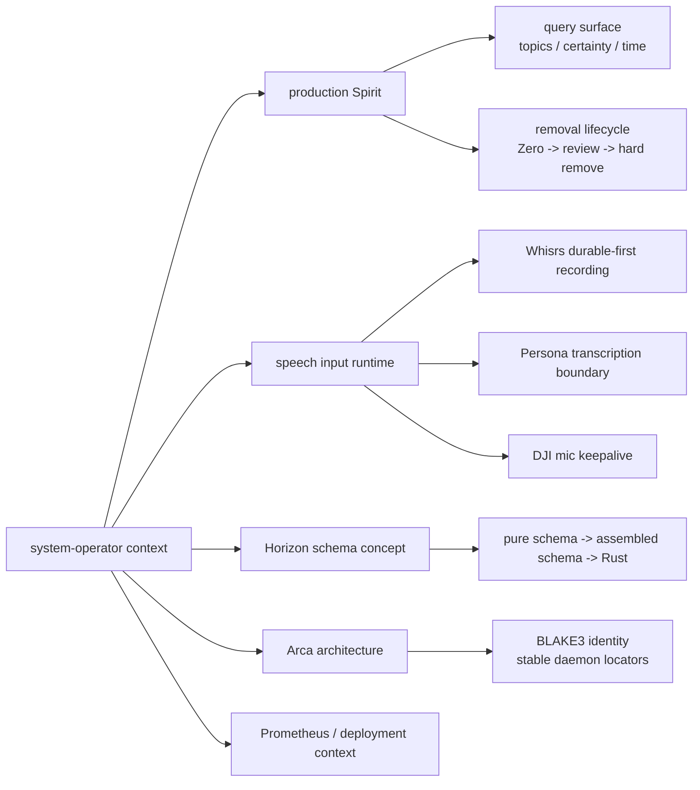

# Deep Context Maintenance - system-operator - 2026-05-30

Kind: context-maintenance
Role: system-operator
Scope: `reports/system-operator/` plus live conversation context carried by
this lane.

## Frame

The psyche asked for a deep `skills/context-maintenance.md` pass. This report
is the current system-operator ledger. It supersedes the prior maintenance
ledger at `reports/system-operator/169-context-maintenance-2026-05-28/` and
the recent context presentation at
`reports/system-operator/172-system-operator-recent-context-and-spirit-query-surface-2026-05-30.md`.

No new durable psyche intent was captured from the request itself. It was a
working order to maintain context, not a durable architecture decision.

## Method

I followed the context-maintenance rule: rank by topic across lane context,
then decide whether each report is a live root, an absorbed handoff, a
migration candidate, or disposable stale history. I checked live Spirit for the
current intent surface and re-read the active system-operator topic roots
before making deletion decisions.

The current live Spirit snapshot changes the status of the previous report
surface. Production Spirit now supports:

- multi-topic `Partial` and `Full` topic matching;
- `SummaryOnly` observation mode;
- `Magnitude::Zero` as the shared certainty floor;
- certainty mutation through `ChangeCertainty`;
- time/relative-recency filtering through the five-field `RecordQuery`;
- exact identifier and identifier-range observation.

The previous report's statements that recency filtering and live Zero queries
were still missing are now stale.

## Current Topic Spine

This lane is carrying five real topic roots: Spirit production surface, speech
input reliability, Horizon schema proof, Arca store architecture, and
production infrastructure context. The first has moved into code and skills;
the middle three still need their root reports preserved.

## Report Disposition

| Report path | Topic | Decision | Evidence |
|---|---|---|---|
| `reports/system-operator/1-whisrs-durable-first-stt-research-2026-05-17.md` | Whisrs durable-first recording | Keep | Still carries the durable `RecordingSession`, artifact-first capture, attempt ledger, and retry-after-failure model. This has not yet been fully migrated into Whisrs or CriomOS-home permanent docs. |
| `reports/system-operator/2-persona-speech-component-brainstorm-2026-05-17.md` | Persona transcription component boundary | Keep | Still carries the `persona-transcription` boundary and raw-audio data-plane carve-out. It should migrate only when the Persona speech/transcription component has permanent repo docs. |
| `reports/system-operator/139-arca-daemon-content-addressed-store-architecture-2026-05-17.md` | Arca content-addressed store | Keep | Still carries the full-digest identity versus stable locator distinction and `/arca` system-root argument. This belongs in Arca permanent docs later, but it has not been fully absorbed. |
| `reports/system-operator/166-dji-mic-profile-churn-fix-2026-05-28.md` | DJI mic keepalive | Keep | Current operational fix report. It records the deployed profile-reassertion behavior and the remaining Bluetooth-drop risk. |
| `reports/system-operator/167-horizon-pure-schema-concept-prototype-2026-05-28.md` | Horizon schema prototype | Keep | Current proof artifact for pure schema import, assembled schema, and Rust emission. It is still useful evidence for Horizon/schema pipeline work. |
| `reports/system-operator/169-context-maintenance-2026-05-28/` | Old maintenance ledger | Drop | Absorbed here. Its active Spirit handoff is complete, and the prior drop/keep decisions are reissued in this report. |
| `reports/system-operator/172-system-operator-recent-context-and-spirit-query-surface-2026-05-30.md` | Recent context presentation | Drop | Absorbed here. Its Spirit gap statements are now stale after the production deployment; its live topic roots are preserved or reclassified here. |

## Absorbed Maintenance Ledger

The 2026-05-28 maintenance ledger correctly retired the old cloud, NOTA,
DJI, and schema-stack clutter that preceded this pass. Its useful current
content was:

- keep reports `1`, `2`, `139`, `166`, and `167`;
- migrate `139` to Arca docs later;
- migrate reports `1` and `2` into Whisrs or Persona speech docs before
  retirement;
- treat the old Spirit deployment work as active until production Spirit was
  deployed.

This report keeps the first three decisions. The last item is now closed:
production Spirit was implemented, pinned through home/system lock files, and
activated locally.

## Absorbed Recent Context Report

The 2026-05-30 recent context report usefully connected the topics, but it
became stale within the same day because production Spirit changed. Its
durable pieces land here as follows:

- Spirit query surface: replaced by the live production state in this report
  and the current `skills/spirit-cli.md`.
- Prometheus production base: retained as background context only; not kept as
  an active system-operator report because there is no current Prometheus task
  in this lane.
- Speech runtime: split back into the durable reports `1`, `2`, and `166`.
- Horizon schema concept: preserved as report `167`.
- Arca architecture: preserved as report `139`.

## Spirit Production State

Production Spirit is no longer an open deployment handoff. The relevant landed
state is:

| Surface | Landing |
|---|---|
| `signal-persona-spirit` | `1bb22635` - `signal-persona-spirit: add recorded time queries` |
| `persona-spirit` | `c5a3eb9b` - `persona-spirit: filter records by recorded time` |
| `persona-spirit` tag | `v0.3.0.1` |
| `CriomOS-home` | `cc6bb3d2` - `home: update production spirit` |
| `CriomOS` | `1cf0b747` - `flake.lock: repin criomos-home for production spirit` |
| primary skills | `180e6f2b` - `skills: document production spirit recency queries` |

Live probes after activation showed:

- `(Exact Zero)` parses and returns results;
- `Recent` works with topic filters;
- `Since` works with topic filters;
- `ChangeCertainty` reaches daemon validation instead of failing syntax decode;
- both production and next persona-spirit user services are active.

The remaining Spirit work is not "make these features live"; it is the next
design layer:

- weighted keyword or Nexus-style scoring is exploratory, per recent intent;
- hard removal still needs the discipline of tombstone capture before delete;
- schema-derived Spirit remains a larger migration, not this maintenance pass.

## Speech Runtime State

The speech context should not be collapsed too aggressively. It has three
different layers:

| Layer | Current report | Why it remains separate |
|---|---|---|
| Durable-first STT | `reports/system-operator/1-whisrs-durable-first-stt-research-2026-05-17.md` | It describes the object model: durable recording first, then transcription attempts. |
| Persona transcription component | `reports/system-operator/2-persona-speech-component-brainstorm-2026-05-17.md` | It describes the component boundary and Signal/data-plane split. |
| DJI mic hot-path reliability | `reports/system-operator/166-dji-mic-profile-churn-fix-2026-05-28.md` | It documents a concrete deployed keepalive repair and remaining Bluetooth risk. |

Next migration target: move the durable-first and Persona boundary decisions
into the future Whisrs / Persona transcription repo docs once that work resumes.

## Horizon Schema State

Report `reports/system-operator/167-horizon-pure-schema-concept-prototype-2026-05-28.md`
should remain. It is not just design prose; it records a working concept in
`schema-rust-next`:

- authored pure schemas with imports;
- schema loading into assembled schema;
- Rust emission;
- generated import bridges;
- NOTA `Project` signal parsing into generated Horizon-domain types.

Its live gaps are still accurate:

- first-class vector/list cardinality;
- shared generated core primitives;
- decision on Horizon as pure projection library, triad component, or both.

This report should be referenced by future Horizon/schema agents rather than
deleted.

## Arca State

Report `reports/system-operator/139-arca-daemon-content-addressed-store-architecture-2026-05-17.md`
should remain until the Arca repo permanently carries its design. The
load-bearing distinction is:

- full BLAKE3 digest is object identity;
- filesystem path is a stable daemon-allocated locator;
- exposed locators are never renamed;
- later collisions get longer prefixes;
- `/arca` is the likely system-service root for CriomOS/lojix integration.

The report belongs in Arca's permanent `ARCHITECTURE.md` and `INTENT.md` later,
but keeping it here is correct until that migration is done.

## Prometheus And Infrastructure Context

Prometheus backup access and Gemma serving were included in the absorbed recent
context report because they were close in time to Spirit work. They are not a
live system-operator report root now.

The current baseline to remember is:

- Prometheus is the preferred remote builder / high-thermal-capacity machine;
- it has had backup management-path work for router recovery;
- it has been used for LLM-serving updates;
- future heavy builds should avoid local laptop thermal stress and dispatch to
  the builder stack.

If Prometheus changes again, create a new task-specific report instead of
reviving the absorbed context presentation.

### 2026-05-31 quantized Gemma deployment addendum

Prometheus changed again in a narrow LLM-serving deployment, so the current
baseline is:

- CriomOS-lib commit `1d1726a186f6` adds suffixed Gemma 4 quant variants:
  BF16 aliases plus `ud-q4-k-xl` and `ud-q8-k-xl` for both 26B-A4B and 31B.
- CriomOS generation 48 was built from pushed `github:LiGoldragon/CriomOS/main`
  on Prometheus, booted through BootOnce, verified, and promoted to the
  persistent default.
- Prometheus `/v1/models` lists all new Gemma 4 variant identifiers.
- `gemma-4-26b-a4b-ud-q4-k-xl` was verified with a text load and an image
  request; llama.cpp loaded `mmproj-F16` and returned the text drawn in the
  image.
- CriomOS-home commit `a43ff141bfd9` repins CriomOS-lib for the same model
  inventory and was activated locally; Pi can now select the new local model
  identifiers, and a headless Pi probe using
  `criomos-local/gemma-4-26b-a4b-ud-q4-k-xl` returned `OK`.

## Current Working-Copy Boundary

At the time of this pass, an unrelated system-designer file is dirty:

`reports/system-designer/50-cross-lane-context-maintenance-2026-05-30/0-frame-and-method.md`

This system-operator pass does not touch or commit that file. The only intended
changes from this pass are this report plus deletion of the two superseded
system-operator context surfaces.

## Handoff

Active system-operator reports after this pass should be:

- `reports/system-operator/1-whisrs-durable-first-stt-research-2026-05-17.md`
- `reports/system-operator/2-persona-speech-component-brainstorm-2026-05-17.md`
- `reports/system-operator/139-arca-daemon-content-addressed-store-architecture-2026-05-17.md`
- `reports/system-operator/166-dji-mic-profile-churn-fix-2026-05-28.md`
- `reports/system-operator/167-horizon-pure-schema-concept-prototype-2026-05-28.md`
- `reports/system-operator/173-deep-context-maintenance-2026-05-30.md`

Recommended next actions:

1. Migrate Arca report `139` into the Arca repo when Arca work resumes.
2. Migrate Whisrs/Persona reports `1` and `2` into permanent speech-component
   docs when that component work resumes.
3. Keep `166` until DJI mic keepalive behavior is stable enough to become a
   runbook or permanent CriomOS-home architecture note.
4. Use `167` as the system-operator evidence report for any future Horizon
   schema pipeline discussion.
5. Treat production Spirit query syntax as live and documented in
   `skills/spirit-cli.md`; do not resurrect older statements from report `172`.
