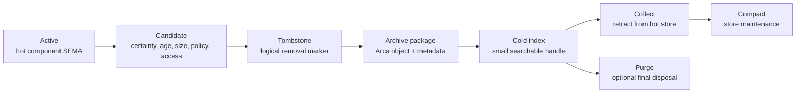

# Component Data Archival And Garbage Collection

## Question

The immediate question came from Production Spirit: where is the
functionality that removes records whose certainty has been lowered to
`Zero`?

Short answer: it is not present as a batch garbage-collection operation.
Production Spirit has:

- reversible nomination: `ChangeCertainty (N Zero)`;
- review: `Observe ... (Exact Zero) ...`;
- irreversible per-record hard removal: `Remove N`.

It does not have an operation that says "archive every reviewed
zero-certainty record, then retract it from the hot store."

I captured the durable intent as:

- [Production Spirit zero-certainty review is not the same as deletion;
  the system should expose an explicit garbage-collection path for
  removing reviewed records whose certainty is Zero.]
- [Component data lifecycle should prefer explicit archival lowering
  before hard deletion: stale or low-certainty data is marked and moved
  out of the hot working database to keep runtime state manageable, while
  recoverability is best-effort rather than guaranteed unless a stronger
  retention class says otherwise.]

## Current Production Spirit State

The deployed Spirit skill describes `Remove` as a hard per-record delete
and `ChangeCertainty` as the recoverable nomination path:

- `skills/spirit-cli.md` lines 175-197: `Remove` returns
  `RecordRemoved`; `ChangeCertainty` to `Zero` leaves the record
  queryable and restorable.
- `skills/spirit-cli.md` lines 207-240: `(Exact Zero)` is the live
  review query for removal candidates.
- `skills/intent-maintenance.md` lines 71-106: hard removal must be
  tombstoned into a report first because recovery is not available after
  removal.

The persona-spirit runtime implements exactly that shape:

- `/git/github.com/LiGoldragon/persona-spirit/src/store.rs` lines
  102-107 hard-retract one identifier.
- `/git/github.com/LiGoldragon/persona-spirit/src/store.rs` lines
  109-119 mutates certainty in place.
- `/git/github.com/LiGoldragon/persona-spirit/src/store.rs` lines
  162-173 filters records for queries.
- `/git/github.com/LiGoldragon/persona-spirit/src/observation.rs` lines
  52-59 maps requests to `RemoveRecord` and `ChangeCertainty`.
- `/git/github.com/LiGoldragon/persona-spirit/src/observation.rs` lines
  132-149 projects `RemoveRecord` to SEMA `Retract` and
  `ChangeCertainty` to SEMA `Mutate`.

The architecture file says the same thing: `Zero` nominates for review,
while `Remove` is irreversible. The tests prove both, but no test names a
batch collection operation.

Open workspace bead `primary-m89k` (Spirit removalCandidates
soft-delete) remains a real implementation target, but the phrase
"soft-delete" is now too narrow. The actual target should be
"archive-then-collect removal candidates."

## Field Research

### Database Tombstones And Compaction

Apache Cassandra is the clearest distributed reference. Deletes become
timestamped tombstones, not immediate physical removal. Tombstones carry a
grace period so offline replicas do not resurrect deleted data when they
come back. Only after the grace period and a compaction event can the
tombstone be removed. Cassandra's docs also warn that tombstones are kept
until a compaction includes the tombstone and the data it shadows.

This maps directly to our components:

- "nominate" is not "delete";
- the deletion marker itself must survive long enough for observers,
  replicas, and archival paths to see it;
- final physical purge belongs to a maintenance pass with explicit
  preconditions.

### MVCC Vacuum

PostgreSQL's `VACUUM` shows the classic database maintenance split:
delete or update makes tuples dead, and a separate vacuum process
reclaims them. Plain vacuum can usually run alongside normal use but
does not always return space to the operating system; full vacuum rewrites
the table and is slower and more disruptive.

SQLite's `VACUUM` is the simpler single-file version: rebuild the
database to reclaim free pages, reduce fragmentation, and remove traces
of deleted content from the file. The important lesson is operational:
physical reclamation is a distinct maintenance mode, not the same event
as logical removal.

### Object Lifecycle Rules

S3 and Google Cloud Storage lifecycle systems split object policy into
conditions and actions: age, prefix, tags, version state, storage class,
soft-delete, retention holds, transition, and expiration. Actions can be
delayed, and conflicting rules have explicit precedence. Google Cloud's
page also makes the soft-delete point directly: lifecycle delete may put
objects into a recoverable soft-delete window first, unless that feature
is disabled.

This suggests a component-wide policy shape:

- selection conditions are data, not ad hoc code;
- transition to cheaper storage and expiration are separate actions;
- deletion may be asynchronous;
- retention holds and pins override cleanup.

### Archival Standards

OAIS is the broad conceptual archive model: ingest, archival storage,
data management, administration, preservation planning, and access. It is
not a file format, but it gives the right lifecycle vocabulary.

OCFL is closer to our Arca direction: application-independent,
filesystem or object-store compatible, transparent, parsable, robust,
versioned, and storage-diverse. We do not need to adopt OCFL wholesale,
but Arca should borrow the shape: content-addressed objects plus metadata
that makes the archive understandable without the original daemon running.

PREMIS is the preservation-metadata standard family. Its useful idea for
us is not XML; it is the entity split: objects, events, rights, agents.
For our system, an archive record should say what object was archived,
which component and daemon version did it, what event happened, which
policy allowed it, and what recoverability promise was made.

### Sanitization And Non-Recoverability

NIST SP 800-88 frames final disposal as a separate confidentiality
problem. Deleted data can remain recoverable unless sanitization is
performed. For us, that means "purged from hot SEMA" and "not
recoverable from any archive or media" are different claims.

The user intent says archived data may be "possibly non-recoverable."
That should be explicit, not implied. A record can be archived under a
best-effort class where the system keeps a chain of archival evidence but
does not guarantee that payload bytes remain restorable forever.

## Proposed General Shape

The shared lifecycle should be:



The hot database should keep only what the component needs for normal
operation. Archive state should preserve a small index and a policy
record, not necessarily the full payload forever.

## Vocabulary

### Lifecycle State

These should be variants, not booleans:

```nota
(DataLifecycleState
  Active
  Candidate
  Tombstoned
  Archived
  Collectable
  Collected
  Purged)
```

`Purged` should usually exist only as an event or receipt. Once something
is purged, the original record is not expected to exist in the ordinary
component store.

### Recoverability Class

The recoverability promise should also be explicit:

```nota
(Recoverability
  Guaranteed
  BestEffort
  NotPromised
  Sanitized)
```

`Guaranteed` requires pins, replication policy, and integrity checks.
`BestEffort` means the archive chain records what happened, but storage
pressure or policy can eventually discard the payload. `NotPromised`
means the archive may keep only metadata. `Sanitized` is a stronger claim
and should be rare because it implies disposal discipline.

### Retention Policy

Retention should be policy data:

```nota
(RetentionPolicy
  (Ephemeral <duration>)
  (Working <duration>)
  (Historical <duration>)
  (Preserved <pin-policy>)
  (Secret <sanitization-policy>))
```

The exact schema needs design, but this is the shape: policy variants,
not isolated booleans.

## Component-Wide Algorithm

Every component that stores SEMA-backed data should eventually expose a
small maintenance surface:

1. Observe lifecycle pressure.
   - hot database byte size;
   - record count;
   - table bloat/free pages if available;
   - age;
   - access frequency;
   - certainty or confidence;
   - explicit expiry;
   - pins, leases, subscriptions, replication state.

2. Select candidates.
   - low-certainty records first;
   - stale records next;
   - large records when hot-store size is the pressure;
   - unaccessed records when read-load is the pressure;
   - never select pinned or policy-held records.

3. Tombstone or mark.
   - write an explicit lifecycle mutation;
   - keep the marker long enough for observers and archive workers;
   - never make an unobservable silent deletion.

4. Archive.
   - write payload and metadata to Arca when policy calls for payload
     retention;
   - write metadata-only receipts when recoverability is not promised;
   - record component, table, key, schema version, digest, event time,
     reason, policy, and actor/daemon identity.

5. Collect.
   - retract from hot SEMA after archive success or metadata receipt;
   - emit a receipt that can be queried.

6. Compact.
   - let the underlying storage reclaim space on its own cadence;
   - expose explicit maintenance operations when the store needs a full
     rewrite.

7. Purge.
   - optionally remove archive payloads when retention expires;
   - keep or emit a purge receipt if policy requires an audit trail.

## Production Spirit Application

Spirit should not gain a hidden background job that deletes all
`Zero`-certainty records. That would turn a reversible review marker into
an accidental destructive action.

The right first production operation is explicit:

```nota
(CollectRemovalCandidates
  <record-selection>
  <archive-policy>
  <retention-policy>)
```

For a minimal first version:

- selection is probably `Exact Zero` plus optional topic and recorded-time
  filters;
- archive policy defaults to `metadata + full WithProvenance text`;
- recovery promise defaults to `BestEffort`;
- hard `Remove` is applied only after the archive package or tombstone
  receipt is durably written;
- reply includes counts and identifiers:

```nota
(RemovalCandidatesCollected
  [<archived-identifiers>]
  [<removed-identifiers>]
  [<skipped-identifiers>])
```

The operation name should be revisited in the signal tree. It may belong
in owner-signal-spirit rather than ordinary signal-spirit because it is a
maintenance/destructive operation over a set. Production currently has
ordinary `Remove`; that does not settle the better future split.

## Arca Application

The existing Arca report already names the correct direction:

- Arca owns writes to `/arca`.
- Namespaces are garbage-collection boundaries.
- Pins and leases prevent garbage collection.
- Object records are append-friendly and audit-friendly.
- Cleartext secrets are not casual archive payloads.

That matches this design. Arca should become the cold plane for component
archive payloads and receipts. Components keep the hot operational
records; Arca keeps content-addressed payloads, retention metadata, pins,
leases, and replication state.

## SEMA Application

SEMA should probably not get a new primitive verb yet. The existing
operation vocabulary can express the first version:

- `Mutate` for lifecycle-state changes;
- `Assert` for archive receipt records;
- `Retract` for hot-store removal;
- `Match` for candidate queries.

What SEMA may need is a shared schema family for lifecycle records and a
storage-maintenance API for compaction/vacuum-like work. The store engine
must expose enough information for components to make cleanup decisions
without scanning entire hot stores in chat tools or ad hoc scripts.

## Constraints

1. Zero certainty is review, not deletion.
2. No silent background hard deletion for intent records.
3. Every hard removal must have a prior archive receipt or tombstone
   capture.
4. Recoverability is an explicit policy, not an implication.
5. Archive payload retention can be best-effort unless pinned or
   guaranteed.
6. Pins, leases, active subscriptions, and retention holds block
   collection.
7. Compaction is separate from logical deletion.
8. Full sanitization is a separate class from ordinary purge.
9. Component cleanup policies are variants, not booleans.
10. The filesystem is not the reachability source of truth for Arca.

## Tests To Add

For Production Spirit:

- `zero_certainty_records_are_observable_before_collection`
- `collect_removal_candidates_archives_before_retracting`
- `collect_removal_candidates_skips_non_zero_certainty`
- `collect_removal_candidates_respects_topic_and_time_filter`
- `collect_removal_candidates_returns_archived_removed_skipped_counts`
- `collected_records_do_not_reappear_in_summary_observation`
- `collection_receipt_remains_queryable_after_hot_record_removed`
- `collection_does_not_run_when_archive_write_fails`

For Arca:

- `pinned_archive_object_is_not_garbage_collected`
- `best_effort_archive_payload_can_expire_but_receipt_survives`
- `archive_receipt_records_full_digest_and_component_key`
- `secret_payload_requires_secret_archive_policy`

For SEMA:

- `lifecycle_mutation_projects_to_mutate`
- `hot_record_collection_projects_to_retract`
- `store_compaction_reclaims_after_retraction_when_safe`

## Best Next Step

Rename or replace bead `primary-m89k` so it stops saying only
"soft-delete" and says the real target:

```text
Production Spirit: implement archive-then-collect for Zero-certainty
removal candidates.
```

Then implement the first minimal Spirit operation without waiting for the
full Arca daemon:

1. Query exact `Zero` candidates.
2. Capture `WithProvenance` into a durable local archive/receipt table or
   report-backed fixture if Arca is not live.
3. Retract each successfully archived record.
4. Return a typed receipt.

Once Arca is live, replace the local archive target with Arca payloads and
content-addressed receipts.

## Sources

- Apache Cassandra, tombstones and compaction:
  https://cassandra.apache.org/doc/stable/cassandra/managing/operating/compaction/tombstones.html
- PostgreSQL `VACUUM`:
  https://www.postgresql.org/docs/current/sql-vacuum.htm
- SQLite `VACUUM`:
  https://www.sqlite.org/lang_vacuum.html
- Oxford Common File Layout:
  https://ocfl.io/
- PREMIS preservation metadata:
  https://www.loc.gov/standards/premis/index.html
- OAIS glossary:
  https://www.digitizationguidelines.gov/term.php?term=oais
- NIST SP 800-88 media sanitization:
  https://www.nist.gov/publications/guidelines-media-sanitization-0
- AWS S3 lifecycle expiration:
  https://docs.aws.amazon.com/AmazonS3/latest/userguide/lifecycle-expire-general-considerations.html
- Google Cloud Storage Object Lifecycle Management:
  https://docs.cloud.google.com/storage/docs/lifecycle
