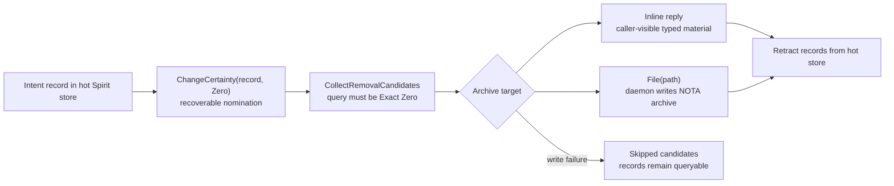
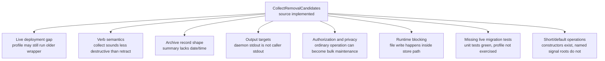
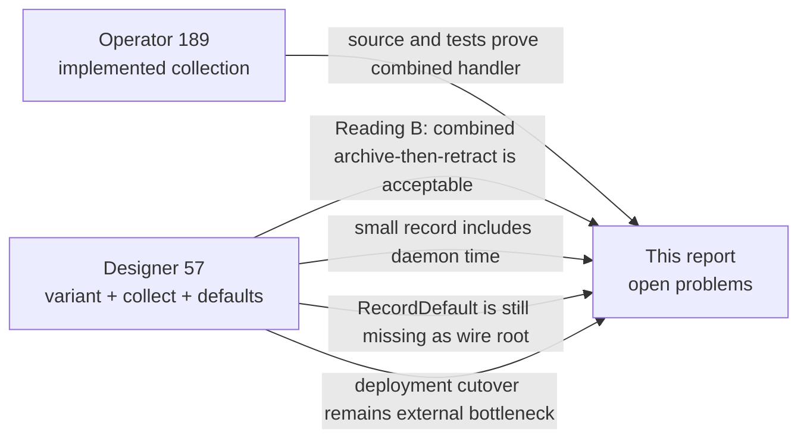
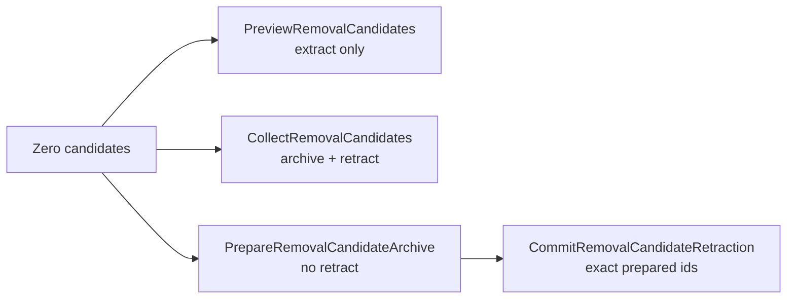
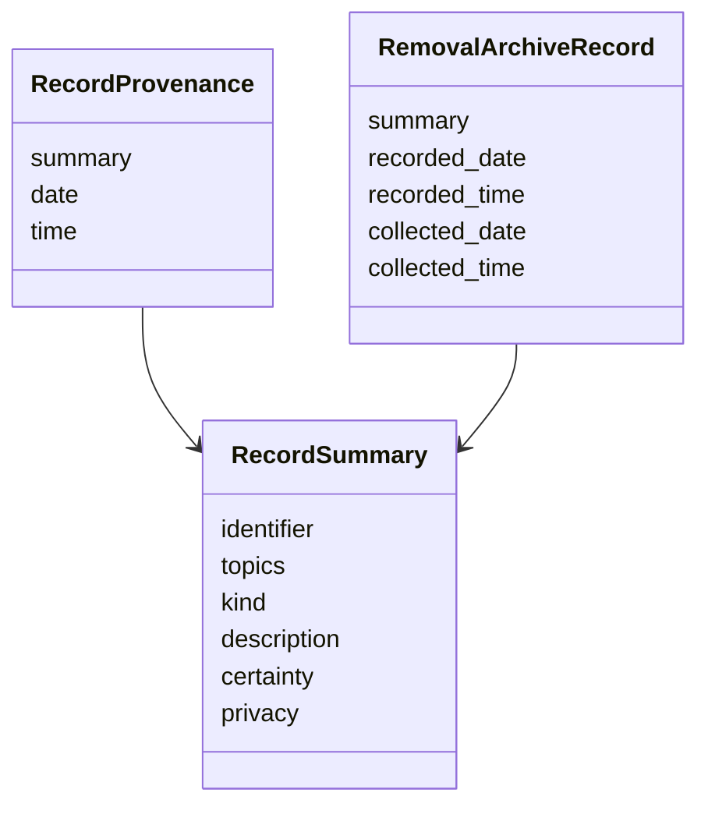
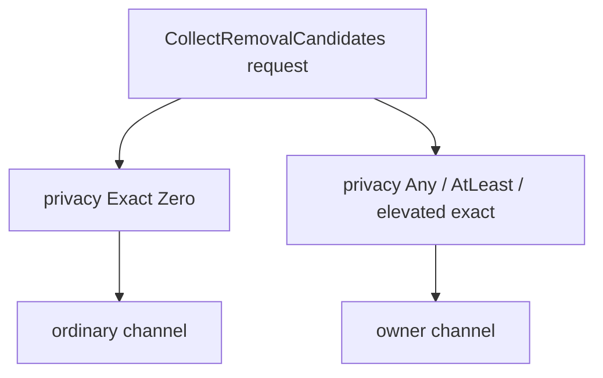
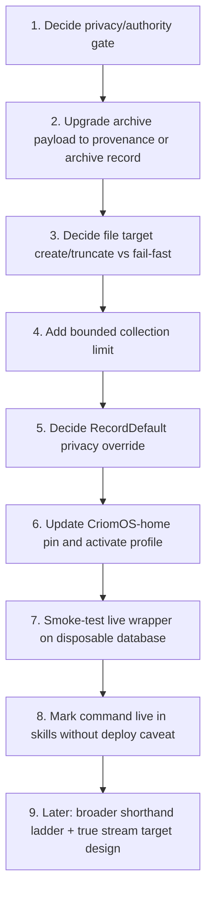

# Spirit Removal-Candidate Collection Open Problems - Psyche Report

Kind: psyche-facing operator report

Topics: spirit, removal-candidates, archival, shorthand, deployment, authorization

Date: 2026-06-03

## Purpose

This report shows the open problems left after the production-source
implementation of Spirit `CollectRemovalCandidates`.

Load-bearing intent:

- [Production Spirit should implement an explicit collect-removal-candidates operation that archives or emits reviewed Zero-certainty records before retracting them from the hot store.]
- [Spirit removal-candidate collection should support an explicit output target for archive material, such as a file path or process stream, so another component can preserve the compact valued representation before hot-store removal.]
- [Common Spirit operations should have short default forms that lower to the full data types, so agents do not have to compose every rarely-configured field for routine calls.]

The source implementation exists and tests pass. The remaining problems
are about whether this is the exact shape we want to make live, and how
to keep the operation from quietly becoming a dangerous bulk-delete
surface.

## Current Source State

Production source now has the following:

- `signal-persona-spirit` commit `a69769b3`: ordinary signal operation
  `CollectRemovalCandidates`, `ArchiveTarget::{Inline, File}`, typed
  reply `RemovalCandidatesCollected`.
- `persona-spirit` commit `7233075c`: runtime handler that reads exact
  `Zero` candidates, writes archive material, then retracts only after
  archive success.
- `primary` commit `144ce383`: skills and report documentation.
- Closed bead `primary-m89k`: Zero-certainty soft-removal path and
  candidate collection are now implemented in source.

What is not true yet: the installed user-profile `spirit` wrapper may
still point at an older pinned `persona-spirit` commit until CriomOS-home
updates the flake lock and the profile is activated.

## Current Flow



This is a safe first source implementation for archive-before-retract.
The important caveat is that the operation is not a pure extraction
operation. It is a maintenance sweep: if the archive step succeeds, the
records leave the hot database.

## Open Problem Map



## Reconciliation With Designer Report 57

The designer meta-report
`reports/system-designer/57-spirit-engine-variant-and-collect-vision-2026-06-03/`
adds important nuance to this report.



Agreement:

- Designer 57 and operator 189 both converge on Reading B: the current
  combined archive-then-retract handler is acceptable if the operation is
  documented as a maintenance sweep, not a pure read.
- Designer 57 and this report agree that live deployment is still a
  separate problem.
- Designer 57 and this report agree that `RecordDefault` and the broader
  shorthand ladder are not implemented as signal roots.

Correction to this report's emphasis:

- Designer 57 treats daemon-stamped date/time in the small archive record
  as part of the directed target shape, not merely a nice-to-have. This
  report therefore upgrades "archive material may be too small" from a
  soft improvement to a pre-deploy correction.

Additional decisions imported from Designer 57:

- **File target semantics.** Current code uses create-or-truncate file
  behavior. The open policy choice is whether Spirit should create a
  missing archive file or fail-fast unless the archive path already
  exists. The implementation currently chooses create-or-truncate.
- **RecordDefault privacy override.** `Entry::open` defaults privacy to
  `Zero`; the wire-level `RecordDefault` twin must decide whether callers
  can override privacy or must fall back to full `Record`.
- **Small-record privacy field.** The directed list omitted privacy, but
  existing `RecordSummary` includes privacy. If the archive record drops
  privacy, downstream tools lose the access classification at collection
  time.
- **Witness-test style.** Designer 57 wants the source/deploy gap tested
  explicitly, not assumed solved by unit tests.

## Problem 1 - Source Complete Is Not Live

The production source is updated, but live usability depends on the
CriomOS-home pin and the user profile. The designer-side report
`reports/system-designer/57-spirit-engine-variant-and-collect-vision-2026-06-03/2-designer-psyche-analysis.md`
observed the same issue earlier: the live wrapper had not yet routed
the new operation.

Why it matters: agents reading `skills/spirit-cli.md` may try the new
operation and get an unknown-head error if the profile is stale.

Suggestion:

1. Update CriomOS-home to pin `persona-spirit` commit `7233075c`.
2. Build and activate the profile with low local build pressure.
3. Smoke-test the live wrapper with a fixture or disposable database
   before touching the real intent store.
4. Only then treat `CollectRemovalCandidates` as live operator tooling.

Recommendation: do this as an explicit deployment slice, not as an
incidental profile update.

## Problem 2 - The Name Understates Destruction

`CollectRemovalCandidates` currently means archive-and-retract. That is
useful, but the word `Collect` can read like pure extraction.

There are three coherent semantic choices:



Suggestion:

- Keep the current operation as the maintenance sweep if the contract
  explicitly says archive-before-retract.
- Add a pure preview/read operation only if `Observe` plus exact-Zero
  query is not ergonomic enough.
- If humans or agents need to pipe archive material to external tools
  before removal, add a two-phase prepare/commit path instead of
  overloading `Collect`.

Recommendation: keep the current combined operation, but document it as
destructive maintenance and consider a stronger verb later:
`ArchiveRemovalCandidates` or `SweepRemovalCandidates`.

## Problem 3 - Archive Material May Be Too Small

The current archive material is compact `RecordSummary`: identifier,
topics, kind, description, certainty, and privacy. It does not include
daemon-stamped date/time.

The user-facing intent asked for "summaries and whatever else is
considered like the core valued part of the record." The designer-side
analysis in
`reports/system-designer/57-spirit-engine-variant-and-collect-vision-2026-06-03/2-designer-psyche-analysis.md`
argued that the small archive shape should include daemon-stamped date
and time.

Why it matters: once records leave the hot store, date/time becomes part
of the archival value. Without it, the archive preserves what was said
but not when Spirit recorded it.

Suggestion:



Recommendation: upgrade archive material to include daemon-stamped
date/time before deployment. Designer 57 makes this part of the intended
small-record direction, so this should no longer be treated as optional
polish. Use one of two shapes:

- `RecordProvenance` if we only need the original daemon-stamped record
  time and want to reuse existing vocabulary.
- `RemovalArchiveRecord` if we also want collection time and a stronger
  archive receipt.

I now favor `RemovalArchiveRecord` only if collection time matters;
otherwise `RecordProvenance` is the smaller correction.

## Problem 4 - True Stream Targets Are Not Implemented

The user asked about stdout/stderr-style output targets. The
implementation deliberately did not add them because a daemon writing to
its own `stdout` is not writing to the CLI caller's terminal or pipe.

Why it matters: a fake `StandardOutput` target would look right in the
contract while sending archive material to daemon logs or nowhere useful.

Suggestion:

- `Inline` is the correct caller-visible target for normal CLI use.
  The CLI receives typed reply material and renders it to stdout.
- `File(path)` is the correct durable first archive target.
- Real stream targets need either:
  - SCM_RIGHTS file-descriptor passing, so the daemon writes to a caller-owned descriptor;
  - two-phase prepare/commit, so the caller writes the stream and then asks the daemon to retract exact prepared identifiers;
  - ARCA archive objects, once ARCA is ready.

Recommendation: do not implement raw daemon stdout/stderr. Keep bead
`primary-flwg` open for the real design.

## Problem 5 - Privacy And Authority Are Not Settled

The operation lives in the ordinary signal contract. That makes sense
for local agent ergonomics, but it is also a bulk maintenance operation:
it removes records from the hot store after archiving.

There are two separate concerns:

- Privacy filtering: default candidate queries only touch `privacy =
  Zero`, but a caller can construct other privacy selections unless the
  runtime forbids it.
- Authority: a destructive maintenance sweep may deserve owner-channel
  authority even if single-record `Remove` remains ordinary.

Why it matters: once privacy tiers matter, collection should not
silently sweep `Personal`, `Sensitive`, or `Sealed` records because an
agent used a broad privacy selector.

Suggestion:



Recommendation: before deployment, either:

1. Restrict ordinary `CollectRemovalCandidates` to both `certainty =
   Exact Zero` and `privacy = Exact Zero`; or
2. Move collection to the owner signal contract; or
3. Split it: ordinary may collect public Zero records, owner may collect
   elevated privacy records.

I favor option 3. It preserves agent ergonomics for public workspace
cleanup while respecting the privacy axis.

## Problem 6 - File Archive Writes Can Block The Store Path

The implementation writes archive material before retracting. That is
correct for safety, but it also means file output happens inside the
store command path.

Why it matters: if the archive path is slow, remote, blocked, or very
large, Spirit's store actor could be held up. This is probably fine for
small intent batches, but it is the same architectural pattern we have
learned to watch carefully: a slow side effect inside a state mutation
path.

Suggestion:

- Keep the first implementation because the batch size is expected to be
  small.
- Add a candidate-count cap or explicit limit before live deployment.
- Move larger archive work to a separate archive actor or two-phase
  prepared object when Spirit starts collecting large batches.

Recommendation: add a hard limit to the request or runtime default, even
if the first limit is generous. A destructive sweep should never be
unbounded by accident.

## Problem 7 - Some Skip Reasons Are Ahead Of The Runtime

The contract has skipped reasons:

- `ArchiveFailed`
- `RecordChanged`
- `RecordAlreadyRemoved`
- `NoLongerCandidate`

The first one is exercised. The others describe possible future
concurrency or two-phase behaviors, but the current single store actor
path may not produce them.

Why it matters: dead or unreachable variants are not fatal, but they
make the contract look more mature than the runtime.

Suggestion:

- Keep the variants if two-phase or concurrent collection is likely.
- Add tests that force each variant once the runtime can produce them.
- Until then, document that only `ArchiveFailed` is expected from the
  current source implementation.

Recommendation: keep them for now, but add a contract note in
`signal-persona-spirit/ARCHITECTURE.md` that distinguishes current
reachable skip reasons from future prepared-collection reasons.

## Problem 8 - Named Shorthand Operations Are Not Done

Short constructors exist in Rust:

- `RemovalCandidateCollection::inline()`
- `RemovalCandidateCollection::file(path)`
- compatibility decoding defaults privacy when omitted

But the user asked for short/default Spirit operations so agents do not
hand-compose full records every time. That broader ladder is not
implemented as signal roots.

Why it matters: the current NOTA call is still heavy:

```nota
(CollectRemovalCandidates (((Any []) None (Exact Zero) Any (Exact Zero) SummaryOnly) Inline))
```

That is correct but not ergonomic.

Suggestion:

Possible short roots:

```nota
(CollectRemovalCandidates Inline)
(CollectRemovalCandidates (File [/tmp/spirit-removal-candidates.nota]))
(RecordDefault ([spirit] Decision [summary] High))
(RecordPrivate ([personal] Clarification [summary] High Sensitive))
```

Recommendation: do not add many shorthand roots in production yet.
First settle the schema-derived Spirit-next operation ladder, then bring
back the minimal stable subset to production. Bead `primary-am9d` tracks
this.

Designer 57 adds one exception to that caution: `RecordDefault` is not an
arbitrary shorthand from the large ladder. It is the wire-level twin of
the already-existing `Entry::open` constructor, which defaults privacy to
`Zero`. That makes `RecordDefault` a stronger candidate for production
than the broader `Recent` / `Today` / `Lookup` read-shortcut family.

Recommendation refined: implement `RecordDefault` before the broader
ladder if the privacy override semantics are settled. Keep the larger
read-shortcut family behind bead `primary-am9d`.

## Suggested Next Sequence



My recommendation is:

1. Do not deploy the source exactly as-is until the privacy/authority
   gate is settled.
2. Upgrade archive material to include daemon-stamped date/time before
   first real use.
3. Decide whether archive file targets create/truncate or fail-fast.
4. Add a runtime collection limit.
5. Decide `RecordDefault` privacy override semantics if it ships in the
   same slice.
6. Deploy through CriomOS-home only after the above are done.
7. Leave stdout/stderr and the broad shorthand ladder for separate
   follow-up work.

## Open Beads

- `primary-am9d` - Spirit named shorthand operation ladder. This covers
  explicit short/default signal roots such as `RecordDefault`.
- `primary-flwg` - true stream archive targets. This covers
  stdout/stderr-like behavior using a real protocol rather than daemon
  process streams.

## Bottom Line

The implemented code is a good first maintenance engine, but I would not
call the feature complete for live use yet. The two hardening changes I
would make before deployment are:

1. authority/privacy gating so collection cannot sweep elevated privacy
   records through an ordinary broad query;
2. provenance-rich archive material so removed records keep their
   daemon-stamped time.

After those, decide file-target create/truncate semantics and add a
bounded collection limit. The existing `Inline` and `File` target model
is then strong enough to use. True stream targets should remain a
separate follow-up slice. `RecordDefault` can ship earlier than the
broader shorthand ladder because it is the wire-level twin of existing
`Entry::open`, not just a convenience alias.
