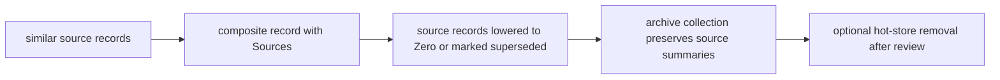

# Spirit record-shape and Horizon/Logix rewrite reacquisition

System-operator lane. 2026-06-04.

This report rebuilds the compacted context around the Horizon/Logix rewrite and
the fresh Spirit record-shape intent. It is not an implementation commit:
`operator` currently holds `/git/github.com/LiGoldragon/spirit` and
`/git/github.com/LiGoldragon/schema-rust-next`, and `spirit` has active
uncommitted plane-split work. I did not edit locked source.

## Intent captured this pass

The psyche prompt contained durable public Spirit intent, and I captured these
records before doing the survey:

- [Spirit should support composite intent records that reference older intent
  records as source material, so repeated or closely related intent can be
  agglomerated into a newer stronger record without losing provenance.]
- [Spirit records should distinguish certainty from weight: certainty is
  confidence in the statement, while weight is accumulated importance or
  reinforcement, especially for composite records derived from multiple source
  records.]
- [Spirit intent records should be shaped as specific variants whose fields
  match their semantic needs; private record variants carry privacy data, while
  public record variants should not carry unused privacy fields.]
- [Intent agglomeration must preserve provenance and archival recoverability
  before source records are removed or replaced, because collapsing old intent
  into composite records is useful but dangerous.]

Recent Spirit also already contained a closely aligned capture from another
lane:

- [Spirit record fields should vary by record kind rather than every record
  carrying every field - eliminate the fields a given kind does not use.
  Concretely a private-bearing record carries a privacy field while an ordinary
  public record omits it, reducing the total field count and giving each kind a
  tighter purpose-fit shape.]

That means the record-shape direction is now more than a single prompt. It is a
fresh cluster of aligned records.

## Fresh rewrite anchors

The current high-signal Horizon/Logix intent is:

- [Finish the Horizon and Logix lean rewrite to the point of cutover and retire
  the dual production-and-next deploy stacks.]
- [Horizon is more of a hack for now and that is acceptable - it stays the
  simple projection surface, not a full triad component. Logix, the lojix
  component, is the more traditional component that receives the full
  triad-engine and schema-based-component port.]
- [Horizon and the cluster-data it carries should be elegant and minimal - they
  express only WHAT the psyche as cluster user wants the cluster to do, never
  HOW and never decision-making.]
- [Cluster-data node-service features must be TYPED end-to-end, never
  string-keyed.]
- [The bundled triad runner adapter is generated glue only. Component authors
  implement the three plane engines plus the effect handler and
  budget-exhausted reply; the generator bundles those surfaces for the shared
  runner instead of making authors hand-write a fourth engine surface.]
- [The triad engine separation is strict and absolute: the SEMA engine owns ALL
  database and durable-state code, the Nexus engine owns ALL decision-making,
  and the Signal engine owns ALL communication.]

## Horizon/Logix current state

There are three relevant states:

1. Production Stack A still exists: `horizon-rs`, `lojix-cli`, `CriomOS`,
   `CriomOS-home`, `goldragon` on main.
2. The canonical `/git/github.com/LiGoldragon/lojix` checkout is still mostly
   a namespace/architecture skeleton; it has no `Cargo.toml`, `src`, or
   `schema` in main.
3. The most real Logix rewrite code is in
   `/home/li/wt/github.com/LiGoldragon/lojix/schema-deep-iteration-2`.
   It has schema-driven generated nouns, a Kameo actor topology, a
   `NexusMailKeeper`, SEMA-backed store, `DatabaseMarker` on replies,
   `Communicate`, and sandbox witness tests.

The current `lojix/schema-deep-iteration-2` architecture says one authored
`schema/lojix.schema` generates wire roots, SEMA commands/responses, actor
mailbox types, daemon configuration, database markers, mail lifecycle, and
reply payloads. Handwritten runtime code then implements actors over those
schema-emitted nouns.

That is useful, but it is not yet the final shared-triad-runner shape. The
latest runtime reports say `triad-runtime` should own the generic runner loop,
transport, lifecycle, and budget, while `schema-rust-next` emits a thin adapter
over the component's three engine traits. Logix should be ported toward that
runner rather than keeping a bespoke Kameo pilot forever.

## Horizon shape mismatch to resolve

The Horizon rewrite branch still carries older shape in places:

- `NodeServices` is a record with optional fields like `tailnet` and
  `tailnet_controller`, rather than a vector of typed feature variants.
- `TailnetControllerRole::Server { port }` still carries a port in Horizon
  data.
- `ClusterProposal` still carries cluster domain/public-domain fields and
  profile/catalog fields that need a fresh constants-versus-cluster-data
  boundary pass.
- `NodeProposal` still has several booleans (`nordvpn`, `wifi_cert`,
  `wants_printing`, `wants_hw_video_accel`) that may be fine as user dials but
  should be compared against the newer "variants first" direction.

This does not mean the branch is useless. It means it predates the latest
cluster-data correction. Before cutover, Horizon needs another lean pass:
cluster data should author typed "what" variants and simple user dials; Horizon
and CriomOS should derive domains, ports, service implementations, and other
standardized "how" values.

## Spirit current state

There are two Spirit implementations:

- Production `persona-spirit`: deployed-family component with hand-written
  actor stack. Source currently has privacy filtering, `ChangeCertainty`,
  `CollectRemovalCandidates`, random 96-bit identifiers, migration sidecars,
  default privacy `Zero`, qualitative recency, and archive/print output
  target behavior documented in repo `ARCHITECTURE.md` and `skills.md`.
- Forward `spirit`: schema-derived pilot. It has better triad architecture and
  active plane-split work, but its signal schema still has the one-shape entry:
  `Entry { Topics * Kind * Description * Magnitude * Privacy * }`.

Production `signal-persona-spirit/src/lib.rs` already hand-writes:

```rust
pub type Certainty = Magnitude;
pub type Privacy = Magnitude;

pub struct Entry {
    pub topics: Topics,
    pub kind: Kind,
    pub description: Description,
    pub certainty: Certainty,
    pub privacy: Privacy,
}
```

It also decodes four-field public shorthand by defaulting omitted privacy to
`Magnitude::Zero`. That is ergonomic, but it is still the same data type
carrying a privacy field.

The forward `spirit/schema/signal.schema` currently says:

```nota
Entry { Topics * Kind * Description * Magnitude * Privacy * }
Query { TopicMatch * kind (Optional Kind) privacy_selection PrivacySelection }
Magnitude [Zero Minimum VeryLow Low Medium High VeryHigh Maximum]
```

So neither implementation has the new variant-specific record shape yet.

There is also one concrete schema/source-of-truth mismatch: production
`signal-persona-spirit/src/lib.rs` now uses a `[u8; 12]` random identifier and
base36 rendering, while its checked `spirit.schema` still says
`RecordIdentifier [u64]`. That is a warning sign: the forward fix should be
schema-first, not another hand-written Rust drift.

## Consequence of the new record-type idea

The new idea is not just "add fields." It changes the ontology of a Spirit
record.

Old model:

```nota
Entry [Topics Kind Description Certainty Privacy]
```

New model, conceptually:

```nota
RecordBody
  OpenIntent
  PrivateIntent
  CompositeOpenIntent
  CompositePrivateIntent
```

Example shapes:

```nota
OpenIntent [Topics StatementKind Description Certainty Weight]
PrivateIntent [Topics StatementKind Description Certainty Weight Privacy]
CompositeOpenIntent [Topics StatementKind Description Certainty Weight Sources]
CompositePrivateIntent [Topics StatementKind Description Certainty Weight Privacy Sources]
```

The names above are a concept sketch, not a settled schema. The important
properties:

- Public records do not carry privacy as a hidden `Zero` field. Their type says
  they are open.
- Private records carry privacy because it is semantically meaningful for that
  variant.
- Composite records carry source identifiers and can therefore replace or
  summarize repeated records without deleting lineage.
- Certainty and weight are separate. Certainty means "how confident is this
  statement"; weight means "how much force/reinforcement does this statement
  carry in the intent graph."

This also avoids overloading `Magnitude` field names. `Magnitude` remains the
scalar ladder, but axes should be named:

```rust
pub type Certainty = Magnitude;
pub type Privacy = Magnitude;
pub type Weight = Magnitude;
```

## Agglomeration lifecycle

The safe lifecycle should not start by deleting old records. The danger is
already recognized in intent-maintenance: hard removal is destructive unless
captured first. The new composite model should use a reviewable lifecycle:



The composite record references the source identifiers. The source records
should be either kept active with an explicit relation, lowered to `Zero` as
removal candidates, or moved through the archive/collect ladder. They should
not be silently removed just because a composite exists.

## Compatibility with "repetition is signal"

Production `persona-spirit/INTENT.md` currently says:

> Restatement is signal by repetition. The data model expresses intent
> intensity through repetition rather than a per-record intensity field.

Today’s prompt shifts that. It introduces `Weight` and composite records, which
is a new way to express repetition. This does not have to negate the old model:
raw repetition can still be captured, while composites become a maintenance
layer that condenses repeated signals after review.

But it does mean the old wording should be clarified once the psyche decides
the exact lifecycle. The safe synthesis is:

- capture every statement as it comes;
- repetition stays visible at first;
- agglomeration is a later maintenance operation;
- composites increase weight and reference sources;
- source removal is archive/review-driven, not automatic.

## Implementation consequences

No safe source edit should happen until the current `spirit` plane split lands
or is handed off. Once unlocked, the correct implementation target is the
forward schema-derived `spirit`, not a fresh hand-written production-only
patch.

The likely implementation order:

1. Finish and commit the current `spirit` Signal/Nexus/SEMA plane split.
2. Make `RecordIdentifier` schema-derived as a random opaque identifier, not
   `Integer`, so schema and production source stop diverging.
3. Rename `Entry.magnitude` to an axis-specific field or type alias:
   `certainty: Certainty`.
4. Add `Weight` as a named axis, probably backed by `Magnitude`.
5. Replace one `Entry` struct with a `RecordBody` enum plus payload structs.
6. Add `SourceReference` / `SourceSet` for composite records.
7. Update query matching to project a common `RecordSummary` from every record
   variant.
8. Keep ordinary public queries exact-open by type: public query variants only
   see `OpenIntent` and `CompositeOpenIntent`.
9. Add explicit private query variants that can select private variants up to a
   privacy ceiling.
10. Add agglomeration operations as owner/meta or maintenance operations, not
    ordinary low-friction `Record` operations.
11. Add storage migration tests before any production cutover.
12. Update `skills/intent-maintenance.md` only after the lifecycle is ratified,
    because replacing/removing old intent is dangerous.

## Tests that should exist

- Public observe returns open records and open composites only.
- Explicit private observe with `AtMost High` returns private records and
  private composites up to `High`.
- `RecordDefault` or shorthand public capture lowers to `OpenIntent`, not
  `PrivateIntent(privacy = Zero)`.
- Composite creation stores source references and increases weight without
  deleting source records.
- Source records referenced by a composite remain queryable until a separate
  collect/archive operation runs.
- Archive collection preserves source identifiers, source summaries, privacy,
  certainty, weight, and composite provenance.
- A migration from old `Entry` maps privacy `Zero` to `OpenIntent` and
  privacy above `Zero` to `PrivateIntent`.
- The old identifier schema mismatch is closed: generated schema output and
  contract Rust agree on random identifier bytes and display code.

## Best questions

1. Is composite intent a maintenance layer over raw repetition, or should new
   repeated statements sometimes go directly into an existing composite? My
   lean is maintenance layer: raw capture first, composite later, because it
   preserves the psyche's individual statements.

2. When a composite replaces source records, should source records be lowered
   to `Zero`, marked with a new `SupersededBy` relation, or left active? My
   lean is `SupersededBy` plus optional later `Zero` nomination, because `Zero`
   currently means removal candidate and may imply too much.

3. Should `Weight` be manually authored, computed from source records, or both?
   My lean is both: direct records default to `Medium`, composites derive an
   initial weight from source count/source weight but can be explicitly changed.

4. If any source record in a composite is private, should the composite be
   forced private at the maximum source privacy? My lean is yes; otherwise
   agglomeration can leak private meaning through a public summary.

5. Should this record-body redesign land only in the forward schema-derived
   `spirit`, with production `persona-spirit` becoming fixes-only until cutover?
   My lean is yes. Production already has the urgent interface features; the
   new ontology should not be built twice.

## Bottom line

The Horizon/Logix rewrite and the Spirit record-shape rewrite point in the same
direction: typed variants, schema first, strings only at the edge, and
maintenance operations as explicit lifecycle verbs. The next implementation
should not add another field to the old `Entry`; it should make the record body
a closed enum and let every variant carry only the fields it semantically owns.
