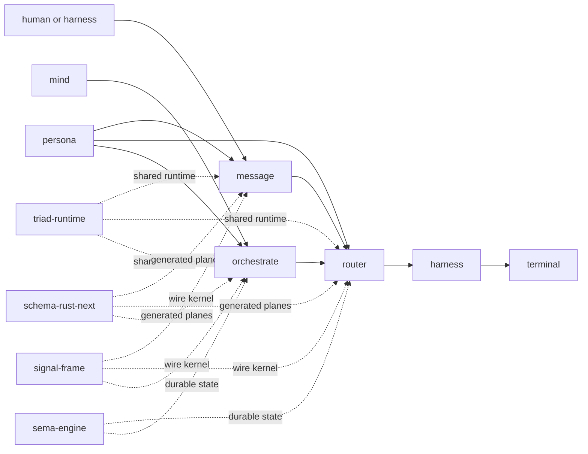
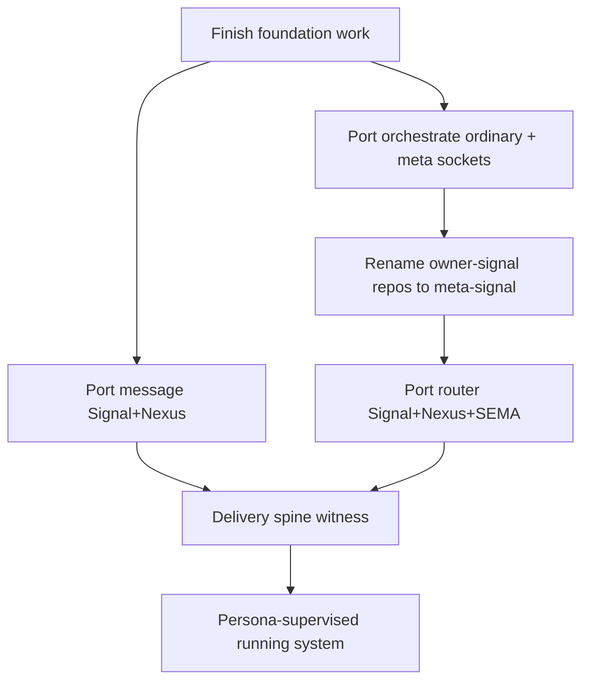

# Message, Router, Orchestrate Triad-Port Survey

## Frame

The psyche wants the engine work to turn into implemented, end-to-end behavior:
messages should be able to move between agents, and the current design work on
Signal, SEMA, Nexus, schema, and triad-runtime should be manifested into the
component repos rather than remaining report-level architecture.

Fresh intent captured during this pass:

> [The policy and control socket in triad components should be called the meta socket, not the owner socket.]

Spirit accepted this as record `3chp`. I also manifested the naming drift in
`skills/component-triad.md`: test names and prose now say "meta socket" where
the socket itself is meant. I did not rename any repos or code in this survey.

## Current Field Layout

The useful user-facing slice is the delivery spine: `message` receives a typed
message, `router` accepts and adjudicates it, then a delivery adapter gets it
to an agent/harness/terminal. The full running-system slice adds `persona`
supervision and `orchestrate` control around that spine.

## Survey Inputs

I read:

- `reports/system-designer/75-message-router-orchestrate-production-2026-06-05/8-overview.md`
- `reports/system-designer/75-message-router-orchestrate-production-2026-06-05/3-triad-base-state.md`
- `reports/system-designer/75-message-router-orchestrate-production-2026-06-05/4-message-production.md`
- `reports/system-designer/75-message-router-orchestrate-production-2026-06-05/5-router-production.md`
- `reports/system-designer/75-message-router-orchestrate-production-2026-06-05/6-orchestrate-production.md`
- `reports/system-designer/75-message-router-orchestrate-production-2026-06-05/7-verification.md`
- `reports/operator/320-triad-runtime-role-and-daemon-boundary-implementation-2026-06-05/3-overview.md`
- Current repo intent and architecture for `message`, `router`, `orchestrate`, `persona`, `triad-runtime`, `schema-rust-next`, `sema-engine`, and `signal-frame`.

I also ran `tools/engine-situation` across the target/runtime repos.

## Repo State Ledger

| Repo | Current shape | Production Rust | Test Rust | Schema | Current status |
|---|---:|---:|---:|---:|---|
| `message` | Kameo message ingress, stateless | 1987 | 1148 | 32 | Pre-triad runtime; good ingress tests; no generated planes |
| `router` | Kameo router, direct sema storage | 4921 | 2748 | 46 | Rich domain behavior; pre-triad runtime; durable tables exist |
| `orchestrate` | thread/free-function daemon over sema-engine | 2842 | 1660 | 446 | Best state-plane alignment; worst Rust-discipline/runtime shape |
| `persona` | Kameo manager/apex integration | 9921 | 4840 | 38 | Supervisor/handoff concepts have tests; not schema-derived |
| `triad-runtime` | shared runner/listener/frame runtime | 1714 | 1051 | 0 | Multi-listener landed; streaming work dirty/in-flight |
| `schema-rust-next` | Rust emitter/build driver | 5340 | 8383 | 325 | Role traits landed; streaming emission dirty/in-flight |
| `sema-engine` | typed database engine library | 3047 | 2497 | 47 | Table/identified mutation/subscription foundation present |

Important worktree caveat: `triad-runtime` and `schema-rust-next` currently
have uncommitted operator work for streaming/push. I did not touch those repos.
This matters because `reports/operator/320...` says streaming is still the
main unsolved foundation slice, and the working copies show active edits toward
that surface.

## What Is True Now

`message`, `router`, and `orchestrate` are not "almost triad-engine". The
designer report is correct: all three still use pre-triad runtime structure.
They have mature domain behavior, but the runtime shape has to be rebuilt onto
generated Signal/Nexus/SEMA planes.

`message` is the smallest port. It is intentionally stateless: its current
repo intent says it owns no durable message ledger. The current daemon still
does synchronous router forwarding inside `MessageDaemonRoot::forward`, which
is exactly the kind of effect that should become a declared Nexus effect.

`router` is the delivery brain. It has the real channel/adjudication/delivery
logic and real persistence through `router.redb`, but the tables are direct
component tables, not generated SEMA descriptors. Its port is the decisive
work for "I can send a message to an agent".

`orchestrate` is the best first multi-listener candidate, not because it is
closest in code beauty, but because it already has three live sockets
ordinary/meta/upgrade and already uses `sema-engine`. Porting it first proves
the runtime shell and meta socket shape before router depends on the same
pattern.

`persona` is the eventual supervisor. It already carries FD handoff and
manager-store tests, but it should not block the first message-delivery
witness. The delivery spine can be tested in a dev stack before the full
persona-supervised running system is complete.

## Base Readiness

The base is usable for request/reply ports:

- `schema-rust-next` emits runtime role trait implementations.
- `triad-runtime` owns the recursive Nexus runner.
- `triad-runtime` owns `SingleListenerDaemon` and `MultiListenerDaemon`.
- `sema-engine` supplies registered tables, identified mutation, commit log,
  and subscription mechanics.
- `signal-frame` supplies the wire kernel and already contains low-level
  streaming primitives.

The base is not yet complete for push/subscribe as a schema-derived feature.
`reports/operator/320.../2-signal-frame-push-audit.md` says the primitives
exist in `signal-frame`, but schema-derived daemons do not consume them. The
active dirty edits in `triad-runtime` and `schema-rust-next` look like the
operator is working this exact gap.

## Recommended Move Order

1. Finish or intentionally bracket the operator's streaming/push work. Do not
   start a port that needs subscriptions until the schema-derived streaming
   surface is clear.
2. Rename the policy-contract repos from `owner-signal-*` to
   `meta-signal-*` as a fleet slice. At minimum this blocks router and
   orchestrate meta-tier code generation.
3. Port `orchestrate` first if the priority is proving the triad runtime
   machinery. It should become the first real `MultiListenerDaemon` consumer.
4. Port `message` and `router` as one delivery-spine unit if the priority is
   user-visible messages between agents. `message` alone does not prove the
   desired behavior; `router` alone does not give a convenient ingress.
5. Add the first real end-to-end test in `persona`: run message + router +
   a minimal adapter/harness fixture and prove a typed message reaches a
   recipient path without copy/paste by the human.
6. Move to the full persona-supervised running system after the spine works.

## Hard Questions For The Psyche

### 1. Does `message` stay a two-plane component?

I lean yes. `message` owns no durable ledger by intent, so Signal+Nexus is the
beautiful shape. Adding a token SEMA plane just to satisfy a generic recipe
would make the schema uglier and contradict the repo's own intent. If the
psyche wants an audit ledger for ingress, that is a real new decision.

### 2. Do we prove multi-listener through `orchestrate` before router?

I lean yes if correctness of the stack matters more than fastest user-visible
messaging. `orchestrate` already has ordinary, meta, and upgrade sockets and
already uses `sema-engine`. It is the clean pattern-establishing spike.

If the psyche wants the fastest "send a message to another agent" result, then
message+router should jump ahead, but router will become the first risky
multi-listener consumer.

### 3. Is `orchestrate` a supervised child, not the supervisor?

I agree with the designer lean: `persona` supervises the engine; `orchestrate`
is a work-layer component under that manager. The current persona repo intent
supports this strongly, but report 75 marks it as inferred rather than a direct
psyche quote. This is worth an explicit confirmation before implementing a
manager-shaped surface in the wrong repo.

### 4. What delivery adapter proves "agent-to-agent message" first?

The narrowest proof is probably not the full terminal-cell path. A Pi harness
or small harness fixture could accept a typed delivery and expose a witness
file or test socket. But if the goal is immediately useful human workflow, the
first adapter should be the actual terminal/harness path where agents already
run.

### 5. Does the upgrade socket stay distinct from the meta socket?

I lean yes for the first port. Keep ordinary, meta, and upgrade as separate
listener identities in `MultiListenerDaemon`. Folding upgrade into meta-signal
is probably cleaner eventually, but it is not needed to prove the current
port and would mix two design changes in one wave.

## Immediate Implementation Plan

Start in worktrees under `~/wt`, not the canonical checkouts, because this is a
multi-repo code-repo feature arc.

Use one branch name across the touched repos, for example
`triad-engine-port-message-router-orchestrate`.

First implementation slice:

1. Wait for or coordinate with the operator lock on `triad-runtime` /
   `schema-rust-next` streaming work. Do not edit those dirty repos from this
   lane.
2. Rename `owner-signal-orchestrate` to `meta-signal-orchestrate` and
   `owner-signal-router` to `meta-signal-router`, with repo `INTENT.md` and
   `ARCHITECTURE.md` updates on the same branch.
3. Port `orchestrate` ordinary/meta request-reply to generated plane schemas,
   `MultiListenerDaemon`, and its existing `sema-engine` store. Keep upgrade
   as a separate listener identity.
4. Port `message` as Signal+Nexus with `ForwardToRouter` as a declared Nexus
   effect and no local SEMA plane.
5. Port `router` as Signal+Nexus+SEMA with generated storage descriptors for
   accepted messages, channels, adjudication pending, attempts, and results.
6. Add the delivery-spine witness in `persona` or in a dedicated cross-repo
   Nix test: `message` sends, `router` accepts, an adapter observes delivery.

## Testing Shape

The tests should be constraint-named, Nix-accessible, and prove architecture
rather than grep for names.

Minimum witnesses:

- `orchestrate-meta-socket-rejects-ordinary-frame`
- `orchestrate-ordinary-socket-rejects-meta-frame`
- `orchestrate-sema-persists-claims-across-reopen`
- `message-cli-has-exactly-one-signal-peer`
- `message-forward-to-router-is-nexus-effect`
- `message-has-no-local-sema-ledger`
- `router-message-without-authorized-channel-never-reaches-delivery`
- `router-channel-grant-unparks-message-through-normal-delivery`
- `message-router-delivery-spine-round-trip`
- `persona-dev-stack-message-reaches-agent-adapter`

The last two are the tests that matter most for the psyche's immediate
complaint: stop manually carrying messages between agents.

## Main Risks

1. The streaming/push foundation is active and unsettled. Ports that need
   subscriptions should not invent local streaming one-offs.
2. The owner-to-meta rename is wider than router and orchestrate. There are
   still `owner-signal-*` names in persona, terminal, upgrade, and documents.
   The fleet slice should be explicit, or the port branch should narrowly
   rename only the repos it needs and document the remaining backlog.
3. Router is a dense domain component. A shallow generated-shell port that
   leaves channel authorization as hidden handwritten match arms would violate
   the Nexus feature catalog intent.
4. Persona supervision and FD handoff are a separate layer. They should be
   integrated after the delivery spine works, not used as an excuse to delay
   the first end-to-end message witness.

## Bottom Line

The design is ready enough to start implementation, but not as one giant
"port everything" push. The correct operational path is staged: finish the
shared runtime surfaces already in flight, make meta-socket naming real, prove
one multi-listener component, then co-port message+router until a real
message-to-agent delivery witness passes. After that, persona supervision turns
the slice into the running system.
