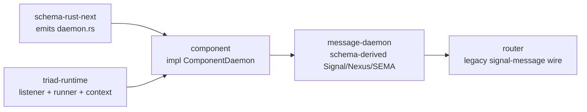

# 198 — Core Crate Refresh After `triad_main`

Role: system-operator  
Variant: context refresh  
Date: 2026-06-06  
Topics: core-crates, triad-runtime, schema-rust-next, message, router, orchestrate, intent-refresh

## Frame

The psyche asked for a refresh on the latest core-crate development, with
context for the work I had just been doing around `message` and
`triad-runtime`.

This prompt was a working order, not durable intent. I did not log a Spirit
record for it.

## Fresh Intent Read

The load-bearing records from the live Spirit refresh:

- `ocu7`: `triad_main` is implemented; the core components migrate onto the
  schema-derived triad runtime.
- `lnhj`: `triad_main!` is source-visible emitted daemon code in
  `schema-rust-next`, not a literal macro and not owned by `triad-runtime`.
- `g3ax`: emitted daemon code must thread `SO_PEERCRED`-backed
  `ConnectionContext` into `handle_working_input`.
- `k6w1`: bounded daemon connection concurrency belongs in reusable
  `triad-runtime`, not per component.
- `z6qu`: `schema/nexus.schema` is the daemon's internal feature catalog; hidden
  handwritten feature logic is a drift smell.
- `brgo`: schema-derived streaming/push is a platform project across
  `schema-next`, `schema-rust-next`, `signal-frame`, and `triad-runtime`.
- `alom`: message should own the durable existence fact for authenticated
  ingress, distinct from router's delivery fact.
- `3chp`: the policy/control socket is the meta socket, not the owner socket.
- `pb1g`: every component needs a meta slot; if there is no separate
  `meta-signal-*` repo, the component carries the meta surface itself.

## Core Crate State

| Crate | Current main state | Context |
|---|---|---|
| `schema-next` | Main at `77e71a41`, with structural macro derive adoption, `Assembled*` renamed to `MacroExpansion*`, and Asschema-retirement docs. | Authored schema is full NOTA; no Asschema step. |
| `schema-rust-next` | Main at `6685e7b3`, emits the daemon module and passes `ConnectionContext` into the generated working-input hook. | This is the live `triad_main` emitter. It emits `src/schema/daemon.rs`. |
| `triad-runtime` | Main at `33b9531a`, with `ConnectionContext`; prior commits on main added `BoundedWorkers`, `DaemonConfiguration`, `ExitReport`, streaming runtime, `SingleListenerDaemon`, and `MultiListenerDaemon`. | Runtime owns reusable daemon mechanics; schema-rust emits component-specific glue. |
| `signal-frame` | Main at `6f5a77f`; stable enough for current schema-rust-next generated wire support and streaming frame primitives. | The streaming substrate exists; component-level live subscriptions are still a follow-up. |
| `sema-engine` | Main at `e1aeef16`, with identified mutation. | Intent says sema-engine must be the exclusive database interface. Component daemons should not call redb directly. |
| `message` | Main at `8fa99105`, migrated onto the emitted daemon runtime with peer-credential origin restored. | This is the first component port after Spirit, but it is not complete relative to current intent. |

Measurement snapshots from `tools/engine-situation`:

| Repo | Production Rust | Generated Rust | Test Rust | Schema | Public types | Tests |
|---|---:|---:|---:|---:|---:|---:|
| `triad-runtime` | 2063 | 0 | 1301 | 0 | 63 | 46 |
| `schema-rust-next` | 7432 | 0 | 9350 | 349 | 115 | 61 |
| `sema-engine` | 3047 | 0 | 2497 | 47 | 65 | 51 |
| `message` | 1713 | 2526 | 293 | 94 | 120 | 4 |

## What Changed Around My Previous Work

My last implemented slice put shared listener mechanics into
`triad-runtime` and moved `message` toward reusable listener machinery. That
was quickly superseded by the deeper correct path:

The correct interpretation now:

- `message` should not keep a handwritten `MultiListenerRuntime` shell. It is a
  single-listener component for now and should use the emitted daemon module.
- `MultiListenerDaemon` remains important for router, orchestrate, and every
  ordinary+meta two-socket daemon.
- The `ConnectionContext` fix is load-bearing for message, router, persona, and
  any component that mints origin from Unix socket peer credentials.
- `BoundedWorkers` is present but not yet wired into the emitted daemon path.
  The concurrency policy still needs a component-driver, likely lojix or a
  future high-latency request path.

## Message State

The landed code is stronger than the stale docs imply:

- `message/src/schema/daemon.rs` reads `ConnectionContext::from_stream(&stream)`
  before decoding the working frame.
- `message/src/daemon.rs` passes that context into `MessageEngine::handle`.
- `message/src/router.rs` classifies `Owner` vs `NonOwnerUser(uid)` from the
  accepted peer uid, not from payload.
- `message/tests/forward_to_router.rs` has explicit owner and non-owner origin
  witnesses.

But three important gaps remain:

1. `message/INTENT.md` and `message/ARCHITECTURE.md` still say the peer-credential
   path is a residual and that the daemon stamps configured owner origin. That is
   stale relative to code.
2. Current Spirit intent `alom` says message should own the durable existence
   fact. Current code and docs still treat SEMA as stateless. This is a real
   design/implementation gap, not a doc-only issue.
3. The `message` CLI still uses old `signal-message` request/reply types through
   `src/command.rs`; the daemon's inbound socket now expects schema-derived
   signal-frame. So CLI-to-daemon parity is not finished.

There is also someone else's dirty work in `/git/github.com/LiGoldragon/message`:

- `schema/nexus.schema`
- `src/schema/nexus.rs`

The dirty change appears to rename the Nexus completion vocabulary toward
`EffectCompleted` / `NexusEffectResult`. I did not touch it.

## Documentation and Branch Drift

`triad-runtime` has a designer bookmark:

- `designer-intent-triad-main-2026-06-06` at `45188bd3`, which fixes the
  stale `INTENT.md` paragraph saying `triad_main` is not built.

But `main` is still at `33b9531a`, so the main checkout still contains stale
`triad_main is NOT YET BUILT` wording in:

- `/git/github.com/LiGoldragon/triad-runtime/INTENT.md`
- `/git/github.com/LiGoldragon/triad-runtime/ARCHITECTURE.md`

This matters because agents opening main will get the wrong prescription unless
the designer doc fix is integrated or re-applied on main.

`message` has the inverse problem: the implementation landed on main, but the
repo docs were not updated to match the `ConnectionContext` restoration and the
new `alom` existence-log intent.

## Router, Orchestrate, Mind, Persona Context

The surrounding component repos are less advanced:

- `router` has intent/docs centralization but no triad-runtime migration yet.
- `orchestrate` has prior meta/upgrade-socket work but not the new emitted
  triad daemon shape.
- `mind` mostly has per-repo intent/docs; no new daemon port.
- `persona` has a recent signal-introspect realignment, but not the full
  orchestrated runtime target.

So the migration sequence should treat `spirit` and `message` as exemplars, not
as evidence that the fleet is already ported.

## Practical Next Moves

1. Integrate or re-apply the `triad-runtime` `triad_main` doc correction onto
   main before more porting agents copy stale main docs.
2. Update `message` docs to reflect the restored `ConnectionContext` origin
   path.
3. Decide whether `alom` means immediate implementation of a `message` SEMA
   existence-event log. My read: yes, because the record is High certainty and
   explicitly says message owns the existence fact.
4. Finish the `message` CLI migration to schema-derived signal-frame so
   `message` as CLI has exactly one peer, its own daemon, through the same
   contract the daemon accepts.
5. Use router as the next meaningful port only after the message existence/CLI
   boundary is not lying. Router will exercise durable SEMA and the meta socket.
6. Use orchestrate as the first multi-listener emitted-daemon port if the goal is
   to prove ordinary+meta+upgrade socket shape rather than message delivery.

## Bottom Line

The core crates have moved past the manual listener-shell stage. The current
center is schema-emitted daemon code plus `triad-runtime` reusable mechanics.
My previous `MultiListenerDaemon` work remains useful foundation, but `message`
itself has already shifted to the emitted single-listener path. The two highest
signal gaps before continuing are documentation truthfulness and message's
durable existence-event surface.
