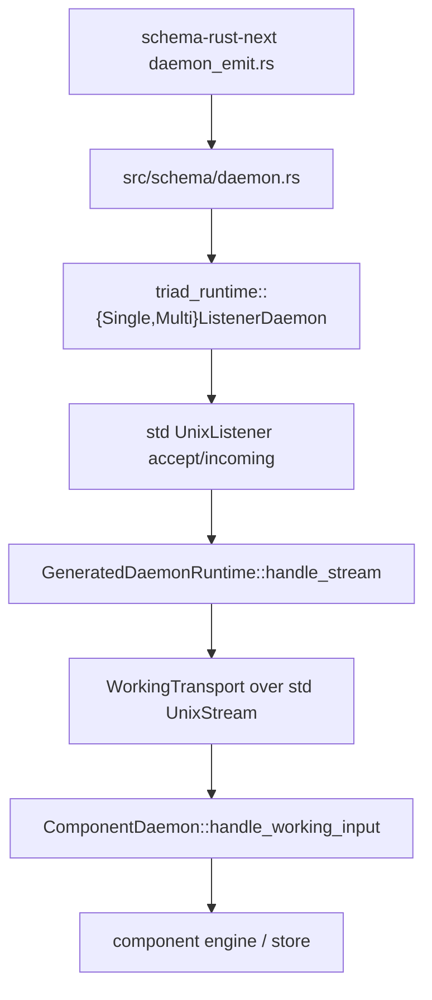
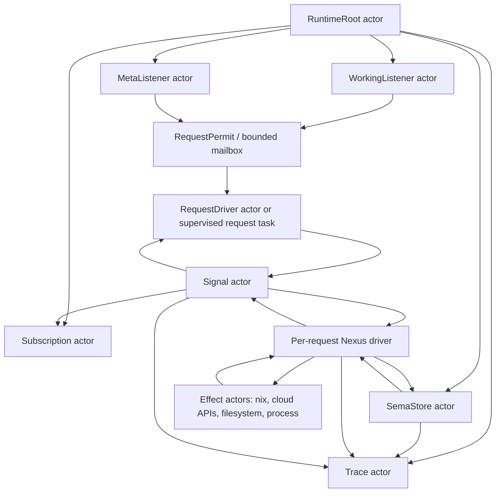
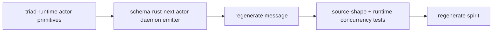

# Audit: Actor-Native Engine Rewrite

Role: system-operator
Date: 2026-06-07
Variant: Audit
Primary input: `reports/designer/553-actor-native-engine-rewrite/`
Related inputs: `reports/cloud-designer/35-actor-divergence-forensics/`, `reports/designer/551-workspace-dependency-ecosystem-state.md`, `reports/operator/319-Refresh-nexus-engine-and-enum-payload-design-2026-06-05.md`, current code in `triad-runtime`, `schema-rust-next`, `spirit`, `message`, `cloud`, `repository-ledger`, `lojix/triad-port`

## Verdict

Report 553 is directionally correct and now has the right authority behind it: Spirit record `zk6y` explicitly says the schema-emitted Signal, Nexus, and SEMA engines are Kameo actors, not synchronous runner loops over mutex-wrapped state. The current generated daemon stack is therefore drift, not an accepted endpoint.

The implementation surface is bigger than 553 makes it feel, but smaller than rewriting every component independently. The load-bearing migration is still concentrated in two places:

- `/git/github.com/LiGoldragon/triad-runtime`
- `/git/github.com/LiGoldragon/schema-rust-next/src/daemon_emit.rs`

Once those are actor-native and tests enforce the shape, generated consumers such as `spirit`, `message`, and `cloud` can follow by regeneration plus thin hook adjustments. The hand-written islands (`lojix/triad-port`, `repository-ledger`, and older live `cloud::daemon`) then either become temporary reference material or get collapsed into the generated path.

The main critique: 553 correctly says "actors everywhere," but the next implementation must avoid translating the existing synchronous structure into one giant actor. A single `NexusActor` owning a runner loop would preserve the bad serialization point under an actor name. The correct shape is a small actor topology: listener actors, per-request driver actors or permit-capped request tasks, SEMA store actors / read snapshots, effect actors for blocking work, subscription actors, and explicit root supervision.

## Authority And Intent Chain

The current intent chain is coherent:

- `zk6y` is the supersession line: schema-emitted Signal, Nexus, and SEMA engines are Kameo actors; synchronous daemon emission with mutex-wrapped engine state is drift.
- `3d5z` says triad engine separation is strict: Signal owns communication, Nexus owns decision-making, SEMA owns durable state.
- `a71r` says every component engine defines and uses its Signal, Nexus, and SEMA schema interfaces, with handwritten runtime logic conducted through schema-emitted traits over root types.
- `tj99` says the lojix hand-written daemon properties are meant to feed back into the schema-rust-next emitter: concurrent serving, fresh per-request engine over shared store, hardening bounds, and typed owner/meta path.
- `59dr` says deeper backpressure and runtime-control machinery was deferred, not actors themselves.
- `xqkv` and `tpcm` say generated runtime traces should prove actual Signal/Nexus/SEMA usage, not merely symbol presence.

This means the old "defer runtime machinery" argument cannot be used to keep sync daemons. The deferral was about advanced scheduling and backpressure control, not the basic actor substrate.

## What 553 Gets Right

### The root cause is shared runtime emission

553 correctly identifies the highest-leverage defect: generated daemons are sync because `schema-rust-next` emits a sync runtime around `triad-runtime`, and consumers inherit that shape. The current emitter imports `std::os::unix::net::UnixStream` and `{Single,Multi}ListenerDaemon`, then emits `GeneratedDaemonRuntime` with sync `handle_stream` methods. See:

- `/git/github.com/LiGoldragon/schema-rust-next/src/daemon_emit.rs:298`
- `/git/github.com/LiGoldragon/schema-rust-next/src/daemon_emit.rs:530`
- `/git/github.com/LiGoldragon/schema-rust-next/src/daemon_emit.rs:793`
- generated cloud example: `/git/github.com/LiGoldragon/cloud/src/schema/daemon.rs:1`

That is exactly where a central correction belongs.

### The "actor shell, pure logic inside" split is right

553's most useful separation is this: domain transformations can stay pure and synchronous when they are CPU-local and fast, while runtime ownership, lifecycle, transport, concurrency, and backpressure become actor-native. That avoids a fake rewrite where every calculation becomes async for no reason.

The corrected rule I would use:

```text
Pure domain methods are allowed inside engine nouns.
Runtime edges are actors.
Shared mutable state is owned by actors, not Arc<Mutex<_>>.
Blocking effects are explicit blocking-plane actors or async process tasks.
```

This aligns with the Kameo model: actors are asynchronous units with mailboxes, lifecycle hooks, and supervision. `ActorRef` exposes `ask` and `tell`, which maps naturally onto request/reply and event/fire-and-forget edges.

### lojix is the right stress test

553 is right that `lojix` is the hard case. It has long-running Nix effects, two authority surfaces, deployment state, and concurrency requirements. If the actor-native runtime can host `lojix` cleanly, the smaller components are unlikely to expose deeper runtime flaws.

Current `lojix/triad-port` is already written as a hand-made reference for generated runtime feedback: it uses `MultiListenerDaemon`, `BoundedWorkers`, per-request `SchemaRuntime`, max request frame bytes, and read timeouts. See `/git/github.com/LiGoldragon/lojix/triad-port/src/daemon.rs:107`.

The critique is not that those properties are wrong. The critique is that their current implementation is sync and thread-based, so they should be preserved semantically while the substrate changes.

## Current Code Reality

### Size and shape snapshot

Measured with `tools/engine-situation`:

| Repo | Production Rust | Generated Rust | Test Rust | Schema | Public Types | Tests | Notes |
|---|---:|---:|---:|---:|---:|---:|---|
| `triad-runtime` | 2074 | 0 | 1316 | 0 | 63 | 47 | Shared sync runtime edge today |
| `schema-rust-next` | 7513 | 0 | 9354 | 349 | 116 | 61 | Emitter is now token-based, but daemon emission is still sync |
| `spirit` | 2704 | 4205 | 4143 | 226 | 154 | 85 | Best functional pilot, but sync/mutexed |
| `message` | 1811 | 2523 | 427 | 94 | 124 | 5 | Generated daemon, mutexed engine |
| `cloud` | 3968 | 2011 | 1101 | 118 | 114 | 24 | Has both old hand-written daemon and generated pilot |
| `repository-ledger` | 1755 | 0 | 548 | 40 | 28 | 12 | Hand-written sync island |
| `lojix/triad-port` | 2110 | 2808 | 567 | 160 | 101 | 14 | Hand-written concurrent reference, still sync |

### Current generated runtime path



That path is not actor-native. The actor rewrite must change the generated path, not just individual consumers.

### triad-runtime

`triad-runtime` currently defines sync traits:

- `DaemonRuntime::handle_stream(&mut self, UnixStream)`
- `MultiListenerRuntime::handle_stream(&mut self, listener, UnixStream)`

It owns blocking listener loops:

- single listener uses `listener.incoming()`
- multi listener polls nonblocking std listeners and sleeps
- request handling happens inline unless a component manually uses `BoundedWorkers`

Relevant code:

- `/git/github.com/LiGoldragon/triad-runtime/src/daemon.rs:14`
- `/git/github.com/LiGoldragon/triad-runtime/src/daemon.rs:273`
- `/git/github.com/LiGoldragon/triad-runtime/src/daemon.rs:368`
- `/git/github.com/LiGoldragon/triad-runtime/src/daemon.rs:420`

`BoundedWorkers` is a thread-per-task dispatcher using `Mutex` + `Condvar` and `thread::spawn`. It was useful as a bridge, but it is not the target actor runtime:

- `/git/github.com/LiGoldragon/triad-runtime/src/workers.rs:1`
- `/git/github.com/LiGoldragon/triad-runtime/src/workers.rs:15`
- `/git/github.com/LiGoldragon/triad-runtime/src/workers.rs:41`

### schema-rust-next

`schema-rust-next` has improved since some earlier reports: source emission is now token-based through `ToTokens` + `prettyplease`, not loose `format!` string assembly. That improvement should be preserved. The stale part is not the emitter mechanics; it is the daemon shape the emitter emits.

The daemon emitter still emits:

- sync `UnixStream`
- `SingleListenerDaemon` / `MultiListenerDaemon`
- `WorkingTransport` with blocking reads/writes
- `GeneratedDaemonRuntime` with sync `handle_working_stream`
- `EmittedSubscriptions` behind `std::sync::Mutex`

Relevant code:

- `/git/github.com/LiGoldragon/schema-rust-next/src/daemon_emit.rs:298`
- `/git/github.com/LiGoldragon/schema-rust-next/src/daemon_emit.rs:649`
- `/git/github.com/LiGoldragon/schema-rust-next/src/daemon_emit.rs:775`
- `/git/github.com/LiGoldragon/schema-rust-next/src/daemon_emit.rs:819`

### spirit

`spirit` is the best production-like proof of the Signal/Nexus/SEMA split, but the names currently mislead: `SignalActor` is a struct, not a Kameo actor. `Engine` owns `signal_actor` directly and `nexus: Mutex<Nexus>`.

Relevant code:

- `/git/github.com/LiGoldragon/spirit/src/engine.rs:24`
- `/git/github.com/LiGoldragon/spirit/src/engine.rs:32`
- `/git/github.com/LiGoldragon/spirit/src/engine.rs:99`
- `/git/github.com/LiGoldragon/spirit/src/engine.rs:121`

This makes `spirit` a strong semantic reference and a weak runtime reference. Its architecture docs already describe privacy, certainty, SEMA persistence, observation filters, and typed meta configuration well; its runtime docs must eventually stop implying that "actor" names are runtime actors.

### message

`message` is a clean generated daemon consumer, but it serializes its `MessageEngine` through a mutex:

- `/git/github.com/LiGoldragon/message/src/daemon.rs:55`
- `/git/github.com/LiGoldragon/message/src/daemon.rs:58`
- `/git/github.com/LiGoldragon/message/src/daemon.rs:76`

This is a good minimal consumer for the actor-native generated path because its state shape is small. It should not be used to justify mutexed engines.

### cloud

`cloud` has two shapes:

- old hand-written sync daemon in `/git/github.com/LiGoldragon/cloud/src/daemon.rs`
- generated daemon hook surface in `/git/github.com/LiGoldragon/cloud/src/schema_daemon.rs`

The old daemon is clearly pre-triad-runtime style: two std Unix listeners, two threads, shared `Arc<Mutex<Store>>`, and sleep forever:

- `/git/github.com/LiGoldragon/cloud/src/daemon.rs:23`
- `/git/github.com/LiGoldragon/cloud/src/daemon.rs:96`
- `/git/github.com/LiGoldragon/cloud/src/daemon.rs:122`

The generated pilot is structurally better but still inherits sync transport and a component-owned meta escape hatch:

- `/git/github.com/LiGoldragon/cloud/src/schema_daemon.rs:48`
- `/git/github.com/LiGoldragon/cloud/src/schema_daemon.rs:87`
- `/git/github.com/LiGoldragon/cloud/src/schema/daemon.rs:198`

This is important: the generated pilot is the right adoption direction, but the actor rewrite should eliminate the meta escape hatch as far as possible. Meta should be a generated tier with typed codec and actor routing, not a raw stream hook every component reimplements.

### repository-ledger

`repository-ledger` is a hand-written sync daemon and should be treated as an implementation debt island. It uses two std listener threads, a shared mutexed store, and a polling spool loop:

- `/git/github.com/LiGoldragon/repository-ledger/src/daemon.rs:25`
- `/git/github.com/LiGoldragon/repository-ledger/src/daemon.rs:41`
- `/git/github.com/LiGoldragon/repository-ledger/src/daemon.rs:51`
- `/git/github.com/LiGoldragon/repository-ledger/src/daemon.rs:114`

The actor rewrite does not need to solve repository-ledger first, but its spool loop is a good example of something that should become a dedicated actor concern rather than an unstructured sleep loop.

### mind and chroma as actor examples

The best local actor examples are not in the generated stack yet:

- `mind` has a root actor that starts child actors and routes through `ask`; see `/git/github.com/LiGoldragon/mind/src/actors/root.rs:79`.
- `chroma` has hard-constraint tests that explicitly reject hand-rolled task actors and shared mutexes between actors; see `/git/github.com/LiGoldragon/chroma/tests/hard_constraints.rs:29`.

These are stronger runtime exemplars than `spirit`/`message` for Kameo discipline, while `spirit`/`message` are stronger schema-emitted component exemplars. The rewrite should synthesize both, not copy either blindly.

## External Research Notes

Primary sources checked:

- Kameo 0.20 actor module: actors are asynchronous units with mailboxes, lifecycle hooks, backpressure and supervision support.
- Kameo `ActorRef`: supports `ask` for replies and `tell` for one-way messages.
- Kameo `Spawn`: `spawn` uses a Tokio task and a bounded default mailbox; `spawn_in_thread` is for blocking operations on a dedicated thread.
- Tokio `UnixListener`: async `accept().await` is cancel safe; converting std listeners requires nonblocking mode.
- Tokio `spawn_blocking`: suitable for finite blocking work, but started blocking tasks cannot be aborted.
- Tokio `process::Command`: spawned child processes continue by default after handle drop; `kill_on_drop(true)` changes that behavior.
- redb: ACID embedded store with MVCC support for concurrent readers and writer without blocking.

Sources:

- https://docs.rs/kameo/latest/kameo/actor/index.html
- https://docs.rs/kameo/latest/kameo/actor/struct.ActorRef.html
- https://docs.rs/kameo/latest/kameo/actor/trait.Spawn.html
- https://docs.rs/tokio/latest/tokio/net/struct.UnixListener.html
- https://docs.rs/tokio/latest/tokio/task/fn.spawn_blocking.html
- https://docs.rs/tokio/latest/tokio/process/struct.Command.html
- https://docs.rs/redb/latest/redb/

The practical implication: actor-native does not mean every heavy operation goes through `spawn_blocking`. Long-running or cancellable external commands such as Nix builds need explicit process actors or async process handles. Short redb transactions can use blocking isolation, but a long-lived blocking actor or dedicated store actor is preferable to saturating Tokio's blocking pool.

## Supplemented Target Architecture



### Actor nouns

The following nouns are the minimum useful split:

| Actor | Owns | Does not own |
|---|---|---|
| `RuntimeRoot` | startup, supervision, child references, shutdown | request logic |
| `ListenerActor` | one Unix socket, accept loop, peer credentials, stream handoff | decoded domain semantics |
| `RequestDriver` | one connection/request lifecycle, transport, reply writing, cancellation context | durable store |
| `SignalActor` | admission, origin route, validation, outer reply shape | durable writes |
| `NexusDriver` | in-flight decision loop for one message | global mutable state |
| `SemaStoreActor` | write transactions, commit markers, durable mutation ordering | public wire handling |
| `SemaReadActor` / `ReadSnapshot` | parallel read transaction or read-only snapshot | write sequencing |
| `SubscriptionActor` | subscriber registry, writer ownership, event fan-out | component decisions |
| `TraceActor` | structured trace sink | business logic |
| `EffectActor` | one external effect concern such as Nix build, Cloudflare API, spool ingest | schema routing |

The key is not actor count. The key is ownership: every mutable runtime concern has one actor owner, and request concurrency is bounded without global locks.

### Suggested control flow

```text
ListenerActor.accept
  -> spawn / ask RequestDriver with accepted stream and tier
RequestDriver
  -> async read length-prefixed frame
  -> decode schema frame
  -> ask SignalActor::Admit
SignalActor
  -> validate and attach origin route
  -> ask NexusDriver::Process
NexusDriver
  -> execute schema-visible internal feature verbs
  -> ask SemaStoreActor for writes or SemaReadActor for reads
  -> ask EffectActor for external effects
SignalActor
  -> shape final typed reply
RequestDriver
  -> encode and write frame
```

This keeps the current Signal/Nexus/SEMA conceptual flow but makes the runtime mechanics honest.

## Critique Of 553

### 1. "Runner loop moves into Nexus actor" is too easy to misimplement

If "the Nexus actor" is singleton and every request asks it to run the whole loop, the old serialization just moves from `Mutex<Nexus>` into a mailbox. That would satisfy a superficial actor count test but violate the concurrency intent.

Supplement:

- singleton actors own durable/global concerns;
- request-local state belongs to a per-request `NexusDriver` or bounded request task;
- the singleton Nexus-like actor, if it exists, should be a factory/router/policy actor, not the place every long request waits.

### 2. SEMA read/write separation needs a concrete ownership model

553 says writes through mailbox and reads through redb snapshots. That is right, but incomplete.

redb supports concurrent readers and writer through MVCC, so the design should expose that:

- `SemaStoreActor` owns writes and database marker sequencing.
- `SemaReadSnapshot` objects are minted from the store and can serve read-only requests concurrently.
- Long read queries that scan many records should be bounded separately from short point lookups.
- Read transactions are synchronous redb work; if called from async actors they need a blocking boundary or a dedicated read actor/thread pool.

This avoids turning all observations into a write-mailbox bottleneck.

### 3. Blocking effects need cancellation semantics, not just async APIs

553's direction to use `tokio::process::Command` for Nix is correct, but the cancellation policy is a design question.

Tokio child processes continue after the handle is dropped unless `kill_on_drop(true)` is set. For lojix, both policies can be valid:

- client disconnect cancels speculative query/build: use `kill_on_drop(true)`.
- deploy job survives caller disconnect: keep a job actor and persist the job state; do not couple child process lifetime to stream lifetime.

The actor rewrite must choose per operation. A blanket `kill_on_drop` rule would be wrong for durable deploys.

### 4. `spawn_blocking` is not a long-running work queue

Tokio documents `spawn_blocking` as finite blocking work; started tasks cannot be aborted. That makes it useful for short filesystem/redb bridges, not for indefinite spool loops or multi-minute builds where cancellation, progress streaming, and supervision matter.

Supplement:

- short redb transaction: `spawn_blocking` or dedicated SEMA actor thread is acceptable;
- long Nix/cloud command: `tokio::process` under an effect actor;
- indefinite watcher/spool loop: actor with async interval/watch source, or dedicated supervised actor thread if the API is blocking.

### 5. Subscription handling should not remain a mutexed registry

The emitter currently creates `EmittedSubscriptions { state: Mutex<SubscriptionState<_>> }`. That is understandable for a first generated pilot but contradicts actor-native ownership. Subscription state is naturally an actor:

- register subscription
- unregister stale writer
- publish event to matching subscribers
- track delivery failures

The generated runtime should emit a `SubscriptionActor` or call into a triad-runtime-provided generic subscription actor.

### 6. The meta tier should stop being a raw stream escape hatch

Current generated cloud still has `ComponentDaemon::handle_meta_stream(engine, stream)` as a component-owned raw stream hook. That was useful while proving multi-listener generation, but it is now an integration trap: every component can accidentally reimplement transport policy.

Supplement:

- schema should emit meta input/output transport the same way as working transport;
- component hooks should receive decoded meta input and return typed meta output;
- raw stream escape hatches should be rare and named as escape hatches, not the default meta-tier mechanism.

### 7. The docs are now split-brained

Current `triad-runtime/INTENT.md` and `ARCHITECTURE.md` still describe the sync listener runtime as the production slice. Current `schema-rust-next/ARCHITECTURE.md` still says generated traits have minimal lifecycle hooks and no full actor mailbox/runtime-control traits.

Those statements were accurate before `zk6y`; now they are stale. The implementation branch should update repo `INTENT.md` and `ARCHITECTURE.md` in the same changeset as the actor-native code, otherwise future agents will resurrect the sync interpretation.

## Proposed Implementation Sequence

### Phase 1: establish actor-native primitives in triad-runtime

Add Kameo/Tokio runtime primitives without trying to solve advanced scheduling:

- `RuntimeRoot` actor
- `ListenerActor`
- `ConnectionDriver`
- `RequestPermit` / bounded mailbox policy
- async `LengthPrefixedCodec` over `tokio::net::UnixStream`
- `ConnectionContext` support for Tokio UnixStream or accepted std fd conversion
- generic `SubscriptionActor`
- test-only trace actor

Retain old sync types only if needed for a short migration branch, but mark them as legacy. If this is a breaking stack migration, deletion is cleaner.

### Phase 2: teach schema-rust-next to emit actor-native daemon modules

Replace emitted `GeneratedDaemonRuntime` with emitted actor topology. The emitter should still use token-based `ToTokens` nouns. This is a strength of the current code and should not regress.

Generated code should include:

- component daemon type hook trait over decoded working/meta inputs;
- actor root type;
- listener setup;
- request driver;
- typed Signal/Nexus/SEMA actor trait implementations or actor wrappers;
- lifecycle hooks through Kameo `on_start` / `on_stop`;
- optional trace hooks;
- optional subscription actor wiring.

### Phase 3: regenerate the small pilots first

Order:

1. `message` — minimal no-store pilot.
2. `spirit` — full SEMA store and observation features.
3. `cloud` generated path — multi-listener/meta path and external API surface.

This order tests incrementally:

- single listener first;
- durable SEMA second;
- multi-listener and meta third.

### Phase 4: port hand-written islands back into generated shape

After the generated path works:

- `lojix/triad-port` feeds its concurrency hardening and Nix effect semantics into generated runtime/effect actors.
- `repository-ledger` becomes a generated triad daemon with spool ingest as a dedicated actor/effect concern.
- old live `cloud::daemon` is removed once generated cloud is production-equivalent.

### Phase 5: update docs and skills

At minimum:

- `triad-runtime/INTENT.md`
- `triad-runtime/ARCHITECTURE.md`
- `schema-rust-next/INTENT.md`
- `schema-rust-next/ARCHITECTURE.md`
- `spirit/INTENT.md` and `spirit/ARCHITECTURE.md` when it is regenerated
- `skills/component-triad.md` if it still implies sync runner loops are a valid default
- `skills/actor-systems.md` only if the new concrete pattern adds sharper rules

## Tests Required Before Calling It Done

### Mechanical architecture tests

- `schema_rust_next_emits_no_std_unix_stream_runtime`: generated daemon source must not import `std::os::unix::net`.
- `generated_daemon_uses_kameo_actor_root`: generated daemon contains Kameo actor implementations for root/listener/request concerns.
- `generated_daemon_has_no_engine_mutex`: no `Mutex<Engine>` or `Arc<Mutex<Store>>` in generated daemon.
- `generated_meta_tier_is_typed`: meta tier uses decoded meta input/output hooks, not raw stream escape hatch.
- `subscription_state_is_actor_owned`: no mutexed generated `SubscriptionState`.

### Behavioral tests

- `slow_request_does_not_block_accept`: one long request does not block a second connection.
- `working_and_meta_sockets_progress_independently`: meta request can complete while working request is long-running.
- `sema_write_orders_markers`: writes serialize through SEMA actor and markers remain monotonic.
- `sema_reads_parallelize`: several read-only observations can run while a write is pending or after snapshot minting.
- `trace_proves_signal_nexus_sema_path`: trace sees Signal admission, Nexus decision, SEMA read/write, and Signal reply.

### Effect tests

- `nix_build_streams_progress`: lojix build effect streams output/events rather than waiting for `.output()`.
- `disconnect_policy_is_typed`: a disconnect either cancels or preserves the job according to operation policy.
- `long_effect_does_not_occupy_spawn_blocking_pool`: code test forbids long Nix effect implementation through `spawn_blocking`.

### Runtime-safety tests

- actor panic supervision test for a request child;
- actor shutdown drains or rejects according to typed policy;
- bounded mailbox / permit exhaustion returns a typed busy reply, not a hang;
- no `tokio::spawn` ad hoc task soup in generated runtime unless wrapped behind a named actor/runtime primitive.

## Recommended Migration Invariants

```text
M1. Generated daemon transport is async and actor-owned.
M2. Every mutable runtime concern has exactly one actor owner.
M3. Request-local Nexus state is not stored in a singleton actor or mutex.
M4. SEMA writes serialize through the SEMA actor; reads use explicit snapshots/read actors.
M5. Subscription state is actor-owned.
M6. Meta tier is generated and typed; raw-stream meta hooks are exceptional.
M7. Long effects are effect actors with typed cancellation/persistence policy.
M8. Trace tests prove the intended path at runtime.
M9. Docs change with code; no stale sync-runtime intent remains.
```

## Open Questions For The Psyche / Designer

### Q1. Should deploy/build effects survive client disconnect?

For `lojix`, this affects `tokio::process::Command` policy. If deploy jobs are durable cluster operations, the process actor must outlive the request stream and report status later. If some build queries are speculative, those can be `kill_on_drop`. The schema should expose this distinction rather than burying it in process-handle behavior.

### Q2. Is a short-lived sync compatibility layer allowed?

The cleanest architecture deletes sync daemon primitives once the actor path is ready. A compatibility layer reduces migration pressure but creates a strong risk that agents keep copying the old path. My recommendation is: compatibility only on a named migration branch, not as a permanent public runtime surface.

### Q3. Where should generic subscription actor code live?

Likely `triad-runtime`, because every generated streaming daemon will need it. Keeping it emitted per component creates duplicate generated code and repeated bug surface.

### Q4. Should SEMA read snapshots be generated primitives or component-specific hooks?

The storage substrate is common enough that `triad-runtime` + `sema-engine` should probably expose the snapshot/read actor pattern. Component schemas should declare what is readable; they should not hand-design concurrency mechanics.

### Q5. How aggressive should the first pilot be?

My recommendation: `message` first, because it proves generated actor transport with the smallest state surface; `spirit` second, because it proves durable SEMA; `cloud` third, because it proves multi-listener/meta. Starting with `lojix` first is tempting but risks mixing runtime migration with Nix-effect semantics.

## Concrete Gaps To Backfill In 553

1. Add a warning against singleton `NexusActor` serialization.
2. Specify SEMA read snapshot ownership, not only "parallel reads via redb."
3. Split effect handling into short blocking work, long async processes, and indefinite watchers.
4. Promote subscription registry into a generated/runtime actor.
5. Replace raw meta stream escape hatches with generated typed meta transport.
6. Call out doc drift in `triad-runtime` and `schema-rust-next`.
7. Add disconnect/cancellation policy as a schema-visible effect concern for lojix.
8. Add tests that inspect generated source and run behavioral concurrency witnesses.

## Suggested Hand-Off

The next operator implementation should start with one vertical slice:



Do not start by converting every component. Make one generated daemon actor-native, then force the emitter and runtime tests to prevent regression. After that, regeneration becomes leverage instead of churn.
