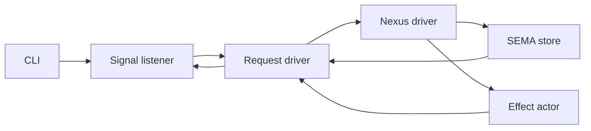
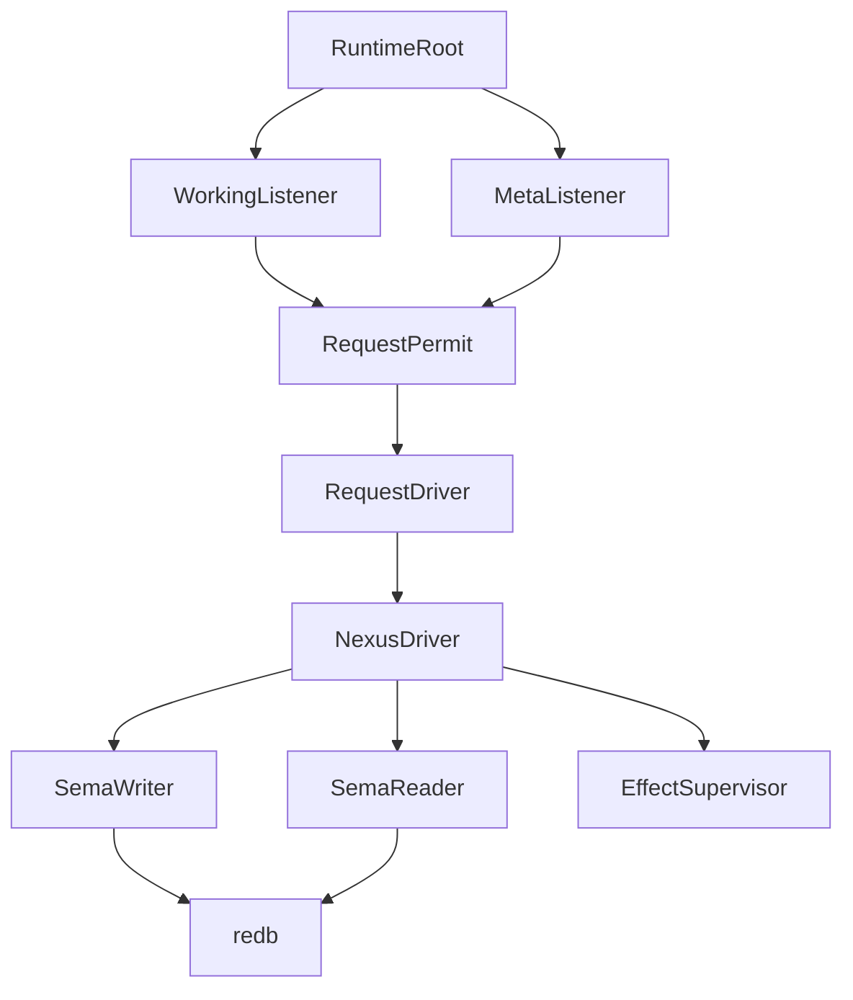
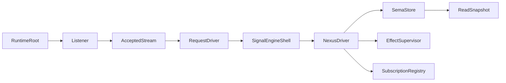
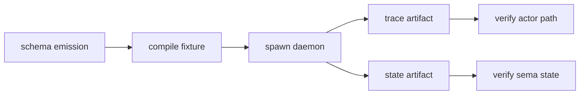

# Research: Actor-Native Implementation Gameplan

variant: Research
role: system-operator
date: 2026-06-07
primary-inputs:
- `reports/designer/553-actor-native-engine-rewrite/`
- `reports/system-operator/201-Audit-actor-native-engine-rewrite-second-pass-2026-06-07.md`

## Verdict

The implementation should proceed as a breaking rewrite. Backward compatibility is not a constraint for this stack: delete the synchronous daemon substrate, delete compatibility wrappers, and make tests assert that the old shapes are absent.

The next work is not "add Kameo around the existing runner." The correct move is to make actor ownership the runtime shape:

The first vertical slice should be `triad-runtime` + `schema-rust-next` + `message`. `message` is the best pilot because it is generated, small, and currently serializes through `Mutex<MessageEngine>`, so a slow-request sibling-responsiveness test will immediately prove whether the new actor path is real.

## Research Substrate

The external actor-system research supports the local direction:

- Kameo's own docs make `Self` the actor and provide spawn forms for async actors, custom mailboxes, dedicated-thread actors, and pre-linked supervision. This matches the workspace rule that the data-bearing noun is the actor, not a marker wrapper. Source: Kameo `Spawn` docs, https://docs.rs/kameo/latest/kameo/actor/trait.Spawn.html.
- Kameo's `Actor` docs put message handling, panic handling, link death, stop cleanup, and custom input selection into lifecycle hooks. This maps directly onto generated `RuntimeRoot`, `Listener`, `SemaStore`, and `Effect` actors. Source: Kameo `Actor` docs, https://docs.rs/kameo/latest/kameo/actor/trait.Actor.html.
- Erlang/OTP's mature actor practice is workers under supervisors in a tree; that supports treating supervision as topology, not logging around a loop. Source: Erlang OTP design principles, https://www.erlang.org/docs/27/system/design_principles.html.
- Akka explicitly separates supervision from business logic and treats restart as replacing an actor instance behind an actor reference. That is the right mental model for generated actor shells around sync-pure engine logic. Source: Akka supervision docs, https://doc.akka.io/libraries/akka-core/current/general/supervision.html.
- Orleans' virtual actor model names the unit as an entity with identity, behavior, and state, and separately marks stateless workers for parallelism. That reinforces the split between durable `SemaStore` actors and per-request/stateless driver actors. Source: Orleans overview, https://learn.microsoft.com/en-us/dotnet/orleans/overview.
- Tokio's `UnixListener::accept().await` is the correct listener primitive for deleting `set_nonblocking` + sleep polling. Source: Tokio UnixListener docs, https://docs.rs/tokio/latest/tokio/net/struct.UnixListener.html.
- Tokio's process API has explicit `kill_on_drop`, process groups, stdout/stderr pipe control, and caveats around reaping. That is the correct substrate for lojix Nix effects; `std::process::Command::output()` is the old blocking path. Source: Tokio process docs, https://docs.rs/tokio/latest/tokio/process/struct.Command.html.
- redb documents ACID transactions and MVCC support for concurrent readers and a writer. That supports SEMA write-actor plus read-snapshot design, provided the API proof validates the exact ownership boundary. Source: redb docs, https://docs.rs/redb/latest/redb/.

## Local Evidence

`triad-runtime` is currently synchronous:

- `src/daemon.rs` owns `DaemonRuntime`, `MultiListenerRuntime`, `SingleListenerDaemon`, and `MultiListenerDaemon` over `std::os::unix::net::UnixListener` / `UnixStream`.
- `src/daemon.rs` polls multi-listeners with `thread::sleep(self.listener_poll_interval.duration())`.
- `src/workers.rs` owns `BoundedWorkers` as `Mutex<usize>` + `Condvar` + `thread::spawn`.
- `src/runner.rs` owns `Runner::drive`, a synchronous loop that calls `apply_sema_write`, `observe_sema_read`, and `run_effect` inline.

`schema-rust-next` currently emits that synchronous shape:

- `message/src/schema/daemon.rs` is generated and imports `DaemonRuntime`, `SingleListenerDaemon`, `UnixStream`, and `LengthPrefixedCodec`.
- Generated `GeneratedDaemonRuntime` owns a single `engine` and runs decode -> handle -> encode in one `handle_stream`.
- `message/src/daemon.rs` sets `type Engine = Mutex<MessageEngine>` because the generated spine calls `handle_working_input` through `&Self::Engine`.

The holdouts are worse than the generated path:

- `repository-ledger/src/daemon.rs` and `cloud/src/daemon.rs` use thread-spawned blocking listeners and `Arc<Mutex<Store>>`.
- `lojix/triad-port/src/schema_runtime.rs` still shells out via `std::process::Command::output()`, buffering output and blocking until the Nix or SSH process exits.

The repo guidance is not yet aligned:

- `triad-runtime/INTENT.md` and `ARCHITECTURE.md` still frame `Runner::drive` as current runtime-owned machinery.
- `schema-rust-next/ARCHITECTURE.md` still says generated `NexusEngine::execute` creates the runner glue.
- `skills/component-triad.md` has the new actor-native statement but still carries old runner wording in the "Nexus mechanism substrate" section.

Those surfaces must be updated in the same work cycle as the code. Otherwise future agents will rebuild the same synchronous runner.

## Principles For The Rewrite

### 1. Actor ownership replaces shared locks

Every lock currently guarding mutable daemon state becomes an owning actor. The mailbox is the synchronization boundary. Shared locks remain only inside low-level external primitives when wrapped behind one actor-owned noun and covered by a truth test.

### 2. Sync-pure logic stays sync-pure

`triage_inner`, `decide`, `apply_inner`, and `observe_inner` should remain ordinary sync methods on data-bearing engine/store nouns. The async actor shell owns transport, admission, execution, and effect dispatch. This preserves cheap unit tests and avoids infecting schema-emitted domain logic with async ceremony.

### 3. Per-request Nexus, single-writer SEMA

The critical topology is per-request Nexus driver plus SEMA store owner:

One daemon actor around all logic is wrong because it reserializes requests. One SEMA actor for every read and write is also too blunt if it serializes reads behind unrelated writes. The store design must preserve writes as single-writer while proving read snapshots can progress concurrently and report the database marker they observed.

### 4. Effects are actors by duration and ownership

The effect taxonomy should be generated or runtime-owned:

- short synchronous bridge: `spawn_blocking` inside a bounded actor plane;
- long external command: `tokio::process` owned by a job/effect actor with process group, stdout/stderr streaming, explicit cancellation policy, and reaping;
- indefinite watcher: actor with async interval/watch input, not `thread::sleep`.

`lojix` goes straight to the long-process shape. No `spawn_blocking + DelegatedReply` for Nix builds.

### 5. Old surfaces are deleted, not adapted

No compatibility layer should preserve `SingleListenerDaemon`, `MultiListenerDaemon`, `DaemonRuntime`, `MultiListenerRuntime`, `BoundedWorkers`, or generated `NexusEngine::execute` as the runtime driver. A short migration branch may contain both while tests are being moved, but the merge-ready state deletes the old names or marks them test-only fixtures.

## Target Runtime Types

Names are working names; generated names may be scoped per component.

Required nouns:

| Noun | Lives In | Responsibility |
|---|---|---|
| `RuntimeRoot` | `triad-runtime` template emitted into component | owns children, startup, shutdown, policy |
| `Listener` | generated/runtime | async Unix accept loop per authority tier |
| `AcceptedStream` | `triad-runtime` | stream plus `ConnectionContext` and authority tier |
| `RequestPermit` | `triad-runtime` | bounded concurrency admission |
| `RequestDriver` | generated/runtime | decode frame, call Signal/Nexus, encode reply |
| `SignalEngineShell` | generated | actor wrapper over sync `SignalEngine` transforms |
| `NexusDriver` | generated/runtime | async continuation loop over sync `decide` actions |
| `SemaStore` | generated/runtime or `sema-engine` | single-writer durable state owner |
| `ReadSnapshot` | `sema-engine` proof first | typed redb read observation boundary |
| `EffectSupervisor` | `triad-runtime` + component effect schema | owns effect actor tree |
| `ProcessEffect` | component/runtime | long external command with cancellation policy |
| `SubscriptionRegistry` | `triad-runtime` | stream token and publisher state |

## Implementation Plan

### Phase 0 — Align the brief

Fix before code:

1. Edit report 553 file 0: remove the `spawn_blocking + DelegatedReply` lojix line and point to `tokio::process` with schema-visible cancellation.
2. Edit `skills/component-triad.md`: remove the old `Runner::drive` / generated `NexusEngine::execute` default-driver wording or mark it pre-actor legacy.
3. Edit `triad-runtime/INTENT.md` and `triad-runtime/ARCHITECTURE.md`: declare the actor-native runtime destination and demote the synchronous runner/listener substrate to retired.
4. Edit `schema-rust-next/INTENT.md` and `schema-rust-next/ARCHITECTURE.md`: generated daemon modules emit actor trees; `NexusEngine::execute` is not the runtime loop.
5. Resolve the canonical Rust toolchain from CriomOS/Home. Do not assume 1.88 if the active workspace standard is 1.89.

### Phase 1 — Kameo lifecycle truth lab

Create a tiny proof in `triad-runtime` or `kameo-testing` before broad emission:

- data-bearing actor with owned redb path;
- actor start opens the store;
- actor receives one write;
- actor stops;
- test waits on the documented shutdown surface;
- replacement opens the same redb path immediately;
- repeat under the exact Kameo dependency chosen for the generated stack.

This decides whether generated SEMA uses upstream `.spawn()` + bounded blocking bridge, upstream `spawn_in_thread`, or the workspace fork. If upstream cannot prove release-before-notify for exclusive resources, the generated stack should either use `.spawn()` with blocking bridges or adopt a forked Kameo lifecycle explicitly. No guessing.

### Phase 2 — `triad-runtime` actor primitives

Add runtime primitives that generated daemons can use:

- `RuntimeRoot` trait/object pattern for child topology and shutdown;
- `Listener` actor using `tokio::net::UnixListener::accept().await`;
- `AcceptedStream` carrying `ConnectionContext`;
- `RequestPermit` / `PermitPool` using async semaphore, replacing `BoundedWorkers`;
- `RequestDriver` helper over a component-provided decode/handle/encode object;
- actor trace collector that records actor start, accepted stream, request admitted, signal triaged, nexus step, sema write/read, effect start/finish, reply encoded;
- process-effect primitive for long commands using `tokio::process`, process group, streaming output, explicit cancellation;
- subscription registry actor or actor-owned registry.

Delete or gate-retire:

- blocking daemon loop;
- `ListenerPollInterval`;
- `BoundedWorkers`;
- synchronous `Runner::drive` as production runtime.

### Phase 3 — `schema-rust-next` actor emission

Rewrite `daemon_emit.rs` and the engine support emission:

- emit data-bearing actor types, not ZST marker shells;
- emit `impl Actor` on actual state owners;
- emit per-message `Message<T>` impls with typed replies;
- emit actor topology manifest as source-visible generated data;
- emit trace hook calls from generated trait surfaces;
- emit meta tier as decoded typed transport, not raw stream hook;
- keep `_inner` sync methods on generated engine traits;
- move continuation loop into `NexusDriver` actor;
- make `Continue` local loop recursion inside the handler, never self-ask;
- remove generated `NexusEngine::execute` default runtime driver.

Golden fixture tests in `schema-rust-next` should change from "this source contains the old daemon skeleton" to "this emitted fixture compiles into an actor topology and has no sync daemon spine."

### Phase 4 — `message` vertical slice

Regenerate `message` first and make it pass:

- build with actor-emitted daemon;
- process-boundary CLI -> daemon -> reply test;
- two concurrent clients where one request is artificially delayed and the other still completes;
- meta absence remains explicit: no meta listener because the schema has no meta tier;
- `Mutex<MessageEngine>` is gone;
- no generated import of `std::os::unix::net::UnixStream`;
- no generated import of `DaemonRuntime` / `SingleListenerDaemon`;
- actor trace proves Listener -> RequestDriver -> Signal -> Nexus -> reply path.

This phase proves the emitted transport and per-request Nexus shape without durable SEMA complexity.

### Phase 5 — SEMA proof and `spirit` pilot

Before regenerating all durable components, add the store API proof:

- `sema-engine::ReadSnapshot` or equivalent typed noun;
- write actor owns single write path;
- read observation can run from a snapshot without touching the write mailbox for the full scan;
- database marker binds reads to the observed revision/counter/hash;
- long read scans are bounded or cancellable so old MVCC pages are not held indefinitely.

Then regenerate `spirit` and test:

- record write persists through daemon restart;
- query path cannot touch write actor;
- collect-removal-candidates uses SEMA write actor and archive path;
- privacy-filter reads stay read-only;
- subscription events publish after commit, not before;
- restart/reopen same state path passes without sleep.

### Phase 6 — Multi-listener and meta pilot with `cloud`

Regenerate `cloud`'s emitted path:

- working and meta sockets are separate Listener actors;
- a slow working request cannot block a meta request;
- meta input is decoded typed meta-signal and routed through generated meta transport;
- old hand-written live daemon is either removed or renamed as a temporary fixture until migrated;
- no raw owner stream hook remains as default.

### Phase 7 — Hand-written holdouts

Migrate holdouts to the same runtime primitives rather than bespoke actor systems:

- `repository-ledger`: spool poller becomes timer/watch actor; store is an actor; request path and spool ingest cannot contend on an `Arc<Mutex<Store>>`.
- `cloud` live path: delete blocking listener and `Arc<Mutex<Store>>`; converge on emitted path.
- `lojix`: keep component-specific deployment semantics but use generated listener/root/store primitives and a `ProcessEffect` actor for Nix/SSH.

`lojix` needs extra tests:

- fake `nix` binary streams stdout/stderr incrementally;
- durable deploy survives client disconnect when schema says durable;
- speculative build dies on request cancellation when schema says coupled;
- process is reaped; no zombie process remains;
- long build does not block accepting another deploy-status query;
- Nix output is not buffered entirely in memory;
- signal reply reports job identifier/progress status, not only final output.

### Phase 8 — Broad migration and deletion

After `message`, `spirit`, and `cloud` pass:

- regenerate remaining schema-derived components;
- remove old synchronous daemon substrate from `triad-runtime`;
- remove compatibility imports and old tests;
- update component `INTENT.md`, `ARCHITECTURE.md`, `skills.md`;
- update flake locks and central local-override Nix runners;
- run full central integration checks on a remote builder.

## Test Gameplan

### Source-shape absence tests

These are negative guards, not proof:

- generated daemon cannot import `std::os::unix::net::UnixListener`;
- generated daemon cannot import `std::thread` or call `thread::sleep`;
- generated daemon cannot import `std::sync::Mutex` for engine ownership;
- generated daemon cannot refer to `SingleListenerDaemon`, `MultiListenerDaemon`, `DaemonRuntime`, `MultiListenerRuntime`, or `BoundedWorkers`;
- generated Nexus runtime cannot expose `NexusEngine::execute` as the production driver;
- `lojix` cannot use `std::process::Command::output()` in production path.

### Static type witnesses

- generated actor types implement `kameo::Actor`;
- every manifest-declared actor is non-zero-sized;
- every generated fallible message path is driven through `ask`, not `tell`;
- contract crates still have no `kameo`, `tokio`, or daemon runtime dependency;
- runtime schemas emit actor shell types only in daemon crates, never in `signal-*` contract repos.

### Runtime path witnesses

- process-boundary CLI request reaches daemon over signal-frame and returns typed reply;
- trace records the actor path in order;
- slow request cannot block a sibling request;
- slow working request cannot block meta request;
- query cannot send a write message to SEMA writer;
- subscription publish fires after commit;
- daemon restart releases socket and redb handles before replacement binds/opens;
- disconnected client follows operation cancellation/durability policy.

### Chained Nix witnesses

Use Nix outputs, not ad hoc commands:

Recommended flake outputs:

- `checks.<system>.schema-rust-next-actor-daemon-fixtures-compile`;
- `checks.<system>.message-daemon-cannot-serialize-slow-request`;
- `checks.<system>.spirit-sema-restart-cannot-race-redb`;
- `checks.<system>.cloud-meta-cannot-wait-for-working`;
- `apps.<system>.test-lojix-process-effect-cancellation`;
- central override runner in the pilot repo that overrides local `triad-runtime`, `schema-rust-next`, `signal-frame`, `message`, `persona-spirit`, and `cloud`.

## Migration Invariants

These are the constraints I would turn into named tests:

| Invariant | Witness |
|---|---|
| Listener accept is async and supervised | actor trace + absence of blocking listener imports |
| Request concurrency is permit-bounded, not thread-per-task | slow sibling test + configured permit cap |
| Nexus driver is per request | trace carries distinct request identifiers and independent cursors |
| SEMA writes are single-writer | marker monotonicity under concurrent writes |
| SEMA reads do not mutate | forbidden-edge trace rejects write actor messages |
| Long effects are not mailbox blocking | status/query replies during active fake Nix build |
| Long effects stream output | fake Nix emits chunks; trace/artifact receives chunks before exit |
| Cancellation is operation-specific | durable disconnect survives; speculative disconnect kills |
| Meta tier is typed generated transport | meta request decodes into generated meta input, no raw stream hook |
| Old sync substrate is gone | negative source guards in `triad-runtime` and generated fixtures |

## Best Implementation Order

1. Correct guidance surfaces and toolchain target.
2. Prove Kameo lifecycle/shutdown semantics.
3. Build `triad-runtime` actor primitives.
4. Emit actor daemon skeleton in `schema-rust-next`.
5. Regenerate and test `message`.
6. Add SEMA snapshot/store API proof.
7. Regenerate and test `spirit`.
8. Regenerate and test `cloud` meta/working split.
9. Migrate `repository-ledger` and cloud live holdouts.
10. Migrate `lojix` effects.
11. Delete old sync substrate and compatibility tests.
12. Run central Nix override checks on remote builder.

## Open Decisions

### Kameo dependency line

The generated stack needs one exact Kameo line. Current local reality is mixed: `chroma` and `harness` use upstream Kameo 0.20, while `mind` and `persona-spirit` use the workspace fork. My lean is: start with upstream 0.20 for generated daemons, but let the lifecycle truth test decide. If upstream cannot guarantee release-before-notify for exclusive resources, switch the generated stack to the fork or patch upstream as part of this rewrite.

### Rust toolchain

Do not choose 1.88 merely because Kameo 0.20 requires it. Several actor crates are already on 1.89. Resolve the canonical version from CriomOS/Home and update all touched crates, `rust-toolchain.toml`, Nix/Fenix inputs, and locks together.

### SEMA read ownership

The read-snapshot API still needs proof. The plan assumes redb MVCC can carry the shape, but the workspace needs a concrete noun (`ReadSnapshot`, `ReadView`, or similar) and tests for marker binding and long-scan bounds before broad generation.

### Lojix durable deploy semantics

The plan assumes durable deploy operations outlive client disconnect, while speculative validation/build queries may be request-coupled. This should be represented in schema as operation policy. If the psyche wants every deploy request coupled to the originating client, that changes the effect actor's default.

## Conclusion

The right implementation is a vertical-slice rewrite, not a compatibility migration. Start with the generated path and the smallest pilot, make actor ownership observable, and delete the old sync substrate once the pilot proves the path. The decisive tests are not actor counts alone; they are concurrency, trace, restart/reopen, and effect-cancellation witnesses that make the old shortcut unable to pass.
