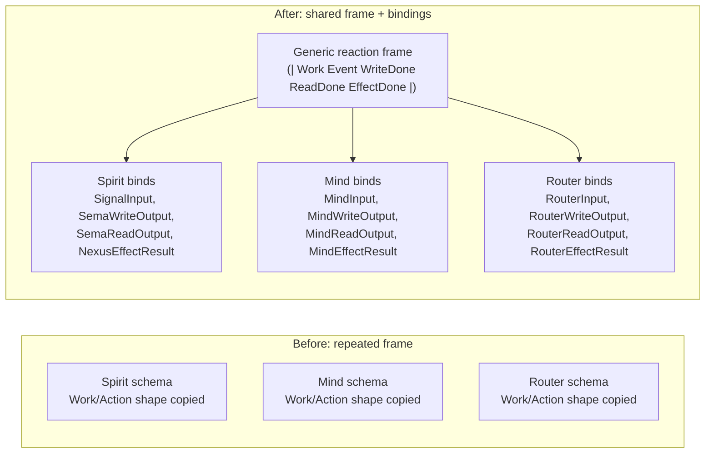
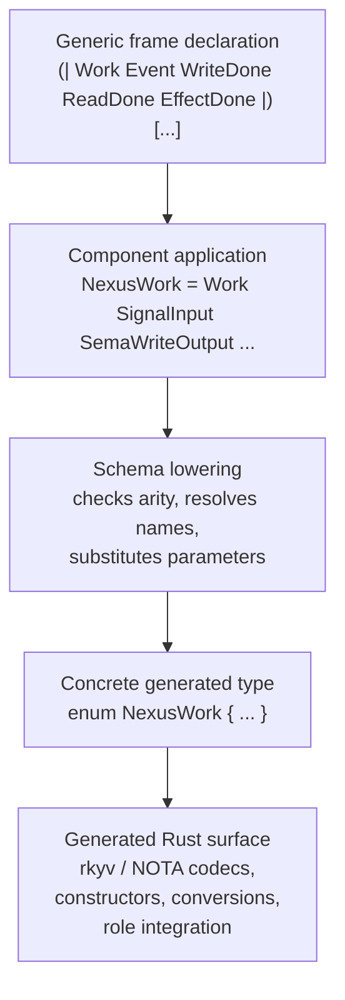
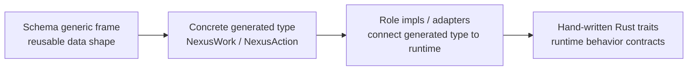
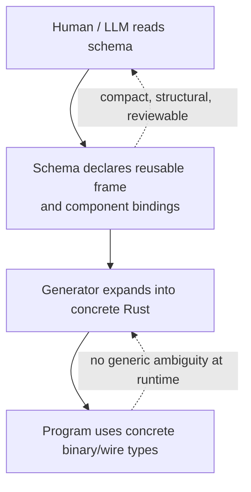
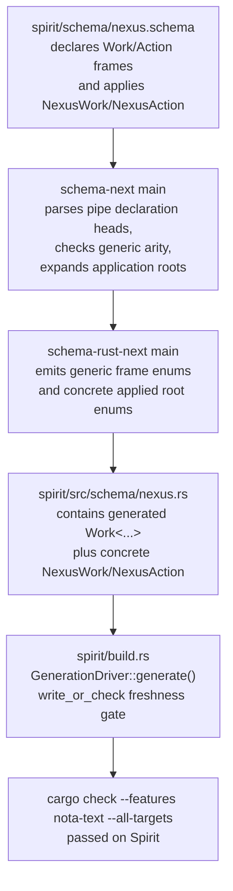

# 230 — Why Schema Generics / Reaction Frames Exist

## Short answer

Schema generics are not about Rust trait declarations. They are a schema-level
reuse mechanism for repeated data shapes.

The immediate reason for them is the component reaction plane: components keep
needing the same `Work` and `Action` enum skeletons, with only the payload nouns
changing. Generics let the schema declare that skeleton once, then bind concrete
payload types per component. Codegen expands the result into ordinary concrete
Rust types.

The gain is less duplicated schema, less drift, and a cleaner component
interface surface. The cost is one more layer of indirection, so it should be
reserved for repeated structural frames, not every domain type.

## The problem they solve

Without schema generics, every component repeats a near-identical reaction
shape:

```text
Spirit:
  Work = SignalArrived(SignalInput)
       | SemaWriteCompleted(SemaWriteOutput)
       | SemaReadCompleted(SemaReadOutput)
       | EffectCompleted(NexusEffectResult)

Mind:
  Work = SignalArrived(MindInput)
       | SemaWriteCompleted(MindWriteOutput)
       | SemaReadCompleted(MindReadOutput)
       | EffectCompleted(MindEffectResult)

Router:
  Work = SignalArrived(RouterInput)
       | SemaWriteCompleted(RouterWriteOutput)
       | SemaReadCompleted(RouterReadOutput)
       | EffectCompleted(RouterEffectResult)
```

That shape is not domain substance. It is framework structure. Copying it into
every component makes each schema longer and creates drift risk when the common
reaction contract changes.

## Before and after



The reusable part is the frame. The component-specific part is the list of
payload types plugged into it.

## What the schema says

The live Spirit pilot declares the reusable frame in
`/git/github.com/LiGoldragon/spirit/schema/nexus.schema`:

```nota
(| Work Event WriteDone ReadDone EffectDone |)
  [(SignalArrived Event)
   (SemaWriteCompleted WriteDone)
   (SemaReadCompleted ReadDone)
   (EffectCompleted EffectDone)]

(| Action Reply Write Read Effect Continuation |)
  [(Send Reply)
   (SemaWrite Write)
   (SemaRead Read)
   (Effect Effect)
   (Continue Continuation)]
```

Then Spirit binds those frames to concrete payloads:

```nota
NexusWork
  (Work SignalInput SemaWriteOutput SemaReadOutput NexusEffectResult)

NexusAction
  (Action SignalOutput CommandSemaWrite SemaReadInput NexusEffectCommand NexusWork)
```

That should be read as: "generate Spirit's concrete work/action enums using
this standard frame and these payload nouns."

## Expansion pipeline



The important detail: after expansion, the component gets a concrete type.
There is no runtime generic object here. There is no `T: Trait` bound involved
in the frame itself.

## Why no trait is required

Rust generics often use traits because code wants to call behavior on an
unknown type:

```rust
fn run<T: Runnable>(value: T) {
    value.run();
}
```

That needs a trait because `run()` is behavior.

The schema frame does not call behavior on its parameters. It only stores those
types in enum payload slots:

```rust
enum Work<Event, WriteDone, ReadDone, EffectDone> {
    SignalArrived(Event),
    SemaWriteCompleted(WriteDone),
    SemaReadCompleted(ReadDone),
    EffectCompleted(EffectDone),
}
```

And even that is only the mental model. Codegen lowers the schema application
into a concrete component type:

```rust
enum NexusWork {
    SignalArrived(SignalInput),
    SemaWriteCompleted(SemaWriteOutput),
    SemaReadCompleted(SemaReadOutput),
    EffectCompleted(NexusEffectResult),
}
```

No method is being called on `SignalInput` or `SemaWriteOutput` by the frame.
So the frame does not need a trait bound.

## The trait boundary



The generic frame owns structure. Traits own behavior. Impl blocks connect a
concrete generated type to a behavior contract. Mixing those three terms is the
source of most of the confusion.

## Actual gains

| Gain | Why it matters |
|---|---|
| Less schema duplication | The repeated `Work`/`Action` shape is declared once instead of copied into every component. |
| Less drift | A common reaction-frame change happens in one place, not across many hand-copied enums. |
| Cleaner component schemas | Component schemas focus on domain nouns: signal input, writes, reads, effects, replies. |
| Consistent generated surface | Codegen can emit the same codecs, conversions, and role hooks for every component using the frame. |
| Better review signal | Reviewers can distinguish "the framework frame changed" from "this component's domain changed." |
| Better content identity | The frame declaration and bound payload types are explicit schema input, so generated identity/versioning can include the real structural closure. |
| Scales with component count | The gain is modest for one component and strong when many daemons share the same reaction architecture. |

## What is clever here

The clever part is not "we invented generics." The clever part is putting
genericity at the schema layer where the repetition actually lives.



The source stays compact and structural. The runtime stays concrete. That is the
right trade: humans and agents see the pattern once; compiled code gets normal
types.

## What this does not buy

It does not create trait declarations. If the system needs a trait like
`RequestPayload`, that trait is still hand-written Rust unless a separate schema
feature is designed for trait declarations.

It does not remove the need for good component-specific modeling. Domain nouns
still belong in the component schema.

It does not justify genericizing everything. One-off shapes should remain plain
structs or enums. The frame mechanism earns its keep only when the same skeleton
appears in multiple places.

## Current state from the audit

The live component usage I found is Spirit's `schema/nexus.schema`. The same
generic-frame examples also exist in `schema-next` and `schema-rust-next`
fixtures/tests.

Frame expansion is live on main, not just conceptual.

The evidence chain is:



Concretely:

- `spirit/schema/nexus.schema` declares `(| Work Event WriteDone ReadDone EffectDone |)` and applies it as `NexusWork (Work SignalInput SemaWriteOutput SemaReadOutput NexusEffectResult)`.
- `spirit/src/schema/nexus.rs` is generated by `schema-rust-next` and contains both the generic data enum `pub enum Work<Event, WriteDone, ReadDone, EffectDone>` and the expanded concrete `pub enum NexusWork`.
- `schema-next/src/schema.rs` has the live expansion machinery: `RootApplication::expand_with`, `Schema::expand_application_root`, and `GenericArityMismatch` validation for applications.
- `schema-rust-next` has direct tests for this path. `tests/spirit_frame_application.rs` asserts that a named `NexusWork` frame application expands to a concrete enum and keeps the triad runtime impls. `tests/reaction_frame_emission.rs` asserts the shared generic frame emits as generic data enums.
- Spirit's `build.rs` runs `GenerationDriver::generate().write_or_check("SPIRIT_UPDATE_SCHEMA_ARTIFACTS")`, so a stale checked-in generated module fails the build. I ran `cargo check --features nota-text --all-targets` in Spirit and it passed.

So Designer's integrity flag resolves to: yes, frame expansion is deployed in
the current Spirit/schema stack. The adoption is still narrow: Spirit is the
live component pilot; the broader component set has not all been migrated to
frame bindings yet.

One documentation issue is visible: `schema-next/ARCHITECTURE.md` still has
loose wording around the generic declaration shape. The implemented/tested
shape is the pipe-parenthesized declaration head:

```nota
(| Work Event WriteDone ReadDone EffectDone |) [...]
```

not a prose shorthand like:

```nota
Name (| [params] body |)
```

That doc should be tightened so the feature does not keep being confused with
traits or impl declarations.

## Recommendation

Use schema generics for universal framework skeletons:

- reaction `Work`
- reaction `Action`
- other repeated component envelopes if they prove structurally identical

Do not use them for unique domain data. Do not describe them as trait
declarations. Treat them as schema macros with type parameters that lower into
ordinary concrete generated types.

The practical design rule is:

```text
Repeated structural frame across components -> generic frame.
One component's domain noun -> normal schema type.
Behavior contract -> Rust trait / impl layer, separate from frame generics.
```
