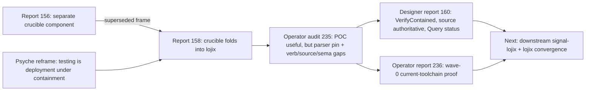
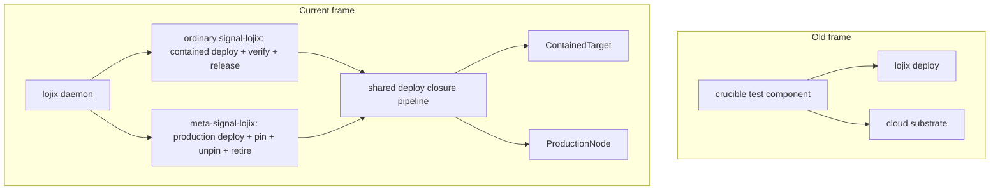
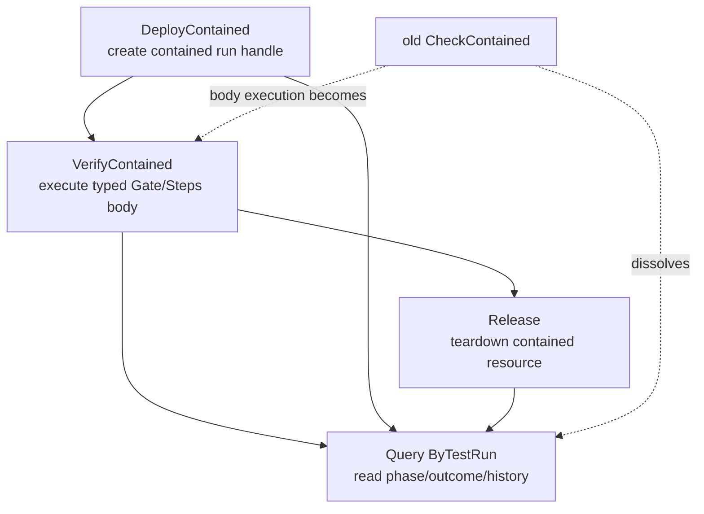
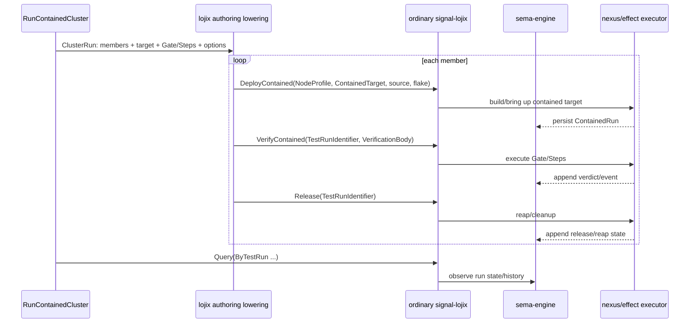
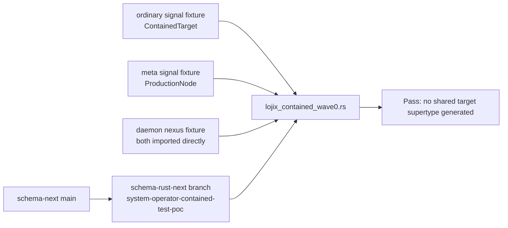
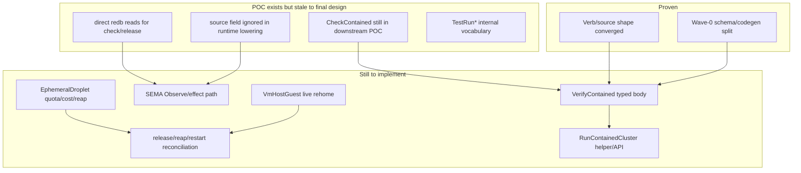
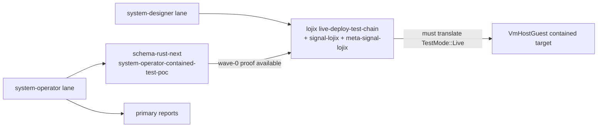

# Lojix contained deploy/test visual synthesis

System-operator re-presentation of the current lojix deploy/test work, after designer reports 158 and 160, operator audits 235 and 236, and the pushed schema-rust-next wave-0 proof `e5f33eed` (`Prove lojix contained target split on current schema toolchain`).

**Companion status.** Designer report `reports/system-designer/161-state-of-lojix-unified-deploy-test-visual-reassessment-2026-06-21.md` is the canonical wide-angle visual synthesis after lane convergence. This report is retained as the system-operator proof/debt snapshot: it records the operator view of the wave-0 proof, downstream implementation risks, and the then-open placement question for `RunContainedCluster`.

## Executive map

The work is no longer "build a separate testing component." The settled frame is:

- lojix is the deploy/test component;
- contained testing is the ordinary signal face;
- production deployment is the meta signal face;
- both use the same deploy body, but different target types;
- status is a read through `Query`;
- verification is an executable `VerifyContained` operation;
- cleanup is `Release`;
- live VM testing rehomes as `ContainedTarget::VmHostGuest`;
- `TestMode` disappears.



## What changed conceptually

Before the reframe, the shape was drifting toward a new `crucible` daemon that would use lojix/cloud machinery to run component tests. That was overbuilt. The better decomposition is that testing and deployment are the same mechanical act: build a closure and bring it up on a target. The safety difference is whether the target is throwaway or production.

So the split is not `deploy component` versus `test component`. The split is `ordinary contained target` versus `meta production target`.



The result is mostly subtraction. We do not need a new component triad. We need lojix's two existing faces corrected so the safe face gets contained deploy/verify/release and the privileged face keeps production mutation.

## The actual safety boundary

The strong invariant is not "ordinary cannot mention a cluster/node-shaped thing." It can name a `NodeProfile`, because a contained build needs to know which node profile to instantiate. The real invariant is: ordinary cannot carry a `ProductionNode`, and cannot target a live production generation for switch/promotion.

```mermaid
flowchart LR
  subgraph OrdinaryFace[Ordinary face: signal-lojix]
    NodeProfile[NodeProfile\ncluster + node + deployment kind]
    ContainedTarget[ContainedTarget\nHermeticVm | VmHostGuest | EphemeralDroplet]
    DeployContained[DeployContainedRequest\nDeployClosure + ContainedTarget + source]
    VerifyContained[VerifyContained\nrun Gate or Steps body]
    Query[Query ByTestRun\nstatus/read]
    Release[Release\ncleanup/reap]
  end

  subgraph MetaFace[Meta face: meta-signal-lojix]
    ProductionNode[ProductionNode\nreal live node]
    Deploy[DeployRequest\nDeployClosure + ProductionNode]
    Pin[Pin]
    Unpin[Unpin]
    Retire[Retire]
  end

  NodeProfile --> DeployContained
  ContainedTarget --> DeployContained
  DeployContained --> VerifyContained
  DeployContained --> Query
  DeployContained --> Release
  ProductionNode --> Deploy

  OrdinaryFace -. no ProductionNode type .- MetaFace
```

That gives two independent safety legs:

| Leg | Mechanism | Status |
|---|---|---|
| Type boundary | `ContainedTarget` lives in ordinary; `ProductionNode` lives in meta; daemon imports both directly without creating a shared target type | Proven at schema/codegen wave-0 in `schema-rust-next` commit `e5f33eed` |
| Authority boundary | meta socket checks owner credentials before decoding meta frames; ordinary socket has no production verbs | Existing daemon pattern, still needs final downstream code convergence |
| Lifecycle boundary | contained resources must be releasable/reaped and restart-reconciled | Designed, not complete in the POC |
| Cost boundary | `EphemeralDroplet` spends real money through daemon-owned bounded authority | Accepted in principle; needs lease/quota/cap/reconcile mechanisms before runnable |

## Current verb grammar

Designer 160 closes the main verb confusion:



`CheckContained` was a bad final verb because it conflated status and action. If it means "what happened?", that is `Query`. If it means "run the gate", that is `VerifyContained`.

The clean grammar is:

| User intent | Public operation |
|---|---|
| Start a contained deployment | `DeployContained` |
| Run a typed verification body | `VerifyContained` |
| Ask status/history/outcome | `Query (ByTestRun ...)` |
| Tear down the contained resource | `Release` |

## How the comfortable authoring layer fits

Designer 160 adds a user-facing cluster authoring layer. Its job is not to become a parallel language. It is a typed shorthand surface that lowers to the same ordinary roots.

Short form:

```nota
(RunContainedCluster (fieldlab [(Member criome) (Member spirit) (Member router)] HermeticVm Gate []))
```

Fuller form:

```nota
(RunContainedCluster
  (fieldlab
    [(Member criome) (Member spirit) (Kinded router OsOnly)]
    HermeticVm
    (Steps [
      (GateCase Criome AuthorizedShips (Threshold 1 [(Signer spirit-local-signer)]))
      (GateCase Criome ThresholdShortDenied (Threshold 1 [(Signer spirit-local-signer)]))
      (GateCase Criome UnconfiguredHeld NoGate)
      (Probe (OutboxDrained Spirit ServerCommitted))
      (Probe (RouterFanOut Router AttendPublishDeliverMatching))
      (DeployIntegrity Criome)
      (DeployIntegrity Spirit)
      (DeployIntegrity Router)])
    [(Lease 900) (MaximumGuests 3) (NetworkIsolation TapLayer3)]))
```

Lowering shape:



The important NOTA correction: options like `(Lease 900)` and `(MaximumGuests 3)` are variants in a vector, not labels. Short forms are sibling variants the daemon lowers, not under-filled structs.

## What is actually proven

The most important implementation update is that the prior operator POC no longer depends on a stale parser pin for the load-bearing type-safety proof. I updated the `schema-rust-next` branch `system-operator-contained-test-poc` and pushed commit `e5f33eed`.



The proof checks:

- ordinary generated Rust contains `ContainedTarget` and `DeployContainedRequest`;
- ordinary generated Rust does not contain `ProductionNode`;
- meta generated Rust contains `ProductionNode` and `DeployRequest`;
- meta reuses `DeployClosure` by import/alias;
- daemon nexus imports `DeployClosure`, `ContainedTarget`, and `ProductionNode` directly;
- daemon nexus emits separate `ContainedPipelineCommand` and `ProductionPipelineCommand`;
- daemon nexus does not synthesize `ContainedOrProduction`, `ProductionOrContained`, `ContainedProductionTarget`, `ProductionContainedTarget`, or `DeployTarget`.

Verification run:

```text
cargo test --test lojix_contained_wave0
cargo test
cargo fmt --check
```

The large fixture churn in that branch is not lojix design churn. It is the price of proving against current `schema-next` instead of pinning an old parser:

| Fixture migration | Meaning |
|---|---|
| Removed retired `*` struct markers | Current schema grammar no longer accepts the older positional marker syntax |
| Scalar fields now use `field.Type` | Explicit field role for scalar/domain values |
| PascalCase collection fields lower through wrapper types | Role-is-type discipline: `Services(Vec<Service>)`, not raw repeated field shape |
| Family fields restored as keyed pairs | `Family { record Entry table entries key Domain }` is a special form, not a regular struct |

## What is still only designed or sketched



The downstream operator POC branches still need convergence:

| Surface | Current known state | Required next shape |
|---|---|---|
| `signal-lojix` POC | Has `CheckContained` | Replace with `VerifyContained`; status via `Query` |
| `lojix` POC | Direct store checks for check/release | Route through SEMA observe/write and nexus effects |
| `DeployContainedRequest.source` | Present but runtime lowering ignores it | Use request source as authoritative override |
| live-deploy-test-chain | Uses old `TestMode::Live` worldview | Rehome as `ContainedTarget::VmHostGuest` |
| cluster test ergonomics | Designer report gives NOTA authoring shape | Implement lowering/API after lower contract is truthful |

## Lane and branch situation

Current coordination shows system-designer still holding the live lojix/signal/meta branches:



My system-operator lane is currently idle. The schema proof branch is pushed. The designer lane is still active on live VM/deploy related work and owns the canonical `/git/.../lojix`, `/git/.../signal-lojix`, and `/git/.../meta-signal-lojix` paths, so downstream operator convergence should use separate worktrees or wait for clean integration windows.

## The work in wave terms

| Wave | Goal | Status | Evidence |
|---|---|---|---|
| 0 | Prove current schema/codegen can keep contained and production targets unrelated while one daemon nexus routes both | Done on operator side | `schema-rust-next` commit `e5f33eed`; `cargo test` green |
| 1 | Land ordinary/meta contract split with correct verb grammar | Designed, POC stale | Reports 158/160/236 agree; downstream POC still has `CheckContained` |
| 1.5 | Translate live VM deploy-test work into `VmHostGuest` | In flight under system-designer | designer lock includes lojix/signal/meta live work |
| 2 | Make daemon runtime obey signal/nexus/sema boundary | Not done | direct store reads and source-ignore remain in POC |
| 3 | Add typed verification body and comfortable cluster authoring | Designed | report 160 gives `RunContainedCluster`, `Gate`, `Steps`, options |
| 4 | Add real `EphemeralDroplet` | Deferred | accepted only with bounded cloud authority, lease/quota/caps/reaper |

## My reassessment

The design is converging in the right direction. The important thing is that the safety story is now type-real, not just prose: current codegen can express the ordinary/meta split without collapsing both targets into a shared runtime discriminant.

The remaining risk is not architecture uncertainty. It is integration discipline. If the downstream branches land with `CheckContained`, ignored `source`, direct redb peeks, or `TestMode::Live`, they will reintroduce the old mistake under new names. The next implementation slice should be narrow and strict:

1. update the ordinary schema to `DeployContained / VerifyContained / Release / Query`;
2. make `source` authoritative in lowering;
3. make verification/release go through SEMA/Nexus;
4. only then layer `RunContainedCluster` on top;
5. translate the live branch to `VmHostGuest` with a negative test proving ordinary cannot resolve a real `ProductionNode`.

## Questions that still matter

1. Should `VerifyContained` append a durable structured event that `Query(ByTestRun ...)` observes, or is returning a verdict enough? I think it should append the event; otherwise status/history and execution disagree.

2. Should `Release` be legal before verification succeeds? I think yes: cleanup must always be available and idempotent, because failed tests need cleanup most.

3. Should `source` be required or optional? I think optional with an authoritative per-call override: daemon defaults keep the terse path easy, explicit source keeps provenance and test selection honest.

4. Should `TestRun*` be renamed to `ContainedRun*` now? I think yes before live `VmHostGuest` lands, because otherwise the old `TestMode` worldview will keep leaking back.

5. Should `RunContainedCluster` live in the signal contract or a helper/client layer? I lean helper/client first, then promote to signal only once repeated use proves it is not just a convenience macro.
