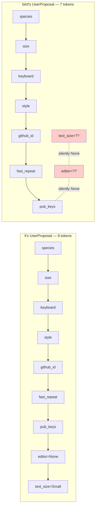
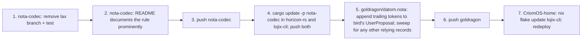

# Nota — implementation violates the all-fields-present rule

Author: Claude (system-specialist)

`nota-codec`'s `Option<T>::decode` silently treats a missing trailing
field as `None` instead of erroring. That violates the foundational
Nota contract — every field in a record must be explicit in the
source text — and it hides datom-migration debt: stale records keep
parsing after a schema change instead of forcing the migration.

This report names the gap, shows what it has been hiding in our own
datoms, and lays out the fix.

---

## The rule (Li's vision)

Nota records are positional. The contract is:

> When a record schema declares N fields, every datom for that record
> carries N tokens — one per field, in declaration order. A field's
> *type* may be `Option<T>` (representing "no value / no preference"),
> but the *source text* always includes that field's token: `None`,
> `[]`, the variant name, or whatever the empty form for that type is.
> There is no "skip a field." Ever. Not at the start, not in the
> middle, not at the end. Every Nota message has exactly the number of
> tokens its record schema declares.

This is the property that makes a positional format work as a
versioned schema source: a schema change is *visible* — every existing
datom has to be updated to carry the new field, and that migration
is a tracked diff. The compiler cannot enforce datom freshness at
build time; the parser must. If the parser is lax, schema drift
silently accumulates.

### The rule applies to every Nota consumer, by construction

Beyond fixing the present implementation, the *architecture* must
make this rule unavoidable for future readers and contributors. No
one writing a future Nota record, decoder, or schema extension should
be able to introduce implicit-field handling without first seeing —
and consciously choosing to break — the rule.

That means the rule lives in three places:

- **`nota-codec/README.md`** — at the top, as the foundational
  property. Anyone learning the format reads this first.
- **`nota-codec/ARCHITECTURE.md`** — named as a load-bearing
  invariant alongside the format's other commitments.
- **The code itself** — doc-comments at the offending trait sites
  (`Decoder`, `NotaDecode for Option<T>`) point explicitly at the
  invariant, so a future contributor reading the impl encounters
  the prohibition before considering a "convenience" branch.

A regression test backs all three: a record with a missing trailing
field must error. That test becomes the mechanical guardrail.

---

## The implementation (today)

`nota-codec/src/traits.rs`, `impl<T: NotaDecode> NotaDecode for Option<T>`:

```mermaid
flowchart TD
  start[decode Option&lt;T&gt;] --> p1{peek = explicit None token?}
  p1 -->|yes| n1[consume; return None]
  p1 -->|no| p2{peek = record-end ')' ?}
  p2 -->|yes| n2[return None — DO NOT CONSUME]
  p2 -->|no| dt[recurse into T::decode]

  style n2 fill:#fcc,stroke:#a00
```

The middle branch (red) is the violation. When the parser is sitting
at the closing `)` of a record because the source text ran out of
tokens, this branch returns `Ok(None)` and lets the outer record
decoder consume the `)` as if all fields had been present.

The branch is mechanical: every trailing `Option<T>` field gets
silently `None`-defaulted. There is no explicit token in the source.

---

## What the rule should produce

```mermaid
flowchart TD
  start[decode Option&lt;T&gt;] --> p1{peek = explicit None token?}
  p1 -->|yes| n1[consume; return None]
  p1 -->|no| dt[recurse into T::decode]
  dt -->|next token is ')'| err[error: expected None or token, got ')']

  style err fill:#cfc,stroke:#070
```

Two paths only. Every field decode either:

- consumes an explicit `None` token, or
- recurses into `T::decode` (which on `)` errors out, propagating
  upward as "expected token, got `)`").

A datom missing a trailing field fails to parse. Loud failure, exact
location, named missing field — the migration becomes a tracked diff
in the datom file that lands alongside the schema change.

---

## What the bug has been hiding

### `goldragon/datom.nota` — bird's `UserProposal`

`horizon-rs`'s `UserProposal` gained two fields this session:

- `editor: Option<Editor>`
- `text_size: Option<TextSize>`

li's record was updated to carry trailing tokens (`None` for editor,
`Small` for text_size). bird's record was not. The struct now has 9
fields; bird's record carries 7. The two missing trailing fields
silently default to `None` via the implementation's lax branch.



bird's record is *invalid Nota under Li's rule* — and parses anyway.

### Other consumers

`NodeProposal` has multiple trailing `Option<T>` fields
(`router_interfaces`, `online`, `nb_of_build_cores`). Every node
record in `goldragon/datom.nota` ends with explicit `None` tokens
already, so those records are compliant — but only by convention,
not by enforcement.

---

## The audit-finding-#2 confusion this branch produced

`reports/designer/9-cluster-config-audit.md` finding #2 framed the
session's `TextSize` cost as "`NotaRecord` doesn't auto-default
non-Option fields with `Default` impls." That framing was wrong on
two counts:

- The rule says no field is auto-defaulted, ever. The audit asked for
  an extension that would make the violation worse.
- The reason `TextSize` *appeared* to need wrapping in `Option<>` was
  not that the macro lacked a default-handling feature — it was
  that the lax branch made `Option<TextSize>` *seem* to "work" on
  unmigrated datoms, while plain `TextSize` correctly errored.

The session-cost wasn't a tax on schema growth. It was a tax on me
relying on the lax branch instead of migrating bird's record. Audit
finding #2 is hereby *retracted*. Finding #8 (`Editor` and `TextSize`
share `Option<>` for different reasons) also dissolves — both fields'
`Option<>` is load-bearing semantics ("user has no preference; use
the default in projection"), not a parser artifact.

---

## Fix



**Step 1 — `nota-codec`.** Three-line removal of the lax branch.
Add a test under `nota-codec/tests/` that constructs a record with a
missing trailing `Option<T>` field and proves it errors with the
expected diagnostic.

**Step 2 — Doctrine.** The all-fields-present rule lands in three
places so a future contributor encounters it from any entry point:

- top of `nota-codec/README.md`,
- `nota-codec/ARCHITECTURE.md` as a load-bearing invariant,
- doc-comments on `NotaDecode for Option<T>` and on `Decoder` itself
  pointing at the invariant.

The aim is that no future contributor can introduce implicit-field
handling without first reading why they shouldn't.

**Step 3 — push.** New `nota-codec` rev for downstreams.

**Step 4 — consumer relock.** `cargo update -p nota-codec` in
`horizon-rs`'s and `lojix-cli`'s Cargo.lock files. Push both.

**Step 5 — datom migration.** `goldragon/datom.nota`:

- bird's `UserProposal` gets trailing `None` (editor) and `Medium`
  (text_size).
- Sweep every other record for missing trailing tokens; the strict
  decoder will surface any I miss.

**Step 6 — push goldragon.**

**Step 7 — re-deploy.** `nix flake update lojix-cli` in
`CriomOS-home` (per the just-do-it rule in
`skills/system-specialist.md`); deploy home generation.

---

## Why this is P1, not a slow burn

A parser that doesn't enforce its own contract is an accelerator on
schema drift. Every new field added to any Nota record from now on
will silently default on every unmigrated datom, until someone
notices a wrong value at runtime. The longer the lax branch stays in,
the more datoms accumulate unaccounted-for invariants. The fix is
small, mechanical, and forces every consumer's datoms into
compliance with the rule that always governed them.

---

## See also

- `reports/designer/9-cluster-config-audit.md` — finding #2 is
  retracted by this report; finding #8's framing dissolves.
- this workspace's `skills/system-specialist.md` §Just-do-it
  operations — the cascade procedure (lock bumps + redeploy) this
  report's step 7 follows.
- `nota-codec`'s `traits.rs` — the file the fix lands in.
- `nota-codec`'s README — the file step 2 updates.
