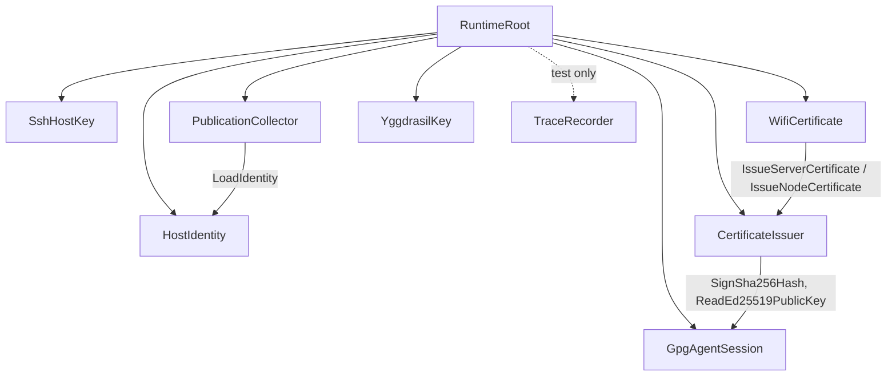

# 109 — Clavifaber state of the system

A wide review of clavifaber as it stands today, after primary-3t9
(YggdrasilKey), primary-ari (WifiCertificate), and primary-jg1
(audit) landed. Written so a future agent can compact the session
context against this snapshot.

## Where we stand

Clavifaber is a **one-shot convergence runner**: a host service that
brings on-disk private host material in line with the desired state
declared in one positional NOTA `Converge` request, then exits. It
publishes a typed `PublicKeyPublication` for other hosts to consume.
There is no daemon; there is no networked consumer; the publication
file is the haywire-stage cluster contract.

What's done:

- The cert-cutting machinery (GPG-Ed25519 → X.509 CA/server/client)
  works against the real gpg-agent.
- The host identity (SSH ed25519) is generated and persisted with
  atomic writes and corrupt-key quarantine.
- The Yggdrasil identity is generated and statically projected
  (public key + IPv6 address) to the publication.
- The convergence runner gates on an sha256 of the NOTA-encoded
  input, persisted in `clavifaber.redb`. Idle activations exit in
  milliseconds.
- The runtime is Kameo; every named plane is an actor; blocking IO
  (gpg-agent, yggdrasil binary) runs in `spawn_blocking` +
  `DelegatedReply` so mailboxes stay responsive.
- 23 constraint witnesses are guarded by tests in `tests/`. `nix
  flake check` is the canonical gate (8 derivations, including
  chained writer/reader for state durability). `nix run
  .#test-pki-lifecycle` is the impure end-to-end with real
  gpg-agent (8 phases, including the YggdrasilPlan and the
  WifiCertificate routing).

What CriomOS does with this:

- `modules/nixos/complex.nix` defines a `complex-init` systemd
  oneshot that runs the Converge request at boot, before
  NetworkManager and sshd. The unit's `Path = [ pkgs.yggdrasil ]`.
  Today the Converge passes `yggdrasil = None` because the
  consolidation with `modules/nixos/network/yggdrasil.nix`'s own
  keypair-seed step is not done yet (primary-8b3).

## Actors today



| Actor | Plane it owns | Why an actor |
|---|---|---|
| `HostIdentity` | SSH ed25519 host identity (on-disk private key + node-identity-in-memory) | State-bearing across calls. Failure-recoverable (corrupt-key quarantine). Typed messages (`EnsureIdentity`, `LoadIdentity`). |
| `SshHostKey` | `ssh.pub` projection from the loaded identity | Stand-alone publishing plane; the file is a separate output from the private key. **Borderline** — has only one message, could be a method on `HostIdentity`. Kept separate so a future ssh-key rotation can name it. |
| `GpgAgentSession` | gpg-agent connection (blocking IO) | The crate-private `gpg_agent` module is reached only here. `DelegatedReply` + `spawn_blocking` keep the mailbox responsive while gpg signs. |
| `CertificateIssuer` | X.509 cert minting (CA / server / node / verify) | Bridges typed cert requests + a signer closure to typed certs. Asks `GpgAgentSession` for the actual signature. Domain plane. |
| `WifiCertificate` | wifi-PKI cert lifecycle (server + client cert issuance) | Names the wifi domain plane. Idempotent skip when output files exist (no CA read, no gpg-agent traffic). Routes to `CertificateIssuer`. |
| `YggdrasilKey` | Yggdrasil keypair file + static projection | Owns the `yggdrasil` binary plane (forbidden-edge witness locks this). `DelegatedReply` + `spawn_blocking` for the subprocess. |
| `PublicationCollector` | `PublicKeyPublication` record assembly | Asks `HostIdentity` for the loaded identity; projects the typed Yggdrasil/WiFi/SSH inputs into one record. Domain plane. |
| `TraceRecorder` | Test-only mailbox for trace events | Production passes `None` for the tracer; tests pass a `TraceRecorder` ActorRef and read the recorded sequence. |

All actors carry data fields. No public ZST actors. No
`Arc<Mutex>`. No raw `tokio::spawn` outside the documented
`DelegatedReply` detach pattern. The blocking-IO anchors are
`GpgAgentSession` and `YggdrasilKey`.

## Parts that are NOT actors and why

| Component | Why not an actor |
|---|---|
| **NOTA argv parsing** (`CommandLine`, `CommandLineArgument` in `request.rs`) | Stateless decoding of `argv` → typed `ClaviFaberRequest`. No mailbox semantics; no state across calls. Pure transform. |
| **`State` (sema-backed redb handle)** | Used in exactly one place — `Converge::execute` opens it, checks the convergence ledger, runs actors, writes the ledger, drops it. A long-lived `ConvergenceLedger` actor would be ceremony for a one-shot runner. Could become an actor if the runner ever grows multiple state-owning concerns. |
| **`AtomicFile` utility** (`util.rs`) | Low-level write-then-rename. Actors call it directly; no need for a "FileWriter" actor — the operation is short, sync, and bounded. `tests/forbidden_edges.rs::all_file_writes_go_through_atomic_file` enforces single ownership. |
| **`x509` cert types** (`CertificateDer`, `UnsignedCertificate`, `ServerCertificate`, `NodeCertificateSigningRequest`, etc.) | Pure data-bearing types with methods. Cert construction is sync and IO-free. The signer closure pattern keeps gpg-agent dependency on the actor side. |
| **`identity` types** (`IdentityDirectory`, `NodeIdentity`) | Sync file IO on a single directory. Used only inside `HostIdentity`. No need for a separate actor. |
| **`yggdrasil` data types** (`YggdrasilKeypairFile`, `YggdrasilProjection`, `YggdrasilPlan`) | Same as above — sync subprocess + file IO, used only inside `YggdrasilKey`. |
| **`converge_certificate_authority` free function** (`request.rs`) | **Irregular.** Same shape as `WifiCertificate`'s handlers (ask gpg-agent for pubkey, ask CertificateIssuer to issue, write CA cert) but lives as a free helper in `Converge::run_actors`. **This is a verb without the right noun.** See "Diagnostic readings" below. |
| **`PublicKeyPublicationRequest::collect`** (`publication.rs`) | Free-method on the request type. Routes through actors but the request type is the noun. Same shape as `Converge::execute`; this is just the legacy non-Converge surface. |

## Diagnostic readings (ugly parts)

Per `~/primary/skills/beauty.md`, the aesthetic discomfort IS the
signal. Recording them as named items so they can be addressed
rather than internalised.

### `converge_certificate_authority` is a verb without a noun

`Converge::run_actors` calls `converge_certificate_authority(&runtime,
plan)` as a free function. It does the same thing
`WifiCertificate.EnsureWifiServerCertificate` does: load the public
key from gpg-agent, ask `CertificateIssuer` to issue, write the
result.

The wifi-PKI server + client cert paths now route through
`WifiCertificate`. The CA path doesn't, because "a CA can sign
anything; it's not wifi-shaped". But the CA path IS doing cert
issuance and DOES belong to a domain plane: **the cluster CA**.
Either a `ClusterCertificateAuthority` actor with
`EnsureCertificateAuthority`, or fold it under `WifiCertificate`
since today's only CA in the cluster IS the wifi-PKI root.

Today's shape leaves "where does CA issuance live?" answered by
"a free function in `request.rs`". That's the readings list's
"free function that should be a method" item.

**Smaller variant of the same**: `Converge::run_actors` itself is
~30 lines orchestrating the per-plane asks. It's the right thing for
this layer (`Converge` IS the convergence-plan execution) but reads
as a sequential pipeline. It could be expressed as a
`ConvergencePipeline` actor that sequences phases — but **that's
over-engineering** for a one-shot runner. Note it; don't fix it.

### Two paths for writing files: `AtomicFile` direct vs. `TextFile.write_public/write_private`

- `WifiCertificate` and `YggdrasilKey` and `SshHostKey` call
  `AtomicFile::new(path).write_bytes(bytes, mode)` directly.
- `request.rs`'s `TextFile` wrapper (`from_path`, `read`,
  `read_certificate`, `write_public`, `write_private`) layers
  read+write helpers on top of `AtomicFile`.

`TextFile` adds little — the `write_public`/`write_private`
distinction is just "mode 0644 vs 0600". The read path is a
two-liner. Two equivalent ways to write to a file is one too many.
Pick `AtomicFile` everywhere or grow `TextFile` to mean something.

### Legacy compatibility CLI alongside Converge

The Clap surface has `complex-init`, `derive-pubkey`, `ca-init`,
`server-cert`, `node-cert`, `verify`. Each of these has a matching
NOTA request type (`IdentityDirectoryInitialization`,
`PublicKeyDerivation`, etc.) and an `execute()` method that spins
up a fresh `RuntimeRoot`.

The bead notes call this "temporary compatibility from the
extracted prototype". The proper operator surface is the single
NOTA `Converge` record. Everything `complex-init` + `derive-pubkey`
+ `ca-init` + `server-cert` + `node-cert` does can be expressed as
a single Converge with the appropriate plans.

The compat CLI is also the only consumer of the
`PublicKeyPublicationRequest` shape, which is a thin legacy of
"give me the publication without doing convergence".

**Retirement question**: do we drop the Clap CLI entirely once
CriomOS no longer references it? `test-pki-lifecycle` still uses
`complex-init`, `derive-pubkey`, `ca-init`, `server-cert`,
`node-cert`, `verify` for Phases 2-7. Phase 8 already uses pure
Converge. Phases 2-7 could be rewritten as Converge invocations
too.

### `wifi_client_certificate_pem` is the next opaque-string smell

```rust
pub struct Converge {
    ...
    pub yggdrasil: Option<YggdrasilPlan>,           // fixed in primary-3t9
    pub wifi_client_certificate_pem: Option<String>, // still opaque
    ...
}
```

`yggdrasil_address` + `yggdrasil_public_key` used to be opaque
caller-supplied strings. primary-3t9 fixed that — the caller hands
in a `YggdrasilPlan` and the YggdrasilKey actor mints the public
projection.

`wifi_client_certificate_pem` is the same anti-pattern, still
present. The caller supplies a PEM blob; the publication carries
it verbatim. The right shape: `WifiCertificate` issues the client
cert; `PublicationCollector` reads the cert file and projects the
PEM (or — better — drops the field, since the cert path is enough
and consumers can read the file themselves).

This is a clear future bead.

### Converge field grouping is awkward

```
identity_directory      — operational
node_name               — operational
publication_output      — output
yggdrasil               — plane plan
wifi_client_certificate_pem  — opaque content
state_database          — operational
certificate_authority   — plane plan
server_certificate      — plane plan
node_certificates       — plane plans
```

Operational, output, plane, and content fields are intermixed.
Could be split as nested records: `Converge { runtime:
RuntimeFields, planes: PlanesFields }`. **But that breaks NOTA
field-order compatibility** — any reorder is breaking.

Note: NOTA positional records are write-once schema-wise. Bug
prevention: if we're going to reorder, do it once and atomically
update every consumer (the test fixture, CriomOS, the
`state-write` check, the pki-lifecycle script).

### `extract_private_key` is a hand-rolled JSON parser

In `src/yggdrasil.rs`:

```rust
fn extract_private_key(json_bytes: &[u8]) -> Result<String, Error> {
    let text = std::str::from_utf8(json_bytes)...
    let needle = "\"PrivateKey\"";
    let start = text.find(needle)?;
    // ... manual quote-and-colon walking
}
```

This parses one field out of `yggdrasil -genconf -json`'s output.
Rationale: `serde_json` is the workspace's general "forbidden
between Rust components" — but this is reading the output of an
external binary, not a Rust↔Rust boundary, so serde_json would
actually be allowed.

The hand-rolled parser works but is fragile (depends on the field
appearing first, no nested quotes, etc.). yggdrasil's output is
stable enough that it works today. **A reasonable cleanup**: add
`serde_json` as a workspace-edge codec for external-tool output
and rewrite `extract_private_key` as a one-liner.

### `SshHostKey` actor is borderline

It has one message (`WritePublicKeyProjection`) that takes the
loaded identity + a directory, calls `IdentityDirectory.write_open_ssh_public_key`,
returns the projection. The "actor" mostly just exists to be a
named noun in the topology.

Per `~/primary/skills/actor-systems.md` §"Actor or data type": if
the actor wraps one data type and forwards to its methods without
adding lifecycle/supervision/failure policy, the data type IS the
actor. Here the data type is `IdentityDirectory` (owned by
`HostIdentity`), so `SshHostKey` is a forwarding helper.

Two ways out:

- Drop `SshHostKey`. Move `WritePublicKeyProjection` into
  `HostIdentity` as a third message. `PublicKeyDerivation` flow
  becomes `LoadIdentity` + `WritePublicKeyProjection` on the same
  actor.
- Keep `SshHostKey` but give it more — a sema-persisted view of
  what public projections currently exist, a rotation message
  later. Defensible if rotation lands soon.

Today it doesn't carry its weight. Note it.

### `redb` is owned by request handlers, not by an actor

`Converge::execute` opens a `State` (sema redb), checks the
convergence ledger, drops the State, runs `run_actors`, opens
State again to write the ledger. `InspectState::execute` opens
it for the read-only path.

For a one-shot runner this is fine. If clavifaber ever grows
multiple concerns that touch the database (per-concern ledgers
once rotation lands), a `Ledger` actor will need to own it —
otherwise two open paths inside one process will race.

## What might be missing

### Behavior coverage gaps

1. **External file deletion is not recovered from.** If a user
   `rm`s `key.pem` between converge runs but doesn't change any
   Converge input, the gate skips. The host wakes up next time
   with no private key file (until the next genuine input change).
   **Design question**: should the gate verify on-disk files
   match the ledger's expected state? Today it doesn't.
   Workaround: change any input field to force a re-run.

2. **redb corruption is not tested.** If `clavifaber.redb` is
   corrupted between activations, `State::open` returns
   `Error::State(...)`. Systemd reports the unit as failed. There
   is no recovery path that would, e.g., quarantine the corrupt
   file and start fresh (the way `HostIdentity` quarantines
   corrupt `key.pem`).

3. **`VerifyCertificateChain` does not check expiration.**
   **Confirmed.** `src/x509.rs::CertificateChain::verify` checks
   only issuer-matches-CA-subject (line 310) and Ed25519 signature
   (line 599 `CertificateSignature::verify`). It does not read
   `tbs_certificate.validity.not_before` or `.not_after`. An
   expired certificate passes `verify()` — which is a security
   defect. For the haywire stage, cert lifetimes are 365 days so
   expiration is not immediate, but `clavifaber verify` and
   `Converge`'s implicit verify-after-issue both have this hole.
   **Fix priority is HIGH.** Action: add validity-window check
   in `CertificateChain::verify`; add tests with `not_after` in
   the past (must fail) and inside the window (must pass).

4. **Two yggdrasil identities per host.** Until primary-8b3 lands,
   `clavifaber.YggdrasilKey` and `network/yggdrasil.nix` each
   own a separate keypair. The publication carries one; the
   running daemon uses the other. They disagree.

### Missing planes

5. **Rotation / renewal.** No `RotateIdentity`, no
   `RenewBeforeExpiry`, no timer-driven schedule. Affects:
   - SSH host key
   - X.509 CA, server, client certs
   - Yggdrasil keypair
   - Will become urgent once any cert nears `not_after`.

6. **No structured event emission for observability.** Convergence
   runs are silent except for stdout's `ConvergenceComplete`
   record. No metrics, no audit log entry, no per-host trace
   that an operator could collect.

7. **No cluster-side consumer of `publication.nota`.** The
   haywire-stage contract assumes a future component pulls each
   host's publication file via SSH; that component does not
   exist. primary-e3c is the bead.

### Missing tests

8. **Failure-injection runtime witness.** The bead asked for "a
   slow yggdrasilctl invocation does not block sibling actors".
   The code-shape claim (DelegatedReply + spawn_blocking) is
   testable: inject a 1s-blocking signer, send a message to that
   actor, and assert another actor's mailbox replies during the
   wait. Needs an injectable signer in `GpgAgentSession` and
   `YggdrasilKey`.

9. **DelegatedReply panic-path coverage.** The handler's `match
   join { Err(_) => Err(Error::...) }` branch is not exercised by
   any test. A test that panics inside the spawn_blocking
   closure should still produce a typed `Error` reply, not crash
   the actor. Today untested.

10. **Convergence-gate hash stability.** The gate hashes the
    NOTA-encoded plan. If NOTA-encoding is non-deterministic
    (rare but possible — option-order, whitespace), the hash
    drifts and the gate doesn't skip when it should. Add a test
    that the hash of a `Converge` value is byte-stable across
    encodings.

11. **Multi-call concurrency under one actor.** Today Converge
    runs cert issuance sequentially per node. If a future caller
    sends 10 `EnsureWifiClientCertificate` messages in parallel,
    they all serialize on the mailbox. The forbidden-blocking
    rule survives, but the throughput is bounded. No tests
    exercise this.

12. **End-to-end on real systemd.** primary-mm0's NixOS test +
    Prometheus runner. Until that lands, "the systemd unit
    works" is a manual claim, not a test contract.

## What I'm not clear about

1. ~~Whether x509 verify checks `not_after`.~~ **Verified:** it
   does not. Moved up to confirmed gap §"Behavior coverage gaps"
   item 3.

2. **Whether the yggdrasil keypair file format
   (`{"PrivateKey":"<hex>"}`) is the right shape.** CriomOS's
   existing module merges this with a network overlay before
   running yggdrasild. Other consumers might want the full
   yggdrasil config (PublicKey + PrivateKey + interface settings).
   The compromise: clavifaber writes the private material only;
   the network overlay supplies operational fields. But if some
   future use wants a "complete" config, we'd need a
   `YggdrasilCompleteConfig` plan field. Open question.

3. **Where the cluster CA private key lives.** Today the
   `keygrip` references a GPG key in the gpg-agent of the
   *running clavifaber process's user*. For boot-time
   complex-init that's root. The deploy story for "how does the
   cluster CA's gpg key reach the cluster host" is not described
   in clavifaber's docs — it's assumed to be there. Probably
   correct (GPG keyrings are operator territory) but I haven't
   verified it.

4. **Whether anything depends on the legacy compat-CLI shape.**
   `test-pki-lifecycle` does (Phases 2-7). CriomOS doesn't
   (it uses Converge only). Other repos? Unknown. Worth a
   `rg complex-init|derive-pubkey|ca-init|server-cert|node-cert`
   sweep across the workspace before retiring the compat CLI.

5. **Whether `PublicKeyPublicationRequest` has any remaining
   consumer.** Same question — it might be dead code waiting to
   be removed.

6. **The right shape for `wifi_client_certificate_pem`.** Should
   it become a `WifiClientCertificatePlan` on Converge (caller
   names a path; WifiCertificate issues and publication reads
   the file)? Or should the field be dropped entirely from
   `PublicKeyPublication` once consumers can read the cert files
   themselves?

7. **What `primary-3m0` (the umbrella meta-bead) should consider
   "done".** 7 of 9 children closed; remaining `e3c` (parked)
   and `mm0` (other lane). Up to the user.

## Suggested next moves (ordered by usefulness)

Each is a candidate bead.

1. **`wifi_client_certificate_pem` → actor-driven.** Same shape
   as primary-3t9's yggdrasil fix. Highest signal: another opaque
   string off the caller's plate.

2. **Drop `SshHostKey` actor; fold into `HostIdentity`.** Small
   cleanup. Reduces actor count from 8 to 7 (incl. TraceRecorder).
   Or keep `SshHostKey` and add a real rotation message.

3. **`converge_certificate_authority` → actor.** Either a
   `ClusterCertificateAuthority` actor or an
   `EnsureCertificateAuthority` message on `WifiCertificate`.
   Removes the last free-function-doing-real-work in `request.rs`.

4. **Fix `VerifyCertificateChain` to check validity window.**
   Confirmed gap. Read `not_before`/`not_after` from
   `tbs_certificate.validity`; compare to current time; fail
   verification if outside the window. Add tests: expired cert
   (not_after in past) must fail; future cert (not_before in
   future) must fail; in-window cert must pass. **This is the
   highest-priority follow-up of the list — security defect.**
   Filed as `primary-4kr` (P1).

5. **`PublicKeyPublicationRequest` retirement.** If nothing uses
   it, delete. Pull `test-pki-lifecycle` Phases 2-7 onto Converge.

6. **`extract_private_key` rewrite via serde_json.** Tiny
   cleanup. External-binary output is a valid serde_json use
   site.

7. **Failure-injection tests** for both
   `DelegatedReply<R>`-shaped actors. Adds runtime witness for
   the "slow X doesn't block siblings" claim.

8. **redb-corruption recovery path.** Quarantine + start fresh,
   mirroring the corrupt-key flow.

9. **Convergence-gate self-check.** Verify on-disk files match
   the ledger's expected state; if not, force a re-run.

10. **primary-8b3** (clavifaber owns the yggdrasil keypair —
    consolidation with `network/yggdrasil.nix`).

The legacy-compat-CLI retirement (cleanup 5) is independent of
the rotation/renewal scheduler work (which is its own large
project covering #5 in "Missing planes").

## File map (current)

```
src/
├── lib.rs                  — module declarations
├── main.rs                 — #[tokio::main] CLI entry
├── error.rs                — Error enum (thiserror)
├── identity.rs             — IdentityDirectory + NodeIdentity (data)
├── publication.rs          — PublicKeyPublication + legacy Request
├── ssh_key.rs              — OpenSshPublicKey (data)
├── yggdrasil.rs            — YggdrasilKeypairFile + YggdrasilPlan + YggdrasilProjection (data)
├── x509.rs                 — Cert types + async issuer methods (signer closure)
├── util.rs                 — AtomicFile, AssuanLine (utilities)
├── gpg_agent.rs            — Assuan client (crate-private)
├── state.rs                — Sema-backed convergence ledger
├── request.rs              — ClaviFaberRequest + Converge + InspectState + compat CLI handlers
├── actors.rs               — module list + translate_send_error
└── actors/
    ├── runtime_root.rs     — RuntimeRoot owns every actor's ActorRef
    ├── host_identity.rs    — HostIdentity actor
    ├── ssh_host_key.rs     — SshHostKey actor (borderline)
    ├── gpg_agent_session.rs — GpgAgentSession actor (blocking IO anchor)
    ├── yggdrasil_key.rs    — YggdrasilKey actor (blocking IO anchor)
    ├── certificate_issuer.rs — CertificateIssuer actor (signer closure)
    ├── wifi_certificate.rs — WifiCertificate actor (wifi-PKI domain plane)
    ├── publication_collector.rs — PublicationCollector actor
    └── trace_recorder.rs   — TraceRecorder actor (test-only)

tests/
├── actor_topology.rs       — 2 tests: actor types carry data; runtime root spawns all
├── actor_trace.rs          — 5 tests: trace witnesses (ensure-identity, public-key-derivation, yggdrasil-ensure-then-read, wifi server, wifi client)
├── converge.rs             — 11 tests: identity creation, idempotency, gate-skip, re-run on input change, mode bits, no-private-bytes, yggdrasil populated + idempotent, wifi-skip-on-existence, full cert plan round-trip
├── forbidden_edges.rs      — 3 tests: gpg_agent ownership, AtomicFile enforcement, yggdrasil ownership
├── identity_directory_lifecycle.rs — 6 tests: identity dir lifecycle
├── request_surface.rs      — 3 tests: NOTA round-trip + inline-NOTA CLI dispatch
└── state_schema.rs         — 1 test: sema schema-version hard-fail

scripts/
└── test-pki-lifecycle      — impure 8-phase end-to-end script
```

31 cargo tests + 8 nix flake checks + 8 pki-lifecycle phases.

## Closing posture

Clavifaber today is a clean, witnesses-rich one-shot convergence
runner that works for the haywire-stage cluster contract. The
actor topology is faithful to the workspace's discipline (no
public ZSTs, no shared locks, blocking IO behind anchors,
constraints mapped to same-named tests). The named ugly parts
(CA in a free function, wifi cert PEM opaque, compat CLI legacy,
SshHostKey borderline) are localised — each addressable as its
own follow-up bead, none blocking the surface that's shipping.

The largest gaps are about *next phases* (rotation, cluster-side
consumer, sandbox) rather than about correctness of what's built.
The shape supports adding rotation onto each existing actor when
the renewal-scheduler question is answered.
