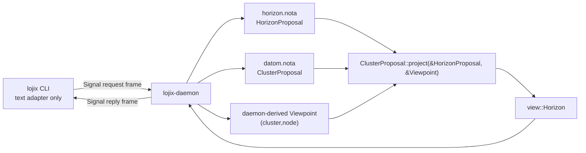

# horizon-rs + lojix state audit — 2026-05-17

## Scope

This audit covers the `horizon-leaner-shape` worktrees:

- `/home/li/wt/github.com/LiGoldragon/horizon-rs/horizon-leaner-shape`
- `/home/li/wt/github.com/LiGoldragon/lojix/horizon-leaner-shape`

The immediate consequence under review was the corrected boundary:



The CLI has exactly one runtime peer: `lojix-daemon`. The CLI does
not talk to Horizon, Nix, sema, generated flake inputs, or cluster
proposal files.

## Adjustments made

### lojix

Pushed commits on `horizon-leaner-shape`:

- `1cf5d15c` — `lojix: witness cli daemon boundary`
- `77bd4009` — `lojix: align actor constraints with current root`
- `e28da1e4` — `lojix: remove report links from architecture`

Changes:

- Added `tests/configuration_boundary.rs` witnesses:
  - `cli_has_exactly_one_runtime_peer_the_daemon_socket`
  - `daemon_deployment_path_owns_horizon_projection`
- Removed stale `lojix-cli` references from repo-facing docs.
- Corrected `ARCHITECTURE.md` so `RuntimeRoot` no longer claims
  current child actors that are not implemented.
- Removed ephemeral report links from `ARCHITECTURE.md` and inlined
  the durable architecture claims.

Verification:

```sh
nix build .#checks.x86_64-linux.test-configuration-boundary --max-jobs 1 --cores 2 --print-build-logs
```

Result: passed on Prometheus. The configuration-boundary check now
runs five tests; all five passed.

### horizon-rs

Pushed commits on `horizon-leaner-shape`:

- `6df7ec1b` — `horizon-rs: clarify current projection contract`
- `340e5cc3` — `horizon-rs: remove stale cli stub note`

Changes:

- Corrected `AGENTS.md` to name the real current inputs:
  `HorizonProposal`, `ClusterProposal`, and caller-supplied
  `Viewpoint`.
- Corrected the `horizon-cli` invocation in `AGENTS.md`.
- Made `skills.md` explicit that `lojix-daemon` derives the
  `Viewpoint` for deploy requests while `horizon-cli` derives it only
  from ad-hoc debug flags.
- Removed a stale note claiming a Nota output mode stub exists. The
  current CLI emits JSON only.

## Magnitude

### lojix

Rust line count:

| Surface | Lines |
|---|---:|
| `src/` | 3,434 |
| `tests/` | 1,188 |
| total Rust | 4,622 |

Largest files:

| File | Lines | Reading |
|---|---:|---|
| `src/deploy.rs` | 2,083 | Too large; combines multiple durable nouns. |
| `tests/build_pipeline.rs` | 552 | Heavy but useful fake-tool witness. |
| `src/socket.rs` | 520 | Acceptable but approaching split point. |
| `tests/socket.rs` | 362 | Broad socket/stream integration coverage. |
| `src/runtime.rs` | 340 | Root actor and request dispatch are still readable. |

`src/deploy.rs` is about 45% of all Rust in the repo. It holds:

- deployment ledger records;
- deployment ledger actor;
- GC-root actor;
- deployment actor;
- per-build job actor;
- proposal and horizon source loading;
- build-plan validation;
- artifact materialization;
- generated flake input directories;
- convention-based secret input materialization;
- remote input staging;
- Nix invocation assembly.

That is too much for one module. The implementation is not obviously
wrong, but the file shape is now the primary complexity risk.

### horizon-rs

Rust line count:

| Surface | Lines |
|---|---:|
| total Rust | 7,223 |
| repo files | 68 |

Largest files:

| File | Lines | Reading |
|---|---:|---|
| `lib/tests/view_json_roundtrip.rs` | 754 | Large test table; acceptable if it stays fixture-like. |
| `lib/tests/horizon.rs` | 418 | End-to-end projection coverage; large but coherent. |
| `lib/src/proposal/cluster.rs` | 328 | Main projection method is the complexity center. |
| `lib/src/view/node.rs` | 302 | Large projected record and fill logic. |
| `lib/tests/user.rs` | 292 | Detailed user projection coverage. |

The source files are generally smaller and better separated than
`lojix`. The projection still concentrates a lot of phase logic in
`ClusterProposal::project`; it is presently readable, but it should
not grow much more without extracting named phase methods.

## State of lojix

What is implemented well:

- The CLI is now structurally thin: typed config in, one request text
  in, Signal frame to daemon, one reply text out.
- The daemon owns Horizon projection and build effects.
- The socket path has a real binary-level Nix witness:
  `daemon-cli-integration` starts packaged daemon and CLI, checks
  socket mode, argv/stdin request modes, subscription open, and a
  stalled raw socket peer not blocking another request.
- Build-only deployment has useful tests:
  - successful build pins the output before reporting built;
  - local builds reject before tools run;
  - activation actions reject before tools run;
  - built generation survives in sema-backed ledger;
  - live deployment-observation streams push events.
- External tools are injectable through `ProcessToolchain`, which made
  the fake-tool build witness possible.

Design gaps:

- `src/deploy.rs` needs to split by noun before the next large feature:
  `deploy/ledger.rs`, `deploy/gc_roots.rs`, `deploy/build_job.rs`,
  `deploy/artifact.rs`, `deploy/remote_inputs.rs`,
  `deploy/secrets.rs`, and `deploy/nix_build.rs` are the natural
  seams.
- The daemon accepts/stores `operator_identity`, `owned_cluster`, and
  `peer_daemons`, but there is no admission, authorization, or
  peer-daemon routing plane yet.
- `CacheRetentionRequest` rejects; cache-retention observation
  subscriptions return empty snapshots. The wire exists before the
  runtime plane.
- Activation/current generation semantics are missing. The branch can
  build and record `Built` generations; it cannot yet switch, mark a
  current generation, roll back, or prove current-state durability.
- Declarative supervision/restart policy is not implemented. The root
  spawns Kameo actors, but there is no explicit tested restart policy
  separating sema-backed durable actors from transient connection
  actors.
- Remote generated inputs are staged under a fixed builder path
  (`/var/tmp/lojix/generated-inputs/...`). The path is deterministic,
  but cleanup/ownership is not yet a first-class runtime concern.
- Secrets materialization is convention-based: scan a `secrets/`
  directory next to the proposal source and package `*.sops` files.
  That is useful for smoke tests but it is not yet a typed projection
  from Horizon secret bindings into the deploy input graph.
- The impure `real-build-smoke` runner exists, but this audit did not
  run an actual remote build. It requires live cluster inputs,
  proposal source, builder, and system flake reference.

Unclear or brittle areas:

- `BuildOnlyRequest::run` is a long sequential effect pipeline inside
  one type. It is easy to read once, but hard to test each boundary in
  isolation.
- `DeploymentActor` spawns `BuildJobActor` and sends `RunBuildJob`
  using `tell`; this is acceptable because the handler's reply is `()`,
  but the architecture should eventually have an actor trace/topology
  witness for the build pipeline, not only final event observations.
- The source-scan tests are useful guardrails but are not enough by
  themselves. The stronger witness is a real daemon request that
  proves the CLI cannot produce a reply unless the daemon is present
  and owns the projection/effect path. Some of this exists in
  `daemon-cli-integration`; it does not yet exercise a deployment
  submission through the installed CLI.

## State of horizon-rs

What is implemented well:

- The schema boundary is much clearer after the lean-horizon work:
  pan-horizon input, cluster input, and request-time viewpoint are
  separate.
- `ClusterProposal::project(&HorizonProposal, &Viewpoint)` is the
  single projection entrypoint consumed by `lojix-daemon`.
- Proposal records, view records, newtypes, and typed validation are
  well covered by integration tests.
- The four-bucket rule is now explicit in `ARCHITECTURE.md` and
  `skills.md`: cluster fact, Horizon constant, Horizon derivation,
  CriomOS-side.
- Router SSID derivation is in Horizon:
  `HorizonProposal::router_ssid(cluster)` derives
  `<cluster>.<internal-domain>`.

Design gaps:

- `TransitionalIpv4Lan` remains an authored pan-horizon value. The
  code explicitly says not to generalize it into a hash allocator and
  to replace it with the IPv6-first network design. If the direction is
  now "derive a CIDR from cluster/host names," that is not implemented.
- There is no Nix check split for `fmt` or `clippy`; the flake exposes
  only `checks.<system>.default = cargoTest`. `lojix` has a stronger
  check surface.
- The four-bucket boundary is documented but not deeply enforced by
  architectural-truth tests. There are many schema tests, but no
  source/data witness named "cluster data cannot carry Horizon
  constants" or "router SSID is derived, not authored."
- `ClusterProposal::project` is doing validation, node projection,
  user projection, cluster rollup, viewpoint fill, and contained-node
  surfacing in one method. It is still tolerable at 328 source lines,
  but the next feature should extract phase methods named after these
  responsibilities.
- `Viewpoint` has public fields. This is likely acceptable because it
  is a two-newtype carrier with no extra invariant, but if caller
  derivation becomes more constrained, it should get a constructor.

Unclear or stale areas:

- `docs/DESIGN.md` remains historical and stale. `AGENTS.md` now says
  `ARCHITECTURE.md` is the current spec, which prevents new agents from
  following stale CLI examples, but the old doc still exists.
- `horizon-cli` is a useful debug tool, but it is not part of the
  daemon deploy path. It should stay explicitly labelled as ad-hoc.

## Constraint coverage

### Strong witnesses now present

- `lojix` CLI cannot use socket environment variables as control plane.
- `lojix` production binaries decode typed `nota-config`
  configuration sources.
- `lojix` daemon runtime gets the pan-Horizon source from typed daemon
  configuration.
- `lojix` CLI/client do not import Horizon, Nix process tooling,
  sema-engine, runtime root, socket server, deployment actor, or build
  request types.
- `lojix` daemon deploy code owns the Horizon projection path.
- `lojix` socket/CLI integration witnesses real packaged binaries.
- `horizon-rs` record roundtrips, JSON roundtrips, viewpoint-only JSON
  absence, typed validation, and projection behavior have broad tests.

### Missing witnesses to add

- `lojix` installed CLI + installed daemon deployment-submission test
  using fake `nix`/`ssh`/`rsync`, not only in-process runtime tests.
- `lojix` actor topology manifest or trace proving deployment request
  order: runtime root -> ledger allocation -> deployment actor -> build
  job -> GC-root actor -> ledger record -> built observation.
- `lojix` declarative supervision/restart policy test.
- `lojix` secrets input test proving secret files flow from a typed
  secret binding contract rather than ambient directory scanning.
- `horizon-rs` source/data tests proving Horizon constants are not
  authored in `ClusterProposal`.
- `horizon-rs` source/data tests proving router SSID is derived and not
  present on the cluster proposal surface.
- `horizon-rs` Nix checks for fmt/clippy parity with `lojix`.

## Recommendations

1. Split `lojix/src/deploy.rs` before adding activation or cache
   retention. The split should be by nouns, not by "helpers":
   ledger, GC roots, build job, artifact materialization, remote
   inputs, secrets, Nix build.
2. Add the installed-binary deployment smoke with fake tools as a
   pure Nix check. Reuse the in-process `build_pipeline.rs` fake-tool
   logic, but drive the packaged daemon and packaged CLI through the
   socket.
3. Add actor topology/trace witnesses before increasing actor count.
   The branch already has real Kameo actors; the missing piece is an
   observable path witness.
4. Decide the LAN derivation direction for Horizon. Current code has a
   temporary exact IPv4 LAN in `HorizonProposal`; a hash-derived
   cluster/host CIDR is a new design, not a current behavior.
5. Add `horizon-rs` fmt/clippy flake checks after checking whether the
   current tree is already green. Do not make the check surface stricter
   blindly if it would block unrelated downstream work.

