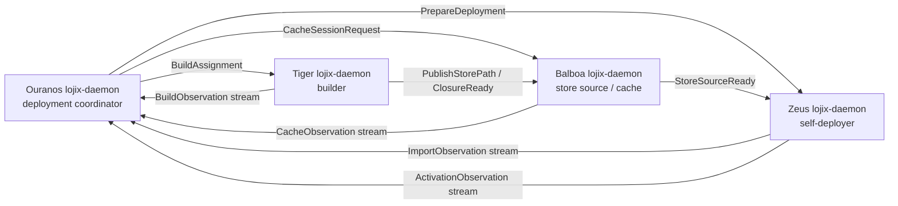
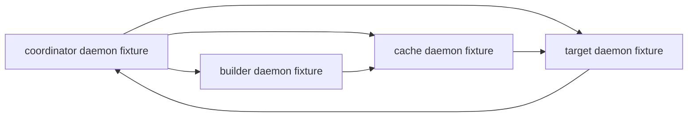

# lojix self-deploy + cache coordination architecture — 2026-05-17

## Reading of the proposal

The proposal changes the deployment center of gravity.

Current `lojix` work assumes one operator-side daemon coordinates a
remote builder through remote commands, stages generated inputs, reads
the resulting store path, pins roots, and will later invoke remote
activation.

The proposed shape is different:

- every deploy-relevant host runs a `lojix-daemon`;
- the CLI or another component sends one Signal request to one daemon;
- that daemon becomes the deployment coordinator for the job;
- the builder daemon builds locally on the selected builder;
- the cache/source daemon serves or receives realized store paths;
- the target daemon imports the closure and activates locally;
- the caller/coordinator observes and records the job, but does not
  keep a remote shell alive during activation.

This is not only an optimization. It is a better ownership model:
the node that changes its system profile is the node that owns the
activation state machine.

## Core claim

I think the direction is strong, with one important correction:

> The system does not become "local deploy only." It becomes
> **local execution per concern**.

The coordinator still sends remote typed messages. What disappears is
ad hoc remote command passing as the architecture surface. Nix,
activation, cache serving, importing, and topology probing run as
local effects inside the daemon that owns that concern.

That matches the workspace actor discipline better than the current
large `BuildOnlyRequest::run` pipeline:



The caller is the job owner, not the process owner for every effect.
Each daemon owns the process it starts and the state it mutates.

## Why this is better than remote shell orchestration

### Activation belongs on the target

Activation is the most target-local part of the deployment. It mutates
the target's profiles, boot entries, services, and maybe the running
user/session state. If SSH drops, the activation should continue under
the target daemon and publish observations later. That is exactly the
problem we already had to solve with remote command survival, which is
a sign that the owner was wrong.

Under the proposed shape, the target daemon has:

- a per-target activation lock;
- a durable `ActivationJob` record;
- a local process child for the switch/activate command;
- a local generation ledger;
- restart/recovery semantics if the daemon restarts mid-activation.

The coordinator can die and reconnect. The target still knows what it
is doing.

### Build belongs on the builder

The builder daemon knows local Nix settings, CPU limits, thermal policy,
builder eligibility, and current load. It can reject or defer a build
without the coordinator guessing from outside.

This also avoids the current shape where the coordinator assembles a
large remote shell command and must parse stdout back into state. The
builder can return typed events:

- `BuildQueued`
- `BuildStarted`
- `StorePathRealized`
- `ClosureComputed`
- `BuildFinished`
- `BuildFailed`

The events are the interface; stdout parsing is an implementation
detail inside the builder daemon.

### Store movement becomes a policy decision

Your three variables are the right decomposition:

1. **where the build happens**;
2. **which store source/cache the target should use**;
3. **where activation happens**.

The fourth variable is the caller/coordinator, but it should normally
be outside the data plane.

The useful abstraction is not "Nix cache" as one fixed thing. It is:

```text
StoreSource = BinaryCache | SshStore | LocalBuilderStore | TemporaryCacheSession
```

The planner can choose among store sources using topology belief,
permissions, cost, and freshness. A permanent cache node and a builder
serving its local store are both store sources; they differ in
capability and trust requirements.

## Proposed deployment flow

Use the example from the prompt:

- caller/coordinator: **Ouranos**
- builder: **Tiger**
- preferred cache/store source: **Balboa**
- target/self-deployer: **Zeus**

### 1. Coordinator accepts the request

The CLI sends one request to the local or selected `lojix-daemon`.

The coordinator creates a durable deployment job:

```text
DeploymentJob {
  request,
  deployment_slot,
  selected_builder = Tiger,
  selected_store_source = Balboa,
  selected_target = Zeus,
  fallback_policy,
  topology_snapshot,
}
```

This job record must include the exact proposal/horizon inputs or their
content-addressed refs. Otherwise different daemons could project
different realities.

### 2. Coordinator derives a plan

Inputs:

- Horizon static topology and capabilities:
  builder eligibility, cache eligibility, target identity, trust;
- runtime topology belief:
  reachability, latency, observed bandwidth, network cost, freshness;
- explicit request policy:
  whether builder can act as fallback cache, whether caller can act as
  fallback cache, whether local target build is permitted, cost ceiling.

Output:

```text
DeploymentPlan {
  build_host = Tiger,
  preferred_store_source = Balboa,
  fallback_store_sources = [Tiger if allowed, Ouranos if allowed],
  target = Zeus,
  activation_kind = FullOs | OsOnly | HomeOnly,
}
```

The planner should preserve why it chose each role. Later debugging
needs "Balboa was selected because it was the cheapest fresh reachable
cache source" rather than only "Balboa."

### 3. Builder starts immediately

The coordinator sends `BuildAssignment` to Tiger.

Tiger starts a local `nix build` under its own daemon. It does not need
to wait for Balboa if the build does not depend on Balboa. It can still
receive the intended store-source plan so that post-build publishing
knows where to send realized paths.

Tiger emits build observations to the coordinator and, optionally, to
subscribed cache/target daemons.

### 4. Cache session starts independently

The coordinator sends `CacheSessionRequest` to Balboa:

```text
CacheSessionRequest {
  deployment,
  builder = Tiger,
  target = Zeus,
  expected_system,
  lease,
  accepted_publishers = [Tiger],
  accepted_consumers = [Zeus],
}
```

Balboa can reply:

- `CacheSessionAccepted { endpoint, public_key, lease }`
- `CacheSessionRejected { reason }`
- `CacheTemporarilyUnavailable { retry_after }`

If Balboa rejects or is unreachable, the coordinator chooses a fallback
store source. If the request explicitly allows Tiger to serve as a
fallback store source, Tiger can start a local temporary cache session
or expose an SSH store source.

### 5. Target prepares, but does not activate yet

The coordinator tells Zeus:

```text
PrepareDeployment {
  deployment,
  store_source,
  expected_generation_kind,
  activation_policy,
}
```

Zeus can:

- acquire its local deployment lock;
- verify it trusts the store source;
- begin importing available closure paths if streaming is implemented;
- subscribe for final output readiness.

Zeus is the only daemon that can move from "imported" to "activated."

### 6. Store paths move

There are two implementation levels.

#### First implementable level: final closure copy

Tiger builds. When it has the final output store path, it computes the
closure and pushes/copies the closure to the selected store source.
Zeus then imports the final closure from that source and activates.

This is much simpler and already removes the remote activation problem.

#### Later level: streaming realized paths

Tiger can publish realized paths as Nix produces them. Balboa receives
and serves them. Zeus can import in parallel before the final output is
known.

This is attractive, but it needs a stronger Nix integration. A plain
`nix build` final stdout tells us the final output, not every completed
dependency as it appears. Streaming likely requires one of:

- a Nix post-build hook that notifies Tiger's daemon per realized path;
- Nix log/event parsing with a stable enough event stream;
- a builder-side store watcher that observes new valid paths and
  correlates them with the deployment;
- accepting final-closure copy first and postponing streaming.

I recommend final-closure copy as the first implementation. Streaming
is an optimization after the distributed ownership model is correct.

### 7. Target activates itself

When Zeus has the final system/home closure locally, Zeus runs the
local activation command. For NixOS this probably means setting the
system profile to the built toplevel and calling that toplevel's
activation/switch script. For Home Manager it means running the local
activation package for the user.

Zeus emits:

- `ActivationStarted`
- `ActivationSucceeded`
- `ActivationFailed`
- `RollbackStarted`
- `RollbackSucceeded` or `RollbackFailed`

The coordinator records the observations, but Zeus is the authority on
whether Zeus changed state.

## What "topology belief" should mean

The daemon's topology state should not pretend to be truth. It should
have two layers:

```text
ConfiguredTopology:
  facts projected from Horizon
  e.g. node roles, trust, cache capability, builder capability

ObservedTopology:
  timestamped observations made by daemons
  e.g. reachability, latency, bandwidth estimate, network cost,
       current load, cache availability
```

The planner chooses from a `TopologySnapshot`:

```text
TopologySnapshot {
  configured_revision,
  observations_used,
  freshness_deadline,
  candidates,
}
```

Each observation needs:

- observer daemon;
- subject daemon or network edge;
- measurement method;
- measured value;
- measured-at time;
- expiry/freshness horizon;
- confidence or failure mode.

This gives us a principled phrase for the report/user concern:
"last known, believed to be true" becomes **fresh observed topology**.
Old observations can still inform fallback, but the plan should record
when it used stale data.

## Nix-specific consequences

### Correct terms

The thing we deploy is not a derivation. It is a realized output store
path plus its runtime closure. The derivation is the recipe; the
closure is what must exist in the target store before activation.

Reports and types should say:

- `StorePath`
- `Closure`
- `RealizedOutput`
- `StoreSource`

Use "derivation" only when talking about the `.drv` build recipe.

### Binary cache trust is not free

A temporary HTTP binary cache is only useful if the target trusts its
Narinfo signatures. That means one of:

- every cache-capable daemon has a stable public signing key known to
  Horizon/ClaviFaber;
- a cluster cache signing authority delegates short-lived cache keys;
- the target imports over SSH store protocol instead of HTTP binary
  cache for temporary cases;
- the target daemon has a safe local policy for trusting a specific
  temporary cache endpoint for one deployment.

The third option, SSH store source, is probably the simplest early
fallback. A permanent cache like Balboa can run a real signed binary
cache; a fallback builder like Tiger can expose an SSH store source for
Zeus to `nix copy --from`.

### The target should verify local closure

The coordinator and cache can say "published" or "copied," but Zeus
should verify the final closure in its own store before activation.

The target-owned witness is:

```sh
nix path-info -r <toplevel-store-path>
```

or the equivalent typed process call inside the daemon. The target
should reject activation if any closure member is missing.

### Generated inputs may be the wrong abstraction

Current `lojix` materializes generated Horizon/System/Deployment inputs
locally and stages them to the remote builder.

In the distributed model, we should question whether generated input
staging remains necessary. Cleaner options:

1. **Content-addressed refs.** The request carries exact refs to the
   pan-horizon config, cluster proposal, system flake, and deployment
   shape. The builder/target projects locally from those refs.
2. **Signed plan artifact.** The coordinator projects once and sends a
   signed/content-addressed `DeploymentPlanArtifact` to every daemon.
3. **Current staging, moved into daemon messages.** The coordinator
   still creates generated inputs, but transfers them through typed
   daemon protocol instead of `rsync` commands.

Option 1 is the cleanest if all daemons can fetch the same refs.
Option 2 is the most deterministic if we want one projection result
shared by all participants. Option 3 preserves current logic but keeps
too much of the old shape.

## Actor planes this implies

The current `lojix/src/deploy.rs` split recommendation still holds,
but the new architecture changes the nouns.

Core daemon actors:

- `DeploymentCoordinator` — owns the caller-side job and aggregates
  observations.
- `TopologyView` — owns configured + observed topology snapshots.
- `DeploymentPlanner` — selects builder, store source, target, and
  fallback policy.
- `BuildRunner` — local builder-side Nix build process owner.
- `StoreSource` — local cache/source session owner.
- `ClosurePublisher` — builder-side push to store source.
- `ClosureImporter` — target-side import from store source.
- `ActivationRunner` — target-side switch/activate owner.
- `GenerationLedger` — target-side generation state.
- `DeploymentObservationStream` — pushes event streams to subscribers.

Some of these can live in the same process and even the same crate, but
they are distinct state machines. They should not all collapse into one
`BuildOnlyRequest::run`.

## Contract shape

The CLI should stay as it is architecturally:

```text
lojix CLI -> local/selected lojix-daemon -> Signal reply
```

Daemon-to-daemon messages are separate runtime traffic. They can live
in `signal-lojix`, but they should be named as daemon-plane requests,
not CLI requests.

Candidate records:

```text
DeploymentSubmission
DeploymentAccepted
DeploymentObservationSubscription

BuildAssignment
BuildObservationSubscription

CacheSessionRequest
CacheSessionAccepted
CacheSessionRejected
CacheObservationSubscription

PrepareDeployment
ImportClosure
ActivateGeneration
ActivationObservationSubscription

TopologyProbeRequest
TopologyObservation
```

Important boundary: the CLI still has one peer even if the daemon has
many peers. The one-peer constraint is about the human/agent text
adapter, not about daemon-to-daemon topology.

## State model

Each daemon owns local sema-backed state.

### Coordinator daemon

- deployment job record;
- selected plan;
- topology snapshot used for planning;
- participant tokens/subscriptions;
- aggregate event log.

### Builder daemon

- build job record;
- process identity;
- realized output store paths;
- closure computation;
- publish status.

### Cache/source daemon

- cache session lease;
- accepted publishers and consumers;
- served endpoint;
- paths received;
- paths served/imported by targets if observable.

### Target daemon

- activation lock;
- import job;
- local closure verification;
- generation ledger;
- activation attempt;
- rollback attempt.

The target's generation ledger is the authority for target state. The
coordinator's ledger is an aggregate view, not the source of truth for
what the target did.

## Failure behavior

### Caller/coordinator dies

Participants continue local jobs. When the coordinator returns, it
re-subscribes or queries by deployment id. If the coordinator never
returns, participants follow lease/timeout policy.

### Builder dies

The coordinator can reassign if policy allows. The target should never
activate unless it has verified the final closure locally.

### Cache dies

The coordinator chooses a fallback store source. If the builder is an
allowed fallback, it becomes `StoreSource`. Otherwise the deployment
pauses or fails before activation.

### Target dies or reboots during activation

The target daemon must recover from local state. This is another reason
activation belongs on the target.

### Network changes mid-deploy

The topology view can emit a new observation and the coordinator can
revise the store-source leg if the build has not reached an irreversible
phase. Activation itself should not migrate once started.

## Gaps in the current intent

These are the parts I cannot close without further design:

1. **Cache trust model.** A temporary binary cache needs trust and
   signing. Do we want every cache-capable node to have a stable
   signing key, or should temporary cases use SSH store import first?
2. **Projection authority.** Should every daemon project Horizon
   locally from content-addressed refs, or should the coordinator send
   one signed/content-addressed plan artifact?
3. **Topology observation scope.** What is the minimal first topology
   model: reachability only, or reachability + latency + estimated
   bandwidth + network cost?
4. **Fallback policy vocabulary.** The request needs explicit policy:
   builder may serve as fallback cache, caller may serve as fallback
   cache, target may build locally, expensive networks allowed or not.
   These should be typed fields, not ad hoc booleans buried in logic.
5. **Activation command contract.** We need exact local activation
   verbs for FullOs, OsOnly, and HomeOnly. They should be implemented
   as target-local typed process invocations with tests.
6. **Bootstrap and rescue path.** If the target daemon is down or the
   target system is broken, do we fall back to SSH rescue, or is that a
   separate emergency tool outside normal `lojix`?
7. **Streaming closure movement.** Do we need streaming from the first
   version, or is final-closure copy sufficient? I recommend final
   closure first.
8. **Cache session cleanup.** Temporary caches and SSH store roots need
   leases, GC roots, and expiration semantics.
9. **Authorization.** Which daemon may ask Zeus to activate Zeus? This
   ties into ClaviFaber, host identity, cluster trust, and operator
   identity. It cannot be string trust.
10. **Concurrency.** Per target/generation kind, activation must be
    serialized. Builds can be concurrent; cache sessions have capacity.

## Implementation consequences for current lojix

If we accept this architecture, the current `lojix` audit conclusion
changes slightly.

The deploy split should not just extract the current remote-command
pipeline into smaller files. It should split toward the distributed
planes:

- keep `client.rs` thin;
- keep `socket.rs` as daemon wire ingress;
- split ledger/state first;
- introduce daemon-to-daemon request types;
- move builder execution behind a local `BuildRunner`;
- move activation behind a target-local `ActivationRunner`;
- treat remote SSH commands as transport/bootstrap details, not the
  deployment architecture.

The existing fake-tool build tests are still valuable. They should be
reframed as builder-daemon tests, then paired with a multi-daemon
in-process test:



This can be pure Nix if every daemon uses temporary state directories
and fake local tools. A later impure test can run the same shape across
real machines.

## Testing strategy

### Pure actor/protocol tests first

- planner selects Balboa cache when fresh and cheap;
- planner selects Tiger fallback cache when Balboa unavailable and
  fallback allowed;
- planner rejects when no allowed store source exists;
- target activation cannot start before closure verification;
- coordinator death does not cancel builder/cache/target jobs;
- target generation ledger is authoritative after restart.

### Pure fake-tool Nix checks

- four daemon fixtures, four state directories, fake `nix`/`ssh`/cache
  tools;
- builder produces a fake store path;
- cache receives it or rejects;
- target imports and activates locally;
- observations prove the path.

### Impure sandbox/cluster tests

- nspawn/VM target deploys itself from a builder/cache pair;
- cache failure triggers fallback;
- caller disconnect during activation does not stop target activation.

## Recommendation

Adopt the architecture direction, but keep first implementation small:

1. **Do not start with streaming paths.** Start with builder builds,
   store source receives final closure, target imports final closure,
   target activates locally.
2. **Prefer SSH store source for temporary fallback first.** Permanent
   cache nodes can use signed HTTP binary caches; temporary binary
   cache trust is a harder problem.
3. **Make target-local activation the first big semantic shift.** This
   buys the reliability win immediately and removes the worst remote
   shell shape.
4. **Make topology belief explicit but minimal.** Start with
   reachability and manually declared cost/capability. Add measured
   bandwidth/latency after the state shape exists.
5. **Create the daemon-to-daemon protocol before refactoring too far
   inside the current single-daemon pipeline.** Otherwise the refactor
   will preserve the old architecture in smaller files.

The clean thesis:

> `lojix` coordinates deployment intent; each host daemon executes the
> local effects it owns.

That is the shape worth moving toward.

