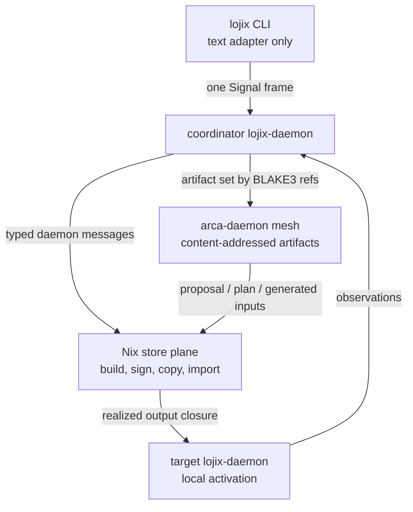

# lojix + Arca distributed deploy architecture expansion - 2026-05-17

## Trigger

This report extends
`reports/system-specialist/137-lojix-self-deploy-cache-coordination-architecture-2026-05-17.md`
with the user's new constraints:

- `lojix-daemon` should own the live Nix configuration plane and
  restart `nix-daemon` when a typed configuration change requires it.
- every node should have a Nix signing key populated by ClaviFaber on
  first boot;
- deployment inputs and plans should move through Arca, a
  content-addressed archive/store component, rather than through ad hoc
  staging paths;
- Arca should itself be treated as a triad component:
  `arca` CLI, `arca-daemon`, and `signal-arca`.

The short version:

> `lojix` coordinates deployment state, Nix remains the realized-output
> store for first implementation, and Arca becomes the exact-artifact
> plane for Horizon inputs, deployment plans, generated Nix inputs,
> and other non-Nix-store payloads.

Arca should not be asked to replace Nix closure movement first. It
should remove ambiguity from the inputs and plans that tell Nix what to
build and where to deploy.

## Source facts used

### Existing Arca repo

The current `arca` repo already names the right broad intent: a
BLAKE3-addressed filesystem for real files and trees, with a library
reader API and privileged daemon writer. Its `AGENTS.md` and
`ARCHITECTURE.md` describe skeleton-as-design:

- `StoreEntryHash` is BLAKE3 over a canonical tree encoding;
- `StoreReader` and `StoreWriter` split read and write authority;
- writes go through `arca-daemon`;
- capability tokens are intended to gate writes;
- Nix closure bundling is contemplated in `bundle.rs`;
- most writer/daemon/index/deposit bodies are still `todo!()`.

The stale part for this deployment design is the default root and
authority model. The repo says `~/.arca/<store>/...`; distributed
system deployment wants a host-level service root such as `/arca`,
with store namespaces underneath it and a daemon that is part of the
CriomOS system surface.

### Nix docs checked

Official Nix documentation matters because this design touches store
trust:

- Nix store paths are opaque identifiers formed from a digest and a
  human-readable name, rendered under the store directory. Store paths
  also depend on the store directory, so moving executable store
  objects across different store directories is not generally valid.
  Source: Nix Reference Manual, "Store Path":
  https://releases.nixos.org/nix/nix-2.19.2/manual/store/store-path.html
- Nix content-addressed store objects include the file system object
  graph, references, store directory, and name in the content-address
  computation; Nix Archive content addressing supports references when
  using SHA-256. Source: Nix Reference Manual, "Content-Addressing
  Store Objects":
  https://releases.nixos.org/nix/nix-2.24.5/manual/store/store-object/content-address.html
- `nix store make-content-addressed` can rewrite a path or closure into
  content-addressed form, but the command is explicitly experimental.
  The manual states that usual Nix store paths are input-addressed and
  require trusted signatures for import, while content-addressed paths
  can be verified by content. Source:
  https://nix.dev/manual/nix/2.18/command-ref/new-cli/nix3-store-make-content-addressed
- Floating content-addressed derivation outputs require the
  `ca-derivations` experimental feature. Source:
  https://nix.dev/manual/nix/2.32/store/derivation/outputs/content-address
- `nix.conf` supports `include` and `!include`, and the manual notes
  that client configuration is not forwarded to the daemon; the client
  assumes the daemon has already loaded its configuration. Source:
  https://nix.dev/manual/nix/2.34/command-ref/conf-file.html
- `secret-key-files` signs locally-built paths; the corresponding
  public keys are distributed through `trusted-public-keys`. Nix also
  requires signatures for non-content-addressed paths unless one of the
  trust exceptions applies. Source: same Nix configuration manual.
- `nix-store --generate-binary-cache-key` generates Ed25519 key pairs
  for signed binary caches. Source:
  https://nix.dev/manual/nix/2.34/command-ref/nix-store/generate-binary-cache-key.html

These facts support two decisions:

1. Arca can safely carry deployment artifacts by content identity now.
2. Nix realized outputs should still move through Nix store protocols
   first, unless they are represented as NAR/content-addressed payloads
   to be imported back into `/nix/store`.

## Corrected deployment planes

The distributed deployment shape should have three distinct planes.



### Control plane: `signal-lojix`

`lojix-daemon` coordinates jobs, records state, chooses participants,
and sends typed daemon-to-daemon messages. The CLI still has exactly
one peer: `lojix-daemon`.

### Artifact plane: `signal-arca`

Arca carries exact artifacts by content identity:

- `HorizonProposal` / pan-horizon configuration;
- `ClusterProposal`;
- daemon-derived `Viewpoint`;
- generated Nix input flakes or generated Nix source trees;
- signed `DeploymentPlanArtifact`;
- topology snapshot used by the planner;
- test fixtures and reproducible deployment evidence.

Every daemon can fetch the same bytes by BLAKE3 identity. The hash
proves content equality; a signature or capability proves authority.

### Realized-output plane: Nix

Nix remains the first implementation's store for realized build
outputs:

- the builder runs `nix build`;
- the builder signs locally-built paths with its ClaviFaber-populated
  Nix signing key;
- the cache/source node serves a signed binary cache or an SSH store
  source;
- the target imports the closure into its own `/nix/store`;
- the target verifies the closure locally before activation.

Arca can later store NARs or content-addressed Nix closures, but that
is a separate interop project. The first version should not pretend
that copying a live Nix output tree into `/arca` makes it a deployable
Nix closure.

## Nix configuration actor

The new user constraint changes report 137's cache-trust gap. The gap
is no longer "maybe nodes lack signing keys." The expected state is:

> every node has a Nix signing key created by ClaviFaber on first boot,
> and the public key is available through Horizon/cluster trust data.

What remains is a live configuration problem:

- which substituters should this node use for this deployment?
- which public keys should this node trust?
- which temporary store sources are authorized?
- when does changing those settings require `nix-daemon` restart?
- how do we serialize those restarts so a deployment does not race the
  daemon it needs?

That belongs to a local actor:

```text
NixDaemonConfigurationActor
  owns:
    /var/lib/lojix/nix/nix.conf
    local nix-daemon restart lock
    last-applied configuration hash
    health check after restart

  accepts:
    ApplyNixConfigurationDelta
    EnsureSigningKeyConfigured
    EnsureTrustedStoreSource
    RemoveExpiredStoreSource

  emits:
    NixConfigurationUnchanged
    NixConfigurationWritten
    NixDaemonRestarted
    NixDaemonRestartFailed
    NixDaemonHealthy
```

CriomOS should declare the stable include point in the real system
configuration, for example:

```text
/etc/nix/nix.conf
  !include /var/lib/lojix/nix/nix.conf
```

`lojix-daemon` owns only that mutable include file. The NixOS module
owns the existence, permissions, and boot-time shape of the include
point. This keeps live state explicit without making `lojix` rewrite
all of `/etc/nix/nix.conf`.

The actor must be target-local. Zeus's daemon changes Zeus's Nix
configuration. Tiger's daemon changes Tiger's Nix configuration.
Ouranos may request those changes, but it does not edit remote
configuration files through SSH.

## Signing-key consequences

ClaviFaber should populate, at minimum:

- node Nix signing secret key path;
- node Nix signing public key line;
- public-key publication into cluster/Horizon trust data;
- permissions allowing `nix-daemon` to read the secret key;
- a stable key name suitable for cache trust records.

Then CriomOS/lojix can set:

- `secret-key-files` for local signing;
- `trusted-public-keys` for peers;
- `trusted-substituters` or deployment-specific `substituters` for
  cache endpoints.

This makes temporary HTTP cache sessions more plausible than report
137 allowed, but it does not make them trivial. The remaining hard
parts are:

- safely adding/removing a temporary substituter on the target;
- restarting `nix-daemon` only when needed;
- not disrupting unrelated builds;
- deciding how long a temporary trust entry remains valid;
- proving that the cache endpoint belongs to the expected node key.

Early fallback can still prefer SSH store import because it needs
fewer moving parts. The architecture should support both:

```text
StoreSource =
  PermanentSignedBinaryCache
  TemporarySignedBinaryCacheSession
  SshStoreSource
  LocalBuilderStoreSource
```

The existence of per-node signing keys changes priority, not the need
for a typed store-source model.

## Arca answer to the projection-authority question

Report 137 left this gap:

> should every daemon project Horizon locally from content-addressed
> refs, or should the coordinator send one signed/content-addressed
> plan artifact?

With Arca, the best first answer is a combined shape:

1. The coordinator stores every input artifact in Arca:
   `HorizonProposal`, `ClusterProposal`, and request data.
2. The coordinator derives the daemon-side `Viewpoint`.
3. The coordinator projects once and stores a signed
   `DeploymentPlanArtifact` in Arca.
4. Participant daemons receive the plan artifact hash plus the input
   artifact hashes.
5. Participants execute the plan as authority, and may independently
   reproject from the input artifacts as an audit/witness.

This prevents projection drift during the deployment. It also preserves
reproducibility because the source artifacts travel with the plan.

Hash identity alone does not answer "who authorized this." The
deployment plan should be signed or sema-authorized by the coordinating
daemon/operator authority. Arca gives the bytes a stable name; the
deployment trust layer says whether those bytes are allowed to drive
Zeus.

## Expanded deployment flow

Use the same example as report 137:

- caller/coordinator: Ouranos;
- builder: Tiger;
- preferred store source/cache: Balboa;
- target/self-deployer: Zeus.

### 1. Coordinator creates an artifact set

Ouranos accepts a `DeploymentSubmission`, loads the configured
pan-horizon and cluster proposal, derives the request-time `Viewpoint`,
and writes an Arca artifact set:

```text
DeploymentArtifactSet {
  horizon_proposal = blake3:...
  cluster_proposal = blake3:...
  viewpoint = blake3:...
  projected_horizon = blake3:...
  generated_nix_inputs = blake3:...
  topology_snapshot = blake3:...
  deployment_plan = blake3:...
}
```

The `deployment_plan` is the authority artifact. The others are the
audit and reproduction payload.

### 2. Arca replicates artifacts to participants

Ouranos asks local `arca-daemon` to replicate the artifact set to
Tiger, Balboa, and Zeus.

This can be parallel with planning and Nix preparation because these
are small inputs, not build outputs. Each destination verifies the full
BLAKE3 digest before accepting the artifact.

### 3. Nix configuration actors prepare trust

Tiger ensures its local signing key is configured.

Balboa ensures it is ready to serve the selected store-source session.

Zeus ensures it trusts the selected store source for this deployment.
If that means editing the mutable `lojix` Nix config include and
restarting `nix-daemon`, Zeus does it locally and emits observations.

### 4. Tiger builds from Arca-provided inputs

Tiger fetches the exact generated Nix input artifact from Arca and
runs the local build. The build does not depend on Ouranos keeping an
SSH session alive.

Tiger signs locally-built outputs through its configured Nix signing
key. It emits realized output and closure observations.

### 5. Balboa receives or serves the closure

Balboa's role depends on selected store-source kind:

- permanent binary cache;
- temporary signed binary cache session;
- SSH store source;
- no cache, if Tiger is the direct source.

Arca does not replace this leg in the first implementation. It can
carry the plan and metadata for the leg, not the closure movement
itself.

### 6. Zeus imports and verifies locally

Zeus imports the final closure into its own `/nix/store`, verifies that
the final toplevel/home activation path and recursive closure exist,
then activates locally.

The target generation ledger is authoritative for target state. The
coordinator is the aggregate observer.

## What Arca should not do first

Arca should not first try to become "the new Nix store" for realized
outputs. The Nix docs make clear why this is nontrivial:

- Nix store paths contain a store directory and references;
- executable outputs often embed `/nix/store/...` references;
- Nix's content-addressed store object machinery includes references,
  name, store directory, and file graph;
- floating content-addressed derivations remain experimental.

The safe first interop shapes are:

1. Arca stores deployment inputs and plan artifacts.
2. Arca stores NAR files or Nix copy manifests as content-addressed
   blobs, and Nix imports them into `/nix/store`.
3. Arca stores provenance for realized Nix outputs, including NAR hash,
   output path, closure list, signer, and deployment job.

Directly executing `/arca/.../bin/foo` after copying from `/nix/store`
requires the separate bundling/RPATH work already sketched in
`arca/src/bundle.rs`. That is a real project, not a shortcut.

## Daemon messages implied

### `signal-arca`

```text
PutBytes
PutPath
ResolveObject
FetchObject
ReplicateObject
ReplicateSet
PinObject
ReleasePin
LinkObject
ObjectObservationSubscription
```

### `signal-lojix`

```text
DeploymentSubmission
DeploymentAccepted
DeploymentArtifactSetReady
ApplyNixConfigurationDelta
EnsureStoreSourceTrusted
BuildAssignment
StoreSourceSessionRequest
PrepareDeployment
ImportClosure
ActivateGeneration
DeploymentObservationSubscription
```

The CLI still sends only the first user-facing request to
`lojix-daemon`. These daemon-plane records are internal runtime traffic.

## Tests worth adding before implementation expands

### Pure actor tests

- `lojix` creates one Arca artifact set before sending build or target
  assignments.
- builder, cache, and target receive only BLAKE3 refs plus typed plan
  metadata, not ad hoc paths.
- target activation refuses to start until the Arca plan artifact and
  Nix closure verification both succeed.
- changing the selected temporary cache emits a
  `NixConfigurationWritten` observation before any import attempt.
- no CLI test imports `horizon-rs`; projection remains daemon-owned.

### Fake daemon integration tests

- four `lojix-daemon` fixtures plus four `arca-daemon` fixtures in
  temporary state roots;
- coordinator writes a plan into Arca and participants fetch it by
  digest;
- fake Nix tool records that it was invoked with generated inputs read
  from Arca, not from coordinator-local staging paths;
- fake target Nix daemon config file changes are serialized through
  the `NixDaemonConfigurationActor`;
- fake target activation proceeds after closure verification.

### Nix-level checks

- `lojix` package check proves the mutable Nix config include file is
  generated by CriomOS and writable only by `lojix-daemon`;
- ClaviFaber fixture produces a Nix public signing key line consumed by
  Horizon projection;
- target trust set contains the selected store-source key and rejects a
  closure signed by a non-selected node.

## Implementation order I would choose

1. Update Arca architecture to the system-daemon shape and define
   `signal-arca` records.
2. Add `NixDaemonConfigurationActor` to the `lojix` design before
   adding dynamic cache sessions.
3. Make ClaviFaber's Nix signing key output a typed first-boot
   product, with public-key publication into Horizon/cluster trust.
4. Implement Arca artifact sets for small deployment inputs and plans.
5. Change distributed `lojix` build flow so participants fetch
   generated inputs from Arca by digest.
6. Keep final closure movement through Nix SSH store or signed binary
   cache.
7. Add temporary HTTP cache sessions only after dynamic Nix config and
   restart/recovery are tested.
8. Revisit Nix content-addressed closure interop after the artifact
   plane is real.

## Open questions

### Arca root

The existing repo says `~/.arca`. The deployment role wants a system
store root. I recommend `/arca` as the host-level root, with logical
store namespaces underneath it:

```text
/arca/system/...
/arca/user/<user>/...
/arca/project/<project>/...
```

The exact path should be made a CriomOS constant and an Arca startup
configuration value, not scattered through code.

### Plan authority

The report recommends signed plan artifacts. The remaining decision is
which key signs them:

- operator identity key;
- coordinating daemon host key;
- cluster deployment authority key;
- sema-engine slot authorization through Criome/BLS once that layer is
  ready.

The implementation can begin with "coordinating daemon signs with its
node deployment key," but the architecture should name that as a
replaceable authority source.

### Temporary cache trust

All nodes having signing keys makes temporary signed cache sessions
possible. The first implementation still should probably include SSH
store source because it is the smallest correct fallback. The typed
model should allow both without making either a special case.

## Recommendation

Adopt Arca into `lojix` now, but with a sharp boundary:

> Arca carries exact deployment artifacts; Nix carries realized build
> closures.

That boundary gives us immediate wins:

- no divergent Horizon projection across daemons;
- no coordinator-local generated-input staging as an invisible side
  effect;
- reproducible deployment plans by content hash;
- a natural place to publish topology snapshots and plan evidence;
- a later path toward content-addressed Nix interop without forcing it
  into the first distributed deploy.

The architecture becomes:

```text
CLI -> lojix-daemon
lojix-daemon -> Arca artifact mesh for exact inputs/plans
lojix-daemon -> participant lojix-daemons for local effects
participant lojix-daemons -> Nix for build/copy/import/activate
participant lojix-daemons -> local sema state for durable observations
```

That is the right next surface for `lojix`: typed coordination,
content-addressed intent, local effect ownership.
