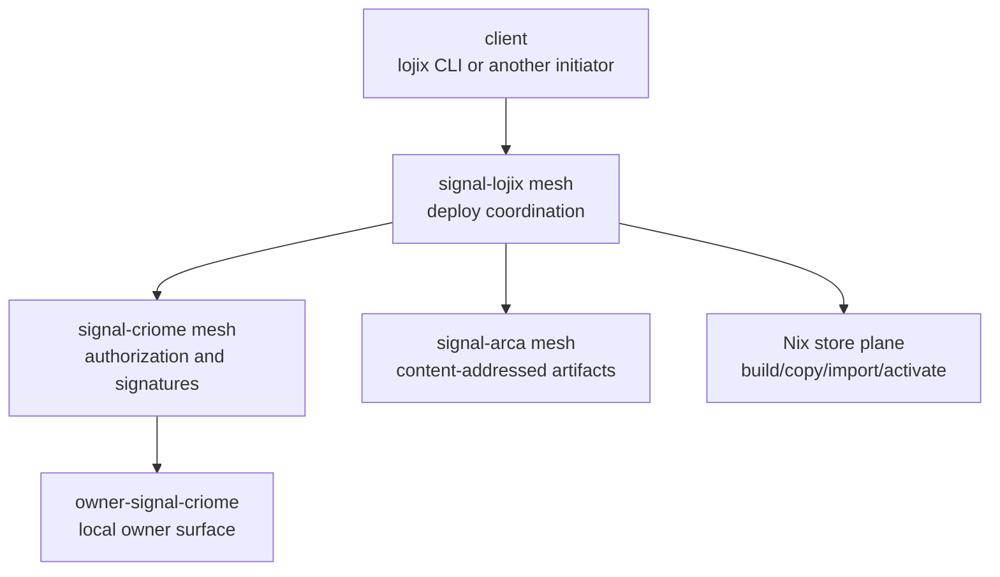

# lojix + Criome + Arca implementation synthesis - 2026-05-17

## Purpose

This report captures my current understanding after the `lojix`
distributed-deploy, Arca artifact-plane, and Criome-routed
authorization discussion. It records:

- the work I did in this arc;
- the architecture I believe needs to be implemented;
- the implementation sequence implied by that architecture;
- the questions that still matter because they change code shape.

The immediate reading:

> `lojix` coordinates deployment, Criome authorizes action, Arca
> preserves exact artifacts, and Nix performs build/store/activation
> effects locally on the daemon that owns each concern.

## Work I did

### SYS/136 - horizon-rs + lojix state audit

I wrote
`reports/system-specialist/136-horizon-rs-lojix-state-audit-2026-05-17.md`.

That audit found:

- `lojix/src/deploy.rs` had become the wrong center of gravity: too
  many independent nouns in one file;
- the CLI/daemon boundary was mostly right but needed hard witnesses;
- `horizon-rs` projection was cleaner than `lojix`, but still needed
  stronger check surface and boundary tests;
- implementation should split toward deploy actors before adding more
  behavior.

I also pushed supporting repo commits in `lojix` and `horizon-rs` that
clarified architecture text and added boundary witnesses.

### SYS/137 - self-deploy and cache coordination

I wrote
`reports/system-specialist/137-lojix-self-deploy-cache-coordination-architecture-2026-05-17.md`.

The key claim was:

> the system does not become "local deploy only"; it becomes local
> execution per concern.

That means:

- the coordinator owns the deployment job;
- the builder daemon owns the local build process;
- the cache/store-source daemon owns serving or receiving store paths;
- the target daemon owns local import, closure verification, and
  activation;
- SSH/remote shell stops being the architecture surface.

### SYS/138 - Arca folded into distributed deploy

I wrote
`reports/system-specialist/138-lojix-arca-distributed-deploy-architecture-2026-05-17.md`.

This report added Arca as the artifact plane:

- `HorizonProposal`, `ClusterProposal`, daemon-derived `Viewpoint`,
  generated Nix inputs, topology snapshots, deployment plans, and
  authorization objects should be stored and replicated by content
  identity;
- Nix remains the first implementation's realized-output store;
- Arca should not be asked to replace Nix closure movement before the
  artifact plane is real;
- `lojix-daemon` needs a local `NixDaemonConfigurationActor` to own
  mutable Nix config includes and `nix-daemon` restarts.

### SYS/139 - standalone Arca architecture

I wrote
`reports/system-specialist/139-arca-daemon-content-addressed-store-architecture-2026-05-17.md`.

This report argued:

- full BLAKE3 digest is identity;
- filesystem paths are stable locators allocated by `arca-daemon`;
- short prefixes are useful for display and paths, but exposed
  locators must never be renamed;
- three-character hash prefixes are too collision-prone for a real
  store;
- `/arca` should be the system-daemon root for CriomOS integration;
- the current `arca` repo is useful skeleton-as-design, but it is not
  implemented and still speaks in user-local `~/.arca` terms.

### SYS/140 - Criome-mediated lojix authorization

I wrote
`reports/system-specialist/140-lojix-criome-mediated-authorization-decision-2026-05-17.md`.

This captured the user decision:

- authorization needs `criome-daemon`;
- the signed object is the canonical `signal-lojix` request;
- Criome owns permission/quorum/signature routing;
- clients only initiate deploys;
- `lojix-daemon` forwards the request to local `criome-daemon`;
- `criome-daemon` may route signature work to concerned clients or peer
  daemons.

The implementation consequence is that `lojix-daemon` needs a
`CriomeAuthorizationActor` in front of every build, cache, import, Nix
configuration, restart, and activation effect.

### Review of SYS/21

I reviewed
`reports/system-assistant/21-criome-routed-authorization-and-thin-cli-shape-2026-05-17.md`.

It is aligned with SYS/140 and adds useful grounding:

- `signal-criome` already has vocabulary near `SignedObject`,
  signature envelopes, and attestation;
- BLS/quorum is already an intended Criome substrate;
- the cluster control plane is three meshes:
  `signal-criome`, `signal-lojix`, and `signal-arca`;
- caller shape is closed: operator devices run CLIs, not
  `lojix-daemon`; cluster nodes run `lojix-daemon`.

## Architecture to implement

### One-line shape

```text
client -> lojix-daemon -> criome-daemon authorization
       -> arca-daemon artifact set
       -> peer lojix-daemons
       -> local Nix / store / activation effects
```

The client initiates. Daemons execute.

### The four daemon concerns on a cluster node

Each participating node should eventually run:

| Daemon | Owns |
|---|---|
| `criome-daemon` | authorization, signatures, quorum, identity, owner/peer routing |
| `lojix-daemon` | deploy job state, planning, actor orchestration, observations |
| `arca-daemon` | content-addressed artifact storage and replication |
| `nix-daemon` | Nix store, builds, closure import, substituter trust enforcement |

`lojix-daemon` coordinates the other three but does not own their
state.

### Meshes



The owner surface is local to the user/daemon ownership model. The
cluster deploy mesh should not turn the CLI into a long-running
approval surface.

### Request lifecycle

1. A client sends one canonical `signal-lojix` deployment request to a
   chosen `lojix-daemon`.
2. The receiving `lojix-daemon` computes the canonical request digest
   and asks local `criome-daemon` to authorize that object for the
   requested scope.
3. `criome-daemon` checks policy and either signs directly, routes
   signature solicitation through peer/owner surfaces, denies, or
   returns pending state.
4. `lojix-daemon` waits in `AwaitingAuthorization` until Criome returns
   a grant or denial.
5. When granted, `lojix-daemon` stores the request and authorization
   artifact in Arca.
6. `lojix-daemon` loads Horizon/cluster inputs, derives the daemon
   `Viewpoint`, projects the `Horizon`, creates generated Nix inputs,
   and writes the deployment artifact set to Arca.
7. The coordinator selects builder, store source/cache, and target
   using configured topology plus observed topology.
8. Participant `lojix-daemon`s receive Arca artifact refs plus typed
   assignments.
9. Every participant verifies authorization through its local
   `criome-daemon` before local effects.
10. The builder builds locally through Nix and signs realized outputs
    with its ClaviFaber-populated Nix signing key.
11. The selected store source serves the closure through permanent
    signed cache, temporary signed cache, SSH store source, or direct
    builder store source.
12. The target imports the closure, verifies it locally, then activates
    itself.
13. Every daemon pushes observations; the coordinator aggregates, but
    the target generation ledger is authoritative for target state.

### Artifact set

The deployment artifact set should be explicit:

```text
DeploymentArtifactSet {
  signal_lojix_request_digest,
  criome_authorization_digest,
  horizon_proposal_digest,
  cluster_proposal_digest,
  viewpoint_digest,
  projected_horizon_digest,
  generated_nix_inputs_digest,
  topology_snapshot_digest,
  deployment_plan_digest,
}
```

The plan should name the authorized request digest. A plan can be
coordinator-signed for integrity, but permission comes from Criome's
authorization object.

### Actors I expect in lojix

The current `deploy.rs` split should aim at these nouns:

```text
DeploymentCoordinator
CriomeAuthorizationActor
DeploymentArtifactActor
TopologyView
DeploymentPlanner
NixDaemonConfigurationActor
BuildRunner
StoreSourceSession
ClosurePublisher
ClosureImporter
ActivationRunner
GenerationLedger
DeploymentObservationStream
```

The important invariant:

> no actor that mutates Nix, the store, a cache session, or a system
> profile runs before `CriomeAuthorizationActor` grants the exact
> request/scope.

### Nix configuration ownership

`lojix-daemon` needs a local actor for Nix configuration, but it should
not rewrite all of `/etc/nix/nix.conf`.

CriomOS should install a stable include point, for example:

```text
/etc/nix/nix.conf
  !include /var/lib/lojix/nix/nix.conf
```

Then `NixDaemonConfigurationActor` owns only:

- the mutable include file;
- a restart lock;
- last-applied configuration hash;
- restart/health observations;
- lease/expiry cleanup for temporary trust entries.

Every node should have a ClaviFaber-populated Nix signing key. That
makes temporary signed caches plausible, but SSH store source is still
the smallest correct fallback because it avoids dynamic HTTP cache trust
while the Nix configuration actor is young.

### Arca ownership

Arca should be brought into the system as:

- system root `/arca`;
- daemon-owned writes only;
- full BLAKE3 digest as object identity;
- stable path locators as presentation/access paths;
- sema-backed object, locator, pin, lease, and replication state;
- `signal-arca` as the artifact contract.

For `lojix`, Arca's first job is to carry exact deployment inputs and
plans. It is not the first implementation's replacement for Nix
closures.

## Best implementation sequence

1. **Canonical request digest helper.**
   Define exactly how a `signal-lojix` request becomes canonical bytes
   and a digest.
2. **Fake Criome authorization in `lojix` tests.**
   Add `CriomeAuthorizationActor` and prove no fake Nix effect runs
   before authorization.
3. **Pending authorization state.**
   Add `AwaitingAuthorization` and observation subscription behavior.
4. **Artifact set skeleton.**
   Add Arca artifact-set types and a fake Arca daemon/test adapter.
5. **Nix configuration actor skeleton.**
   Implement local mutable include management and restart observations
   behind fake system tools.
6. **Split deploy actors.**
   Split `deploy.rs` toward the actor nouns above, preserving tests.
7. **Distributed fake-daemon integration.**
   Run coordinator, builder, cache/source, target fixtures with fake
   Criome, fake Arca, and fake Nix.
8. **Real Arca daemon path.**
   Implement enough Arca to store/fetch small artifacts by digest.
9. **Real Criome path.**
   Wire `signal-criome` authorization once the Criome daemon rewrite is
   ready.
10. **Real Nix first slice.**
    Build on selected builder, copy final closure by SSH store source,
    verify on target, and activate locally.

This sequence keeps architecture tests ahead of effectful code.

## Best questions

### 1. Is Criome policy "stored permission data" or "signature-derived permission"?

Evidence:

- User said Criome "holds the permission data (which key/quorum has
  which permission)."
- `reports/operator-assistant/148-criome-signature-authorization-decisions-2026-05-17.md`
  says Criome "is not an ACL or permission-slot daemon" and permission
  comes from signatures over the exact request digest.

My synthesis:

> Criome stores policy that says which signature set/quorum is required
> for a request scope; the actual grant derives from signatures over
> the exact request digest.

Question:

Should this synthesis be the rule? If yes, reports and architecture
should avoid the false opposition between "policy records" and
"signature-derived grants."

### 2. What exactly is `tui-criome`?

Evidence:

- `reports/system-assistant/21-...` says the signing devices are
  independent and likely include Persona/TUI surfaces.
- `reports/designer/213-...` says `tui-criome` is an owner client of
  the user's own `criome-daemon`, not a separate triad daemon.
- `reports/operator-assistant/148-...` says `tui-criome` is a separate
  component with its own Sema database and signing-client key custody.

Question:

Is `tui-criome` a long-running owner client of `criome-daemon`, or a
separate stateful signing component with its own Sema database and key
custody?

This changes repo shape, key custody, tests, and whether
`owner-signal-criome` is enough.

### 3. What exact bytes does Criome authorize?

Candidate:

```text
SignalObjectDigest = blake3(canonical signal-lojix request payload)
```

Question:

Does the authorized object include only the `signal-lojix` request
payload, or also transport-independent metadata such as deployment
slot, idempotency key, requested scope, expiry, target cluster, and
target node?

My lean: all security-relevant scope and anti-replay data must be in
the signed canonical object, not attached beside it.

### 4. Does one deployment authorization cover all local effects?

A deploy may include:

- build on Tiger;
- temporary Nix trust edit on Zeus;
- `nix-daemon` restart on Zeus;
- closure import on Zeus;
- FullOs activation on Zeus;
- temporary cache session on Balboa.

Question:

Should Criome authorize the whole deployment plan once with scoped
effects, or should each high-risk local effect require its own Criome
authorization?

My lean: authorize the plan once, but make the scope explicit enough
that every participant can verify its local effect is included. Reserve
per-effect authorization for actions outside the signed plan.

### 5. What is the first owner approval surface?

If a policy requires escalation-to-approve, a one-shot CLI is awkward
because approval may arrive minutes later.

Question:

Do we implement owner approval first as:

- a one-shot `criome` CLI that can answer one pending request;
- a long-running `tui-criome`;
- Persona-mediated approval;
- or all approval deferred until simple self-signing works?

My lean: simple self-signing first; then a long-running owner client.

### 6. What is the cross-host Criome transport?

Local owner sockets can rely on Unix user permissions. Cross-host
Criome quorum routing cannot.

Question:

Do cross-host `signal-criome` frames use:

- SSH transport;
- TLS rooted in Criome identities;
- signed frames only;
- signed and encrypted frames?

My lean: signed frames are required; encryption should be required for
any payload that reveals private operator intent or approval metadata.
Passphrases never cross hosts.

### 7. Are ClaviFaber's Nix keys and Criome identity keys separate products?

Every node needs a Nix signing key for binary cache trust. Criome also
has master identity/signing keys.

Question:

Does ClaviFaber populate separate key classes for:

- Nix binary cache signing;
- Criome daemon identity;
- SSH host/user identity;
- Yggdrasil/Wi-Fi identities?

My lean: keep separate key classes. Reusing one key across Nix cache
trust and Criome authorization would blur trust domains.

### 8. Should Arca be changed now from `~/.arca` to `/arca`?

The existing Arca skeleton says `~/.arca`. The system deploy role wants
a host-level daemon root.

Question:

Do we break the Arca skeleton now and move to `/arca` before writing
bodies, or support both roots from the start?

My lean: make `/arca` the system default now, with a configurable root
for tests. `~/.arca` can be a later user-local store mode.

### 9. What is the first real end-to-end test?

Options:

- authorization-gated build-only with fake Criome and fake Nix;
- Arca artifact-set creation with fake Arca;
- target-local activation with fake Nix;
- full four-daemon fake mesh.

My lean:

1. prove no Nix effect happens before fake Criome grant;
2. prove a digest-mismatched grant fails;
3. then add Arca artifact refs;
4. then add fake four-daemon mesh.

## Recommendation

The next code should be small but load-bearing:

> add a canonical `signal-lojix` request digest and a
> `CriomeAuthorizationActor` that gates every fake Nix effect in tests.

That single slice forces the most important boundary:

- CLI remains a client;
- `lojix` does not own permissions;
- Criome authorization is prerequisite state;
- Nix effects are local actor effects;
- tests can prove the route before real distributed machinery lands.

After that, Arca artifact sets and the Nix configuration actor can land
without reopening the permission model.
