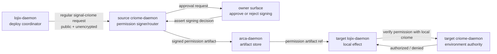

# Criome public socket and deploy-approval clarification - 2026-05-17

## Purpose

This report mirrors the user's latest answers back into the
`lojix` / `criome` / `arca` authorization architecture. It corrects my
previous questions where they were unclear or overcomplicated.

The main correction:

> The regular non-owner `signal-criome` socket is reachable by anyone
> and unencrypted. Security does not come from hiding or protecting
> that socket. Security comes from Criome signatures and the receiving
> `criome-daemon` deciding whether those signatures authorize actions
> in its own environment.

This leaves the owner surface separate: owner-class commands are still
a different contract and authority plane.

## User answers, mirrored

### 1. Regular non-owner socket is reachable by anyone

The regular `signal-criome` socket is not an owner-control socket. It
is the public request surface where consumers and peer Criome daemons
can ask things such as:

- is this object authorized?
- please route this signature request;
- here is a signed permission object;
- observe this authorization request;
- verify this authorization evidence.

Because this socket is reachable by anyone, cross-user same-host
routing is not blocked by Unix runtime-directory permissions in the
way I framed it. A `lojix-system` process does not need to gain owner
access to an operator's owner socket. It talks to a regular
`signal-criome` surface.

What this means:

- owner authority is not enforced on the regular socket;
- regular socket reachability is not a security boundary;
- all regular-socket operations must be safe to receive from
  untrusted clients;
- every effect-bearing decision must depend on signed objects and
  local policy, not on who could connect.

### 2. The regular socket is unencrypted

I read the user's "it's unencrypted" as applying to the regular
non-owner socket named in answer 1.

That means the regular `signal-criome` surface should not carry
secrets. It can carry public requests, object digests, signature
requests, signatures, and authorization status. Confidentiality is not
the protection layer there.

This corrects my earlier drift toward treating all Criome traffic as
possibly encrypted transport. The regular surface can be unencrypted
because its payloads must be designed as public or non-secret.

Important boundary:

- **Regular `signal-criome`:** reachable by anyone, unencrypted,
  safe-by-signature/policy.
- **Owner surface:** separate authority channel for owner commands such
  as approving a signature, unlocking a key, or changing policy.

I do not treat this answer as automatically rescinding the
owner-signal encryption decision from designer/214. If the user meant
owner traffic too, that is a separate stronger correction.

### 3. The signature is in Criome, not Lojix

The signature is not a `lojix` concept.

`lojix` can carry, reference, or ask about authorization artifacts, but
the signature belongs to Criome. Criome signs permission for another
Criome environment to authorize certain actions in that environment.

The better mental model:

```text
client / lojix-daemon
  asks local criome-daemon for authorization

source criome-daemon
  produces or routes signatures over a permission object

target criome-daemon
  receives/verifies the signed permission object
  decides whether it authorizes local action in its environment

target lojix-daemon
  may run the local deploy effect only after target criome says yes
```

So the authorization object is not simply "a signed lojix request."
It is a Criome permission artifact that authorizes an environment to
perform or accept certain actions.

It may still name the `signal-lojix` request digest, but the signature
and grant semantics live in Criome.

### 4. My verifier-policy question was unclear

My previous question was:

> When peer B verifies a `SignedObject` from peer A, does B check
> signers acceptable by A's policy or B's policy?

That was not clear enough.

The clearer version:

> If Criome A signs or routes a permission saying "Criome B may
> authorize action X in environment B," what exactly does Criome B
> check before accepting that permission?

Possible checks:

- Is the signature cryptographically valid?
- Is the signing Criome identity known to B?
- Is the signing Criome allowed to grant this kind of permission to B?
- Does the permission name the exact environment B that will act?
- Does the permission name the exact action scope?
- Is it fresh, not expired, and not replayed?

This is not a question about Lojix. It is a Criome trust-topology
question: what incoming Criome signatures are honored in this
environment?

### 5. First approval use case is maybe Lojix deploy approvals

The first useful owner approval flow should probably be a Lojix deploy
approval.

That means we do not need to begin with a fully generic approval
product. The first owner approval can be concrete:

```text
"Approve this deployment?"
```

Examples:

- approve FullOs deploy to a target;
- approve HomeOnly deploy;
- approve temporary Nix trust modification for a deploy;
- approve activation of a generated system plan.

The owner approval surface can grow later. The first testable path can
be Lojix-shaped.

### 6. Criome asks for signature approval, or owner sends Assert/Mutate to sign an object

There are two nearby shapes:

1. **Criome asks.**
   `criome-daemon` has a pending object that needs a signature or
   approval. It sends an approval request to the owner surface. The
   owner answers yes/no.

2. **Owner asserts or mutates.**
   The owner sends a typed Sema-shaped message to sign or approve an
   object.

The user's wording leaves the exact verb open: maybe `Assert`, maybe
`Mutate`. I think the cleanest first model is:

> Owner approval is an append-only assertion of a signing decision.

That is, the owner does not directly mutate the pending authorization
state. The owner asserts a new fact:

```text
SigningDecision {
  target_object_digest,
  decision = Approved | Rejected,
  owner_identity,
  reason?,
}
```

Then `criome-daemon` consumes that asserted decision and mutates its
own authorization state from pending to signed, denied, or expired.

Why this shape is attractive:

- the owner's decision is auditable as its own fact;
- approving an object does not require the owner client to know
  Criome's internal state-machine layout;
- the daemon remains the owner of authorization state transitions;
- replay/expiry checks stay inside Criome;
- Sema history keeps "owner approved object X" as durable evidence.

The alternative is direct mutation:

```text
Mutate AuthorizationRequestSlot -> Approved
```

That is simpler mechanically but less beautiful: it makes the owner
client edit Criome's pending state instead of contributing an owner
decision fact.

## Corrected architecture



The important correction is the Criome-to-Criome line:

```text
source criome signs permission
target criome authorizes local action in its environment
```

Lojix does not sign. Lojix does not decide permission. Lojix waits for
Criome to authorize the local effect.

## Implications for previous reports

### SYS/141 needs one wording correction

`reports/system-specialist/141-lojix-criome-arca-implementation-synthesis-2026-05-17.md`
said:

> the signed object is the canonical `signal-lojix` request.

Better:

> the signed object is a Criome permission artifact that may name the
> canonical `signal-lojix` request digest and the action/environment it
> authorizes.

This matters because the permission artifact is reusable across Criome
verification logic; it is not just a Lojix request wrapper.

### D/214 regular socket language should be checked

`reports/designer/214-criome-architecture-record-2026-05-17.md`
draws a regular peer socket with mode `0660, group criome-peers`.
The user's latest answer says the regular non-owner socket is
reachable by anyone. That suggests the regular surface should be
broader than a peer-only group socket, or there should be two regular
surfaces:

- public consumer socket;
- peer routing socket.

The architecture should be updated to match the user's intent.

### Owner-signal encryption remains a separate question

The user's answer "it's unencrypted" is tied to the regular
non-owner socket in this exchange. I do not apply it to the owner
socket unless clarified.

If the owner socket carries passphrases or local key-unlock material,
the designer/214 ECDH/AEAD decision may still stand. If the user meant
all local Criome sockets are unencrypted, D/214 needs a correction.

## Implementation consequences

### For `signal-criome`

The regular surface needs to support public, unencrypted request
receipt. That increases pressure to make every request safe:

- malformed frames cannot panic the daemon;
- request floods need capacity limits;
- effect-bearing requests require signature/policy proof;
- no owner-class operation exists on the regular surface.

Permission artifacts should become explicit. Candidate record name:

```text
AuthorizationGrant
```

or, if "grant" is too generic:

```text
CriomePermissionGrant
```

Required fields likely include:

```text
permission_slot
issuer_criome_identity
target_environment
authorized_action_scope
authorized_object_digest
authorized_object_bytes_or_canonical_ref
expires_at
replay_guard
policy_satisfaction
signatures
```

The target environment field is the new emphasis from the user's
answer: the signature sends permission to another Criome daemon to
authorize certain actions in that environment.

This also refines `reports/system-assistant/23-most-relevant-questions-after-d214-op149-op150-2026-05-17.md`
Q4/Q10. Criome should not only see a digest. To sign or verify, it
needs the canonical bytes being signed, or a canonical content-addressed
reference it can resolve to those bytes. The digest is the stable
identity/check; the signature is over canonical content.

### For `owner-signal-criome`

The first owner approval path can be Lojix deploy approval.

Candidate owner-signal records:

```text
RequestSigningApproval
AssertSigningDecision
SigningDecisionAccepted
SigningDecisionRejected
```

I lean toward `AssertSigningDecision` rather than
`MutateAuthorizationRequest`, because approval is its own durable fact.
Criome can then mutate its internal authorization state as a consequence.

### For `lojix`

`lojix` should not receive "signature material" as something it
understands deeply. It should receive an Arca ref or Signal object that
it gives to local Criome for verification.

The Lojix invariant becomes:

> no Nix/deploy effect runs until local Criome says the Criome
> permission artifact authorizes this exact local action in this exact
> environment.

The fake test should therefore use fake Criome replies:

- `AuthorizedForEnvironment { action_scope }`;
- `DeniedForEnvironment { reason }`;
- `PermissionArtifactMalformed`;
- `PermissionArtifactNotForThisEnvironment`.

### For Arca

Arca should store the permission artifact alongside the deployment
artifact set:

```text
DeploymentArtifactSet {
  signal_lojix_request_digest,
  criome_permission_grant_digest,
  horizon_proposal_digest,
  cluster_proposal_digest,
  viewpoint_digest,
  projected_horizon_digest,
  generated_nix_inputs_digest,
  topology_snapshot_digest,
  deployment_plan_digest,
}
```

The name `criome_authorization_digest` from SYS/141 may still be fine,
but `criome_permission_grant_digest` is more precise if "grant" is the
chosen term.

## Best questions now

### 1. Does "unencrypted" apply only to regular `signal-criome`?

I read it that way.

Question:

Does the owner socket still use encrypted owner-session traffic when
it carries passphrases or key-unlock material?

### 2. Is "grant" the right noun?

The user asked:

> "grant? is that what were calling it?"

Question:

Should the signed permission object be called
`AuthorizationGrant`, `PermissionGrant`, `CriomePermissionGrant`, or
something else?

My lean: `CriomePermissionGrant` is clearest across component
boundaries; `AuthorizationGrant` is fine inside `signal-criome`.

### 3. What exactly is the target environment?

The user's wording says the signature sends permission to another
Criome daemon to authorize actions "in that environment."

Question:

Is an environment:

- a Criome daemon identity;
- a Unix user on a host;
- a host+user pair;
- a cluster node;
- a Lojix target;
- or a tuple of several of these?

My lean: environment is the target Criome identity plus its host/user
context. Lojix action scope then names the cluster/node/deploy action.

### 4. Is owner approval an `Assert`?

Question:

Should owner approval be modeled as:

- `Assert SigningDecision` (append-only decision fact);
- `Mutate AuthorizationRequest` (state edit);
- or both: owner asserts a decision, daemon mutates state?

My lean: both, in sequence. Owner asserts; daemon mutates.

### 5. What is the first Lojix approval action?

Question:

Should the first owner approval be:

- approve any `FullOs` deploy;
- approve deploy to a named production node;
- approve temporary Nix trust change;
- approve activation after build succeeds;
- approve the whole deployment plan before any build?

My lean: approve the whole deployment plan before effects. The plan
must include the high-risk local effects it covers.

## Recommendation

The next architecture edit should update the regular `signal-criome`
surface:

- reachable by anyone;
- unencrypted;
- safe because it never carries owner-class secrets;
- all effect-bearing authorization derives from Criome permission
  artifacts.

The next code-facing design should define the signed permission object
and the first owner approval record:

```text
CriomePermissionGrant
AssertSigningDecision
```

Then the first Lojix witness becomes:

> fake target Criome rejects a permission artifact not addressed to its
> environment; Lojix does not run any fake Nix effect.

That tests the corrected architecture directly.
