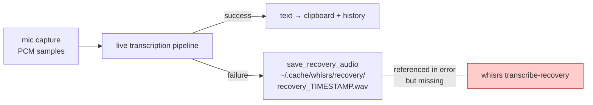
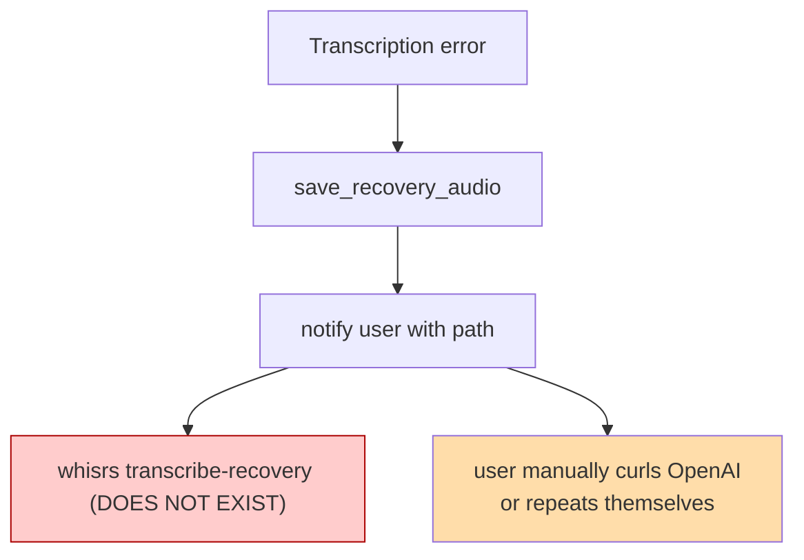
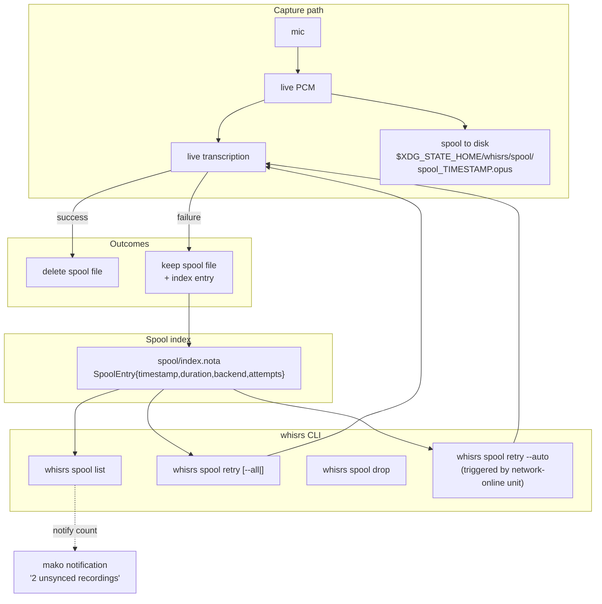

# Voice-typing recovery — design

Author: Claude (system-specialist)

The user has lost long voice notes (sometimes 30+ minutes) when whisrs
fails to transcribe — usually because of a network drop while the
OpenAI backend is reachable. The audio is gone with the failed call;
the user is asked to repeat themselves, often after losing the
mental thread of a long-form thought.

This report maps what whisrs *already* does on failure (more than
expected), names the load-bearing gap (the retry-from-disk CLI is
referenced in error messages but not implemented), proposes a
design that closes the gap, and surfaces the open questions that
need a user decision.

---

## TL;DR



- **Audio is already persisted on failure.** Whisrs's
  `src/audio/recovery.rs` saves raw PCM as
  `~/.cache/whisrs/recovery/recovery_<timestamp>.wav` whenever
  transcription fails mid-stream.
- **The CLI command users are *told* to run does not exist.** The
  daemon's error message says
  `Retry with: whisrs transcribe-recovery` but the CLI's
  `SubCmd` enum has no such variant. Users are pointed at a dead
  command.
- **The cache directory is the wrong home.** XDG cache is
  defined as "fine to delete." Recovery audio is the opposite —
  load-bearing user data until transcribed.
- **No connectivity awareness, no auto-retry.** A network drop
  produces a per-recording failure with no mechanism for the
  daemon to flush the queue once the network returns.
- **Garbage collection exists but isn't wired.**
  `cleanup_old_recoveries(keep)` is implemented but never called;
  recovery files accumulate indefinitely.

---

## What whisrs does today

### Pipeline

```mermaid
sequenceDiagram
  participant user as user (Mod+V)
  participant daemon as whisrsd
  participant mic as audio/capture
  participant tr as transcription/openai_*
  participant fs as ~/.cache/whisrs/recovery
  participant clip as wl-clipboard

  user->>daemon: toggle (start)
  daemon->>mic: stream PCM samples
  user->>daemon: toggle (stop)
  daemon->>tr: POST audio (or stream)
  alt success
    tr-->>daemon: text
    daemon->>clip: copy
    daemon->>daemon: save_history_entry
  else failure (network, API, etc.)
    tr-->>daemon: Err
    daemon->>fs: save_recovery_audio(samples)
    daemon-->>user: notify "saved to <path>; retry with: whisrs transcribe-recovery"
  end
```

The save-on-failure path is real and works — `recovery/` already
contains three WAV files from this session, totalling 3.6 MB.

### What's missing



### File format reality

WAV / raw PCM at the daemon's native capture rate. A 30-minute
recording at 16 kHz mono int16 is **~57 MB** on disk. Compress to
OPUS at the same quality and it's **~5–7 MB**. Format choice
matters: keeping ten failed long recordings means 600 MB of WAV
or 60 MB of OPUS.

---

## The gap and the load-bearing fix

### Gap 1 — `whisrs transcribe-recovery` doesn't exist

The error message at `daemon/main.rs:1258` tells the user to run
a command the CLI doesn't define. This is the smallest, most
disproportionately-impactful fix in the whole system.

### Gap 2 — Cache is the wrong storage class

`~/.cache/whisrs/recovery/` is a *cache*. Cache contents are by
contract disposable; nightly tools, NixOS rebuild scripts, and
disk-cleanup tooling can wipe the cache directory and discard
unsynced work. Recovery audio is the opposite: it's the only copy
of unsynced user content. It belongs under
`$XDG_STATE_HOME/whisrs/recovery/` (state survives reboots and
isn't user-deleted by convention) or `$XDG_DATA_HOME/whisrs/recovery/`
(co-located with `history.jsonl`).

### Gap 3 — No queue, no auto-retry

Each failure stands alone. There's no notion of "the system has N
unprocessed recordings; retry them when the network is back." The
user has to remember, find the file, and run the CLI manually
against each one.

### Gap 4 — No GC discipline

`cleanup_old_recoveries` exists but isn't called. Recovery files
accumulate forever; some in `~/.cache/whisrs/recovery/` are
already orphaned (no record they were ever transcribed). The GC
needs to run *only after a successful retry*, not on a timer.

---

## Proposed shape



### Key design decisions

**1. Spool every recording, not just failures.** Today's "save on
failure" is racy — a crash *during* the failure path loses the
audio entirely. Spooling unconditionally to disk during capture
means the audio survives any crash, kill, or power loss; the
success path simply deletes the spool file when transcription
succeeds.

**2. Index file is Nota-typed.** A small `spool/index.nota`
records each pending entry as a `SpoolEntry` record (timestamp,
duration, backend, attempts). The all-fields-explicit rule (per
`reports/system-specialist/1-nota-all-fields-present-violation.md`)
applies. Index lives next to the audio files.

**3. OPUS, not WAV.** ~10× smaller for the same speech quality.
Whisper / OpenAI handle OPUS natively. The encoder cost is
negligible compared to network upload time.

**4. Garbage collection on success only.** When a retry succeeds,
the spool entry's audio file is deleted, the index entry removed,
and a `history.jsonl` entry is written. No time-based GC; no
"keep N most recent." If the user wants to drop a stale entry
manually they use `whisrs spool drop <id>`.

**5. Auto-retry is opt-in.** A separate `whisrs spool retry --auto`
mode is wired to `network-online.target` (systemd user unit) so
that when network returns, pending entries get retried. The
default-on/off setting is the open question below.

**6. CLI subcommand surface:**

| Command | What |
|---|---|
| `whisrs spool list` | show pending entries (id, time, duration, last error) |
| `whisrs spool retry <id>` | retry one |
| `whisrs spool retry --all` | retry every pending |
| `whisrs spool retry --auto` | retry quietly; intended for systemd unit |
| `whisrs spool drop <id>` | delete one without transcribing |
| `whisrs spool drop --all` | wipe spool (rare; explicit) |

**7. Notification on accumulation.** When the spool has N≥1
entries, mako shows a notification on next idle: *"3 unsynced
recordings"* with a click-action that runs
`whisrs spool list` in a terminal.

### Storage layout

```
$XDG_STATE_HOME/whisrs/
├── spool/
│   ├── index.nota               # ClusterProposal-shaped: list of SpoolEntry
│   ├── 2026-05-07T15-04-18.opus
│   ├── 2026-05-07T15-05-07.opus
│   └── 2026-05-07T15-05-14.opus
└── (existing files: current-mode, etc.)
```

---

## What I'm confident about

- The fix is *small in code surface* — most of the building blocks
  exist (recovery dir, save_recovery_audio, cleanup helper). The
  missing pieces are the CLI subcommand, the spool-on-capture
  path, the OPUS encode, and the network-online wiring.
- Moving from `~/.cache/whisrs/recovery/` to
  `$XDG_STATE_HOME/whisrs/spool/` is the right storage class.
- Spooling unconditionally is the right durability discipline —
  failure-only spooling has a window where the audio is in memory
  and lost on crash.
- The CLI subcommand exists by name in user-visible error
  messages already; implementing it closes the most visible gap
  immediately.
- An automatic retry on network-online is the right default
  behaviour for a tool whose users dictate long-form thoughts —
  but it must be cancellable / discoverable.

## What might not work

- **Live streaming pipeline interaction.** Whisrs has *both* a
  streaming pipeline (chunks uploaded as captured) and a batch
  pipeline (recording-then-upload). Spooling-during-capture is
  natural for batch, less obvious for streaming. The streaming
  case may need to spool the PCM ringbuffer separately and only
  treat the spool as authoritative once the upload-side gives up.
- **OPUS encode latency on weak hardware.** balboa (rk3328 ARM)
  may struggle to encode OPUS in real time at high sample rates;
  the spool format may need to be PCM on weak hardware and OPUS
  on strong hardware. (`horizon.node.size >= med` is a possible
  gate; we already use it for other features.)
- **Sensitive-content concern.** Voice notes can be private. Even
  with state-class storage, the audio sits unencrypted on disk.
  If the user wants encryption-at-rest, the design grows by an
  agent-key wrap step at spool-write time.
- **The vocabulary list as a recovery-side concern.** The
  recovery retry needs to use the *same* config as the original
  recording (vocabulary, prompt, language). If config has drifted
  since the spool was written, the retry transcript may differ
  from what the original recording would have produced. The
  spool entry should freeze the config snapshot at write time.
- **Network-online detection on some Wayland setups.**
  `network-online.target` has known unreliability in user-mode
  systemd. May need a small whisrs-side heartbeat
  (DNS lookup loop, configurable interval) instead.

## What we may need to develop

- **CLI subcommands** as listed above (~150 lines Rust).
- **Spool-on-capture** path in `audio/capture.rs` writing OPUS
  alongside the live PCM stream (~80 lines).
- **`SpoolEntry` typed record** (Nota schema) + a tiny
  `SpoolIndex` API to read/write `index.nota` (~80 lines).
- **`whisrs-spool-retry.service` + `.timer`** systemd user units
  (in CriomOS-home), wired to `network-online.target`.
- **mako notification** when spool count > 0 (cooperate with
  existing notification style — finite timeout per the
  recently-tightened mako config).
- **Storage migration** from `~/.cache/whisrs/recovery/` to
  `$XDG_STATE_HOME/whisrs/spool/` (one-shot at first run after
  upgrade).

The change is upstream-shaped. The patch lives in this workspace
already (`packages/whisrs/transcript-recovery.patch`); a *new*
patch (or the one extended) carries this design. If the upstream
maintainer accepts the patch, even better.

---

## Open questions for the user

1. **Storage default — encrypted or plain?** Spool audio is
   unencrypted by default. Adding encryption raises the floor
   for anyone with disk access (lost laptop, stolen disk) but
   adds key-management complexity. Default plain, opt-in encryption?
   Or default encryption?
2. **Auto-retry default — on or off?** The strongest argument
   for *on* is: the user just lost a 30-minute thought because of
   a network blip. The strongest argument for *off* is:
   surprise transcriptions of stale audio after the user thought
   the recording was abandoned. Lean *on*?
3. **Spool retention cap — none, or some?** With unconditional
   spooling and on-success deletion, the spool only contains
   genuinely-failed recordings. Is "no cap, user manages
   manually" fine, or do we want a "drop entries older than 30
   days" floor?
4. **Notification cadence.** Once on accumulation, on every idle
   transition, or every N minutes? My instinct is once per
   transition from-empty-to-non-empty, then again only after
   manual dismissal.
5. **Vocabulary/config snapshotting.** Freeze the config at
   spool-write time (so retry reproduces the original intent),
   or use current config (so retry benefits from any vocabulary
   improvements made since)? Both have legitimate readings.
6. **Streaming pipeline coexistence.** When a recording is in
   the streaming path and partially uploaded, on failure should
   the spool contain *all* the PCM (full re-transcribe) or only
   the unacknowledged tail (resume)? The simpler design is
   "always full re-transcribe"; the smarter design is "track the
   last-acknowledged byte and skip the prefix on retry."
7. **Upstream PR or patch-only?** This change is generally
   useful — every whisrs user with intermittent connectivity
   benefits. Worth proposing upstream as a PR, or carry it as a
   CriomOS-home patch (current pattern)?

---

## Suggested first slice

If this lands incrementally:

1. **`whisrs transcribe-recovery` (smallest fix, biggest win).**
   Wire the CLI subcommand the daemon already advertises. Reads
   the existing `~/.cache/whisrs/recovery/` directory, lists the
   files, accepts an index or `--all`, sends each to the
   currently-configured transcription backend, on success appends
   to `history.jsonl` and removes the file. Backwards-compatible
   with the existing on-disk shape; immediately makes the user's
   3 stranded recordings recoverable. ~150 lines Rust.

2. **Move to `$XDG_STATE_HOME` + index file.** Migrate storage,
   introduce `index.nota`, add `whisrs spool list`. The CLI
   commands gain proper structured output. ~200 lines.

3. **Spool-on-capture (replacing save-on-failure).** Audio
   becomes guaranteed-durable. ~80 lines.

4. **Auto-retry + mako notification.** Network-online unit,
   notification cadence. ~100 lines + a small CriomOS-home patch.

5. **OPUS encode, encryption (optional).** Format / privacy
   improvements once the durability path is in place.

The user gets the most value out of step 1 alone; everything
after is hardening.

---

## See also

- `reports/system-specialist/1-nota-all-fields-present-violation.md`
  — the all-fields-explicit rule applies to `index.nota`'s
  `SpoolEntry` schema.
- `~/git/CriomOS-home/modules/home/profiles/min/dictation.nix` —
  current whisrs wiring (systemd unit, niri keybinds).
- `~/git/CriomOS-home/packages/whisrs/transcript-recovery.patch`
  — existing patch (clipboard-on-success); does **not** address
  audio recovery despite the name.
- whisrs upstream `src/audio/recovery.rs` — the
  save-on-failure path already in place (cache dir, WAV).
- whisrs upstream `src/cli/main.rs` — current `SubCmd` enum;
  where the new subcommands would land.
