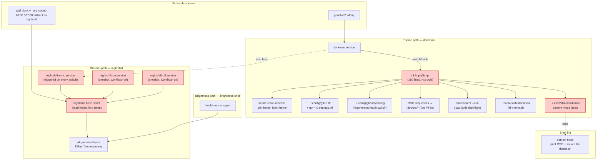
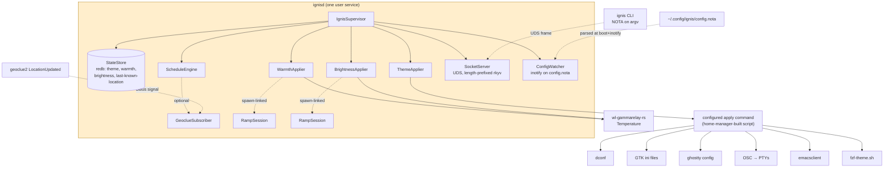
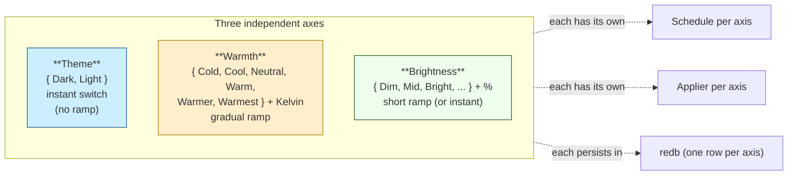
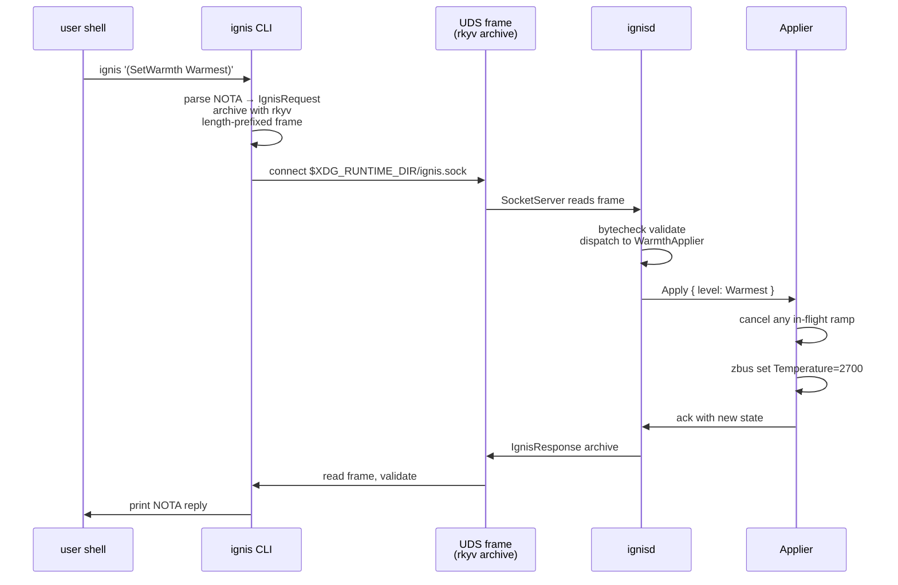
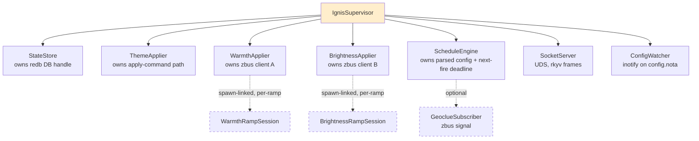
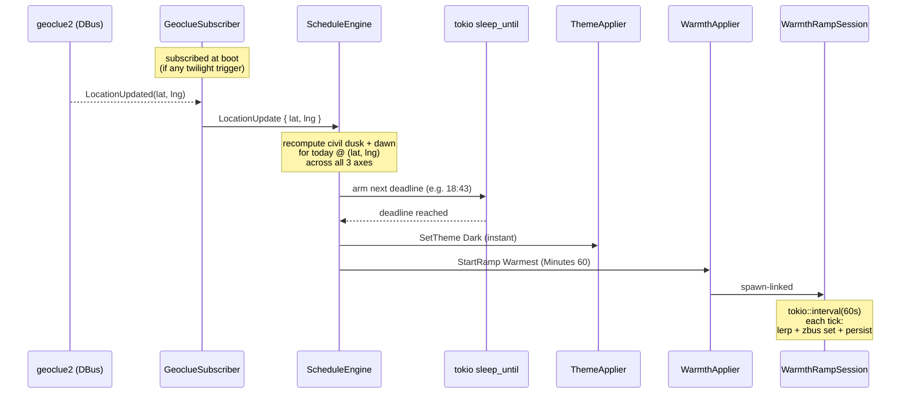

# Ignis — one daemon for theme, warmth, brightness

Author: Claude (system-specialist)

Today the visual state of the desktop is animated by **darkman**
(theme schedule), a 60-line **`nightshift` bash script** wired into
**three systemd services** (`nightshift-sync`, `nightshift-on`,
`nightshift-off`), the **`brightness` shell wrapper**, the
**`wl-gammarelay-rs` DBus daemon**, and a **180-line `mkApplyScript`
generator** in `CriomOS-home`. Six moving parts, three transports
(DBus, systemd, shell), one already-recorded systemd-cycle incident
(zeus 2026-04-26, archived as `a415e3e`), and a coupling between
theme and warmth that the user has lost time to repeatedly.

This report proposes folding all of that into a single Rust
micro-component: **`ignis`**, a NOTA-controlled daemon that owns the
three independent visual axes (theme, warmth, brightness), drives
their schedules from real geolocation, persists its state in redb,
exposes one rkyv-on-UDS request surface, and replaces darkman +
nightshift outright. The name extends the existing **Ignis**
visual identity (`ignis.yaml`, `ignis-light.yaml`,
`ignis-dark`/`ignis-light` Emacs themes) — the daemon is the agent
that animates Ignis.

This report supersedes `reports/system-specialist/3-warmth-decoupling-design.md`,
which scoped a `warmth`-only daemon and left darkman + nightshift
intact. The unified design here delivers the same decoupling — theme
and warmth are independent axes — while removing more fragmentation
and relieving the recurring incident class.

Bead: `primary-8b6` (P2, system-specialist).

---

## Today's shape — six parts, three transports



What's coupled today:

- **One darkman event drives both theme and warmth.** The darkman
  switch hook calls `applyDark` *and* fires
  `nightshift-sync.service`. Triggering "dark mode" at 14:00 also
  turns the screen warm. The user wants the axes independent
  (`primary-8b6`).
- **Warmth has no real schedule.** `nightshift sync` reads
  darkman's mode and snaps; if darkman is down, it falls back to
  hard-coded `hour ≥ 20 || hour < 7`. There is no "civil dusk
  minus 30 minutes, ramp 60 minutes" today.
- **Three nightshift services + Conflicts=** form a fragile
  exclusion choreography. The `nightshift-sync ↔ wl-gammarelay-rs
  ↔ graphical-session.target` ordering already produced an
  incident (zeus 2026-04-26, archived `a415e3e`); the inline fix
  (After=`graphical-session-pre.target`) is an explicit comment in
  `default.nix:705-714`.
- **State lives in three places.** `~/.local/state/darkman/current-mode`
  (text), darkman's internal state, the live DBus property on
  wl-gammarelay-rs. They drift on resume, login, screen wake.
- **Stylix sets `polarity = "dark"` at boot** (declarative);
  darkman switches at runtime. The two are reconciled by the
  `home.activation.reapplyDarkman` hook, which restarts darkman
  and re-reads the text-file mode after every home-manager switch.

Six moving parts, three transports, a fall-back hour-check that's
wrong half the year, and an incident class the comments document
inline. The shape is a candidate for replacement, not patching.

---

## Proposed shape — one daemon, three axes



What goes away:

| Removed | Replaced by |
|---|---|
| `darkman.service` | `ignisd` |
| `services.darkman` block in `base.nix` | `ignis` flake input + home-manager module |
| `nightshift` shell binary | `WarmthApplier` actor inside `ignisd` |
| `nightshift-sync.service` | `ScheduleEngine` actor; deadline timer per waypoint |
| `nightshift-on.service`, `nightshift-off.service` | `(SetWarmth Warmest)` / `(SetWarmth Cold)` CLI commands |
| `brightness` shell binary | `BrightnessApplier` actor; `(SetBrightness ...)` CLI |
| `~/.local/state/darkman/current-mode` text file | redb row keyed by axis; rkyv-archived value |
| `~/.local/state/darkman/fzf-theme.sh` | apply command writes it (stays a file consumed by zsh init) |
| `home.activation.reapplyDarkman` activation | `ignisd` re-reads redb on start, re-applies all axes |
| systemd cycle workaround comment in `default.nix:705-714` | gone — no `nightshift-sync` exists in the new layout |

What stays:

| Kept | Why |
|---|---|
| `wl-gammarelay-rs.service` | Still the only stable wlroots gamma DBus daemon; `ignisd` is its sole consumer. |
| `mkApplyScript` shell content (dconf, GTK ini, ghostty, OSC, emacs, fzf) | NixOS-specific glue; lives as a home-manager-built script invoked by `ignisd` as an opaque executable. |
| Stylix's declarative initial polarity | First-boot default until `ignisd` reads its state on first run. |
| zsh init hook reading `current-mode` + sourcing `fzf-theme.sh` | The apply script keeps writing those; new shells warm-start as before. |
| `theme-dark` / `theme-light` shell scripts (optional) | Tiny wrappers around `ignis '(SetTheme Dark)'` / `(SetTheme Light)` for muscle-memory; not load-bearing. |

The boundary the design draws: **`ignisd` decides *when* and *to
what*; the apply command decides *how*.** The apply command is
home-manager-built (NixOS-specific); `ignisd` is portable Rust.

---

## Three independent axes — same daemon, no shared decision



The axes are coordinated by **proximity in one daemon**, not by
**coupling of decisions**. The user can:

- Flip theme to `Dark` at 14:00 without changing warmth.
- Run warmth from `Cold` to `Warmest` over an hour at dusk
  while theme stays `Light`.
- Drop brightness 20% without touching theme or warmth.
- Configure each axis's schedule independently — the user can
  even disable a schedule (set Default only) and drive that
  axis manually.

The unification is at the **infrastructure** level (one
configuration file, one redb, one geoclue subscription, one CLI,
one service unit). The decisions are independent.

---

## Configuration — single NOTA record

`~/.config/ignis/config.nota` carries the entire visual schedule.
Single record; `ConfigWatcher` re-parses on inotify push.

```
(IgnisConfig
  (Theme
    (ApplyCommand "/run/current-system/sw/bin/ignis-apply-theme")
    (Schedule
      (Waypoint (CivilDawn (SignedMinutes 0)) Light)
      (Waypoint (CivilDusk (SignedMinutes 0)) Dark)))
  (Warmth
    (Schedule
      (Waypoint (CivilDawn (SignedMinutes -30))
                (Level Cold)
                (Ramp (Minutes 30)))
      (Waypoint (CivilDusk (SignedMinutes -60))
                (Level Warmest)
                (Ramp (Minutes 60)))
      (Default Neutral)))
  (Brightness
    (Schedule
      (Waypoint (TimeOfDay 22 0)
                (Level Dim)
                (Ramp (Minutes 60)))
      (Waypoint (TimeOfDay 7 30)
                (Level Bright)
                (Ramp (Minutes 30)))
      (Default Bright))))
```

Or fully manual (no schedule, daemon honours CLI commands only):

```
(IgnisConfig
  (Theme
    (ApplyCommand "/run/current-system/sw/bin/ignis-apply-theme")
    (Schedule (Manual Light)))
  (Warmth (Schedule (Manual Neutral)))
  (Brightness (Schedule (Manual Bright))))
```

`StartAt` is a closed enum:

| Variant | Meaning |
|---|---|
| `(CivilDusk (SignedMinutes <n>))` | civil dusk for the user's lat/lng, offset `n` min |
| `(CivilDawn (SignedMinutes <n>))` | civil dawn, offset `n` min |
| `(TimeOfDay <h> <m>)` | wall-clock hour:minute, every day |

The daemon decides whether to subscribe to geoclue2 by inspecting
the parsed config — if **any** axis uses a civil-twilight trigger,
geoclue is subscribed; otherwise the geoclue actor is never
spawned. All NOTA fields explicit per the all-fields-present
discipline (see `reports/system-specialist/1-nota-all-fields-present-violation.md`).

`ApplyCommand` lives only on the `Theme` axis because warmth and
brightness apply via held DBus connections to wl-gammarelay-rs;
those don't need configuration. If `ApplyCommand` is absent, the
daemon refuses to start with a clear error pointing at the missing
field.

---

## CLI — single NOTA request on argv



Per-verb table — perfect specificity, one variant per verb:

| Invocation | Effect |
|---|---|
| `ignis '(GetState)'` | full snapshot of all three axes (NOTA reply) |
| `ignis '(SetTheme Dark)'` | invoke apply command with `dark`, persist mode |
| `ignis '(SetTheme Light)'` | invoke apply command with `light`, persist mode |
| `ignis '(GetTheme)'` | print current theme |
| `ignis '(SetWarmth Warm)'` | jump to a warmth level, cancel any ramp |
| `ignis '(SetWarmthKelvin 3500)'` | set arbitrary kelvin (Custom level) |
| `ignis '(StepWarmthUp)'` | step one level toward `Warmest`, clamped |
| `ignis '(StepWarmthDown)'` | step one level toward `Cold`, clamped |
| `ignis '(StartWarmthRamp Warmest (Minutes 60))'` | start an interpolating ramp |
| `ignis '(InterruptWarmth)'` | cancel an in-flight warmth ramp |
| `ignis '(GetWarmth)'` | print level + kelvin |
| `ignis '(SetBrightness Mid)'` | jump to a brightness level |
| `ignis '(SetBrightnessPercent 65)'` | set arbitrary percent |
| `ignis '(StepBrightnessUp)'` | step one level toward `Brightest` |
| `ignis '(StepBrightnessDown)'` | step one level toward `Dim` |
| `ignis '(StartBrightnessRamp Mid (Minutes 5))'` | start an interpolating ramp |
| `ignis '(InterruptBrightness)'` | cancel an in-flight brightness ramp |
| `ignis '(GetBrightness)'` | print level + percent |
| `ignis '(ReloadConfig)'` | force re-read of `config.nota` |

The verbs split per axis intentionally — perfect specificity over a
polymorphic `(Set <axis> <value>)`. Each variant carries exactly
the data it needs; the type system knows which axis is being set
and what its level type is.

The CLI is a thin signal client: parse NOTA → archive with rkyv →
length-prefix → send to UDS → read response → print as NOTA.
Every behavior lives in the daemon.

---

## Domain values — one type per concept

| Concept | Type | Notes |
|---|---|---|
| `ThemeMode` | enum `{ Dark, Light }` | Two-valued today; future `(Custom <scheme-name>)` if more palettes ship. |
| `WarmthLevel` | enum `{ Cold, Cool, Neutral, Warm, Warmer, Warmest }` | Six-step ladder. `Step` semantics defined on the type. |
| `KelvinTemperature` | newtype `(u16)` | The wire value to wl-gammarelay-rs. Maps from `WarmthLevel` via a method. |
| `BrightnessLevel` | enum `{ Dim, Dimmer, Mid, Bright, Brighter, Brightest }` | Six-step ladder, parallel to warmth. |
| `BrightnessPercent` | newtype `(u8)` | Percent 0–100. Maps from `BrightnessLevel`. wl-gammarelay-rs Brightness is `d` (0.0–1.0); the daemon converts at the boundary. |
| `RampDuration` | newtype `(Duration)` | Minimum clamp at construct (e.g. ≥1 second to avoid degenerate cases). |
| `SignedMinutes` | newtype `(i16)` | Allows ±offset around civil-twilight events. |
| `RampTrigger` | enum `{ CivilDawn(SignedMinutes), CivilDusk(SignedMinutes), TimeOfDay(LocalHour, LocalMinute) }` | Closed; geoclue subscription opens iff any twilight variant present. |
| `IgnisRequest` | enum (one variant per CLI verb) | rkyv-archived on the wire. |
| `IgnisResponse` | enum `{ State(VisualState), Error(IgnisError), Acked }` | One-shot reply per request. |
| `VisualState` | record `{ theme, warmth, brightness, in_flight_ramps }` | Full snapshot returned by `GetState`. |
| `IgnisError` | enum (typed via `thiserror`) | per crate, no `anyhow`/`eyre` at boundaries. |

Each level enum carries `step_up` / `step_down` / `clamp` as
methods (verb belongs to noun). `KelvinTemperature::lerp` is a
method for the ramp. `BrightnessLevel::percent` is a method that
returns the canonical mapping. The wire-side conversions
(`f64` for wl-gammarelay-rs Brightness `d`) live in the
applier — domain types stay clean.

---

## Actor topology

Per `lore/rust/ractor.md` discipline (Actor / State / Arguments /
Message four-piece, perfect-specificity messages, `*Handle`
consumer surface, supervision):



- **`IgnisSupervisor`** is the only place bare `Actor::spawn` is
  called; every other spawn is `spawn_linked` from a parent's
  `pre_start`. Failures in any child escalate to the supervisor's
  decision.
- **State is owned, not shared.** No `Arc<Mutex<T>>` between
  actors. Each applier owns its own zbus connection clone; the
  state-store is the only owner of the redb handle.
- **`StateStore`** holds one redb table keyed by axis name
  (`"theme"`, `"warmth"`, `"brightness"`, `"last_known_location"`),
  values are rkyv-archived domain records. Read on boot; written
  on every change. Crash-consistent.
- **`ThemeApplier`** holds the apply-command path; on
  `Apply { mode }` it spawns the command with one arg (`dark` or
  `light`), waits for exit, persists, replies.
- **`WarmthApplier` / `BrightnessApplier`** each hold a held zbus
  connection to `rs.wl-gammarelay`. On `Apply { level }` they
  cancel any active ramp (`spawn_linked` child stop), set the
  property atomically, persist. On `StartRamp { target, duration }`
  they spawn a `RampSession` that ticks via
  `tokio::time::interval` and applies lerped values, persists at
  end.
- **`ScheduleEngine`** computes the next fire time across all
  three axes (per their schedules + last geoclue location), arms
  one `tokio::time::sleep_until` deadline. On fire, dispatches to
  the appropriate applier (set instantly, or spawn a ramp if the
  waypoint specifies one). Re-arms.
- **`GeoclueSubscriber`** (dashed) is spawned only when at least
  one axis uses a civil-twilight trigger. Holds an open zbus
  subscription to `org.freedesktop.GeoClue2.Client.LocationUpdated`.
  Each push triggers `ScheduleEngine` to recompute its deadlines.
- **`SocketServer`** owns the UDS at
  `$XDG_RUNTIME_DIR/ignis.sock`. Length-prefixed rkyv frames.
  Each request gets its own short-lived task; the server itself
  is the supervisor of those tasks.
- **`ConfigWatcher`** holds an inotify handle on the config path.
  Push events trigger a re-parse + supervised reset of
  `ScheduleEngine` (and re-spawn of `GeoclueSubscriber` if the
  twilight-trigger predicate changed).

Total: 7 actors at boot, +1 conditional (geoclue), +0–2 transient
(per active ramp). Easily within the LLM-context size budget for
the whole crate.

---

## Geolocation hook — one signal, three axes



One geoclue subscription, one recompute pass, one deadline timer
covering all three axes. Push-not-poll throughout: geoclue pushes
location, kernel pushes the deadline (timerfd-backed `sleep_until`
— named ESSENCE carve-out), zbus pushes property updates,
inotify pushes config reloads, UDS frames push CLI commands. There
is no `loop { check_time(); sleep(N); }` anywhere in the daemon.

When location updates again, the existing deadline is cancelled
and re-armed. When a ramp is in flight and the user issues a
manual `(SetWarmth ...)` or another waypoint fires, the ramp is
stopped and the new value applied directly — there is never an
in-flight ramp racing the user.

---

## The theme apply boundary — opaque executable

`ThemeApplier` invokes a configured command with one argument:

```
${ApplyCommand} dark    # or: light
```

The command is generated by **home-manager** (NixOS-specific) —
it carries the dconf paths, GTK ini paths, ghostty config layout,
running-emacs detection, fzf-theme path, and PTY enumeration.
Today this content lives in `mkApplyScript` (180 lines in
`base.nix`); under the new shape it becomes a standalone shell
binary called `ignis-apply-theme`, exported from the home-manager
module, and the `ApplyCommand` field in `config.nota` points at it.

Why this split:

- The daemon is **NixOS-agnostic** (portable Rust crate).
- The apply script is **NixOS-specific** (pulls `pkgs.dconf`,
  `pkgs.emacs-pgtk`, etc., as Nix store paths).
- Evolution of either side is independent: the user can edit the
  apply script (e.g. add a new app to update) without rebuilding
  the daemon, and the daemon can ship updates without touching the
  apply script.
- The apply script writes the same files it does today
  (`current-mode`, `fzf-theme.sh`, ghostty config, GTK ini,
  emacsclient call, OSC sequences). Existing zsh init hook keeps
  reading them. **No shell-side changes needed.**

The contract: **one positional arg, exit 0 on success.** The
daemon waits for exit; a non-zero exit becomes a reply error to
the CLI caller.

---

## State persistence — redb + rkyv

Per `skills/rust-discipline.md` §"redb + rkyv":

- **One redb file:** `$XDG_STATE_HOME/ignis/state.redb`.
- **One table per concept** (theme, warmth, brightness,
  last-known-location). Keys are `&str`; values are rkyv-archived
  domain records.
- **All reads on the hot path use `rkyv::access`** (zero-copy);
  ownership is taken only when needed.
- **Every transition is one redb write transaction.** State and
  the corresponding hardware write (zbus, apply command) are
  serialized: redb-write happens *before* the hardware write so a
  crash mid-apply leaves the redb in the new state and the next
  boot reapplies; never the other way around.
- **Version-skew guard** at boot: a known-slot record carrying
  `(schema_version, wire_version)`; mismatch is a hard fail.

On boot, `IgnisSupervisor` reads the three axis rows + last-known
location from redb, hands the values to each applier, and each
applier re-applies its current value (theme apply command runs;
zbus property is set). State on disk and state on hardware
converge on every boot — no drift after resume, login, or unclean
shutdown.

---

## Anti-patterns this design closes

| Today's anti-pattern | Concrete location | New shape |
|---|---|---|
| Text file as durable state | `~/.local/state/darkman/current-mode` | redb + rkyv |
| Shell script as the running component | `nightshift` (60 lines) | `WarmthApplier` actor + ramp child |
| systemd Conflicts= choreography for state machines | `nightshift-on` ⊥ `nightshift-off` | one actor; in-flight ramp cancellation is method dispatch |
| Hard-coded fallback hours | `nightshift sync` line 320–326 (`hour ≥ 20 ‖ hour < 7`) | always real schedule from config; no hour-of-day fallback |
| Two events bundled into one | darkman switch hook fires `applyDark` + `nightshift-sync` | three independent axes; their schedules don't share fires |
| Polling-shaped guards | `ExecStartPre = sleep 1` in `nightshift-sync.service` | proper actor `pre_start` + zbus connection-up wait |
| State recomputation from text in the daemon | `darkman get` re-read by nightshift each `sync` | daemon owns the typed record |
| Stale state on resume | text file diverges from DBus property | every boot re-applies redb state to hardware |
| Cycle-prone systemd graph | `wl-gammarelay-rs ↔ nightshift-sync ↔ graphical-session.target` (incident `a415e3e`) | one user service: `ignisd.service`, `After=wl-gammarelay-rs.service` |

The systemd-cycle incident class disappears because there's no
`nightshift-sync` to participate in a cycle — the daemon listens
to wl-gammarelay-rs availability via its zbus client and retries
once with backoff before failing the start.

---

## Implementation plan — eight stops

1. **New repo `ignis`** under `/git/github.com/<org>/ignis/`. One
   Rust crate, `[lib]` + `[[bin]] ignis` + `[[bin]] ignisd`. Flake
   with crane + fenix per lore's `rust/nix-packaging.md`.
2. **Domain types and error enum.** `ThemeMode`, `WarmthLevel`,
   `KelvinTemperature`, `BrightnessLevel`, `BrightnessPercent`,
   `RampDuration`, `SignedMinutes`, `RampTrigger`, `IgnisRequest`,
   `IgnisResponse`, `VisualState`, `IgnisConfig`, `IgnisError`.
   NOTA derive on the config + request types; rkyv derive on the
   wire types and the persisted records. Tests round-trip every
   shape.
3. **StateStore actor.** Owns the redb file at
   `$XDG_STATE_HOME/ignis/state.redb`. One typed table per axis;
   rkyv-archived values. Boot recovery, version-skew guard.
4. **WarmthApplier + BrightnessApplier actors** (parallel —
   essentially the same shape over different level types, distinct
   actors per perfect-specificity). Each holds a held zbus
   connection to `rs.wl-gammarelay`. Cancel-and-replace ramp
   semantics. Per-axis `RampSession` child.
5. **ThemeApplier actor.** Spawns the configured apply command,
   waits for exit, persists on success.
6. **ScheduleEngine actor.** Loads `IgnisConfig`. Computes the
   next fire across all three axes. Single deadline timer.
   Re-computation hook on `LocationUpdate` and on `ReloadConfig`.
   `GeoclueSubscriber` spawned conditionally on
   twilight-trigger presence.
7. **SocketServer + ConfigWatcher.** UDS at
   `$XDG_RUNTIME_DIR/ignis.sock`. Length-prefixed rkyv frames.
   Inotify watch on `~/.config/ignis/config.nota` reloads on
   change (no SIGHUP needed; SIGHUP also handled defensively).
8. **CriomOS-home wiring** (separate commit, after stops 1–7
   land):
   - Add `ignis` as a flake input.
   - New `modules/home/profiles/min/ignis.nix`: package the
     daemon, package the home-manager-built `ignis-apply-theme`
     script (lifted out of `mkApplyScript`), drop a default
     `config.nota` if absent, define `ignisd.service`
     (`After=wl-gammarelay-rs.service`, `WantedBy=
     graphical-session.target`).
   - Delete `services.darkman` from `base.nix`.
   - Delete `nightshift` shell script + the three `nightshift-*`
     services from `profiles/min/default.nix`.
   - Delete `home.activation.reapplyDarkman`.
   - Replace `theme-dark` / `theme-light` shell wrappers with
     `ignis '(SetTheme Dark)'` / `(SetTheme Light)` (or keep
     thin wrappers for muscle memory).
   - Drop the systemd-cycle workaround comment in
     `default.nix:705-714` (no longer relevant).
   - Keep `wl-gammarelay-rs.service`, `stylix` initial polarity,
     and the zsh `terminalInitHook` unchanged — the apply script
     keeps writing the files those depend on.

Stops 1–7 land in the `ignis` repo; stop 8 lands in CriomOS-home
as a single commit consuming the flake input.

---

## What's *not* in scope

- **Implementing the freedesktop appearance portal in `ignisd`.**
  We rely on dconf as the de-facto baseline (set by the apply
  command; read by GTK4, Firefox, GNOME apps, Electron). If a
  later need surfaces, exposing
  `org.freedesktop.portal.Settings.color-scheme` from `ignisd`
  is a small follow-up — the daemon already owns the truth.
- **Per-monitor warmth/brightness.** wl-gammarelay-rs is
  per-output today; the daemon's first slice mirrors that. A
  multi-monitor extension is a follow-up.
- **Cross-machine visual sync.** Per-machine for now. A future
  proposal record on Persona's typed messaging fabric can
  broadcast theme/warmth across a user's machines.
- **Wallpaper switching.** Stylix's wallpaper hook is unchanged;
  if wallpaper becomes a fourth axis, it's a new actor inside the
  same daemon.
- **Migration of the CLI ↔ daemon transport off rkyv-on-UDS.**
  The canonical signal pattern (per `~/primary/repos/signal`)
  is the right shape today. When Persona's typed messaging
  fabric arrives, the daemon migrates to it as part of
  workspace-wide migration; not a special case for `ignis`.
- **A `VisualState` cluster-proposal projection** (horizon-rs /
  Criome integration). The first slice is per-user config + state.
  Promotion to a cluster-proposal is a follow-up if visual state
  becomes something the cluster wants to coordinate.

---

## Open questions

Defaults are picked; the user can flip them later by editing
`config.nota`.

1. **Default warmth ladder.** Cold (6500K), Cool (5500K), Neutral
   (4500K), Warm (3700K), Warmer (3200K), Warmest (2700K). One
   table-of-mappings in `WarmthLevel::kelvin`; trivially edited.
2. **Default brightness ladder.** Dim (35%), Dimmer (50%), Mid
   (70%), Bright (85%), Brighter (95%), Brightest (100%). Same
   table shape as warmth.
3. **Default ramp durations.** 60 min evening warmth; 30 min
   morning warmth; 60 min nightly brightness drop; 30 min morning
   brightness rise. Theme is always instant.
4. **Behavior on no-geoclue.** If config asks for civil-twilight
   triggers but geoclue is unavailable for >5 minutes after boot,
   the daemon emits a single notify (via `notify-send` if
   available, otherwise a log line) and falls back to the daemon's
   redb-stored last-known location. If no last-known exists, the
   axes that depend on geoclue stay at their `Default` value;
   `TimeOfDay` triggers continue to fire normally.
5. **Default `ApplyCommand` path.** The home-manager module sets
   it to `/run/current-system/sw/bin/ignis-apply-theme` — the
   script the module builds and packages.
6. **Notification on level changes?** No, by default — silent.
   The CLI's NOTA reply is the user-visible feedback when
   commanded; schedule-driven changes are silent.
7. **Should the CLI block until apply is ack'd?** Yes — the
   `IgnisResponse::State` reply contains the post-change
   `VisualState`, so a successful exit means the apply has
   actually landed. Faster feedback than fire-and-forget; matches
   the user's expectations for CLI tools.

---

## Why one daemon, not three

Per `skills/micro-components.md` rule 6: "Adding a feature
defaults to a new crate, not editing an existing one. They must
justify why the new behavior is part of the *same capability*,
not a new one."

The capability here is **animating the visual state of the
desktop**. The three axes share:

- **Same triggers** (sun position, time of day, manual override).
- **Same upstream signal** (geoclue location).
- **Same lifecycle** (`graphical-session.target`).
- **Same persistence shape** (one row per axis, rkyv-archived).
- **Same CLI surface** (one NOTA grammar, one socket).
- **Same config file** (one schedule per axis, one parser).

Three crates would duplicate geoclue, redb, the schedule engine,
the socket server, and the inotify watcher. The duplication
*itself* would be a smell — three crates each building the same
infrastructure, with no clear noun separating them.

The axes are **coordinated by proximity in one daemon, not by
coupling of decisions.** This is the unification the user asked
for, with the decoupling the user has already lost time to.

The size budget is comfortable: ~3–5 actors at boot, ~200–500 LOC
per actor, ~2–3K LOC total including tests. Fits in a single LLM
context window, per the micro-components ceiling.

---

## See also

- bead `primary-8b6` — original task; this report supersedes the
  inline shell-shape implementation hints there.
- `~/primary/skills/rust-discipline.md` — the discipline this
  design applies (methods on types, errors as enums, ractor for
  stateful components, redb + rkyv, NOTA on the human boundary).
- `~/primary/skills/micro-components.md` — one capability per
  crate per repo; the case for unifying theme + warmth +
  brightness as one capability.
- `~/primary/skills/push-not-pull.md` — push-everywhere shape:
  geoclue signal, deadline timer, inotify, UDS frames, zbus.
- `~/primary/ESSENCE.md` §"Polling is forbidden" — the named
  carve-outs (deadline timers via timerfd, reachability probes,
  backpressure-aware pacing) used here.
- `~/primary/skills/abstractions.md` — every reusable verb belongs
  to a noun; the per-axis applier shape is this rule applied at
  the actor boundary.
- `~/primary/repos/signal` — canonical reference for the
  rkyv-on-UDS signaling pattern used between CLI and daemon.
- `~/primary/repos/lojix-cli` — canonical "single NOTA request on
  argv" CLI shape; this design mirrors it.
- `lore/rust/ractor.md` — actor template, perfect-specificity
  messages, supervision, the `*Handle` consumer surface.
- `lore/rust/rkyv.md` — feature-set pinning, derive-alias pattern,
  schema fragility.
- `~/primary/reports/system-specialist/1-nota-all-fields-present-violation.md`
  — the NOTA discipline this design respects (all fields explicit,
  no implicit None).
- `CriomOS-home/modules/home/base.nix` §`mkApplyScript`,
  §`services.darkman`, §`home.activation.reapplyDarkman` — the
  three blocks rewritten or deleted in stop 8.
- `CriomOS-home/modules/home/profiles/min/default.nix`
  §`nightshift`, §`brightness`, §`systemd.user.services` — the
  shell binaries and service units removed in stop 8.
- `CriomOS-home/modules/home/ignis.yaml`,
  `CriomOS-home/modules/home/ignis-light.yaml` — the existing
  Ignis palette files; the daemon name is the same brand.
