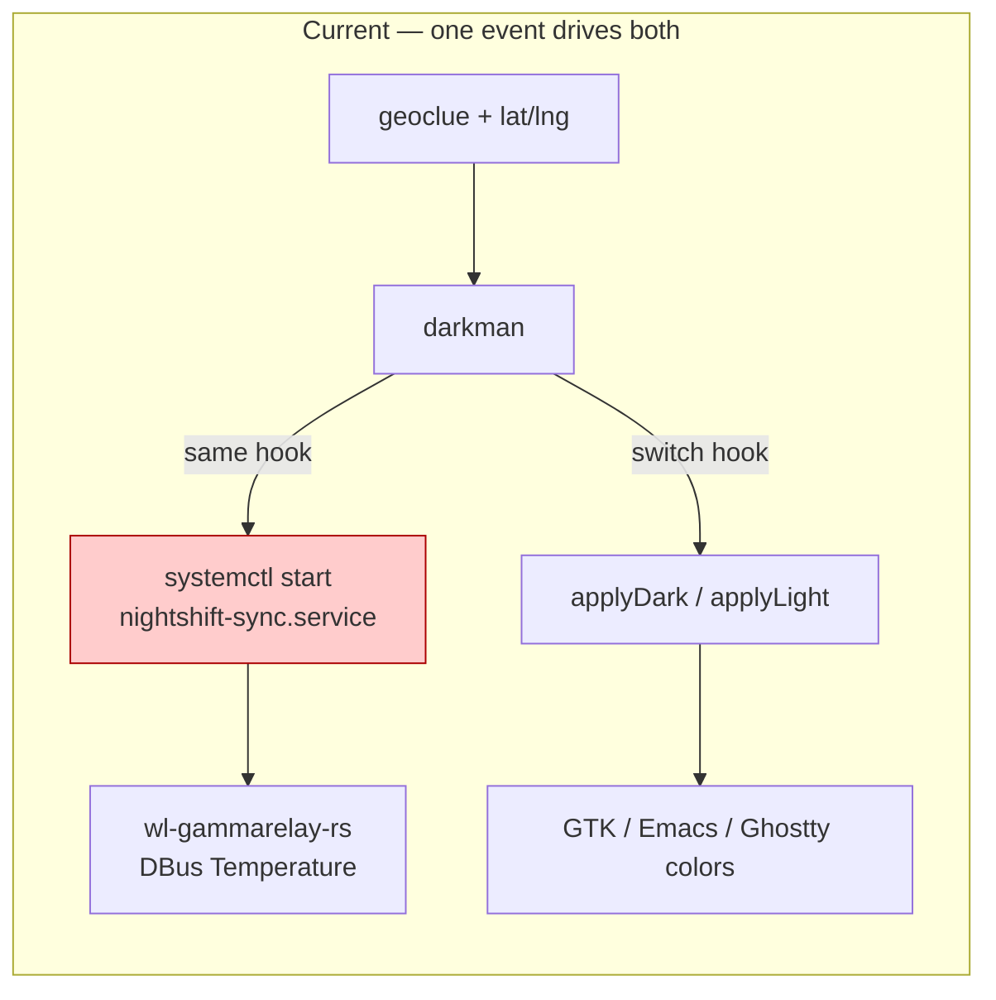
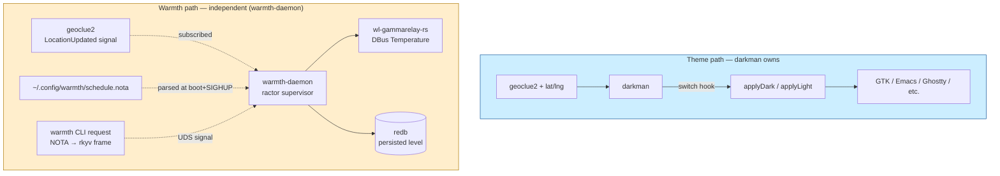
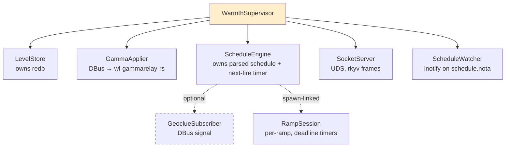
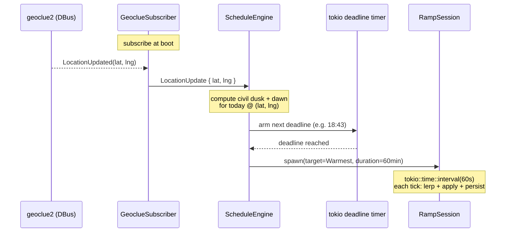

# Decouple dark theme from warm screen — design

Author: Claude (system-specialist)

Today the dark/light theme flip and the warm-screen (gamma temperature)
flip are bolted together in `services.darkman`'s switch hooks. A single
darkman event drives both, so triggering "dark mode" at 14:00 also
turns the screen warm — even when the user wants dark theme during
daytime without warmth, or when the warmth transition should be
gradual but the theme flip should be instant. The user lost time to
this mismatch repeatedly.

This report redesigns the warmth path as a small Rust micro-component
that takes a **single NOTA record for configuration**, exposes a
**single NOTA request on its CLI** (the lojix-cli shape), drives its
schedule from **real geolocation** via geoclue2's DBus signal, and
never polls. The shell `nightshift` and its three systemd services
are retired entirely.

Bead: `primary-8b6` (P2, owner: system-specialist).

---

## Today's coupling



Concretely (`CriomOS-home/modules/home/base.nix`):

```nix
darkModeScripts.switch = ''
  ${applyDark}
  systemctl --user --no-block start nightshift-sync || true
'';
```

The `nightshift sync` script (`profiles/min/default.nix:282-341`) reads
darkman's mode and snaps to `NIGHT=2700` or `DAY=6500` Kelvin (with a
short ~5-minute interpolation). The user wants:

1. Dark theme triggers must NOT trigger warm screen.
2. The warm-screen schedule is independent — its own clock, its own
   ramp, driven by real geolocation.
3. A typed ladder so the user can set warmth out-of-band.
4. The evening transition ramps slowly (≥1 hour); the eye prefers it.

---

## Proposed shape

A new repo `warmth` (one Rust crate, lib + bin) owns the warmth path
end-to-end. darkman keeps theme; `warmth` owns warmth. The two share
nothing — no shell hook, no environment variable, no mutable
file. They are independent components on independent buses.



The discipline applied (per `skills/rust-discipline.md` and
`ESSENCE.md`):

- **Behavior on types.** No free functions outside `main`. Domain
  values (`WarmthLevel`, `KelvinTemperature`, `RampDuration`,
  `SignedMinutes`, `WarmthRequest`, `WarmthSchedule`) are types.
  Verbs are methods on those types.
- **Single NOTA input for configuration.** A `WarmthSchedule` record
  on disk at `~/.config/warmth/schedule.nota`. Parsed at boot, re-read
  on file change via inotify subscription (push-not-poll).
- **Single NOTA request on the CLI.** Mirrors lojix-cli:
  `warmth '(SetLevel Warm)'`. The CLI archives the request with rkyv
  and signals the daemon over a Unix domain socket; the daemon
  validates with bytecheck and dispatches.
- **Persisted level in redb.** One rkyv-archived `WarmthLevel` row.
  Read on boot, mutated by every command. The DBus Temperature
  property mirrors it.
- **Push-not-poll throughout.** Geoclue location updates arrive on a
  DBus signal. Schedule fires are tokio deadline timers (timerfd-
  backed — the named ESSENCE carve-out). Schedule reload is inotify.
  CLI commands arrive on a socket. Nothing loops-and-checks.
- **Errors as a typed `warmth::Error` enum** via thiserror.
- **Actors via ractor** for the running components.

---

## NOTA configuration — `~/.config/warmth/schedule.nota`

Single record. The two `Trigger` shapes show the geolocation hook and
the offline fallback.

```
(WarmthSchedule
  (EveningRamp
    (StartAt (CivilDusk (SignedMinutes -30)))
    Warmest
    (Minutes 60))
  (MorningRamp
    (StartAt (CivilDawn (SignedMinutes 0)))
    Cold
    (Minutes 30))
  Neutral)
```

Or fully offline, no geoclue subscription:

```
(WarmthSchedule
  (EveningRamp (StartAt (TimeOfDay 19 30)) Warmest (Minutes 60))
  (MorningRamp (StartAt (TimeOfDay 7 30)) Cold (Minutes 30))
  Neutral)
```

`StartAt` is a closed enum:

| Variant | Meaning |
|---|---|
| `(CivilDusk (SignedMinutes <n>))` | civil dusk for the user's lat/lng, offset `n` min |
| `(CivilDawn (SignedMinutes <n>))` | civil dawn, offset `n` min |
| `(TimeOfDay <h> <m>)` | wall-clock hour:minute, every day |

The daemon decides whether to subscribe to geoclue2 based on whether
any `StartAt` uses a civil-twilight variant. If only `TimeOfDay`
variants are present, the geoclue subscription is never opened.

All fields explicit per nota-codec discipline (see report 1) — no
implicit None anywhere.

---

## CLI request surface

The `warmth` binary takes a single NOTA record on argv. Same shape as
lojix-cli's request grammar.

| Invocation | Effect |
|---|---|
| `warmth '(GetLevel)'` | print current level + Kelvin (NOTA reply) |
| `warmth '(SetLevel Warm)'` | jump to a level, persist, apply |
| `warmth '(StepUp)'` | step one level up, clamped at `Warmest` |
| `warmth '(StepDown)'` | step one level down, clamped at `Cold` |
| `warmth '(StartRamp Warmest (Minutes 60))'` | start an interpolating ramp |
| `warmth '(InterruptRamp)'` | cancel an in-flight ramp |
| `warmth '(ReloadSchedule)'` | force re-read of `schedule.nota` |

Each invocation parses the NOTA record into a `WarmthRequest` value,
archives it with rkyv, sends a length-prefixed frame to the daemon's
Unix socket, and prints the rkyv-deserialised `WarmthResponse` as
NOTA. The CLI is a thin signal client — every behavior lives in the
daemon.

---

## Domain types — skeleton

A few type sketches to anchor names. The full skeleton lands as
compiled-checked Rust in the new repo, not in this report.

```rust
pub enum WarmthLevel { Cold, Cool, Neutral, Warm, Warmest }

pub struct KelvinTemperature(u16);

pub enum WarmthRequest {
    GetLevel,
    SetLevel(WarmthLevel),
    StepUp,
    StepDown,
    StartRamp { target: WarmthLevel, duration: RampDuration },
    InterruptRamp,
    ReloadSchedule,
}

pub struct WarmthSchedule {
    evening: WarmthRamp,
    morning: WarmthRamp,
    default_level: WarmthLevel,
}

pub struct WarmthRamp {
    start_at: RampTrigger,
    target: WarmthLevel,
    duration: RampDuration,
}

pub enum RampTrigger {
    CivilDusk(SignedMinutes),
    CivilDawn(SignedMinutes),
    TimeOfDay(LocalHour, LocalMinute),
}
```

The kelvin mapping (`WarmthLevel::kelvin`) is a method, not a free
function. The clamp methods (`step_up`, `step_down`) are methods on
`WarmthLevel`. The interpolator (`KelvinTemperature::lerp`) is a
method on `KelvinTemperature`.

---

## Actor topology



Per ractor discipline (see lore's `rust/ractor.md`):

- Each actor's message type is its own enum, perfect-specificity per
  request kind.
- State is owned. No `Arc<Mutex<T>>` shared between actors.
- `WarmthSupervisor` is the only place bare `Actor::spawn` is called;
  every other spawn is `spawn_linked` from a parent's `pre_start`.
- `RampSession` is the per-ramp child. When the user issues
  `(InterruptRamp)` or `(SetLevel ...)` mid-ramp, the supervisor stops
  the session — there is never an in-flight ramp racing the user.

`GeoclueSubscriber` is dashed because it's spawned only when the
schedule actually uses civil-twilight triggers.

---

## Geolocation hook



The flow: GeoclueSubscriber holds an open zbus subscription to
`org.freedesktop.GeoClue2.Client.LocationUpdated`. Each push triggers
a recompute of today's civil-dusk and civil-dawn timestamps (via an
astronomical-computation crate — `sunrise` or similar). The next
upcoming event arms a `tokio::time::sleep_until` deadline; on
deadline, ScheduleEngine spawns a `RampSession`. When location
updates again, the existing deadline is cancelled and re-armed.

This is the push-not-poll discipline applied end-to-end:

- **Geoclue → daemon**: DBus signal subscription.
- **Daemon → ramp time**: deadline timer (timerfd-backed, the named
  ESSENCE carve-out for "wake me at this deadline").
- **Daemon → wl-gammarelay-rs**: DBus method call on a held
  connection.
- **CLI → daemon**: Unix socket signal frame.
- **Schedule file → daemon**: inotify subscription.

There is no `loop { check_time(); sleep(N); }` anywhere.

---

## Implementation plan — eight stops

1. **New repo `warmth`** under `/git/github.com/<org>/warmth/`. One
   Rust crate, `[lib]` + `[[bin]] warmth` + `[[bin]] warmth-daemon`.
   Flake with crane + fenix per lore's `rust/nix-packaging.md`.
2. **Domain types and error enum.** `WarmthLevel`,
   `KelvinTemperature`, `WarmthSchedule`, `WarmthRamp`, `RampTrigger`,
   `RampDuration`, `SignedMinutes`, `WarmthRequest`, `WarmthResponse`,
   `warmth::Error`. NOTA derive + rkyv derive on the request and
   schedule types.
3. **Schedule parsing + CLI parsing.** Both go through `nota-codec`.
   Tests that round-trip every field shape, including all-explicit
   tail Options per the nota discipline.
4. **GammaApplier actor.** Owns a held zbus connection to
   `rs.wl-gammarelay`. `Apply { kelvin }` message sets the
   `Temperature` property and acks. Tested with the daemon down.
5. **LevelStore actor.** Owns a redb file at
   `$XDG_STATE_HOME/warmth/level.redb`. One typed table; one row
   keyed by a fixed slot name. Value is rkyv-archived `WarmthLevel`.
   Read on boot; written on every change.
6. **ScheduleEngine actor.** Loads the schedule, computes the next
   event, arms a deadline timer. Spawns `RampSession` on fire. For
   civil-twilight triggers, spawns `GeoclueSubscriber`; for
   `TimeOfDay` triggers, computes wall-clock fires directly.
7. **SocketServer actor + ScheduleWatcher.** UDS at
   `$XDG_RUNTIME_DIR/warmth.sock`. Length-prefixed rkyv frames
   carrying `WarmthRequest` / `WarmthResponse`. Inotify subscription
   reloads the schedule on file change (no SIGHUP).
8. **CriomOS-home wiring** (`CriomOS-home`, separate commit):
   - Add `warmth` as a flake input alongside `whisrs`.
   - New `modules/home/profiles/min/warmth.nix` module: package,
     `warmth-daemon.service` (user unit, `WantedBy=
     graphical-session.target`, `After=wl-gammarelay-rs.service`).
     Drops a default `schedule.nota` if absent.
   - Remove `nightshift` script + the three `nightshift-*` services
     from `profiles/min/default.nix`.
   - Remove `systemctl --user --no-block start nightshift-sync` from
     both switch hooks in `base.nix`.

Stops 1–7 land in the `warmth` repo; stop 8 lands in CriomOS-home as
a single commit consuming the flake input.

---

## What's *not* in scope

- Theme-switching gradualness. darkman flips the theme atomically;
  this report doesn't touch that.
- Cross-machine warmth synchronisation. The daemon is per-display.
- A `WarmthSchedule` cluster-proposal projection. The first slice is
  a per-user config file. Promoting to a cluster proposal in
  horizon-rs is a follow-up if it stays useful.
- Brightness control. The `brightness` shell helper next to
  `nightshift` continues to work as-is for now; folding it into the
  same daemon is a follow-up.
- Persona migration of the CLI ↔ daemon transport. Today the
  transport is rkyv-on-UDS (the canonical signal pattern,
  `~/primary/repos/signal`). When Persona's typed messaging fabric
  arrives, the daemon migrates to it.

---

## Open questions

These don't block the implementation; reasonable defaults are picked
and the user can flip them later.

1. **Where does the schedule file live by default?**
   `~/.config/warmth/schedule.nota` (XDG-conformant, per-user).
   Alternative: ship a system-level default in the home-manager
   module. Default: per-user, dropped at first run if absent.
2. **Default ramp duration.** 60 minutes evening, 30 minutes morning.
   One field-level edit in the NOTA file to change.
3. **Behavior on no-geoclue (offline / privacy mode).** If the
   schedule asks for civil-twilight triggers but geoclue is
   unavailable for >5 minutes after boot, the daemon emits a notify
   and falls back to the daemon's last-known location stored in
   redb. If no last-known exists, it errors and stays at `Default`.
4. **Notification on level change?** No, by default — silent. The
   CLI's NOTA reply is the user-visible feedback when commanded.
   Schedule-driven changes are silent.
5. **Should the CLI block until apply is ack'd?** Yes — the
   `WarmthResponse` reply contains the post-change `WarmthLevel` +
   `KelvinTemperature`, so a successful exit means the gamma is
   actually applied. Faster feedback than fire-and-forget.

---

## Why a new repo, not edits to CriomOS-home

Per `skills/micro-components.md` and ESSENCE: adding a feature
defaults to a new crate, in its own repo. Warmth is a coherent
capability — it owns the gamma path, the schedule, the persisted
level, the CLI, and the IPC. The earlier shell-binary approach
embedded that capability inside a NixOS module, conflating a Rust
component with its deploy descriptor and giving it no test surface,
no version pin, no independent release cadence. The new repo
follows the workspace's standing pattern: capability in its own
repo, consumed via flake input.

---

## See also

- bead `primary-8b6` — original task description (this report
  supersedes the inline shell-shape implementation hints there;
  bead remains the canonical task tracker).
- `~/primary/skills/rust-discipline.md` — the discipline this design
  applies (methods on types, errors as enums, ractor for stateful
  components, redb + rkyv, NOTA on the human boundary).
- `~/primary/ESSENCE.md` §"Polling is forbidden" — the push-not-poll
  rule and the deadline-driven-OS-timer carve-out used here.
- `~/primary/skills/micro-components.md` — one capability per crate
  per repo; why warmth is its own repo, not an edit to CriomOS-home.
- `~/primary/repos/signal` — canonical reference for the
  rkyv-on-UDS signaling pattern used between CLI and daemon.
- `lore/rust/ractor.md` — actor template, perfect-specificity
  messages, supervision, the `*Handle` consumer surface.
- `lore/rust/rkyv.md` — feature-set pinning, derive-alias pattern,
  schema fragility.
- `~/primary/repos/lojix-cli` — the lojix-cli pattern for "single
  NOTA request on argv"; this design mirrors its CLI shape.
- `CriomOS-home/modules/home/base.nix` §services.darkman — the
  switch hooks to slim down (stop #8).
- `CriomOS-home/modules/home/profiles/min/default.nix` — where
  `nightshift` lives today and where it will be deleted from.
- `~/primary/reports/system-specialist/1-nota-all-fields-present-violation.md`
  — the NOTA discipline this design respects (all fields explicit,
  no implicit None).
