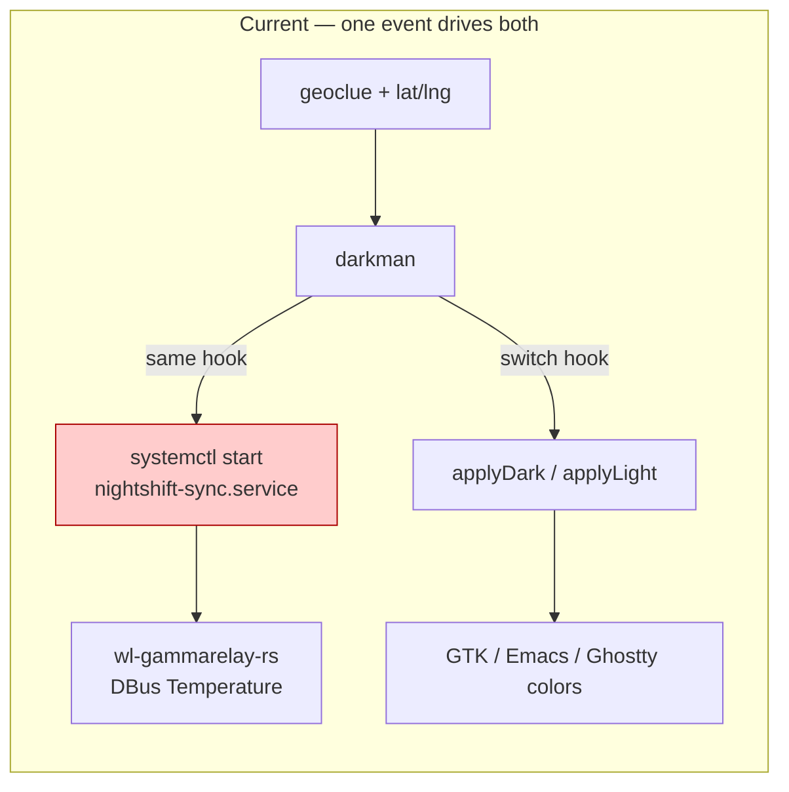
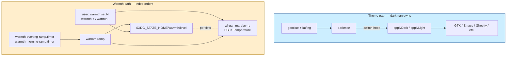
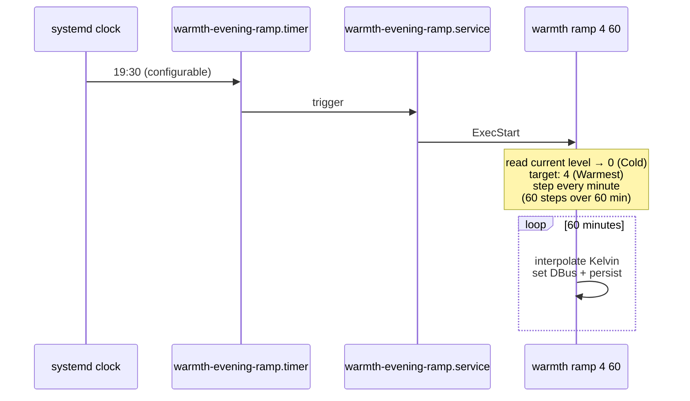

# Decouple dark theme from warm screen — design

Author: Claude (system-specialist)

Today the dark/light theme flip and the warm-screen (gamma temperature)
flip are bolted together in `services.darkman`'s switch hooks. A single
darkman event drives both, so triggering "dark mode" at 14:00 also
turns the screen warm — even when the user wants dark theme during
daytime without warmth, or when the warmth transition should be
gradual but the theme flip should be instant. The user lost time to
this mismatch repeatedly.

This report names the gap, lays out the new shape, and gives the
implementation a clear stopping point so a fresh-context agent can
pick it up.

Bead: `primary-8b6` (P2, owner: system-specialist).

---

## Today's coupling



Concretely (`CriomOS-home/modules/home/base.nix`):

```nix
darkModeScripts.switch = ''
  ${applyDark}
  systemctl --user --no-block start nightshift-sync || true
'';
```

The `nightshift sync` script (`profiles/min/default.nix:282-341`)
reads darkman's mode and snaps to `NIGHT=2700` or `DAY=6500` Kelvin
(with a short ~5-minute interpolation if already close). The user
wants:

1. Dark theme triggers must NOT trigger warm screen.
2. The warm-screen schedule is independent — its own clock, its own
   ramp.
3. A manual ladder so the user can set warmth out-of-band:
   `cold / cool / neutral / warm / warmest`.
4. The evening transition should ramp slowly (≥1 hour), not in 5
   minutes — the eye prefers the long ramp.

---

## Proposed shape



Two independent paths. They MAY share a clock (e.g. both timers
fire near sunset), but they don't share a code path. Triggering one
never triggers the other.

---

## The `warmth` ladder

Five named levels, persisted as a single integer 0..4:

| Level | Name | Kelvin |
|---|---|---|
| 0 | Cold | 6500 |
| 1 | Cool | 5500 |
| 2 | Neutral | 4500 |
| 3 | Warm | 3500 |
| 4 | Warmest | 2700 |

Persistence: `$XDG_STATE_HOME/warmth/level` — single file, single
integer, read on boot.

Commands:

| Command | What |
|---|---|
| `warmth get` | print current level + Kelvin |
| `warmth set <0..4>` or `warmth set <name>` | jump to a level |
| `warmth +` / `warmth -` | step up/down one |
| `warmth ramp <target> <minutes>` | interpolate from current to target Kelvin over the duration |

`warmth +` clamps at 4 (warmest); `warmth -` clamps at 0 (cold). All
forms update the persisted level *and* the DBus property in one go.

---

## Evening / morning ramp

Two systemd user timers + their oneshot services:



`warmth ramp` replaces the existing 5-minute `nightshift sync` ramp.
It's a plain shell loop: divide the Kelvin delta into N steps, sleep
60s between steps, update DBus + persist on each step. The morning
ramp is the same shape with target=0 instead of target=4.

The trigger times (`19:30` evening, `07:30` morning are reasonable
defaults) get exposed as a user-facing setting later — for the first
slice they're hardcoded.

---

## Implementation plan — five stops

1. **Write `warmth` shell binary**
   (`CriomOS-home/modules/home/profiles/min/default.nix`, near
   `nightshift`). Five commands as in the table above. Persists
   `$XDG_STATE_HOME/warmth/level`. Uses the existing
   `${busctlBin} --user ... ${gammaRelayBus} Temperature q <K>`
   pattern. Ladder mapping is a `case` over the five levels.

2. **Decouple darkman.** Remove
   `systemctl --user --no-block start nightshift-sync || true`
   from both `darkModeScripts.switch` and `lightModeScripts.switch`
   in `base.nix`. darkman now flips theme only.

3. **New systemd timers + services.**
   `warmth-evening-ramp.timer` (OnCalendar=`*-*-* 19:30:00`) +
   `warmth-evening-ramp.service` (ExecStart=`warmth ramp 4 60`),
   plus the symmetric morning pair (target=0). Both belong in
   `profiles/min/default.nix` alongside `wl-gammarelay-rs.service`,
   `After=wl-gammarelay-rs.service`. **Do not** add a
   `WantedBy=graphical-session.target` to the timer — see the
   archived 2026-04-26 zeus boot-cycle incident comment in the
   existing file (the timer wakes the system on its own clock, no
   target dependency needed).

4. **Boot-time apply.** A small `warmth-apply.service` that runs
   `warmth set $(cat $XDG_STATE_HOME/warmth/level)` on
   `graphical-session.target` so the persisted level survives
   reboot. Required because `wl-gammarelay-rs` starts at neutral
   each boot and the persisted state has to be re-applied.

5. **Retire `nightshift`.** Once `warmth ramp` is wired and the
   evening/morning timers are firing, the `nightshift` binary and
   its three services (`nightshift-sync`, `nightshift-on`,
   `nightshift-off`) are dead code. Remove them in the same commit.

The whole change touches two files
(`base.nix` and `profiles/min/default.nix`) and is mostly mechanical
once stop #1 is in place.

---

## State storage layout

```
$XDG_STATE_HOME/warmth/
└── level          # single line, integer 0..4, written by `warmth set`
```

The directory is created lazily (`install -d -m 700`). On first run
the level defaults to 2 (Neutral). The persisted file is the
*single source of truth*; the DBus property mirrors it.

---

## Open questions

These don't block the implementation but the user's preference
shapes the result. I'll pick reasonable defaults and the user can
flip them later.

1. **Trigger times — fixed or geoclue-derived?** Fixed (`19:30` /
   `07:30`) is simplest and works offline. Geoclue-derived
   (sunset/sunrise from the user's lat/lng, mirroring darkman's
   schedule) is more "just works." Default: fixed; promote to
   geoclue if the user wants location-following.
2. **Default ramp duration.** 60 minutes is the design intent. If
   that turns out too slow / too fast, it's a one-line change.
3. **Should `warmth ramp` cancel an in-flight ramp?** If the user
   manually sets a level mid-ramp, the ramp keeps stepping over
   them. Default: ramp respects the persisted level on each step
   start, so a manual `warmth set` mid-ramp interrupts smoothly.
4. **Notification on level change?** No, by default — silent. Levels
   are user-facing and visually obvious; mako notifications would
   be noise.

---

## What's *not* in scope here

- Theme-switching gradualness. darkman flips the theme atomically;
  this report doesn't touch that.
- A horizon-rs `WarmthSchedule` field. The first slice hardcodes
  times in the module; promoting to the cluster proposal is a
  follow-up if it stays useful.
- Brightness control. The `brightness` shell helper next to
  `nightshift` continues to work as-is.
- A daemon. The whole design is shell + systemd timers; no Rust,
  no long-running process beyond `wl-gammarelay-rs` (already
  there).

---

## Why this report exists

The user is about to compact context. After the compact, a fresh
agent picks up the implementation; this report is the durable
context. Everything needed to implement primary-8b6 is here:

- The current shape (file + line pointers).
- The proposed shape (module-arg-shaped, no new daemons).
- The `warmth` ladder + commands.
- The five implementation stops.
- The on-disk state layout.
- The four small judgment calls and what default to pick.

The bead `primary-8b6` carries the spec and the why; this report
carries the *how* and ties them together.

---

## See also

- bead `primary-8b6` — original task description (matches this
  report; this report supersedes the inline implementation hints
  there but keeps the bead as the canonical task tracker).
- `CriomOS-home/modules/home/base.nix` §services.darkman — the
  switch hooks to slim down (stop #2).
- `CriomOS-home/modules/home/profiles/min/default.nix` — where
  `nightshift`, `wl-gammarelay-rs`, and the new timers live.
- `~/primary/skills/system-specialist.md` §Just-do-it operations —
  the lock-bump-and-redeploy cascade applies after this lands.
- `~/primary/reports/system-specialist/2-voice-typing-recovery-design.md`
  — sibling design from this session; same prose+visuals shape.
