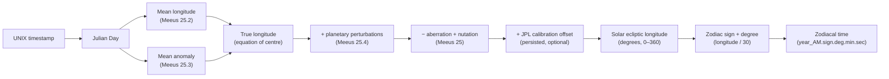
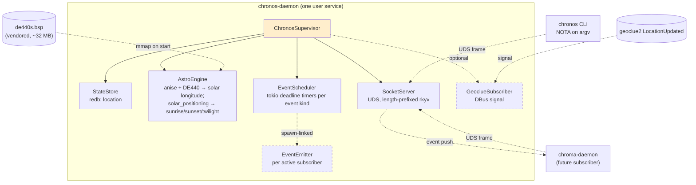
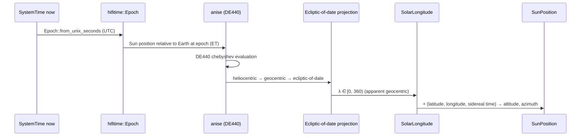
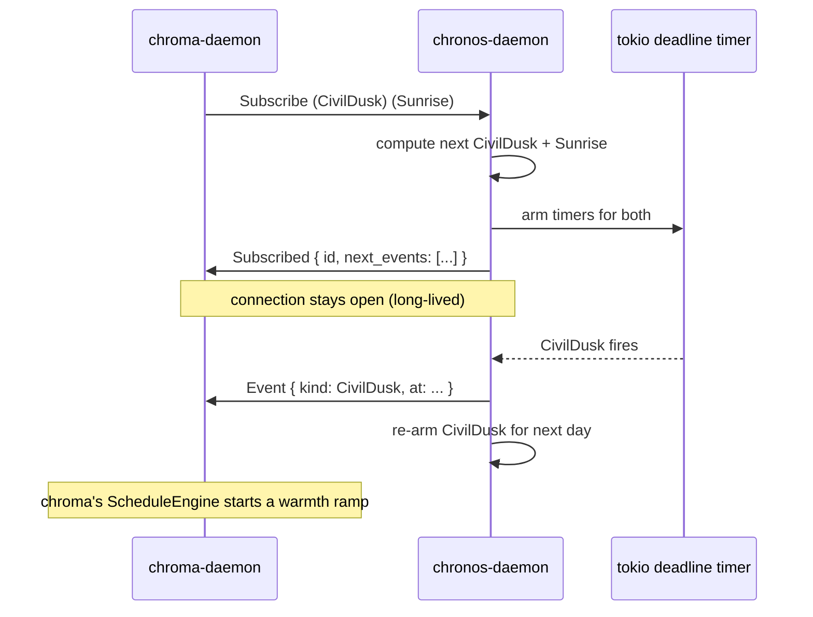

# Chronos — astral-time daemon

Author: Claude (system-specialist)

A 2025 prototype at `~/git-archive/chronos-lib--dev` already
computed the **ordinal solar time** — the sun's ecliptic
longitude expressed as `(AM year, zodiac sign, degree, minute,
second)` — using Meeus's *Astronomical Algorithms* (chapter 25)
plus an optional JPL Horizons calibration step. It is a
single-binary CLI; output is, e.g., `5919.4.15.30.45` for "year
5919 AM, in Cancer, 15°30'45"".

This report drafts a successor: **`chronos`**, a Rust daemon +
CLI in the same shape as chroma. It carries the prototype's
zodiacal-time computation forward, adds **location-based
solar-event queries** (civil dawn, sunrise, solar noon, sunset,
civil dusk), exposes **a subscription channel** so chroma's
schedule engine can react to those events without polling, and
keeps room for **astrological hooks** (ascendant, midheaven,
moon position) that the user has named as future scope.

The repo is `chronos` — Greek Χρόνος, *time*, not a typo for the
titan Kronos. Same single-user-per-machine shape as chroma:
group-controlled UDS in `/run/chronos/<uid>.sock`; per-user
systemd unit; one CLI binary as a thin signal client.

For the design conventions this follows, see
`reports/system-specialist/28-chroma-unified-visual-daemon.md`.

Bead: `primary-???` (P2, system-specialist) — to be created
when work begins.

---

## What the prototype already does



Capabilities the prototype ships:

- **Solar longitude** via Meeus formulas with planetary
  perturbations and a nutation correction (~arcsecond accuracy
  for civil-date applications).
- **Calibration** against NASA JPL Horizons API (`Quantity 31`,
  Earth-geocentric solar longitude). Persisted to
  `/tmp/mentci-chronos-calibration.json`.
- **Zodiacal projection**: 12 signs × 30 deg × 60 min × 60 sec.
- **Notation**: 1-based *ordinal* (Mentci's convention) vs
  0-based *standard* (astrology's convention).
- **AM calendar** (Anno Mundi): year increments at vernal
  equinox; base offset `+3893/+3894`. UNIX epoch lands at AM
  5863, Capricorn 11°10'13".
- **Output formats**: `version` (`v25.4.15.30`), `numeric`
  (`4.15.30.45 | 5919 AM`), `unicode` (`♋︎15°30'45"`), `am`
  (`5919.4.15.30.45`), `json`.
- **Precision levels**: sign / degree / minute / second.

What the prototype does *not* do:

- Latitude / longitude awareness — no sunrise, sunset, or
  twilight times.
- Persistent daemon — every `chronos` invocation re-evaluates
  from scratch.
- Push channel — consumers must poll.
- Subscription/event API — no way for chroma to be told
  "civil dusk is now."
- Group permission — runs as any user.
- Modern Rust shape (the prototype is `edition = "2021"`,
  `anyhow::Result`, no NOTA, no rkyv, no thiserror, no actor
  framework).

---

## Why a daemon, not just a CLI

Three reasons separate from "polling is forbidden":

1. **Ephemeris kernel cost.** Loading the DE440 file on
   every CLI invocation pays the mmap + index cost each time
   (~5–20 ms wall, even hot-cache). A daemon mmaps once at
   start and serves all queries from the in-memory toolkit;
   per-query cost drops to microseconds.
2. **Location.** Sunrise/sunset/twilight are
   latitude-and-longitude functions. The daemon owns the
   geoclue subscription (one process per machine, one zbus
   client) and answers location-bound queries from a held
   value. CLI calls are pure compute; no DBus traffic per
   invocation.
3. **Push.** Chroma's schedule engine wants to *react* to
   "civil dusk now"; chronos pushes when the deadline trips.
   See §"Subscription channel" below.

A single CLI invocation against an in-memory ephemeris is
~µs (anise's chebyshev evaluation is cheap once the kernel is
loaded). The *kernel hold + state* (DE440, location,
subscriber list) is what wants a daemon, not the *compute*.

---

## Naming

| Term | Meaning here |
|---|---|
| **Chronos** | The repo and daemon name. Greek *Χρόνος*. |
| **Zodiacal time** | Sun's ecliptic longitude expressed as (sign, degree, minute, second), with the AM year. The prototype's primary output. |
| **Ordinal solar time** | Same thing, in the user's preferred 1-based notation (Aries = sign 1, not 0). |
| **AM (Anno Mundi)** | Year-of-the-world calendar; year increments at vernal equinox. Year base 5863 = 1970 CE pre-equinox. |
| **Ephemeris** | A tabulation of celestial-body positions over time. The user's "compendium of data" — *this* word. The Swiss Ephemeris is the canonical software/data set. |
| **Civil twilight** | Sun 6° below the horizon (centre). Civil dawn is morning; civil dusk is evening. |
| **Solar noon (transit)** | Sun crosses the local meridian. Halfway between sunrise and sunset (within seconds, ignoring the equation of time). |
| **Ascendant (Asc)** | The ecliptic point rising on the eastern horizon at a given lat / lng / time. |
| **Midheaven (MC, Medium Coeli)** | The ecliptic point at the local meridian. |
| **Descendant (Desc)** | Opposite of Ascendant. |
| **Imum Coeli (IC)** | Opposite of Midheaven. |

The user has named the deferred-future scope as moon-on-the-MC,
zodiac houses, etc.; this design names them but ships only the
sun-focused subset.

---

## Library survey — what's actually in Rust (May 2026)

The prototype hand-rolled Meeus's chapter-25 series with a JPL
Horizons calibration step to compensate for the formulas'
~arcsecond drift. **Don't follow the prototype here** — the
Rust ecosystem has matured. Three crates carry the load
chronos needs, all pure Rust, all actively maintained, all
validated against authoritative references.

| Crate | Author | Purpose | Why it's the right fit |
|---|---|---|---|
| **`anise`** ([nyx-space/anise](https://github.com/nyx-space/anise)) | Nyx Space | NAIF SPICE replacement — reads `.bsp` ephemeris files, computes precise positions | Pure Rust. Reads JPL **DE440** directly. Validated against SPICE to **2e-16 (machine precision)** for translations. Bundles `de440s.bsp` (1900–2050 short-term, ~32 MB) and `de440.bsp` (long-term). Active development, > 0.9.x. |
| **`hifitime`** ([nyx-space/hifitime](https://github.com/nyx-space/hifitime)) | Nyx Space | Time scales (TAI, TT, ET, TDB, UTC, UT1, GPST, …) | Validated against NAIF SPICE — *zero nanoseconds* of disagreement on ET ↔ UTC after 1972. Leap-second-aware. Ships UT1 via JPL Earth-orientation download. Pairs with anise. |
| **`solar_positioning`** ([klausbrunner/solarpositioning-rs](https://github.com/klausbrunner/solarpositioning-rs)) | klausbrunner | NREL SPA + Grena3 sun position; topocentric coords + sunrise/sunset/twilight | Pure Rust port of NREL's reference SPA — the algorithm NOAA's Solar Calculator uses. **±0.0003°** accuracy, valid 2000–6000. Twilight at any horizon offset. Drop-in for civil-twilight queries. |

For comparison, the prototype's approach and the older Rust
options:

| Approach | Status | Verdict |
|---|---|---|
| Meeus-25 hand-rolled (the prototype) | ~arcsecond accuracy without calibration | Carries history; no longer needed. Replace with `anise`. |
| `astro` / `astro-rust` crates (Meeus ports) | Older, partial coverage | Skip — `anise` covers the same ground better. |
| `sunrise` crate (simple sunrise/sunset) | OK accuracy (~1 min) | `solar_positioning` is strictly better; pick that. |
| `spa` / `spa_sra` crates | Older NREL-SPA ports | `solar_positioning` is the modern one. |
| `swisseph` / `ephem-rs` (Swiss Ephemeris bindings) | C library, AGPL or paid | Right answer for moon + houses + planets in Phase 3. Skip in Phase 1. |
| Hand-roll IAU 2000 nutation, full VSOP87 | A weekend's work, brittle to maintain | Skip — `anise` already does this. |

### What this changes vs the prototype

- **No calibration step.** The prototype fetches JPL Horizons
  to correct Meeus drift; `anise` reading DE440 *is* the JPL
  ground truth. The `(Calibrate)` request and the
  `CalibrationRefresher` actor in the original draft drop out
  entirely.
- **No hand-rolled Meeus.** The Phase 1 implementation
  becomes `anise` + `solar_positioning`, not 150 lines of
  series expansion. The pipeline shrinks; the typed wrappers
  on top of it stay the same.
- **Time scales done right.** `hifitime` gives proper
  TAI/TT/UTC/UT1 distinctions, leap-second handling, and
  SPICE-grade ET ↔ UTC. The prototype's `chrono::Utc::now()`
  is fine for civil dates but fudges the few seconds between
  scales; `hifitime` makes that explicit.
- **Ephemeris file as build artifact.** `de440s.bsp`
  (~32 MB, covers 1900–2050) is vendored in the chronos
  flake — fetched once at build time, validated by content
  hash, materialised in the package's `share/` so the daemon
  loads it from a known path at startup. Out-of-band
  download paths (curl-on-first-run) are an anti-pattern; we
  ship deterministic builds.

### What still belongs in chronos itself

The astro-pipeline replacement leaves three layers entirely
ours:

1. **Domain model** — `ZodiacSign`, `ZodiacalTime`, `AmYear`,
   `Notation`, `SolarEvent`, `EclipticDegrees`, `JulianDay`
   newtype, `LocationSource`, etc. The shape that turns raw
   astronomical output into the user's calendar.
2. **Output formats** — `am`, `unicode`, `version`,
   `numeric`, `json`. The prototype's five formats stay, and
   land as methods on `ZodiacalTime`.
3. **AM calendar** — vernal-equinox-anchored year, base-year
   offset (`+3893`/`+3894`), version-relative-to-5919. The
   ordinal solar time the user has been using on their
   status bar. Keep verbatim.

The astro pipeline reduces to roughly:

```
hifitime::Epoch::from(now)
  → anise: Sun heliocentric position at epoch
  → ecliptic-of-date longitude  (project into ecliptic frame)
  → ZodiacSign + ZodiacalDegree + ArcMinute + ArcSecond
  → ZodiacalTime { am_year, sign, degree, minute, second }
```

For sunrise / sunset / civil-twilight at a configured
location, `solar_positioning::SunriseResult` (or its
`twilight_at_angle(-6.0)` API) computes the UTC instants
directly.

---

## Architecture



Same shape as chroma — small actor-flavoured topology, single
UDS, redb for persistent state, push-not-poll throughout. Two
optional actors (dashed) spawn only when needed:

- **GeoclueSubscriber** — only if location is set to
  `(Geoclue)` in config; otherwise skipped.
- **EventEmitter** — one per active subscriber connection;
  spawned by `EventScheduler` when a subscription is opened,
  dropped when the connection closes.

The astro engine loads `de440s.bsp` at startup (mmap'd by
`anise`, no parse cost on the hot path). All ephemeris queries
run against the in-memory toolkit; no per-query I/O.

---

## Domain types

| Type | Shape | Notes |
|---|---|---|
| `JulianDay` | `f64` newtype | `from_unix(SystemTime)`, `to_unix(self)`. The pivot type for all astro math. |
| `SolarLongitude` | `f64` newtype, range `[0, 360)` | Wraps modulo 360. `as_degrees`, `as_radians`. |
| `EclipticDegrees` | `f64` newtype, range `[0, 360)` | Generic over Sun/Moon/etc.; `SolarLongitude` is `EclipticDegrees<Sun>` if we want the marker, or just a distinct alias for now. |
| `ZodiacSign` | enum `{ Aries, Taurus, …, Pisces }` (12 unit variants) | `as_str` for English name, `as_unicode` for symbol (`♈︎` …`♓︎`), `from_longitude(SolarLongitude)`. |
| `ZodiacalDegree` | `u8`, `[0, 30)` | Within-sign degree. |
| `ArcMinute` | `u8`, `[0, 60)` | |
| `ArcSecond` | `u8`, `[0, 60)` | |
| `Notation` | enum `{ Ordinal, Standard }` | 1-based vs 0-based. Default `Ordinal` (matches Mentci convention; the prototype's default). |
| `ZodiacalTime` | `{ am_year: AmYear, sign: ZodiacSign, degree: ZodiacalDegree, minute: ArcMinute, second: ArcSecond }` | The 5-tuple. |
| `AmYear` | `i32` newtype | Anno Mundi year. `from_unix_via_equinox`. |
| `Latitude` | `f64` newtype, range `[-90, 90]` | Clamped at construction. |
| `Longitude` | `f64` newtype, range `[-180, 180]` | Same. |
| `GeoLocation` | `{ latitude: Latitude, longitude: Longitude }` | The pair. |
| `LocationSource` | enum `{ Static(GeoLocation), Geoclue, LastKnown(GeoLocation) }` | Where the daemon got its current location. |
| `SolarEvent` | enum `{ CivilDawn, Sunrise, SolarNoon, Sunset, CivilDusk, AntiTransit }` | The horizon-and-meridian events the daemon tracks. |
| `EventInstant` | `{ kind: SolarEvent, at: SystemTime }` | A scheduled event firing. |
| `SunPosition` | `{ altitude: AltitudeDegrees, azimuth: AzimuthDegrees }` | The sun's instantaneous horizon-frame coordinates. |
| `AltitudeDegrees` | `f64` newtype, range `[-90, 90]` | |
| `AzimuthDegrees` | `f64` newtype, range `[0, 360)` | |
| `Request`, `Response`, `Error` | per chroma's pattern | rkyv on wire; NOTA on argv. |

Per-axis types kept small; verbs attached as methods. No free
functions outside `main`.

---

## CLI — NOTA on argv

| Invocation | Effect |
|---|---|
| `chronos '(Now)'` | Current zodiacal time at second precision |
| `chronos '(Now Sign)'` | Current sign only (`Cancer`) |
| `chronos '(Now Degree)'` | Current sign + within-sign degree (`Cancer 15`) |
| `chronos '(At <unix-seconds>)'` | Zodiacal time at a specific moment |
| `chronos '(Format Am)'` | Default format = `5919.4.15.30.45` |
| `chronos '(Format Unicode)'` | `♋︎15°30'45"` |
| `chronos '(Format Version)'` | `v25.4.15.30.45` (AM-base relative) |
| `chronos '(Format Json)'` | JSON record |
| `chronos '(SunLongitude)'` | Current ecliptic longitude in degrees (raw f64) |
| `chronos '(SunPosition)'` | Altitude + azimuth right now |
| `chronos '(Today)'` | Today's solar events (dawn / sunrise / noon / sunset / dusk) at the configured location |
| `chronos '(NextEvent)'` | The next upcoming event |
| `chronos '(Event Sunset)'` | When today's sunset is (or tomorrow's, if past) |
| `chronos '(EventOnDate Sunrise (Date 2026 6 21))'` | Sunrise on a specific date |
| `chronos '(GetLocation)'` | The current location and its source |
| `chronos '(SetLocationStatic <lat> <lng>)'` | Set a fixed location, persisted in redb |
| `chronos '(SetLocationGeoclue)'` | Switch to live geoclue subscription |
| `chronos '(Subscribe (CivilDusk) (Sunrise) …)'` | (long-lived) subscribe to event pushes |

Same NOTA-on-argv shape as chroma; same rkyv-on-UDS frame
contract. The Subscribe verb is the one variant that holds the
connection open and pushes Event frames; everything else is
one-shot.

Output as NOTA records:

- `(ZodiacalTime 5919 4 15 30 45)`
- `(SolarLongitude 105.123456)`
- `(SunPosition 42.3 215.7)`
- `(Today (Events (Event CivilDawn …) (Event Sunrise …) …))`
- `(Event Sunset (At 1746715380))`
- `(Location (Static 36.7 -4.4))`

The CLI's `--format` switch (carried from the prototype) gates
the human-vs-machine projection; default is NOTA. Status-bar
users can ask for `unicode` or `version`:

```sh
chronos '(Now)' --format unicode
# ♋︎15°30'45" | 5919 AM

chronos '(Now Degree)' --format version
# v25.4.15
```

---

## Astronomical pipeline

### Solar position via anise + DE440



The whole pipeline is `anise` calls + small post-processing.
No hand-rolled series, no calibration loop, no JPL Horizons
HTTP. The output matches DE440 (which is what JPL Horizons
itself serves) to numerical precision.

### Sunrise / sunset / twilight via solar_positioning

For a given date and `(latitude, longitude)`:

| Event | Sun altitude (centre) at trigger |
|---|---|
| `CivilDawn` | −6° (rising) |
| `Sunrise` | −0.833° (rising; accounts for refraction + half-disc) |
| `SolarNoon` | meridian transit (max altitude) |
| `Sunset` | −0.833° (setting) |
| `CivilDusk` | −6° (setting) |

`solar_positioning` exposes both `SPA::sunrise_sunset(...)` for
the standard −0.833° crossings and `SPA::twilight(angle)` for
arbitrary horizon offsets including civil twilight at −6°. The
crate handles polar-night / midnight-sun (returns
`AllDay`/`AllNight` variants we forward as `None` in the
typed Response).

The choice of NREL SPA (over alternative algorithms in the
same crate, e.g. Grena3) is for the precision: ±0.0003°
versus ~0.01° for the simpler form. SPA's compute cost is
sub-millisecond per query — irrelevant on chronos's call
volume.

### What's NOT in this pipeline

- **No calibration step.** anise reading DE440 is already the
  reference — there's nothing to calibrate against that's
  more authoritative.
- **No JPL Horizons HTTP fetch.** The data is local. The
  daemon works offline.
- **No hand-rolled Meeus.** Two well-validated crates carry
  the load.

---

## Subscription channel



Wire shape:

- **Frame envelope** is the same length-prefixed rkyv archive
  as one-shot requests; the connection just doesn't close
  after the first reply.
- The `Subscribe` request returns `Subscribed { id, … }`
  immediately. Subsequent frames on the connection are `Event`
  records, one per fire.
- A subscriber unsubscribes by closing the connection. The
  daemon drops the per-subscriber `EventEmitter` actor on
  socket EOF.
- Pairing model: matches signal's "by-position FIFO" rule
  (`reports/system-specialist/28-...md` §"IPC shape"). The
  initial Subscribe→Subscribed pair is one round-trip;
  subsequent Event frames are one-way pushes.

This unblocks chroma's design: chroma's `ScheduleEngine` opens
one subscription per axis trigger that needs a sun event, and
the chroma daemon's geoclue subscription becomes unnecessary
(chronos owns geoclue; chroma asks chronos).

**Carve-out for the first slice:** subscriptions ship in
**Phase 2** (see Implementation plan §). The first slice is
one-shot CLI queries only. Chroma keeps its own eventually-
geoclue plan until subscriptions land in chronos.

---

## Persistence

`$XDG_STATE_HOME/chronos/state.redb` — one redb file, one row
in one table, rkyv-archived:

| Table | Key | Value |
|---|---|---|
| `location` | fixed slot `current` | `LocationSource` |

Small, low-write. Read on boot, written on configuration
change. Same shape as chroma's persistence. The DE440
ephemeris is read-only build artefact, not persistent state.

---

## Group permission

Same pattern as chroma:

- `users.groups.chronos = {};` declared by CriomOS.
- `systemd.tmpfiles.rules` creates `/run/chronos/` mode `0770`
  `root:chronos`.
- `users.users.<name>.extraGroups` adds `chronos` for users
  who should be allowed to use chronos. Auto-granted to edge
  users (per the chroma precedent), or to any user — chronos
  works without a graphical session, so the `behavesAs.edge`
  gate may be too narrow. **Open question** below.
- The daemon binds `/run/chronos/<uid>.sock` mode `0600`;
  group access via the parent directory.

The daemon binary lives in home-manager (per-user service);
the group declaration + tmpfiles in CriomOS. Same split as
chroma.

---

## Implementation plan

### Phase 1 — sun-only, one-shot CLI (the first repo)

1. **New repo `chronos`** under
   `/git/github.com/LiGoldragon/chronos/`. One Cargo crate with
   `[lib]` + `[[bin]] chronos` + `[[bin]] chronos-daemon`.
   Flake with crane + fenix; deps: `anise`, `hifitime`,
   `solar_positioning`, `nota-codec`, `rkyv`, `tokio`,
   `zbus`, `redb`, `thiserror`.
2. **Vendor `de440s.bsp`** as a flake input (fixed-output
   derivation with a content hash). Resolves to a known store
   path at build time; the daemon reads from
   `${chronos.bsp}/de440s.bsp` baked into the binary's
   environment. No runtime download.
3. **Domain types and error enum.** `JulianDay`,
   `SolarLongitude`, `ZodiacSign`, `ZodiacalTime`, `AmYear`,
   `Latitude`, `Longitude`, `GeoLocation`, `SolarEvent`,
   `SunPosition`, `Notation`, `Error`. NOTA derive on the
   request/response types; rkyv on the wire types. Round-trip
   tests.
4. **Astro pipeline thin shim.** A small `astro` module that
   wraps `anise` for solar-longitude queries and
   `solar_positioning` for sunrise/sunset/twilight. The
   public API is methods on the typed nouns
   (`SolarLongitude::at(epoch, &kernel)`,
   `SolarEvent::next(after, location, &kernel)`); the crate
   shims live behind that.
5. **Zodiacal projection + AM year + output formats.** Lift
   the prototype's domain logic only — `ZodiacSign::from_longitude`,
   `ZodiacalTime::from_longitude`, `AmYear::from_unix_via_equinox`,
   and the five `--format` projections (`am`, `unicode`,
   `version`, `numeric`, `json`). Each lands as methods on
   the right type. Tests: round-trip the prototype's
   reference output `5863.10.11.10.13` at `--unix 0` so we
   stay bit-exact compatible with the user's existing
   status-bar layout.
6. **Sun position transform.** `solar_positioning` already
   gives topocentric altitude + azimuth; expose it as
   `SunPosition::at(epoch, location, &kernel)`.
7. **`chronos-daemon`** — UDS server, dispatch for the
   one-shot verbs. Plain async functions, no ractor (matching
   chroma's first-slice shape). Loads the DE440 kernel once
   at start.
8. **`chronos` CLI** — NOTA argv parser, rkyv frame writer,
   reply printer with the `--format` switch.
9. **redb StateStore** for location only. (No calibration —
   anise + DE440 doesn't need it.)

Stop 9 leaves the first repo at:

- One-shot `(Now)`, `(At …)`, `(Today)`, `(Event …)`,
  `(SunPosition)` queries against a configured static
  location. No subscriptions, no geoclue, no chroma hookup
  yet.

### Phase 2 — push subscriptions + chroma hookup

10. **EventScheduler actor** — compute the day's events from
    the configured location, arm tokio deadline timers, emit
    Event frames to subscribers when each fires.
11. **Subscribe wire form** — long-lived UDS connections,
    Event frames pushed asynchronously.
12. **GeoclueSubscriber actor** — DBus signal subscription;
    chronos becomes the single geoclue consumer in the
    workspace.
13. **chroma integration** — chroma-daemon opens a
    subscription to chronos at boot (per axis schedule that
    has civil-twilight triggers). The CivilDawn / CivilDusk /
    Sunrise / Sunset triggers in chroma's `RampTrigger` enum
    resolve via chronos events instead of a local geoclue
    subscription.

### Phase 3 — astrology hooks (deferred, but named)

14. **Ascendant + Midheaven** queries — Meeus chapter 13.
15. **Moon position** — VSOP87 lunar terms or Swiss Ephemeris.
16. **Houses** (Placidus / Equal / Whole-Sign) — Meeus
    chapter 13 or Swiss.
17. **Other planets** — Swiss Ephemeris becomes worth pulling
    in here; the `swisseph` Rust binding crate or fresh
    bindings.

Phase 3 is named so the design holds room for it; not part of
the current commit.

### Phase 4 — CriomOS integration

18. CriomOS adds `users.groups.chronos = {};` +
    `tmpfiles.rules`.
19. CriomOS-home adds `chronos` flake input + per-user
    systemd unit + default config.

Same shape as the chroma integration that just landed.

---

## What's NOT in scope (Phase 1)

- **Moon, planets, asteroids** — sun only. Lunar position
  alone is moderately involved (VSOP87-D lunar series or
  Meeus chapter 47). Defer until subscriptions ship and the
  daemon's compute habits are settled.
- **Houses** — Ascendant / Midheaven sketched in Phase 3;
  Placidus / Koch / Whole-Sign etc. deferred.
- **Sidereal vs tropical zodiac** — the prototype is
  tropical (vernal equinox = 0° Aries); this design follows.
  Sidereal mode is a flag for a future commit.
- **Time zones beyond UTC** — chronos works in UTC
  internally and outputs UTC instants; the CLI may render
  with the user's locale time zone but the wire is UTC.
- **Historical-date precision** — Meeus's algorithms are
  good for centuries around 2000; very ancient dates
  (BCE millennia) drift. Outside scope.
- **A web UI / status bar widget** — the CLI's
  `--format unicode | --format version` output is the
  status-bar interface. Widgets that consume it live in
  CriomOS-home (user's existing waybar / noctalia config).
- **GPS hardware** — geoclue is the only location source;
  /dev/gps* not consulted directly.

---

## Open questions

These don't block the design; reasonable defaults exist.

1. **Default location.** Prototype has `lat = 36.7, lng =
   -4.4` hardcoded for darkman. For chronos, default to
   `(LocationSource Geoclue)` with a fallback to
   `(LocationSource Static …)` when geoclue is unavailable
   for >5 minutes after boot. The fallback's coordinates are
   the user's last-known geoclue fix, persisted to redb.
2. **chronos group membership.** Auto-grant to edge users
   only (matching chroma), or to all users? Sun events are
   meaningful even without a graphical session (e.g.
   scripts that run at sunset). Recommend auto-granting more
   broadly — `behavesAs.atLeastMin` rather than
   `behavesAs.edge`.
3. **DE440 vs DE440s.** `de440s.bsp` is the short-term file
   (1900–2050, ~32 MB). `de440.bsp` is long-term (~115 MB,
   spans much wider time range). For status-bar use plus
   civil-time scheduling we never need pre-1900 or post-2050
   support; **default to `de440s.bsp`**. If a user query
   ever lands outside its range, the daemon errors with a
   typed `OutOfEphemerisRange` and the user can pull in the
   long-term file.
4. **AM year base.** Prototype uses base 5919 (so version
   format relative to that year). For 2026 onward this gives
   `v25.x.x.x.x`. Carry forward.
5. **Subscription retention across daemon restart.** When
   `chronos-daemon` restarts (NixOS rebuild, manual restart),
   subscribers' connections drop. They must reconnect.
   Document this; chroma's `ScheduleEngine` should reconnect
   automatically on UDS error. No persistence of the
   subscriber list.
6. **What does `(Today)` mean across midnight?** Returns
   today's events in the configured location's local
   solar-day, not the calendar date. After local midnight
   the sun's events for tomorrow's calendar date roll in
   smoothly. Document edge cases.
7. **Crate-pin strategy.** `anise` is at 0.9.x, still
   pre-1.0 — pin a specific commit / version in
   `Cargo.toml` and bump deliberately. Same for
   `solar_positioning` (smaller crate, but still). `hifitime`
   is at 4.x and stable.

---

## See also

- `~/git-archive/chronos-lib--dev` — the 2025 prototype
  (~450 lines of single-binary Rust). Source of the
  zodiacal-time projection, the AM calendar shape, and the
  five output formats this design carries forward. Its
  hand-rolled Meeus pipeline and JPL Horizons calibration
  are *not* carried forward — `anise` + DE440 supersedes
  both.
- `anise` — [github.com/nyx-space/anise](https://github.com/nyx-space/anise)
  (Nyx Space). Pure-Rust SPICE replacement; reads JPL DE440
  directly; validated against SPICE to machine precision.
- `hifitime` — [github.com/nyx-space/hifitime](https://github.com/nyx-space/hifitime).
  Pairs with anise; SPICE-validated time scales.
- `solar_positioning` — [github.com/klausbrunner/solarpositioning-rs](https://github.com/klausbrunner/solarpositioning-rs).
  NREL SPA + Grena3 in pure Rust; ±0.0003°.
- `reports/system-specialist/28-chroma-unified-visual-daemon.md`
  — the chroma daemon design. Chronos follows the same
  conventions: per-user UDS, group permission, NOTA on argv,
  rkyv on wire, redb for persistent state, push-not-poll.
- `~/primary/skills/rust-discipline.md` — the Rust style this
  design assumes (methods on types, errors as enum, ractor
  for stateful components when complexity warrants, redb +
  rkyv).
- `~/primary/skills/push-not-pull.md` — the discipline that
  motivates the subscription channel.
- `~/primary/skills/micro-components.md` — why chronos is its
  own repo rather than a chroma submodule.
- `~/primary/repos/lojix-cli` — canonical "single NOTA
  request on argv" CLI shape.
- `~/primary/repos/signal` — the rkyv-on-UDS frame contract.
- `lore/rust/ractor.md` — actor template if/when chronos's
  internal complexity grows past the chroma-style flat
  task model.
- *Astronomical Algorithms* (Jean Meeus, 1991, 2nd ed. 1998)
  — still the reference text the prototype derived from.
  Useful for understanding what `anise` and
  `solar_positioning` are doing under the hood; not a
  dependency we're pulling in.
- NOAA Solar Calculator
  (https://gml.noaa.gov/grad/solcalc/) — uses NREL SPA
  itself; independent cross-check for our `solar_positioning`
  output.
- JPL Horizons system
  (https://ssd.jpl.nasa.gov/horizons/) — the calibration
  source the prototype used; supplanted in this design by
  `anise` reading DE440 directly. Still useful as a manual
  cross-check during implementation.
- Swiss Ephemeris (https://www.astro.com/swisseph/) — the
  canonical software ephemeris for full astrology; Phase 3
  may pull in `ephem-rs` (experimental Swiss bindings) or
  bind directly when moon and houses ship.
