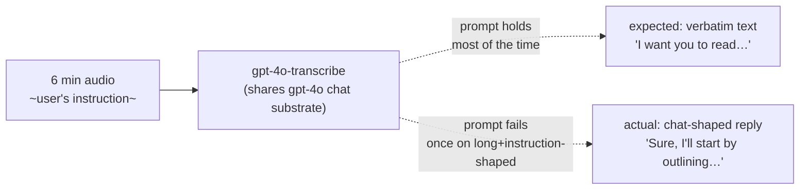
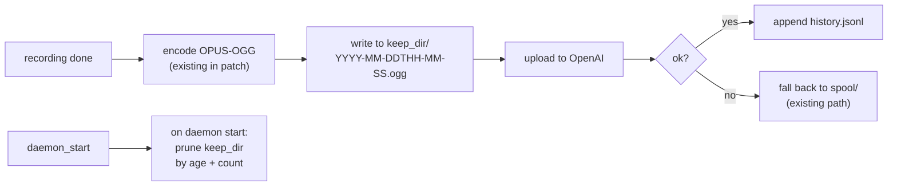

# Whisrs feedback — diagnosis, model question, and five proposed
# improvements

Date: 2026-05-08
Author: system-specialist

A session-driven report covering one observed failure (a transcript
that read as an LLM acknowledgment instead of a verbatim transcription)
and five surface improvements: model choice, customisable prompt /
vocabulary, audio retention, recopy-from-history, and the WezTerm
clipboard friction noticed while debugging the missing transcript.

---

## 1 — What happened on the 16:21–16:27 recording

The journal shows a normal six-minute capture (`5_779_429` samples,
`11_558_902`-byte WAV, no errors). The OpenAI REST call returned
1358 chars. The text now in `~/.local/share/whisrs/history.jsonl` is:

> *"Sure, I'll start by outlining the key tasks from your request:
> 1. **Review and Document Recent Changes** — Analyze recent
> changes in the operator. … 2. **Lore Repository Review and
> Migration** — Review the lore repository. Fix path issues
> for new agents to access it properly. …"*

Per the user's correction during the session, the model **heard
the user's actual speech** (their voice, on their Bluetooth mic —
default source confirmed `bluez_input.04:A8:5A:0B:EB:B0`, not a
loopback) and **responded to it** as an assistant would acknowledge
an instruction, instead of transcribing it. Same content, wrong shape.

This is **role-drift**: `gpt-4o-transcribe` shares the gpt-4o chat
substrate, and the boundary between "transcribe this audio" and
"respond to this audio" is held by the system prompt + the API's
`/v1/audio/transcriptions` endpoint contract — not by an
architectural separation. Most of the time the prompt holds.
Occasionally (especially with long, instruction-shaped audio) the
model decides the audio is a chat turn and produces a chat-shaped
reply that uses the heard content as input.

Known behaviour of the gpt-4o-class transcription models. Rare in
practice, but the failure mode exists.



The audio that would let us replay this is gone — the
`spool-recovery.patch` only spools audio when transcription
**fails** (returns an error). Successful uploads with bad
transcripts leave no recoverable WAV. (Proposal §4 below fixes
this.)

## 2 — What is Whisper, and is it actually weaker

Both models live in OpenAI's `/v1/audio/transcriptions` endpoint
under the same API key. No vendor change; no account change.

| Model | Architecture | Role-drift | `vocabulary`/`prompt` adherence | English accuracy |
|---|---|---|---|---|
| `whisper-1` | Pure seq-to-seq audio→text (Sept 2022) | **Architecturally impossible** — no chat substrate | Lower (accepts only `prompt` as a text primer; no separate `vocabulary`) | Excellent for English |
| `gpt-4o-mini-transcribe` | gpt-4o-mini with audio input | Possible but rarer than the full model | Good — respects `prompt` and `vocabulary` | Excellent |
| `gpt-4o-transcribe` (current) | gpt-4o with audio input | Possible — what hit you today | Strongest — best `vocabulary` adherence | Excellent |

The "weaker" framing in the live chat was sloppy. Whisper is **not
weaker overall** — it's only weaker at honouring a `vocabulary`
list and a system prompt. For dictation in English with technical
workspace terms, Whisper-1's actual accuracy is fine; the technical
terms get rendered phonetically when they're not in its training
distribution, and the `stt-interpreter.md` skill exists precisely
to recover from that.

**Recommendation**: try `gpt-4o-mini-transcribe` next. Smaller chat
substrate makes role-drift less likely; vocabulary adherence
preserved. If it drifts again, fall back to `whisper-1`.

The change is one line in
`~/primary/repos/CriomOS-home/modules/home/profiles/min/dictation.nix:82`:

```nix
model = "gpt-4o-transcribe"  →  model = "gpt-4o-mini-transcribe"
```

## 3 — Customising the prompt and vocabulary

The system prompt and the `vocabulary` list are **already
configurable**, both live at
`modules/home/profiles/min/dictation.nix:71–72`:

```nix
vocabulary = ["Codex", "Claude", "CriomOS", "Niri", "Colemak",
              "OpenAI", "gopass", "whisrs", "Hyprvoice"]
prompt = "Transcribe spoken English as dictated text.
          Preserve technical names from the vocabulary.
          Do not translate."
```

Two things hurt ergonomics today:

1. The list is short (9 entries) compared to the workspace's
   vocabulary, which has dozens of project / repo / library
   names — see `~/primary/skills/stt-interpreter.md`.
2. Editing requires a home-manager rebuild + service restart.

**Proposal — split into two changes:**

**3a. Expand the default vocabulary now.** Pull the canonical names
from `stt-interpreter.md` and `RECENT-REPOSITORIES.md`. Worth seeding:

```
Codex, Claude, CriomOS, Niri, Colemak, OpenAI, gopass, whisrs,
Hyprvoice, chroma, chronos, Nexus, Nota, persona, Sema, Criome,
Goldragon, Ouranos, Prometheus, Hexis, Lojix, Horizon, Forge,
Prism, Arca, ASCII, lore, signal, rkyv, ractor, tokio, thiserror,
fenix, crane, blueprint, redb, anise, hifitime, solar-positioning,
Jujutsu, jj, Dolt, beads, Linkup, Substack, ghostty, WezTerm,
geoclue, wl-gammarelay, ignis
```

That's ~50 entries — well within the prompt's token budget. Single
nix-module edit.

**3b. Make the prompt user-editable without a full rebuild.** Two
sub-options:

- *Lighter:* lift the prompt + vocabulary into `mkOption`s on the
  dictation module so they're override-points in the home config.
  Editing still needs a rebuild but only of one tiny module.
- *Heavier:* read a user-editable file (e.g. `~/.config/whisrs/
  prompt.txt`, `~/.config/whisrs/vocabulary.txt`) on whisrs
  startup; the wrapper script merges them into the generated
  `config.toml`. No rebuild needed for tweaks; nix is still the
  source of defaults.

I lean toward the heavier option — STT prompt-tuning is iterative
and a rebuild-per-tweak is friction we'll feel.

## 4 — Keep all audios, not just failures

`packages/whisrs/spool-recovery.patch` writes audio to
`$XDG_STATE_HOME/whisrs/spool/` **only on transcription failure**.
After a successful upload the audio is discarded — no replay
possible when the transcript is bad-but-non-error (today's case).

**Proposal — always-spool with retention.**

New config knobs in `whisrs/config.toml`:

```toml
[audio]
keep_recordings = true          # default false
keep_dir = "$XDG_STATE_HOME/whisrs/recordings"
keep_max_days = 30              # auto-prune
keep_max_count = 200            # safety cap
```

Implementation outline (a small patch on top of
`spool-recovery.patch`):



**Storage**: 6-min OPUS at 24 kbit/s ≈ 1.1 MB. Heavy days (10+
recordings) cap at ~10 MB/day, ~300 MB/month before pruning.
Manageable.

**Cross-reference with history**: each `history.jsonl` entry could
gain a `recording_path` field that points at the kept audio. Then
the recopy command (§5) and a future `whisrs replay <id>` become
trivial.

## 5 — Recopy past transcripts to clipboard

Today there's `whisrs log -n N` (prints recent transcripts) and a
private `~/.local/share/whisrs/history.jsonl` (machine-readable),
but no command to **put a past transcript on the clipboard**. That's
the gap that pushed you to `cat history.jsonl` and manual selection
copying — which then ran into the WezTerm issue (§6).

**Proposal — new subcommand:**

```sh
whisrs copy                  # last transcript to clipboard
whisrs copy --index N        # Nth from latest (1 = last)
whisrs copy --search 'foo'   # most recent matching
```

Tiny patch — the daemon already reads `history.jsonl`, the
clipboard primitive already exists (`copy_text_to_clipboard`).
Wire a new `Command::CopyHistory { index | search }` variant
through the existing IPC enum and add a CLI subcommand.

Optional: a `--print` mode that prints the entry to stdout
instead of clipboard, for piping.

## 6 — Why the clipboard didn't have today's transcript

`packages/whisrs/transcript-recovery.patch` adds
`copy_transcript_to_clipboard(&text).await` *before* the
keyboard/clipboard branch. It runs for **every** successful
transcription, regardless of mode. So the daemon should have
written the agent-shaped transcript to clipboard at 16:27:25.

Verification status:

- **Journal check (this session)**: no `warn!` lines for clipboard
  failures in the period 14:00 onward. The daemon logs warns to
  journald at `RUST_LOG=whisrs=info,warn`. So the clipboard write
  either succeeded or was never reached.
- **Patch presence**: `default.nix` lists `transcript-recovery.patch`
  in the patch set; the running build hash
  `c4f57jv3zpglv0yrzq72yc2vg1h223kr-whisrs-0.1.11` matches what
  the home-manager generation produced. So the patch is applied.

Most likely path:

```
16:27:25  daemon writes transcript to wl-clipboard      [silent succeed]
16:28+    user reads chat, realizes transcript is wrong
~16:28    user opens cat / runs commands; mouse-selects in WezTerm
          → primary selection updates; clipboard MAY have been
            clobbered by intervening copy actions
~16:28    `SpoolDrop -` and `SpoolList` issued; spool was empty
          (transcription was successful; nothing to spool)
```

The "selection clobbers clipboard" path is the most plausible.
Wayland's wl-clipboard is single-slot per source; any subsequent
explicit copy displaces the daemon's earlier write. If you opened
another terminal, ran `cat`, selected anything, that's plausibly
the clobber.

**To verify next time it happens**: immediately after the bad
transcript and before any other action, run `wl-paste` and see
whether the bad transcript is there. If yes → the patch is fine,
the clobber theory holds. If no → something is wrong on the
daemon's clipboard path.

The §4 (keep audios) and §5 (recopy from history) proposals
together remove the urgency of this single-slot clipboard issue —
recovery doesn't depend on the clipboard being preserved across
window switches.

## 7 — WezTerm clipboard friction

Three observations from the session:

a. **No right-click context menu.** WezTerm doesn't ship one. The
   default mouse binding for right-click is **paste primary
   selection**, not "open menu". To get a context menu you'd
   render one in lua; there is no built-in.

b. **Ctrl+Shift+C didn't work.** WezTerm's defaults bind
   `CTRL+SHIFT+C → CopyTo("Clipboard")`. Niri does **not** bind
   `Ctrl+Shift+C` (`niri.nix` has no overlap — only `Mod+…`
   variants). So Niri is not stealing the keystroke. The most
   likely cause is **the selection was no longer present** at the
   moment the keystroke registered (focus change, accidental
   click, or the selection was already cleared). Less likely but
   possible: the wezterm.lua override bind chain (currently empty)
   is somehow broken in the rebuild.

c. **Had to inject primary selection manually.** Selecting in any
   X11/Wayland terminal puts text on `PRIMARY` automatically.
   Going from PRIMARY → CLIPBOARD requires either Ctrl+Shift+C
   (didn't work for you) or `wl-paste -p | wl-copy`.

**Proposal — tighten WezTerm config.**

In `~/primary/repos/CriomOS-home/modules/home/profiles/min/default.nix`
under the existing `wezterm = { extraConfig = … }` block, add:

```lua
-- Drag-select copies to BOTH primary and clipboard simultaneously.
-- Removes the "Ctrl+Shift+C didn't work" failure path entirely.
mouse_bindings = {
  {
    event = { Up = { streak = 1, button = "Left" } },
    mods = "NONE",
    action = wezterm.action.CompleteSelection "ClipboardAndPrimarySelection",
  },
  {
    event = { Up = { streak = 2, button = "Left" } },
    mods = "NONE",
    action = wezterm.action.CompleteSelection "ClipboardAndPrimarySelection",
  },
  {
    event = { Up = { streak = 3, button = "Left" } },
    mods = "NONE",
    action = wezterm.action.CompleteSelection "ClipboardAndPrimarySelection",
  },
  -- Right-click pastes from clipboard (more useful than primary
  -- once the above puts the selection on clipboard anyway).
  {
    event = { Down = { streak = 1, button = "Right" } },
    mods = "NONE",
    action = wezterm.action.PasteFrom "Clipboard",
  },
},

-- Belt-and-suspenders: also bind Ctrl+Shift+C/V explicitly so
-- the bind exists in declared form even if defaults shift.
keys = {
  { key = "c", mods = "CTRL|SHIFT", action = wezterm.action.CopyTo "Clipboard" },
  { key = "v", mods = "CTRL|SHIFT", action = wezterm.action.PasteFrom "Clipboard" },
},
```

The `mouse_bindings` change alone removes the bug path: drag-select
→ on-clipboard is automatic, no key step. WezTerm now matches
Ghostty's copy-on-select behaviour.

The right-click change converts WezTerm's right-click from
"paste-primary" to "paste-clipboard"; less surprising once
selections also go to clipboard.

**Right-click context menu**: not in scope. WezTerm doesn't ship
one. If desired, a lua-rendered overlay menu is buildable later;
for now, copy-on-select + Ctrl+Shift+C remove most reasons to
want a menu.

## 8 — Summary of proposed changes

| # | What | Where | Size | Confidence |
|---|---|---|---|---|
| 2 | Switch model to `gpt-4o-mini-transcribe` | `dictation.nix:82` | 1-line | High |
| 3a | Expand default `vocabulary` to ~50 workspace terms | `dictation.nix:71` | ~5-line | High |
| 3b | User-editable prompt/vocabulary override file | `dictation.nix` + wrapper script | ~30-line | Medium (real shape change) |
| 4 | Keep all audios with retention | New patch on top of `spool-recovery.patch` | ~80-line patch | Medium |
| 5 | `whisrs copy` subcommand | New patch | ~50-line patch | High |
| 7 | WezTerm copy-on-select + explicit binds | `default.nix` wezterm block | ~20-line | High |

Quick wins (1-line, ~5-line, ~20-line edits) land first; the
upstream-patch items (3b, 4, 5) follow as a single cohesive change
since they share the daemon's IPC + config surface.

## See also

- `~/primary/skills/stt-interpreter.md` — workspace vocabulary
  source for §3a; the existing convention for recovering from
  STT mishearings.
- `~/primary/repos/CriomOS-home/modules/home/profiles/min/dictation.nix`
  — owning module for whisrs config.
- `~/primary/repos/CriomOS-home/packages/whisrs/` — the four
  current patches (`privacy`, `clipboard-mode`, `transcript-recovery`,
  `tray-icon-theme`, `spool-recovery`).
- `~/primary/repos/CriomOS/reports/0046-linux-dictation-current-state.md`
  — the prior dictation-state consolidation; what this report
  builds on.
- `~/primary/skills/push-not-pull.md` — relevant if §3b's "watch
  the prompt file" path is built (use inotify, not polling).
