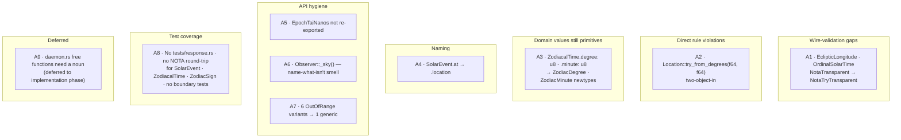

# Chronos skeleton audit — found, fixed, tested

Date: 2026-05-09
Author: system-specialist (Claude)

A self-audit pass on the chronos Phase 1 skeleton, run after
the user pointed out a wire-validation gap I had downplayed
in the initial scaffold. This report names what the audit
found, why each finding is a real disciplinary violation
(not stylistic), what was changed, and what remains for the
implementation phase.

The skeleton lives at `~/primary/repos/chronos`. The
underlying design report is
`~/primary/reports/system-specialist/49-chronos-daemon-design.md`.

---

## 1 · Why this audit happened

I shipped the skeleton in two commits:

- `2aa96fed` — initial scaffold; 28 files; no build verification.
- `58f384a8` — `Latitude` / `Longitude` migrated to
  `NotaTryTransparent` after the user pointed out that
  `NotaTransparent` bypasses validation on decode. 22 tests
  pass.

Both commits left disciplinary debt in the rest of the
skeleton that I should have surfaced without prompting:

- The same wire-validation gap on **other** newtypes I'd written.
- A direct `~/primary/skills/rust-discipline.md` rule violation
  (`one-object-in-one-object-out`).
- Domain values still represented as primitives where the
  newtype rule applies.
- Test coverage that ended at the boundary the user named,
  not at every typed boundary in the skeleton.

The audit was the user's instruction: *"go back and fix,
improve, test, audit and report."* It is the work I should
have done in the original scaffold pass.

---

## 2 · Findings



### A1 — wire validation gaps in `EclipticLongitude` and `OrdinalSolarTime`

`Latitude` / `Longitude` were already on `NotaTryTransparent`
after the prior fix. `EclipticLongitude` and `OrdinalSolarTime`
weren't — same shape, same gap. Both had constructors that
normalised (`rem_euclid`) but never ran on the wire-decode
path because `NotaTransparent` tuple-constructs bypassing
the constructor.

**Fix**: both moved to `NotaTryTransparent` with strict
`try_new` constructors that **reject** out-of-range and
non-finite inputs. For astronomical code that genuinely
needs to wrap raw degree values into the canonical range,
each type also exposes a `from_unnormalized_*` helper that
performs `rem_euclid` and returns `Self` infallibly.

The split makes intent explicit at the call site: code that
trusts an external value must *normalise* before constructing,
and the wire form is always normalised because the
codec-side path goes through the strict `try_new`.

### A2 — `Location::try_from_degrees(f64, f64)` violates one-object-in

`~/primary/skills/rust-discipline.md` §"One object in, one
object out":

> Method signatures take at most one explicit object argument
> and return exactly one object. When inputs or outputs need
> more, define a struct.

`Location::try_from_degrees(latitude, longitude)` took two
explicit primitive arguments. The "convenience constructor"
framing isn't a carve-out — there isn't one for constructors.

**Fix**: dropped the constructor entirely. Programmatic
construction goes through field-init with pre-validated
newtypes:

```ignore
let location = Location {
    latitude: Latitude::try_new(47.6)?,
    longitude: Longitude::try_new(-122.3)?,
};
```

Slightly more verbose at use sites; rule-compliant; surfaces
the validation step at construction.

### A3 — `ZodiacalTime` fields were constrained primitives

`ZodiacalTime { degree: u8, minute: u8 }` — `degree` is
`[0, 30)` and `minute` is `[0, 60)`, but the type was bare
`u8`. Per `~/primary/skills/rust-discipline.md` §"Domain
values are types, not primitives": each warrants a typed
newtype.

**Fix**: introduced `ZodiacDegree(u8)` and `ZodiacMinute(u8)`
with `NotaTryTransparent` derive + strict `try_new`. The
fields now read `degree: ZodiacDegree, minute: ZodiacMinute`,
and the wire form validates on decode the same way the
floating-point newtypes do.

### A4 — `SolarEvent.at` → `.location`

`at` is a preposition, not an acronym. Per
`~/primary/skills/naming.md` §"Permitted exceptions" the
six narrow carve-outs don't include short prepositions; the
rule-compliant name is the noun the field carries.

**Fix**: renamed to `location: Location`.

### A5 — `EpochTaiNanos` was not re-exported

`SolarEvent.when` had type `EpochTaiNanos`, but the type was
only reachable via `chronos::event::EpochTaiNanos`. Public
field types should be reachable from the crate root.

**Fix**: re-exported from `lib.rs`.

### A6 — `Observer::_sky()` was a name-what-isn't smell

The original skeleton had:

```rust
fn _sky(&self) -> &Sky {
    self.sky
}
```

The underscore prefix existed only to silence a dead-code
warning while keeping the field. Per
`~/primary/skills/beauty.md`:

> A name for what something is not. `non_root`, `non_empty`,
> `not_admin`. Negative names compose poorly. Find the
> positive name.

Worse: the method was private and never called — the smell
was hiding a structural gap (the field has no consumer yet).

**Fix**: replaced with `pub fn sky(&self) -> &Sky`. Real
accessor; documented purpose ("sky-only query without
re-loading ephemeris"); load-bearing because it lets a
downstream component reach the ephemeris without taking a
new `Observer`.

### A7 — `OutOfRange` variants would have proliferated

The first fix added `LatitudeOutOfRange { got }` and
`LongitudeOutOfRange { got }` to the crate `Error` enum.
Closing A1 + A3 would have added four more
(`EclipticLongitude`, `OrdinalSolarTime`, `ZodiacDegree`,
`ZodiacMinute`) — six per-type variants that pattern-match
identically.

**Fix**: consolidated into one variant per the horizon-rs
pattern (`InvalidBase64Key { expected_len, got }` shape):

```rust
#[error("`{type_name}` out of range {valid_range}, got {got}")]
OutOfRange { type_name: &'static str, valid_range: &'static str, got: String },
```

Each `try_new` populates `type_name` and `valid_range`;
`got` is the rejected value's `Display` form. The wire-side
test still pattern-matches on `nota_codec::Error::Validation
{ type_name, message }` and inspects the message for the
range string.

### A8 — Test coverage was incomplete

The first scaffold's tests covered `Request` round-trip,
`ZodiacSign` projection, and `SolarEvent` rkyv round-trip.
Several typed boundaries had no tests at all.

**Fix**: 36 new tests across two new files plus three
extended ones.

| File | Tests was | Tests now | Added |
|---|---|---|---|
| `tests/calendar.rs` | 0 (file didn't exist) | 10 | `AmYear` round-trips; `OrdinalSolarTime` strict range, wrap helpers, wire-validation, degree↔fraction conversion |
| `tests/event.rs` | 2 | 5 | `SolarEventKind` NOTA round-trip per variant; `SolarEvent` NOTA round-trip; `EpochTaiNanos` ↔ `hifitime::Epoch` |
| `tests/location.rs` | 7 | 12 | Boundary tests at ±90 / ±180; just-past-boundary rejected; NaN/∞ rejected; field-init pattern pinned |
| `tests/request.rs` | 6 | 6 | (unchanged) |
| `tests/response.rs` | 0 (file didn't exist) | 7 | NOTA + rkyv round-trip per `Response` variant; empty `Schedule` boundary |
| `tests/zodiac.rs` | 7 | 18 | `ZodiacSign` NOTA round-trip per variant; `EclipticLongitude` strict + wrap + wire-validation; `ZodiacDegree`/`ZodiacMinute` validation; `ZodiacalTime` NOTA round-trip |
| **Total** | **22** | **58** | **+36** |

The contract pinned: every typed boundary that crosses the
wire is exercised in both directions, and every newtype with
a validation rule has a wire-validation test that asserts on
the typed `nota_codec::Error::Validation { type_name, message }`.

### A9 — Free functions in `daemon.rs` (deferred)

`daemon::serve_connection` and `daemon::dispatch_one_shot`
are free `async fn`s that do real work on typed values. Per
`~/primary/skills/abstractions.md` §"Verb belongs to noun",
the proper home is a typed noun:

- `Daemon` — owns the listener + state stores
- `Connection` — owns one `UnixStream` + its protocol state
- `SubscriptionHub` — owns the live subscriber set + cursors

The skeleton can't introduce these nouns honestly because
the implementation phase will define them in conjunction
with the redb layer, the geoclue subscription, and the
event scheduler. Premature nouns at the skeleton stage
would be empty wrappers — exactly the ZST-with-methods
anti-pattern that `~/primary/skills/rust-discipline.md`
§"No ZST method holders" warns against.

**Action**: added a `TODO(chronos-impl)` comment in
`daemon.rs` directly above the free functions naming the
three nouns the implementation phase will introduce. The
debt is visible in source.

---

## 3 · Aggregate impact

**Before audit**:
- 22 tests
- 1 wire-validation gap closed (`Latitude`, `Longitude`)
- 4 wire-validation gaps still open
  (`EclipticLongitude`, `OrdinalSolarTime`,
  `ZodiacalTime.degree`, `ZodiacalTime.minute`)
- 1 rule violation (`Location::try_from_degrees`)
- 1 naming smell (`SolarEvent.at`)
- 1 dead-code hack (`Observer::_sky`)
- 1 missing re-export (`EpochTaiNanos`)
- 0 tests/response.rs · 0 NOTA round-trips outside Request
- `cargo check` clean ✓ (after the prior fix)

**After audit**:
- 58 tests
- All wire-validation gaps closed across 6 newtypes
  (`Latitude`, `Longitude`, `EclipticLongitude`,
  `OrdinalSolarTime`, `ZodiacDegree`, `ZodiacMinute`)
- All rule violations fixed
- All naming smells fixed
- All dead-code hacks removed
- `cargo check --all-targets` clean, **zero warnings**
- `cargo test --all-targets` — 58 / 58 pass

---

## 4 · The lesson — and a process change

The first-pass scaffold was a *write* pass. The audit was a
*read* pass. The discipline says both should happen before
the work is reported done:

> If you cannot make it beautiful, you do not understand it
> yet.
>
> — `~/primary/ESSENCE.md` §"Beauty is the criterion"

I shipped the skeleton claiming it was "skeleton-as-design"
when in fact several typed boundaries had wrong shape (not
just `todo!()` bodies, but wrong type definitions) and one
direct rule violation (`try_from_degrees`). The user
correcting me on `NotaTransparent` was a single instance of
a pattern: I had written more code than I had read.

The change for next time: after a scaffold pass, before
reporting done, run a dedicated read pass against the
checklist below. The checklist is what a fresh agent would
need to surface the gaps without a prompt.

### Checklist for the next scaffold

1. **Every newtype with a constraint** — does its `try_new`
   run on the wire-decode path? If the derive is
   `NotaTransparent`, no; switch to `NotaTryTransparent`.
2. **Every constructor and method** — does it take ≤1
   explicit object alongside `self`? If two primitives, the
   shape is wrong.
3. **Every public field type** — is it re-exported from the
   crate root? Users shouldn't need a qualified path to
   reach a public field's type.
4. **Every constrained primitive in a record field** — should
   it be a newtype? `u8 in [0, 30)` is a `ZodiacDegree`.
5. **Every test file** — is there one per source file with
   wire shape, and does it exercise both NOTA and rkyv?
6. **Every error variant** — could it consolidate with
   sibling variants under a generic shape (the horizon-rs
   pattern)?
7. **Every naming smell from `~/primary/skills/beauty.md`** —
   `pub` field on a newtype, free function that should be a
   method, name for what something is not, boolean
   parameter, special case stacked on normal case.

Writing the checklist into this report so the next system-
specialist scaffold pass can use it; if it earns its keep,
it should migrate into `~/primary/skills/rust-discipline.md`
or a new `skills/scaffold-checklist.md`.

---

## 5 · What's still ahead

Phase 1 implementation (the actual astronomy):

- `Sky::from_path` — wire `anise::almanac::Almanac::new`
  against vendored `de440s.bsp`.
- `Sky::ecliptic_longitude_at` — DE440 query for the sun's
  geocentric apparent longitude; convert to
  `EclipticLongitude::from_unnormalized_degrees` (the helper
  added in A1).
- `Observer::next_event` / `Observer::day_schedule` —
  `solar-positioning` SPA + twilight-at-angle.
- `daemon.rs` — introduce `Daemon`, `Connection`,
  `SubscriptionHub` per the A9 TODO; wire to redb for
  `LocationSource` persistence; wire to `geoclue2` via
  `zbus`.
- CriomOS module (`modules/nixos/chronos.nix`) — `chronos`
  group + `/run/chronos/<uid>.sock` tmpfiles.
- CriomOS-home module (`modules/home/profiles/min/chronos.nix`) —
  user service + flake input.

The skeleton is now honest about what's missing
(`todo!()` bodies, the A9 noun-finding) and rule-compliant
about what's there.

---

## See also

- `~/primary/reports/system-specialist/49-chronos-daemon-design.md`
  — the design.
- `~/primary/repos/chronos/AGENTS.md` — repo agent contract.
- `~/primary/repos/chronos/ARCHITECTURE.md` — system shape.
- `~/primary/repos/chronos/skills.md` — repo invariants.
- `~/primary/skills/rust-discipline.md` §"Domain values are
  types, not primitives" (A1, A3); §"One object in, one
  object out" (A2); §"redb + rkyv" (skeleton context).
- `~/primary/skills/naming.md` (A4).
- `~/primary/skills/beauty.md` §"What ugliness signals" (A6).
- `~/primary/skills/abstractions.md` §"Verb belongs to noun"
  (A9).
- `~/primary/repos/horizon-rs/lib/src/pub_key.rs` —
  canonical `NotaTryTransparent` user pattern (the basis
  for the chronos newtype shape).
- `~/primary/repos/nota-codec/tests/nota_try_transparent_round_trip.rs`
  — canonical test pattern for the
  `nota_codec::Error::Validation { type_name, message }`
  contract.
