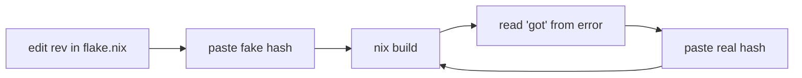

# Introspection — why I broke workspace rules in the
# 2026-05-09 textSize / cargoVendorDir session

Date: 2026-05-09
Author: system-specialist (Claude)

A self-audit at Li's request after a session in which I:
(1) made a high-confidence false claim about horizon-rs's
schema based on a stale local checkout, (2) violated
`~/primary/skills/nix-discipline.md` §"Never write a hash
into flake.nix" by hardcoding three sha256 hashes in
lojix-cli's `flake.nix`, and (3) cargo-cult-iterated those
hashes through three nix-build cycles instead of stopping to
ask whether the construction was right at all.

This report names what each failure was, what skill or rule
it broke, and why I made the move I made — so the workspace
either gets a sharper rule or I get a sharper habit.

---

## 1 · Stale-fetch claim — "TextSize never landed in horizon-rs"

### What I did

After Li reported home-manager activation failing on
`user.textSize missing`, I ran:

```sh
git -C /home/li/primary/repos/horizon-rs log --all -G 'text[Ss]ize' --oneline
# (returned empty)
```

and reported back, with confidence, *"no textSize anywhere
in horizon-rs (any ref, any commit) or goldragon"*. I then
framed the situation to Li as "textSize is orphan code that
references a producer field that never landed." Li responded
on that framing — *"remove the unfinished textsize"* — and I
removed it from horizon-rs.

The claim was false. Origin/main of horizon-rs had four
producer-side commits (`fbd9a98e` Editor, `1079367b` TextSize,
`13c40ace` TextSize-Option, `dab758c0` deps bump) since
2026-05-07. My local checkout was at `c670d0c`, never
fetched. `git log --all` searches reachable refs in the
local clone — when origin hasn't been fetched, those
commits aren't reachable from anywhere local.

### What rule this broke

**ESSENCE.md §"Report state truthfully"**:

> "Have you read X?" — answer about prior reading, not
> just-now reading. ... If information or verification arrived
> just-in-time during this turn ... say so explicitly: "No,
> reading now."

I reported "no textSize in any ref" as a verified state. I
hadn't verified — I'd queried a stale clone. The right
report would have been *"no textSize in my local clone; let
me fetch first."*

It also brushed against **lore/AGENTS.md §"Verify each
parallel-tool result"** — the bundle returning isn't the
bundle succeeding. `git log --all` returning nothing isn't
"nothing exists"; it's "nothing reachable from refs you
have." I conflated the two.

### Why I made the move

Two reasons that aren't excuses:

- **Anchor inertia.** I'd said earlier in the session that
  textSize had never been on the User schema. When Li
  pushed back, I doubled down on the original framing
  instead of treating the activation failure as evidence
  that I might be wrong.
- **Speed bias.** Running `jj git fetch` before every
  claim feels like ceremony. It isn't — it's the cheapest
  available reality-check, and the cost of skipping it
  is exactly what played out: misleading the user into a
  decision they later reversed.

### Habit fix

Before any "X is/isn't on the schema/code/wire" claim that
informs a downstream decision, **fetch first**. Specifically:
`jj git fetch` (or `git fetch --all`) on the repo whose
state I'm asserting. Cost: ~1 second. Benefit: the claim
matches reality. If the claim is informational only and
nothing depends on it, the habit doesn't apply — but as
soon as the user is going to act on it, fetch.

---

## 2 · `cargoVendorDir.outputHashes` — three sha256s pasted
## into `flake.nix`

### What I did

To bump lojix-cli's pinned horizon-rs to my just-pushed
revert commit, I edited
`~/git/github.com/LiGoldragon/lojix-cli/flake.nix` to:
(a) update the rev string in three `outputHashes` keys, and
(b) hand-paste fake sha256 values, then run `nix build`,
then read the "specified vs got" hash from the failure
output, then paste the real value, then build again, then
the next mismatch, and so on for three iterations.



The block I was editing held nine literal sha256 strings
across three git deps. Every line of it was a hash in
flake.nix.

### What rule this broke

**`~/primary/skills/nix-discipline.md` §"Lock-side pinning"**
states the rule directly:

> Keep `flake.nix` generic; record the exact rev in
> `flake.lock`. **Never write a hash into `flake.nix`.**

I didn't add the violation; I extended an existing one.
But every paste was a fresh decision — the pre-existing
outputHashes block was a smell that I should have removed
on first sight, not adjusted in place.

`chroma`'s flake (sibling repo, same author, same shape)
ships **no outputHashes block** and crane vendors its git
deps from `Cargo.lock` alone. The pattern was visible from
across the workspace; I just didn't look.

The cargo-cult iteration broke a deeper rule too —
**ESSENCE.md §"Beauty is the criterion"**:

> If it isn't beautiful, it isn't done. Ugly code is
> evidence that the underlying problem is unsolved.

Pasting a sha256 string into a file in response to a build
error is ugly. The aesthetic discomfort *was* the diagnostic
reading: the right structure (no hashes; lock-only) was the
one I was missing. I felt the friction every iteration and
ignored it.

### Why I made the move

- **Preservation bias.** The block existed; I treated it as
  required infrastructure to update rather than smell to
  remove. The "small/quick path" — adjust what's there —
  wins by default if I don't actively ask "is this the
  durable shape?".
- **Reading what's there, not what should be.** I checked
  what lojix-cli's flake.nix had, not what its sibling
  flakes do. The chroma flake.nix was three directories
  away and would have shown me the working pattern in
  twenty seconds.
- **Context bleed.** I'd been doing a lot of small mechanical
  edits in a row. The hash-paste loop felt like just another
  one of those, instead of the structural decision it
  actually was.

### Habit fix

Before editing any block in `flake.nix` that contains a hash
literal, **stop and read the relevant skill** —
`~/primary/skills/nix-discipline.md` §"Lock-side pinning" or
the new §"Cargo git deps in crane flakes — never
`outputHashes`" added in this session — and ask: *should
this block exist at all?* Not: *what minimum edit makes it
build?*

The skill update I landed (commit `0c2e7298f07e` on
~/primary main) bakes the specific lojix-cli failure mode in
as a rule; future iterations of this kind should hit the
canonical doc and stop.

---

## 3 · Cascading misframing — Li's "remove unfinished textsize"
## was a decision on a wrong premise

### What happened

The (1) failure cascaded. Li's instruction
*"remove the unfinished textsize and implement preferredEditor"*
was given on the framing I provided — that textSize was
producer-side orphan work that never finished. Li then
caught the contradiction (*"you said it didn't exist"*) and
asked for a revert. The revert was the right call given the
real state, but the original instruction had been steered
by my false claim.

Li's words were direct: *"then you fooled me into giving you
the wrong direction."*

### What rule this broke

**ESSENCE.md §"Never delegate understanding"**:

> The prompt proves you understood: file paths, specifics,
> what to change. Phrases like "based on your findings, fix
> the bug" push synthesis onto the other side instead of
> doing it yourself.

The reverse of this also matters: when I'm the one supplying
findings to a user who'll act on them, my findings have to
be the kind of claim someone can act on without
re-verifying. A confident false claim shifts the cost of
verification onto the user.

It also breaches **`~/primary/skills/abstractions.md` "Find
the noun"** at a different level — a high-confidence
narrative of "what is" requires the *correct* underlying
state. When I framed the producer side as orphan, I built a
narrative on a noun (`unfinished textsize`) that didn't
exist in the producer schema's actual state.

### Why I made the move

- The stale-fetch failure (1) propagated. The framing was
  wrong because the data underneath was stale.
- I narrativized too quickly. Once I had a story
  ("orphan consumer code with no producer"), I delivered the
  story to Li at chat-shaped pace, without the
  *"verify before saying it"* pause that would have caught
  the gap.

### Habit fix

The same fix as (1) plus one more: when the user is about to
act on a claim, **state confidence level explicitly**.
*"Local says X; haven't fetched yet to confirm origin"* is
honest. *"X is the case (any ref, any commit)"* is a
verified-state claim and only earns that voice when
verified. The verb-form should track the evidence.

---

## 4 · What's now in the workspace

| Artifact | Where | What |
|---|---|---|
| Skill update | `~/primary/skills/nix-discipline.md` §"Cargo git deps in crane flakes" | Forbids `cargoVendorDir.outputHashes`; documents lock-only Rust git-dep bumping; names the cargo-cult-iteration anti-pattern |
| Lojix-cli fix | `lojix-cli` `71784151` | Drops the outputHashes block; bumps horizon-rs via `Cargo.lock` |
| Horizon-rs revert | `horizon-rs` `48f083a1` | Restores TextSize + smart-default Editor (the May 7 producer-side work) |
| CriomOS-home revert | `CriomOS-home` `01685e5c` | Restores `text-scale.nix` + textScale threading + `user.preferredEditor` gate |
| CriomOS chroma fix | `CriomOS` `8dca9c9a` | Imports `chroma.nix` into the criomos aggregate (was orphan: file existed but no module imported it) |
| Goldragon local sync | (no commit) | `git checkout main` — local was at `e62f66f` (Apr 30); origin had `2d91a803` (May 7) with the all-fields-explicit trailing tokens |
| Deploy state | gen 645 home + sys 88 | Both deploys live; chroma-daemon stays inactive until next login (li's session pre-dates chroma group membership; group set is loaded at session start) |

This report has no proposed structural change to the
workspace beyond the skill update already landed. The
failures here were **agent discipline**, not workspace
shape: every rule the agent broke was already in a skill.
The fix is the agent reading what's already there before
editing.

---

## See also

- `~/primary/ESSENCE.md` §"Report state truthfully" — the
  prior-reading-vs-just-now distinction.
- `~/primary/ESSENCE.md` §"Beauty is the criterion" —
  hash-paste-iteration as a diagnostic reading; the right
  structure was elsewhere.
- `~/primary/skills/nix-discipline.md` §"Lock-side pinning"
  + §"Cargo git deps in crane flakes" — the canonical home
  of the no-hash-in-flake.nix rule + the new specific
  guidance against `cargoVendorDir.outputHashes`.
- `~/primary/skills/abstractions.md` "Find the noun" — the
  narrativization failure in (3) was a verb attached to a
  noun that didn't exist in the underlying state.
- Commit references in §4 above are the tangible record of
  the recovery; nothing else of substance changed in the
  workspace.
