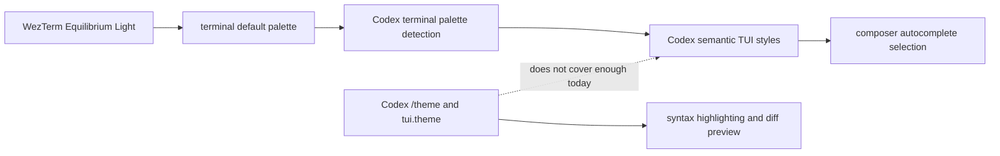

# Codex WezTerm Light Contrast

System-specialist report, as of 2026-05-09. No runtime
configuration, package pin, or source code changes are part of this pass.

## Result

The Codex autocomplete-selection contrast problem is most likely a Codex TUI
semantic-color problem exposed by the WezTerm light palette, not a plain
WezTerm selection-color problem.

`codex-cli 0.130.0` is the installed local version, and it is the current
stable OpenAI Codex release. OpenAI also has a newer `0.131.0-alpha.4`
prerelease, published on 2026-05-09, but no newer stable release. The local
`CriomOS-home` lock points at `sadjow/codex-cli-nix` revision
`7f0f3802287581e04501e2fea26b56d63df18ebd`, last modified
2026-05-08 23:25:16 UTC, which is after the `0.130.0` stable release.

Changing Codex `/theme` or `[tui].theme` is not expected to fix this specific
selection issue. Upstream OpenAI comments and feature requests say the current
theme path is focused on syntax highlighting, while the main TUI colors,
selection colors, composer/input colors, borders, dim text, and semantic UI
colors remain only partially configurable.

## Local Surface

`../../repos/CriomOS-home/flake.nix` lines 112-117 (agent package inputs)
pulls `codex-cli-nix` as a flake input. `../../repos/CriomOS-home/modules/home/profiles/min/default.nix`
lines 182-186 (AI user packages) installs the flake's default Codex package.
The active wrapper disables Codex's internal auto-updater, so Codex updates
come from the Nix flake input, not from Codex self-update behavior.

The current interactive binaries report:

| Tool | Version |
|---|---|
| Codex | `codex-cli 0.130.0` |
| WezTerm | `wezterm 0-unstable-2026-03-31` |

The current Codex user config has `[tui].theme = "gruvbox-light"`. That setting
is local user state, not `CriomOS-home` declarative state.

`../../repos/CriomOS-home/modules/home/profiles/min/default.nix` lines 362-438
(WezTerm enablement and runtime config) explains why WezTerm is present even
though Ghostty remains the default terminal: Persona's first harness adapter
uses WezTerm mux and `wezterm cli`, and direct WezTerm windows keep parity
styling. Lines 390-401 also carry a current Niri/Wayland clipboard workaround
for WezTerm issue #6685 and pending PR #7034.

The same file lines 440-496 defines the `Equilibrium Dark` and
`Equilibrium Light` schemes. The light scheme's own terminal selection colors
are not intrinsically low contrast:

| Pair | Contrast |
|---|---:|
| Light selection, `#43474e` on `#d8d4cb` | 6.31:1 |
| Light default, `#43474e` on `#f5f0e7` | 8.22:1 |
| Dark selection, `#afaba2` on `#22262d` | 6.63:1 |

That does not prove every ANSI pair emitted by Codex is legible. It does mean
the specific `selection_fg` / `selection_bg` fields in the WezTerm scheme are
not the obvious failing pair.

## Shape

The mismatch is the last dotted edge: the user-facing theme control does not
yet cover the semantic surface where the problematic autocomplete selection
appears to live.

## Upstream Codex State

OpenAI Codex release facts:

| Release | State | Published | Source |
|---|---|---:|---|
| `rust-v0.130.0` | current stable | 2026-05-08 23:09:55 UTC | <https://github.com/openai/codex/releases/tag/rust-v0.130.0> |
| `rust-v0.131.0-alpha.4` | newer prerelease | 2026-05-09 06:12:00 UTC | <https://github.com/openai/codex/releases/tag/rust-v0.131.0-alpha.4> |

Open upstream issues match the reported symptom cluster:

| Issue | State | Why it matters |
|---|---|---|
| <https://github.com/openai/codex/issues/2020> | open | Tracks light-background terminals where prompts, completions, and menus become hard to read. Comments mention `TERM=dumb`, `NO_COLOR=1`, and terminal-side minimum-contrast workarounds. |
| <https://github.com/openai/codex/issues/21130> | open | Requests semantic TUI color configuration beyond syntax highlighting, including `selection_fg` and `selection_bg`. This directly explains why `/theme` does not fix broad UI contrast. |
| <https://github.com/openai/codex/issues/1618> | closed | The closed theme request contains the OpenAI maintainer note that current theme work focuses on syntax highlighting, with broader TUI theming only under consideration. Later comments report suggestions being almost indistinguishable under light themes. |
| <https://github.com/openai/codex/issues/16411> | open | Reports unreadable light-theme composer/input behavior on Linux. A user notes that exit and reopen can make the input area render correctly. |
| <https://github.com/openai/codex/issues/18942> | open | Tracks a stale adaptive theme after system light/dark changes. The proposed fix refreshes the adaptive runtime theme after Codex requeries terminal defaults on focus. |

The most relevant conclusion is not that all of these are the same bug. It is
that Codex has a known, active cluster of light-background and semantic-TUI
contrast problems, and the user's autocomplete-selection complaint is inside
that cluster.

## WezTerm State

WezTerm itself has two relevant facts.

First, the workspace is already carrying a WezTerm/Niri workaround for
<https://github.com/wezterm/wezterm/issues/6685> (clipboard state not shared
between WezTerm windows reliably on some Wayland compositors). The pending fix
is <https://github.com/wezterm/wezterm/pull/7034>. This is a real reason
WezTerm feels troublesome locally, but it is orthogonal to the Codex
autocomplete contrast problem.

Second, WezTerm documents a nightly-only terminal-side contrast guard:
`text_min_contrast_ratio`. The docs say it adjusts the foreground luminance for
text cells whose foreground/background contrast falls below the configured
ratio, and suggest `4.5` as a reasonable WCAG-AA-aligned value when terminal
applications produce poor contrast. The local WezTerm is an unstable build, so
this setting is plausible as a mitigation, but it still needs a live test before
becoming declarative policy:
<https://wezterm.org/config/lua/config/text_min_contrast_ratio.html>.

WezTerm's color docs also confirm that `selection_fg` and `selection_bg` are
terminal selection/copy-mode colors, and that color schemes plus explicit
`colors` overrides define the terminal palette:
<https://wezterm.org/config/appearance.html>. Codex's composer autocomplete is
a TUI-rendered selection, so those WezTerm selection fields are not guaranteed
to control it.

## Recommendation

Do not spend more time rotating Codex light syntax themes for this bug. The
evidence says that knob is the wrong layer.

The next low-risk diagnostic is to run Codex under the current WezTerm light
scheme with a temporary WezTerm `text_min_contrast_ratio = 4.5` override and
check the autocomplete popup. If it fixes the selection without damaging other
terminal output, it becomes the cleanest terminal-side mitigation. If it does
not, the fix belongs in Codex's semantic TUI colors or in a local Codex package
patch.

Alpha-testing `0.131.0-alpha.4` is not the first move. It is newer, but the
release is explicitly prerelease, and the active upstream issues do not show a
confirmed semantic autocomplete-selection fix in that alpha.

If an upstream Codex report or comment is filed, the useful environment block is:

| Field | Value |
|---|---|
| Codex | `codex-cli 0.130.0` |
| Terminal | `wezterm 0-unstable-2026-03-31` |
| `TERM` | `xterm-256color` |
| `COLORTERM` | `truecolor` |
| `TERM_PROGRAM` | `WezTerm` |
| Codex theme | `gruvbox-light` |
| WezTerm scheme | `Equilibrium Light` |
| Symptom | autocomplete selected row has extremely low contrast across Codex light themes |

