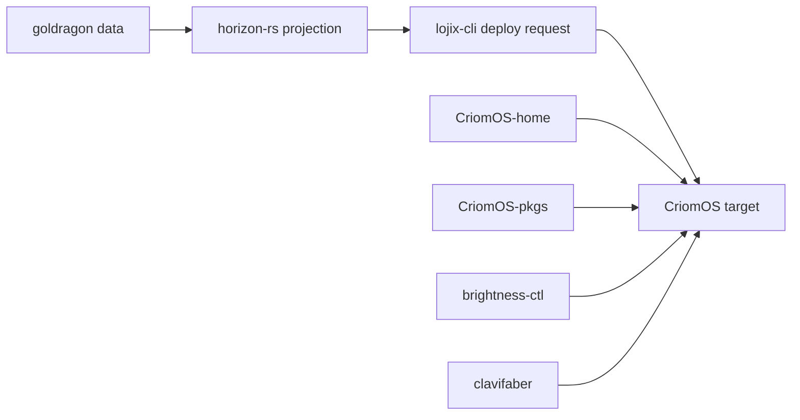

# CriomOS platform discipline audit

Role: system-specialist  
Date: 2026-05-09  
Lens: `skills/beauty.md`, `skills/naming.md`, `skills/nix-discipline.md`, `skills/rust-discipline.md`

## Scope

Audited the active CriomOS platform surface:

| Repo | Role in surface | Result |
|---|---|---|
| `/git/github.com/LiGoldragon/CriomOS` | NixOS target flake and parent lock | Fixed module export and bumped fixed child inputs. |
| `/git/github.com/LiGoldragon/CriomOS-home` | Home Manager desktop profile | Fixed Blueprint `checks` output before this report. |
| `/git/github.com/LiGoldragon/CriomOS-emacs` | Planned Emacs split | Still scaffold; standalone package check fails as expected from current README state. |
| `/git/github.com/LiGoldragon/CriomOS-lib` | Shared static helpers/data | Standalone flake check passes. |
| `/git/github.com/LiGoldragon/CriomOS-pkgs` | Parent-provided `system` package axis | Standalone check reaches the intended missing-system guard. |
| `/git/github.com/LiGoldragon/horizon-rs` | Horizon schema/projection Rust | No-build flake check passes; known serde cleanup remains. |
| `/git/github.com/LiGoldragon/lojix-cli` | Deploy orchestration CLI | No-build flake check passes. |
| `/git/github.com/LiGoldragon/brightness-ctl` | Runtime backlight helper | Fixed Blueprint `checks` output. |
| `/git/github.com/LiGoldragon/clavifaber` | PKI and node identity helper | Fixed Blueprint `checks` output. |
| `/git/github.com/LiGoldragon/goldragon` | Data-only cluster proposal | Correctly has no flake; status clean. |

## Fixes pushed

1. `/git/github.com/LiGoldragon/CriomOS-home/flake.nix`

   Commit: `14d22446 flake: filter blueprint checks`

   Blueprint was putting package-internal attributes under `checks`, including values that are not derivations. Nix rejects non-derivation check attrs. The fix keeps Blueprint outputs but replaces `checks` with derivation-only entries, and for `pkgs-*` checks only keeps names that correspond to actual package outputs. See `/git/github.com/LiGoldragon/CriomOS-home/flake.nix:152`.

2. `/git/github.com/LiGoldragon/brightness-ctl/flake.nix`

   Commit: `790f9760 (("Fix", "flake"), ("Filter", "blueprint checks"), ("Pass", "standalone check exposes derivations only"))`

   Same Blueprint `checks` failure. The wrapper is now the same shape as the `CriomOS-home` fix. See `/git/github.com/LiGoldragon/brightness-ctl/flake.nix:16`.

3. `/git/github.com/LiGoldragon/clavifaber/flake.nix`

   Commit: `c3b5e800 (("Fix", "flake"), ("Filter", "blueprint checks"), ("Pass", "standalone check exposes derivations only"))`

   Same Blueprint `checks` failure. See `/git/github.com/LiGoldragon/clavifaber/flake.nix:16`.

4. `/git/github.com/LiGoldragon/CriomOS/modules/nixos/disks/default.nix`

   Commit: `e929120c modules: expose disk defaults`

   Blueprint exports `modules/nixos/disks/` as `nixosModules.disks` and expects a `default.nix`. The file was absent, so `nix flake check --no-build` failed before it could validate the rest of the module surface. The new default imports `./preinstalled.nix`, matching the top aggregate’s current disk behavior. See `/git/github.com/LiGoldragon/CriomOS/modules/nixos/disks/default.nix:1`.

5. `/git/github.com/LiGoldragon/CriomOS/flake.lock`

   Commit: `06a53468 flake.lock: bump fixed criomos inputs`

   Bumped only `criomos-home`, `brightness-ctl`, and `clavifaber` so the parent platform consumes the fixes above.

## Findings

### Nix discipline

No active committed uses of `git+file://`, manual `cargoVendorDir.outputHashes`, raw store paths, `<nixpkgs>`, or `NIX_PATH` were found in the active implementation surface. Search hits were policy text or “do not use this” comments.

`CriomOS-home`, `brightness-ctl`, and `clavifaber` all had the same beauty problem: the public flake `checks` surface contained implementation-detail names that were not check derivations. Filtering the public output is the narrow fix; it avoids changing package builds while restoring a useful `nix flake check --no-build`.

`CriomOS` now gets through its NixOS module exports, including `nixosModules.disks`. The remaining standalone failure is the intentional `system` stub guard for `nixosConfigurations.target`; a real deploy is expected to provide that input through `lojix`.

`CriomOS-pkgs` has the same intentional standalone shape: it is a package-axis flake and refuses to instantiate without parent-provided `system`.

Several repos still use `pkgs.nixfmt-rfc-style`, which now warns that it is equivalent to `pkgs.nixfmt`. This is noisy but not a correctness failure. A later hygiene sweep should replace it in formatter/devshell declarations.

### Rust discipline

The Rust crates checked (`horizon-rs`, `lojix-cli`, `brightness-ctl`, `clavifaber`) have typed error surfaces and no source-level `anyhow`/`eyre` use. I found no public tuple-newtype fields of the `pub struct Name(pub T)` form.

Remaining discipline debt is real but not a safe one-line audit patch:

- `horizon-rs` still carries broad serde derives on Nota-facing types. This is already tracked as `primary-npd`.
- `brightness-ctl` is still a small single-file crate with abbreviated local names and one float-comparison unwrap; the repo has `bright-2iz` open for a Mentci Rust style refactor.
- `clavifaber` still has CLI-shaped free functions and abbreviated names such as command helpers and certificate-name variables; the repo has `clavi-37x` open for the style refactor.
- `lojix-cli` is the strongest of the Rust repos by this lens: most behavior is already on domain types, with explicit process/deploy/request types and a typed error enum.

### CriomOS-emacs

`CriomOS-emacs` remains scaffolded, and its current flake check fails while evaluating `packages/mkEmacs/default.nix` because the legacy function still expects arguments such as `hob`, `aski-mode`, `aski-ts-mode`, and tree-sitter package inputs. That matches the repository README, which says `packages/mkEmacs/` is a verbatim legacy copy and Phase 1 is to convert it into a proper Blueprint package. See `/git/github.com/LiGoldragon/CriomOS-emacs/README.md:13` and `/git/github.com/LiGoldragon/CriomOS-emacs/packages/mkEmacs/default.nix:1`.

This is not currently wired into `CriomOS-home`; the `criomos-emacs` flake input is still commented as planned split work in `/git/github.com/LiGoldragon/CriomOS-home/flake.nix:140`.

## Verification

| Repo | Command | Outcome |
|---|---|---|
| `CriomOS-home` | `nix eval .#checks.x86_64-linux --apply builtins.attrNames` | Shows only real devshell/package checks. |
| `CriomOS-home` | `nix flake check --no-build -L` | Passes. |
| `brightness-ctl` | `nix flake check --no-build -L` | Passes after filtering `checks`. |
| `clavifaber` | `nix flake check --no-build -L` | Passes after filtering `checks`. |
| `CriomOS` | `nix flake check --no-build -L` | Module exports pass; target stops at the expected missing `system` stub guard. |
| `CriomOS-lib` | `nix flake check --no-build -L` | Passes. |
| `horizon-rs` | `nix flake check --no-build -L` | Passes, with crane metadata warnings. |
| `lojix-cli` | `nix flake check --no-build -L` | Passes. |
| `CriomOS-emacs` | `nix flake check --no-build -L` | Fails on scaffolded legacy `mkEmacs` package arguments. |
| `CriomOS-pkgs` | `nix flake check --no-build -L` | Stops at the intended missing `system` input guard. |

All edited repos were clean after commit and push. The system-specialist lock was released.
