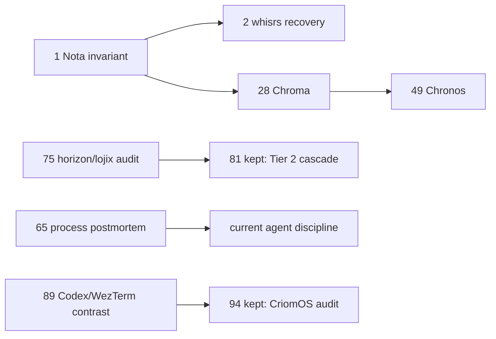
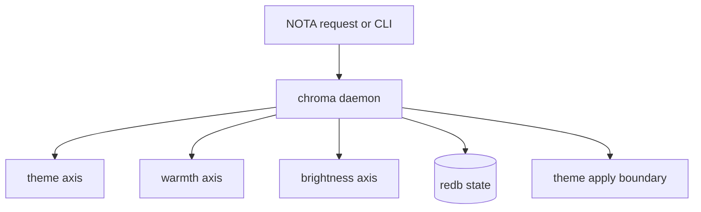

# System-specialist agglomerated archive

Role: system-specialist  
Date: 2026-05-09  
Purpose: consolidate retired point-in-time system-specialist reports so the role directory stays scannable.

## Disposition

This report absorbs the load-bearing substance from:

| Retired report | Original subject | Current disposition |
|---|---|---|
| `1-nota-all-fields-present-violation.md` | Nota missing-field invariant violation | Preserved here as a Nota invariant and incident lesson. |
| `2-voice-typing-recovery-design.md` | whisrs recovery audio and retry design | Preserved here as the recovery shape; implementation still belongs in whisrs work. |
| `28-chroma-unified-visual-daemon.md` | Chroma daemon design | Preserved here as the Chroma architectural sketch and BEADS close-note target. |
| `49-chronos-daemon-design.md` | Chronos daemon design | Preserved here as the Chronos architectural sketch. |
| `65-introspection-why-i-broke-workspace-rules.md` | Postmortem on stale clone and Nix hash mistakes | Preserved here as process lessons. |
| `75-horizon-rs-lojix-cli-audit.md` | horizon-rs / lojix-cli discipline audit | Preserved here as audit lineage; later cascade finished most surfaced items. |
| `89-codex-wezterm-light-contrast.md` | Codex autocomplete contrast under WezTerm | Preserved here as terminal/Codex diagnosis lineage. |

Kept outside this aggregate:

| Kept report | Why |
|---|---|
| `81-do-it-all-tier2-cascade.md` | Other role reports cite it directly as coordination-history evidence; leave the original path alive. |
| `94-criomos-platform-discipline-audit.md` | Current CriomOS platform audit and verification state. |

## Retired 1: Nota all-fields-present invariant

The core finding was that `nota-codec` had allowed `Option<T>::decode` to treat a missing trailing positional field as `None`. That breaks the Nota contract: records are positional, and every declared field must appear in source text, even when the value is `None` or another explicit empty form.

Why it mattered:

- Schema changes should force visible datom migrations.
- A missing trailing field should be parse debt, not a successful parse.
- A lax parser hides stale records, especially in `goldragon/datom.nota`.

The preserved rule is: optionality is a type-level value, not permission to omit a source token. Future Nota decoders, docs, and tests should keep the invariant explicit.

## Retired 2: whisrs voice-typing recovery

The useful discovery was that whisrs already saved failed transcription audio, but pointed users at a retry command that did not exist.

Preserved shape:

- Persist failure audio as user data, not disposable cache.
- Provide an explicit `whisrs transcribe-recovery` path.
- Add a retry queue and connectivity-aware auto-retry.
- Add garbage-collection discipline after successful recovery.

The important user-facing invariant is that a network drop must not destroy a long spoken thought. Recovery audio remains load-bearing until it has either been transcribed or the user explicitly discards it.

## Retired 28: Chroma unified visual daemon

Chroma was the proposed replacement for the scattered desktop visual stack: darkman scheduling, nightshift shell services, brightness wrappers, `wl-gammarelay-rs`, and generated theme apply scripts.

Preserved architecture:

The key design point is independence: theme, warmth, and brightness are separate axes owned by one daemon because they share scheduling, persistence, operator intent, and display-side effects. They must not be implicitly coupled just because one old scheduler happened to drive multiple hooks.

The original Chroma report also served as the canonical home for bead `primary-8b6`. That breadcrumb now points here.

## Retired 49: Chronos astral-time daemon

Chronos was a proposed successor to an older solar-time prototype. The prototype computed ordinal solar time from solar ecliptic longitude; the proposed daemon adds location-aware solar events and push subscriptions.

Preserved architecture:

- A `chronos` daemon owns time/event computation.
- A thin CLI sends typed requests.
- Chroma should subscribe to solar events rather than poll wall-clock thresholds.
- The astronomical pipeline should use established libraries where possible and keep the local code focused on domain projection, subscription, and notation.

The durable naming rule is that `chronos` names time itself, not a generic scheduler. It may expose solar longitude, zodiacal time, sunrise/sunset/twilight, and later astrological hooks without becoming Chroma.

## Retired 65: process postmortem

The postmortem recorded three failures:

- A stale local clone was treated as authoritative remote truth.
- Manual `cargoVendorDir.outputHashes` hashes were pasted into a flake.
- A user decision was solicited from a wrong premise, causing cascading cleanup churn.

Preserved habits:

- Before saying a remote state does not exist, fetch or explicitly say the claim is only about the local clone.
- Do not write manual Nix vendor hashes for modern crane git-dependency work.
- Treat a surprising activation/build failure as evidence against your current frame, not just as an obstacle to push through.
- Report just-in-time verification honestly: "I checked now" is different from "I knew this before."

## Retired 75: horizon-rs and lojix-cli audit

This audit landed discipline fixes in `horizon-rs` and `lojix-cli`, including full-word naming, better typed errors, removal of companion `Input` types, moving behavior onto inherent implementations, dead-code removal, and test extraction.

The important lineage:

- The audit surfaced `Magnitude::Med` / `Magnitude::None` and `AtLeast` field names as wire-breaking naming debt.
- Report 81 later executed that coordinated cascade across `horizon-rs`, `lojix-cli`, `goldragon`, `CriomOS`, and `CriomOS-home`; therefore those report-75 surfaced items are no longer open.
- Remaining large-function concerns were judged structural rather than mechanical. Some linear pipelines should stay linear if splitting only manufactures names without reducing real complexity.

Current readers should use `reports/system-specialist/81-do-it-all-tier2-cascade.md` for the completed coordinated rename state.

## Retired 89: Codex WezTerm contrast

The diagnosis was that Codex autocomplete selection contrast was probably a Codex semantic-TUI color interaction exposed by the WezTerm light palette, not the terminal selection color pair itself.

Preserved facts:

- Local Codex was `0.130.0`, which was the stable release at the time of the report.
- Codex `/theme` and `[tui].theme` mostly affected syntax/diff coloring, not all semantic TUI elements.
- WezTerm's explicit light selection foreground/background pair had acceptable contrast; the bad pair came from ANSI/semantic styling.

Follow-up work in `CriomOS-home` changed WezTerm behavior so bold text no longer brightens ANSI colors, which fixed the low-contrast autocomplete selection in practice. The report remains useful as diagnosis lineage, but the active state belongs to the current `CriomOS-home` config and the later CriomOS audit.

## Cleanup note

The retired reports were deleted from the filesystem after this aggregate landed. Their full original text remains in git history; this file is the live navigation surface.
