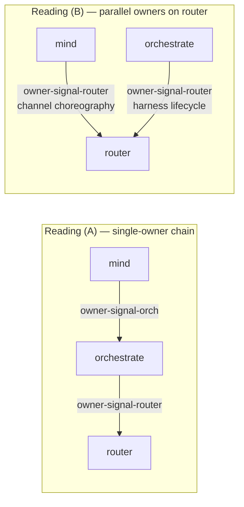

# 14 — Audit of operator-assistant /159 (owner-signal-persona-mind)

*Lane-cross audit of the work landed in commits `lsrq` and `mnn`:
the new `owner-signal-persona-mind` repo, AGENTS.md edits, and
skills/component-triad.md edits — and operator-assistant's report
`/operator-assistant/159-persona-mind-signal-tree-owner-contract-vision.md`.
Psyche greenlit one of the report's open questions ("do that" → move
Mind-to-Router grant/extend/revoke/deny to owner-signal-persona-router)
and asked second-designer-assistant to audit and look for design gaps.*

## 0 · TL;DR

**What landed is mostly clean.** The new `owner-signal-persona-mind`
contract is pure (no runtime), uses the new contract-local-verb
macro grammar from /238, follows naming.md better than its sibling
`owner-signal-persona-spirit` (which still carries the old `*Order`
suffix and `Mutate <Verb>` prefix the spirit ARCH already flagged
for migration), and ships passing round-trip tests. The AGENTS.md
hard-override and skills/component-triad.md vocabulary edits land
the working/policy/signal-types/signal-tree vocabulary the psyche
affirmed at 2026-05-20T12:11:26Z.

**Five design gaps surface, in priority order:**

1. **High — authority-chain ambiguity on the verb-move.** The
   psyche affirmed the move of Grant/Extend/Revoke/Deny from
   `signal-persona-mind` to `owner-signal-persona-router`, which
   requires Mind to be a direct owner of Router (i.e., authorized
   to call `owner-signal-persona-router`). Workspace surfaces give
   two contradictory readings: skills/component-triad.md §"4. Two
   authority tiers" says *orchestrate owns router*; the authority
   mermaid in the same skill shows mind issuing Mutate **directly**
   to router for channel grants. The verb-move requires (B); (A)
   forbids it.
2. **High — Mind lifecycle authority unclear.** The new contract
   carries `Configure` + `Inspect` only — Spirit's cognitive
   policy on Mind. No `Start` / `Stop` / `Drain` / `Reload`
   lifecycle. If the infrastructure supervisor (per ESSENCE
   §"Persona-spirit is the apex" — *"the supervisor has higher
   infrastructure permission only"*) needs to start/stop Mind, and
   `owner-signal-persona-mind` is the only owner-only socket
   (per the two-tier rule), then either lifecycle ALSO lives in
   this contract (carried by a second owner identity at the socket
   layer), or another mechanism handles infrastructure lifecycle.
   Operator's Q2 names this; the contract is silent on it.
3. **Medium — newest CLI intent not yet manifested in
   skills/component-triad.md.** The CLI-design intent landed in
   `intent/component-shape.nota` at 2026-05-20T13:00:00Z (six
   records — CLI naming convention, two-argument-shape narrowing,
   pure-translation-bridge constraint, env-var carve-out, two-socket
   dispatch, workspace-universal CLI shape principle). The
   operator's component-triad.md edits predate that intent. The
   skill needs follow-up edits in the designer lane.
4. **Medium — `Configuration` payload's three-mode shape is
   forward-committed agent design.** `AuthorityMode`,
   `ChoreographyMode`, `IntentSynchronizationMode` are not backed
   by any psyche record. The operator's Q1 flags this: should
   Spirit's influence enter as policy (current scaffold) or as a
   record-ingestion operation? If the latter, the Configuration
   shape is wrong. Bounded — the contract isn't wired to a daemon
   yet, refactoring is cheap.
5. **Low — report 159 number reuse.** A different
   `reports/operator-assistant/159-...` was in place earlier this
   session (the signal-convergence-after-143-248-249 report);
   that report retired, and number 159 was reused for the new
   topic in the same commit. Cleaner: use 160 and leave the old
   159 as a tombstone in commit history.

## 1 · The new repo — fine-grained read

### What the contract carries

```rust
signal_channel! {
    channel OwnerMind {
        operation Configure(Configuration),
        operation Inspect(Inspection),
    }
    reply OwnerMindReply {
        Configured(Configured),
        PolicySnapshot(PolicySnapshot),
        ConfigurationRejected(ConfigurationRejected),
        RequestUnimplemented(RequestUnimplemented),
    }
}
```

- Two operations: `Configure` (Mutate-class) and `Inspect`
  (Match-class).
- Four replies: success, snapshot, domain rejection, not-built.
- `Configuration` is a positional record with three policy modes.
- `PolicyRevision(u64)` newtype for the daemon-minted revision id.
- `OperationKind { Configure, Inspect }` and an
  `UnimplementedReason` closed enum for not-built signalling.

### Strengths

- **Pure contract.** Cargo.toml lists only `signal-frame`,
  `nota-codec`, `rkyv`, `thiserror`. No tokio, kameo, redb. Triad
  invariant on contract purity holds.
- **Contract-local verbs already.** `operation Configure(...)`,
  `operation Inspect(...)` — no leading `Mutate`/`Match` Sema
  prefix. This is the post-/238 macro grammar. The new repo is
  **ahead** of owner-signal-persona-spirit on this front (spirit
  still carries `Mutate StartOrder(...)` etc. with the migration
  pending).
- **Naming compliance better than the existing owner-signal
  siblings.** `RequestUnimplemented` (no contract prefix) versus
  owner-signal-persona-orchestrate's `OwnerOrchestrateRequestUnimplemented`
  (the older form, redundant ancestry). `OperationKind { Configure,
  Inspect }` versus orchestrate's `OwnerOperationKind` (prefix kept
  unnecessarily). The new repo demonstrates the cleaner shape; the
  existing owner-signal-* repos haven't yet caught up.
- **`signal-frame` already wired** (not `signal-core`), so this
  contract doesn't carry the kernel-rename debt
  `signal-persona-mind` still has.
- **Tests cover NOTA-head verbs.** `tests/round_trip.rs` line 110
  asserts `(Inspect (All))` is the encoded form and explicitly
  checks that the wire string contains no `Mutate` or `Match`
  prefix. Direct architectural-truth-test for the contract-local-verb
  invariant.

### Minor naming concerns

- **`*Mode` suffix on the three Configuration field types.**
  `AuthorityMode`, `ChoreographyMode`, `IntentSynchronizationMode`
  carry the `Mode` framework-category-style suffix per naming.md
  §"Anti-pattern: framework-category suffixes on type names."
  Reading: a `Configuration` struct has fields `authority`,
  `choreography`, `intent_synchronization` of types `AuthorityMode`,
  `ChoreographyMode`, `IntentSynchronizationMode`. Drop the `Mode`
  suffix and the types become `Authority { ObserveOnly,
  ProposeOrders, IssueOrders }` etc. — the variant names already
  read as "kinds of authority." Borderline; the `Mode` suffix is
  defensible because each enum names a configurable knob's setting,
  not the knob itself. I'd lean rename, but the call is mild.
- **Type aliases `OwnerMindRequest = OwnerMindOperation`** (and
  for `ChannelRequest`, `RequestBuilder`) at the bottom of `lib.rs`.
  The post-three-layer naming is `Operation` for Layer-1 wire
  vocabulary; aliasing to `Request` is backward-compat to older
  consumers. Worth retiring when consumers update — flag as a
  transitional shape; do not extend.

### What this contract conspicuously does NOT carry

The ARCH §3 "Boundaries" lists the non-owned surfaces well. The
notable absences from the wire vocabulary itself:

- **No lifecycle verbs** (Start/Stop/Drain/Reload/Suspend/Resume).
  Operator's Q2 surfaces this. Surface to psyche.
- **No record-ingestion verb** for Spirit-to-Mind intent. The
  scaffold treats Spirit's influence as policy (`Configure`).
  Operator's Q1 surfaces this. Surface to psyche.
- **No `Tap`/`Untap` on the owner socket.** Correct per intent
  2026-05-19T20:00Z (introspection subscribes on the ordinary
  socket, not the owner socket). owner-signal-persona-spirit's
  ARCH §"Layer 3" notes the same; this contract is consistent.

## 2 · The high-priority architectural gap — Mind's owner authority on Router

The psyche affirmed Q3 with "do that": move Grant/Extend/Revoke/Deny
from `signal-persona-mind` to `owner-signal-persona-router`. The
operator's reasoning is sound — the names hide direction; ordinary
working-signal variants on Mind that read "ChannelGrant" or
"ChannelExtend" suggest Mind is being told to record those, when in
the actual authority direction Mind is **ordering** Router to install
them.

But the verb-move requires **Mind to have direct owner authority
on Router** — i.e., Mind speaks `owner-signal-persona-router`.

The workspace's authority surfaces give two contradictory readings:

**Reading (A) — orchestrate owns router exclusively.**
`skills/component-triad.md` §"4. Two authority tiers": *"owner-only
authority/configuration surface. Variants here are callable only by
the component's owner (the entity above it in the workspace's owner
graph — e.g., mind owns orchestrate; orchestrate owns router and
harness)."* This reads as a single-owner chain: mind → orchestrate
→ router. Mind doesn't call Router's owner socket; Mind calls
Orchestrate's, and Orchestrate translates downstream.

**Reading (B) — mind also has owner authority on router for
channel grants.** The authority-chain mermaid in the **same** skill
(lines 308–326) shows mind issuing Mutate **directly** to router as
step 3 ("Mutate: install channel grant"). This reads as a parallel
authority: orchestrate owns router for lifecycle; mind owns router
for channel choreography.

The verb-move requires reading (B). If reading (A) is correct, the
verbs should not move to `owner-signal-persona-router` — they
should either move to `owner-signal-persona-orchestrate` (mind
orders orchestrate, orchestrate fans out to router) or stay as
inbound observations to mind with the actual mind→router order
flowing through orchestrate.

This is /249 Gap #15 surfaced sharply by the verb-move work. The
psyche's "do that" implicitly chose reading (B), but the workspace
surfaces still carry (A) prominently. Resolving this requires either
a psyche statement explicitly choosing the multi-owner reading, or
a redirect of the verb-move target.



**Recommendation:** before the operator starts the verb-move,
psyche should explicitly choose. If (B), say so on the record and
update the §"4. Two authority tiers" wording to reflect parallel
owners. If (A), redirect the move to `owner-signal-persona-orchestrate`.

## 3 · Mind lifecycle gap

The new contract carries Spirit-issued cognitive policy
(`Configure`/`Inspect`). It carries no Mind lifecycle verbs.

Two readings, again contradictory:

- **Two-tier rule** (intent 2026-05-18T22:13:54Z): *"There are
  exactly two authority contracts per component: signal-<component>
  (peer-callable) and owner-signal-<component> (owner-only). There
  is no permission-signal-<component> middle tier."* So
  `owner-signal-persona-mind` is THE only owner-authority surface
  for Mind — Spirit's cognitive orders AND the infrastructure
  supervisor's lifecycle orders both ride it. Operator-assistant's
  current scaffold then needs to grow lifecycle verbs.
- **Cognitive-vs-infrastructure split** (ESSENCE §"Persona-spirit
  is the apex"): *"the supervisor has higher infrastructure
  permission only."* Suggests the supervisor has its own out-of-band
  lifecycle mechanism (signals, systemd, spawn-envelope) that does
  not need a signal contract at all.

If the contract should grow lifecycle verbs, name them now (per
the owner-signal-persona-spirit MUST IMPLEMENT pattern):
`Start(StartOrder)`, `Drain(DrainOrder)`, `Reload(ReloadOrder)`,
etc. — adopt the same shape spirit's contract is migrating to.

If lifecycle is out-of-band (systemd / signals), the ARCH should
explicitly call that out and the operator's Q2 settles on
"infrastructure supervisor only, via systemd."

**Recommendation:** psyche-clarification on whether mind lifecycle
rides a signal contract at all. Operator's Q2 is the right
question.

## 4 · CLI-design intent not yet manifested

Six intent records landed in `intent/component-shape.nota` at
2026-05-20T13:00:00Z (during this session, after operator-assistant's
skill edits):

1. CLI binary name = daemon binary name minus `-daemon` suffix.
2. CLI takes only TWO argument shapes (NOTA string `(...)` or file
   path) — narrowing the universal three-shape single-argument rule
   for CLIs.
3. CLI is a pure NOTA↔Signal translation bridge (no other behavior).
4. CLI is the only workspace surface allowed to read an environment
   variable, and only for socket-path override.
5. Every CLI talks to two sockets — working (= public) and policy —
   with dispatch by which contract the request belongs to. ("Working"
   and "public" are synonyms.)
6. CLI design is workspace-universal — every CLI follows the same
   shape.

`skills/component-triad.md` post-operator-edit covers the
working/policy/signal-types/signal-tree vocabulary but not these
six CLI-design facts. The hard override in AGENTS.md likewise
doesn't yet point at the CLI-design specifics.

**Recommendation:** designer-lane edit to manifest the six records.
Specific edits:

- `skills/component-triad.md` §"The shape" — make CLI naming rule
  (`<bin>` = `<daemon-bin>` minus `-daemon`) explicit.
- `skills/component-triad.md` §"The single argument rule" — split
  shapes per binary: CLI takes two (NOTA literal starting with `(`,
  or file path); daemon takes three (those two plus the rkyv
  signal-encoded file).
- `skills/component-triad.md` §"1. The CLI has exactly one Signal
  peer" — add the "pure NOTA↔Signal translation bridge" positive
  constraint and the "two sockets, one peer daemon" clarification
  with dispatch-by-contract.
- `skills/component-triad.md` §"Named carve-outs" — add a fourth
  carve-out for the CLI socket-path env var (narrow: CLI only,
  socket-path only, test/non-canonical deployment only; env var
  checked first).
- `AGENTS.md` Hard overrides — footnote the env-var carve-out on
  the "NOTA is the only argument language" override.

The dispatch mechanism for the two-socket case (working vs policy)
is an open question to settle alongside the manifestation pass.

## 5 · Forward-commitment in Configuration payload

The `Configuration` struct commits to three policy axes:

```rust
pub struct Configuration {
    pub authority: AuthorityMode,
    pub choreography: ChoreographyMode,
    pub intent_synchronization: IntentSynchronizationMode,
}
```

None of these three axes are backed by a psyche record.
Operator's report acknowledges the names are "intentionally
policy-shaped" — agent design. The operator's Q1 flags it: "should
Spirit's influence first enter as owner policy only?"

If the actual Spirit-to-Mind control surface ends up record-shaped
(spirit submits intent records that mind ingests as durable thought
data) rather than policy-shaped, this Configuration is the wrong
shape and the contract refactors.

**Bounded concern.** The contract isn't yet wired into the daemon
`persona-mind`, so the cost of refactoring this is "two contract
crates and zero deployed daemons." Worth noting but not blocking.

## 6 · Smaller findings

### Report 159 number reuse

The earlier `reports/operator-assistant/159-signal-convergence-after-143-248-249.md`
was deleted and number 159 was reused for the new
`159-persona-mind-signal-tree-owner-contract-vision.md` in the same
commit window. The prior report's substance had already been
absorbed by /246-v4 + /248 + /143, so its retirement is fine; the
**number reuse** is the smell. Cleaner: number 160 for the new
report, leave 159 as a tombstone in commit history (or write a
one-line `159-retired.md` pointing at the supersession).

Mild — not worth a churn to fix now, but the convention should be
respected going forward.

### Lane discipline — operator editing designer surfaces

The operator-assistant landed edits to `AGENTS.md` and
`skills/component-triad.md` — both designer-owned per
`skills/designer.md` §"Owned area." Workspace direction is loose
on lanes ("Roles are loose" — `INTENT.md`), so this isn't a strict
violation. The edits are also straightforward manifestation of
settled intent (the 12:11:26Z vocabulary clarifications) rather
than originating structural decisions.

Noted as a lane-discipline soft-gap; no remedy required. Future
substantive structural shapes (new role, new claim discipline,
new hard override) should still route through designer.

### `signal-persona-mind` itself is unmigrated

The operator's report correctly identifies that `signal-persona-mind`
still uses `signal-core`, still has the old `Mutate <Verb>(<Payload>)`
grammar, still bundles three relation families under one mega-enum
(`MindRequest`), and still includes channel-choreography verbs that
read with the wrong direction. None of that is the new
`owner-signal-persona-mind` repo's fault — it's the next refactor
target. The operator's Q4 names the macro-multi-relation question;
that's a signal-frame question, not a contract-side one.

## 7 · Recommendations summary

| Action | Owner | Trigger |
|---|---|---|
| Psyche-clarify the authority chain (reading A vs B above) | psyche | before operator commits the verb-move |
| Psyche-clarify mind lifecycle authority (operator's Q2) | psyche | before lifecycle verbs land in any contract |
| Designer-lane edit to manifest the six CLI-design intent records into skills/component-triad.md and AGENTS.md | designer | follow-up work |
| Rename `AuthorityMode`/`ChoreographyMode`/`IntentSynchronizationMode` → `Authority`/`Choreography`/`IntentSynchronization` (drop `Mode` suffix per naming.md) | operator | minor; do alongside any other contract edit |
| Retire `OwnerMindRequest = OwnerMindOperation` alias when consumers update to `OwnerMindOperation` | operator | post-consumer-migration |
| Future report files use the next available number even if a prior number was retired | all lanes | convention going forward |

## 8 · What I'm NOT raising as a gap

For the record:

- The decision to ship `Configure` + `Inspect` only and defer
  everything else — that's correct prudence; the scaffold is
  deliberately narrow per the operator's reasoning.
- The decision to NOT carry `Tap`/`Untap` on the owner socket —
  correct per the 2026-05-19T20:00Z intent (introspection on the
  ordinary socket).
- The `PolicyRevision(u64)` newtype — clean wire shape; nothing
  to flag.
- The four-reply set (`Configured`, `PolicySnapshot`,
  `ConfigurationRejected`, `RequestUnimplemented`) — appropriate
  coverage; the rejection-reason enum carries three honest reasons.

## 9 · References

- `reports/operator-assistant/159-persona-mind-signal-tree-owner-contract-vision.md` — the audited work.
- `/git/github.com/LiGoldragon/owner-signal-persona-mind/` — the new repo (commit `d20d72cc owner-signal-persona-mind: scaffold policy contract`).
- `/git/github.com/LiGoldragon/owner-signal-persona-spirit/` — sibling repo, partly-migrated comparison target.
- `/git/github.com/LiGoldragon/owner-signal-persona-orchestrate/` — sibling repo, fully on the new grammar comparison target.
- `/git/github.com/LiGoldragon/signal-persona-mind/src/lib.rs` — ordinary contract still on the old shape; future refactor.
- `intent/component-shape.nota` — 2026-05-19T20:00:00Z (universal-observer-hook), 2026-05-19T20:30:00Z (missing-by-design owner-signal-* repos), 2026-05-20T02:00:00Z (three-layer model), 2026-05-20T12:11:26Z (working/policy vocabulary + universal owner-contract principle), 2026-05-20T13:00:00Z (the six CLI-design records), 2026-05-20T13:09:13Z (Mind→Router verb-move affirmation).
- `skills/component-triad.md` (current post-operator-edit) — §"4. Two authority tiers" carries reading (A); the authority-chain mermaid carries reading (B).
- `reports/designer/249-component-intent-gap-analysis.md` §"3. persona-orchestrate" Gap #15 (Mind→orchestrate authority handoff) — same gap surfaced from a different angle.
- `skills/contract-repo.md` + `skills/component-triad.md` — three-layer architecture and operator-facing change substance (originally in the v4 bundled-fix and three-layer-changes-for-operators reports, both since dropped).
- `ESSENCE.md` §"Persona is meta-AI; spirit animates" — *"the supervisor has higher infrastructure permission only."*
- `skills/naming.md` §"Anti-pattern: framework-category suffixes on type names" — the `Mode` suffix concern.
