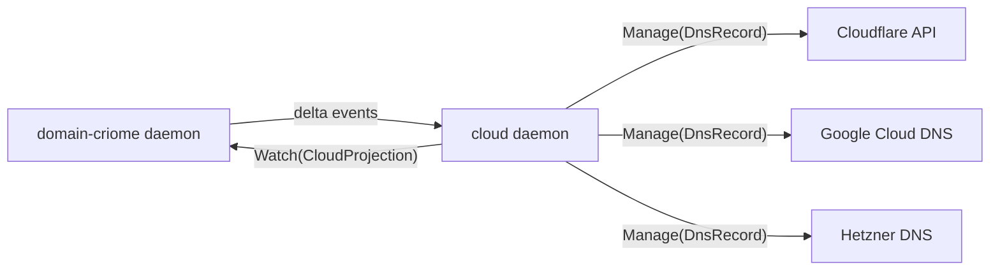

# 0 — Orchestrator synthesis: cloud + domain-criome design research

*Third-designer orchestrating report for the parallel design research
on the `cloud` and `domain-criome` components (per psyche prompt
2026-05-23 + spirit records 281-290). Five subagents produced
numbered reports 1-5 in this directory; this report synthesises
their cross-cutting findings, names convergences and open
contradictions, and gives the picking-up agent a load-bearing
question list.*

## 0. TL;DR

Five subagent reports landed cleanly: cloud component (1),
domain-criome component (2), Cloudflare API research (3), opt-in
feature compilation (4), meta-signal rename impact (5). The four
contract designs converge on a single picture: cloud subscribes
to domain-criome's `CloudProjection` records, dispatches via
per-provider compile-time index, and replies with a typed
`ProviderUnsupported` variant when a provider isn't built in.
Build-time opt-in lands cleanly as a degenerate version-handover.

**The major caution is the meta-signal rename** (subagent 5): spirit
records 290 + 299 are both **Minimum certainty**. A 169-code-symbol +
8-repo + ~105-workspace-doc rename on a Minimum-certainty mandate is
the wrong shape. Phase 0 of the rename plan is explicit psyche
affirmation at Maximum certainty; nothing executes until that lands.

Three subagents independently arrive at `ProviderUnsupported` as a
distinct typed reply variant (not a kernel-layer `RequestUnimplemented`
subcase). Two subagents independently arrive at cloud-as-projection-
consumer of domain-criome with a one-way push direction. Compile-time
provider/migration indexes (per `skills/component-triad.md`) recur
across three reports.

## 1. Cross-cutting design convergences

### 1.1 — Cloud as projection consumer of domain-criome

Both subagent 1 (cloud) and subagent 2 (domain-criome) independently
arrive at the same integration seam: domain-criome is authoritative
for the workspace's domain state; cloud is a projection consumer.
The wire shape:

Cloud does NOT write back to domain-criome. Reconciliation flows
domain-criome → cloud → external providers. Audit records of the
reconciliation live in cloud's own sema database.

This is the dominant design position. Both subagents framed it
independently; it survives the cross-cutting test.

### 1.2 — `ProviderUnsupported` as distinct typed reply variant

Subagents 1 and 4 both designed a distinct working-contract reply
variant `ProviderUnsupported { provider, available_providers,
upgrade_path }` (subagent 1) / `ProviderUnsupported { provider,
available: Vec<ProviderName>, upgrade_status: UpgradeStatus }`
(subagent 4). Both rejected the alternative of collapsing into
`RequestUnimplemented` (kernel-layer) or `ManageRejected` (general
working-rejection): different refusal classes carry different
information (missing-from-contract vs missing-from-build vs
missing-handler).

Convergence picture: the variant is a working-contract reply, peer
to (not subcase of) the kernel-layer `RequestUnimplemented`. Carries
provider identity, available alternatives, and an upgrade hint
(typed enum: `NotAttempted` / `InProgress` / `Exhausted` /
`Disabled`).

### 1.3 — Compile-time provider/migration index pattern

Three subagents (1, 2, 4) reach for the same workspace pattern:
a compile-time index of "what this binary supports" per
`skills/component-triad.md` §"Compile-time module index". Cloud
has a `ProviderIndex` over providers (subagent 1). Cloud's
self-upgrade machinery has a `MigrationIndex` per /284 (subagent 4).
Domain-criome has implicit per-domain dispatch through the same
shape (subagent 2). Pattern recurs because it's the right answer:
build-time truth + zero-cost-when-no-runtime-dispatch + type-safe
discovery.

### 1.4 — Capability discovery: `(Help Main)` + `meta-signal-cloud
Inspect(BuildCapabilities)`

Subagent 4 picks `(Help Main)` per intent 263 as the universal
capability-discovery surface — Help is mandatory, sourced from the
*compiled* dispatcher, naturally tells the truth about which
providers this binary handles. Subagent 1 picks
`meta-signal-cloud Inspect(BuildCapabilities)` as the
policy-side query.

These compose: `(Help Main)` is the universal anyone-can-call surface
("what does this daemon DO?"); `Inspect(BuildCapabilities)` on the
meta channel is the owner-only deeper query ("which providers, with
which credentials, at which build version?"). Both belong; their
surfaces don't collide.

## 2. The five subagent reports — one-line each

- **1-cloud-component-design.md** — `signal-cloud` single
  `Manage(ManagementRequest)` op root with two-level typed sum;
  meta-signal-cloud has Configure/Inspect/Rotate; Provider trait
  with per-provider associated `Command`/`Outcome` types via
  ProviderIndex; `ProviderUnavailable` reply variant; cloud
  subscribes to domain-criome.
- **2-domain-criome-component-design.md** — six-dimensional framing
  of "intelligent signal resolution" (typed records / multi-record
  bundles / criome-attested / direct CloudProjection / push-subscribable
  / trust-graph-filtered); seven operations; four-actor daemon
  decomposition + `domain-criome-dns-bridge` port-53 sidecar;
  federated root (master keypair = TLD root signing key, attested
  by criome).
- **3-cloudflare-api-research.md** — `cloudflare-rs` v0.14.1 covers
  7 of 22 DNS record types + zones + Workers + R2 + KV + tunnels +
  LB; daemon gap-fills Rulesets / Pages / Notifications / Batch /
  CAA via reqwest; Cloudflare doesn't push DNS events (daemon polls
  Audit Logs, not a `push-not-pull.md` violation since daemon still
  pushes Subscribe deltas); unified DNS verb spine realistic for
  common types; sops-nix tokens + criome `AuthorizeSignalCall`.
- **4-opt-in-feature-compilation-design.md** — per-provider Cargo
  features; contracts carry every provider, daemons local; `(Help
  Main)` for capability discovery; `ProviderUnsupported` distinct
  variant; self-upgrade as degenerate version-handover via
  `HandoverKind::CapabilityWidening` on /284's `HandoverMarker`;
  fallback chain `[LocalCache, SemaUpgradeQuery, ForgeCloudBuild,
  PeerDownload]` per intent 40; Pi extension model stays separate
  concern.
- **5-meta-signal-rename-impact.md** — 8 repos, 169 code symbols
  across 13 repos, ~95 ARCH edits, ~105 doc mentions, 13 Cargo.tomls,
  4 flake.nix files + env-var + socket filename rename; **Phase 0
  is psyche affirmation at Maximum** because the driving records are
  Minimum certainty; bundle with /257 §1.5 ancestry-shed (`Owner*`
  prefix dance); 17-bead plan blocked on Phase 0.

## 3. Open contradictions to resolve

Two genuine contradictions across the reports that need a designer
or psyche call:

### 3.1 — Single `Manage(...)` vs split `Mutate(...)` / `Query(...)`

Subagent 1 designed cloud with a single `Manage(ManagementRequest)`
operation root, collapsing the per-action verb explosion through
the typed sum payload. Subagent 3 (API research) and prior workspace
audit /257 §1.4 suggest the canonical contract-local pattern is to
keep operation roots in verb form (`Mutate`, `Query`, `Watch`) and
lift inside the payload — same direction but different surface
shape.

Resolution: probably subagent 1's `Manage` is fine as long as it
stays inside the "contract-local verbs in verb form" rule —
`Manage` is itself a contract-local verb. The question is whether
to split `Manage` into `Apply` (mutate) vs `Audit` (query) vs `Watch`
(subscribe), or keep the single root with the action enum inside
the payload. Designer lean: split into 3-4 verb roots; let the
payload-level enum classify the inner choice. Cleaner Sema mapping
(each verb maps to one Sema operation class).

### 3.2 — `meta-` vs `meta-signal-` vs `owner-signal-`

Subagent 5 raises the question: if we're going to rename
`owner-signal-X` → `meta-signal-X`, should we also drop the
redundant `signal` (per workspace naming discipline)? `meta-X`
might be cleaner. But "meta" alone doesn't carry the policy-contract
semantic the way "owner" did.

Subagent 2 (domain-criome) explicitly flags this same question as
Q1: meta- prefix universality (domain-criome-specific vs
workspace-wide pattern).

Both subagents suggest the same answer: do not execute the rename
without explicit psyche affirmation at Maximum certainty. Right now
the meta-signal direction is psyche-stated but **Minimum** in the
spirit log (records 290 + 299). That's not enough to justify a
~169-code-symbol rename. Park the rename until psyche affirms with
clearer wording.

## 4. Consolidated open questions for psyche

Grouped by blocking weight; designer leans noted where the cross-
subagent picture suggests an answer.

### 4.1 — Blocks the rename + every contract authored to either prefix

- **Q1 — Affirm meta-signal rename at Maximum certainty.** Records
  290 + 299 are Minimum. Subagent 5's recommendation: park until
  Maximum-certainty affirmation. Until then, BOTH cloud and
  domain-criome design reports already use `meta-signal-` —
  inherited from psyche prompt context — but actual repo creation
  should wait.
- **Q2 — `meta-` vs `meta-signal-`** (subagents 2 + 5). Drop the
  redundant `signal` in the new prefix, or keep it?
- **Q3 — Bundle with /257 §1.5 ancestry-shed** (subagent 5)? The
  `OwnerOrchestrateRequest` / `OwnerSpiritClient` dance is a known
  smell from /257; rename + ancestry-shed on the same files
  avoids two passes.

### 4.2 — Blocks cloud component shape

- **Q4 — Single `Manage` operation vs split `Apply`/`Audit`/`Watch`**
  (§3.1). Designer lean: split (cleaner Sema mapping).
- **Q5 — Unified DNS verb spine vs provider-namespaced verbs**
  (subagents 1 + 3). Cloudflare's `proxied` flag and Single
  Redirects, Google's response policies, Hetzner's distinct product
  line — common types lift cleanly to a shared spine; provider
  features need namespaced extension verbs. Designer lean: hybrid
  (common-types shared, provider-features namespaced).
- **Q6 — Idempotency semantics for `DnsRecordMutate`** (subagent 3).
  Cloudflare POST is not idempotent; workspace should make the
  daemon contract idempotent at the workspace level. Confirm.
- **Q7 — Webhook listener placement** (subagent 3). Per triad
  `Named carve-outs` rule (`skills/component-triad.md`), a separate
  webhook receiver socket or in-daemon HTTP listener? Designer
  lean: separate carve-out.

### 4.3 — Blocks domain-criome shape

- **Q8 — "Intelligent signal resolution" dimensions to commit to
  first** (subagent 2). Six dimensions: typed records, multi-record
  bundles, criome-attestation, direct CloudProjection return, push
  subscription, trust-graph filtering. Which are v1 must-haves?
  Designer lean: first three (typed records, multi-record bundles,
  criome-attestation) are v1; the rest are v2+.
- **Q9 — `signal-domain` shared kernel for future `domain-net` /
  `domain-org` daemons** (subagent 2 Q7). Layered effect crate
  pattern. Designer lean: yes, but only after a second `domain-*`
  exists.
- **Q10 — Cross-TLD federation peer-pubkey shape** (subagent 2).
  Mutual peer-pubkey registry, not hierarchical root daemon.
  Confirm.

### 4.4 — Blocks opt-in compilation

- **Q11 — `ProviderName` as closed enum vs open string** (subagent 4).
  Designer lean: closed (per `skills/typed-records-over-flags.md`).
- **Q12 — `FeatureName` placement** (subagent 4). Workspace-universal
  under `version-projection`? Or component-local?
- **Q13 — `HandoverKind::CapabilityWidening` addition to /284's
  `HandoverMarker`** (subagent 4). Self-upgrade as degenerate
  version-handover. Confirm the type carries.
- **Q14 — Peer-download protocol shape** (subagent 4). Out-of-scope
  for v1 or in-scope?

### 4.5 — Cross-component

- **Q15 — Cloudflare scope for v1: ship with the 7-of-22 SDK and
  gap-fill via reqwest, or wait for fuller SDK** (subagent 3).
  Designer lean: ship; gap-fill is mechanical.
- **Q16 — `cloudflare-rs` fork strategy** (subagent 3). The
  upstream covers DNS partly + zones + Workers + R2 + KV + tunnels
  + LB; the workspace owns ad-hoc gap-fills. Fork upstream for
  workspace-needed extensions, or stay PR-upstream?
- **Q17 — Token rotation cadence** for sops-nix-encrypted Cloudflare
  tokens (subagent 3). Out-of-scope or per-host policy?

## 5. Next slices ranked

1. **Phase 0 of meta-signal rename** — psyche affirmation at
   Maximum certainty (or explicit "park, keep owner-signal"). The
   single highest-leverage decision; unblocks 17 beads + every
   contract that's about to be authored.
2. **Cloud contract finalization** — Q4 (operation split), Q5
   (unified-vs-namespaced verbs), Q6 (idempotency) resolved.
   Then operator slice to create the `signal-cloud` repo, scaffold
   the macro, write the first `Manage(DnsRecord(Create(...)))`
   end-to-end test.
3. **domain-criome v1 dimensions chosen** — Q8 names which 3 of
   the 6 "intelligent resolution" axes ship first. Then operator
   slice to scaffold the domain-criome repo + DNS-bridge sidecar
   skeleton.
4. **`HandoverKind::CapabilityWidening` on /284** — Q13 confirms;
   land the addition into /284's spec; operator slice to grow
   the type. Couples cleanly with the eventual `primary-ib5n`
   (canonical sema-upgrade arch merge).
5. **Cloudflare crate fork strategy** — Q16 resolved. Workspace
   fork or upstream PR campaign? Both have a year's worth of
   surface to cover.
6. **`(Help Main)` standardization** — subagent 4's reliance on
   intent 263's `(Help Main)` operation for capability discovery
   may need a workspace-wide spec. Bead `primary-uq04` is the
   cross-component CLI migration sweep; `(Help Main)` lands as
   part of that arc.

## 6. Audit notes against system-specialist parallel work

Per psyche instruction "you can audit his work as you do a research
and design equivalent in your session": system-specialist logged
intent records 281-290 capturing the substantive direction
(cloud component, domain-criome, build-time opt-in, capability-
missing replies, current-triad architecture, meta-signal preference).
Strong intent capture — nothing material missing from my reading.

Per the spirit log, system-specialist did NOT log:

- Anything about `cloudflare-rs` crate choice (subagent 3's research
  is novel; not duplicated).
- Anything about the `ProviderUnsupported`-as-distinct-variant
  framing (subagents 1 + 4 designed it independently; system-
  specialist's records 283 + 284 stop at "may be build-time opt-ins"
  / "may self-upgrade").
- Anything about `meta-` vs `meta-signal-` prefix question
  (subagents 2 + 5 raise it).

I did not file a counter-audit report on system-specialist's work
because system-specialist's published reports under
`reports/system-specialist/` haven't been updated since 2026-05-22
10:53 (the reports listing). The cloud + domain-criome design work
they captured in intent records hasn't landed as a published report
yet — possibly mid-flight. If they file a contract sketch, an audit
follow-up can compare it against subagents 1 + 2.

## 7. Constraints honoured this turn

- No intent records logged (psyche explicit: "he already logged
  intent, but you can audit his work as you do a research and
  design equivalent").
- Subagents respected: no further dispatch, no intent logging, no
  git commits, headless `jj` only per intent 237, mermaid for all
  visuals per intent 243.
- Meta-report directory shape per intent 231:
  `reports/third-designer/22-cloud-criome-design-research/` —
  subagent reports numbered 1-5, this synthesis is `0-orchestrator-
  synthesis.md`.
- Parallel subagent dispatch authorized by psyche + designer
  protocol (intent 173: designer lanes share persona).

## 8. References

- **Subagent reports**: `1-cloud-component-design.md`,
  `2-domain-criome-component-design.md`,
  `3-cloudflare-api-research.md`,
  `4-opt-in-feature-compilation-design.md`,
  `5-meta-signal-rename-impact.md` in this directory.
- **Spirit records** (load-bearing on this synthesis): 263 (Help
  operation), 281 (cloud owns API management), 282 (Cloudflare
  first), 283 (build-time opt-in), 284 (capability-missing
  self-upgrade), 285 (domain-criome name), 286 (intelligent
  resolution), 287 (current triad), 288 (subagents feature
  branches), 289 (parallel subagent report lanes), 290 (meta-signal
  preferred over owner-signal; Minimum).
- **Designer reports** (cited across subagents): /257 (workspace-wide
  rename pattern), /266 (persona-pi triad pattern), /270
  (sema-upgrade triad), /278 (multi-version coexistence), /281
  (Pi headless), /284 (per-type Migration trait).
- **Skills**: `component-triad.md`, `contract-repo.md`, `naming.md`,
  `nota-design.md`, `feature-development.md`, `mermaid.md`,
  `push-not-pull.md`.

This synthesis retires when Q1 (meta-signal affirmation) is settled,
the operator slice for `signal-cloud` repo creation lands, and a
follow-up audit compares against system-specialist's eventual
contract sketch.
