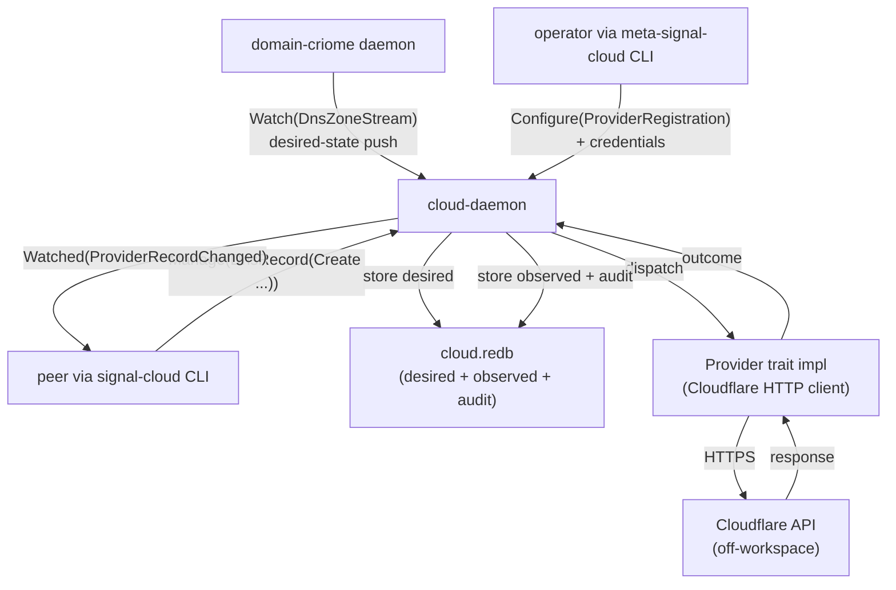
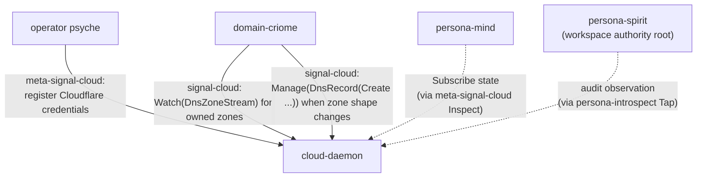
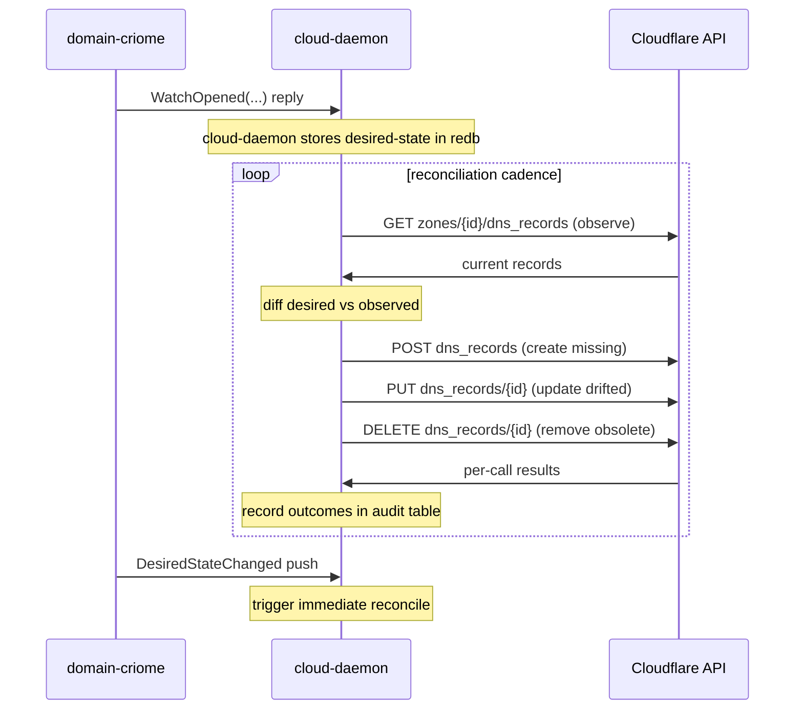

# 22/1 — `cloud` component triad contract design

*Designer (third-designer lane) sketch of the `cloud` component
triad — a Criome-stack component that owns cloud-provider API
management (Cloudflare DNS + redirect rules first, Google
Workspace and Hetzner later). Anchored on spirit intent records
281 ("cloud owns cloud-provider API management"), 282 ("Cloudflare
DNS and redirect rules first"), 283 ("provider integrations may
be build-time opt-ins"), 287 ("cloud and domain follow the
current triad signal sema executor architecture"), 290 (the
policy contract is `meta-signal-cloud`, not `owner-signal-cloud`).
Speculative pieces are inline-marked.*

## 0 · TL;DR

The `cloud` triad is the workspace's wedge between the typed
sema-executor architecture and the off-workspace cloud-provider
HTTP APIs. The shape:

- **Repositories.** `cloud/` (daemon + bundled `cloud` CLI),
  `signal-cloud/` (working contract — peer-callable), and
  `meta-signal-cloud/` (policy contract — owner-only, **new
  prefix** per intent 290 replacing `owner-signal-`).
- **Single working operation root: `Manage`.** Provider-shaped
  operations (`CreateDnsRecord`, `AddRedirectRule`, ...) collapse
  into one `operation Manage(ManagementRequest)` where
  `ManagementRequest` is a typed sum dispatching first on
  **target kind** (`DnsRecord`, `RedirectRule`, ...) and then on
  **action** (`Create`, `Update`, `Delete`, `List`). Companion
  read operations: `Observe(Observation)` for one-shot queries
  and `Watch(Subscription) opens StateStream` for state-plus-
  delta.
- **`meta-signal-cloud` carries authority + credential
  rotation, build-time opt-in queries, and provider
  registration policy.** Provider credentials are owner-only;
  no peer asserts a Cloudflare API token through the working
  channel.
- **Daemon shape.** One in-tree `Provider` trait per cloud
  vendor; the trait is the lowering boundary between contract
  `Manage(...)` operations and per-provider HTTP effects. The
  three-layer rule lands cleanly: Contract Operation `Manage` →
  Component Command `ProviderCommand::CloudflareDnsCreate` →
  Sema Operation `Mutate` (for state-changing operations) or
  `Match` (for queries).
- **Build-time opt-in surfaces over the wire as
  `Reply::ProviderUnavailable { provider, why, advise }`** —
  the daemon answers truthfully when a provider was compiled
  out. `meta-signal-cloud` exposes a `Inspect(ProviderRegistry)`
  reply so callers can ask **before** invoking which providers
  the binary supports.
- **Integration seam with `domain-criome`** is one-way:
  `cloud` subscribes to a domain-criome `Watch(DnsZoneStream)`
  subscription that pushes desired-state records; the
  cloud daemon reconciles desired-state-from-domain with
  observed-state-at-provider via its own working state. No
  domain-criome design work crosses the seam here.

The full report is below.

## 1 · `signal-cloud` working contract sketch

`signal-cloud` is the peer-callable surface for cloud-provider
management. Every name in this section is **contract-local** —
inside `signal-cloud`, the type for a Cloudflare DNS record is
`DnsRecord`, not `CloudDnsRecord` (per ESSENCE §"Naming" and
the §1.5 audit in /257). The contract crate name supplies the
"cloud" context.

### 1.1 Operation root: collapse the per-action verbs

The naive shape replicates the Cloudflare REST surface one-to-one:

```nota
;; STALE — do not adopt
operation CreateDnsRecord(...)
operation UpdateDnsRecord(...)
operation DeleteDnsRecord(...)
operation ListDnsRecords(...)
operation AddRedirectRule(...)
operation RemoveRedirectRule(...)
...
```

This is the same shape `signal-persona-mind` had to lift away
from per /257 §1.4 — repeated-suffix smell across siblings. The
schema-as-tree discipline says: when a category recurs across
sibling variants, lift the category into structure. There are
two recurring axes:

- **The target kind** (`DnsRecord`, `RedirectRule`, future
  `DnsZone`, `WorkerScript`, ...).
- **The action** (`Create`, `Update`, `Delete`, `List`).

Both are real categories. Collapse the per-action verbs into a
single contract-local verb `Manage` whose payload is a typed sum
dispatching first on target kind, then on action.

The shape:

```nota
operation Manage(ManagementRequest)
operation Observe(Observation)
operation Watch(Subscription) opens StateStream
operation Unwatch(SubscriptionToken)
```

The `ManagementRequest` enum:

```nota
;; Variant tag = target kind; payload = action-on-that-kind
ManagementRequest
  ::DnsRecord(DnsRecordAction)
  ::RedirectRule(RedirectRuleAction)
  ::WorkerScript(WorkerScriptAction)         ;; future
  ::MailRecord(MailRecordAction)             ;; future
```

The `DnsRecordAction` enum (one example; redirect-rule is
parallel):

```nota
DnsRecordAction
  ::Create(DnsRecordDeclaration)
  ::Update(DnsRecordRevision)
  ::Delete(DnsRecordReference)
  ::List(DnsRecordFilter)
```

Where `DnsRecordDeclaration`, `DnsRecordRevision`,
`DnsRecordReference`, `DnsRecordFilter` are positional NOTA
records the contract owns. `DnsRecordReference` carries the
typed identity (provider's record id + the zone it lives in);
`DnsRecordDeclaration` carries the desired record content (name,
record type as a typed enum `A | Aaaa | Cname | Txt | Mx | ...`,
content, ttl as a typed `Ttl` newtype).

Why the two-level enum and not a flat enum:

- **The schema reveals the categorical structure.** Reading a
  contract `(Manage (DnsRecord (Create ...)))` instantly
  surfaces "this is a DNS-record management request, specifically
  a create" — both axes are typed.
- **Per-target-kind invariants land in the kind enum.**
  `DnsRecord` and `RedirectRule` don't share an "action" type
  (a DNS record can't be `Reorder`d the way a redirect rule can).
  The kind enum scopes its own action enum to the actions that
  make sense for that kind.
- **New target kinds are one-variant edits.** Adding
  `WorkerScript` is one variant on `ManagementRequest` plus one
  per-action enum; no flat-enum explosion.

`Observe` mirrors the same shape with read-only actions, used
when the caller wants one-shot observation outside any
subscription:

```nota
operation Observe(Observation)

Observation
  ::DnsRecord(DnsRecordObservation)
  ::RedirectRule(RedirectRuleObservation)

DnsRecordObservation
  ::Get(DnsRecordReference)
  ::List(DnsRecordFilter)
  ::Diff(ZoneReference)                  ;; desired-vs-observed
```

The `Diff` variant deserves its own variant because the
desired-state-vs-observed-state comparison is a load-bearing
view for the reconciler — readers should be able to grep
`Diff` and find every place the workspace asks "what does
this cloud zone look like compared to the policy I want."

### 1.2 Reply variants

Reply variants are verb-past-tense matching their operation per
/255 / `skills/contract-repo.md` §"Reply discipline". With a
single operation root `Manage`, the success reply is `Managed`;
the rejection is `ManageRejected`. The same shape goes for
`Observe` → `Observed`, `Watch` → `WatchOpened`.

```nota
reply Reply {
    Managed(ManagementOutcome),
    ManageRejected(ManageRejection),
    Observed(ObservationResult),
    ObserveRejected(ObserveRejection),
    WatchOpened(SubscriptionOpened),
    WatchRetracted(SubscriptionRetracted),
    Watched(SubscriptionEvent),            ;; on event delivery
    ProviderUnavailable(ProviderUnavailability),
    RequestUnimplemented(RequestUnimplemented),
}
```

The `ProviderUnavailable` reply is the **build-time opt-in wire
surface** (see §4). It is a reply variant, not a sub-case of
`ManageRejected`, because the rejection reason ("we don't have
the code linked") is a static property of the binary, not a
runtime policy decision — distinguishing it at the variant level
keeps callers from confusing "Cloudflare said no" from "this
binary can't speak Cloudflare."

The `Managed` outcome is a typed sum mirroring the
`ManagementRequest` shape:

```nota
ManagementOutcome
  ::DnsRecord(DnsRecordOutcome)
  ::RedirectRule(RedirectRuleOutcome)

DnsRecordOutcome
  ::Created(DnsRecordCreated)
  ::Updated(DnsRecordUpdated)
  ::Deleted(DnsRecordDeleted)
  ::Listed(DnsRecordList)
```

The receipts carry provider-reported facts: created record's
provider id, the provider's API response timestamp, any
mutation-side-effects the provider reports (e.g., TTL clamping).

### 1.3 Observable block — mandatory

Per /257 §1.10 and intent record 2026-05-20T02:00:00Z, every
triad component declares the Tap/Untap observable block. The
cloud daemon publishes operation_received + effect_emitted events
into the persona-introspect plane via the macro-injected Tap
surface:

```rust
signal_channel! {
    channel Cloud { ... }
    reply Reply { ... }
    event Event {
        ProviderRecordChanged(ProviderRecordChanged) belongs StateStream,
        ProviderRateLimited(ProviderRateLimited) belongs StateStream,
    }
    stream StateStream {
        token SubscriptionToken;
        opened SubscriptionOpened;
        event ProviderRecordChanged;
        event ProviderRateLimited;
        close Unwatch;
    }
    observable {
        filter default;
        operation_event OperationReceived;
        effect_event EffectEmitted;
    }
}
```

The `ProviderRateLimited` event matters specifically for cloud:
provider rate limits (Cloudflare's 1200 req / 5 min) are an
out-of-workspace constraint the daemon must surface so its
upstream callers (domain-criome reconcilers, owner-driven
manual operations) can back off.

### 1.4 Observation/reconciliation as a sub-design

The Cloudflare API is **stateful but not authoritative** — the
zone is the truth, and what the workspace records about a zone
is its desired-state (cluster-data-shaped: which records SHOULD
exist). The daemon's working state mirrors both: a `desired`
table populated through `Manage(...)` calls, and an `observed`
table reconciled from the provider. The contract surfaces both
via the `Diff` observation; the reconciler details belong in
§3, not in the contract sketch.

## 2 · `meta-signal-cloud` policy contract sketch

Per intent record 290, the policy-contract prefix is
**`meta-signal-`**, not `owner-signal-`. This is a workspace-
level rename — the contract is structurally the
owner-only-authority surface that the rest of the workspace
calls `owner-signal-<component>` in other triads. For the
`cloud` triad, follow the new prefix.

Inside `meta-signal-cloud`, the type for the credential bundle
is `Credentials`, not `CloudCredentials` or
`ProviderCredentials` — the crate name supplies "cloud," and
the operation context (`Configure(ProviderRegistration ...)`)
supplies "provider." The naming pair from `skills/naming.md`
applies.

### 2.1 Operations

```nota
operation Configure(Configuration)
operation Inspect(Inspection)
operation Rotate(CredentialRotation)
operation Disable(ProviderReference)
operation Enable(ProviderReference)
```

`Configure` is the contract-local verb for owner-set policy —
provider registration, credential installation, build-opt-in
status overrides (for the case where the binary was built with
a provider compiled in but the owner wants it temporarily
inactive).

`Inspect` is the policy-side read surface, distinct from the
working `Observe` — `Inspect` reveals **what the daemon is
configured to do**; `Observe` reveals **what the daemon sees at
the provider**.

`Rotate` is the explicit credential-rotation verb. It is a
sibling of `Configure` (not a sub-action) because credential
rotation is a load-bearing security operation that deserves its
own variant — easy to grep, easy to audit, easy for the
introspect plane to filter on.

`Disable` and `Enable` are lifecycle on a per-provider basis
— the owner can turn a provider off without uninstalling the
credentials (rate-limit emergency, vendor outage, deliberate
cost-cap).

### 2.2 Payloads

```nota
Configuration
  ::ProviderRegistration(ProviderRegistration)
  ::ZoneRegistration(ZoneRegistration)
  ::RateLimitPolicy(RateLimitPolicy)
  ::ReconciliationCadence(ReconciliationCadence)

ProviderRegistration
  ::Cloudflare(CloudflareRegistration)
  ::GoogleWorkspace(GoogleWorkspaceRegistration)     ;; future
  ::Hetzner(HetznerRegistration)                     ;; future

CloudflareRegistration
  ::ApiToken(Credentials)
  ::AccountIdentifier(AccountIdentifier)
  ::DefaultZoneIdentifier(ZoneIdentifier)
```

The `Credentials` type is a `NotaTransparent` wrapper over an
encrypted byte sequence; the contract does not specify the
encryption scheme (that's daemon-internal, likely backed by an
OS keyring or by a sema-engine-managed key table).

`Inspection` mirrors `Configuration` with read-only variants:

```nota
Inspection
  ::ProviderRegistry(ProviderRegistryInspection)
  ::ZoneRegistry(ZoneRegistryInspection)
  ::BuildCapabilities(BuildCapabilitiesInspection)
  ::ReconciliationStatus(ReconciliationStatusInspection)
```

`BuildCapabilities` is the **dynamic surface for build-time
opt-in** (per intent 283; see §4). The reply tells the caller
which providers the binary was compiled with — distinct from
which providers the owner has registered. The two states
intersect: a provider is *usable* iff it was compiled in AND
the owner has registered credentials.

### 2.3 Reply variants

```nota
reply Reply {
    Configured(ConfigurationOutcome),
    ConfigureRejected(ConfigurationRejection),
    Inspected(InspectionResult),
    InspectRejected(InspectionRejection),
    Rotated(CredentialRotationOutcome),
    RotateRejected(RotationRejection),
    Enabled(ProviderLifecycleOutcome),
    Disabled(ProviderLifecycleOutcome),
    RequestUnimplemented(RequestUnimplemented),
}
```

No `operation` field on `RequestUnimplemented` (per /257 §1.6
— positional reply addressing already supplies the operation
context).

### 2.4 What `meta-signal-cloud` does NOT carry

- **Per-call HTTP-level retry policy** — that's runtime
  behavior of the provider trait inside the daemon. The
  policy is daemon-internal.
- **Per-record metadata that desired-state already carries**
  — record content, TTL, name. Those belong on the working
  `Manage(...)` request because they're the contents of each
  individual operation.
- **Provider-API endpoint URLs** — these are constants in the
  binary's provider implementations, not configuration. Per
  the cluster-data principle (intent/horizon.nota
  2026-05-20T14:50): standardized components don't carry
  endpoints in policy.

## 3 · Daemon shape + provider abstraction

The `cloud` daemon (`cloud-daemon`) is a sema-executor wrapping
a static set of provider implementations. The bundled CLI is
`cloud`; together they form the runtime crate.

### 3.1 Three-layer mapping for cloud

The component-triad three-layer rule applied:

```
Contract Operation (signal-cloud)
  Manage(ManagementRequest)
  Observe(Observation)
    |
    v
Component Command (cloud daemon, per-provider)
  ProviderCommand
    ::CloudflareDnsCreate(CloudflareDnsCreateCommand)
    ::CloudflareDnsUpdate(CloudflareDnsUpdateCommand)
    ::CloudflareDnsDelete(CloudflareDnsDeleteCommand)
    ::CloudflareRedirectAdd(...)
    ::CloudflareRedirectRemove(...)
    ::GoogleMailboxCreate(...)               ;; future, behind feature flag
    ::HetznerServerCreate(...)               ;; future
    |
    v
Sema Operation (signal-sema classification)
  Assert | Mutate | Retract | Match | Subscribe | Validate
```

The lowering happens in the daemon (per
`skills/contract-repo.md` §"Lowering is daemon logic"). A
`Manage(DnsRecord(Create ...))` lowers to a
`ProviderCommand::CloudflareDnsCreate` Command, which is a
`Mutate` at the Sema classification layer (writes to the
desired-state table) AND triggers an outbound HTTP call to
Cloudflare AND assert-records the outbound call in the
audit table.

### 3.2 The provider trait

The in-tree abstraction is a Rust trait. Sketch:

```rust
trait Provider: Send + Sync + 'static {
    /// The identifier the workspace uses for this provider on
    /// the wire (matches the meta-signal-cloud
    /// ProviderRegistration variant tag).
    fn identifier(&self) -> ProviderIdentifier;

    /// Dispatch a typed command to the provider's HTTP surface.
    /// The command type is per-provider; the outcome is the
    /// contract-shaped outcome the daemon will lift into
    /// signal-cloud Reply.
    async fn dispatch(
        &self,
        command: Self::Command,
        credentials: &Credentials,
    ) -> Result<Self::Outcome, ProviderError>;

    /// Begin observing provider-side state for the zones the
    /// daemon has subscribed to. Returns a stream of typed
    /// observations that the daemon merges into its observed-
    /// state table.
    async fn observe_zone(
        &self,
        zone: ZoneReference,
        credentials: &Credentials,
    ) -> ZoneObservationStream;

    /// Report build-time identity facts (provider version,
    /// which API features the binary was compiled with). Reads
    /// out through meta-signal-cloud BuildCapabilities.
    fn build_facts(&self) -> BuildFacts;

    type Command;
    type Outcome;
}
```

The associated types `Command` and `Outcome` are per-provider —
`CloudflareProvider::Command` is `CloudflareCommand`, etc. The
daemon's `ProviderCommand` outer enum is the workspace-side
type that erases the per-provider associated type behind a
typed variant; the daemon's dispatch layer matches on the outer
variant and delegates to the right concrete provider.

### 3.3 Provider registration as a compile-time module index

Per `skills/component-triad.md` §"Compile-time module index for
triad-internal dispatch", the cloud daemon's provider set is a
compile-time index, not runtime registration:

```rust
pub struct ProviderModule {
    identifier: ProviderIdentifier,
    construct: fn(&BuildFacts) -> Box<dyn Provider<Command = ProviderCommand,
                                                   Outcome = ProviderOutcome>>,
}

pub struct ProviderIndex { modules: Vec<ProviderModule> }

impl ProviderIndex {
    pub fn prototype() -> Self {
        Self { modules: vec![
            #[cfg(feature = "cloudflare")]
            ProviderModule {
                identifier: ProviderIdentifier::Cloudflare,
                construct: cloud::cloudflare::construct,
            },
            #[cfg(feature = "google-workspace")]
            ProviderModule {
                identifier: ProviderIdentifier::GoogleWorkspace,
                construct: cloud::google_workspace::construct,
            },
            #[cfg(feature = "hetzner")]
            ProviderModule {
                identifier: ProviderIdentifier::Hetzner,
                construct: cloud::hetzner::construct,
            },
        ]}
    }
}
```

The `#[cfg(feature = ...)]` is the **single point where
build-time opt-in lands** in the daemon code. Each feature
flag elides one row from the index; the rest of the daemon
asks the index "do you have a Cloudflare provider?" and
answers truthfully when the row isn't there.

(Speculative: the cfg-feature is one valid surface for the
opt-in; subagent 4 owns the actual mechanism choice — `cfg`
vs `cargo build --features` vs Nix derivation arguments. The
contract design here is decoupled from the choice: whatever
the mechanism, the daemon ends up with an in-tree index
whose rows are present-or-absent per build.)

### 3.4 Data flow



The reconciler is a daemon-internal periodic loop that
compares desired vs observed and issues provider commands to
converge. Reconciliation cadence is policy (lives in
`meta-signal-cloud`'s `ReconciliationCadence`); the loop logic
is daemon-internal.

### 3.5 Authority chain — who issues what



`cloud` is at the leaf of the authority graph for the
provider-side concerns: it doesn't issue Mutate orders to other
persona components. It RECEIVES Mutate-class operations from
`meta-signal-cloud` callers (registration, credential rotation,
provider disable/enable) and from `signal-cloud` callers
(state changes). It asserts events into the introspect plane.

## 4 · Build-time opt-in wire surface

Per intent record 283, provider integrations may be build-time
opt-ins — a CriomOS image targeting only Cloudflare can compile
the Google Workspace provider out entirely. The wire-level
question: **what does the daemon say when a peer asks it to
do something with a provider that isn't in the binary?**

### 4.1 Design choice

The reply must distinguish three orthogonal failure modes:

| Failure | Reply variant | Meaning |
|---|---|---|
| Provider compiled out of THIS binary | `ProviderUnavailable` | static; advise rebuild or different binary |
| Provider compiled in but owner-disabled at runtime | `ManageRejected(ProviderDisabled)` | dynamic policy; advise meta-signal `Enable` |
| Provider call attempted but provider API said no | `ManageRejected(ProviderRefused)` | upstream error; advise read provider error detail |

`ProviderUnavailable` is its own top-level reply variant — not
a sub-case of `ManageRejected` — because the distinction is
*structural*. A caller deciding "should I retry?" or "should
I escalate?" wants the answer in the variant shape, not in a
sub-payload.

### 4.2 Variant payload

```nota
ProviderUnavailability
  ::Provider(ProviderIdentifier)
  ::Why(UnavailabilityReason)
  ::Advise(UpgradeAdvice)

UnavailabilityReason
  ::NotBuilt                                ;; cfg feature off
  ::BuildTooOld(SemanticVersion)             ;; provider rev mismatch (future)
  ::DependencyUnavailable(DependencyName)    ;; e.g. missing system lib

UpgradeAdvice
  ::RebuildWithFeature(FeatureFlagName)
  ::SwitchBinary(BinaryReference)
  ::ContactOperator
```

The `Advise` payload is meant to be **agent-actionable** —
when an agent sees `ProviderUnavailable { provider: Cloudflare,
why: NotBuilt, advise: RebuildWithFeature("cloudflare") }`, it
can decide whether to escalate (ask the operator to rebuild) or
work around it.

### 4.3 Pre-call capability query

Callers don't have to discover the build set by attempting
operations and getting refused. `meta-signal-cloud` exposes
`Inspect(BuildCapabilities)`:

```nota
;; Request:
(Inspect (BuildCapabilities (None None)))

;; Reply:
(Inspected
  (BuildCapabilities
    (BuildCapabilitiesResult
      [(ProviderBuildFact Cloudflare Available (SemanticVersion 4 12 0))
       (ProviderBuildFact GoogleWorkspace NotAvailable None)
       (ProviderBuildFact Hetzner NotAvailable None)])))
```

The list-of-facts shape lets callers cache the answer per
daemon-startup; the facts don't change without a daemon
restart (the cfg flags are frozen at compile time).

(Speculative: whether the daemon also re-emits a
`BuildCapabilitiesChanged` event when a future hot-swap-binary
mechanism appears — not a current concern; cross out for now.)

### 4.4 Wire-shape rationale

`ProviderUnavailable` on `signal-cloud` (working) is the
"caller tried something they didn't know wasn't supported"
path. `BuildCapabilities` on `meta-signal-cloud` (policy) is
the "caller asks ahead" path. Two surfaces by two callers, but
both rooted in the same `BuildFacts` daemon-internal source.

The daemon's lowering for a `ProviderUnavailable` reply is the
same regardless of cause: look up the provider in the in-tree
index, if absent, format the reply with the cfg-feature name
that would have built it in. No state mutation, no audit
record (per skeleton-honesty — declined-before-attempt is a
typed reply, not a logged action).

## 5 · Integration seam with `domain-criome`

`domain-criome` is its own component (subagent 2's territory).
The seam between `domain-criome` and `cloud` is one-way data
flow: domain-criome owns "which domains the workspace owns and
what records they should hold"; cloud owns "what to push to
which provider to realize those records."

### 5.1 Subscription shape

The cloud daemon initiates a working-channel subscription to
domain-criome:

```nota
;; cloud-daemon → domain-criome-daemon
(Watch (DesiredStateSubscription
          (ZoneFilter All)
          (RecordFilter All)))

;; domain-criome replies:
(WatchOpened (SubscriptionOpened (SubscriptionToken 7)))

;; domain-criome pushes desired-state events as zone facts change:
(DesiredStateChanged
  (DnsZoneDesired
    (ZoneReference example.com)
    [(DnsRecordDesired (RecordName www) (RecordType A) (Content 192.0.2.1) (Ttl 300))
     (DnsRecordDesired (RecordName api) (RecordType Cname) (Content api.svc.example.com) (Ttl 60))]
    (PreferredProvider Cloudflare)))
```

The contract for that subscription lives in `signal-domain-
criome` (subagent 2's territory), but the **shape this
sketch implies** is a `DesiredStateSubscription` that delivers
`DnsZoneDesired` records. The cloud daemon translates each
`DnsRecordDesired` into a `ManagementRequest` against the
provider named by `PreferredProvider`.

(Speculative on whether `PreferredProvider` is a per-record or
per-zone field — sketch above puts it at zone level, but the
real shape lives in domain-criome's contract design. This
report does not claim authority on the domain-criome side.)

### 5.2 Reconciler loop



Reconciliation is a daemon-internal concern (the cadence is
policy via `meta-signal-cloud`, the loop is daemon code).

### 5.3 What `cloud` does NOT do for domain-criome

- **cloud does not validate domain ownership.** That belongs in
  domain-criome (does the workspace own example.com?). cloud
  trusts its domain-criome subscription.
- **cloud does not host the source-of-truth for zone records.**
  Desired-state lives in domain-criome's redb; cloud's redb is
  a cache of the subscription state plus per-provider observed
  state. The cloud daemon does not lose data on factory-reset
  except for credentials and observation history — the desired
  state re-streams from domain-criome.
- **cloud does not call domain-criome's contract** for any
  mutation. cloud is a one-way consumer. If a provider reports
  something cloud can't reconcile (e.g., a DNS record exists at
  the provider that domain-criome didn't ask for), cloud surfaces
  this as an event/observation, not a write-back to
  domain-criome.

(Designer note: this one-way shape is the **load-bearing seam
design**. Two-way coupling would force domain-criome to
understand provider quirks; the one-way shape keeps the two
components composable and the abstraction crisp.)

## 6 · Open design questions

(Items to surface for psyche resolution before operator builds.)

### 6.1 — `meta-signal-` prefix universality

Intent 290 introduces `meta-signal-cloud` as the policy contract
prefix for this component. Does the new prefix retroactively
apply to every `owner-signal-<component>` in the workspace, or
is it a per-component choice? The workspace currently has 9+
`owner-signal-*` repos (per /257). If the rename applies
universally, it's a workspace-level slice; if it's
component-local, the `cloud` triad introduces a name
inconsistency. **Psyche question.**

(Designer lean: probably workspace-wide rename to
`meta-signal-*`, since the policy-contract naming was
recently affirmed as universal per intent 295. But not a
claim — the rename slice itself is psyche territory.)

### 6.2 — Single working operation vs two-axis split

This report collapses every working-channel verb under a single
`Manage(ManagementRequest)`. An alternative shape is two
operations: `Mutate(MutationRequest)` and `Query(QueryRequest)`.
Designer lean is the single `Manage` because the two-axis
collapse (target × action) already lives inside the payload —
splitting the verb gains nothing the schema doesn't carry. But
the Query/Mutate split is a legitimate alternative if the
operator finds the single-root unwieldy at implementation time.
**Operator feedback during pilot.**

### 6.3 — Provider rate-limit policy as contract or daemon

`ProviderRateLimited` is on the event stream. Whether
**per-provider rate-limit windows** are part of the working
contract (callers can ask "how close am I to the rate limit?")
or are daemon-internal is undesigned. Designer lean: a `Observe
(ProviderRateLimit ...)` variant exists so observability is on
the wire; concrete shape deferred until reconciler tuning makes
the question concrete.

### 6.4 — Credential storage backing

`Credentials` is a `NotaTransparent` byte wrapper. The actual
encryption-at-rest mechanism is daemon-internal. Open: should
the cloud daemon reuse a workspace key-vault component, or
own its own encryption? **Speculative-pending-research.**

### 6.5 — Worker-script and email-routing scope

Cloudflare's API surface is much broader than DNS + redirects
(Workers, R2, Email Routing, Pages, etc.). The contract sketch
above pre-positions `WorkerScript` and `MailRecord` as future
target kinds, but the actual decision to ship them belongs to
the operator + psyche when a real use case arrives. Designer
recommendation: **launch with `DnsRecord` + `RedirectRule`
only**, add target-kind variants when concrete consumers
appear. Per ESSENCE: don't design for hypothetical futures.

### 6.6 — Bootstrap-policy for cloud

The cloud daemon has policy state (registered providers, zone
registry, rate-limit policies). Per triad invariant 5, that
state bootstraps from `bootstrap-policy.nota` on first start.
The bootstrap shape is undesigned here. Likely contents:

```nota
;; cloud/bootstrap-policy.nota (sketch)
(ProviderRegistration (Cloudflare (Credentials ...)))
(ZoneRegistration (example.com))
(ReconciliationCadence (Period (Seconds 300)))
```

(Speculative — actual shape lives in
`meta-signal-cloud`'s `Configuration` enum and replays the
owner-Mutate path at first start.)

### 6.7 — Subscription scope to domain-criome

The `Watch(DesiredStateSubscription (ZoneFilter All))` shape
above subscribes to ALL zones. In multi-zone deployments,
should cloud subscribe per-zone? Designer lean: All-zones is
fine until subscription churn becomes a load problem; the
schema supports per-zone filtering when needed. Coordinate
with subagent 2.

### 6.8 — Validation operation

The Sema vocabulary has `Validate` (dry-run without commit).
For cloud, this would be "if I issued this Manage, would the
provider accept it?" — a useful operation for high-stakes
mutations. Not in the current sketch; could land as
`operation Validate(ValidationRequest)` mirroring `Manage`.
Defer until a concrete use case appears.

## 7 · References

- `intent/spirit.nota` records 281, 282, 283, 287, 290 (cited
  in the prompt; not visible in file-based intent log but
  authoritative per psyche message of this turn).
- `reports/designer/266-persona-pi-triad-design.md` — canonical
  triad sketch pattern (section structure + dual-path note +
  speculative-flagging convention).
- `reports/designer/257-signal-contracts-names-and-shape-audit.md`
  — name + shape discipline; especially §1.4 (repeated-suffix
  lift), §1.5 (no ancestry prefix), §1.6 (no `operation`
  field on `RequestUnimplemented`), §1.10 (observable block
  mandatory).
- `skills/component-triad.md` — five invariants, three-layer
  rule, single-argument rule, compile-time module index.
- `skills/contract-repo.md` — what lives in a `signal-*`
  contract crate; reply discipline (verb-past-tense).
- `skills/naming.md` + `ESSENCE.md` §"Naming" — full English
  words + names don't carry full ancestry.
- `skills/nota-design.md` — positional records, PascalCase
  variants, no labeled fields.
- `intent/component-shape.nota` records cited inline above
  (especially 2026-05-20T02:00:00Z on Tap/Untap, 2026-05-19T19:45
  on contract-local verbs, 2026-05-20T00:07:55+02:00 on
  repeated-suffix lift).
- `intent/horizon.nota` 2026-05-20T14:50 on cluster-data
  minimality — informs why operational endpoints aren't in the
  cloud contract.
- `signal-persona-spirit/src/lib.rs` lines 433-468 — the
  canonical `signal_channel!` macro shape this sketch follows.
- Coordinate with subagent 2 (domain-criome) on the
  `DesiredStateSubscription` contract shape it owns.
- Coordinate with subagent 4 (build-time opt-in) on the
  cfg-feature mechanism; the wire surface here is decoupled
  from the mechanism choice.

This report retires when (a) psyche resolves §6.1, §6.5, §6.6;
(b) domain-criome's `signal-domain-criome` design lands and the
seam §5 can be made concrete against the actual subscription
shape; (c) operator picks up the cloud triad pilot and the
`Manage` vs `Mutate+Query` question resolves at implementation
time.
