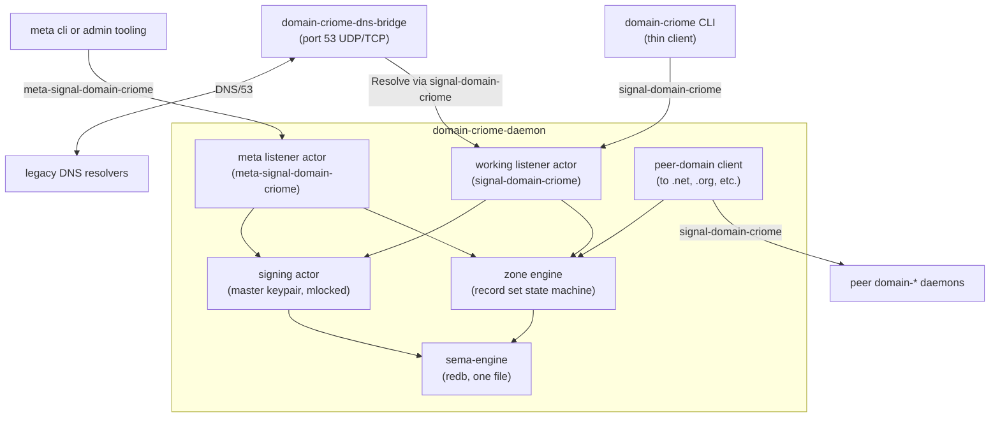
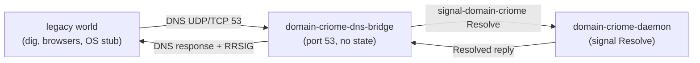
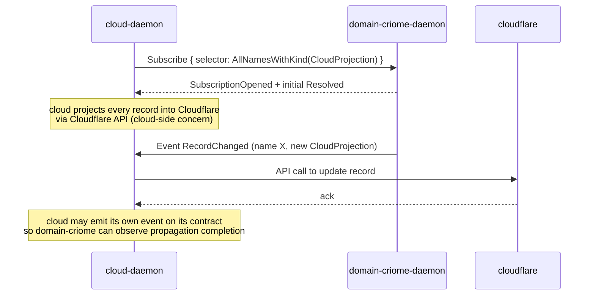

# 2 - domain-criome component design (third-designer subagent 2)

*Designer sketch of the `domain-criome` triad: the workspace's
authority for the `.criome` TLD, fulfilled as a name server that
speaks the workspace's signal protocol intelligently. Designed
under the parallel-main designer protocol; this is research, not
settled intent. Settled load-bearing facts come from spirit
records 285-287 + 290 cited verbatim in the parent dispatch.*

Settled material is marked `(settled)`; speculative direction is
marked `(speculative)`. Treat speculative material as **not** a
designer commitment; the prime designer + psyche settle the
contested calls.

## 0 . TL;DR

- **`domain-criome` is a triad.** Daemon `domain-criome-daemon`,
  CLI `domain-criome`, working signal `signal-domain-criome`,
  policy signal `meta-signal-domain-criome` (per spirit record
  290 — note the `meta-` prefix, not `owner-`). Follows the
  triad shape per `skills/component-triad.md`; **signal sema
  executor** architecture per spirit record 287.
- **Naming pattern** (settled): `domain-criome`, not
  `criome-domain` — `name.criome` puts the suffix on the right,
  so the component name follows lexical suffix order. Future
  family: `domain-net`, `domain-org`, `domain-com`.
- **"Intelligent signal resolution" means six concrete things**
  DNS cannot do: (1) **typed records** beyond the DNS RR
  zoo, (2) **multi-record bundles** answered in one round-trip,
  (3) **signed responses** by criome attestation (not just
  DNSSEC), (4) **signal-cloud record set returned directly**
  (the resolver answers with the deployment record, not a
  fan-out of A/MX/TXT), (5) **subscribable resolution** (push
  on record change, not poll), (6) **resolution constrained by
  the caller's trust graph** (the answer is "what *you* are
  authorised to see"). Section 1 expands.
- **Working contract operations**: `Resolve`, `Register`,
  `Renew`, `Transfer`, `Subscribe`, `Lookup`. Section 2.
- **Policy contract operations** (meta-signal): `Configure`,
  `Mutate` (registration policy), `Issue` (TLD-zone-signing
  authority), `Revoke`, `Inspect`. Section 3.
- **Daemon storage** uses sema-engine (one redb per component
  per triad invariant 5); two table categories: policy (TLD
  rules, signing keys, allowed registrants) and working
  (registration records, resolution cache, lease state).
  Section 4.
- **DNS interop is a translation seam, not a triad leg.** The
  component ships a sidecar `domain-criome-dns-bridge` that
  speaks port-53 DNS to legacy resolvers, framing each query
  as a `Resolve` signal call to its own daemon. Section 4.
- **The cloud-domain seam is push-pull asymmetric**:
  `domain-criome` is authoritative for the `.criome` zone;
  `cloud` projects the zone into Cloudflare via a
  `cloud`-side subscription on `signal-domain-criome`'s
  `Subscribe` stream. `domain-criome` *publishes*; `cloud`
  *consumes*. Section 5.
- **The Criome domain name root registry IS
  `domain-criome` itself.** It is *not* a separate root daemon
  that all `domain-*` daemons trust. The trust anchor for the
  TLD is the component's own master keypair (same pattern as
  `criome` for trust attestations). Section 6.
- Eight open questions for psyche, listed in §7.

## 1 . What "intelligent signal resolution" means

(Mostly settled — spirit record 286 says
*"domain-criome speaks intelligent signal resolution"*; the
*content* of "intelligent" is designer concretisation here.)

DNS resolves a name to a value of one of a small fixed set of
record types (`A`, `AAAA`, `MX`, `CNAME`, `TXT`, `NS`, `SRV`,
`PTR`, `SOA`, `CAA`, a handful more). Each query asks for one
record type; the response is either a flat list of records of
that type, or `NXDOMAIN`. Authority lives in the parent zone's
delegation; trust is established via DNSSEC chain validation.
Caching is TTL-bound and pull-shaped.

**Intelligent signal resolution** is what you get when the
resolver is a Signal daemon speaking typed contracts to a typed
caller. Six concrete dimensions:

### 1.1 Typed records beyond DNS's RR zoo (settled direction)

DNS records are a closed, decades-frozen set with awkward
extensions (`HTTPS`/`SVCB`) bolted on. A `signal-domain-criome`
record kind is **whatever the schema needs**:

```nota
;; DNS today: TXT record carrying ad-hoc string for SPF / DKIM / ...
;; domain-criome: typed records per concern
(EmailPolicy
    (allowed_senders [host1.criome host2.criome])
    (signature_keys [...])
    (catch_all_destination postmaster@dune.criome))

(ContainerEndpoint
    (port 8443)
    (transport tls)
    (cluster fieldlab)
    (node ghost))

(CloudProjection
    (target cloudflare)
    (zone_id "f1e2d3...")
    (cname_target "ghost.fieldlab.criome.cdn.cloudflare.net"))
```

Each record kind is a typed payload in the contract crate, with
rkyv + NOTA codec. Consumers don't string-parse TXT; they pattern
on the typed variant.

### 1.2 Multi-record bundles in one round-trip (settled direction)

DNS clients today fan out: `A` for the address, `MX` for mail,
`TXT` for verification keys, `HTTPS` for ALPN hints. Each is a
separate query, often serialised by misbehaving stub resolvers.

`Resolve` returns the **full record set** for the name in one
reply:

```nota
(Resolved
    (name ghost.fieldlab.criome)
    (records [
        (Address (ipv6 2001:db8::1))
        (Address (ipv4 10.0.0.5))
        (ContainerEndpoint ...)
        (CloudProjection ...)
        (EmailPolicy ...)
    ])
    (attestation (...))
    (resolved_at 2026-05-23T14:00:00Z))
```

The caller filters in-memory for the record kinds it cares about.
Round-trip count: one.

### 1.3 Signed responses via Criome attestation (settled direction)

DNSSEC signs zone files with offline ZSKs and KSKs and walks a
parent chain. The trust anchor is the IANA root.

`domain-criome` signs each response with its master keypair (per
the criome trust pattern); the caller verifies the signature
against `domain-criome`'s published public key, which is itself
attested by `criome` (the trust component) as the authoritative
TLD operator. The trust chain is **one Criome attestation deep**,
not five hops up the DNSSEC tree.

```text
caller -> Resolve("ghost.fieldlab.criome") -> domain-criome-daemon
                                              signs the response
                                              with TLD master key
caller <- Resolved { records, attestation } <-
caller verifies attestation against domain-criome's pubkey
caller verifies domain-criome's pubkey against criome's
       TLD-operator attestation (cached locally)
```

DNSSEC compatibility for legacy resolvers comes through the
`domain-criome-dns-bridge` (§4.4); the bridge synthesises RRSIG
records over the same response, using the same key.

### 1.4 Signal-cloud record set returned directly (settled direction)

When a `name.criome` is published to Cloudflare via `cloud`
(subagent 1's component), `domain-criome` already holds the
**source of truth** for what was published. `Resolve` can return
the `CloudProjection` record alongside the address records —
caller learns "yes this is on Cloudflare, with CNAME target
X, with TLS policy Y" without a side-channel query.

This is what spirit record 290 framing ("cloud and domain
components follow the current triad signal sema executor
architecture") makes load-bearing: the data **lives in
`domain-criome`'s sema tables**; `cloud` projects from it.
§5 expands the seam shape.

### 1.5 Subscribable resolution (settled direction)

DNS clients re-query on TTL expiry. Behind a stub resolver with
aggressive caching, propagation of a record change can take
minutes-to-hours.

`signal-domain-criome` exposes a `Subscribe` operation per the
push-not-pull discipline (`skills/push-not-pull.md`): the caller
receives the current record set as a `Resolved` snapshot, then a
stream of `RecordChanged` deltas as the daemon's sema state
mutates. The DNS bridge can use this internally to invalidate
its UDP response cache the instant a record changes.

```nota
(Subscribe
    (selector (Name ghost.fieldlab.criome))
    (record_kinds_filter [Address ContainerEndpoint]))

;; reply opens a stream
(SubscriptionOpened
    (token sub-abc123)
    (initial_state (Resolved ...)))

;; events on the stream
(Event (RecordChanged
    (added [(Address (ipv6 2001:db8::2))])
    (removed [(Address (ipv6 2001:db8::1))])
    (at 2026-05-23T14:05:00Z)))
```

### 1.6 Trust-graph-constrained resolution (speculative direction)

DNS answers are the same for every caller. `domain-criome` knows
the caller's identity (via the workspace's component-auth
discipline — Criome attestation tells the daemon **who** is
asking).

Conceivable: a record set may be partially visible based on the
caller's Criome trust class. A `host.cluster.criome` record might
expose its public address universally, but its container
endpoints only to callers attested as cluster-internal. The
default is "fully public"; trust-graph filtering is a
configurable per-record-kind overlay.

**Speculative — not all aspects of the workspace's identity
graph are settled (per the open questions in `criome/214` §11.6).
Defer until criome's identity-presentation surface clarifies.**

### Summary table

| Dimension | DNS today | domain-criome |
|---|---|---|
| Record types | Closed RR set | Typed schema, extensible |
| Round-trips for full picture | One per RR type | One for the whole record set |
| Trust chain | DNSSEC up to IANA root | Criome attestation, one hop deep |
| Linkage to deployment substrate | None (manual) | CloudProjection records carry the link |
| Freshness model | TTL polling | Push subscription |
| Caller-specific filtering | None | Trust-graph overlay (speculative) |

## 2 . `signal-domain-criome` working contract sketch

(Speculative direction. Operation set follows
`skills/contract-repo.md` §"contract-local operation verbs in verb
form" + the lift-the-repeated-suffix discipline from
designer/257.)

### 2.1 Operation root

```rust
signal_channel! {
    channel Domain {
        operation Resolve(Selection),
        operation Register(Registration),
        operation Renew(Renewal),
        operation Transfer(Transfer),
        operation Subscribe(Subscription) opens RecordStream,
        operation Unsubscribe(SubscriptionToken),
        operation Lookup(Lookup),
    }
    reply Reply {
        Resolved(Resolution),
        Registered(RegistrationReceipt),
        RegisterRejected(RegistrationRejection),
        Renewed(RenewalReceipt),
        RenewRejected(RenewalRejection),
        Transferred(TransferReceipt),
        TransferRejected(TransferRejection),
        SubscriptionOpened(SubscriptionAcceptance),
        Unsubscribed(SubscriptionRetraction),
        LookupResult(LookupView),
        Unimplemented(UnimplementedDetail),
    }
    event Event {
        RecordChanged(RecordDelta) belongs RecordStream,
        ZoneRolled(ZoneRoll) belongs RecordStream,
    }
    stream RecordStream {
        token SubscriptionId;
        opened SubscriptionAcceptance;
        event RecordChanged;
        event ZoneRolled;
        close Unsubscribe;
    }
    observable {
        filter default;
        operation_event OperationReceived;
        effect_event EffectEmitted;
    }
}
```

### 2.2 Per-operation shape

**Resolve** — the name-server core. Returns the typed record set
for one name.

```nota
(Resolve (Selection
    (name ghost.fieldlab.criome)
    (record_kinds_filter None)
    (require_attestation true)))
```

`Selection` carries a name plus filters. Default behaviour:
return all record kinds with criome attestation. `None` in the
filter slot means "all kinds"; a `(Some [Address Email])` filter
returns only those kinds.

The reply `Resolved(Resolution)` carries:

```rust
pub struct Resolution {
    pub name: DomainName,
    pub records: Vec<Record>,
    pub attestation: ResponseAttestation,
    pub resolved_at: Timestamp,
    pub authoritative: bool,  // false if served from a cache or peer
}

pub enum Record {
    Address(Address),
    ContainerEndpoint(ContainerEndpoint),
    EmailPolicy(EmailPolicy),
    CloudProjection(CloudProjection),
    Delegation(Delegation),       // sub-zone delegation
    Alias(Alias),                  // CNAME-equivalent
    KeyMaterial(KeyMaterial),      // pubkeys advertised for this name
    Custom(CustomRecord),          // typed escape for forward-compat
}
```

**Register** — claim a `.criome` name. Restricted by policy in
`meta-signal-domain-criome` (registration eligibility). The
working contract takes the request; the policy contract decides
whether the request is allowed.

```nota
(Register (Registration
    (name ghost.fieldlab.criome)
    (registrant (...))     ;; Criome principal identity
    (initial_records [...])
    (lease_duration (Years 1))))
```

**Renew** — extend a registration's lease.

**Transfer** — change the registrant of a name. Heavier policy
check than Register (must be authorised by current registrant +
allowed by TLD policy). Surface here keeps the working contract
honest about ordinary transfers; owner-only "force seize" lives
on `meta-signal-domain-criome`.

**Subscribe** — open a `RecordStream` for one name (or a name
pattern with wildcards). Initial state + delta events.

**Unsubscribe** — close the stream.

**Lookup** — passive directory query that doesn't perform full
resolution. Two example uses: "is this name registered?",
"what's the registrant pubkey for this name?". Cheaper than
`Resolve` because it skips attestation signing.

### 2.3 Repeated-suffix lift

Per the designer/257 lift discipline: `Registration` / `Renewal`
/ `Transfer` are sibling submissions. They are **NOT** lifted to
one `Submit(LifecycleSubmission)` enum because they carry
genuinely different semantics (eligibility checks differ;
receipts differ). The lift discipline applies when the variants
*"all do the same thing slightly differently"*; here they don't.

`Resolved` / `LookupResult` are kept distinct because `Lookup`
genuinely returns a different shape than `Resolve` (no
attestation, no full record set). If a future agent finds
`Lookup` is "Resolve without the heavy bits," collapse both into
one verb with a "heavy / light" flag. **Not yet.**

### 2.4 Auxiliary types

Most of these are domain newtypes the contract owns. Names follow
the no-ancestry rule (per `skills/naming.md`) — inside
`signal-domain-criome`, the type is `Address`, not
`DomainCriomeAddress`.

```rust
pub struct DomainName(String);         // "ghost.fieldlab.criome"
pub struct Selection { ... }
pub struct Resolution { ... }
pub struct Registration { ... }
pub struct RegistrationReceipt { ... }
pub struct RegistrationRejection { ... }  // payload of *Rejected variants
pub struct Renewal { ... }
pub struct Transfer { ... }
pub struct Subscription { ... }
pub struct SubscriptionId(String);
pub struct SubscriptionAcceptance { ... }
pub struct RecordDelta { ... }
pub struct ZoneRoll { ... }                // TLD-wide rolling event
pub struct ResponseAttestation { ... }     // signature, signer pubkey, timestamp
pub struct Address { ... }
pub struct ContainerEndpoint { ... }
pub struct EmailPolicy { ... }
pub struct CloudProjection { ... }
pub struct Delegation { ... }              // sub-zone delegation
pub struct Alias { ... }
pub struct KeyMaterial { ... }
pub struct CustomRecord {                  // typed escape; carries
    pub kind: CustomRecordKind,            // a small enum of well-
    pub payload: Vec<u8>,                  // known extensions and
}                                          // carries a typed payload
pub enum UnimplementedDetail {
    Reason(UnimplementedReason),
}
```

### 2.5 Zone-wide query

(Speculative.) Spirit record 285 doesn't explicitly call out
zone-wide queries, but a TLD operator needs them: "list every
name in `fieldlab.criome`," "every name registered by principal
X." Sketch:

```rust
operation Lookup(Lookup) {
    ByName(DomainName),                 // already covered above
    ByRegistrant(PrincipalIdentifier),
    ZoneListing(ZoneListingRequest),
}
```

Authority for zone-wide queries is gated by `meta-signal-domain-
criome` policy — the TLD root (`fieldlab.criome` zone owner)
can enumerate sub-zones it controls; arbitrary callers cannot
walk the whole TLD. This shape is **speculative**; the right
boundary is "who can enumerate" which is policy, not contract
shape.

## 3 . `meta-signal-domain-criome` policy contract sketch

(Speculative direction. Per spirit record 290, the policy-
contract name is `meta-signal-domain-criome` — note the
`meta-` prefix, NOT `owner-`. This is a deliberate shift from
the `owner-signal-<component>` pattern used elsewhere.)

### 3.1 The `meta-` vs `owner-` rename — what's load-bearing

Per the current persona-system pattern (per
`skills/component-triad.md`), policy contracts are
`owner-signal-<component>`. Spirit record 290 names the policy
contract for `domain-criome` as `meta-signal-domain-criome`.

The shift signals (designer reading, speculative): **the
authority on a TLD is not "the daemon's owner Unix user."** A
TLD's authority is a *policy structure* — a registration
council, a key-rolling schedule, a delegation tree — that is
*meta* to the working operation surface. The same daemon may
have many authorised meta-callers (multi-stakeholder TLD
governance), not the single Unix-user owner the persona-system
components inherit from criome.

**Open: is this a domain-criome-specific rename, or does it
generalise?** Open question §7-Q1.

### 3.2 Operation root

```rust
signal_channel! {
    channel Meta {
        operation Configure(Configuration),
        operation Mutate(PolicyChange),
        operation Issue(IssuanceRequest),
        operation Revoke(RevocationRequest),
        operation Inspect(InspectionRequest),
    }
    reply Reply {
        Configured(ConfigurationReceipt),
        Mutated(PolicyChangeReceipt),
        Issued(IssuanceReceipt),
        Revoked(RevocationReceipt),
        Inspected(InspectionView),
        Rejected(RejectionDetail),
        Unimplemented(UnimplementedDetail),
    }
    observable {
        filter default;
        operation_event OperationReceived;
        effect_event EffectEmitted;
    }
}
```

### 3.3 Per-operation shape

**Configure** — daemon-level configuration. Master-key passphrase
submission, socket policy, peer registry, DNS-bridge settings.
Same role as the `Configure` verb on other components' owner
contracts.

**Mutate** — TLD-policy state mutation. Adds/removes registration
eligibility rules; sets per-zone delegation policy; adjusts
lease defaults. Carries an enum of policy-change kinds:

```rust
pub enum PolicyChange {
    AddRegistrationRule(RegistrationRule),
    RemoveRegistrationRule(RegistrationRuleIdentifier),
    SetZoneDelegationPolicy(ZoneDelegationPolicy),
    SetDefaultLeaseDuration(LeaseDuration),
    AddDelegatedZone(ZoneDelegation),
    RetractDelegatedZone(DomainName),
    // ... extensible
}
```

**Issue** — the TLD-signing authority operation. The daemon's
master keypair signs:

- Sub-zone delegation certificates (`fieldlab.criome` is delegated
  to a sub-operator with their own key);
- Per-name attestations (heavyweight signed records for
  trust-anchored names);
- Cross-TLD interoperability tokens (when a `*.net` operator
  needs to sign that they accept `*.criome` delegation, the
  same `Issue` verb signs the reciprocal token).

This is the verb that gives `domain-criome` its
DNSSEC-equivalent + criome-attestation signing capability.

**Revoke** — counterpart to `Issue`. Tombstone an issued
certificate; trigger a `ZoneRolled` event on the working stream.

**Inspect** — view policy state. Counterpart to working
`Lookup` but exposes meta state (signing keys, policy rules,
audit history).

### 3.4 TLD-signing root authority

The daemon holds **one master keypair** as its identity (same
shape as criome's master keypair per `criome/214` §3). This
keypair is the TLD's signing root: it signs every `Resolved`
response, every `Issued` sub-zone delegation, every `Mutated`
policy change confirmation.

**This is what makes `domain-criome` the root registry.** No
separate root daemon — the TLD's authority lives in this one
daemon's master key, attested by `criome` as the rightful
operator of the `.criome` TLD. §6 expands.

### 3.5 Multi-stakeholder governance (speculative)

If TLD policy is multi-stakeholder (a council, not a Unix user),
`meta-signal-domain-criome` callers may be multiple Criome
principals each with their own scope. Pattern follows the
quorum-policy shape in criome (per `criome/214` §5.2): some
`Mutate` operations require N-of-M signatures across the
council, routed via `criome`'s quorum solicitation.

**Speculative — depends on §7-Q2.**

## 4 . Daemon shape, storage, DNS interop

(Speculative direction. Storage shape mandated by triad
invariant 5 — one sema-engine DB, two table categories.
The DNS bridge is a designer-introduced sidecar; alternative
shapes exist.)

### 4.1 Process shape



Four actor roles:

- **Working listener** — accepts `signal-domain-criome` traffic
  on the ordinary socket.
- **Meta listener** — accepts `meta-signal-domain-criome`
  traffic on the policy socket (mode `0600`, owner-only — or
  whatever the §7-Q2 multi-stakeholder model resolves to).
- **Zone engine** — the sema-state-machine over registration,
  resolution, subscription. Owns the redb tables.
- **Signing actor** — holds the master keypair; signs response
  attestations and issuance certificates. Owns the `mlock`ed
  pages.

The signing actor is split out so the master key is touched by
exactly one task in the runtime — every other actor passes
unsigned payloads through the signer for stamping. Same
discipline as `criome`'s signing surface.

### 4.2 Storage — table categories

Per triad invariant 5, one `domain-criome.redb` opened via
sema-engine, two table categories:

**Policy tables** (bootstrapped from `bootstrap-policy.nota`,
mutated only via `meta-signal-domain-criome`'s `Mutate` verb):

- `tld_signing_keys` — current master key fingerprint + history.
- `registration_eligibility_rules` — who can register what.
- `delegation_policy` — sub-zone delegation rules.
- `default_lease_terms` — default registration duration, renewal
  grace period.
- `peer_domain_registry` — known `.net`, `.org`, etc.
  operators and their attestation pubkeys.
- `dns_bridge_policy` — what the DNS bridge exposes (e.g. some
  records are signal-only and never projected to DNS).

**Working tables** (produced by operation; mutated by both
contracts' verbs per ownership):

- `registrations` — every active `.criome` name and its
  current registrant.
- `record_sets` — the typed record bundle per name.
- `subscriptions` — open `RecordStream` subscriptions and their
  cursors.
- `resolution_cache` — locally-cached peer-domain resolutions
  (when `domain-criome` resolves a non-`.criome` name on behalf
  of a caller via peer protocols).
- `issuance_log` — every issued certificate (sub-zone
  delegations, attestations).
- `zone_roll_log` — every `ZoneRolled` event for audit.
- `attestation_cache` — recent response signatures (for replay
  detection).

### 4.3 Peer protocol — `.criome` to `.net` and beyond

(Speculative.) `domain-criome` is one of a *family*: future
`domain-net`, `domain-org`, etc. The family communicates via
`signal-domain-criome` itself — every member of the family
speaks the same protocol. (Compare: every persona component
speaks signal-persona-style contracts.)

When a caller asks `domain-criome` to resolve `name.net`, the
daemon:

1. Looks in its peer registry for a `domain-net` endpoint.
2. Opens a Signal client connection to `domain-net-daemon` over
   `signal-domain-criome`.
3. Issues a `Resolve` operation cross-zone.
4. Receives the response, verifies the peer's signature against
   the peer-pubkey registry, caches in `resolution_cache`, and
   returns to the original caller.

The peer relationship is **federated**, not hierarchical. There
is no shared root authority across TLDs (each TLD's master
keypair is its own root, attested by some out-of-band trust —
in this workspace, by `criome`). Cross-TLD trust is a registry
of peer pubkeys, manually populated by `Mutate`s on each
side's policy contract.

**Hierarchy alternative — speculative**: a root daemon called
`domain-root` (or similar) holds the trust anchors for every
TLD. Every `domain-<tld>` daemon registers its master pubkey
with `domain-root`; callers verify TLD signatures by chasing
to `domain-root`. This is closer to the DNS+ICANN shape. The
psyche dispatch asked **whether** the root registry is
`domain-criome` itself or a separate daemon; the federated
answer says "itself." §6 settles the designer recommendation.

### 4.4 DNS interop — the bridge sidecar

(Speculative — the bridge shape; the *need* for interop is
implied by the "eventual native way to resolve domains" framing.)

The `domain-criome-dns-bridge` is a sidecar binary that:

- Binds UDP/TCP port 53 on the host (or a configured port +
  iptables redirection).
- Accepts raw DNS queries from any legacy resolver
  (`dig host.criome`, browsers via the OS stub resolver,
  etc.).
- For each query, constructs a `Resolve` signal call to its
  own `domain-criome-daemon`.
- Receives the typed `Resolved` reply, translates the typed
  records into DNS RRs (`Address(ipv4)` -> `A`,
  `Address(ipv6)` -> `AAAA`, `Alias` -> `CNAME`, etc.).
- Signs the synthesised DNS response with a DNSSEC keypair
  derived from (or distinct from) the daemon's master key.
- Returns to the legacy resolver.

The bridge is **a triad violation by construction** (it's a
non-Signal external surface on port 53). It's named in the
component's ARCH as a carve-out per `skills/component-triad.md`
§"Named carve-outs" — specifically, it's analogous to
`persona-terminal`'s `data.sock` carve-out: a separate process
handling a protocol that cannot afford Signal framing.

The bridge speaks Signal *inward* (to its own daemon), DNS
*outward* (to the world). It carries no durable state.



**Two open questions about the bridge:**

- Does it sign DNS responses with a separate DNSSEC keypair, or
  derive one from the master? §7-Q3.
- Does it cache DNS responses locally (for high-volume DNS
  query load), or push the cache load down to the daemon's
  `Subscribe` stream? §7-Q4.

### 4.5 The single-argument rule

(Settled — invariant.)

Both binaries (`domain-criome` CLI, `domain-criome-daemon`)
take exactly one argument: NOTA string, NOTA file, or
signal-encoded file. The DNS bridge takes one NOTA argument
naming its config (port, daemon socket path, DNSSEC key
location).

## 5 . Integration seam with `cloud`

(Speculative direction. Cloud is subagent 1's component;
the psyche dispatch says *"domain-criome's data populates
cloud's Cloudflare records"*. This section sketches the wire
shape of that population.)

### 5.1 The asymmetry

`domain-criome` is **authoritative** for the `.criome` zone.
`cloud` projects the `.criome` zone *into* Cloudflare for
public reachability — Cloudflare is a downstream consumer, not
an authority.

Direction: **push from `domain-criome` to `cloud`**, not pull
from `cloud` to `domain-criome`. Rationale:

- `domain-criome` owns the source of truth; `cloud` is a
  projection.
- Push is freshness-correct (per `skills/push-not-pull.md`):
  Cloudflare records lag by exactly the propagation time of
  one Signal frame, not by TTL-poll cadence.
- The cloud-component subscribing to a domain-component
  matches the workspace's "components compose via Signal
  subscriptions" pattern.

### 5.2 The seam

`cloud-daemon` opens a `Subscribe` against
`signal-domain-criome` with a selector that picks up
`CloudProjection` records:



The seam runs through `signal-domain-criome`'s `Subscribe`
verb. `cloud` is a Signal **client**, not a peer with shared
state.

### 5.3 Reverse direction — does `domain-criome` need to know?

(Speculative.) Two flavours:

- **Push only.** `domain-criome` doesn't care whether
  `cloud` succeeded in projecting the record. The deployment
  pipeline is upstream of authority; if Cloudflare is down,
  signal-aware callers still resolve via signal directly
  (the DNS world is the only thing that needs Cloudflare).
- **Bidirectional.** `cloud` reports back propagation status
  via its own `signal-cloud` contract; `domain-criome`
  observes that stream and records propagation state in a
  working table. Useful for "is Cloudflare currently
  publishing the record I think it is?" introspection.

Designer lean: **push only for v1**, bidirectional later if
the operator surface needs it. Source of truth is one place
(domain-criome); the projection's status is operationally
useful but not load-bearing for the resolution protocol.

### 5.4 What `cloud` provides back

`cloud` may emit `CloudProjection`-equivalent records *into*
`domain-criome` for records it manages externally (a `*.com`
domain that `cloud` operates outside the `.criome` TLD). The
shape: `cloud` calls `Register` on `signal-domain-criome` to
register that the external name has a cloud-known projection.
This is the **subagent-1-to-subagent-2 cross-direction**.

This dimension is open in the cloud sketch as well; defer to
the cloud designer for the cross-component verbs.

## 6 . Authoritative root registry — `domain-criome` itself

(Recommended direction. Spirit dispatch flagged this as a
specific decision point.)

The dispatch asked: *"is the Criome domain name root registry
`domain-criome` itself, or a separate root daemon that all
`domain-*` daemons trust?"*

**Designer recommendation: it IS `domain-criome` itself**, and
the cross-TLD trust model is **federated, not hierarchical**.

### 6.1 Why federated, not hierarchical

| Aspect | Hierarchical (separate root) | Federated (each TLD is its own root) |
|---|---|---|
| Authority | One root daemon delegates to every TLD | Each TLD daemon is its own root, registered with peers |
| Failure mode | Root compromise compromises every TLD | Compromise of one TLD doesn't compromise others |
| Add-a-new-TLD cost | Root must mint a delegation cert | Mutual `Mutate` on each existing TLD's peer registry |
| Cross-TLD trust | Trace to root, verify chain | Verify peer's signature against registered pubkey |
| Single point of failure | The root daemon | None for resolution; each TLD is independent |
| DNS analogy | ICANN + IANA root zone | Inter-domain peering across the federation |

The hierarchical model recreates the centralised trust shape of
DNS+ICANN. The federated model matches the workspace's
existing patterns:

- `criome` (the trust component) is **per-Unix-user**, not
  global. There's no root criome; each user's criome is its
  own root, and peers establish mutual trust by exchanging
  pubkeys.
- The persona-system is **per-user**, not global. Mind, router,
  harness, etc. exist per user; cross-user federation is via
  signal contracts.
- The cluster's `signal-lojix` deploy authority is **per-cluster**,
  not global.

Adding a hierarchical TLD root would be an inconsistency
against the workspace's "decentralised, mutual-attestation,
per-actor authority" disposition.

### 6.2 What "root registry" means in the federated model

When the dispatch says *"the Criome domain name root
registry,"* I read that as: **the single authoritative
source for `.criome` registrations.** That's
`domain-criome` itself. The component's master keypair is the
root signing key for the TLD; its sema tables are the canonical
registration database.

The trust anchor a caller needs to verify a `.criome`
resolution is:

1. `domain-criome`'s master pubkey (the TLD's root key).
2. An attestation by `criome` (the workspace's trust component)
   that this pubkey is the authoritative `.criome` operator.

The caller verifies the response signature against (1), and
trusts (1) because of (2). The `criome` daemon plays the role
DNSSEC's IANA root + ICANN delegation plays in legacy DNS —
**but only for the workspace's local trust graph**, not as
globally-shared trust.

### 6.3 If hierarchical IS needed later

If, post-deployment, multiple `.criome` operators arise
(forks, mirrors, regional operators), a hierarchical layer can
be added by introducing `domain-root` as a separate component.
**Don't pre-build it.** The federated shape supports adding
hierarchy later; the reverse is harder.

## 7 . Open design questions

Eight open items. Each marks a designer call that should go to
psyche before implementation begins.

**Q1 - Is the `meta-` policy-contract prefix a `domain-criome`-
specific rename, or workspace-wide?** Spirit record 290 names
the policy contract `meta-signal-domain-criome` (not
`owner-signal-domain-criome`). Either (a) `domain-criome` is
exceptional because TLD authority is multi-stakeholder, not
single-user, or (b) the workspace is moving every policy
contract to `meta-` (renaming
`owner-signal-persona-spirit` -> `meta-signal-persona-spirit`,
etc.). The implication for the workspace's `skills/component-
triad.md` is large. *Designer lean: domain-criome-specific
for now; revisit when the multi-stakeholder governance
shape lands.*

**Q2 - Multi-stakeholder governance for the TLD.** Does
`meta-signal-domain-criome` accept multiple authorised
callers (a council, weighted-quorum schemes), or just one
Unix-user owner like criome's owner-signal? If
multi-stakeholder, the contract needs a quorum-policy shape
similar to criome's. If single-user, the `meta-` rename is
purely semantic.

**Q3 - DNS bridge signing key.** Does the DNS bridge sign
DNSSEC responses with the daemon's master key (one key for
both signal-attestation and DNSSEC) or with a separate
DNSSEC-only keypair? Two-key shape is more secure (DNSSEC
keys are heavily exposed to the public DNS world; master key
is the TLD's identity); one-key shape is simpler. *Designer
lean: two keys, with the DNSSEC key as a sub-key signed by
the master.*

**Q4 - DNS bridge caching.** Does the bridge cache DNS
responses (avoiding daemon round-trips for hot names), or
push the cache into the daemon's `Subscribe` stream (bridge
keeps a live subscription per popular name)? *Designer lean:
subscription-based — the freshness model is preserved end-to-
end.*

**Q5 - Trust-graph-constrained resolution (§1.6).** Is
record-set filtering by caller identity in scope for v1, or
is the v1 surface fully public? Depends on the criome
identity-presentation surface clarification.

**Q6 - `Lookup` / `Resolve` merge.** Designer flagged that
`Lookup` could be "light Resolve." Operationally, do callers
ever want both, or is `Resolve` always enough? *Designer
lean: keep both for the meta surface (admin tools doing
batch zone-walks need cheap Lookup), drop Lookup from the
ordinary contract.*

**Q7 - Cross-TLD interop signal contract.** Does the
peer-domain protocol use `signal-domain-criome` exactly (every
TLD speaks the same contract), or is there a more abstract
`signal-domain` kernel that every `domain-<tld>` contract
layers on top of? *Designer lean: shared `signal-domain`
kernel, per-TLD contracts as layered effect crates per
`skills/contract-repo.md` §"signal-<consumer> — layered
effect crate."* Triad shape would then be: `domain-criome`
(daemon + CLI), `signal-domain-criome` (layered effect crate
atop `signal-domain`), `meta-signal-domain-criome` (the
policy contract).

**Q8 - When does cloud see attestation?** Does `cloud` get
the attestation-signed `Resolved` (so Cloudflare records
carry the criome signature), or just the unsigned record
bundle? *Designer lean: signed — let Cloudflare consumers
verify against criome out of band, even if Cloudflare itself
doesn't.*

## 8 . References

Settled context (cited in §0 + inline):

- Spirit record 285 — *"the Criome domain component is named
  domain-criome"* (per parent dispatch).
- Spirit record 286 — *"domain-criome speaks intelligent signal
  resolution"* (per parent dispatch).
- Spirit record 287 — *"cloud and domain components follow the
  current triad signal sema executor architecture"* (per parent
  dispatch).
- Spirit record 290 — *"the policy-contract name is
  `meta-signal-domain-criome`"* (per parent dispatch).

Workspace context read for this report:

- `reports/designer/266-persona-pi-triad-design.md` — canonical
  triad-sketch shape (settled vs speculative marking, dual-path
  pattern, what a triad design report carries).
- `reports/designer/257-signal-contracts-names-and-shape-audit.md`
  — name + shape discipline (contract-local verbs, lift the
  repeated suffix, drop the ancestry prefix, observable blocks
  mandatory).
- `criome/ARCHITECTURE.md`
  — Criome trust component shape (master keypair, federated
  trust, owner-signal pattern that meta-signal inherits from).
- `reports/designer/271-forge-component-family-design.md` —
  component-family shape (`forge-<X>` per-component variants
  pattern that `domain-<tld>` mirrors).
- `reports/second-designer/27` (deleted in 2026-05-23 context-maintenance sweep)
  — historical: touched `CriomeDomainName` and the cloud-host plan;
  surfaces the `*.criome` convention.
- `skills/component-triad.md` — triad invariants (1-5), single-
  argument rule, named carve-outs (the DNS bridge claims the
  high-bandwidth carve-out).
- `skills/contract-repo.md` — contract crate discipline,
  layered effect crates, contract-local verbs.
- `skills/naming.md` + ESSENCE.md §Naming — full-word + no-
  ancestry rules applied throughout the type sketches.
- `skills/nota-design.md` — positional records, no labeled
  fields.
- `skills/push-not-pull.md` — Subscribe over poll for both the
  RecordStream and the cloud seam.
- `/git/github.com/LiGoldragon/horizon-rs/lib/src/name.rs` —
  existing `CriomeDomainName` type, kept compatible (the new
  `signal-domain-criome::DomainName` is the contract-side
  equivalent; can be re-aliased).
- `/git/github.com/LiGoldragon/signal-criome/src/lib.rs` —
  existing trust contract shape (newtype patterns, master-key
  shape) that `meta-signal-domain-criome` inherits.

This report retires when (a) psyche addresses §7-Q1 (the
`meta-` rename scope), AND (b) the cloud-domain seam shape
in §5 is confirmed against subagent 1's cloud sketch, AND
(c) `domain-criome` moves from designer sketch into operator
beads. Until then, this is the canonical designer sketch
from third-designer subagent 2.
