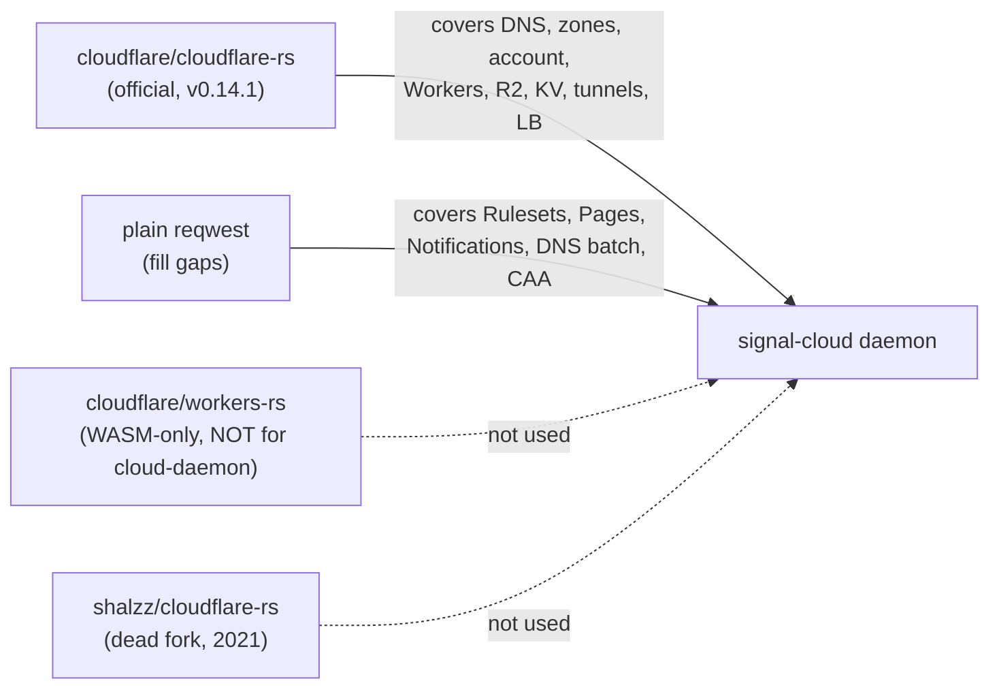
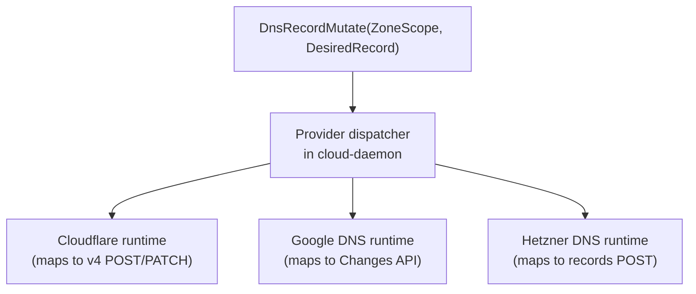
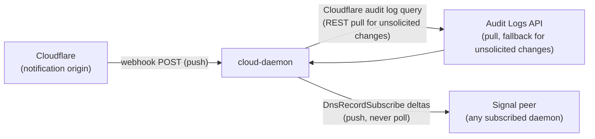
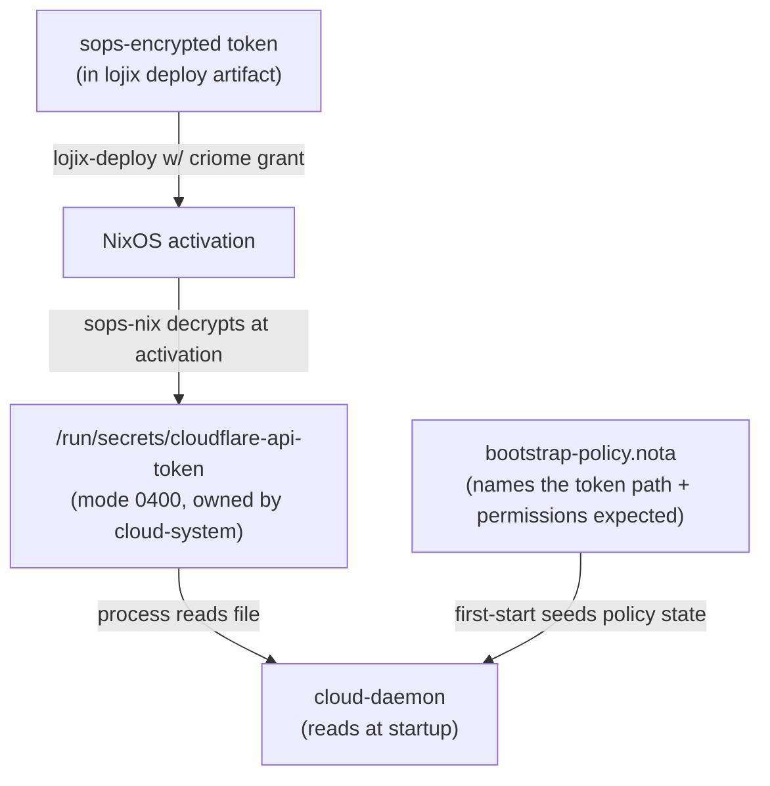

# 22/3 — Cloudflare API research for the cloud component

*Designer lane (third designer, parallel-main subagent). Input
research for subagent 1's signal-cloud contract design. Date
2026-05-23. Frames the Cloudflare-side surface (DNS records,
Redirect Rules, zones, plus a sketch of the other capability
areas), the Rust crate landscape, the workspace-shaped operation
mapping, and the auth / event-flow seams the daemon will have to
own. Per psyche prompt at the start of the session and spirit
intent 282.*

## 0 · TL;DR

- **Use `cloudflare-rs` (the official `cloudflare` crate, v0.14.1,
  March 2025, BSD-3-Clause, 309 stars) as the v1 substrate.** It
  covers DNS, zones, account, Workers, R2, Workers KV, Argo
  Tunnel, cloudflare-tunnel, load balancing, AI. It is the only
  meaningfully maintained Rust crate covering the relevant
  Cloudflare REST surface; the alternative (`shalzz/cloudflare-rs`
  fork) has been dead since 2021.
- **Coverage gaps to handle in cloud's daemon directly.** The
  crate does NOT cover Rulesets (so Single Redirects / Redirect
  Rules), Pages projects, Cloudflare Notifications / Webhooks,
  the new DNS Batch endpoint, and CAA records. These are the
  endpoints cloud must call through plain `reqwest` against the
  v4 REST API.
- **API areas that matter for v1**: (1) DNS records create / update
  / delete / list + Batch — the immediate target per /282; (2)
  Zones list + lookup (cloud needs `zone_id` to scope DNS
  operations); (3) Rulesets at `http_request_dynamic_redirect`
  phase for Single Redirects. Pages, Workers, R2 are v2+.
- **Mapping shape.** A *unified* DNS verb across providers
  (Cloudflare + Google Cloud DNS + Hetzner DNS) is realistic for
  the common record types (A/AAAA/CNAME/MX/TXT/SRV/NS/CAA) — they
  all model "record at zone with name + type + content + ttl."
  Provider-specific features (Cloudflare's `proxied` flag, route-
  to-Worker, Redirect Rules; Google's policy zones; Hetzner's
  primary/secondary zone modes) need provider-namespaced verbs.
  Recommended pattern: a small unified `DnsRecord` verb spine,
  plus per-provider extension verbs in distinct sub-vocabularies.
- **Auth.** Use Cloudflare API **tokens** (not legacy global API
  keys). Scoped per-zone + per-permission; rotatable. Token is
  stored sops-nix-encrypted in the deployment artifact set and
  delivered to the cloud-daemon's process via a sops-nix
  `secrets.<name>.path` file under `/run/secrets/`. Bootstrapping
  is straightforward; the criome authorization arc is what gates
  *writes* (DNS mutations) at runtime — not token possession.
- **Event flow.** Cloudflare offers webhooks for Notifications
  (security alerts, DNS-zone-transfer events, certificate events,
  Logpush failures) but **does not** offer push-event subscription
  for ordinary DNS changes. Subscribe means HTTP-push from
  Cloudflare to a workspace-exposed endpoint. Cloud's daemon
  fronts the webhook receiver and re-publishes as Subscribe
  deltas on `signal-cloud`. For DNS record mutations the daemon
  initiated, the source of truth is the daemon's own audit log;
  for *unsolicited* changes (someone else edited via the
  dashboard), Cloudflare does not push — only the dashboard
  audit log and the per-zone Audit Logs API exist.

## 1 · Cloudflare API surface summary

The Cloudflare v4 API is at `https://api.cloudflare.com/client/v4/`,
flat-RESTful, JSON-only, returns a uniform envelope
(`{"success": bool, "result": ..., "errors": [...], "messages":
[...]}`). Auth is by `Authorization: Bearer <api-token>`.

### 1.1 DNS records — the core v1 surface

| Endpoint | Method | Purpose |
|---|---|---|
| `/zones/{zone_id}/dns_records` | `POST` | Create record |
| `/zones/{zone_id}/dns_records` | `GET` | List (filter by name, type, content) |
| `/zones/{zone_id}/dns_records/{id}` | `GET` | Read one |
| `/zones/{zone_id}/dns_records/{id}` | `PATCH` | Partial update (preserves unspecified fields) |
| `/zones/{zone_id}/dns_records/{id}` | `PUT` | Overwrite (full replacement) |
| `/zones/{zone_id}/dns_records/{id}` | `DELETE` | Delete |
| `/zones/{zone_id}/dns_records/batch` | `POST` | Batch: deletes → patches → puts → posts in sequence; single DB transaction, but NOT atomic propagation (Cloudflare's distributed KV treats each record as one key-value; first error stops the batch and rolls back) |

**Record types supported (22):** A, AAAA, CNAME, MX, NS,
OPENPGPKEY, PTR, TXT, CAA, CERT, DNSKEY, DS, HTTPS, LOC, NAPTR,
SMIMEA, SRV, SSHFP, SVCB, TLSA, URI. Common fields: `name`,
`type`, `content`, `ttl` (60-86400 or 1=auto), `comment`,
`proxied` (Cloudflare-only acceleration flag), `tags`, `data`
(structured for complex types like MX `priority`, SRV
`service/proto/port/target/weight`, CAA `flags/tag/value`).

**Important deprecation:** changing the type of an existing record
via API is deprecated and removed after **2026-06-30**; integrators
must switch to delete-and-recreate. Cloud's contract should not
expose a type-change verb at all; force delete+create through
typed verbs.

### 1.2 Zones — needed to scope DNS calls

| Endpoint | Method | Purpose |
|---|---|---|
| `/zones` | `GET` | List zones for the account |
| `/zones` | `POST` | Create a zone (full or partial / CNAME setup) |
| `/zones/{zone_id}` | `GET` | Read a zone |
| `/zones/{zone_id}` | `PATCH` | Update settings (paused, plan, etc.) |
| `/zones/{zone_id}` | `DELETE` | Delete |
| `/zones/{zone_id}/settings` | `GET` / `PATCH` | Per-zone settings (TLS mode, SSL, always-online, etc.) |

Account-scoped operations (e.g., listing zones, account-level
permissions) hang off `/accounts/{account_id}/...` rather than
`/zones/...`. The token's permission set determines which scope
the token can address.

### 1.3 Redirect Rules — via the Rulesets API

Single Redirects are zone-scoped; they live in the Rulesets API
under the `http_request_dynamic_redirect` phase:

| Endpoint | Method | Purpose |
|---|---|---|
| `/zones/{zone_id}/rulesets` | `GET` | List rulesets |
| `/zones/{zone_id}/rulesets` | `POST` | Create ruleset (typically one entry-point per phase) |
| `/zones/{zone_id}/rulesets/phases/{phase}/entrypoint` | `PUT` | Set phase entry-point ruleset (the idiomatic shape) |
| `/zones/{zone_id}/rulesets/{ruleset_id}` | `PATCH`/`PUT` | Modify rules in a ruleset |

Each rule has an `expression` (Cloudflare's Wirefilter DSL —
`http.host eq "example.com"` etc.), an `action` (here:
`"redirect"`), and `action_parameters` carrying `from_value.target_url`
(static `value` or dynamic `expression`), `status_code`
(301/302/307/308), and `preserve_query_string`. Bulk Redirects are
account-scoped and use `http_request_redirect` phase — a
distinct API path; cloud should expose both, but the simpler v1
target is zone-level Single Redirects.

### 1.4 Other capability areas (v2+)

- **Pages projects.** `POST /accounts/{account_id}/pages/projects`
  creates a project; `POST .../projects/{name}/deployments` triggers
  a deploy (multipart form data). Repository must be pre-authorized
  in the dashboard.
- **Workers scripts.** `PUT /accounts/{account_id}/workers/scripts/{name}`
  uploads / updates a script (multipart). Routes via
  `/zones/{zone_id}/workers/routes`. Bindings (KV, R2, secrets, durable
  objects) are declared at upload time.
- **R2 buckets and objects.** Bucket admin via Cloudflare API
  (`/accounts/{account_id}/r2/buckets`); object I/O via the
  S3-compatible endpoint at `https://<account-id>.r2.cloudflarestorage.com`
  (use any S3 SDK). Cloud's contract should expose bucket admin;
  per-object S3 I/O is unlikely to be cloud-mediated (consumers
  speak S3 directly with their own credentials).
- **Workers KV.** Per-namespace key-value store; cloudflare-rs
  has `workerskv` endpoint coverage.
- **cloudflared / Argo Tunnel.** Tunnels API at
  `/accounts/{account_id}/cfd_tunnel` — cloudflare-rs covers
  `argo_tunnel` and `cfd_tunnel`.
- **Load Balancing.** Pools, monitors, load-balancers; cloudflare-rs
  has `load_balancing`.

### 1.5 Rate limits

- **Global:** 1,200 requests per **5 minutes** per user (HTTP 429
  on exceed; 5-minute block window). Applies cumulatively across
  dashboard, API key, API token. Enterprise can raise.
- Some endpoints have their own narrower limits (e.g., the batch
  endpoint has implicit batch-size limits).
- Response headers include service-limit items with limit name,
  remaining quota, and reset time — cloud's HTTP client should
  surface these as typed `RateLimitState` records, not log-line
  noise.

### 1.6 Authentication

| Mechanism | Status | When to use |
|---|---|---|
| **API tokens** (v4) | Current; recommended | Scoped to specific zones + permissions; rotatable; supports IP-allowlist and TTLs (`not_before`, `expires_on`). Account-API-tokens act as service principals. |
| **Global API key** (legacy) | Active but discouraged | Inherits user's full permissions; no scoping. Do NOT use. |
| **mTLS / origin pull certs** | For traffic between Cloudflare and origin, not API access. | Not relevant for cloud-daemon. |

Cloud's daemon authenticates with a single Cloudflare API token,
scoped to the zones it is owner-authorized to mutate. Multiple
tokens per daemon are likely needed when cloud manages multiple
distinct Cloudflare accounts; the token-to-account mapping lives
in policy state (per the triad invariant 5).

## 2 · Rust SDK / crate survey



### 2.1 The official `cloudflare` crate (cloudflare-rs)

| Property | Value |
|---|---|
| Repo | `github.com/cloudflare/cloudflare-rs` |
| Crate | `cloudflare` on crates.io |
| Version | 0.14.1 (Aug 2025; v0.14.0 Mar 2025) |
| License | BSD-3-Clause |
| Stars | 309 |
| Last push | 2026-04-23 (repo activity is mostly PR triage; the last release was Aug 2025) |
| Open issues | 57 |
| Authors | Noah Kennedy, Jeff Hiner, Kenneth Eversole (Cloudflare staff) |
| README warns | "Work in Progress" |
| Async / Sync | Both — async by default; `blocking` feature flag |
| TLS | `default-tls` (system TLS via reqwest) or `rustls-tls` |
| Dependencies | reqwest 0.12, serde 1, http 1, chrono 0.4, uuid 1, thiserror 2 |
| Module layout | `endpoints/{account, ai, argo_tunnel, cfd_tunnel, dns, load_balancing, r2, workers, workerskv, zones}` |

**DNS coverage** in `endpoints/dns/dns.rs`:

- `ListDnsRecords`, `CreateDnsRecord`, `UpdateDnsRecord`,
  `DeleteDnsRecord`.
- Record content enum: A, AAAA, CNAME, NS, MX (with priority),
  TXT, SRV. **No CAA, no HTTPS/SVCB, no the more exotic 22-type
  set** — the seven common types only.
- No batch endpoint binding.

**Zones coverage** in `endpoints/zones/`:

- `mod.rs`, `plan.rs`, `zone.rs`. List, get, create, edit, delete;
  plan-tier operations.

**Rulesets coverage**: NONE. Single Redirects / Redirect Rules
have no crate support; cloud must call the REST endpoints
directly through reqwest. (The crate's `endpoints/` directory has
no rulesets module — confirmed by listing the GitHub tree.)

**Pages, Notifications, Webhooks**: NONE.

**Recommendation:** Use cloudflare-rs as the base for DNS, zones,
account, R2 bucket admin, Workers script management, Workers KV,
tunnels, and load balancing. Layer plain `reqwest` calls on top
for Rulesets (Single Redirects + Bulk Redirects), Pages projects
+ deployments, Notifications + Webhooks subscriptions, the DNS
Batch endpoint, and the CAA / HTTPS / SVCB / less-common DNS
record types. The plain-`reqwest` calls are tiny — the v4 API is
JSON in, JSON out, uniform envelope; serde structs are
straightforward.

### 2.2 Alternatives surveyed

- **`shalzz/cloudflare-rs`** — abandoned fork; last commit
  2021-08-17. 2 stars. Not viable.
- **`cloudflare/workers-rs`** — for *running inside* a Cloudflare
  Worker (WASM target). Not for managing Cloudflare from outside.
  Wrong direction.
- **`cf-turnstile`** — Cloudflare Turnstile (captcha) verifier
  only. Not relevant to cloud.
- **`cloudflare-r2-rs`** — small R2-specific wrapper; the
  S3-compatible API is better served by `aws-sdk-s3` or `rusoto-s3`
  configured for Cloudflare's endpoint.
- **Generating from OpenAPI** — Cloudflare publishes an OpenAPI
  schema at `developers.cloudflare.com/schemas/openapi.json`.
  Generating Rust bindings via `openapi-generator` or `oasgen` is
  an option for full coverage. For v1, this is overkill; for v2+
  when cloud covers Pages, Workers, and Rulesets at depth, it may
  be worth revisiting. **Designer recommendation: do not
  generate from OpenAPI in v1.** The hand-written cloudflare-rs +
  small reqwest gap fills are tighter and more legible than a
  thousand-file generated mass.

### 2.3 Where cloudflare-rs falls short for the workspace

- **API surface gaps** named above (Rulesets, Pages, Notifications,
  Batch DNS, CAA / HTTPS / SVCB record types).
- **No NOTA / rkyv types.** cloudflare-rs uses serde + serde_json
  exclusively. The contract crate `signal-cloud` will declare its
  own NOTA/rkyv-shaped record types; cloud's runtime translates at
  the edge — call cloudflare-rs with serde structs, convert to
  contract types before replying on the wire. This is the
  pattern already used inside persona-spirit (NOTA + rkyv for
  contract, anyhow + serde for internal helpers).
- **Maintenance velocity.** The crate has 57 open issues, a "Work
  in Progress" README banner, and a 5-month gap between v0.14.0 and
  v0.14.1. Plan for periodic gap fills as Cloudflare adds API
  surface. Submit upstream PRs where worth it; otherwise carry
  workspace-local patches in a `cloud/src/cloudflare_ext/` module
  that wraps cloudflare-rs and fills gaps.

## 3 · API → signal verb mapping

The mapping below assumes the contract-naming triad discipline
(`skills/component-triad.md` §3 + `skills/naming.md`). Sema class
in the third column classifies the operation by the workspace's
universal vocabulary (`Assert`, `Mutate`, `Retract`, `Match`,
`Subscribe`, `Validate`).

**Workspace convention reminder.** `Mutate` is the authority verb:
"change this, I don't care what you think." `Retract` removes a
typed fact. `Assert` enters a new fact. For Cloudflare's DNS
*from the workspace's perspective*: creating a record is `Mutate`
on the zone's record-set (workspace owner ordering Cloudflare to
hold this record), NOT `Assert` (Cloudflare is the source of truth
for what records exist; the workspace is ordering changes to that
state). Most cloud-daemon verbs land in `Mutate` because the
daemon's job is to drive remote state to a workspace-desired
shape.

### 3.1 DNS records

| Cloudflare API | Contract verb (sketch) | Sema class |
|---|---|---|
| `POST /zones/{z}/dns_records` | `DnsRecordMutate(ZoneScope, DesiredRecord)` (idempotent create-or-update by name+type) | Mutate |
| `PATCH /zones/{z}/dns_records/{id}` | `DnsRecordMutate(ZoneScope, DesiredRecord)` (same — daemon decides PATCH vs POST internally) | Mutate |
| `PUT /zones/{z}/dns_records/{id}` | `DnsRecordReplace(ZoneScope, RecordIdentifier, DesiredRecord)` (explicit full overwrite) | Mutate |
| `DELETE /zones/{z}/dns_records/{id}` | `DnsRecordRetract(ZoneScope, RecordIdentifier)` | Retract |
| `GET /zones/{z}/dns_records/{id}` | `DnsRecordMatch(ZoneScope, RecordIdentifier)` | Match |
| `GET /zones/{z}/dns_records` (filtered) | `DnsRecordMatch(ZoneScope, RecordSelection)` | Match |
| `POST /zones/{z}/dns_records/batch` | `DnsRecordBatchMutate(ZoneScope, DnsBatch)` | Mutate |
| (no Cloudflare verb — workspace-side) | `DnsRecordSubscribe(ZoneScope, Selection)` (push deltas for in-zone changes seen by the daemon; webhook-driven where Cloudflare supports it, daemon-emitted for daemon-initiated mutations) | Subscribe |
| Dry-run (workspace-side: call PATCH against a sandbox / use Cloudflare's "validate" pattern via batch with empty commit) | `DnsRecordValidate(ZoneScope, DesiredRecord)` | Validate |

Key payload sketches (illustrative — subagent 1 owns the final
schema):

```text
ZoneScope         ::= AccountIdentifier ZoneIdentifier
DesiredRecord     ::= RecordName RecordType RecordData TtlSetting ProxiedFlag RecordComment RecordTags
RecordType        ::= A | AAAA | CNAME | MX | TXT | SRV | NS | CAA | ... (closed enum)
RecordData        ::= Ipv4(Ipv4Address) | Ipv6(Ipv6Address) | Hostname(DnsName)
                    | MxData(MxPriority Hostname) | TxtData(TextRecordValue)
                    | SrvData(...) | CaaData(...) | ...
TtlSetting        ::= TtlAutomatic | TtlSeconds(u32)  /* 60-86400 */
ProxiedFlag       ::= ProxyEnabled | ProxyDisabled
```

The naming follows the workspace's rule (full English words, no
ancestry — `RecordName` not `name`, `RecordType` not `type`,
`MxPriority` not `priority`). Per AGENTS.md "names don't carry
their full ancestry," fields inside `DesiredRecord` like
`record_name` would actually be `name` *inside the record*; the
table above renames for cross-context clarity.

### 3.2 Zones

| Cloudflare API | Contract verb | Sema class |
|---|---|---|
| `GET /zones` | `ZoneMatch(AccountScope, ZoneSelection)` | Match |
| `GET /zones/{id}` | `ZoneMatch(AccountScope, ZoneIdentifier)` | Match |
| `POST /zones` | `ZoneAdopt(AccountScope, ZoneAdoptionRequest)` (Cloudflare verb is "create zone" but workspace semantic is "bring this domain under cloudflare management" — adopt is the better workspace word) | Mutate |
| `PATCH /zones/{id}` | `ZoneSettingsMutate(ZoneScope, ZoneSettingsChange)` | Mutate |
| `DELETE /zones/{id}` | `ZoneRetract(ZoneScope)` | Retract |

### 3.3 Redirect Rules (Single Redirects, zone-scope, dynamic phase)

| Cloudflare API | Contract verb | Sema class |
|---|---|---|
| `GET /zones/{z}/rulesets` (filtered to `http_request_dynamic_redirect`) | `RedirectRuleMatch(ZoneScope, RedirectSelection)` | Match |
| `PUT /zones/{z}/rulesets/phases/http_request_dynamic_redirect/entrypoint` | `RedirectRuleMutate(ZoneScope, RedirectRuleSet)` | Mutate |
| (rule-by-rule add) within a ruleset | inside `RedirectRuleSet` payload | Mutate |
| Bulk Redirects (account-scope `http_request_redirect`) | `BulkRedirectMutate(AccountScope, BulkRedirectSet)` — separate verb because account-scope and different phase | Mutate |

The workspace's typed `RedirectRule` payload should carry:
- `RedirectExpression(WirefilterExpression)` — Cloudflare's matching
  DSL, kept as a typed string newtype (the daemon does not parse
  it; cloud trusts the user / future workspace-side DSL frontend).
- `RedirectTarget(StaticUrl | DynamicExpression)` — closed enum.
- `RedirectStatusCode(u16)` — typed 301 / 302 / 307 / 308 (closed
  enum, not arbitrary u16).
- `RedirectPreserveQueryString(bool)`.

### 3.4 Pages, Workers, R2, KV — v2+ verb shapes (sketches only)

| Cloudflare verb | Contract verb (sketch) | Sema class |
|---|---|---|
| `POST /accounts/{a}/pages/projects` | `PagesProjectAdopt(AccountScope, ProjectDefinition)` | Mutate |
| `POST .../projects/{p}/deployments` | `PagesDeploymentRequest(ProjectScope, DeploymentSource)` | Mutate |
| `PUT .../workers/scripts/{name}` | `WorkerScriptMutate(AccountScope, ScriptDefinition)` | Mutate |
| `POST /zones/{z}/workers/routes` | `WorkerRouteMutate(ZoneScope, RouteDefinition)` | Mutate |
| `PUT /accounts/{a}/r2/buckets` | `R2BucketMutate(AccountScope, BucketDefinition)` | Mutate |
| (S3 object I/O) | NOT in contract — consumers use S3 directly | — |
| Workers KV namespace/values | `KvNamespaceMutate`, `KvValueMutate` | Mutate |

Object-level R2 I/O does NOT live in the signal-cloud contract.
The contract handles the *provisioning* operations (creating
buckets, setting CORS / lifecycle / public-access); the actual
PUT/GET object operations are best left to the consumer talking
S3 directly with credentials cloud has handed them. This is a
load-bearing scoping choice for subagent 1 to confirm.

### 3.5 Account-level (token, billing, audit)

Most cloud-daemon-owned ops are zone-or-account-scoped resource
operations, not account-meta. The daemon may need:

- `AccountMatch(AccountIdentifier)` — read account info.
- `AccountTokenList(AccountScope)` — list this token's permissions
  (so cloud can validate at startup that the token actually has
  the permissions cloud needs).
- `AuditLogMatch(AccountScope, AuditSelection)` — Cloudflare's
  per-account audit log; useful for divergence-detection.

## 4 · Other providers (Google + Hetzner) brief

### 4.1 Google Cloud DNS

- **API**: `dns.googleapis.com/v1` REST, or gRPC.
- **Auth**: Application Default Credentials (ADC), service-account
  JSON keys, OAuth2. Strongly recommends ADC + service accounts.
- **Surface**: `projects/{project}/managedZones` (zones),
  `.../managedZones/{zone}/rrsets` (resource record sets). The
  unit of mutation is a "Change" — a typed delete-and-add atomic
  pair; you don't PATCH a record, you submit a Change with
  `additions` and `deletions`.
- **Record types**: A, AAAA, CNAME, MX, TXT, SRV, NS, CAA, SOA,
  SPF, PTR, NAPTR, DS, TLSA, SSHFP, etc. (overlapping but not
  identical to Cloudflare's set).
- **Rust crate**: `gcloud-sdk` (community, feature-flag-per-API,
  Tonic gRPC + Reqwest REST) is the most pragmatic option;
  Google's official Rust SDK (`google-cloud-rust`, released
  2025) is gaining traction but coverage is still rolling out.
  For DNS specifically, `gcloud-sdk` with the
  `google-dns-v1` feature is the path.
- **Provider-specific concepts**: DNS policies (response policy
  zones, forwarding), DNSSEC at zone level, peering zones,
  private DNS zones.

### 4.2 Hetzner Cloud + Hetzner DNS

Hetzner has TWO separate products:

- **Hetzner Cloud** (compute, networks, volumes, load balancers,
  firewalls) — `api.hetzner.cloud/v1`.
- **Hetzner DNS** — `dns.hetzner.com/api/v1`, a separate
  product (also has its own auth tokens).

- **Auth**: Bearer API token per product; created in the Hetzner
  Console under each project / DNS account.
- **DNS surface**: `/zones`, `/records`, `/primary_servers` (for
  secondary zone management).
- **Rust crates**:
  - `hcloud` (HenningHolmDE, OpenAPI-generated, Apache-2.0, 94
    stars, active — pushed 2026-01-04). Covers Hetzner Cloud
    (compute side), NOT Hetzner DNS.
  - `hetzner` (different crate, on crates.io as `hetzner` v1.0.0).
    Covers DNS records and zones with a domain-oriented API
    (`client.dns().list_zones()`).
- **DNS record types**: A, AAAA, CNAME, MX, TXT, SRV, NS, CAA,
  PTR, SOA, DS, TLSA. Substantial overlap with Cloudflare.

### 4.3 Unified DNS verb — realistic or not?



**Common abstraction is realistic for the core record types**
(A, AAAA, CNAME, MX, TXT, SRV, NS, CAA, PTR, TLSA). All three
providers model "record in zone with name + type + content + ttl"
the same way. A unified `DnsRecord` verb works.

**Where the abstraction breaks:**

| Concept | Cloudflare | Google | Hetzner |
|---|---|---|---|
| Proxied / "orange-cloud" CDN flag | yes (`proxied`) | no | no |
| Mutation model | per-record CRUD + batch | atomic Change (additions + deletions) | per-record CRUD |
| DNSSEC management | zone-level setting | rich (KSK/ZSK, DS records) | basic |
| Response policies / split-horizon | limited | rich (managed zone visibility, policies) | basic |
| Redirect at edge (HTTP-layer) | Single Redirects + Bulk Redirects | none (DNS only) | none (DNS only) |
| Worker / function / edge code | Workers | Cloud Functions (different mental model) | none |

**Recommendation for subagent 1.** Split into:

1. **Unified DNS verb spine** — `DnsRecordMutate`,
   `DnsRecordRetract`, `DnsRecordMatch`, `DnsRecordSubscribe`,
   `DnsRecordBatchMutate`. Payload carries `ProviderHandle` +
   `ZoneScope` + `DesiredRecord` (with provider-neutral common
   fields). The daemon dispatches to per-provider runtimes.
   Provider-specific record-type quirks (Cloudflare's HTTPS/SVCB
   newer types, Google's response-policy zones) raise an explicit
   `UnsupportedByProvider` typed reply, NOT a silent fallthrough.

2. **Provider-specific extension verbs** — `CloudflareRedirectRuleMutate`,
   `CloudflareWorkerScriptMutate`, `GoogleResponsePolicyMutate`,
   `HetznerPrimaryServerRegister`, etc. These live in their own
   sub-namespaces inside the contract (e.g. nested under a
   `CloudflareExtension` enum root).

3. **`proxied` flag**: keep as a Cloudflare-extension field in
   the unified payload, NOT silently ignored elsewhere. Cloud's
   typed reply when the provider doesn't support it: the field
   in the round-tripped record is absent (Option::None), explicit
   in the contract.

This pattern is the same shape persona uses for engine vs
extension state: a unified spine carries the common case;
provider-specific extensions sit in named verb namespaces.

## 5 · Webhook / event-notification patterns



### 5.1 What Cloudflare actually offers

- **Cloudflare Notifications** — typed alerts (DDoS attacks, SSL
  certificate events, zone-transfer events for Secondary DNS,
  health checks, Logpush failures, Pages deployment status, Stream
  live status, etc.). **Configurable webhook destinations** receive
  these as HTTP POSTs.
- **Logpush** — near-real-time push of HTTP request logs to
  S3/R2/GCS/Azure/Datadog/Splunk endpoints. Enterprise-only.
- **NOT offered**: a "push me when any DNS record changes via
  any source" event subscription. The Notifications system covers
  alert-shaped events, NOT all CRUD on every resource.
- **Audit Logs API** at `/accounts/{a}/audit_logs` (REST pull) is
  the fallback for retrospective "who changed what when" — paged,
  history-shaped, not real-time.

### 5.2 What cloud's daemon does

For ordinary DNS / Redirect Rule changes that **cloud itself
initiates**:

1. Daemon issues the REST call.
2. On success, daemon emits a Subscribe-delta on `signal-cloud`
   to all subscribers.
3. Daemon's working-state sema table records the new state of the
   record. **The daemon is the source of truth for "what we asked
   Cloudflare to be"**; Cloudflare is the source of truth for
   "what actually is."

For **unsolicited changes** (someone edited via the Cloudflare
dashboard, or a parallel daemon, or a forgotten Terraform run):

1. Daemon periodically (low-frequency, owner-policy-configurable —
   default e.g. every 6 hours, with an immediate-on-request kick)
   reads the per-zone audit log via `/accounts/{a}/audit_logs`.
2. Diffs against working state.
3. Surfaces divergence as a typed `DivergenceDetected` event on
   `signal-cloud` (subscribed daemons see what's drifted; owner-
   signal-cloud receives an owner-only `RequiresReconciliation`
   if policy says so).
4. **This is NOT polling for the workspace.** Per `skills/push-not-pull.md`,
   "polling is forbidden" applies to consumer-to-daemon
   communication. Cloud's polling of the Cloudflare audit log is
   an *implementation detail of the daemon's relationship to
   Cloudflare* — Cloudflare doesn't push, so cloud has no choice;
   but cloud DOES push to its workspace subscribers.

For **Cloudflare-pushed alerts** (Notifications webhooks):

1. Cloud-daemon exposes a webhook receiver endpoint (HTTPS on a
   workspace-managed listener).
2. Cloudflare Notifications is configured (via cloud-daemon's
   own provisioning of the notification policy, through the
   Notifications API) to POST to that endpoint.
3. Received events are validated (Cloudflare signs notification
   webhooks — verify HMAC), parsed, recorded as typed Sema rows,
   and re-published as Subscribe deltas on `signal-cloud`.
4. Webhook destinations have a separate API surface:
   `/accounts/{a}/alerting/v3/destinations/webhooks` and
   `/accounts/{a}/alerting/v3/policies`. Cloud's daemon owns
   provisioning these as part of its setup.

### 5.3 Notification types worth subscribing to

- **DNS** — Secondary DNS Primaries Failing / Successfully
  Updated / Warning (Enterprise-only, secondary DNS users only).
- **Security** — Bot Detection, DDoS attack alerts, Security
  Events, Universal SSL Alert, Advanced Certificate Alert.
- **Infrastructure** — Health Checks, Load Balancing Pool
  Enablement, Load Balancing Health, Tunnel Health Alert.
- **Pages** — Project deployment updates (build success / failure).
- **Logpush** — Failing job notifications.

Most of these are alerts, not state-change deltas. The workspace
should treat them as **typed alert facts** (`Assert` class —
"a typed alert exists"), not as state mutations (`Mutate` class).
The contract's notification verb shape:

```text
CloudflareAlertAsserted(AccountScope, AlertCategory, AlertDetail)
```

with downstream cloud-daemon mapping to typed Sema rows that
consumers Subscribe to.

## 6 · Auth + credential storage sketch

### 6.1 The boot path



**Sketch only — full design is out of scope for this report.**

1. **At rest.** Cloudflare API tokens live in a sops-nix-encrypted
   YAML / JSON file in the lojix system flake; encrypted with
   age keys (per /214 the criome PKI is also age-key-rooted, so
   there's a unified key story).
2. **At deploy.** lojix-system applies the NixOS configuration;
   sops-nix decrypts secrets to `/run/secrets/cloudflare-api-token-<name>`
   with mode `0400`, owner `cloud-system`, just before the
   cloud-daemon systemd unit starts. The criome authorization arc
   is what gates the deploy *effect*; once granted, the deploy
   applies and secrets land.
3. **At daemon start.** `cloud-daemon` reads its configuration
   (a NOTA file per the single-argument rule) which names a list
   of token file paths and which account / zone scopes each token
   covers. Daemon validates the token by calling
   `GET /user/tokens/verify` at startup; on failure, the daemon
   refuses to start.
4. **Multiple tokens.** If cloud manages multiple Cloudflare
   accounts (e.g., personal + workspace + future client accounts),
   each gets its own token, its own secret file, its own
   `AccountIdentifier` in policy state, all named in
   `bootstrap-policy.nota`.

### 6.2 Token rotation

- Token files on disk are immutable for the running daemon
  (sops-nix rewrites them on deploy; systemd `restartTriggers`
  arranges for the daemon to reload when the secret changes — per
  the sops-nix systemd integration documented in
  `michael.stapelberg.ch`'s 2025 walkthrough).
- Token *content* rotation is a Cloudflare-side action: create a
  new token with the same permissions, update the sops-encrypted
  secret, deploy, revoke the old token on Cloudflare. The
  daemon does not own this lifecycle directly; lojix-deploy +
  criome do.
- Cloud's owner-signal-cloud can expose
  `CloudflareTokenRotate(AccountScope, RotationRequest)` if the
  workspace wants programmatic rotation triggered by the
  workspace (rather than out-of-band). Decision deferred to
  subagent 1.

### 6.3 Cross-reference to criome

Per /214, criome is the workspace's authority on *what writes the
system is allowed to perform*. Cloud-daemon's relationship to
criome is the same as lojix's: before any mutation that has
external effect (`DnsRecordMutate`, `RedirectRuleMutate`, etc.),
cloud-daemon asks criome via `signal-criome`:

```text
AuthorizeSignalCall {
  caller: cloud-daemon
  action_class: "cloudflare.dns.mutate"
  action_target: <ZoneScope> + <DesiredRecord canonical digest>
  ...
}
```

criome replies with an `AuthorizationGrant` (containing signatures
per the satisfied policy) OR an `AuthorizationDenial`. Cloud's
daemon **does not call Cloudflare without a grant.**

This is the same shape as lojix-criome-arca per /141: "no Nix
effect before CriomeAuthorizationActor grant." For cloud: no
Cloudflare API mutation before criome grant. For sensitive
records (DNS pointing money / production traffic), the policy
class is `Quorum` (criome's master plus a peer criome — typically
the owner's local criome on the workstation). For unproduction
zones, policy class is `SimpleSelfSigned` and cloud's local
criome auto-signs.

## 7 · Open questions for subagent 1's contract design

These are the items where this research-side could not settle the
contract-shape decision; subagent 1 owns the call.

**7.1 Idempotency for DNS mutations.** Cloudflare's POST creates a
new record each call (no dedup); cloud's `DnsRecordMutate` should
be **idempotent** at the workspace level (caller's intent is
"make state X exist for name Y type Z," not "make a new row each
time"). Daemon-side, this means resolving "is there already a
record with (zone, name, type) that matches?" → if yes and content
differs, PATCH; if yes and content matches, no-op; if no, POST.
**Confirm: is the contract's `Mutate` semantically idempotent
across the workspace?** Designer lean: yes; the Mutate verb's
authority-order semantic supports this naturally.

**7.2 Unified DNS verb vs provider-namespaced verbs.** Per §4.3,
the recommendation is a unified spine + provider-extension verbs.
**Confirm the split with subagent 1.** Alternative: pure
provider-namespaced verbs from day one (no unified spine), which
is simpler to model but pays the abstraction cost at every
consumer.

**7.3 Where the webhook receiver lives.** Section 5.2 has
cloud-daemon expose an HTTPS listener for Cloudflare notification
webhooks. **Open: does cloud-daemon expose the HTTPS endpoint
itself (TLS termination inside the daemon) or does it sit behind a
workspace-managed reverse proxy?** Designer lean: behind a
reverse proxy (workspace gets one TLS termination point); the
cloud-daemon listens on a Unix socket for webhook bytes and the
proxy translates HTTPS POST → Unix-socket-write. This is the
control-plane / data-plane carve-out per
`skills/component-triad.md` §"Named carve-outs" — webhooks are
high-bandwidth-ish HTTPS bytes, not signal-frame frames, so they
sit on a sibling socket.

**7.4 The `proxied` orange-cloud flag.** Cloudflare-specific; in
the unified `DesiredRecord` it's an `Option<ProxiedFlag>`. **Open:
what does the daemon do when a consumer asks for `proxied =
Some(...)` and the dispatched provider is Google or Hetzner?**
Designer lean: typed `UnsupportedFieldForProvider` rejection
reply with the offending field name — never silent drop. Subagent
1 confirm.

**7.5 Rulesets / Single Redirects: rule-by-rule or whole-set?**
Cloudflare's API operates at the whole-ruleset level (PUT the
phase entry point replaces all rules). The workspace contract
could:
- (a) expose a single `RedirectRuleSetMutate` that takes a vector
  of rules, OR
- (b) expose per-rule `RedirectRuleMutate(rule_identifier)` and
  the daemon synthesizes the whole-set PUT internally.
**Designer lean: (b)** — finer-grained mutation, with the daemon
holding the current ruleset in working state and PUT'ing the
recomputed full set on each rule change. This is cleaner for
consumers and matches how DNS records work (per-record verbs).
Subagent 1 confirm.

**7.6 What account-scope means in the contract.** Cloudflare has
both `account_id`-scoped operations and `zone_id`-scoped
operations; zones sit under accounts. The contract should make
this hierarchy visible: `ZoneScope { account, zone }` rather than
just `ZoneScope { zone }`. **Confirm with subagent 1.**

**7.7 Audit log / divergence detection as a first-class verb.**
Per §5.2, cloud-daemon's polling of the Cloudflare audit log is
how it detects unsolicited changes. The verb shape for surfacing
that to subscribers is open: `DivergenceDetected` event records
vs `ReconciliationRequest` Mutate verbs vs both.

**7.8 R2 object-level I/O in or out of contract.** Per §3.4, R2
bucket provisioning is in scope; object PUT/GET is recommended OUT
of scope (consumers use S3 directly with credentials cloud hands
them). **Confirm with subagent 1.** The boundary matters because
it determines whether cloud-daemon is on the data path for every
R2 object or only on the control path.

**7.9 Token-validation-on-startup behaviour.** Per §6.1, daemon
calls `GET /user/tokens/verify` at startup. **Open: refuse to
start, or start in a degraded mode that surfaces the token as
`Unvalidated`?** Designer lean: refuse to start (fail-fast); the
deploy artifact set guarantees the token was good at deploy time,
so a verify failure at start means active token revocation, which
is itself an alertable event.

**7.10 Policy-state shape for "which token covers which scope."**
A workspace with many accounts and many tokens needs a
mapping table in policy state. Sketch:

```text
TokenScopeRegistry: AccountIdentifier → TokenSecretPath × PermissionScopes
```

Mutated via `owner-signal-cloud` `RegisterCloudflareToken` verb;
read by the daemon at every dispatch. Subagent 1 own.

## 8 · References

Cloudflare DNS API:

- [Cloudflare API · DNS · Create Record](https://developers.cloudflare.com/api/resources/dns/subresources/records/methods/create/)
- [Cloudflare API · DNS · Update Record (PUT/PATCH)](https://developers.cloudflare.com/api/resources/dns/subresources/records/methods/update/)
- [Manage DNS records — Cloudflare DNS docs](https://developers.cloudflare.com/dns/manage-dns-records/how-to/create-dns-records/)
- [Batch record changes — Cloudflare DNS docs](https://developers.cloudflare.com/dns/manage-dns-records/how-to/batch-record-changes/)
- [API deprecations — type-change deprecation 2026-06-30](https://developers.cloudflare.com/fundamentals/api/reference/deprecations/)

Cloudflare Rulesets / Redirect Rules:

- [Create a redirect rule via API — Single Redirects](https://developers.cloudflare.com/rules/url-forwarding/single-redirects/create-api/)
- [Single Redirects overview](https://developers.cloudflare.com/rules/url-forwarding/single-redirects/)
- [Single Redirects settings](https://developers.cloudflare.com/rules/url-forwarding/single-redirects/settings/)
- [Create Bulk Redirects via API](https://developers.cloudflare.com/rules/url-forwarding/bulk-redirects/create-api/)
- [Rulesets — Cloudflare Ruleset Engine docs](https://developers.cloudflare.com/ruleset-engine/about/rules/)

Cloudflare Zones / Pages / Workers / R2:

- [Zones API · List](https://developers.cloudflare.com/api/resources/zones/methods/list/)
- [Zones API · Create](https://developers.cloudflare.com/api/resources/zones/methods/create/)
- [Pages REST API](https://developers.cloudflare.com/pages/configuration/api/)
- [Pages · Create Deployment](https://developers.cloudflare.com/api/resources/pages/subresources/projects/subresources/deployments/methods/create/)
- [R2 S3 API compatibility](https://developers.cloudflare.com/r2/api/s3/api/)

Cloudflare auth / limits / notifications:

- [API rate limits — Cloudflare Fundamentals](https://developers.cloudflare.com/fundamentals/api/reference/limits/)
- [API token permissions](https://developers.cloudflare.com/fundamentals/api/reference/permissions/)
- [Account API tokens (service-principal model)](https://developers.cloudflare.com/fundamentals/api/get-started/account-owned-tokens/)
- [Create API token](https://developers.cloudflare.com/fundamentals/api/get-started/create-token/)
- [Configure webhooks — Cloudflare Notifications](https://developers.cloudflare.com/notifications/get-started/configure-webhooks/)
- [Available notifications](https://developers.cloudflare.com/notifications/notification-available/)
- [Logpush alerts and analytics](https://developers.cloudflare.com/logs/get-started/alerts-and-analytics/)

Rust crates:

- [cloudflare-rs (official) GitHub](https://github.com/cloudflare/cloudflare-rs)
- [cloudflare on crates.io](https://crates.io/crates/cloudflare)
- [cloudflare-rs releases](https://github.com/cloudflare/cloudflare-rs/releases)
- [workers-rs (WASM-only, not relevant)](https://github.com/cloudflare/workers-rs)
- [shalzz fork (dead since 2021)](https://github.com/shalzz/cloudflare-rs)

Other providers:

- [google-cloud-rust (Google's official Rust SDK)](https://github.com/googleapis/google-cloud-rust)
- [gcloud-sdk on crates.io (community)](https://crates.io/crates/gcloud-sdk)
- [Hetzner DNS Public API](https://dns.hetzner.com/api-docs)
- [hcloud-rust (Hetzner Cloud, OpenAPI-generated)](https://github.com/HenningHolmDE/hcloud-rust)
- [hcloud on crates.io](https://crates.io/crates/hcloud)
- [hetzner on crates.io (covers DNS)](https://crates.io/crates/hetzner)

Secrets management:

- [sops-nix — atomic secret provisioning for NixOS](https://github.com/Mic92/sops-nix)
- [Secret Management on NixOS with sops-nix (2025 walkthrough)](https://michael.stapelberg.ch/posts/2025-08-24-secret-management-with-sops-nix/)
- [Caddy + Cloudflare DNS on NixOS (token-in-systemd example)](https://noah.masu.rs/posts/caddy-cloudflare-dns/)

Workspace context:

- `criome/ARCHITECTURE.md` — criome PKI + sops-nix relationship.
- `reports/designer/281-headless-pi-research.md` — style precedent for this research shape.
- `skills/component-triad.md` — triad invariants, single-argument rule, three layers of verbs, Sema classes.
- `skills/push-not-pull.md` — Subscribe vs poll discipline.
