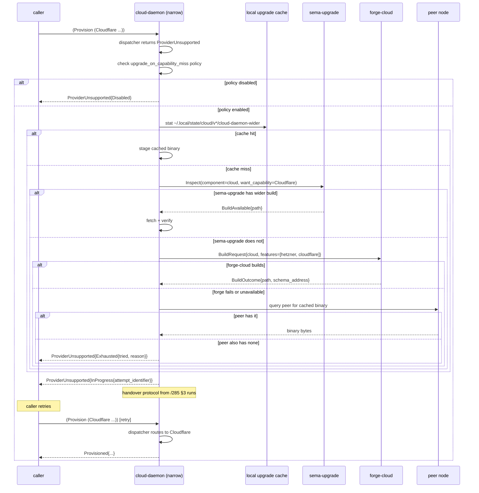

# 22/4 — Opt-in feature compilation pattern for component daemons

*Designer slice in the cloud-CriomOS research sweep. The pattern
covers Cargo feature flags on stateful component daemons (cloud is
the worked example), the capability-discovery wire shape, the
capability-missing reply variant, the eventual self-upgrade flow
that fetches a wider build when the daemon cannot satisfy a
request, and the relationship with sema-upgrade's version-handover
protocol. Per spirit intent 283 (provider integrations may be
build-time opt-ins) and 284 (capability-missing daemons may
eventually self-upgrade before unsupported replies).*

## 0. TL;DR

A stateful component triad may compile sub-capabilities as Cargo
features. **Cloud's worked example**: `cloud-daemon`'s `Cargo.toml`
declares one feature per provider integration (`cloudflare`,
`google`, `hetzner`, ...), each gating an extra dependency and
its dispatcher module. `default = []`; the binary the workspace
publishes carries no provider. CriomOS-home composes the right
feature set per host (a Hetzner-only host's flake compiles
`cargo build -p cloud --features hetzner`; a multi-cloud host
adds the others).

**Discovery** is **`(Help Main)` per intent 263** — there is no
separate `(Capabilities)` operation. Help is mandatory on every
component (auto-injected by `signal_channel!`); its operation list
is sourced from the *compiled* operation surface, so a build
without `cloudflare` simply does not list cloudflare operations
in its Help reply. This is leaner than a parallel discovery op
and respects intent 263's verdict that NOTA-only argument shape
makes Help the universal discovery affordance.

**Capability-missing reply** is **`ProviderUnsupported(Reason)`**,
a typed reply variant on the cloud working contract beside the
existing kernel-layer `RequestUnimplemented` — same family as
`RequestUnimplemented`, but specifically the "binary was not
compiled with the requested provider" reason, not "operation
unknown to this contract version" or "operation present but not
yet implemented." The two coexist because they are different
classes of refusal; conflating them loses caller information.

**Self-upgrade** (intent 284) is **deferred behind a typed
upgrade-attempt state machine** that follows the sema-upgrade
boot dance, not a side path. When the daemon receives a request
for an unsupported provider, it consults `sema-upgrade` /
`forge-cloud` for a wider build, attempts to fetch it via a
declared fallback chain (intent 40), and replies
`ProviderUnsupported` if the chain exhausts. A successful upgrade
runs the version-handover protocol from /285 as a degenerate case
— one daemon retiring its narrower binary in favour of a wider
sibling on the same host.

**Pi stays separate**: its TypeScript extension model is an npm
plugin pattern, not a Cargo feature pattern, and the workspace's
Rust-component-only Cargo discipline doesn't extend to it.

## 1. Cargo feature flag pattern

### 1.1 Cloud Cargo.toml sketch

```toml
# cloud/Cargo.toml
[package]
name         = "cloud"
version      = "0.1.0"
edition      = "2024"
rust-version = "1.89"

[lib]
name = "cloud"
path = "src/lib.rs"

[[bin]]
name = "cloud"
path = "src/bin/cloud.rs"
required-features = []                   # CLI works on every build

[[bin]]
name = "cloud-daemon"
path = "src/bin/cloud-daemon.rs"
required-features = []                   # daemon binds even on empty build

[features]
default = []                              # ship-from-workspace baseline

# Each provider gates its SDK dependency, its dispatcher module,
# and the operation handlers that route to it.
cloudflare = ["dep:cloudflare-sdk"]
google     = ["dep:google-cloud-sdk"]
hetzner    = ["dep:hetzner-cloud-sdk"]

# Convenience feature for hosts that want every provider.
all-providers = ["cloudflare", "google", "hetzner"]

[dependencies]
# Contract crates are always present — the daemon must always be
# able to *receive* every operation in the contract; only the
# *executors* are feature-gated.
signal-cloud         = { git = "..." }
owner-signal-cloud   = { git = "..." }
signal-frame         = { git = "..." }
signal-sema          = { git = "..." }
sema-engine          = { git = "..." }
kameo                = { version = "0.20" }
tokio                = { version = "1", features = ["rt-multi-thread", "macros", "io-util", "net"] }

# Per-provider SDKs are optional.
cloudflare-sdk       = { version = "...", optional = true }
google-cloud-sdk     = { version = "...", optional = true }
hetzner-cloud-sdk    = { version = "...", optional = true }

# Self-upgrade dance.
signal-sema-upgrade        = { git = "..." }
signal-version-handover    = { git = "..." }
version-projection         = { git = "..." }
```

### 1.2 Source layout

```text
cloud/
  src/lib.rs                          re-exports per-feature modules
  src/bin/cloud-daemon.rs             daemon main; binds three sockets
  src/bin/cloud.rs                    thin CLI
  src/providers/mod.rs                pub fn enabled() -> Vec<ProviderName>
  src/providers/cloudflare.rs         #[cfg(feature = "cloudflare")]
  src/providers/google.rs             #[cfg(feature = "google")]
  src/providers/hetzner.rs            #[cfg(feature = "hetzner")]
  src/dispatch.rs                     match on ProviderName -> module call
  bootstrap-policy.nota               first-start policy
```

The dispatcher is the single place that knows about all providers:

```rust
// src/dispatch.rs
pub fn dispatch(provider: ProviderName, op: ProviderOperation)
    -> Result<ProviderReply, ProviderUnsupported>
{
    match provider {
        #[cfg(feature = "cloudflare")]
        ProviderName::Cloudflare => providers::cloudflare::handle(op),

        #[cfg(feature = "google")]
        ProviderName::Google => providers::google::handle(op),

        #[cfg(feature = "hetzner")]
        ProviderName::Hetzner => providers::hetzner::handle(op),

        // The catch-all arm covers both "not compiled in" and any
        // future provider name added to the contract enum that this
        // binary's build didn't gate. The same arm handles both
        // cases because the daemon cannot distinguish.
        _ => Err(ProviderUnsupported {
            provider,
            available: providers::enabled(),
        }),
    }
}
```

`ProviderName` lives in `signal-cloud` and is the full enum of all
providers the contract knows about. The catch-all arm fires when
the requested provider is not in the gated set — which equals "not
compiled in" for this binary.

### 1.3 Why contract crates always carry every provider

The contract crate (`signal-cloud`) is build-time-stable across
hosts. Two cloud daemons built with different feature sets are
*two builds of the same contract version*. Both speak the same
wire shape; both serialise the same `ProviderName` enum; both
return the same typed `ProviderUnsupported` reply variant. The
*daemons* differ in what they can do; the *contract* does not.

This matches the `RequestUnimplemented` pattern (/249 §1.6,
/257 §1.6): a contract operation may exist that some daemons
choose not to implement. The contract is the universal vocabulary
of what can be asked; per-binary feature gates are the local
vocabulary of what can be answered.

### 1.4 CriomOS-home composition

`CriomOS-home` is the workspace's home-manager / NixOS module
graph. Per-host modules already declare the active component set;
they extend to declare feature sets:

```nix
# CriomOS-home/modules/home/profiles/cloud.nix
{ config, pkgs, ... }: {
  persona.cloud = {
    enable = true;
    # Per-host feature set. Empty list = no providers compiled in.
    features = [ "hetzner" ];
  };
}
```

The home module translates `features = [ "hetzner" ]` into a
`cargo build --features hetzner` invocation (or, post-forge per
/271, a typed forge-cloud build request carrying the feature
set). Switching a host from Hetzner-only to multi-cloud is one
edit in the host's `cloud.nix`, then `home-manager switch`. The
new daemon binary is staged alongside the old one (per the
multi-version layout sketched in /285 §3.2); a handover happens
on socket flip.

### 1.5 What the CLI does

Per triad invariant 1, the CLI has exactly one Signal peer — its
daemon. The CLI does not know which providers are compiled in; it
sends whatever operation the user typed and prints whatever reply
came back. If the user typed `(Provision (Hetzner ...))` against
a daemon that wasn't built with `hetzner`, the CLI prints the
`ProviderUnsupported` reply as text. No CLI-side feature flags;
no CLI-side capability cache.

## 2. Capability discovery wire shape — designer recommendation

**Recommendation: `(Help Main)` and `(Help (Verb name))` per
intent 263 are the discovery channel. No separate
`(Capabilities)` operation.**

### 2.1 Why Help is the right home

The four candidates the brief named:

| Candidate | Verdict |
|---|---|
| New `(Capabilities)` op returning enabled-provider list | **Rejected** — duplicates Help's discovery role |
| Persist enabled providers in `meta-signal-cloud` policy state, queryable by anyone | **Rejected** — adds a contract surface for something Help already covers |
| Auto-inject capabilities into every reply | **Rejected** — overkill; pollutes every reply for a question asked rarely |
| Use `(Help Main)` per intent 263 | **Recommended** — already mandatory on every component |

`(Help Main)` returns the operation list this daemon supports;
because the operation list is sourced from the *compiled*
dispatcher (a build without `cloudflare` does not emit
`ProvisionCloudflare` handler arms), the Help reply names exactly
what this binary can answer. The caller learns "what can you do?"
from the same operation it already uses to learn "what can I ask?"

### 2.2 What `(Help Main)` returns on a featureless cloud build

```text
(HelpMainReply
  (component "cloud")
  (contract_version "<blake3 hash>")
  (operations
    [(Operation
       (name "Help")
       (description "discovery"))
     (Operation
       (name "Configure")
       (description "owner-only daemon configuration"))
     (Operation
       (name "Status")
       (description "report daemon state"))])
  (providers []))                       ;; empty list = no providers compiled in
```

Compared to a `cloud` daemon built with `--features hetzner`:

```text
(HelpMainReply
  (component "cloud")
  (contract_version "<same blake3 hash>")
  (operations
    [... (same baseline ops)
     (Operation
       (name "Provision")
       (description "provision a resource at a provider"))
     (Operation
       (name "Destroy")
       (description "destroy a resource at a provider"))])
  (providers
    [(Provider (name "Hetzner") (sdk_version "..."))]))
```

The contract version hash is identical between the two binaries —
they share the same `signal-cloud` declaration. The operations
list and providers list differ.

### 2.3 Help reply schema additions

The Help reply schema in /298 covers operations and verbs but not
providers. The cloud daemon (and every feature-gated daemon) adds
a `providers` leaf to `HelpMainReply`:

```rust
// signal-frame (kernel layer, since the Help reply lives there)
pub struct HelpMainReply {
    pub component: ComponentName,
    pub contract_version: ContractVersion,
    pub operations: Vec<OperationDescription>,
    // New leaf — present only on feature-gated components.
    pub providers: Vec<ProviderDescription>,
}

pub struct ProviderDescription {
    pub name: ProviderName,
    pub sdk_version: Option<String>,
}
```

The `providers` leaf is empty for components that don't have
feature gates (every persona triad daemon today). It is named
`providers` rather than `features` because "feature" is a Cargo
implementation term that doesn't belong on the wire — the wire
talks about *what providers a cloud daemon knows*, the build talks
about *what features a Cargo crate enables*. (Naming discipline:
`skills/naming.md`.)

### 2.4 What this lets you NOT build

Persisting capabilities in `meta-signal-cloud` policy state would
add: (a) a contract surface for setting capabilities, (b) a
working-state table, (c) bootstrap logic to seed initial values,
(d) a synchronisation concern between the *compiled* feature set
and the *recorded* feature set. All four disappear if Help is the
discovery channel because Help is sourced from the compiled
operation list — no persistence layer to keep in sync.

## 3. Capability-missing reply shape — designer recommendation

**Recommendation: typed `ProviderUnsupported(Reason)` reply
variant on the cloud working contract, peer to the kernel-layer
`RequestUnimplemented`.**

### 3.1 The two-axis classification

Refusals split on two axes:

| Axis | Variant |
|---|---|
| The operation does not exist in this contract version | `RequestUnimplemented(reason: NotInContract)` |
| The operation exists in the contract, but THIS BINARY did not implement it | `RequestUnimplemented(reason: NotImplementedByDaemon)` |
| The operation exists, the binary implements it, but the requested provider was not compiled in | **`ProviderUnsupported(provider, available, upgrade_status)`** |
| The operation, binary, and provider are all present, but the *policy* refuses (rate limit, auth, quota) | per-component typed rejection |
| The operation, binary, provider, and policy are all OK, but the underlying SDK call failed | per-provider typed failure |

The third row is the capability-missing case — distinct from row 2
because the operation handler *exists in the binary*; what is
missing is the per-provider executor module. A `cloud` daemon
built with `hetzner` only still has the `Provision` operation
handler; it just dispatches to a `ProviderUnsupported` arm when
asked for a Cloudflare provision.

### 3.2 Wire shape

```rust
// signal-cloud/src/lib.rs (working contract)
signal_channel! {
    Cloud {
        // ... existing operations
        operation Provision(ProvisionRequest),
        operation Destroy(DestroyRequest),
        operation Status(StatusRequest),
    }
    reply Reply {
        // ... existing replies
        Provisioned(ProvisionedResource),
        Destroyed(DestroyConfirmation),
        Status(StatusReport),

        // The capability-missing reply variant.
        ProviderUnsupported(ProviderUnsupported),
    }
}

pub struct ProviderUnsupported {
    pub provider: ProviderName,
    pub available: Vec<ProviderName>,        // what this daemon CAN do
    pub upgrade_status: UpgradeStatus,       // what self-upgrade tried
}

pub enum UpgradeStatus {
    /// Self-upgrade was not attempted (policy disabled or first hit).
    NotAttempted,
    /// Self-upgrade is in progress; caller may retry shortly.
    InProgress { attempt_identifier: AttemptIdentifier },
    /// Self-upgrade was attempted and exhausted its fallback chain.
    Exhausted { tried: Vec<UpgradeSource>, reason: ExhaustionReason },
    /// Self-upgrade is policy-disabled on this component.
    Disabled,
}

pub enum UpgradeSource {
    LocalCache,
    SemaUpgradeQuery,
    ForgeCloudBuild,
    PeerDownload { peer: PeerIdentifier },
}
```

Three load-bearing decisions in this shape:

1. **`available: Vec<ProviderName>`** lets the caller decide
   whether to fall back to a different provider it can use. The
   list is small (3-5 entries typical) so the inline cost is
   minimal.

2. **`upgrade_status: UpgradeStatus`** lets the caller distinguish
   "the daemon decided not to bother upgrading" from "the daemon
   tried and the network was unreachable" from "the daemon is
   upgrading right now, come back in 30 seconds." A naive
   `provider_not_supported` boolean conflates them.

3. **`upgrade_status: NotAttempted` is the default at design
   time.** Intent 284 phrases the self-upgrade as "eventually,"
   not "as the only option." The first cloud daemon ships with
   `NotAttempted` always and a deferred upgrade implementation;
   the typed reply doesn't need to change when upgrade lands.

### 3.3 Why a per-component typed variant, not a generic error

A generic `Reply::Rejected { reason: "provider not compiled in" }`
would lose: the available-providers list (typed `Vec<ProviderName>`,
not unstructured prose); the upgrade status (typed
`UpgradeStatus`, not a substring); and the dispatch-time
correctness check (the daemon could return any reason in any
position). The typed variant is the same discipline as /257 §1.6:
typed Unimplemented carries enough information for the caller to
*do something* with the refusal; a free-form string does not.

### 3.4 Coordination with `RequestUnimplemented`

The kernel-layer `RequestUnimplemented` (per /257, /297, /298)
stays for "this operation does not exist in this contract" and
"this operation exists but this daemon never wired it up."
`ProviderUnsupported` is a separate, per-component-contract
variant for the build-time-feature case. The two are not
substitutable: a caller seeing `RequestUnimplemented` does not
gain capability information from it (the operation is just
absent); a caller seeing `ProviderUnsupported` learns about the
daemon's compiled provider set and any in-flight upgrade.

A cloud daemon receiving `(Provision (Cloudflare ...))` on a
build without `cloudflare`:

- Operation `Provision` is in the contract: not
  `RequestUnimplemented(NotInContract)`.
- Operation `Provision` *is* implemented by the daemon (the
  handler arm exists): not
  `RequestUnimplemented(NotImplementedByDaemon)`.
- Provider `Cloudflare` was not compiled in:
  `ProviderUnsupported`. **This is the right variant.**

## 4. Self-upgrade flow and sema-upgrade interaction

Intent 284's "capability-missing daemons may eventually self-
upgrade before unsupported replies" needs to be a *protocol*, not
a side-effect — otherwise the daemon's refusal latency and its
contract surface fork from each other (the daemon could be
implicitly mutating its own binary during what is meant to be a
read-only NACK).

### 4.1 Trigger model

The cloud daemon's `Provision` handler arm runs the dispatcher
from §1.2. When the dispatcher returns `ProviderUnsupported`:

1. **Consult upgrade policy.** Owner-signal `cloud` carries a
   policy bit `upgrade_on_capability_miss` (per-component, default
   off in `bootstrap-policy.nota`). If unset, reply
   `ProviderUnsupported { upgrade_status: Disabled }` immediately.
   No further work.

2. **Check the local upgrade cache.** If a wider sibling binary
   is already staged on disk at
   `~/.local/state/cloud/v<X.Y.Z+wider>/cloud-daemon` (per
   /285 §3.2's per-version layout), proceed to step 5.

3. **Ask `sema-upgrade` whether a build is available.** Per /270
   §3a, sema-upgrade's `Inspect` operation already names "what
   version is appropriate for this component"; extend with a
   capability dimension (§4.4).

4. **If sema-upgrade has no wider build, ask the not-yet-existing
   `forge-cloud`** (per /271, /274) to build one with the
   requested provider. Forge-cloud is the per-component forge in
   /271's family map; it accepts a typed `BuildRequest
   { component: "cloud", features: ["hetzner", "cloudflare"] }`
   and replies with a `BuildOutcome` carrying the new binary's
   path and schema-address.

5. **Stage and handover.** The new wider binary is staged
   alongside the running narrower binary (per /285 §3.2). The
   version-handover protocol from /285 §3 runs as a degenerate
   case — same daemon, same redb, same active sockets, but the
   binary swaps. §4.3 explains the degeneracy.

6. **Reply with `InProgress { attempt_identifier }` while
   handover is mid-flight.** The caller's job is to retry shortly
   against the same daemon socket; the wider binary will answer.

7. **If any step fails, exhaust the fallback chain** (intent 40
   pattern). Reply `ProviderUnsupported { upgrade_status:
   Exhausted { tried, reason } }`.

### 4.2 The fallback chain (intent 40 pattern)

Intent 40 names the LLM-call fallback-chain pattern: each
upstream is tried in order; on failure or capability-miss, the
next is tried. The same shape applies to upgrade sources:



The order in the diagram is the designer-recommended default;
specific deployments may reorder (a host with no network access
might want `LocalCache, ForgeCloudBuild` only and skip
`PeerDownload`). The order is configured via owner-signal cloud
policy:

```nota
;; bootstrap-policy.nota fragment
(UpgradeFallbackChain
  [LocalCache
   SemaUpgradeQuery
   ForgeCloudBuild
   (PeerDownload (preference Nearest))])
```

### 4.3 Self-upgrade as a degenerate handover

The version-handover protocol from /285 §3 covers cross-version
handover: a v0.1.0 daemon hands its socket to a v0.1.1 daemon
when the binary is upgraded. The capability-miss case is a
*degenerate* handover: the schema does not change (same
`signal-cloud` contract version, same redb layout), only the
compiled feature set widens. Six concrete differences from the
full protocol:

| Field | Cross-version handover | Capability-widening handover |
|---|---|---|
| `schema_hash` | Differs between main and next | Identical |
| `commit_sequence` | High-water-mark relevant | Identical (no schema migration) |
| `last_record_id` | Tracks new append stream | Unchanged |
| `Mirror` traffic | Required (next answers, main mirrors) | **Not required** — handover is atomic; old binary exits |
| `DivergenceRecord` paths | Required for narrower-main case | **Not required** — schema is identical |
| Sockets | Per-version paths | Same socket path; binary swap only |

The capability-widening handover takes the cross-version protocol
and skips the Mirror / DivergenceRecord legs. Designer
recommendation: implement it as a flag on the existing handover
protocol (`HandoverMarker.kind = CapabilityWidening`) rather than
as a parallel protocol; the type system captures the degenerate
case while reusing all the machinery /285 already names.

```rust
// signal-version-handover/src/lib.rs (addition)
pub enum HandoverKind {
    CrossVersion,                        // /285 §3 full protocol
    CapabilityWidening,                  // §4.3 — same schema, new features
}

pub struct HandoverMarker {
    pub component: ComponentName,
    pub kind: HandoverKind,              // new
    pub schema_hash: ContractVersion,
    pub commit_sequence: u64,
    pub write_counter: u64,
    pub last_record_id: Option<u64>,
    pub from_features: Vec<FeatureName>, // new — what the narrower binary had
    pub to_features: Vec<FeatureName>,   // new — what the wider binary has
    pub recorded_at_date: Date,
    pub recorded_at_time: Time,
}
```

The `kind` discriminator picks the protocol branch; the
`from_features` / `to_features` leaves are only meaningful when
`kind = CapabilityWidening` and stay empty otherwise.

### 4.4 Sema-upgrade Inspect extension

Per /270 §3a, sema-upgrade's `Inspect` carries component identity
and the schema-address the daemon expects. The capability-miss
flow needs the same Inspect operation to accept a
"want-capability" hint:

```rust
// signal-sema-upgrade/src/lib.rs (extension)
operation Inspect(InspectRequest),

pub struct InspectRequest {
    pub component: ComponentName,
    pub current_schema_address: SchemaAddress,
    pub current_features: Vec<FeatureName>,
    pub want_features: Option<Vec<FeatureName>>,   // new
}

reply Reply {
    Inspected(InspectionResult),
}

pub enum InspectionResult {
    Proceed,
    PlanRequired { plan: MigrationPlan },
    UnknownStoredAddress,
    Quarantined { reason: QuarantineReason },
    // New: a build matching want_features is available.
    WiderBuildAvailable { artifact_path: ArtifactPath, schema_address: SchemaAddress },
    // New: no build matches want_features; forge-cloud may be asked.
    NoWiderBuild,
}
```

The two new reply branches are inert for non-capability-miss
boot-time inspects (the daemon doesn't pass `want_features`); they
fire only when the daemon's dispatcher hit `ProviderUnsupported`
and is now asking sema-upgrade about wider builds. Backwards-
compatible: existing callers leaving `want_features = None` get
the same four-branch reply they had before.

### 4.5 What this means for owner policy

The owner-signal cloud surface gains three new policy operations:

```rust
// owner-signal-cloud/src/lib.rs (additions)
operation ConfigureUpgradePolicy(UpgradePolicyConfig),
operation ConfigureFallbackChain(FallbackChainConfig),
operation OverrideUpgradeAttempt(OverrideRequest),

pub struct UpgradePolicyConfig {
    pub upgrade_on_capability_miss: bool,
    pub max_attempt_age: Duration,        // garbage-collect stale attempts
    pub require_owner_approval: bool,     // owner ApprovePlan dance per /270 §7
}
```

The owner approval bit ties self-upgrade into sema-upgrade's
existing approval flow (/270 §7). A host that wants tight
control can require explicit owner approval for every
capability-widening upgrade attempt; a host that wants
hands-off autonomy can disable owner approval and let the
fallback chain run unattended. Either policy is expressible in
the typed surface.

### 4.6 What this DOES NOT do

The flow does not:

- **Upgrade across schema versions.** Schema migration is /270's
  job; the capability-widening handover preserves schema.
- **Run unsupervised.** The owner approval bit (§4.5) and the
  upgrade-policy switch (§4.1 step 1) both default off; the
  first cloud deploy will not silently fetch binaries.
- **Override sema-upgrade's quarantine.** A daemon under
  quarantine (per /270 §7) stays quarantined; capability-miss
  attempts on a quarantined daemon reply
  `ProviderUnsupported { Exhausted { reason: Quarantined } }`.

## 5. Pi extension parallel

Pi's TypeScript extension model (per /281) is a different shape:

| Dimension | Workspace Cargo feature pattern | Pi extension model |
|---|---|---|
| Granularity | Compile-time, per-binary | Runtime, per-process |
| Language | Rust | TypeScript / Node |
| Discovery | `(Help Main)` over NOTA-on-Signal | Extension manifest at startup |
| Failure shape | Typed `ProviderUnsupported` reply | TypeScript exception or undefined |
| Distribution | Cargo features + flake build | npm package + `pi-config.json` |
| Upgrade | Multi-version daemon coexistence (/285) | npm install (out-of-band) |
| Authority | Owner-signal cloud / forge | Pi's auth / config |

These differ in every load-bearing dimension. The workspace's
Cargo discipline doesn't extend to Pi extensions because Pi is
a third-party harness adapted to the workspace via the
`persona-pi` triad (/266); the *triad* speaks NOTA on Signal,
but the *harness inside the triad* speaks Pi's TypeScript shape
to its own extensions.

**Recommendation: the Cargo feature pattern stays Rust-component-
only.** Pi extension discipline lives in the persona-pi triad's
contract, not in the universal triad invariants.

### 5.1 Where they touch

The persona-pi triad's working contract may carry a Pi-specific
capability operation — e.g. `(Help (Verb name))` against a
`persona-pi-daemon` returns Pi's loaded-extension list. That's a
*triad-shaped* discovery surface, even though the underlying
substrate is Pi's npm extensions. The persona-pi triad is the
adapter; the workspace doesn't see Pi's npm-flavour directly.

### 5.2 Composite extensions

A future workspace component that wants to compose a Rust feature
set *and* a Pi extension set — e.g. a hypothetical
`persona-research` component that loads Pi extensions for
prompt-handling and gates SDK integrations behind Cargo features
— ships:

- A Rust-side feature set per §1 for its own SDK integrations.
- A Pi-extension-loader configured through its owner-signal
  policy state.

The two discovery surfaces compose: `(Help Main)` returns both
the Rust operation list and the loaded Pi extensions, as
separate leaves of the reply. The daemon owns the composition.

## 6. Open design questions

Questions surfaced by this design, listed for psyche review.
None blocks the §1-§5 recommendations; each names a refinement.

1. **Feature-set fingerprint in `HelpMainReply`.** §2.3 adds a
   `providers` leaf to `HelpMainReply`. Should the leaf carry a
   hash over the enabled feature set, so callers can cache by
   identity? A simple `feature_set_fingerprint: Blake3Hash` over
   the sorted feature-name list would suffice. Lean: add it; the
   cost is one hash field and it makes "is this the same binary
   I queried last week?" cheap.

2. **`ProviderName` enum closure.** §3.2 names `ProviderName` as
   a closed enum in `signal-cloud`. A future provider needs a
   contract version bump (new variant). Alternative: open enum
   with a `Custom(String)` variant. Designer lean: closed enum,
   because variants are first-class typed dispatch arms and an
   open string variant fragments the dispatcher into a
   match-on-prefix shape that is harder to audit. The cost is a
   contract-version bump per new provider; the benefit is the
   compiler-enforced dispatch table.

3. **`FeatureName` placement.** §4.3 introduces `FeatureName` in
   `signal-version-handover`. Should this be `signal-cloud`-
   specific or workspace-universal? Lean: workspace-universal
   under `version-projection::FeatureName`, because the same type
   appears in every feature-gated component. The first concrete
   instances are `cloud`-shaped, but the type belongs at the
   universal tier.

4. **Sema-upgrade vs forge-cloud responsibilities.** §4.4 has
   sema-upgrade replying `NoWiderBuild` and §4.2 then asking
   forge-cloud. Alternative: sema-upgrade always proxies
   forge-cloud and the daemon never speaks forge-cloud directly.
   Lean: daemon speaks both, because the daemon is the one with
   the upgrade-policy state and the fallback-chain configuration.
   Sema-upgrade is the registry of *what's available*; forge-cloud
   is the *builder of new things*. Two roles, two contracts.

5. **CapabilityWidening handover atomicity.** §4.3 names handover
   as "atomic; old binary exits." If the wider binary fails to
   bind its sockets, does the narrower binary stay up? Designer
   lean: yes — the narrower binary holds the sockets until the
   wider binary completes its `bind` and replies
   `ReadyToHandover`; on failure, the narrower binary stays
   serving and the upgrade attempt is recorded as
   `Exhausted { reason: WiderBindFailed }`.

6. **Multi-host capability cache.** §4.2 names peer-download as
   the fourth fallback. The peer protocol is undesigned. Sketch:
   a peer-cloud daemon exposes a `(ListCachedBuilds)` Help-adjacent
   operation; the asking daemon queries N peers in parallel and
   takes the first that has a verified-signed build matching its
   need. The full peer protocol is out of scope here; the typed
   `UpgradeSource::PeerDownload { peer }` slot in §3.2 is the
   placeholder.

7. **Forge-cloud existence timing.** §4.2 and §4.4 assume
   forge-cloud exists (per /271, /274). It does not yet. Until it
   ships, the fallback chain reduces to `[LocalCache,
   SemaUpgradeQuery, PeerDownload]`. The typed `UpgradeSource`
   enum already covers the partial-chain case; no contract change
   needed when forge-cloud lands.

8. **Help reply backward compatibility for non-feature-gated
   components.** §2.3 adds a `providers` leaf. Should
   non-feature-gated daemons' `HelpMainReply` include a `providers:
   []` empty list, or should `providers` be `Option<Vec<...>>`?
   Lean: empty list, because absence-and-presence in the same
   typed shape is cleaner than `Some([]) vs None` for what is
   semantically "this component doesn't have providers."

## 7. References

### Spirit intent records

- **263** — Help operations in every component (the universal
  discovery affordance this design uses).
- **270** — sema-upgrade triad shape (the upgrade orchestrator
  the capability-widening handover consults).
- **271** — forge component family design (the build-it path for
  wider binaries that don't exist yet).
- **274** — forge skeleton reconciliation (the per-component
  forge `forge-cloud` that this design names).
- **278** — multi-version daemon coexistence (the per-version
  socket layout the capability-widening handover reuses;
  designer-report number is /285).
- **283** — provider integrations may be build-time opt-ins
  (this design's anchoring intent).
- **284** — capability-missing daemons may eventually self-upgrade
  before unsupported replies (this design's eventual-upgrade
  intent).
- **40** — LLM-call fallback-chain pattern (the shape §4.2
  reuses).

### Designer reports

- `reports/designer/249-component-intent-gap-analysis.md` — the
  `RequestUnimplemented` pattern this design coordinates with
  (§3.4).
- `reports/designer/257-signal-contracts-names-and-shape-audit.md`
  — typed-Unimplemented discipline §1.6 (the pattern
  `ProviderUnsupported` extends).
- `reports/designer/263-schema-specification-language-design.md`
  — the language schemas are written in; orthogonal to this
  design's feature-flag concern.
- `reports/designer/315-design-sema-upgrade-and-handover-current-state.md`
  — the upgrade orchestrator this design's §4.4 extends.
- `reports/designer/316-design-forge-family-current-direction.md`
  — the forge family map; forge-cloud lives there. Also the
  per-component forge skeleton the capability-widening upgrade
  consults.
- `reports/designer/281-headless-pi-research.md` — Pi extension
  model for the §5 parallel.
- `reports/designer/285-versionprojection-trait-and-handover-protocol-specification.md`
  — the version-handover protocol the capability-widening
  handover degenerates from. Section §3 of this report cites
  /285 §3.
- `reports/designer/298-design-help-operations-in-components.md`
  — the Help operation shape this design's capability discovery
  reuses.

### Skill files

- `skills/component-triad.md` — triad invariants, single-argument
  rule, compile-time module index. §1.2's dispatcher and §3.1's
  reply-typing both apply the patterns named there.
- `skills/naming.md` — the `providers` vs `features` distinction
  in §2.3.
- `skills/nota-design.md` — positional NOTA records, the shape of
  every wire payload sketched here.
- `skills/reporting.md` — discipline for this report itself.

### Sibling reports in this slice

This is report 4 in the cloud-CriomOS design research slice
(third-designer/22). Sibling reports are produced in parallel by
other subagents; cross-reference at slice-end synthesis.
