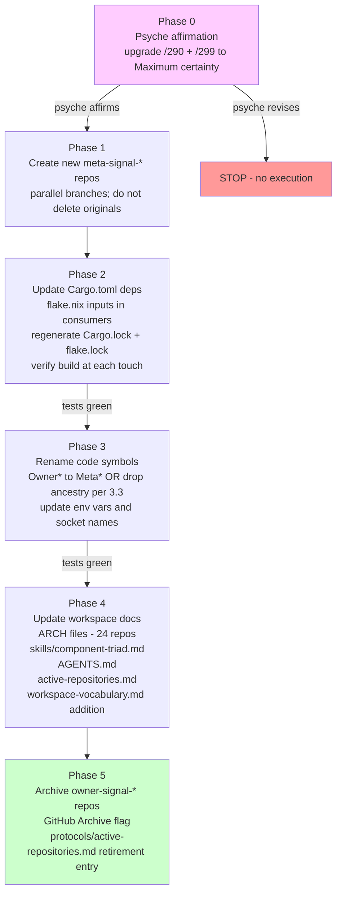

# 22/5 - `owner-signal-*` to `meta-signal-*` rename impact survey

*Third-designer (parallel-main designer lane) survey of the
workspace impact of the proposed `owner-signal-<component>` to
`meta-signal-<component>` rename. Survey + plan only; no execution,
no commits, no subagents, no intent logging. Anchored on spirit
intent records 290 (Decision, Minimum certainty: "meta-signal is
preferred over owner-signal as the policy contract name") and 299
(Clarification, Minimum certainty: "Meta-signal is the preferred
candidate name over owner-signal, but this is a tentative rename
direction rather than a completed vocabulary change").*

## 0. TL;DR

- **Scope.** 8 GitHub repositories rename, 8 crate names rename,
  ~169 Owner-prefixed code symbols rename, ~95 ARCH-file lines
  edit, ~105 workspace files (skills, AGENTS, INTENT, reports,
  intent log mentions) edit, 8 flake-input renames in `persona`
  + cascading flake.lock invalidations, 4 nested deploy-stack
  flake.lock entries refresh.
- **Phase count.** 5 phases recommended (repo create -> Cargo
  deps -> code symbols -> docs -> archive originals). Phases
  must run on a feature branch off `main` with full convergence
  before merge; piecemeal merge breaks downstream consumers.
- **Key risk.** The mandate's certainty is **Minimum** on both
  records 290 and 299, and record 299 is explicit that this is
  *"a tentative rename direction rather than a completed
  vocabulary change."* Executing a 169-occurrence Rust symbol
  rename + 8 repo renames + 4 dependent flake.lock invalidations
  on the strength of a tentative-Minimum direction is the wrong
  shape. **Recommendation: escalate to the psyche for a Maximum
  certainty Decision before any execution.** The survey work
  below assumes the green light arrives; if it doesn't, do not
  execute.

## 1. Inventory: affected repos, code paths, docs

### 1.1 The 8 `owner-signal-*` GitHub repositories

Confirmed via `ls /git/github.com/LiGoldragon/owner-signal-*` -
exhaustive list:

| # | Repository | Counterpart working contract | Daemon consumers |
|---|---|---|---|
| 1 | `owner-signal-persona-spirit` | `signal-persona-spirit` | `persona-spirit` |
| 2 | `owner-signal-persona-mind` | `signal-persona-mind` | `persona-mind` |
| 3 | `owner-signal-persona-orchestrate` | `signal-persona-orchestrate` | `persona-orchestrate`, `persona-mind` (mind sends Mutate to orchestrate) |
| 4 | `owner-signal-persona-router` | `signal-persona-router` | `persona-orchestrate` (orchestrate owns router authority) |
| 5 | `owner-signal-persona-terminal` | `signal-persona-terminal` | `persona-terminal`, `persona` (engine manager owns terminal lifecycle) |
| 6 | `owner-signal-repository-ledger` | `signal-repository-ledger` | `repository-ledger` |
| 7 | `owner-signal-version-handover` | `signal-version-handover` | `persona`, `persona-spirit` |
| 8 | `owner-signal-sema-upgrade` | (no peer; sema-upgrade owns its own owner surface) | sema-upgrade (future) |

No `meta-signal-*` repository exists on GitHub or locally today;
the `cloud` and `domain-criome` design reports (22/1 and 22/2)
**propose** `meta-signal-cloud` and `meta-signal-domain-criome`
in text but neither component has been scaffolded yet (per
`reports/system-specialist/159-cloud-repo-scaffold-prototype.md`).

### 1.2 Workspace files referencing `owner-signal`

`grep -rln 'owner-signal' /home/li/primary/` returns **105 files**
across:

- **Workspace contracts:** `AGENTS.md` (line 161 - one mention),
  `protocols/active-repositories.md` (3 lines listing the
  contracts). ESSENCE.md does not reference owner-signal directly.
- **Skills:** `skills/component-triad.md` (11 mentions in the
  triad definition, vocabulary table, invariant 4, invariant 5,
  carve-outs). No other skill files mention owner-signal
  directly (`skills/naming.md`, `skills/contract-repo.md`,
  `skills/workspace-vocabulary.md` do not).
- **Intent log (`intent/`):** `persona.nota` (5 mentions),
  `component-shape.nota` (12 mentions including the 290 and 299
  records themselves), `deploy.nota` (3 mentions).
- **Reports:** ~80 mentions across `reports/operator/`,
  `reports/designer/`, `reports/second-designer/`,
  `reports/third-designer/`, `reports/operator-assistant/`,
  `reports/system-specialist/`, `reports/cluster-operator/`,
  `reports/nota-designer/`. The /257 audit, /287 distribution
  wave, /290 ARCH-diff, /296 pattern decisions, /302 audit,
  /152 architecture overview, /160 prefix-removal coordinated
  rename, and the 22/1 + 22/2 cloud-criome reports are the
  highest-density.
- **Orchestrate ARCHITECTURE.md:** 10 mentions (the orchestrate
  triad authority chain diagram is densely owner-signal-flavored).

### 1.3 ARCH files in repos referencing `owner-signal`

`grep -c owner-signal /git/github.com/LiGoldragon/*/ARCHITECTURE.md`
returns **24 files**, totalling ~95 line-occurrences:

| Density tier | Files (occurrence count) |
|---|---|
| High (>=8) | persona-orchestrate (14), signal-persona (11), persona-spirit (11), signal-persona-mind (8) |
| Medium (5-7) | signal-criome (6), persona-terminal (6), owner-signal-persona-router (6), signal-persona-terminal (5), signal-persona-router (5) |
| Low (2-4) | persona (3), signal-frame (2), repository-ledger (2), owner-signal-version-handover (2), owner-signal-repository-ledger (2), owner-signal-persona-terminal (2), owner-signal-persona-spirit (2), owner-signal-persona-orchestrate (2), owner-signal-persona-mind (2) |
| Single (1) | signal-version-handover, signal-repository-ledger, signal-persona-spirit, signal-persona-orchestrate, persona-mind, owner-signal-sema-upgrade |

### 1.4 Code symbol surface

`grep -rE 'OwnerOperationKind|OwnerOrchestrate*|OwnerSpirit*|OwnerMind*|OwnerRouter*|OwnerTerminal*|owner_socket'` across the daemon repos:

| Repo | Owner-prefixed symbol occurrences |
|---|---|
| persona-orchestrate | 26 (highest) |
| owner-signal-persona-terminal | 25 |
| persona-spirit | 22 |
| persona | 20 |
| persona-terminal | 15 |
| owner-signal-persona-orchestrate | 12 |
| persona-mind | 9 |
| repository-ledger | 9 |
| owner-signal-persona-mind | 2 |
| owner-signal-persona-router | 2 |
| owner-signal-version-handover | 1 |
| owner-signal-persona-spirit | 0 (uses module-namespaced `Operation`/`Reply` types) |
| owner-signal-repository-ledger | 0 (clean) |
| owner-signal-sema-upgrade | 0 (clean) |

**Total: ~169 Owner-prefixed code-symbol occurrences across 13
repos.** Note that `owner-signal-persona-spirit` and
`owner-signal-repository-ledger` already use the clean
ancestry-shed shape (types named `Operation` / `Reply` inside
the crate, accessed as `owner_signal_persona_spirit::Operation`).
The rest of the workspace has the ancestry-prefix smell that the
/257 audit already documented in §1.5 ("Ancestry-prefixed type
names").

### 1.5 Cargo.toml dependency surface

13 `Cargo.toml` files reference an `owner-signal-*` crate:

| Consumer crate | Owner-signal deps |
|---|---|
| `persona` | `owner-signal-version-handover` |
| `persona-mind` | `owner-signal-persona-orchestrate` |
| `persona-orchestrate` | `owner-signal-persona-orchestrate` (self via lib path), and the inverse |
| `persona-spirit` | `owner-signal-persona-spirit`, `owner-signal-version-handover` |
| `persona-terminal` | `owner-signal-persona-terminal` |
| All 8 owner-signal-* repos | self-name in their own Cargo.toml `[package]` and `[lib]` blocks |

### 1.6 Flake-input surface

`grep -n 'owner-signal-' /git/github.com/LiGoldragon/persona*/flake.nix`
returns 4 distinct flake-input declarations in `persona/flake.nix`
(`owner-signal-persona-terminal` as a flake input with
`.url`/`.inputs.nixpkgs.follows`/etc.), plus 4 flake.lock entries
in `persona/flake.lock` and other component flake.lock files. The
8 `owner-signal-*` repos each have their own `flake.nix`
declaring `name = "owner-signal-..."`.

### 1.7 `Owner`-type names used in code (cross-cutting smell)

The /257 audit already named this as workspace-wide issue §1.5.
Concrete instances:

- `OwnerOrchestrateRequest`, `OwnerOrchestrateReply`,
  `OwnerOrchestrateFrame`, `OwnerOrchestrateFrameBody`,
  `OwnerOperationKind` (in `owner-signal-persona-orchestrate`).
- `OwnerTerminalRequest`, `OwnerTerminalReply`,
  `OwnerTerminalOperationKind`,
  `OwnerTerminalRequestUnimplemented`,
  `OwnerTerminalUnimplementedReason` (in `owner-signal-persona-terminal`).
- `OwnerMind*`, `OwnerRouter*` alias dance per /257 §1.10.
- `MissingOwnerSpiritSocket` enum variant in `persona-spirit/src/error.rs`.
- `PERSONA_SPIRIT_OWNER_SOCKET` environment variable name.

These are downstream of the contract-repo name and have to move
in lockstep with it; they are not separable scope.

## 2. Mechanical scope (full enumeration tables)

### 2.1 Repository renames - 8 entries

| Current name | Target name |
|---|---|
| `owner-signal-persona-spirit` | `meta-signal-persona-spirit` |
| `owner-signal-persona-mind` | `meta-signal-persona-mind` |
| `owner-signal-persona-orchestrate` | `meta-signal-persona-orchestrate` |
| `owner-signal-persona-router` | `meta-signal-persona-router` |
| `owner-signal-persona-terminal` | `meta-signal-persona-terminal` |
| `owner-signal-repository-ledger` | `meta-signal-repository-ledger` |
| `owner-signal-version-handover` | `meta-signal-version-handover` |
| `owner-signal-sema-upgrade` | `meta-signal-sema-upgrade` |

(Note: per the persona-prefix-removal arc at intent record 280,
the `persona-` prefix may eventually drop, giving
`meta-signal-spirit`, `meta-signal-mind`, etc. That rename is a
**separate** arc - do not bundle it with the owner->meta rename.
The two renames are orthogonal and each is large; piggy-backing
them turns the survey into two surveys.)

### 2.2 Crate name renames - 8 entries

Inside each repo's `Cargo.toml`:

```toml
[package]
name = "owner-signal-<X>"   ->   name = "meta-signal-<X>"
repository = ".../owner-signal-<X>"  ->  ".../meta-signal-<X>"
description = "OwnerSignal contract for ..." -> "MetaSignal contract for ..."

[lib]
name = "owner_signal_<X>"   ->   name = "meta_signal_<X>"
```

The `lib.name` (snake_case) is the Rust crate identifier; every
`use owner_signal_<X>::...` statement renames to
`use meta_signal_<X>::...`.

### 2.3 Cargo dependency renames - 8 distinct consumer-crate edits

Each consumer `Cargo.toml` block of the form

```toml
owner-signal-<X> = { git = "https://github.com/LiGoldragon/owner-signal-<X>.git", branch = "main" }
```

renames to

```toml
meta-signal-<X> = { git = "https://github.com/LiGoldragon/meta-signal-<X>.git", branch = "main" }
```

Per `grep -rn 'owner-signal-\|owner_signal_' /git/github.com/LiGoldragon/persona*/Cargo.toml`
the consumer Cargo.toml files are: `persona`, `persona-mind`,
`persona-orchestrate`, `persona-spirit`, `persona-terminal`,
plus the 8 owner-signal-* crates themselves declaring their own
name. Total: ~13 Cargo.toml files edit.

### 2.4 Cargo.lock invalidation - 4+ files

Every consumer's `Cargo.lock` must regenerate (lockfile pinning
moves). `persona/Cargo.lock`, `persona-mind/Cargo.lock`,
`persona-orchestrate/Cargo.lock`, `persona-spirit/Cargo.lock`,
`persona-terminal/Cargo.lock`, and any subordinate locks under
the 8 contract crates themselves.

### 2.5 Flake input + flake.lock renames - ~4 flake.nix + ~4 flake.lock

`persona/flake.nix` declares `owner-signal-persona-terminal` as a
flake input (4 declarations: `.url`, `.inputs.nixpkgs.follows`,
`.inputs.fenix.follows`, `.inputs.crane.follows`). The
`outputs.packages.<system>.owner-signal-persona-terminal` and
`outputs.checks.<system>.owner-signal-persona-terminal` cascade
also rename.

`persona/flake.lock`, `persona-spirit/flake.lock`, and each
owner-signal-* repo's own `flake.lock` need updating with the
new GitHub URL.

### 2.6 Code symbol renames - ~169 occurrences

Tabulated by repo from §1.4. The naming-discipline question
(below in §3) determines whether the rename is mechanical
(`Owner<Component><X>` -> `Meta<Component><X>`) or semantic
(`Owner<Component><X>` -> `<X>`, dropping the ancestry word
entirely per `skills/naming.md` §"Anti-pattern: prefixing names
with their namespace or domain").

Designer recommendation: do the **ancestry-shed rename** in
the same pass (drop the `Owner`/`Meta` ancestry word entirely;
the crate name supplies the ancestry). Rationale: the /257 audit
§1.5 already named this as a workspace smell that should be
fixed; bundling the smell-fix with the prefix-rename avoids two
rename passes on the same files. Concrete shape:

| Current | Target (ancestry-shed) |
|---|---|
| `OwnerOrchestrateRequest` | `Request` (accessed as `meta_signal_persona_orchestrate::Request`) |
| `OwnerOrchestrateReply` | `Reply` |
| `OwnerOrchestrateFrame` | `Frame` |
| `OwnerTerminalRequest` | `Request` |
| `OwnerOperationKind` | `OperationKind` |
| `OwnerSpiritSocket` env var fragment | `MetaSpiritSocket`? - see §3 |

The macro-emitted prefix dance per /257 §1.9 also applies: the
type-alias boilerplate (`pub type Frame = OwnerXFrame; ...`)
becomes unnecessary if the macro emits unprefixed names by
default.

### 2.7 Environment-variable + socket-name renames

`persona-spirit/src/error.rs` and the home-profile wrapper
declare:

- `PERSONA_SPIRIT_OWNER_SOCKET` env var.
- `MissingOwnerSpiritSocket` error variant.
- `.owner.sock` or analogous suffix (verify per-repo).

These are agent-visible names (the home-profile wrapper sets
them; the spirit-cli skill documents them). Rename to
`PERSONA_SPIRIT_META_SOCKET`, `MissingMetaSpiritSocket`, etc.

### 2.8 Skill renames + content updates - 1 file rename, ~3 files content edit

- `skills/component-triad.md` - 11 mentions of `owner-signal`,
  edit to `meta-signal`. The "Vocabulary" section, "The shape"
  diagram, invariant 4 (two authority tiers), invariant 5 (policy
  state), witness-test table, carve-outs section all touch
  `owner-signal`.
- No `skills/owner-signal.md` exists today (verified via `find`),
  so no skill file rename is needed. But adding a
  `skills/workspace-vocabulary.md` entry for the rename
  predecessor is required - the predecessor pattern is what
  `workspace-vocabulary.md` exists to record.

### 2.9 ARCH file content updates - 24 files, ~95 line-edits

Per §1.3 density tiers. Each ARCH file needs a sweep for
`owner-signal-...` -> `meta-signal-...` and any associated
prose ("owner contract" -> "meta contract"; "owner-only" stays
because that *is* the semantic, not the name). The two-leg
ARCH file pair (the contract crate's own ARCH + the daemon's
ARCH referencing the contract) both update.

### 2.10 Workspace document updates - ~3 files

- `AGENTS.md` line 161 - the "Component triad" hard-override
  bullet. Updates the bullet to reflect the new policy-contract
  name pattern, with a `workspace-vocabulary.md` redirect for
  the predecessor.
- `protocols/active-repositories.md` lines 38, 48, 53 - the
  three owner-signal repo rows. Plus add any new repos as they
  land.
- `INTENT.md` (workspace-wide synthesis) - scan for owner-signal
  mentions and update. `INTENT.md` is rebuilt from `intent/*.nota`
  per `skills/intent-log.md`; the source updates and the
  synthesis follows.
- The intent log `intent/component-shape.nota` and
  `intent/persona.nota` carry the historical record - these are
  the psyche's verbatim statements and must **not** be edited
  retroactively (the intent log is append-only; supersession is
  explicit per `skills/intent-maintenance.md`). New entries
  citing the rename + the superseded predecessor are the right
  shape, not in-place edits to existing entries.

### 2.11 Report content - leave historical records alone

The ~80 report mentions of `owner-signal` are historical at this
point. Future reports use the new name; historical reports
stay as they were (per ESSENCE §"Backward compatibility" - the
report record is what it is at write-time; supersession is
declared in newer reports, not by editing the old ones).

The discipline exception: `reports/third-designer/22-cloud-criome-design-research/1-*`
and `/2-*` already use `meta-signal-cloud` /
`meta-signal-domain-criome`. These don't need editing; the
new components were designed against the new name.

## 3. Semantic scope (lexical vs conceptual)

This is the most important section of the survey. The mandate's
two records read tentative; the semantic question is whether
the rename is **purely lexical** (substitute the word, keep
everything else) or **conceptually reshapes** the policy-contract
boundary. Possibilities:

### 3.1 Pure lexical - `meta-signal-<X>` means exactly what `owner-signal-<X>` means

The contract is the same thing it always was: a typed
owner-only authority/configuration surface separate from the
peer-callable ordinary surface. "Owner" was the privilege
descriptor (who can call it); "meta" is a different descriptor
for the same thing.

Designer lean for **pure lexical**: this is the safest
interpretation, and is what reports 22/1 and 22/2 already
operate under (they describe `meta-signal-cloud` and
`meta-signal-domain-criome` as carrying *exactly* the owner-only
authority + configuration role - registration, credential rotation,
policy mutation - that `owner-signal-*` carries for other
components).

The smell to investigate: **"meta" is a thin word**. It carries
no information about *who can call* (which "owner" carried
directly). In English, "meta" suggests "about" or "above" - a
meta-protocol describes a protocol, a meta-signal would by
analogy describe a signal *about* a signal.

If the rename is pure lexical, the descriptor weakens. A reader
seeing `meta-signal-persona-mind` cannot tell from the name
that the contract is the owner-only authority surface; they
have to look up the convention. With `owner-signal-`, the name
explicitly tells the caller "this is the owner's channel."

This is a real cost of the rename - the new name is less
self-descriptive. The /299 record's "tentative" framing may
exist precisely because the psyche hasn't fully decided whether
to accept the loss of self-description.

### 3.2 Conceptual reshape - `meta-signal-<X>` means something different

If `meta-signal-` carries a new framing - "metadata about the
component", "out-of-band protocol", "the meta-level of the
component's signal vocabulary" - then the rename is conceptual
and changes what belongs in the contract.

Plausible reshapes:

- **Meta as "configuration about the component":** The
  contract carries only configuration + policy + lifecycle
  control, not state mutation. Authority Mutate verbs over
  working state (e.g., orchestrate ordering router to
  install a channel grant) might *not* be meta-signal because
  they mutate working state, not policy.
- **Meta as "all introspectable surfaces":** The contract
  expands to include observability/telemetry queries that today
  live in the ordinary `signal-<X>` (the Watch / Tap surfaces).
  This would conflate observation and authority - probably
  the wrong shape.
- **Meta as "version-skew + protocol metadata":** A very narrow
  meta-signal that carries only the version-skew guard, the
  handshake, the protocol-version exchange. This is the
  `meta-protocol` shape from the `meta` literal English meaning.

None of these reshapes are stated in record 290 or 299. The
records are pure rename direction; no semantic reshape is
declared. **Conclusion: assume pure lexical until the psyche
states a reshape.**

### 3.3 The "do we still need 'signal' in the name?" question

`skills/naming.md` and ESSENCE §"Naming" require:

> *Names don't carry their full ancestry. A type, variant, or
> field belongs to its surrounding namespace; repeating the
> namespace in the name is redundant ceremony.*

Does the rename target violate this? `meta-signal-persona-mind`
carries:

- `meta` - the privilege/role descriptor (where the rename's
  semantic lives).
- `signal` - the wire-protocol family (already present in
  `signal-frame`, `signal-sema`, `signal-persona-*`).
- `persona-mind` - the component being controlled.

Three layers of ancestry. The ordinary-contract pattern is
`signal-persona-mind` (two layers); the policy contract adds
`owner` or `meta` to discriminate.

Could the rename go further and drop `signal` entirely? -
`meta-persona-mind` instead of `meta-signal-persona-mind`?

Arguments **for** dropping `signal`:

- "meta" alone already implies a protocol; `meta-persona-mind`
  reads as "the meta-protocol for persona-mind."
- The full English-words discipline pushes against multi-word
  technical labels; `meta-signal-persona-mind` is four words.
- Symmetry-breaking with the working contract: `signal-persona-mind`
  is the working contract; `meta-persona-mind` is the meta
  contract. Two parallel names instead of one-with-prefix.

Arguments **against** dropping `signal`:

- `signal` names the wire fabric. Dropping it makes
  `meta-persona-mind` look like a Rust crate name, not a
  wire-contract repo. The discoverability suffers.
- The convention `signal-<X>` and `owner-signal-<X>` is well
  established in 24 ARCH files; replacing the *prefix*
  (owner -> meta) is a localized rename, but also replacing
  *whether the word `signal` appears at all* is a much larger
  pattern shift.
- `signal-frame`, `signal-sema`, `signal-core` exist as the
  framing layer; the contract names reading as
  `<role>-signal-<X>` aligns them with the rest of the
  signal family.

Designer lean: **keep the word `signal`.** The rename is
`owner-signal-<X>` -> `meta-signal-<X>`, not
`owner-signal-<X>` -> `meta-<X>`. Drop-`signal` is a separate
arc requiring its own psyche affirmation.

### 3.4 Better candidate names than `meta-signal`?

If the rename is happening at all, is "meta" the best
descriptor? Brief candidates:

| Candidate | Reads as | Drawback |
|---|---|---|
| `owner-signal-<X>` (status quo) | "the owner's channel for X" | Status quo |
| `meta-signal-<X>` (proposed) | "the meta-channel for X" | `meta` is thin; doesn't say "owner-only" or "policy" |
| `policy-signal-<X>` | "the policy channel for X" | Conflict: record 2 in `component-shape.nota` rejected `permission-signal` as a hallucinated middle tier. `policy-` may have the same baggage. |
| `authority-signal-<X>` | "the authority channel for X" | Longer; "authority" reads as direction (top-down) not category. |
| `admin-signal-<X>` | "the admin channel for X" | "admin" is operations-speak; not workspace vocabulary. |
| `root-signal-<X>` | "the root channel for X" | Conflict with directory-tree language. |
| `god-signal-<X>` | "the god channel for X" | Bluntly accurate; not workspace style. |

`meta-` is genuinely a thin word, but it's the psyche's chosen
direction (records 290 + 299). The survey's job is to plan the
rename, not relitigate the name. **However, the open question
in §6.1 should ask whether the psyche wants `meta-signal-` or
something else** before execution.

## 4. Phased rename pass design



### 4.1 Phase 0 - Psyche affirmation (NEW, recommended)

Both records 290 and 299 carry Minimum certainty, and 299 is
explicit that the rename is tentative. Before any of the
mechanical work begins, file a designer report (or intent-
clarification turn per `skills/intent-clarification.md`) asking
the psyche to:

1. Upgrade record 290 from Minimum to Maximum certainty (or
   revoke if the direction was a false start).
2. Decide on `meta-signal-` vs `meta-` (the §3.3 question).
3. Decide on the `Owner*` -> `Meta*` code-symbol question (§3.2)
   - keep the prefix dance, or drop ancestry entirely per
   /257 §1.5.

Without this affirmation, executing the rename burns ~2-3 days
of operator work on a tentative direction that may revert.

### 4.2 Phase 1 - Create new `meta-signal-*` repos

The cheapest path: **GitHub repo rename**. GitHub preserves
the rename history, sets up an HTTP-level redirect from the
old name, and keeps the git history intact. After rename,
the old name redirects for `git clone` for a transitional
window.

Alternative path: **fresh create + push**. New repo, no
history. This loses the change history (~50+ commits per
contract crate) and requires explicit URL updates everywhere,
not just dependency declarations.

**Recommendation: GitHub repo rename.** The redirect gives a
safety net during the consumer-update window; the history
preservation lowers archeology cost. 8 rename operations,
~5 minutes each.

Phase 1 is fast (one half-day for 8 repos) but it must
complete before Phase 2 begins; the consumer Cargo.toml
edits must reference real URLs.

### 4.3 Phase 2 - Cargo.toml + flake.nix consumer updates

13 Cargo.toml files edit (per §2.3) + 4 flake.nix files edit
(per §2.5). Each edit changes the dependency line:

```toml
owner-signal-<X> = { git = "https://github.com/LiGoldragon/owner-signal-<X>.git", branch = "main" }
```

to:

```toml
meta-signal-<X> = { git = "https://github.com/LiGoldragon/meta-signal-<X>.git", branch = "main" }
```

After each Cargo.toml edit, regenerate `Cargo.lock` (which
also rewrites the crate name throughout the lockfile). After
each flake.nix edit, run `nix flake update` to refresh
`flake.lock`.

**Verify at each step:** `cargo build` and `nix flake check`.
Phase 2 ends when every consumer builds against the new crate
names.

The GitHub repo redirect from Phase 1 means: between Phase 1
completion and Phase 2 completion, the old name still works
via redirect. This gives a safe transition window. But after
Phase 5 archives the originals, the redirect may not survive
- so consumers MUST update before Phase 5.

### 4.4 Phase 3 - Code symbol rename

This is the biggest scope per §1.4 (~169 occurrences across
13 repos). Coordinate the rename in feature-branch worktrees
per `skills/feature-development.md`; do not push partial
renames to `main`.

Decisions to lock before starting:

- `Owner<Component>Request` -> `Meta<Component>Request` (mechanical)
  vs `Request` (ancestry-shed). Per /257 §1.5, the ancestry-shed
  shape is the workspace direction; choose `Request`.
- `OwnerOperationKind` -> `OperationKind` (ancestry-shed).
- `OwnerOrchestrateFrame`/`OwnerOrchestrateFrameBody` -> `Frame`/`FrameBody`
  (already the per-contract pattern via `pub type` aliases in
  every contract crate; the alias goes away entirely if the
  macro emits unprefixed names per /257 §1.9).
- Env vars: `PERSONA_SPIRIT_OWNER_SOCKET` -> `PERSONA_SPIRIT_META_SOCKET`.
  This is agent-visible (the home-profile wrapper sets it,
  the spirit-cli skill documents it).

### 4.5 Phase 4 - Documentation update

Update in this order:

1. **`skills/workspace-vocabulary.md`** - **add the entry**
   declaring the rename with predecessor `owner-signal-<X>`
   citation, settled in spirit record 290+299 (upgraded to
   Maximum per Phase 0). This is the canonical settling
   surface per `skills/workspace-vocabulary.md` §"How each
   entry is shaped".
2. **`skills/component-triad.md`** - 11 owner-signal mentions
   converge to meta-signal. The "Vocabulary" section also
   updates "policy signal / owner contract" to "policy signal /
   meta contract" (decide based on §3.1 - whether to keep the
   "owner contract" alternate, or replace with "meta contract").
3. **`AGENTS.md`** - line 161 hard-override bullet updates the
   triad-shape rule.
4. **`protocols/active-repositories.md`** - 3 rows of
   `owner-signal-*` entries update to `meta-signal-*`; add a
   "Retired / Cleanup Targets" entry for the renamed-away
   repos.
5. **ARCH files** - 24 ARCH files, ~95 line-edits per §1.3
   density table. Done in repo-order: persona-orchestrate
   (14 edits) first because it's the densest; then
   signal-persona (11) and persona-spirit (11); etc.

### 4.6 Phase 5 - Archive `owner-signal-*` repos

GitHub provides a "Settings -> Archive this repository" toggle.
Archive marks the repo read-only; the redirect from Phase 1
remains active until GitHub eventually removes it. Update
`protocols/active-repositories.md` "Retired / Cleanup Targets"
section to list the archived repos.

This phase MUST come last. If any consumer still references
`owner-signal-X` after the archive, it will break (the redirect
expires; `cargo build` fails on missing repo).

### 4.7 What breaks if done out of order

| Out-of-order | Failure mode |
|---|---|
| Phase 2 before Phase 1 | Cargo can't find the new crate; build fails. |
| Phase 3 before Phase 2 | Code references old crate names with new symbol names; compile fails. |
| Phase 4 before Phase 3 | Docs describe new names while code still uses old; readers get confused. Less catastrophic but discipline-breaking. |
| Phase 5 before Phase 2 | Consumers can't pull the dependency; the redirect may or may not survive. **Catastrophic if it doesn't.** |
| Phase 0 skipped | Operator burns ~2-3 days on a Minimum-certainty direction; psyche may revert; work wasted. |

### 4.8 Should a feature branch carry the rename?

Yes. Per `skills/feature-development.md` and the
`horizon-leaner-shape` precedent in `protocols/active-repositories.md`,
a workspace-spanning rename of this scope lives in a feature
branch in worktrees, not on `main`. Branch name suggestion:
`meta-signal-rename` (per the predecessor pattern of
`horizon-leaner-shape`).

All 8 contract repos + 5 consumer daemon repos + the
documentation work + ARCH-file sweeps happen in worktrees on
this branch. Merge to `main` is one coordinated multi-repo
merge, not piecemeal. Until merge, agents working on `main`
continue using `owner-signal-*`.

## 5. Operator-bead recommendations

Per `skills/beads.md` §"When to file a bead", file beads for
**discrete units of work with definitions of done that span
sessions**. The rename meets this exactly. Recommended bead
hierarchy:

### 5.1 Epic bead

**Title:** "Workspace-wide rename: owner-signal-* to
meta-signal-* policy-contract pattern (per spirit /290)"

**Priority:** P2 (P1 only if psyche affirms Maximum certainty
in Phase 0).

**Description:** Scope this report. Definition of done: all 8
`owner-signal-*` repos renamed + archived; all consumers build
against `meta-signal-*` names; `protocols/active-repositories.md`,
`skills/component-triad.md`, `AGENTS.md`,
`skills/workspace-vocabulary.md` updated; 24 ARCH files
converge.

**Blocker:** Phase 0 - psyche must upgrade /290 + /299 to
Maximum certainty. File this dependency as a `bd dep` link to
a separate bead "Designer: ask psyche to settle /290 + /299"
(P1).

### 5.2 Child beads - one per affected repo

Per `skills/beads.md`'s pattern of *"discrete unit of work; spans
sessions; has definition of done"*, file one child bead per
repo:

| Child bead title | Repo | Scope |
|---|---|---|
| "Rename owner-signal-persona-spirit to meta-signal-persona-spirit + drop Owner* ancestry" | `owner-signal-persona-spirit` | GitHub repo rename; Cargo.toml + flake.nix update; ARCH file (1 mention); 0 code-symbol renames (already clean) |
| "Rename owner-signal-persona-mind to meta-signal-persona-mind + drop Owner* ancestry" | `owner-signal-persona-mind` | GitHub repo rename; Cargo.toml + flake.nix; ARCH (2); code-symbols (2) |
| "Rename owner-signal-persona-orchestrate to meta-signal-persona-orchestrate + drop Owner* ancestry" | `owner-signal-persona-orchestrate` | GitHub repo rename; Cargo.toml + flake.nix; ARCH (2); code-symbols (12) - highest contract-side density |
| "Rename owner-signal-persona-router to meta-signal-persona-router" | `owner-signal-persona-router` | GitHub repo rename; Cargo.toml + flake.nix; ARCH (6); code-symbols (2) |
| "Rename owner-signal-persona-terminal to meta-signal-persona-terminal + drop Owner* ancestry" | `owner-signal-persona-terminal` | GitHub repo rename; Cargo.toml + flake.nix; ARCH (2); code-symbols (25) - largest |
| "Rename owner-signal-repository-ledger to meta-signal-repository-ledger" | `owner-signal-repository-ledger` | GitHub repo rename; Cargo.toml + flake.nix; ARCH (2); code-symbols (0) |
| "Rename owner-signal-version-handover to meta-signal-version-handover" | `owner-signal-version-handover` | GitHub repo rename; Cargo.toml + flake.nix; ARCH (2); code-symbols (1) |
| "Rename owner-signal-sema-upgrade to meta-signal-sema-upgrade" | `owner-signal-sema-upgrade` | GitHub repo rename; Cargo.toml + flake.nix; ARCH (1); code-symbols (0) |

Each child bead blocks on the epic and on Phase 0 affirmation.

### 5.3 Consumer-update beads - one per daemon repo

| Title | Repo | Scope |
|---|---|---|
| "Update persona to depend on meta-signal-version-handover" | `persona` | Cargo.toml edit; Cargo.lock regenerate; code-symbols (20) |
| "Update persona-mind to depend on meta-signal-persona-orchestrate" | `persona-mind` | Cargo.toml; code-symbols (9) |
| "Update persona-orchestrate to depend on meta-signal-persona-orchestrate" | `persona-orchestrate` | Cargo.toml; code-symbols (26 - workspace-highest); rename `OwnerOrchestrateRequest`/`Reply`/`Frame`/`FrameBody` per §2.6 |
| "Update persona-spirit to depend on meta-signal-persona-spirit + meta-signal-version-handover" | `persona-spirit` | Cargo.toml; code-symbols (22); env var + socket name renames |
| "Update persona-terminal to depend on meta-signal-persona-terminal" | `persona-terminal` | Cargo.toml; code-symbols (15) |
| "Update repository-ledger to depend on meta-signal-repository-ledger" | `repository-ledger` | Cargo.toml; code-symbols (9) |

### 5.4 Doc-update bead

**Title:** "Workspace docs: converge owner-signal references to
meta-signal in skills/component-triad.md, AGENTS.md,
protocols/active-repositories.md; add workspace-vocabulary
entry"

**Priority:** P2.

**Scope:** §4.5 Phase 4 work. Doc-update bead can be filed
under the doc-author role (designer); the ARCH file sweep
per repo is part of each repo's child bead.

### 5.5 Total bead count

1 epic + 8 contract-rename child beads + 6 consumer-update
beads + 1 doc-update bead + 1 Phase 0 psyche-affirmation bead
= **17 beads**.

That's above the `~5-15 items` guidance in `skills/beads.md`
§"Periodic audit", but **this is one coordinated rename arc**;
the bead count is the work, not a backlog smell. The audit
recommendation applies to *stale* beads, not active arcs.

When Phase 5 lands, all 17 beads close together (or in a
short window), pulling the open count back to baseline.

## 6. Open design questions

### 6.1 Should the psyche affirm the rename at Maximum before execution?

**Recommended: yes.** The current Minimum certainty on both
records 290 and 299 (and 299's explicit "tentative" language)
is too thin a foundation for a ~3-day operator arc. Designer
files a separate clarification turn before any bead lands.

### 6.2 Pure lexical or conceptual reshape?

Per §3.1 vs §3.2. Designer lean: pure lexical. Confirm.

### 6.3 Drop ancestry from code symbols in the same pass?

Per §2.6 and the /257 §1.5 audit pattern. Designer
lean: yes - bundle the smell-fix with the prefix-rename to
avoid two passes on the same files. Confirm.

### 6.4 Keep `signal` in the contract-repo name?

Per §3.3. Designer lean: yes - `meta-signal-<X>` not
`meta-<X>`. Drop-signal would be a separate arc requiring
its own affirmation; conflating the two doubles the survey
scope.

### 6.5 Update "owner contract" / "owner socket" prose alongside?

`skills/component-triad.md`'s vocabulary table names two
synonyms for the contract: "policy signal" and "owner contract".
If the rename ships, the alternates may need updating:
"policy signal" stays (semantic-led name, unchanged); "owner
contract" -> "meta contract" or just retire the alternate?

Designer lean: retire the "owner contract" alternate; keep
"policy signal" as the semantic-led name; the new lexical
name is `meta-signal-<X>` and the words "owner" / "policy" /
"meta" are each fine as adjectives describing what the contract
does. But the **canonical name** in vocabulary is one of them.

Confirm: keep "policy signal" canonical, rename "owner contract"
to "meta contract" or drop the alternate entirely?

### 6.6 What about `owner_socket_path` / `.owner.sock` filename constants?

The Persona daemon configuration includes fields like
`current_owner_socket_path` (per spirit record 181 vocabulary)
and `.owner.sock` socket filename constants. These derive from
the "owner" word in the contract name; if the contract
renames, do these rename too?

Designer lean: **yes, in lockstep with Phase 3.** The
`current_main_owner_socket_path` -> `current_main_meta_socket_path`
rename is part of the consumer-update bead for `persona`. The
filename constants `.owner.sock` -> `.meta.sock` similarly.

But: these are agent-and-deploy-visible names. They appear in
systemd unit files, home-profile env wrappers,
`PERSONA_SPIRIT_OWNER_SOCKET` env vars. The rename is
load-bearing in CriomOS / CriomOS-home as well.

Add to scope: **search CriomOS-home, CriomOS-pkgs, and the
home-profile flake for `owner` socket references**. Quick check
above showed zero hits in those repos, but the home-profile
wrapper that sets `PERSONA_SPIRIT_OWNER_SOCKET` lives somewhere
and must update.

### 6.7 Is there a `meta-signal-X` that means something other than the rename target?

The word "meta-signal" doesn't carry workspace prior art before
records 290 + 299. No collision risk. But: "meta-X" patterns
exist elsewhere (`meta-report` for sub-agent session dirs in
`reports/<role>/<N>-<name>/`, per spirit record 231). The
"meta" word does carry workspace meaning in that context.

The rename **does not** conflict mechanically (no symbol
collision; the two `meta-` usages are different namespaces),
but a reader scanning `meta-` mentions sees both. Document
the distinction in `workspace-vocabulary.md`.

## 7. References

- **Spirit record 290** (component-shape Decision, Minimum):
  "meta-signal is preferred over owner-signal as the policy
  contract name"
- **Spirit record 299** (component-shape Clarification, Minimum):
  "Meta-signal is the preferred candidate name over owner-signal,
  but this is a tentative rename direction rather than a
  completed vocabulary change."
- **Spirit record 280** (component-shape Decision, Maximum):
  "Drop the persona- prefix from supervised persona components"
  - related but orthogonal rename arc.
- `reports/designer/257-signal-contracts-names-and-shape-audit.md`
  §1.5 (ancestry-prefixed type names), §3.2 (workspace-wide
  rename pass design)
- `reports/system-specialist/159-cloud-repo-scaffold-prototype.md`
  - documents that `owner-signal-*` remains active until rename
  lands; the cloud/domain-criome repos don't exist yet
- `reports/third-designer/22-cloud-criome-design-research/1-cloud-component-design.md`
  §2 - first design adoption of `meta-signal-cloud`
- `reports/third-designer/22-cloud-criome-design-research/2-domain-criome-component-design.md`
  §3 - second design adoption of `meta-signal-domain-criome`
- `reports/second-designer/160-persona-prefix-removal-coordinated-rename-2026-05-23.md`
  - the persona-prefix removal arc precedent for coordinated
  workspace-wide rename patterns
- `skills/component-triad.md` §"Vocabulary", §"The shape",
  invariant 4 (two authority tiers), invariant 5 (policy state)
- `skills/naming.md` §"Anti-pattern: prefixing names with their
  namespace or domain"
- `skills/contract-repo.md` §"Naming a contract repo"
- `skills/workspace-vocabulary.md` §"How each entry is shaped"
  - the canonical settling surface for the rename
- `skills/beads.md` §"When to file a bead", §"The bd CLI shape"
- `skills/feature-development.md` - the coordinated multi-repo
  branch precedent
- `protocols/active-repositories.md` lines 38, 48, 53 -
  the three current owner-signal entries
- `ESSENCE.md` §"Naming" - the no-redundant-ancestry rule
- `AGENTS.md` line 161 - the triad-shape hard-override bullet
- `/git/github.com/LiGoldragon/owner-signal-*/` - the 8 affected
  repositories

This report retires when (a) the psyche affirms /290 + /299 at
Maximum certainty and the epic bead lands, or (b) the rename
direction is withdrawn and a follow-up captures the decision.
