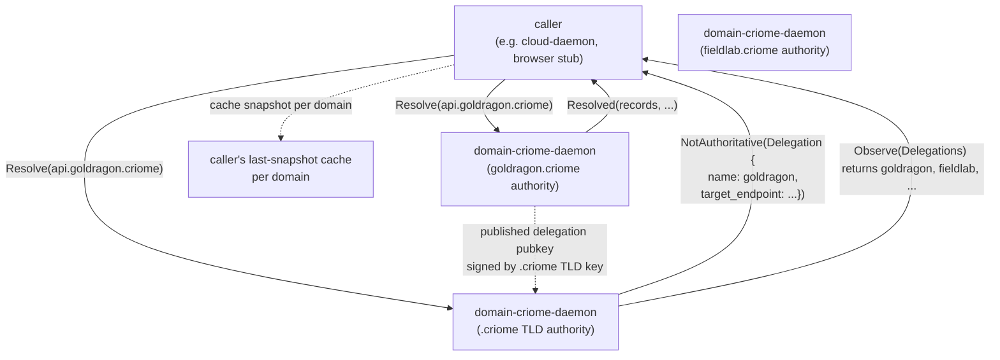

## 0. TL;DR

System-specialist landed six repositories (commits cited in the dispatch
frame) with passing tests and zero `signal-core` dependency. The contracts
are clean against the foundation discipline laid out in
`reports/system-specialist/158-...`, and the work avoided most of the
ambient design hazards. **The new psyche refinements (records 311-320)
reach the landed contracts at exactly three load-bearing seams:**

1. **Mutate / Query channel split (R1).** The landed `signal-cloud`
   already excludes `Apply` (system-specialist chose owner-only for v1).
   `Observe` + `Validate` are unambiguous Query. **`Plan` is the load-
   bearing question** — it generates and stores a daemon-side plan, so
   it has *Mutate* semantics on the plan store, even though the typed
   reply is a read. **Recommendation: move `Plan` to `owner-signal-
   cloud` (privileged because it materialises daemon state); leave
   `Observe` + `Validate` on ordinary.** R1's framing is honoured
   without renaming the repos.

2. **Content-addressed domain authority (R2).** The landed
   `signal-domain-criome` contract today **assumes a central registry**
   — `Observe(Domains)` returns a flat `DomainListing`; `Resolve` and
   `Project` take a `DomainName` as if any daemon could answer for any
   domain. **For R2, the contract needs a `DomainAuthority` concept and
   a typed `NotAuthoritative` rejection that points the caller at the
   authoritative daemon.** Each `.criome` domain is its own daemon;
   `domain-criome` itself is only the `.criome` TLD-root authority.

3. **Sub-ID + Criome identity primitives (records 317-318).** The
   landed contracts use string newtypes everywhere (`DomainName`,
   `ProviderAccount`, etc.) and have **zero reference to Criome
   identity**. The landed work pre-dates records 317-318 — not a
   defect, just unfinished. Add Criome identity to `Registration`
   (who-can-register), `Delegation` (delegation target as a Criome
   principal), and `ApplyPlan` authorisation (which Criome principal
   approved this plan).

The audit-driven revision is **roughly 5 ordinary beads + 3 follow-up
beads + 4 cross-subagent-dependent beads.** The landed shape is good
enough that none of these need destructive rework — every revision is
additive. The repos do not need renaming as part of R1; the channel
split is implemented by moving `Plan` across the existing repo
boundary.

## 1. Audit table per repo

The six repos as landed, with the R1 + R2 + Criome identity gaps
called out per contract.

### 1.1 `signal-cloud` (ordinary, commit `29c392bb`, 6 tests)

| Element | Current shape | R1+R2 ideal | Status |
|---|---|---|---|
| Operations | `Observe`, `Validate`, `Plan` | `Observe`, `Validate` (move `Plan` to owner) | **Revise** |
| `Apply` | Absent (deferred to owner) | Absent on ordinary | Aligns |
| `Watch`/`Unwatch` | Absent (deferred) | Eventually needed | Defer |
| Replies | `Observed`, `Validated`, `PlanPrepared`, `RequestUnsupported`, `RequestRejected` | `Observed`, `Validated`, `RequestUnsupported`, `RequestRejected` | **Revise (drop `PlanPrepared`)** |
| Provider variants | `Cloudflare`, `GoogleCloud`, `Hetzner` (closed enum) | Closed enum is correct | Aligns |
| `Capability` enum | 6 variants, closed | Closed enum is correct | Aligns |
| `CapabilityState` | Three-layer (`Compiled` / `Configured` / `Authorized`) plus `Unsupported` / `Unauthorized` | Aligns with the build-capability discipline | Aligns |
| `RecordKind` | 5 variants (A, AAAA, CNAME, TXT, MX) | Enough for v1 (per system-specialist intent) | Aligns |
| `DomainName` typing | Plain string newtype | Should be Criome-aware; see §4 | **Revise** |
| Criome identity | None | `caller_principal` field on operations that need identity-bound rate-limiting; otherwise none on this contract | **Add when 317 lands** |
| Test coverage | 6 tests, rkyv + NOTA + no-old-shape | Aligns | Aligns |

**Net direction.** Strip `Plan` from this contract. Otherwise the
landed shape is already R1-correct: every operation here is Query
(`Observe` reads provider state; `Validate` checks intent without
mutation). The `RequestRejected` reason `ProviderRateLimited` is
worth flagging — that's a *provider-side* mutation refusal surfaced
on a Query contract; it's fine because the daemon is reading state
when it discovers the rate limit, not mutating.

### 1.2 `owner-signal-cloud` (owner, commit `08f9fa36`, 7 tests)

| Element | Current shape | R1+R2 ideal | Status |
|---|---|---|---|
| Operations | `RegisterAccount`, `RotateCredential`, `SetPolicy`, `ApprovePlan`, `ApplyPlan`, `RetireAccount` | Add `PreparePlan` (moved from ordinary) | **Add** |
| `Apply` semantics | Owner-only via `ApplyPlan(Application)` | Owner-only is R1-correct | Aligns |
| Credential model | `CredentialHandle` (string newtype, never carries bytes) | Aligns with handle-not-byte discipline | Aligns |
| `SetPolicy` | Bundles `ZonePolicy` + `CapabilityPolicy` | Reasonable v1 shape | Aligns |
| Rejection reasons | `CredentialHandleUnknown`, `AccountUnknown`, `PlanUnknown`, `PlanNotApproved`, `CapabilityUnauthorized` | Add `PrincipalUnauthorized` when Criome identity lands | **Add when 317-318 land** |
| Replies | Typed receipts per operation | Aligns | Aligns |
| Operation re-exports | Reuses `Provider`, `Capability`, `DomainName`, `PlanIdentifier`, `ProviderAccount` from ordinary | Aligns — the policy contract reuses ordinary types, doesn't shadow them | Aligns |
| Test coverage | 7 tests | Aligns | Aligns |

**Net direction.** Add a `PreparePlan(PlanPreparation)` operation that
takes a `DesiredState` and replies with a `PlanPrepared(Plan)` (the
same `Plan` record currently in `signal-cloud`). The work moves with
the operation. This implements R1: every operation that materialises
daemon state crosses the owner boundary.

### 1.3 `signal-domain-criome` (ordinary, commit `3e48fe36`, 7 tests)

| Element | Current shape | R1+R2 ideal | Status |
|---|---|---|---|
| Operations | `Observe`, `Resolve`, `Project` | `Observe`, `Resolve`, `Project`, **plus authority-handling** | **Revise** |
| `Observe(Domains)` | Returns flat `DomainListing` | Each daemon answers only for domains it's authoritative for; flat listing only at the `.criome` TLD root | **Revise (R2)** |
| `Resolve(ResolutionQuery)` | Takes any `DomainName`, returns `ResolutionResult` for any name | Must check authority; return `NotAuthoritative(authoritative_endpoint)` for off-daemon names | **Revise (R2)** |
| `Project(ProjectionQuery)` | Same as above — domain-agnostic | Same authority check | **Revise (R2)** |
| `ResolutionScope` enum | `Public`, `Internal`, `Intelligent` | Aligns with v1 dimensions | Aligns |
| `RecordKind` enum | 4 variants (A, AAAA, CNAME, TXT) | Sparse v1 shape; aligns | Aligns |
| `ResolutionResult` | Contains only `addresses: Vec<Address>` | Should be `Vec<Record>` with typed kinds per the design — addresses alone is too narrow | **Revise** |
| `Delegation` | `name: DelegationName, domain: DomainName` | Should carry `delegated_daemon_endpoint` for R2 routing | **Revise (R2)** |
| Criome identity | None | `caller_principal` on `Resolve` if trust-graph-filtering ships v1 (record 318) | **Defer until 318 lands** |
| Test coverage | 7 tests | Aligns | Aligns |

**Net direction.** Two substantive R2 revisions:

1. **Introduce typed `NotAuthoritative` rejection.** When a peer calls
   `Resolve(goldragon.criome)` against the `.criome` TLD daemon, the
   daemon should not lie and forward — it should reply with
   `NotAuthoritative(Delegation { name: "goldragon", domain:
   "goldragon.criome", target_endpoint: <unix socket or sub-daemon
   reference> })`. This is the content-addressed primitive.
2. **`Delegation` carries an endpoint.** Without it the caller can't
   resolve the delegation chain by querying the authoritative daemon
   directly.

The `Observe(Domains)` shape — flat listing — works at the TLD root
level (the `.criome` daemon lists every directly-registered subdomain)
but is conceptually wrong for sub-daemons (a `goldragon.criome` daemon
shouldn't be able to list every name; it owns *its own* zone). The
clean R2 shape is **`Observe(Domains)` returns the zones this daemon
is authoritative for, period**. The cross-daemon discovery is via
`Resolve` and the federation registry (record 312).

### 1.4 `owner-signal-domain-criome` (owner, commit `37c86a42`, 6 tests)

| Element | Current shape | R1+R2 ideal | Status |
|---|---|---|---|
| Operations | `RegisterDomain`, `Delegate`, `RetireDomain`, `SetPolicy` | Add `RegisterAuthority(AuthorityRegistration)` for R2 federation | **Add** |
| `Registration` payload | `domain: DomainName` only | Add `registrant: Principal` when 317 lands | **Add when 317 lands** |
| `Delegation` | `name`, `domain`, `target: DelegationTarget (string)` | Target should be a typed daemon endpoint (socket path / address / Criome principal) | **Revise** |
| `Retirement` | `domain` only | Same — add `principal_ordering_retirement` when 317 lands | **Add when 317 lands** |
| `ProjectionPolicy` / `ProjectionDirective` | `Enable` / `Disable` | Aligns with directive-not-boolean discipline | Aligns |
| Rejection reasons | `DomainAlreadyRegistered`, `DomainUnknown`, `DelegationAlreadyExists`, `DelegationUnknown`, `ProjectionUnavailable` | Add `NotAuthoritative` + `PrincipalUnauthorized` when R2 + 317 land | **Add** |
| Test coverage | 6 tests | Aligns | Aligns |

**Net direction.** Federation needs a typed daemon endpoint — not
"DelegationTarget" as an opaque string. Without that field the
delegation graph is uninterpretable: the caller can't follow the
chain. The `DelegationTarget` newtype should be replaced or extended
to carry the authoritative-daemon reference.

### 1.5 `cloud` (runtime, commit `ba35849a`, docs-only)

| Element | Current shape | R1+R2 ideal | Status |
|---|---|---|---|
| Documentation only? | Yes (per system-specialist discipline) | Correct until daemon path lands | Aligns |
| Actor sketch | `CloudflareProvider`, `PlanStore`, `PolicyStore`, `RateLimitGate`, `RemoteOperationTracker` | Reasonable v1 actor set | Aligns |
| Mutate/Query split in ARCH | Not present | Should call out which operations are ordinary vs owner per R1 | **Revise** |
| Open question on Apply | "Should ordinary `signal-cloud` ever expose `Apply`" — psyche-flagged | R1 settles: no, ordinary stays Query-only | **Settled by R1** |
| Open question on rename | "Should the policy-signal repo be born as `owner-signal-cloud` or `meta-signal-cloud`" | Parked per dispatch | Aligns |

**Net direction.** ARCH update — add a short "R1 channel discipline"
section noting that mutate-class operations route to the owner socket.
This is non-blocking; the operator beads carry the doctrine.

### 1.6 `domain-criome` (runtime, commit `fedc43b0`, docs-only)

| Element | Current shape | R1+R2 ideal | Status |
|---|---|---|---|
| Documentation only? | Yes | Correct until daemon path lands | Aligns |
| Actor sketch | `RegistryStore`, `ProjectionEngine`, `Resolver`, `PolicyStore` | Reasonable; will need a `Federation` actor for R2 cross-daemon resolution | **Add** |
| Content-addressing concept | Not present in ARCH | Should be the central architecture story | **Revise (R2)** |
| Cloud projection model | "daemon-to-daemon path that sends projections to cloud" in implementation slice | Aligns with subagent 1 + 2's push-to-cloud design | Aligns |
| Domain authority model | Implicit central registry | Should be explicit per-domain-daemon model | **Revise (R2)** |

**Net direction.** This ARCH carries the biggest R2 revision —
add a "Content-addressed authority" section that names the model:
each .criome domain is its own daemon, and the `domain-criome`
daemon proper is only the TLD-root authority for the *.criome
namespace itself (delegations + federation registry).

### 1.7 Cross-cutting alignment notes

- **All six repos avoid `signal-core`** — system-specialist's
  "no-signal-core" test enforces it. Aligns.
- **All six repos use the `owner-signal-` prefix.** This is correct per
  the parked-rename instruction; do NOT propose renaming as part of
  this audit.
- **All six contracts use closed enums for provider/capability/etc.**
  Aligns with the typed-records-over-flags discipline.
- **All six avoid `Sub`-/`Req`-/`Cfg`- abbreviations.** Aligns with
  naming.
- **All four contract crates pass round-trip tests.** Aligns with the
  contract-repo discipline.

## 2. Apply R1 (Mutate/Query channel split) — cloud-specific

### 2.1 The framing

R1 says: **Cloud's `Mutate` verbs go on meta-signal-cloud
(privileged); `Query` verbs go on signal-cloud (public).**
Cloudflare is treated as state. Refresh-by-querying-Cloudflare is
public; mutating Cloudflare requires owner authority.

The landed `signal-cloud` operations are `Observe`, `Validate`, and
`Plan`. The landed `owner-signal-cloud` operations include the
provider-API-mutating `ApplyPlan` (already owner-only) plus the
account/credential/policy/lifecycle operations.

`Apply` was already deferred to owner — that's R1-correct for the
upstream-mutating verb. The interesting question is about
**daemon-internal state mutations**.

### 2.2 The Plan question

`Plan(DesiredState)` does **two** things:

1. **Reads** provider state (so the daemon can compute the diff).
2. **Writes** to the daemon's plan store (so `ApplyPlan(plan_id)`
   has something to look up).

The reply carries a `PlanIdentifier` — a fresh identity minted by
the daemon — and the `Plan` record carrying every record to create,
update, or delete.

By the Sema layer's classification, `Plan`:
- Touches provider HTTP (read — `Match`).
- Touches the daemon's plan-store table (`Assert`-class on new plan
  records).
- Mutes no external system.

So `Plan` is a *mixed* operation. The simplest R1-correct split says
**any operation that mutates daemon state goes on the owner channel**.
The plan store is daemon state; therefore `Plan` belongs on
`owner-signal-cloud`.

A more permissive R1 reading says **only operations that mutate
*external* state go owner**; daemon-internal writes that don't change
authorisation, policy, or credentials can stay ordinary. By this
reading `Plan` is fine on ordinary.

### 2.3 Recommendation

**Move `Plan` to `owner-signal-cloud`** under operation name
`PreparePlan(PlanPreparation)` returning `PlanPrepared(Plan)`. The
reasoning, in order of weight:

1. **R1's stated motivation is Cloudflare-as-state.** Cloudflare is
   the system being mutated; the plan store is the *staging area for
   a Cloudflare mutation*. Treat the staging area as part of the
   mutation surface — same authority required.

2. **Plan + Apply already had to flow through the same authority
   gate.** With `Plan` on ordinary and `ApplyPlan` on owner, a peer
   could mint many speculative plans (filling the plan store), and
   the owner could only approve, not block creation. Moving `Plan`
   to owner gives the owner control of the staging surface as well.

3. **It simplifies the rejection vocabulary.** Today `signal-cloud::
   RejectionReason` has `PlanExpired`, which only matters for `Plan`.
   With `Plan` gone, the ordinary contract loses a rejection variant
   it doesn't need.

4. **Resource cost.** Plan generation calls every applicable Cloudflare
   read endpoint to diff desired-vs-current. If any peer can trigger
   `Plan(DesiredState)`, that's an amplification path to Cloudflare's
   rate limits. Owner-gating the verb gates the amplification.

`Validate` stays on ordinary. `Validate(DesiredState)` is a pure read:
no external mutation, no daemon-state mutation, just shape checks
against the desired state plus dry-run lookups. The reply is a typed
`ValidationReport` — never a `Plan`. This is R1-correct.

`Observe(...)` stays on ordinary across all five variants
(Capabilities, Zones, Records, Redirects, Plan). Note that
`Observe(Plan(PlanQuery))` becomes mildly interesting after the move
— the plan was minted via the owner channel, but reading its current
state is still ordinary. That's fine: read-after-mutate is the
canonical Query.

### 2.4 Concrete delta

```text
signal-cloud
  - DROP: operation Plan(PlanRequest), reply PlanPrepared(Plan)
  - DROP: RejectionReason::PlanExpired
  - KEEP: Observe (5 variants including Plan-read), Validate, Reply::Observed/Validated
  - KEEP: ObservationResult::Plan(Plan) — reading existing plans is Query
  - KEEP: types PlanIdentifier, Plan, PlanQuery (still needed for owner contract + observation)

owner-signal-cloud
  - ADD: operation PreparePlan(PlanPreparation), reply PlanPrepared(Plan)
  - ADD: PlanPreparation { desired_state: DesiredState }
  - ADD: RejectionReason::PlanGenerationFailed
  - KEEP: every existing operation
  - Re-export Plan + PlanIdentifier from signal-cloud (already done for shared types)
```

This is one bead's worth of work and preserves every passing test
that exercises the round-trip for `Plan` — those tests move with the
operation.

### 2.5 R1 channel-split as a doctrine

Beyond the `Plan` move, the principle is worth recording in
`signal-cloud/ARCHITECTURE.md` and `cloud/ARCHITECTURE.md`:

```text
Ordinary contract (signal-cloud) — peer-callable. Operations:
  - read provider state (Observe);
  - validate intent against provider constraints without mutation (Validate);
  - read daemon state about plans and policy (Observe(Plan(...))).

Owner contract (owner-signal-cloud) — owner-only. Operations:
  - register / rotate / retire credentials;
  - set policy;
  - generate plans (PreparePlan) — minting a plan is mutating the
    daemon's plan store;
  - approve plans;
  - apply plans against provider HTTP;
  - lifecycle (start/drain/reload).
```

## 3. Apply R2 (content-addressed domain authority) — domain-criome

### 3.1 The framing

R2 says: **each .criome domain is its own authority server. To check
current authority for a domain, ask the domain's own daemon. Last-
snapshot per domain = cached state. This is a content-addressed DNS
replacement (not federated-peer-pubkey).**

The landed `signal-domain-criome` is **central-registry-shaped**: one
contract, one daemon, takes any `DomainName` and answers about it.
That's the central authority model.

The R2 model is **the daemon answers only for domains it's
authoritative for**, with a typed redirect to the authoritative daemon
otherwise. The `.criome` TLD daemon (the existing `domain-criome`
runtime) is *one* authority — it owns the `.criome` zone. A
`goldragon.criome` daemon is another — it owns the
`goldragon.criome` zone, registered through delegation at the
`.criome` daemon.

### 3.2 Architectural picture



The contract changes:

1. **`Resolve` and `Project` may reply `NotAuthoritative(redirect)`**
   when the name is delegated to another daemon. The redirect carries
   the authoritative endpoint reference.

2. **`Observe(Domains)` returns only the locally-authoritative names.**
   The `.criome` TLD daemon's `Observe(Domains)` returns the TLD
   itself (`.criome`) and possibly the un-delegated names within it;
   a sub-daemon's `Observe(Domains)` returns its own zone.

3. **`Observe(Delegations)` is the federation discovery surface.** It
   tells the caller which sub-daemons exist and how to reach them.

4. **`Delegation` carries an authoritative endpoint.** Without that
   the caller can't actually follow the redirect.

### 3.3 The cached-state model

"Last-snapshot per domain = cached state" (record 312) implies:

- Callers cache `Resolved` and `Projected` replies per `DomainName`.
- Cache freshness is per-domain, not per-daemon.
- When the caller wants the *current* authority, they re-query the
  authoritative daemon for that domain.

This is closer to DNS-as-state than DNS-as-protocol: the snapshot is
authoritative until the caller re-checks. The contract supports this
naturally — every reply already carries query parameters, so caching
is straightforward; the only required addition is a *signed timestamp
on each Resolved* so cache freshness is verifiable. The signature
question parks on the broader Criome attestation work
(subagent 2's open Q3).

### 3.4 Concrete delta for `signal-domain-criome`

```text
signal-domain-criome
  - ADD: Reply::NotAuthoritative(NotAuthoritative)
  - ADD: NotAuthoritative {
           queried_name: DomainName,
           delegation: Delegation,   // includes authoritative endpoint
         }
  - REVISE: Delegation { name, domain, authoritative_endpoint }
  - REVISE: ResolutionResult.records: Vec<Record> (typed kinds)
            rather than addresses: Vec<Address>
  - ADD: Record enum with variants (Address, ContainerEndpoint,
         CloudProjection, EmailPolicy, Custom)
  - REVISE: Observe(Domains) — clarifies "only locally-authoritative
            names"; documented in ARCH
  - KEEP: every other operation/reply
```

### 3.5 Concrete delta for `owner-signal-domain-criome`

```text
owner-signal-domain-criome
  - ADD: AuthorityEndpoint typed record (socket path or address)
  - REVISE: DelegationTarget removed; Delegation carries
            target_endpoint: AuthorityEndpoint
  - ADD: operation RegisterAuthority(AuthorityRegistration) for
         setting up the federation peer registry (R2)
  - ADD: RejectionReason::NotAuthoritative (delegation request for a
         name this daemon doesn't have authority over)
```

### 3.6 Concrete delta for `domain-criome` ARCHITECTURE.md

Add a section after "Boundary":

> ### Content-addressed authority
>
> Each `.criome` domain is its own authority. The `domain-criome-daemon`
> running for the `.criome` TLD is one such authority — it owns the
> `.criome` zone and the delegation registry. A `domain-criome-daemon`
> running for `goldragon.criome` is another authority — it owns the
> `goldragon.criome` zone, registered at the TLD daemon via
> `owner-signal-domain-criome::Delegate(...)`.
>
> A daemon answers `Resolve`, `Project`, and `Observe(Domains)` only
> for the zones it is authoritative for. For other names, the daemon
> replies with `NotAuthoritative(Delegation)`, naming the daemon that
> can answer. Callers cache `Resolved` snapshots per domain; cache
> freshness is per-domain.

### 3.7 What this does NOT touch

R2 says "not federated-peer-pubkey." Subagent 2's design assumed a
peer-pubkey registry. R2 corrects toward content-addressing: the
authoritative answer comes from asking the domain's *own* daemon, not
from verifying a signature against a registered peer pubkey. The
peer-pubkey registry stays in the picture only as **a separate
attestation primitive** (subagent 2's open Q7), not as the
resolution model. The resolution model is just "ask the domain's
daemon."

This simplifies the federation contract significantly. There is no
hierarchical trust chain; there is no "global resolver." Each domain
is its own root.

## 4. Sub-ID + Criome identity primitives integration

The dispatch references **records 317 and 318**:

- **317** appears (per the dispatch frame) to introduce a **sub-ID**
  identifier primitive — likely a Criome-principal-derived
  sub-identifier for owned resources.
- **318** appears to introduce **Criome identity primitives** as a
  general identifier type used across signal contracts.

Without the live records on disk yet (orchestrator captures), the
audit substance below treats records 317-318 as **add Criome identity
to the contract identifier types where they make sense; do not
pre-design what 317-318's exact wire type is.**

### 4.1 The landed contracts' identifier vocabulary

The four contract crates use string newtypes:

- `signal-cloud`: `DomainName`, `RecordValue`, `UniformResourceLocator`,
  `PlanIdentifier`, `ProviderAccount`, `ZoneIdentifier`,
  `RuleIdentifier`.
- `owner-signal-cloud`: `CredentialHandle` (plus re-exports).
- `signal-domain-criome`: `DomainName`, `NetworkAddress`, `RecordValue`,
  `UniformResourceLocator`, `DelegationName`.
- `owner-signal-domain-criome`: `DelegationTarget` (plus re-exports).

None of these reference `Principal`, `PrincipalIdentity`, or
`signal-criome`'s vocabulary. That's correct for v1 (Criome identity
was not yet a settled primitive when these landed), but the records
317-318 changeling means several of these strings should become
Criome-aware.

### 4.2 Recommended integration points

When records 317-318 land with a concrete `CriomeIdentity` /
`Principal` type, integrate as follows:

| Existing field | Today | After 317-318 | Why |
|---|---|---|---|
| `ProviderAccount` (string) | Opaque per-provider account string | Same string, but add `principal_ordering_account: Option<Principal>` on `Registration` | Track which Criome principal registered the account |
| `Approval.plan` (PlanIdentifier) | Plan ID only | Add `approving_principal: Principal` on `Approval` | Audit who approved |
| `Application.plan` | Same | Add `applying_principal: Principal` on `Application` | Audit who triggered apply |
| `DelegationTarget` (string) | Opaque target string | Replace with `AuthorityEndpoint` record carrying `target_principal: Principal` + `target_endpoint: NetworkAddress` | R2 cares about *which authority* — that's a Criome principal |
| `Registration { domain }` (owner-signal-domain-criome) | Domain only | Add `registrant: Principal` | Track domain registrant |
| `Retirement { domain }` | Domain only | Add `retiring_principal: Principal` (and a `PrincipalUnauthorized` rejection) | Track who retired |
| `Resolve(ResolutionQuery)` | Name + scope | Add `caller_principal: Option<Principal>` for trust-graph filtering (subagent 2's §1.6) | Identity-aware resolution; defer until psyche affirms |

### 4.3 Recommended path

Each contract integrates Criome identity *additively* — no existing
field is broken; new fields appear next to old ones. The migration
shape is:

1. Land record 317 (sub-ID) with concrete type definition.
2. Land record 318 (Criome identity) with concrete type definition.
3. Add the `Principal` / `CriomeIdentity` type as a re-exported
   dependency from `signal-criome` into each contract crate.
4. Extend the records in §4.2 above one at a time, each with a
   round-trip test for the extended shape.
5. The owner contracts get `PrincipalUnauthorized` rejection reasons
   so the daemon can enforce "only the registering principal can
   retire."

This is **four to six small beads spread across the four contract
crates**, blocked on records 317-318 landing.

### 4.4 What this does NOT propose

- **No identifier renames.** `PlanIdentifier`, `ZoneIdentifier`,
  `RuleIdentifier`, `CredentialHandle`, `DelegationName` all stay as
  string newtypes — they're not Criome principals, they're per-
  provider opaque identifiers. The "Identifier" suffix is fine.
- **No DomainName → CriomeDomainName rename.** The contract crate
  name supplies the Criome context (`signal-domain-criome` says
  Criome on the tin); the contract-local type is `DomainName`. Per
  the no-ancestry naming rule.
- **No replacement of `ProviderAccount` with a Criome principal.**
  Provider accounts are *Cloudflare's / Google's* identifier — they
  do not become Criome identities. The link is on `Registration`
  (the Criome principal who owns the registration) not on
  `ProviderAccount` (which is provider-side opaque).

## 5. Bead list (categorised a/b/c)

Three categories:

- **(a)** immediate beads addressing the audit deltas in §1-3.
- **(b)** follow-up beads gated on Q4 (cloud operation split) or
  Q8 (domain-criome dimensions) from the parent /22/0 synthesis.
- **(c)** beads dependent on subagent B/C/D's outputs (64-bit
  header, SignalCore, ARCA cascade, continuous runtime).

### 5.1 Category (a) — immediate beads

| ID | Title | Primary blocker | Dependencies |
|---|---|---|---|
| a1 | `signal-cloud` + `owner-signal-cloud`: move `Plan` to owner channel as `PreparePlan` | None | None |
| a2 | `signal-domain-criome`: add `NotAuthoritative` reply and typed `Record` enum | None | None |
| a3 | `owner-signal-domain-criome`: replace `DelegationTarget` with `AuthorityEndpoint` record; add `RegisterAuthority` operation | None | None |
| a4 | `domain-criome/ARCHITECTURE.md`: add "Content-addressed authority" section | None | a2, a3 should land first |
| a5 | `cloud/ARCHITECTURE.md`: add "R1 channel discipline" section | None | a1 should land first |
| a6 | Witness tests for R2 — `signal-domain-criome::NotAuthoritative` round-trip; `Delegation` with endpoint round-trip; `owner-signal-domain-criome::RegisterAuthority` round-trip | None | a2, a3 |
| a7 | Bead `primary-4f08` cleanup — already filed by system-specialist to clean invalid Spirit intent record 301 | None | Out of audit scope; flagging continued |

**Total (a) beads: 6 new + 1 existing.** None are destructive
rework; every revision is additive or moves an operation across the
existing repo boundary.

### 5.2 Category (b) — gated on Q4 + Q8

From /22/0's open-questions list:

- **Q4** asked: single `Manage` operation vs split `Apply`/`Audit`/
  `Watch` for cloud's working contract. R1 settles part of this —
  `Apply` is owner-only. The remaining question is whether
  ordinary's read surface stays as `Observe(Observation)` + `Validate
  (Validation)` (which it is today) or splits further into
  `Query` + `Watch`. System-specialist's landed shape (`Observe`,
  `Validate`, no `Watch` yet) is already in `Query`/`Validate` form
  — only `Watch` is deferred.
- **Q8** asked: which of the six "intelligent signal resolution"
  dimensions ship v1 for `domain-criome`. R2 hardens two of them
  (per-domain authority + cached snapshots) but doesn't decide the
  others (typed records beyond DNS; criome attestation;
  subscription; trust-graph filtering).

The (b) beads cover these:

| ID | Title | Primary blocker | Dependencies |
|---|---|---|---|
| b1 | `signal-cloud`: add `Watch(Subscription) opens StateStream` for provider-state subscriptions | Psyche: Q4 partial — does watch ship v1 cloud? | Subagent B (SignalCore push surface) |
| b2 | `signal-domain-criome`: add `Subscribe(Subscription) opens RecordStream` for record-change subscriptions | Psyche: Q8 — does subscription ship v1 domain-criome? | Subagent B |
| b3 | `signal-domain-criome`: add `Record::Custom(CustomRecord)` typed escape for forward-compat extensible record kinds | Psyche: Q8 — typed records beyond DNS in v1? | None |
| b4 | `signal-domain-criome`: add `ResponseAttestation` + signed `Resolved` replies | Psyche: Q8 — criome attestation in v1? | Subagent D? (continuous runtime / signing surface) |
| b5 | `signal-domain-criome` + `owner-signal-domain-criome`: trust-graph-filtered resolution (subagent 2's §1.6) | Psyche: Q8 — defer until criome identity surface clarifies | Records 317-318 |

**Total (b) beads: 5.** All blocked on a psyche decision about which
v1 dimensions of "intelligent signal resolution" ship first.

### 5.3 Category (c) — cross-subagent dependencies

The dispatch frame references subagents B, C, D's outputs in
parallel work — 64-bit header, SignalCore, ARCA cascade, continuous
runtime. These are referenced by name without visible reports in this
worktree; their outputs are presumably landing in
`reports/third-designer/23-architecture-update-2026-05-23/` alongside
this audit.

| ID | Title | Primary blocker | Dependencies |
|---|---|---|---|
| c1 | All four contract crates: integrate `Principal` / `CriomeIdentity` per §4.2 once records 317-318 land | Records 317-318 captured + concrete type definition published | Subagent on Criome identity primitives |
| c2 | `signal-cloud` + `signal-domain-criome`: adopt 64-bit signal header when SignalCore migration lands | 64-bit header design | Subagent B (SignalCore) |
| c3 | `cloud` + `domain-criome` daemons: implement ARCA cascade authorisation for `ApplyPlan` and `Delegate` | ARCA cascade design | Subagent C (ARCA) |
| c4 | `domain-criome` daemon: continuous-runtime federation actor for cross-daemon resolution | Continuous-runtime primitive design | Subagent D (continuous runtime) |
| c5 | `signal-domain-criome`: integrate authoritative-domain caching primitives once snapshot/cache subsystem lands | Cache primitives | Subagent D? |

**Total (c) beads: 5.** Each blocked on a peer subagent's design
output. Do not pre-author the integration — the wire shape depends on
the upstream design.

### 5.4 Bead-list summary

```text
Immediate (a): 6 beads — move Plan; add NotAuthoritative; revise
                Delegation; ARCH updates; witness tests; cleanup.
Gated (b):    5 beads — Watch/Subscribe; typed records;
                attestation; trust-graph.
Cross (c):    5 beads — Criome identity; 64-bit header; ARCA;
                continuous runtime; cache primitives.

Total: 16 beads across the six landed repos.
```

System-specialist already created two follow-up beads
(`primary-kbmi` for the runtime daemons, `primary-4f08` for the
invalid intent cleanup). The audit beads above are net new — they
add to the implementation-side runtime work `primary-kbmi`
represents, not replace it. The bead-numbering remains the
orchestrator's responsibility; titles above are descriptive, not
final.

## 6. Open questions for psyche

Questions surfaced by this audit that need psyche input before some
of the (b) and (c) beads can be safely sequenced.

### 6.1 Plan ownership

**Is `Plan` a Mutate-class operation, or a Query that happens to
write to local state?**

This audit recommends Mutate (moving to owner). The alternative is
to keep Plan on ordinary on the grounds that only external mutation
counts. Either interpretation is internally consistent; R1 is
ambiguous here because it says "Cloudflare-as-state" without
specifying whether the daemon's plan staging counts.

Designer lean: move `Plan` to owner (per §2.3 reasoning). But this
is a load-bearing call.

### 6.2 Domain-criome authority topology

**Is the "TLD daemon" model right — one daemon for `.criome` and
sub-daemons per delegation — or is every domain its own peer with no
TLD root?**

This audit assumed the TLD-daemon model with delegation registry.
Subagent 2's design (22/2) also assumed this. R2's wording ("each
.criome domain is its own authority server") could be read more
strictly: there is no `.criome` TLD daemon at all, just a
federation of equals each owning their own zone, and the `.criome`
name itself is the federation's first-resort discovery anchor.

Both models are content-addressed; they differ on whether the TLD
has a privileged registry role.

Designer lean: keep the TLD-daemon model. It's a cleaner discovery
story (callers ask the TLD daemon "which domains exist" without
needing a separate federation discovery service) and avoids the
chicken-and-egg of "how do you bootstrap a federation of zero
peers." But this is psyche's call.

### 6.3 Cached state expiry

**Records 312 says "Last-snapshot per domain = cached state."
What is the cache invalidation surface — TTL on each Resolved,
subscription-driven invalidation, or pure ask-again-on-miss?**

This audit doesn't propose a specific cache primitive. The (b)
subscription bead (b2) is the most likely concrete answer:
subscribers get push invalidation when the authority updates.
Non-subscribers get explicit "ask again" semantics (no TTL, no
implicit refresh).

### 6.4 Operator vs designer ownership of the audit deltas

**Do the audit's (a) beads land as designer-authored contract code,
or as operator implementation beads?**

This audit was authored by the third-designer subagent, not by an
operator. The beads listed are concrete enough to hand to operator
lanes. But because system-specialist landed the original contracts,
there's a coordination question: does system-specialist update them
in place, or does an operator pick up the deltas? Psyche should
indicate the routing.

### 6.5 Watch / subscribe v1 scope

**Should `Watch`/`Unwatch` ship in cloud v1 or domain-criome v1, or
are both deferred until the SignalCore push surface lands?**

The (b1) and (b2) beads gate on this. Subagent B's continuous-
runtime work likely settles it. Designer lean: ship v1 cloud
*without* `Watch`; ship v1 domain-criome *with* `Subscribe`
(intelligent resolution is the whole point of domain-criome, and
push is part of intelligence). But this is a sequencing question
worth confirming.

### 6.6 Mixed-enum strategies

**Should record 317's sub-ID identifier and record 318's Criome
identity primitives use the new mixed-enum NOTA shape (intent
2026-05-22 / commit `a2e66925`)?**

The mixed-enum work has just been recorded as workspace intent. If
the Criome identity primitive is a sum over named variants ("Public
key" / "Anonymous handle" / "Persona" / etc.), mixed-enum is the
natural NOTA shape. The cloud + domain-criome contracts wouldn't
need to know — they'd just hold the `CriomeIdentity` type.

## 7. References

### 7.1 Landed work audited

- `/git/github.com/LiGoldragon/signal-cloud/src/lib.rs` — commit
  `29c392bb`.
- `/git/github.com/LiGoldragon/owner-signal-cloud/src/lib.rs` —
  commit `08f9fa36`.
- `/git/github.com/LiGoldragon/signal-domain-criome/src/lib.rs` —
  commit `3e48fe36`.
- `/git/github.com/LiGoldragon/owner-signal-domain-criome/src/lib.rs`
  — commit `37c86a42`.
- `/git/github.com/LiGoldragon/cloud/ARCHITECTURE.md` — commit
  `ba35849a`.
- `/git/github.com/LiGoldragon/domain-criome/ARCHITECTURE.md` —
  commit `fedc43b0`.

### 7.2 System-specialist authoritative narrative

- `/home/li/primary/reports/system-specialist/160-cloud-domain-
  criome-birth-design.md` — the landed-design report this audit
  measures against.
- `/home/li/primary/reports/system-specialist/159-cloud-repo-scaffold-
  prototype.md` — scaffold plan that preceded the landed work.
- `/home/li/primary/reports/system-specialist/158-signal-foundation-
  for-cloud-triads.md` — foundation constraints.

### 7.3 Third-designer prior design space

- `/home/li/primary/reports/third-designer/22-cloud-criome-design-
  research/0-orchestrator-synthesis.md` — synthesis of the five
  subagent design reports.
- `.../1-cloud-component-design.md` — subagent 1 cloud design.
- `.../2-domain-criome-component-design.md` — subagent 2 domain
  design.
- `.../3-cloudflare-api-research.md` — subagent 3 API research.
- `.../4-opt-in-feature-compilation-design.md` — subagent 4 opt-in.
- `.../5-meta-signal-rename-impact.md` — subagent 5 rename impact.

### 7.4 Workspace discipline

- `/home/li/primary/skills/component-triad.md` — the five invariants
  and the single-argument rule.
- `/home/li/primary/skills/contract-repo.md` — contract crate
  discipline.
- `/home/li/primary/skills/naming.md` — no-ancestry + full-word
  rules.
- `/home/li/primary/skills/push-not-pull.md` — Subscribe over poll,
  referenced for (b1) and (b2).
- `/home/li/primary/skills/nota-design.md` — positional records,
  PascalCase variants.

### 7.5 Spirit records load-bearing for this audit

Per the dispatch frame:

- **311** — Mutate/Query channel split for cloud. R1 of this audit.
- **312** — Content-addressed domain-criome. R2 of this audit.
- **317** — Sub-ID identifier primitive. Referenced by §4.
- **318** — Criome identity primitives. Referenced by §4.
- **290 + 299** — `owner-signal` to `meta-signal` rename, Minimum
  certainty. Parked per dispatch; audit does not propose rename.
- **293** — Rename remains tentative direction until explicit pass
  lands. Honoured by this audit.

This audit retires when:

1. The (a) beads land and the round-trip tests pass.
2. Psyche resolves §6.1 (Plan ownership), §6.2 (TLD topology), and
   §6.5 (Watch/Subscribe v1 scope).
3. Records 317-318 capture concrete identifier types, unblocking
   §4 + (c1).
