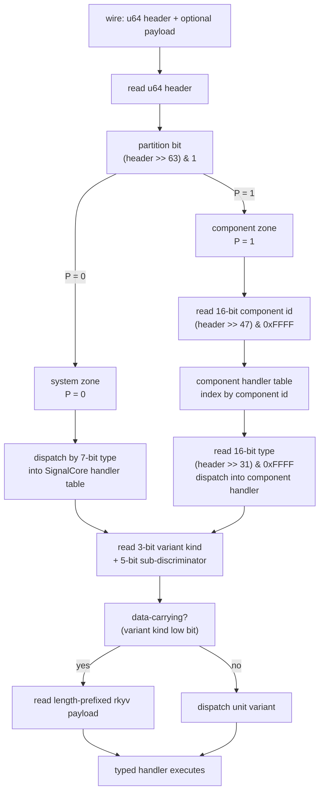
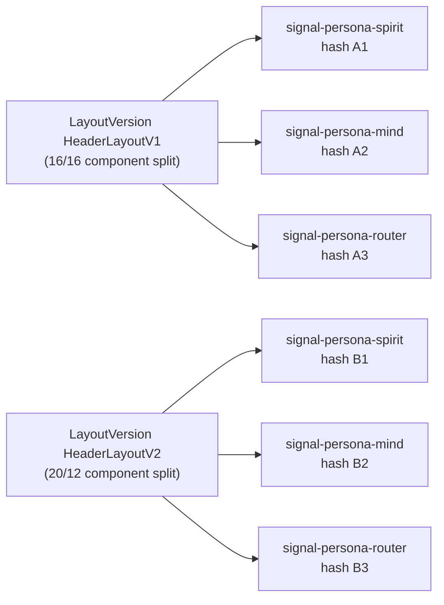

# 23/2 — Signal 64-bit message header and partitioned namespace

*Design for spirit records 314 + 315: every root-level signal message
carries a 64-bit super-tiny header that identifies its object in
constant time. The 64 bits are partitioned into a fixed-size system
zone (SignalCore types) and a fixed-size component zone (per-component
types). Repartitioning between zones is a major-version event with
backward-compatibility implications and binds through the schema-
version hash mechanism from /279.*

## 0. TL;DR

**Bit layout (one sentence):** 1-bit partition selector, then a
zone-specific layout — system zone uses 7 bits of SignalCore type +
3-bit variant kind + 5-bit sub-discriminator + 48 reserved bits;
component zone uses 16-bit component identifier + 16-bit type
discriminator + 3-bit variant kind + 5-bit sub-discriminator +
23 reserved bits. Header is `u64`, little-endian on disk, with the
partition selector as the high bit so it can be tested with one
shift.

**Provisional partition sizes:** system zone reserves 16 bits of
namespace (7-bit type + 3-bit variant kind + 5-bit sub + the 1-bit
selector implied as "system"); component zone reserves 47 bits of
namespace (16-bit component identifier + 16-bit type + 3-bit variant
kind + 5-bit sub + the 1-bit selector). Component identifier 16 bits
= 65,536 components, ~1300x today's count; type-per-component
16 bits = 65,536 types, well past any plausible signal contract;
3-bit variant kind = 8 variant classes (record-data /
record-unit / enum-variant-data / enum-variant-unit / reply-data /
reply-unit / event-data / event-unit); 5-bit sub = 32 sub-
discriminators per variant kind (the per-variant ordinal within an
enum, for example).

**Repartitioning is a major-version event:** the schema-version
hash (/279) binds the partition shape; changing it produces a new
hash; sema-upgrade detects the mismatch through the inspect-socket
path and refuses to proceed without migration — exactly the
existing per-component upgrade gate, now with the partition shape
as part of the layout schema.

## 1. Bit layout proposal

### 1.1 The 64-bit header as a typed record

```nota
(SignalMessageHeader
    (partition Partition)
    (typeInfo TypeInfo)
    (variantKind VariantKind)
    (subDiscriminator SubDiscriminator)
    (reserved Reserved))

(Leaf Partition [System Component] [(discriminantWidth 1)])
(Leaf VariantKind
    [RecordData RecordUnit
     EnumVariantData EnumVariantUnit
     ReplyData ReplyUnit
     EventData EventUnit]
    [(discriminantWidth 1)])
```

The header is a `u64`. NOTA expresses the logical record shape; the
wire form is the packed bit layout below.

### 1.2 Bit allocation table

```
bit 63                                                              bit 0
+-+--------------------------------------------------------------+
|P| ZONE PAYLOAD (63 bits — layout depends on P)                 |
+-+--------------------------------------------------------------+

P = 0 → system zone
P = 1 → component zone
```

System zone layout (`P = 0`):

```
bit 63              bit 56 bit 53 bit 48                   bit 0
+-+---------+-------+-------+-----+-----------------------+
|0| 7-bit   | 3-bit | 5-bit |     48 reserved bits         |
| | type    | var   | sub   |                              |
| | (Core)  | kind  | disc  |                              |
+-+---------+-------+-------+------------------------------+
```

Component zone layout (`P = 1`):

```
bit 63          bit 47          bit 31  bit 28 bit 23           bit 0
+-+-----------+-----------+-----+------+-----+-----------------+
|1| 16-bit    | 16-bit    | 3-b | 5-b  | 23 reserved bits      |
| | component | type      | var | sub  |                       |
| | id        | (in comp) | kind| disc |                       |
+-+-----------+-----------+-----+------+-----------------------+
```

### 1.3 Justification by field

**1-bit partition selector.** One bit is enough; the partition is
binary by design (system vs component). The selector goes in the
high bit because (a) reading it costs one shift right by 63 and (b)
the two zones never share a numeric value at that bit, eliminating
any collision risk.

**System zone 7-bit type discriminator.** 128 system types in
SignalCore. Today the system needs perhaps a dozen (HandshakeRequest,
HandshakeReply, ProtocolVersion, FrameError, RequestRejection,
AcceptedOutcome, SubscriptionToken, StreamEvent, schema-related types,
version-projection types). 128 is ~10x today's count and the right
size for a workspace-universal vocabulary that wants to stay small.
Larger would invite component-specific types to leak into the system
zone; smaller would constrain growth.

**Component zone 16-bit component identifier.** 65,536 component IDs.
The workspace has ~15 components today (per
`protocols/active-repositories.md`); a long-term projection is 30–50
shipping components plus historical-frozen-version crates per /285
(call it ~200 total). 16 bits is comfortable headroom without being
absurd. 8 bits (256) is too tight once historical frozen crates count
against the namespace; 12 bits (4096) is plausibly enough but adds
encoding awkwardness (12 is not byte-aligned). 16 is byte-aligned and
gives ~300x today's count.

**Component zone 16-bit type discriminator.** 65,536 types per
component. signal-persona-spirit has roughly 30 types today (Entry,
Statement, Observation, RecordAccepted, etc., plus all the newtypes
and reply types per the worked example below). 65,536 is wildly past
any plausible signal contract; the cost is one byte vs four, and
byte-alignment makes the dispatch table indexing trivially fast.
8-bit would constrain large contracts; 12-bit is awkward; 16-bit is
right.

**3-bit variant kind.** 8 variant classes. The psyche referenced
"seven of them potentially"; the eight (record-data, record-unit,
enum-variant-data, enum-variant-unit, reply-data, reply-unit, event-
data, event-unit) cover every position a typed object occupies in a
contract:

```
| Kind             | Carries payload? | Position in contract |
|---|---|---|
| RecordData       | yes              | top-level data-carrying record |
| RecordUnit       | no               | top-level unit marker |
| EnumVariantData  | yes              | data-carrying enum variant |
| EnumVariantUnit  | no               | unit enum variant |
| ReplyData        | yes              | data-carrying reply |
| ReplyUnit        | no               | unit reply |
| EventData        | yes              | data-carrying event |
| EventUnit        | no               | unit event |
```

The data-carrying vs unit split is what lets the daemon decide
whether to read a payload off the wire after the header — a 1-bit
test inside the variant kind (low bit = 1 → data-carrying, 0 → unit).
The four position classes (record / enum-variant / reply / event)
let the daemon route into the right handler family without re-
parsing the type discriminator. 7 variants (the psyche's "seven of
them") fit comfortably in 3 bits with one slack value reserved for
future use (e.g. handshake / control variants outside the four
position classes).

**5-bit sub-discriminator.** 32 sub-values per variant kind. The
sub-discriminator covers the per-variant ordinal inside an enum.
Example: `Observation` has 5 variants (State, Records, RecordProvenances,
Topics, Questions). The type discriminator names `Observation`; the
sub-discriminator names which variant (0..4). 32 variant-ordinals
covers every enum in the workspace today (the largest is the variants
of `Reply` in spirit, with 9 variants); larger enums (rare) get
flagged at macro time. Sub-discriminator zero is the "no sub-
discrimination needed" value for struct-shaped records.

**Reserved bits.** System zone has 48 reserved bits; component zone
has 23 reserved bits. These are for forward-compatibility growth:
extending the variant-kind tag from 3 to 4 bits, lifting the type
discriminator from 16 to 18 bits, or adding a per-message control
flag (e.g. trace-this-message, owner-vs-ordinary marker in-header).
Reserved bits MUST be zero on the wire today; the daemon rejects
messages with non-zero reserved bits to keep the namespace clean for
future growth.

### 1.4 Why not flat 32-bit + payload-version stamp

The alternative is a flat 32-bit type code plus a separate
schema-version stamp. Rejected because:

- The 64-bit single-word fits naturally in one register read; a flat
  32-bit type code would need a second word for version, doubling
  the constant-time decode work.
- The partition selector at the high bit makes "is this a system
  message?" a one-instruction test.
- Reserved bits inside the header are free; reserved bits outside
  the header are a separate wire-format negotiation.

### 1.5 The header is per-message, not per-frame

One signal frame carries one or more contract payloads (per
`/git/github.com/LiGoldragon/signal-frame/src/request.rs`'s
`Request<Payload>` shape). Each payload carries its own header.
The frame's `ExchangeFrameBody` envelope (handshake / request /
reply / event) is separate from the per-message header; the
envelope shape is fixed by signal-frame's universal kernel and
doesn't share the 64-bit namespace.

## 2. Constant-time object recognition dispatch

### 2.1 Decode path



Every decision is a bitfield extract or an array index. No string
matching, no scanning, no allocation. The handler tables are static
arrays of function pointers (per the compile-time module index
pattern in `skills/component-triad.md`).

### 2.2 Bitfield accessors

```rust
// signal-frame/src/header.rs (new file)

#[derive(Archive, RkyvSerialize, RkyvDeserialize,
         Debug, Clone, Copy, PartialEq, Eq, Hash)]
#[repr(transparent)]
pub struct SignalMessageHeader(u64);

impl SignalMessageHeader {
    /// Partition selector — system vs component zone.
    pub const fn partition(self) -> Partition {
        if self.0 >> 63 == 0 { Partition::System }
        else { Partition::Component }
    }

    /// System-zone type code (7 bits, valid only when partition is
    /// System).
    pub const fn system_type(self) -> u8 {
        ((self.0 >> 56) & 0x7F) as u8
    }

    /// Component identifier (16 bits, valid only when partition is
    /// Component).
    pub const fn component_identifier(self) -> u16 {
        ((self.0 >> 47) & 0xFFFF) as u16
    }

    /// Per-component type discriminator (16 bits, valid only when
    /// partition is Component).
    pub const fn component_type(self) -> u16 {
        ((self.0 >> 31) & 0xFFFF) as u16
    }

    /// Variant kind (3 bits). Lives at the same offset in both zones.
    pub const fn variant_kind(self) -> VariantKind {
        // System zone: bits 53..56; component zone: bits 28..31.
        // Compute the offset from the partition.
        let offset = if self.0 >> 63 == 0 { 53 } else { 28 };
        VariantKind::from_bits(((self.0 >> offset) & 0x7) as u8)
    }

    /// True when the variant carries a rkyv payload after the header.
    pub const fn is_data_carrying(self) -> bool {
        self.variant_kind().is_data_carrying()
    }

    /// Sub-discriminator (5 bits). The per-variant ordinal inside an
    /// enum, or 0 for struct-shaped records.
    pub const fn sub_discriminator(self) -> u8 {
        let offset = if self.0 >> 63 == 0 { 48 } else { 23 };
        ((self.0 >> offset) & 0x1F) as u8
    }

    /// Reserved bits — MUST be zero on a valid wire-format header.
    pub const fn reserved(self) -> u64 {
        if self.0 >> 63 == 0 {
            self.0 & 0xFFFF_FFFF_FFFF  // low 48 bits
        } else {
            self.0 & 0x7F_FFFF  // low 23 bits
        }
    }
}
```

### 2.3 Per-component dispatch table

```rust
// per-component runtime (generated by signal_channel!)
pub static SPIRIT_DISPATCH: ComponentDispatchTable = ComponentDispatchTable {
    component_identifier: 0x0042,  // assigned at macro-emit time
    types: &[
        // index = u16 type discriminator
        TypeDispatch { decode: decode_statement, name: "Statement" },
        TypeDispatch { decode: decode_entry, name: "Entry" },
        TypeDispatch { decode: decode_observation, name: "Observation" },
        // ...
    ],
};

pub static COMPONENT_TABLE: &[&ComponentDispatchTable] = &[
    &SPIRIT_DISPATCH,
    &MIND_DISPATCH,
    // ...
];
```

The daemon's dispatch loop reads the partition bit, indexes
`COMPONENT_TABLE` by the 16-bit component identifier (or falls
through to the system-table if partition is System), then indexes
the per-component `types` array by the 16-bit type discriminator —
two array reads, both O(1).

## 3. Macro composition shape

### 3.1 The macro's new inputs

```rust
signal_channel! {
    channel Spirit {
        // Macro-level identity — binds this channel into the
        // component zone of the namespace.
        component_identifier 0x0042;

        operation State(Statement),
        operation Record(Entry),
        operation Observe(Observation),
        operation Watch(Subscription) opens DomainStream,
        operation Unwatch(SubscriptionToken),
    }
    reply Reply { ... }
    event Event { ... }
    observable { ... }
}
```

`component_identifier` is a u16 literal. Two options for who picks it:

(a) **Workspace-allocated registry** — the workspace owns a central
table mapping component-name → identifier; the macro panics if the
literal doesn't match the registry. Pro: cross-workspace identifiers
collision-free. Con: registry coordination.

(b) **Hash-derived** — the identifier is derived from the schema
hash modulo 65536 (or the first 16 bits of the schema hash). Pro: no
registry. Con: birthday collisions at the namespace boundary.

**Designer lean: (a)** for shipped components, (b) as a fallback for
prototype components. The registry is a NOTA file in `signal-frame/`
or `signal-sema/`:

```nota
(ComponentRegistry
    [(ComponentEntry signal-persona-spirit 0x0042)
     (ComponentEntry signal-persona-mind 0x0043)
     (ComponentEntry signal-persona-router 0x0044)
     ...])
```

The macro reads this registry at compile time via `include_str!` and
verifies the literal matches.

### 3.2 Macro-generated artefacts

For each operation / reply / event variant, the macro generates:

```rust
// const HEADER bits, computed at macro emit time
pub const HEADER_RECORD_ENTRY: SignalMessageHeader =
    SignalMessageHeader::compose_component(
        component_identifier: 0x0042,
        component_type: 0x0001,  // Entry's type code in this channel
        variant_kind: VariantKind::RecordData,
        sub_discriminator: 0,
    );

// trait impl binding the type to its header
impl HasSignalHeader for Entry {
    const HEADER: SignalMessageHeader = HEADER_RECORD_ENTRY;
}
```

And a per-channel const-table:

```rust
pub static SPIRIT_HEADER_TABLE: &[(SignalMessageHeader, &str)] = &[
    (HEADER_OPERATION_STATE, "State"),
    (HEADER_OPERATION_RECORD, "Record"),
    (HEADER_OPERATION_OBSERVE, "Observe"),
    // ...
];
```

### 3.3 Type-code allocation within a channel

The macro assigns 16-bit type codes in declaration order, starting
at 0. The schema-version hash (per /279 §3c) hashes the declaration
order; reordering produces a different hash; the type codes are
stable within one schema version.

```
declaration order   →   type code
Statement              0x0001
Entry                  0x0002
Observation            0x0003
RecordQuery            0x0004
RecordAccepted         0x0005
...
```

For enum variants, the variant's sub-discriminator is its declaration
position inside the enum. The type discriminator names the enum;
the sub-discriminator names the variant. Example: `Observation::Records`
gets `component_type = 0x0003` (Observation) and `sub_discriminator = 1`
(the second variant).

### 3.4 Schema-version-hash binding

Per /279 §3, the schema-version hash hashes the canonical encoding
of the channel declaration. The 64-bit header layout is **part of
the layout schema**: changing the partition sizes, the variant-kind
encoding, or the component-identifier width produces a different
canonical encoding, hence a different hash. Sema-upgrade (per
/279 §6) compares stored hash to declared hash at boot; a partition
repartitioning is structurally indistinguishable from any other
schema change — the existing migration path covers it.

The schema declaration carries an explicit layout annotation
naming the partition scheme:

```nota
(Schema signal-persona-spirit
    [(LayoutVersion HeaderLayoutV1)  ;; bit layout in §1.2
     (ComponentIdentifier 0x0042)
     ...])
```

`HeaderLayoutV1` names a specific bit layout (the one in §1.2);
when the partition is repartitioned, the new declaration names
`HeaderLayoutV2`, and every dependent component's schema hash
changes.

### 3.5 Worked example — signal-persona-spirit `Record(Entry)`

Given the spirit channel in
`/git/github.com/LiGoldragon/signal-persona-spirit/src/lib.rs` line 433:

```rust
operation Record(Entry),
```

The macro emits:

```rust
// component identifier (from registry): 0x0042
// Record's type discriminator in declaration order: 0x0002
//   (Statement=0x0001, Entry=0x0002, ...)
// Record is a top-level operation with one data-carrying payload:
//   variant_kind = RecordData (binary 001)
// Sub-discriminator: 0 (struct-shaped, no enum variants)

pub const HEADER_OPERATION_RECORD: SignalMessageHeader =
    SignalMessageHeader::from_u64(
        // partition selector = 1 (component zone)
        (1u64 << 63) |
        // component identifier = 0x0042 at bits 47..63
        ((0x0042u64) << 47) |
        // component type = 0x0002 at bits 31..47
        ((0x0002u64) << 31) |
        // variant kind = 1 (RecordData) at bits 28..31
        ((0b001u64) << 28) |
        // sub-discriminator = 0 at bits 23..28
        (0u64 << 23)
        // reserved bits 0..23 all zero
    );
// 0x8021_0001_0800_0000 in hex
```

When a caller sends `(Record (Entry topic kind summary context certainty quote))`
to the spirit daemon, the wire bytes are:

```
[ header: 8 bytes (u64) ]  [ length-prefixed rkyv payload: variable ]
0x8021_0001_0800_0000      [ Entry's rkyv encoding ]
```

The spirit daemon reads the 8-byte header, tests the partition bit
(`= 1`, component zone), indexes the component table by `0x0042`
(self), indexes the type table by `0x0002` (Entry), tests the variant
kind (`RecordData`, data-carrying), reads the length-prefixed rkyv
payload, and dispatches into the Entry record handler.

## 4. Partition repartitioning as major version event

### 4.1 What "major version" means concretely

A major version event in this design is **a schema-version hash
change that touches the layout-version annotation** (per /279 §2
extension). The schema-version hash already changes on any schema
edit (adding a variant, widening an enum, renaming a field); a major
version repartition is a specific *kind* of hash change — one where
the layout-version annotation in the schema rolls forward (V1 → V2).

The mechanism is the same as every other schema change; what makes
it "major" is the cascade: a layout-version bump propagates to every
component, because the partition shape is workspace-universal. A
field-add inside one channel changes one component's hash; a
partition repartition changes every component's hash.

### 4.2 Cascade through schema-version hashes



Every component repository's schema declaration depends transitively
on the layout-version annotation (which lives in `signal-frame`'s
schema or a workspace-universal schema file). When `HeaderLayoutV2`
ships, every dependent schema's hash changes per /279 §3d's hash-
by-value rule. Sema-upgrade detects each component's stored-hash vs
declared-hash mismatch at boot per /279 §6, and refuses to proceed
without a registered migration.

### 4.3 Backward compatibility — old binaries reading new messages

An old binary expects `HeaderLayoutV1` (16-bit component, 16-bit
type). A new binary encodes under `HeaderLayoutV2` (say, 20-bit
component, 12-bit type — for a hypothetical future expansion). The
bit layouts are incompatible: the same 64 bits decode to different
type codes under the two layouts.

The version-projection path (per /285) handles this through the
handover protocol: old binary (main) and new binary (next) bind
versioned sockets; messages on `vN/spirit.sock` use `HeaderLayoutVN`;
messages on `vM/spirit.sock` use `HeaderLayoutVM`; the version-
handover socket bridges them by projecting through the layout
mapping. Either old reads old, new reads new, and the version
handover socket carries the cross-version traffic.

**Cross-version recovery** (per /285 §6) carries the original message
bytes plus the producing-version layout tag; persona-introspect's
MigrationIndex looks up the matching historical signal-X crate and
decodes the bytes under the matching layout. Old layouts never go
away; they live in the frozen historical signal-X crates.

### 4.4 Backward compatibility — new binaries reading old messages

When a new binary receives a message under an old layout (e.g.
through a slow client that hasn't upgraded), the new binary's
listener actor reads the partition bit and detects the layout
version by checking which of `HeaderLayoutV1` / `HeaderLayoutV2`
the message fits. Two implementation options:

(a) **Per-version socket** (recommended). The version-handover
socket layout per /285 §3.2 already uses per-version socket
paths (`v0.1.0/spirit.sock` vs `v0.1.1/spirit.sock`). Each socket
serves exactly one layout version; cross-version requests go
through the upgrade socket. This makes layout dispatch a socket-
binding decision, not a per-message branch.

(b) **In-header layout-version flag**. Reserve one of the
reserved bits as a layout-version tag. Pro: one socket serves
multiple layouts. Con: every message pays the layout-version
decode cost; the reserved bits get consumed quickly. Designer
lean: **(a)**, because the per-version socket path is already
shipping per /285.

### 4.5 Migration path through sema-upgrade

The /285 migration protocol applies directly. Partition repartitioning
is a registered migration in `sema-upgrade`'s catalogue; the migration
transforms each component's stored records from `HeaderLayoutV1`-
shaped to `HeaderLayoutV2`-shaped. The migration is a bulk schema
transform (per /270's bulk plan) — every record in the database
gets re-encoded under the new layout. The per-type
`VersionProjection` impls per /285 §1.2 carry the per-record
transform; the layout-version bump is the channel-level wrapper.

The version-projection trait stays unchanged; the layout-version is
encoded in the channel's schema-version hash, and the projection
crosses two version hashes (just like any other schema migration).

## 5. Provisional partition sizes

### 5.1 Today vs long-term

Workspace inventory (from `protocols/active-repositories.md` and the
triad table in `skills/component-triad.md`):

| Class | Today | Long-term projection |
|---|---|---|
| Working signal contracts | ~15 | ~50 |
| Owner signal contracts | ~15 | ~50 |
| Frozen historical version crates | ~3 | ~200 (per /285's per-version sibling repos) |
| Special-purpose contracts (signal-version-handover, signal-version-projection helpers) | ~3 | ~10 |
| **Total component identifiers** | **~36** | **~310** |

300 component identifiers fit comfortably in 9 bits (512); 16 bits
(65,536) is wildly overprovisioned. **Designer lean: 16 bits for
provisional shipping**, with the explicit understanding that a
future repartition could shrink the component-identifier zone to
10 or 12 bits and lift the type-discriminator zone or add a
generation tag. 16 bits is the safe initial choice because:

- Byte-aligned encoding is faster and easier to reason about.
- The "wildly overprovisioned" feeling is exactly what the major-
  version repartition mechanism is for: shrink it when there's an
  actual reason.
- Reserved bits (23 in the component zone) give plenty of slack
  for orthogonal extensions before the partition itself needs to
  change.

### 5.2 System zone sizing

System zone (`P = 0`) holds SignalCore types: handshake frames,
protocol-version records, generic rejection reasons, frame envelopes,
subscription-lifecycle markers, version-handover wire shapes (per
/285), and migration-coordination types (per /279, /284, /285).

| Category | Today | Long-term |
|---|---|---|
| Handshake / version negotiation | 4 | 8 |
| Frame envelope types | 5 | 10 |
| Subscription lifecycle | 3 | 6 |
| Version-handover wire shapes | 7 | 15 |
| Migration coordination | 4 | 10 |
| Owner-policy universals | 2 | 8 |
| Reserved for system growth | n/a | 70 |
| **Total** | **~25** | **~127** |

7 bits (128) is exactly the right size: today's count is ~25, the
long-term projection is ~127, and the partition bit lives outside
the type code. Tighter (6 bits = 64) is too constrained; looser
(8 bits = 256) wastes bits that the component zone could use.

### 5.3 Variant-kind sizing

3 bits = 8 variant classes. Today's needs:

```
| Class            | What it labels                          |
|---|---|
| RecordData       | data-carrying top-level record          |
| RecordUnit       | unit top-level marker (rare today)      |
| EnumVariantData  | data-carrying enum variant              |
| EnumVariantUnit  | unit enum variant                       |
| ReplyData        | data-carrying reply variant             |
| ReplyUnit        | unit reply variant                      |
| EventData        | data-carrying event                     |
| EventUnit        | unit event                              |
```

This is the psyche's "seven of them potentially" framing made
concrete: seven workspace-meaningful variant classes today plus
one slack value (slot 8) reserved for future use (e.g. handshake-
specific markers, control-channel variants, owner-vs-ordinary
markers). 3 bits is right; 4 bits would leave 8 slots unused; 2
bits would constrain.

### 5.4 Sub-discriminator sizing

5 bits = 32 sub-discriminators per variant kind. Today's largest
enum is `Reply` in spirit (9 variants); 32 is ~3.5x today's
maximum and leaves room for enum growth. Larger enums (rare) are
flagged at macro-emit time as a compile-time error; the contract
author splits the enum into nested sums per the lifting rule in
`reports/operator/150` §3.

### 5.5 Reserved bits

| Zone | Reserved | What they enable |
|---|---|---|
| System zone | 48 bits | layout-version tag, trace flags, message-priority class, future system types |
| Component zone | 23 bits | layout-version tag, per-message control flags, partial-message markers |

48 reserved bits in the system zone is generous — the system zone
is the small fixed-size part of the namespace; growing it is exactly
what a major-version repartition is for. 23 reserved bits in the
component zone leaves room for:

- A 4-bit layout-version tag (16 layouts) for in-header version
  discrimination if option (b) in §4.4 is ever needed.
- A trace flag, a priority class, a partial-message marker.

Reserved bits MUST be zero on the wire until a documented
specification version uses them; the daemon rejects messages with
non-zero reserved bits.

## 6. Relationship to rkyv / NOTA encoding

### 6.1 Wire layout — header + payload

```
+----------------+------------------------------+
| u64 header     | length-prefixed rkyv payload |
| (8 bytes)      | (variable, omitted if unit)  |
+----------------+------------------------------+
```

The header is `[u8; 8]` in little-endian (rkyv's default for `u64`).
The payload is the existing length-prefixed rkyv encoding per
`signal-frame/src/frame.rs` lines 107–116. The frame envelope
(handshake / request / reply / event per `ExchangeFrameBody`) stays
unchanged; the header decorates each per-message payload inside the
envelope.

When the variant kind is `*Unit`, the payload is omitted entirely —
the header alone identifies the message and the unit variant carries
no data. This is the size optimisation the psyche named ("super
tiny messages"): a unit message is exactly 8 bytes on the wire.

### 6.2 Handing off to rkyv

The dispatch path (§2.1) ends with "read length-prefixed rkyv
payload" for data-carrying variants. The handler function the
dispatch table indexes to has the signature:

```rust
fn decode_payload(bytes: &[u8])
    -> Result<TypedPayload, FrameError>;
```

The handler reads the length prefix, validates it, and calls
`rkyv::from_bytes::<TypedPayload, _>(bytes)` exactly like today's
`ExchangeFrame::decode` path. The header is a routing layer above
rkyv; rkyv handles the typed payload exactly as it does today.

### 6.3 NOTA — text projection is header-aware but doesn't carry it

NOTA is the text projection of the typed record. The NOTA form of
`(Record (Entry ...))` does NOT explicitly carry the header — the
header is implied by the record head (`Record`, `Entry`) and the
schema in scope. When NOTA decodes:

- Text decoder reads `(Record (Entry ...))`.
- Decoder looks up `Record` in the current channel's NOTA registry.
- Decoder finds the matching `SignalMessageHeader` constant
  (`HEADER_OPERATION_RECORD` from §3.5).
- Decoder emits the typed record `Record(Entry { ... })`.
- Encoder reverse: typed record → header (from `HasSignalHeader`
  impl) + rkyv-encoded payload → wire frame.

The header is wire-only; NOTA stays at the record-name level. This
matches `skills/component-triad.md`'s "NOTA exists at three named
projection edges" — the wire is not one of those edges.

### 6.4 Why header on the wire even though NOTA implies it

Three reasons the header is on the wire even though NOTA could
derive it:

(a) **Wire dispatch is the hot path** — every incoming message on
every daemon socket gets a header decode; doing a NOTA name lookup
in the hot path is slow.

(b) **rkyv-encoded files** — the single-argument rule
(`skills/component-triad.md`) allows passing rkyv-encoded files as
binary input. These files carry the header explicitly so the
daemon can dispatch without parsing the type out of the bytes.

(c) **Cross-version messages** — the version-handover socket per
/285 carries messages whose schema version may not match the
receiving daemon's. The header's component identifier + layout-
version flag (when allocated from reserved bits) lets the receiver
route the bytes through the correct decoder without trying NOTA-
based identification first.

### 6.5 NOTA round-trip is unchanged

The signal-frame `tests/round_trip.rs` discipline (per
`skills/component-triad.md`) tests both rkyv and NOTA round-trips.
With the header, the rkyv round-trip is `bytes → typed → bytes` and
must produce identical bytes; the NOTA round-trip is `text → typed
→ text` and must produce equivalent text. The header is part of the
rkyv encoding; NOTA encoding doesn't carry it. Both round-trips
work as today, plus a new compile-witness test that the
macro-emitted `HEADER_*` constants are correct (e.g.
`HEADER_OPERATION_RECORD.component_type() == 0x0002`).

## 7. Open design questions

*Under consideration; not committed.*

- **Component-identifier registry location.** §3.1 (a) puts the
  registry in `signal-frame/` or `signal-sema/`. Designer lean:
  `signal-frame/component-registry.nota` because signal-frame is
  the wire kernel and the registry is wire-shape data. Alternative:
  a new `signal-namespace/` crate sibling to signal-frame and
  signal-sema. Confirm with psyche.

- **System-zone vs component-zone variant-kind sharing.**
  §1.2 puts variant kind at different bit offsets in the two zones
  (bits 53..56 system, bits 28..31 component). Alternative: put
  variant kind at the same fixed offset (e.g. bits 28..31) in both
  zones, sacrificing the 5-bit sub-discriminator in the system
  zone. Designer lean: keep them at different offsets — the system
  zone is small enough that wasting 3 bits inside a 7-bit type
  code by alignment is not worth the field-extraction asymmetry.
  Confirm.

- **Hash-derived component identifier as a fallback.** §3.1 (b)
  named hash-derived identifiers as a fallback for prototype
  components. Lean: skip; the registry is the canonical path, and
  prototypes can use a reserved-prototype range (e.g. 0xF000–
  0xFFFF) until they enter the registry. Confirm.

- **Reserved bits — when does a bit get allocated?** §5.5 names
  the bits as "MUST be zero." First allocation will likely be a
  4-bit layout-version tag (per §4.4 option b) when the second
  layout ships. Lean: define the layout-version-tag bits now as
  "reserved for layout-version flagging" so future schema changes
  don't accidentally allocate them for something else. Confirm.

- **Sub-discriminator semantics for non-enum types.** §1.3 says
  zero for struct-shaped records. Alternative: use the sub-
  discriminator as a record-field-count check (helpful for early
  rejection of malformed payloads). Lean: zero — the rkyv decode
  catches malformed payloads quickly enough, and an extra
  semantics layer is hard to reason about.

- **Per-version socket vs in-header version flag.** §4.4 picks
  per-version socket (option a). The in-header flag (option b)
  becomes attractive if multi-version routing through one socket
  is ever needed; today the per-version socket path per /285
  suffices. Lean: per-version socket. Re-evaluate when a load-
  bearing reason for option (b) appears.

- **What goes in the system zone vs the component zone.**
  §5.2 named the categories. Edge cases: where does
  `signal-version-handover` (per /285) live? It is a sibling
  triad-shape contract but its types feel system-universal. Lean:
  component zone (it has its own component identifier and
  per-component types); the system zone is reserved for types
  defined directly in `signal-frame` or `signal-sema`. Confirm.

- **Compatibility with the schema-version-hash inspect socket
  protocol.** Per /279 §6, the inspect socket carries
  `(StoredSchemaHashReported ...)`. The inspect socket itself
  speaks the signal-frame wire format, so its messages carry
  headers too. Bootstrap question: how does the inspect-socket
  message decode before the daemon knows its own schema version?
  Lean: inspect-socket types live in the system zone with
  type codes stable across all schema versions, so the inspect
  exchange can decode without channel-specific context. Confirm.

- **Header byte order on the wire.** §6.1 picks little-endian
  per rkyv default. Alternative: big-endian (network byte order).
  Lean: little-endian — matches rkyv, matches the host on the
  workspace's target platforms (x86_64, aarch64), and the partition
  bit is the high bit of the byte that gets read first in either
  order. Confirm.

## 8. References

**Spirit records.** 314 (root-level macro composition emits 64-bit
super-tiny message headers — this report's core); 315 (the namespace
is partitioned into system + component zones with pre-allocated sizes,
repartitioning is a major-version event); 107 (schema-version hash
as canonical identity per /279 — this report's binding mechanism);
164 + 191 (version-projection — interaction with cross-version
messages per /285).

**Designer reports.** /279 (NOTA schema language and content-
addressable version hash — the binding mechanism for layout-version
changes); /285 (VersionProjection trait and handover protocol — the
per-version socket layout that §4.4 reuses for layout repartitioning);
/273 (schema-migration synthesis — the type-family split that the
partition mirrors at the wire layer).

**Operator reports.** /150 (triad signal/sema migration current
state — the current signal-frame macro shape that §3 redoes);
/158 (version-handover foundation implementation — the version-
handover wire shape, system-zone candidate types per §5.2).

**Workspace skill files.** `skills/component-triad.md` (the triad
shape, the compile-time module index pattern reused in §2.3, the
single-argument rule that §6.4 references); `skills/nota-design.md`
(NOTA grammar, the positional-records rule §3 follows); `skills/
naming.md` (full-word spelling, no ancestry prefixes — applied
throughout).

**Source repos read.**
`/git/github.com/LiGoldragon/signal-frame/src/frame.rs` (current
frame envelope shape §1.5 references);
`/git/github.com/LiGoldragon/signal-frame/src/request.rs` (current
Request<Payload> shape §1.5 references);
`/git/github.com/LiGoldragon/signal-frame/macros/src/emit.rs` +
`model.rs` (current macro emit path that §3 redoes);
`/git/github.com/LiGoldragon/signal-persona-spirit/src/lib.rs` line
433 (worked example channel declaration §3.5 uses).
