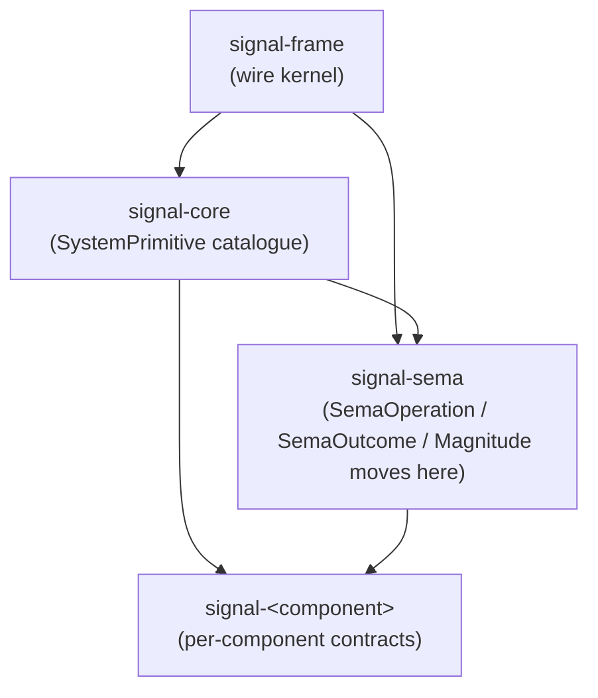
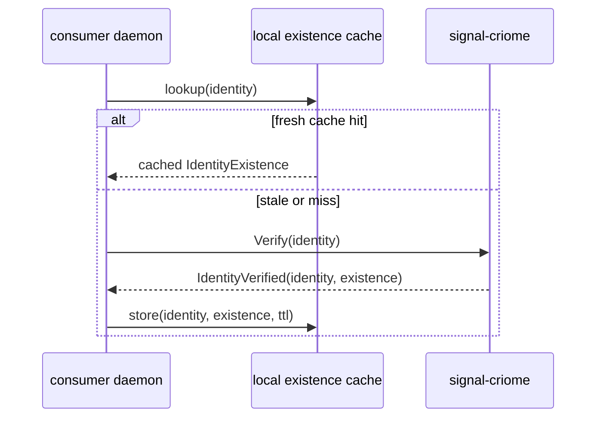
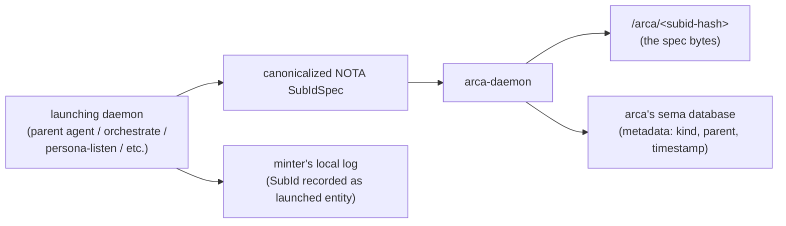
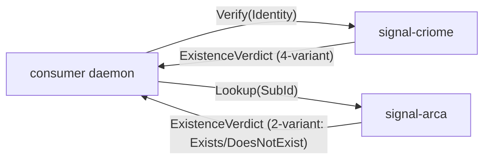
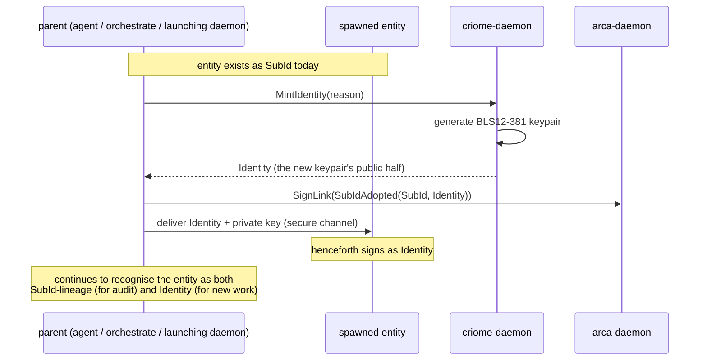
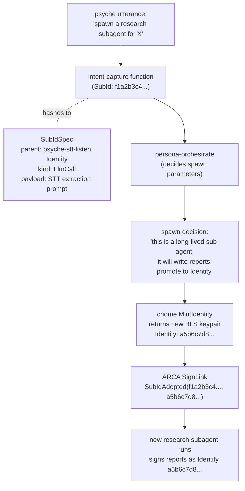

# 3 — SignalCore basic-types table

*Third-designer subagent 3, architecture-update arc 2026-05-23.*
*Sibling subagent 2 designs the 64-bit verb-namespace header and partition mechanism that this report assumes. This report defines the data table that lives in the SignalCore-owned zone of that namespace.*

Refines and concretises:

- **/161** — *"Signal Core can still exist as a concept"*, before today's content was assigned. This report fills that concept with a typed catalogue.
- **/316** — SignalCore is the workspace data table of universal basic types; the system-types part of the 64-bit namespace partition.
- **/317** — Criome identity is a SignalCore primitive type; the canonical existence-verification surface.
- **/318** — Sub-ID is a SignalCore primitive type for entities that are 'a thing' but do not have their own Criome identity; content-address fingerprint of the launching job's full spec; stored in ARCA as own type.

Reads alongside:

- `signal-sema/ARCHITECTURE.md` (current home of `Magnitude`, `Slot`, `Revision`, `PatternField`, `SemaOperation`/`SemaOutcome`).
- `signal-frame/ARCHITECTURE.md` §5 (three-tier sizing; 64-bit verb-namespace structure).
- `criome/ARCHITECTURE.md` (Criome master keypair, attestations).
- `reports/second-designer/150-design-agent-identity-and-runtime-functions.md` (BLS12-381 per-role keypair; identifier graduation).
- `reports/designer/285-versionprojection-trait-and-handover-protocol-specification.md` (ContractVersion shape).
- `intent/arca.nota` (ARCA content-addressed substrate; the natural home for Sub-ID records).

## 0 · TL;DR

SignalCore is a **named zone of the 64-bit namespace** — one of the seven sub-variant axes in the verb-namespace structure carries a `Namespace` tag, and SignalCore owns the `System` partition. Inside that zone, SignalCore is a **catalogue of workspace-universal data primitives** every signal contract and every daemon can name without re-declaring.

The catalogue is small on purpose. A type lands in SignalCore only if (a) more than one component's contract uses it, AND (b) it is a *primitive* — terminal in the data-tree sense, not a domain composite. The current catalogue:

| Primitive | What it is | Source |
|---|---|---|
| `Identity` | BLS12-381 public key (32 bytes G1-compressed) — canonical existence-verification anchor through Criome | /125, /134, /317 |
| `SubId` | Blake3 hash of a launching-job spec — entities that are 'a thing' but have no Criome identity | /318 |
| `Magnitude` | Nine-rung ordered scale plus `Unknown` — universal qualitative strength | /70, /165 |
| `Timestamp` | Whole-second `i64` UTC plus `(Timestamp, MonotonicOffset)` pair when sub-second matters | /47 |
| `ComponentName` | PascalCase token naming a workspace component; the byte-2 component tag's source | /281 (signal-persona-origin migration) |
| `ContractVersion` | Blake3 hash of a contract's schema-content (32 bytes) | /279, /263 |
| `Slot<Payload>` | Phantom-typed `u64` wire-identity record reference (already in signal-sema) | /229 |
| `Revision` | `u64` monotonic generation at a slot (already in signal-sema) | /229 |
| `Topic` | Bounded short string naming a topical area | currently spirit-internal — promotion candidate |
| `Summary` | Bounded short prose carrying one decision/principle | currently spirit-internal — promotion candidate |

Notably **not** in SignalCore: `Quote`, `Context`, `RecordIdentifier`, `Caller`, `ProcessIdentifier`, `LaneIdentifier`, `Role`, `HandoverMarker` fields, `MigrationError`. Each fails one of the two inclusion criteria — they belong to a specific component's domain (spirit, frame, orchestrate, sema-upgrade) and have a single consumer.

The data-table representation is **a NOTA registry file** (`signal-core/types.nota`) authoritative for the catalogue plus a **Rust trait + sum** (`SystemPrimitive` trait, `SystemPrimitiveKind` payloadless tag enum) that lets components reference SignalCore types without depending on each other through the catalogue.

`Identity` exposes derived-length helpers — `shortest_id()`, `short_id()`, `long_id()`, `full()` — per /125 + /150. **Existence verification** routes through a `signal-criome` `Verify(Identity)` operation returning `IdentityExistence::{Exists | DoesNotExist | Suspended | Pending}`. Local components cache the most recent reply with a short TTL.

`SubId` is content-addressed by Blake3 over the launching-job NOTA spec, mints into the daemon that launches the job (the parent agent's daemon for an LLM call; the orchestrator daemon for an agent process), and the canonical record lives in **ARCA** as a typed entry — the byte content is the job spec NOTA; the hash is the SubId. Promotion to `Identity` is **explicit**: when the launched entity needs to sign for itself, the orchestrator mints a fresh BLS keypair, signs a `SubIdAdopted(SubId, Identity)` linkage record in ARCA, and the entity henceforth carries the `Identity`.

## 1 · Basic-types catalogue + inclusion criteria

### 1.1 · Inclusion criteria

A type belongs in SignalCore when it satisfies **all** of:

- **Workspace-universal.** More than one component's contract refers to the type, or every persona component's observation surface implicitly carries it. A type used by exactly one daemon is component-specific, not workspace-universal.
- **Primitive in the data-tree sense.** A leaf in the branches/leaves vocabulary (per `intent/nota.nota` 2026-05-19) — fixed-size, terminal, no internal compositional structure that another type couldn't carry. `Magnitude` is a leaf. `Entry` (spirit's record shape) is a branch — it composes `Topic`, `Summary`, `Magnitude`, `Timestamp`, and is not primitive.
- **Stable across contract evolution.** If the type's shape changes whenever a downstream contract evolves, it's not load-bearing universal — it's just hoisted noise. The catalogue is for shapes that hold their identity for the lifetime of the workspace's wire surface.

A type **does not** belong in SignalCore when:

- Only one daemon uses it. Component-specific types stay in `signal-<component>` crates.
- It composes other SignalCore primitives without adding semantic meaning of its own. `(Identity, Timestamp)` is a record, not a primitive — its meaning is whatever the holding record names.
- It carries domain semantics. `Severity` is `Magnitude` re-named for one domain (alerting); we hold `Magnitude` once with field-name carrying the dimension (per /269 vocabulary discipline), and never mint per-domain duplicates of the leaf scale.

### 1.2 · The catalogue (committed)

**`Identity`** — A BLS12-381 G1-compressed public key (32 bytes for compressed encoding, 48 bytes uncompressed; SignalCore commits to the 32-byte compressed form as the canonical wire shape). The Criome master keypair (`/214` §3) and every long-lived agent's role keypair (`/150` §2) share the same primitive (`/134` settled BLS over Ed25519). `Identity` is the canonical existence-verification anchor for *anything in the workspace that exists as an attestable entity*: criome daemons, persona-engine agents, hosts registered in criome's identity table, the workspace owner. Per /125, derived-length identifiers (`shortest_id` ~3 chars, `short_id` ~5 chars, `long_id` ~7 chars, `full`) are methods on the type, not separate fields. Records 134, 317 lock the primitive choice; this report adds the catalogue placement and the derived-method surface.

**`SubId`** — A Blake3-256 hash (32 bytes) of the **launching-job NOTA spec**. SubId is the SignalCore primitive for entities that are 'a thing' (have process identity within the workspace) but do not warrant a Criome attestation. Per /318, the canonical use cases are agent calls (a function-shaped LLM call per /124) and short-lived processes within agents. The canonical record lives in **ARCA** as a typed entry — `SubId` is the content address into ARCA; the ARCA-stored content is the full NOTA spec the SubId was hashed from. Storing in ARCA gives SubIds the durability and audit trail of any other archived workspace artefact, while keeping them off the BLS12-381 key surface that gates real attestation power.

**`Magnitude`** — Per /70 (universal qualitative magnitude vocabulary) and /165 (add `Unknown` variant): the **nine-rung** ordered scale plus `Unknown` for indeterminate readings. The current deployed shape in `signal-sema` is seven rungs (`Minimum` through `Maximum`); /165 widens to nine (interpolating two new rungs the workspace landed on but I do not have the canonical rung-names confirmed for in this report — sibling design report 4 or the signal-sema /165 widening bead carries the rung set). `Magnitude` stays in SignalCore (formerly home in `signal-sema`; the migration when SignalCore lands is mechanical). Field name carries dimension: `(certainty: Magnitude)` in Spirit; `(priority: Magnitude)` in Mind; `(severity: Magnitude)` in any alerting context. The type carries the scale; the field carries the dimension.

**`Timestamp`** — Per /47 (the persona-spirit nanosecond-rejection correction): the workspace-universal timestamp is **whole-second UTC `i64`** as a transparent newtype. The two-field timestamp shape `(Timestamp, MonotonicOffset)` from /47 applies only when sub-second ordering matters — that's a *record* composing two SignalCore primitives, not a primitive itself. Spirit, Mind, and every persona daemon use bare `Timestamp` by default; specialised ordering needs (real-time signal /160, lojix deploy step ordering) compose the pair as a domain record.

**`ComponentName`** — A PascalCase short token naming a workspace component: `Spirit`, `Mind`, `Orchestrate`, `Criome`, `Router`, `Arca`, `Forge`, etc. Per the byte-2 component-tag slot in the verb-namespace structure (sibling subagent 2's design), `ComponentName` is the source vocabulary that fits in one byte (256-component ceiling is far beyond workspace need). `signal-persona-auth` is migrating to `signal-persona-origin` (/264); `ComponentName` moves with it from component-specific to SignalCore-universal because every observation stream tags by component.

**`ContractVersion`** — Per /279 and /263, the content-addressable hash of a contract's schema-content is the contract's identity. SignalCore owns the typed newtype `ContractVersion([u8; 32])` (Blake3-256 over the contract's canonical NOTA schema spec). Sema-upgrade /270, version-projection /285, and signal-version-handover all consume this type; the migration mechanism is universal across components, so the primitive is too.

**`Slot<Payload>`** — Phantom-typed `u64` wire-identity record reference (current `signal-sema` resident). Mutate/Retract/Match commands across every component name records by slot; the type is workspace-universal by construction. Stays in SignalCore.

**`Revision`** — `u64` monotonic generation counter at a slot (current `signal-sema` resident). Pairs with `Slot<T>` for compare-and-set semantics. Stays in SignalCore.

### 1.3 · The catalogue (promotion candidates)

**`Topic`** — Currently a spirit-internal bounded short string naming a topical area (one of `persona`, `signal`, `nota`, `component-shape`, `arca`, etc., one per `intent/<topic>.nota` file). Promotion candidates: persona-mind's research routing, persona-orchestrate's job-decomposition policy registry, persona-listen's STT-routing table all reference topic names. If two of those three end up in the design, `Topic` lands in SignalCore as a primitive (bounded by a short-string ceiling, no embedded structure). If only spirit uses it, the type stays in `signal-spirit`.

**`Summary`** — Currently a spirit-internal bounded prose carrying one decision/principle/correction summary. Similar promotion math: if persona-mind's research-result records and persona-introspect's event log narration both want a typed "one-line semantic summary" primitive, promotion makes sense. Otherwise spirit-local.

### 1.4 · The catalogue (rejected)

**`Quote`** — Spirit-internal verbatim psyche-statement carry-string. Single consumer (spirit). Stays in `signal-spirit`.

**`Context`** — Spirit-internal provenance field. Single consumer. Stays.

**`RecordIdentifier`** — Spirit-internal storage-recovery handle (per /232 §Q2). Storage-internal. Stays.

**`Caller`, `ProcessIdentifier`, `ExecutablePath`, `ProcessStartTime`** — Frame-layer advisory process-context records owned by `signal-frame` (/289 §1). Layer below SignalCore in the dependency stack; SignalCore depends on `signal-frame` for the wire kernel, not vice versa. Stays in `signal-frame`.

**`LaneIdentifier`, `Role`, `LaneRegistration`, `LaneSession`** — Persona-orchestrate-internal (/146, /147, /150). Stays.

**`MigrationError`** — Per /284, this is sema-upgrade's typed error vocabulary. Single consumer. Stays.

**HandoverMarker fields** — Per /285, version-handover-internal. Single consumer (handover protocol). Stays.

## 2 · Data-table shape (NOTA + Rust)

### 2.1 · Two surfaces

SignalCore presents two surfaces to the workspace:

- **The NOTA registry** at `signal-core/types.nota`. The authoritative catalogue, agent-readable. Read by anyone surveying "what's a workspace-universal primitive?" without opening Rust.
- **The Rust crate** `signal-core`. The compile-time-enforced type surface. Every primitive is a real Rust type with `NotaEnum` / `NotaRecord` derives + rkyv archive + tier-1 packing impl.

The two surfaces are kept consistent by a Nix architectural-truth check (per `skills/architectural-truth-tests.md`): the NOTA registry's primitive list must equal the Rust crate's exported primitive list, or the check fails.

### 2.2 · NOTA registry shape

The NOTA file is a top-level vector of records, one per primitive. Each record positions:

`(<PrimitiveKind> <name> <encoding> <byte-width> <where> <description>)`

```nota
;; signal-core/types.nota — the workspace's universal basic-types catalogue.
;; Each record is positional: (PrimitiveKind name encoding byte-width module description)
;;
;; PrimitiveKind = Identity | Reference | Scale | Time | Tag | Version
;;   Identity   — attestable existence anchors (Criome, BLS-key-bearing)
;;   Reference  — wire-identity references into typed stores
;;   Scale      — qualitative ordered vocabularies
;;   Time       — time-and-ordering primitives
;;   Tag        — short categorical labels
;;   Version    — content-addressed identity for evolving artefacts
;;
;; encoding = Bls12381G1Compressed | Blake3 | NotaEnum | NewtypeI64 | NewtypeU64 | PascalToken
;; byte-width = exact wire-size (32 for the 256-bit hashes; 8 for u64; etc.)
;; module = the Rust src/* file that owns the type
[
  (Identity   Identity        Bls12381G1Compressed 32 src/identity.rs
    "BLS12-381 G1-compressed public key — canonical existence-verification anchor through Criome.")
  (Identity   SubId           Blake3               32 src/sub_id.rs
    "Blake3-256 hash of a launching-job NOTA spec — entities that are 'a thing' but have no Criome identity.")
  (Reference  Slot            NewtypeU64           8  src/reference.rs
    "Phantom-typed u64 wire-identity record reference for typed stores.")
  (Reference  Revision        NewtypeU64           8  src/reference.rs
    "Monotonic generation counter at a Slot.")
  (Scale      Magnitude       NotaEnum             1  src/magnitude.rs
    "Nine-rung ordered qualitative scale plus Unknown — universal strength vocabulary.")
  (Time       Timestamp       NewtypeI64           8  src/time.rs
    "Whole-second UTC i64 — workspace-universal timestamp.")
  (Time       MonotonicOffset NewtypeU64           8  src/time.rs
    "Monotonic-clock offset companion to Timestamp for sub-second ordering needs.")
  (Tag        ComponentName   PascalToken          1  src/component_name.rs
    "PascalCase component name — feeds the byte-2 component tag in the verb-namespace structure.")
  (Version    ContractVersion Blake3               32 src/contract_version.rs
    "Blake3-256 over a contract's canonical NOTA schema spec — contract identity.")
]
```

Three NOTA-design choices worth flagging:

- **Categorical wrapper variant first.** `Identity`, `Reference`, `Scale`, `Time`, `Tag`, `Version` are the variant names. Per the canonical example (`skills/skills.nota`) and `skills/nota-design.md` Rule 1, the variant tag carries the category — readers grep `Identity` and find every existence-anchor primitive across the catalogue. No `(Primitive ...)` wrapper because *every* record in this file is a primitive; per Rule 1, the redundant wrapper drops.
- **Positional, no labels.** Six fields per record: kind, name, encoding, byte-width, module path, description. Position carries field identity per `skills/nota-design.md` Rule 1.
- **Description is the last field.** Longest field last per the canonical example's convention.

### 2.3 · Rust crate shape

```rust
// signal-core/src/lib.rs — module entry and re-exports

pub mod identity;
pub mod sub_id;
pub mod reference;   // Slot<T>, Revision (moved from signal-sema)
pub mod magnitude;   // Magnitude (moved from signal-sema)
pub mod time;        // Timestamp, MonotonicOffset
pub mod component_name;
pub mod contract_version;

pub use identity::Identity;
pub use sub_id::SubId;
pub use reference::{Slot, Revision};
pub use magnitude::Magnitude;
pub use time::{Timestamp, MonotonicOffset};
pub use component_name::ComponentName;
pub use contract_version::ContractVersion;

/// A type that is a SignalCore primitive. The marker carries no
/// methods of its own; it exists for the compile-time witness test
/// that the Rust crate's exported set matches the NOTA registry.
pub trait SystemPrimitive {
    /// The canonical kind classification — matches the NOTA registry's
    /// wrapping variant.
    const KIND: SystemPrimitiveKind;

    /// The exact wire byte-width of the primitive's rkyv encoding.
    const WIDTH: usize;
}

/// Payloadless classification tag for SignalCore primitives, mirroring
/// the NOTA registry's variant wrapper. Used by introspection and by
/// the architectural-truth check that pins the Rust set to the registry.
#[derive(Clone, Copy, Eq, PartialEq, Debug)]
pub enum SystemPrimitiveKind {
    Identity,
    Reference,
    Scale,
    Time,
    Tag,
    Version,
}
```

The Rust shape echoes the NOTA shape — one module per primitive, one `SystemPrimitive` impl per primitive, `SystemPrimitiveKind` as the closed payloadless tag (parallel to `SemaOperation`'s payloadless-classification pattern in `signal-sema`).

### 2.4 · Cross-workspace reference

Two reference patterns, depending on context:

- **By value** — a contract or daemon records a SignalCore primitive in its own typed records. Example: `Entry { certainty: signal_core::Magnitude, ... }`. The component crate depends on `signal-core`; the primitive's NOTA wire shape and rkyv encoding ride inline. Compile-time-typed; no namespace lookup.
- **By zone-coded reference** — when an observation stream or cross-component log carries a Tier-1 packed `u64`, the primitive identity is in the verb-namespace's byte assignments (sibling subagent 2's design). SignalCore primitives occupy designated bit positions within the byte-2-or-byte-4 slot per the namespace partition. An observer decoding a Tier-1 stream looks up the primitive by its zone code; the full primitive bytes ride in Tier-2 or Tier-3 when the observer subscribes to those tiers.

The dependency direction:



`signal-core` is **upstream of every component contract and of `signal-sema`** (because `signal-sema`'s classification surface carries `ComponentName` byte-tags and `Identity`-bearing summaries). It is **downstream of `signal-frame`** because the wire kernel is more universal than the typed-primitive surface (frames don't need a notion of identity; primitives need frames to ride on). The catalogue's design choice not to fold into `signal-sema` is intentional: Sema classification is one of several SignalCore consumers, not the catalogue's only consumer.

The `Magnitude`, `Slot`, `Revision` moves from `signal-sema` to `signal-core` are a follow-on architectural edit; the operator implementation pass that lands SignalCore performs the migration through the standard sema-upgrade flow (per /270, /285).

### 2.5 · Tier-1 / Tier-2 / Tier-3 fit

The three-tier sizing discipline (`signal-frame/ARCHITECTURE.md` §5) determines how SignalCore primitives ride in observation streams:

| Primitive | Tier-1 (8 bytes) | Tier-2 (64 bytes) | Tier-3 (full rkyv) |
|---|---|---|---|
| `Identity` (32 bytes) | not direct; via `Identity::shortest_id()` U8 or `short_id()` U16 in a sub-variant slot | full 32-byte key + 32 bytes context | identity-bearing records |
| `SubId` (32 bytes) | as `short_id()`-shaped U16 short tag | full 32-byte hash + context | full ARCA-pointing records |
| `Magnitude` (1 byte) | natural — fits a sub-variant byte | rides as one byte of a 64-byte summary | rides inline in records |
| `Timestamp` (8 bytes) | rides as the `u24` timestamp-seconds suffix in the verb-namespace structure (truncated) | full 8-byte value | full inline |
| `ComponentName` (1 byte tag) | natural — that's the byte-2 component slot | inline tag | inline tag |
| `ContractVersion` (32 bytes) | as `short_id()`-shaped U16 short tag | full hash + context | full inline |
| `Slot<T>` (8 bytes) | rides in the timestamp/sequence suffix when relevant | inline | inline |
| `Revision` (8 bytes) | rides in the timestamp/sequence suffix when relevant | inline | inline |

The pattern: short-hash primitives (`Identity`, `SubId`, `ContractVersion`) reach Tier-1 via their `shortest_id()` / `short_id()` truncations through the universal `U8`/`U16` sub-variant slots (per `signal-frame/ARCHITECTURE.md` §5.3). Magnitude and ComponentName fit Tier-1 natively. Timestamp's 64-bit form requires Tier-2 if full precision needed; the truncated `u24` seconds form rides in Tier-1's tail bytes. Slot/Revision get full fidelity at Tier-2.

## 3 · Criome identity primitive — concrete shape

### 3.1 · The type

```rust
// signal-core/src/identity.rs

use rkyv::{Archive, Deserialize, Serialize};
use blake3::Hash as Blake3Hash;

/// BLS12-381 G1-compressed public key. The workspace's canonical
/// existence-verification anchor — what makes an entity an entity.
///
/// Per intent record 134 (BLS12-381 over Ed25519); record 125
/// (derived-length identifiers as methods); record 317 (Criome
/// identity is a SignalCore primitive).
#[derive(Archive, Serialize, Deserialize, Clone, Copy, Eq, PartialEq, Hash, Debug)]
#[rkyv(check_bytes)]
pub struct Identity([u8; 32]);

impl Identity {
    /// Construct from a known-good 32-byte compressed public key.
    /// Verification that the bytes ARE a valid G1 point happens at
    /// the cryptographic layer, not here — this type is the wire
    /// shape, not the proof.
    pub const fn from_bytes(bytes: [u8; 32]) -> Self {
        Self(bytes)
    }

    /// Full 32-byte canonical wire form.
    pub const fn full(&self) -> &[u8; 32] {
        &self.0
    }

    /// ~3 character bead-style shortest identifier. Hash-and-truncate.
    /// Collision recovery widens to `short_id()`.
    pub fn shortest_id(&self) -> String { /* base32 of first ~15 bits */ }

    /// ~5 character readable handle. The default UI display form.
    pub fn short_id(&self) -> String { /* base32 of first ~25 bits */ }

    /// ~7 character disambiguator when short-id collisions surface.
    pub fn long_id(&self) -> String { /* base32 of first ~35 bits */ }

    /// 16-bit short tag for U16 sub-variant slot in the Tier-1
    /// verb-namespace structure. Per signal-frame §5.3.
    pub fn short_u16(&self) -> u16 { /* first two bytes */ }
}

impl crate::SystemPrimitive for Identity {
    const KIND: crate::SystemPrimitiveKind = crate::SystemPrimitiveKind::Identity;
    const WIDTH: usize = 32;
}
```

NOTA wire shape: a transparent newtype encoding — `Identity` records as 32 hex bytes in a `#`-prefixed byte literal per NOTA grammar:

```nota
#a1b2c3d4e5f6...  ;; 32 bytes hex
```

Per `skills/nota-design.md` §"Multi-field unnamed structs are forbidden" and §"Sigils", single-field unnamed structs (newtypes) are transparent — the inner `[u8; 32]` rides directly at the schema position. No `(Identity bytes...)` wrapper.

### 3.2 · How components use it

Three usage patterns:

**Inline in domain records.** A component composes `Identity` into its typed records:

```nota
;; signal-criome RegisterIdentity payload
(RegisterIdentity #a1b2c3d4e5f6...  Developer "Li")
```

**As an existence-verification anchor.** A component asks Criome whether an `Identity` exists. The Verify operation surface:

```nota
;; signal-criome operation
(Verify #a1b2c3d4e5f6...)

;; signal-criome reply
(IdentityVerified #a1b2c3d4e5f6... Exists)
;; or
(IdentityVerified #a1b2c3d4e5f6... DoesNotExist)
;; or
(IdentityVerified #a1b2c3d4e5f6... Suspended)
;; or
(IdentityVerified #a1b2c3d4e5f6... Pending)
```

**As a routing destination.** Persona-router's reachability query returns a list of currently-reachable agents by `Identity`; channel-grant operations carry `Identity` as the routing key.

### 3.3 · Existence-verification call sketch

The call from a consumer daemon to Criome:



The cache discipline is **short TTL with revocation-event-driven invalidation**. Criome's `signal-criome` carries a `IdentityRevoked(identity)` observable event (consumers Tap the criome observation stream); when received, consumers clear that identity's cache entry. The TTL backstop (suggested 30 seconds) catches gaps where the consumer was not subscribed to the event stream during the revocation window.

### 3.4 · The four-variant existence vocabulary

`IdentityExistence` is a SignalCore-owned enum because every Criome consumer needs it:

```rust
// signal-core/src/identity.rs

#[derive(Archive, Serialize, Deserialize, Clone, Copy, Eq, PartialEq, Debug)]
#[rkyv(check_bytes)]
pub enum IdentityExistence {
    /// The Criome master pubkey or registered identity exists and is
    /// currently authoritative. Any signing or attestation request
    /// against it should be honoured per policy.
    Exists,

    /// The identity has never been seen by criome. Reject any request
    /// referencing it.
    DoesNotExist,

    /// The identity exists but has been suspended (owner policy or
    /// detected compromise). Reject signing requests; still allow
    /// observation of historical signed artefacts.
    Suspended,

    /// The identity has been registered but quorum-attestation is
    /// not yet complete (cross-host enrollment, escalation-to-approve
    /// in flight). Treat as "in flight" — operations may queue or
    /// fail depending on policy.
    Pending,
}
```

The four-variant set deliberately distinguishes `DoesNotExist` (never seen) from `Suspended` (was real, no longer authoritative) and `Pending` (is being enrolled). Collapsing these would force consumers to dispatch on free-form reason strings; the typed vocabulary lets consumer policy branch precisely.

## 4 · Sub-ID primitive — concrete shape

### 4.1 · The type

```rust
// signal-core/src/sub_id.rs

use rkyv::{Archive, Deserialize, Serialize};
use blake3::Hasher;

/// Blake3-256 hash of a launching-job's NOTA spec. The SignalCore
/// primitive for entities that are 'a thing' (process identity within
/// the workspace) but do not warrant Criome attestation — agent calls,
/// short-lived processes within agents, daemon-internal sub-tasks.
///
/// Per intent record 318 (SubId is a SignalCore primitive); /279
/// (Blake3 is the workspace's content-address hash); /124 (function-
/// vs-agent distinction).
#[derive(Archive, Serialize, Deserialize, Clone, Copy, Eq, PartialEq, Hash, Debug)]
#[rkyv(check_bytes)]
pub struct SubId([u8; 32]);

impl SubId {
    /// Compute the SubId from a launching-job spec.
    /// The spec must be canonical NOTA bytes — the same input must
    /// produce the same hash, so the caller is responsible for using
    /// the canonical NOTA encoding (no whitespace variation, sorted
    /// map keys, etc.).
    pub fn from_spec_bytes(spec: &[u8]) -> Self {
        let mut hasher = Hasher::new();
        hasher.update(spec);
        Self(*hasher.finalize().as_bytes())
    }

    pub const fn from_bytes(bytes: [u8; 32]) -> Self {
        Self(bytes)
    }

    pub const fn full(&self) -> &[u8; 32] { &self.0 }

    /// Truncations mirror Identity's. SubIds also need short forms
    /// for log lines and routing keys.
    pub fn shortest_id(&self) -> String { /* base32 of first ~15 bits */ }
    pub fn short_id(&self) -> String    { /* base32 of first ~25 bits */ }
    pub fn long_id(&self) -> String     { /* base32 of first ~35 bits */ }
    pub fn short_u16(&self) -> u16      { /* first two bytes */ }
}

impl crate::SystemPrimitive for SubId {
    const KIND: crate::SystemPrimitiveKind = crate::SystemPrimitiveKind::Identity;
    const WIDTH: usize = 32;
}
```

### 4.2 · The spec hash content

What goes into the spec the SubId is computed from:

```nota
;; A SubIdSpec record — the canonical NOTA-encoded shape that hashes
;; into a SubId. NOT a SignalCore primitive itself; this is the spec
;; payload that launching daemons hash. The hash result is the SubId.
;;
;; (SubIdSpec parent launched_at job_kind job_payload)
;;
;; parent — the Identity of the agent or daemon launching this
;;          sub-entity. Required: a SubId without a parent identity
;;          can't be linked back into the attestation graph.
;; launched_at — Timestamp of the launch (whole-second UTC).
;; job_kind — categorical: LlmCall | DaemonSubTask | AgentProcessFork |
;;            FunctionInvocation | other workspace-defined kinds.
;; job_payload — the typed job description, payload-typed per kind.

(SubIdSpec
  #a1b2c3d4e5f6...        ;; parent Identity
  1716435000              ;; launched_at
  LlmCall                 ;; job_kind
  (LlmCallSpec
    "claude-opus-4-7"     ;; model
    "Extract intent..."   ;; prompt-template-id
    [...]))               ;; context bundle
```

Three load-bearing properties:

- **Parent identity is required.** A SubId without a parent isn't linkable. The launching agent's `Identity` is in the hash input; this means *the same job spec launched by different agents produces different SubIds*. That's the right behaviour — the SubId is the entity, and different parent agents can independently launch what looks like the same job, producing different entities.
- **Launched-at timestamp is in the hash.** This means *the same job spec launched twice by the same agent produces different SubIds*. Also the right behaviour — two LLM calls with identical prompts are two different entities; their outputs may differ; their identity must.
- **Job kind is typed.** A categorical enum names what kind of sub-entity this is. Closed enum, not an open string, so the SubId surface stays type-safe and the verb-namespace classification can carry the kind.

The hash function is **Blake3-256** per /279 (workspace's content-address hash).

### 4.3 · When SubId gets created

The mint event depends on the launching context:

| Context | Who mints the SubId | When |
|---|---|---|
| Agent issues an LLM call (function-shape per /124) | the calling agent's daemon (or the agent's process if it directly speaks NOTA) | at LLM-call dispatch time; the SubIdSpec is written before the API call goes out |
| Persona-orchestrate spawns a non-agent sub-process for an agent | the orchestrate daemon | at the spawn-decision moment, before the process fork |
| A daemon launches an internal sub-task (e.g. a sema-upgrade migration step) | the daemon itself | at the sub-task scheduling moment |
| Persona-listen captures an audio span and routes through the intent-capture function (/126) | persona-listen daemon | at the per-span capture moment (each STT-extracted span is one SubId) |

Mint discipline: **the closest daemon to the launch event mints**, because that daemon has the full spec in scope. Cross-daemon SubId minting would require shipping the spec around, which defeats the lookup-by-content-address purpose.

### 4.4 · Storage in ARCA

Per /318 (*"Stored in ARCA as own type"*), the canonical SubId record lives in ARCA:



The launching daemon serialises the SubIdSpec to canonical NOTA bytes, computes the Blake3 hash (yielding the SubId), and submits to ARCA in one Signal call. ARCA's content-addressed storage guarantee (per `intent/arca.nota` 2026-05-17T13:30Z) means the bytes are written exactly once even if the same SubId is submitted multiple times — ARCA dedupes on hash.

The ARCA sema-database entry carries the metadata fields the spec encodes (parent Identity, launched_at Timestamp, job_kind) so observers can query "all SubIds launched by Identity X" or "all LlmCall SubIds in the last hour" without re-parsing the spec content.

### 4.5 · Cache discipline

Unlike Identity, SubId's existence-verification surface is **trivially local**: SubIds either exist in ARCA (their owning bytes are stored) or they don't. The `Verify(SubId)` analog for SubIds is `Lookup(SubId)` against ARCA, returning the bytes (Tier-3) or a Tier-1 existence ack. No revocation event — SubIds are immutable once minted; they retire only through ARCA garbage collection of unreachable content.

## 5 · Existence-verification surface

### 5.1 · The unified surface

Identity and SubId share a unified existence-verification pattern:

```rust
// signal-core/src/existence.rs

/// Workspace-universal existence-verification result. The same
/// variant set covers Identity (Criome-mediated) and SubId
/// (ARCA-mediated).
#[derive(Archive, Serialize, Deserialize, Clone, Copy, Eq, PartialEq, Debug)]
#[rkyv(check_bytes)]
pub enum ExistenceVerdict {
    Exists,
    DoesNotExist,
    Suspended,    // valid for Identity; never returned for SubId
    Pending,      // valid for Identity in cross-host enrollment;
                  // never returned for SubId
}
```

The two-source pattern means the consumer asks the right daemon for the right primitive:



### 5.2 · The Criome Verify operation

Already on `signal-criome` per /214 §7 (consumer asks "is this allowed?"); the existence-verification surface composes onto it. The operation shape:

```nota
;; signal-criome — consumer-callable working surface
operation Verify(Identity)
reply IdentityVerified(Identity, ExistenceVerdict)
```

The reply carries the queried Identity back (so async callers can correlate without per-call state) plus the verdict.

### 5.3 · The ARCA Lookup operation

Already on `signal-arca` per /17 (Arca stores content by hash); the existence surface adds a typed reply variant:

```nota
;; signal-arca — consumer-callable working surface
operation Lookup(SubId)
reply SubIdLookedUp(SubId, ExistenceVerdict, Option<SubIdSpec>)
```

The optional `SubIdSpec` carries the spec bytes when the SubId exists (a one-shot lookup avoiding a second roundtrip). For Tier-1 observation traffic, the spec field is dropped — the verdict alone fits the namespace structure.

### 5.4 · Cache discipline

| Surface | TTL | Invalidation |
|---|---|---|
| Identity (Criome) | 30 seconds default | Tap `signal-criome` observation stream; on `IdentityRevoked` event, clear the affected entry |
| SubId (ARCA) | indefinite (effectively immutable) | None — SubIds are content-addressed and ARCA dedupes on hash. The "exists/does-not-exist" answer cannot flip after the first answer except through ARCA garbage collection (which retires unreachable content and is rare) |

The cache lives in the consumer daemon; SignalCore does not own a cache implementation, only the typed verdict that consumers cache.

## 6 · Sub-ID to Criome identity promotion model

### 6.1 · The boundary

A SubId-tracked entity becomes important enough for a Criome identity when **it needs to sign for itself** — produce attestable artefacts under its own name that other components verify against its own keypair, not its parent's.

Most SubId-tracked entities never reach that threshold:

- An LLM call: ephemeral, single-call, output is processed by the parent agent. Stays SubId forever.
- A function invocation per /126 (intent-capture): output is consumed by spirit / orchestrate / mind, each of which signs under its own role identity. Stays SubId forever.
- A daemon-internal sub-task: never crosses a wire boundary as a signed entity. Stays SubId forever.

Some entities cross the threshold:

- A long-running spawned sub-agent (operator's `primary-c620` work): produces signed reports, signed code commits, signed Spirit entries. Needs an Identity.
- A new persona-component being bootstrapped: ships with its own bootstrap policy, signs its own owner contract messages. Needs an Identity.
- A research agent the orchestrator spawns under a dynamic-role lane (per /137-/139): writes reports into a role-specific lane, signs them under the role identity. Needs an Identity.

### 6.2 · The promotion mechanism



The key steps:

- **Parent decides.** Promotion is a policy decision the parent makes (or escalates to its own owner). SubId-tracked entities don't unilaterally promote themselves — they have no Identity to sign the promotion request from.
- **Criome mints the keypair.** The parent asks criome's owner contract (via owner-signal-criome) to mint a new identity. Criome generates BLS keys, returns the public Identity, and securely conveys the private key to the spawned entity through a side channel the parent established (often by spawning the entity on the same host with filesystem-permission protection on a one-shot keyfile per /214 §2).
- **Lineage record in ARCA.** The promotion writes a `SubIdAdopted(SubId, Identity)` record to ARCA. This is the audit link: any later observer wanting to reconstruct "what was this Identity before it had identity" follows the link from `Identity` back to the originating `SubId`, then to the `SubIdSpec` it was hashed from.
- **Both identifiers continue to exist.** The SubId doesn't retire — it remains the lineage anchor; new work signs as Identity. Records the entity authored *before* promotion stay attributable to SubId; records *after* promotion attributable to Identity. The lineage record bridges the two domains.

### 6.3 · A concrete worked example



Note: the *intent-capture function* itself stays SubId — it's a per-call thing per /126. The thing that gets promoted is the **sub-agent the function decided to spawn**, not the function call that decided to spawn it.

### 6.4 · Demotion (the reverse direction)

There is no demotion. An Identity, once minted and adopted, persists in criome's identity table until criome's owner retires it through suspension or revocation. A retired Identity moves to `Suspended` or is fully revoked but never folds back to SubId — the lineage records are immutable.

## 7 · Open design questions

**Q1 — Magnitude rung names.** /165 widens to nine rungs; this report references nine-rung but does not enumerate the specific rung names (the deployed `signal-sema` `Magnitude` is currently seven). Resolving by the widening bead's text. The catalogue table assumes the widening lands before SignalCore commits.

**Q2 — Identity hash function for derived IDs.** `shortest_id() / short_id() / long_id()` truncate the 32-byte BLS public key. Open: do they truncate directly (first N bits of the public key bytes), or do they hash first (Blake3-then-truncate)? Direct truncation is faster and matches beads' shape; hashed truncation gives slightly better collision uniformity if the upstream key generation is biased. Designer lean: direct truncation, because BLS public keys are already cryptographically uniform on G1, and the cost of hash-first would be paid on every short-id derivation.

**Q3 — ContractVersion canonicalisation.** /279 says Blake3 over canonical NOTA schema spec. Open: who defines "canonical NOTA"? The current `nota` codec has multiple legal renderings of equivalent records (whitespace, ordering of map entries). A canonicalisation step needs to land before ContractVersion is reliable. Designer follow-up: spec the canonicalisation in `nota/README.md` or in `signal-core/src/contract_version.rs` with a witness test.

**Q4 — Topic and Summary promotion timing.** This report flags both as promotion candidates but does not commit. Trigger: when persona-mind's research-routing surface lands and either (a) uses a typed `Topic` shared with spirit, or (b) defines its own `MindTopic` that is just renamed `Topic`. Question for the prime designer.

**Q5 — SubId garbage collection visibility.** Per /318, SubIds live in ARCA. ARCA's reachability/GC discipline determines when a SubId effectively retires. Open: should SignalCore expose an `ExistenceVerdict::Retired` variant for SubIds whose ARCA content has been GC'd, distinct from `DoesNotExist` (never existed)? Designer lean: yes, the audit-lineage discipline benefits from distinguishing "this was once a thing and we GC'd its content" from "this hash was never a SubId". Adds a fifth variant to `ExistenceVerdict`.

**Q6 — Cross-host SubId surface.** /318 is silent on cross-host SubId routing. ARCA is currently per-host; SubIds in one host's ARCA aren't visible to another host's consumer without explicit routing. Designer lean: defer until cross-host criome quorum (/214 §9) lands; the same transport that ships criome identity attestations can ship SubId lookups.

**Q7 — Identity adoption record schema.** The `SubIdAdopted(SubId, Identity)` ARCA record needs canonical NOTA encoding so the lineage query is type-checked. Open: does SignalCore own this record, or does it live in criome? Designer lean: SignalCore, because both ARCA and criome consume it (and persona-introspect, when it lands, also wants to read the lineage graph). The catalogue grows by one variant when the adoption record lands.

**Q8 — Sub-ID minting in the daemon-internal case.** When a daemon mints a SubId for its own sub-task, does it submit to ARCA over the network or does it use a fast-path local ARCA call? Designer lean: same path either way (Signal frame over local socket is cheap); avoid creating a fast-path that bypasses the typed signal surface.

## 8 · References

### Intent records driving this design

- /47 (persona) — Spirit timestamp shape: whole-second precision, no nanoseconds.
- /70 (signal-sema) — Universal qualitative magnitude vocabulary.
- /124 (persona) — Function-vs-agent distinction.
- /125 (persona) — Cryptographic identity is a public key; identifiers at four lengths.
- /126 (persona) — Intent-capture as a runtime function.
- /134 (persona) — BLS12-381 over Ed25519.
- /161 (signal) — Signal Core can still exist as a concept.
- /165 (component-shape) — Add Unknown variant to Magnitude; widen to nine rungs.
- /229 (signal-sema) — Slot, Revision as wire identity records.
- /264 (persona) — signal-persona-auth migrates to signal-persona-origin.
- /269 (component-shape) — Vocabulary discipline: field-name-carries-dimension.
- /279 (component-shape) — Blake3 is the workspace content-address hash; ContractVersion shape.
- /284 (component-shape) — Per-type Migration trait.
- /316 (workspace) — SignalCore is the workspace data table of universal basic types.
- /317 (persona) — Criome identity is a SignalCore primitive.
- /318 (persona) — Sub-ID is a SignalCore primitive; stored in ARCA.

### Workspace files

- `signal-frame/ARCHITECTURE.md` §5 — three-tier sizing + 64-bit verb-namespace structure (sibling subagent 2's home).
- `signal-sema/ARCHITECTURE.md` — current home of `Magnitude`, `Slot`, `Revision`; migration target.
- `skills/nota-design.md` — NOTA shape rules used in §2.2.
- `skills/component-triad.md` — triad invariants for SignalCore consumers.
- `intent/arca.nota` — ARCA write-discipline and content-addressing invariants.

### Sibling and prior reports

- `criome/ARCHITECTURE.md` — Criome architecture; BLS12-381 master keypair.
- `reports/designer/270-sema-upgrade-component-design.md` — sema-upgrade triad; the migration mechanism SignalCore depends on.
- `reports/designer/285-versionprojection-trait-and-handover-protocol-specification.md` — ContractVersion / handover.
- `reports/second-designer/145-design-real-time-intent-recording-system-2026-05-21.md` — recording pipeline that mints SubIds for intent-capture spans.
- `reports/second-designer/150-design-agent-identity-and-runtime-functions.md` — BLS12-381 identity model; identifier graduation; function-vs-agent.
- `reports/designer/263-schema-specification-language-design.md` — NOTA-based schema-layout DSL feeding ContractVersion canonicalisation.
- `reports/third-designer/23-architecture-update-2026-05-23/2-*` (sibling subagent 2) — the 64-bit namespace partition this catalogue is the System zone of.
- `reports/third-designer/23-architecture-update-2026-05-23/4-*` (sibling subagent 4) — referenced if Magnitude rung-name resolution lands there.

This report retires when (a) the SignalCore crate ships with the catalogue committed and the NOTA registry + Rust types in sync, OR (b) a successor design supersedes the catalogue structure (unlikely given the catalogue is small and load-bearing).
