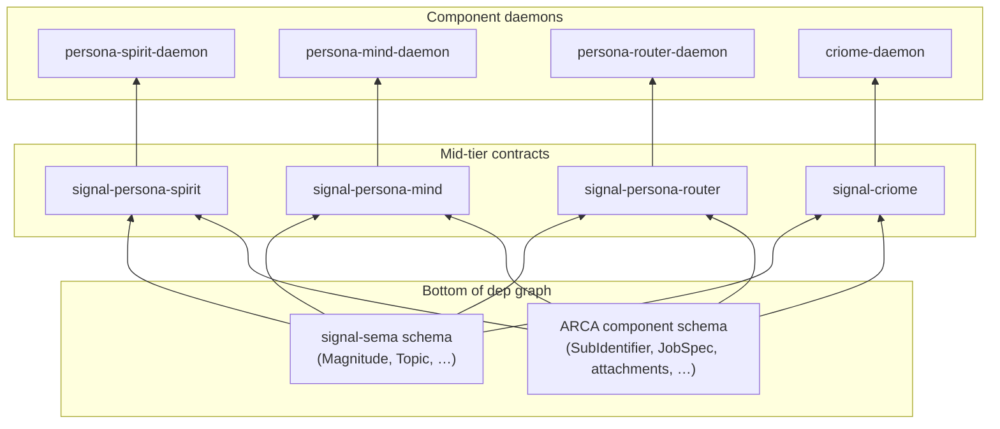
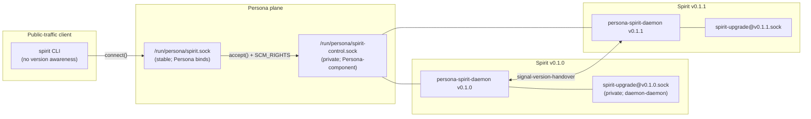

# 4 - ARCA migration cascade and continuous-runtime atomic upgrade

*Slice 4 of the third-designer architecture-update session. Composes
spirit records 319 (ARCA cascades migration whenever an ARCA-touched
format changes) and 320 (major engine version upgrades happen
atomically in real time, no downtime) into a single coherent
flow. Builds on /270 (sema-upgrade triad), /279 (NOTA schema
language and per-component schema-version hash), /285
(VersionProjection trait + signal-version-handover), /287
(version-handover visual), /291 (Persona + systemd hybrid), and
persona/ARCHITECTURE.md §1.6.7 (Design D public-socket handoff).*

## §0 TL;DR

ARCA is the workspace's content-addressed filesystem; it stores
**typed blobs** — content-addressed Job specs, build artefacts (forge
outputs), user attachments, and (per spirit record 318) any
sub-identifier scheme whose layout is settled by the workspace
rather than by individual records. Whenever the **canonical encoding
of any ARCA-stored type changes shape**, three things happen in
order:

1. ARCA migrates its own redb index for the affected store(s) —
   bottom of the dependency graph, migrates first.
2. **sema-upgrade-daemon** reads the new ARCA component schema-version
   hash, looks up every component whose schema imports the changed
   type, and emits `PlanRequired` per consumer at next inspection.
3. Each consumer runs its per-type `VersionProjection` against its
   own redb (sema-upgrade orchestrates; the daemon's in-process
   library executes), then re-handshakes with Persona for the
   atomic version swap per /285's `signal-version-handover`
   protocol.

The continuous-runtime invariant from record 320 holds because the
**public socket is Persona's, not the component's** (Design D).
Persona binds one stable public socket per routed component, accepts
each new client connection, reads the active-version snapshot, and
hands the accepted file descriptor to the active version's daemon
over a private control connection via `SCM_RIGHTS`. The selector
flip is *next-accepted-client-only*: connections already handed off
to v0.1.0 keep running on v0.1.0's descriptor until they finish,
while new clients land on v0.1.1's. Zero in-flight requests dropped;
zero discovery on the client side; one stable socket path. This is
the lossless+client-transparent invariant from record 245 honoured
under the new atomic-upgrade rule.

The cascade triggers even for consumers whose `VersionProjection`
implementation is the blanket identity (`type Error = Infallible;
project(x) → Ok(x)`). The schema-version hash that the consumer's
binary commits to changes whenever any depended-on schema changes
(per /279 §3d, cross-schema references hash by value); hash-binding
integrity demands the per-component header row update, even when no
record byte changes. The migration is a no-op write that bumps the
header to the new hash.

## §1 ARCA's role and format-change detection

### 1.1 What ARCA stores

ARCA is content-addressed by Blake3 of canonical encoding. Today's
ARCA holds **four families** of stored content; the families share
a hashing scheme but differ in who depends on them:

| Family | Producer | Consumer | Shape |
|---|---|---|---|
| Build artefacts | forge | persona-daemon (via Nix store path → ARCA hash), sema-upgrade (binary identity), Criome (capability tokens reference) | Unix file trees with deterministic layout |
| Content-addressed Job specs | persona-orchestrate, mind | mind, orchestrate, workers | Typed NOTA records encoded canonically |
| User attachments | psyche via CLI | terminal, message, persona-mind | Opaque blob with type tag in the per-store index |
| Sub-identifier rolls (per record 318) | every component whose record family uses `SubIdentifier` | every consumer of records carrying `SubIdentifier` references | Typed enumeration spine; the **layout** is the cross-cutting schema |

The fourth family is the new one record 318 introduces. A
sub-identifier names a stable sub-position within a record family;
the encoding scheme (variable-width integer, prefix-coded sequence,
content-addressed micro-record) is workspace-scoped and lives in
ARCA so every component reads the same bytes the same way.

### 1.2 When ARCA itself migrates

ARCA carries its own per-store **schema_header** redb table the same
way every sema-engine-backed component does (per /279 §5). The
header row binds the schema-version hash of the *index schema* for
that store — keyed on store name, valued on the Blake3 of the
canonical encoding of the typed record families that store accepts.

ARCA migrates its own redb index — not the blob trees themselves
under `~/.arca/<store>/<blake3>/` — whenever either of the following
changes:

1. The **index schema** for a store changes (e.g. an indexed
   metadata column gains or drops a field).
2. A **stored type's canonical encoding** changes (e.g. SubIdentifier
   encoding bumps from u32 to varint). Blob trees do not need
   bit-level rewrite; they were already content-addressed under the
   old encoding. The index that *names* them must learn the new
   canonical hash for re-deposits going forward, and must carry the
   old hash for back-reference.

The blob trees themselves are immutable under their content hash;
re-encoding a stored type produces a new tree at a new hash, and the
index gains a second row pointing at the new hash. Old consumers
read the old hash; new consumers read the new. ARCA's migration
unifies the **index** view; sema-engine-backed consumers separately
migrate their own redbs to translate stored references from old hash
to new.

### 1.3 How ARCA knows who depends on what

The cross-component dep graph from /279 §3d is the load-bearing
mechanism. Every component schema written in NOTA-schema-language
embeds cross-schema references *by value* (the encoder rewrites
`signal-sema:Magnitude` to `(SchemaRef <hash>)` before hashing).
The schema generator emits, per component:

- a `CONTRACT_VERSION` constant (per /285 §7.3) — the component's
  schema hash;
- a `SCHEMA_DEPENDENCIES` constant — the **set of (component-name,
  contract-version)** pairs the component's schema embeds.

ARCA's component schema sits at the bottom of the workspace
dependency graph for blob-shaped types. When ARCA's schema hash
bumps, every component that lists ARCA in its `SCHEMA_DEPENDENCIES`
will see a mismatched chain at next inspection.

sema-upgrade reads these constants out of each daemon at boot
through the **inspect socket** (/279 §6c). The dep edges live in
sema-upgrade's own redb (not in ARCA itself) as a **derived
catalogue** — rebuilt from the per-component `SCHEMA_DEPENDENCIES`
the first time each component reports in. ARCA does not maintain
the dep graph; ARCA exposes its own hash; sema-upgrade aggregates.

This is the correct separation of concerns: ARCA owns content;
sema-upgrade owns version arithmetic.

## §2 Cascade discipline and ordering

### 2.1 Bottom-up rule

Record 319 makes the cascade **mandatory**: no format-change
escapes downstream migration. The order is dictated by the
dependency graph — depended-on components migrate first; depending
components migrate next. The bottom of the graph for blob-shaped
types is ARCA; the bottom for record-shaped types is `signal-sema`
(carrying Magnitude, Topic, the universal scalar vocabulary); above
both sit the per-component signal-X crates, then the per-component
runtime daemons.



Migration walks the same graph upward: bottom-tier daemons (ARCA
itself; eventually a signal-sema-storage daemon if one materialises)
migrate their own redbs first, then sema-upgrade re-issues
`PlanRequired` to every component that depends on the changed
bottom, until the top-tier daemons all sit at the new schema.

### 2.2 The cascade protocol

```mermaid
sequenceDiagram
    participant ARCA as arca-daemon
    participant Inspect as arca-inspect.sock
    participant Sema as sema-upgrade-daemon
    participant Persona as persona-daemon
    participant Spirit as persona-spirit-daemon
    participant Mind as persona-mind-daemon

    Note over ARCA: deploy lands new ARCA binary<br/>schema hash bumps #ab12 -> #cd34

    Sema->>Inspect: AskStoredSchemaHash(arca)
    Inspect-->>Sema: StoredSchemaHashReported(#ab12)
    Note over Sema: stored != declared (#cd34);<br/>ARCA migration plan registered
    Sema->>Persona: ProposeFleetMigration(arca, #ab12 -> #cd34)
    Persona->>Persona: append UpgradePrepared(arca)<br/>to event log
    Persona->>ARCA: ExecutePlan via in-process upgrade library
    ARCA-->>Sema: MigrationCompleted(arca, #cd34)
    Sema->>Sema: update derived dep-catalogue;<br/>collect downstream consumers

    par each consumer
        Sema->>Spirit: Inspect (re-issued)
        Spirit-->>Sema: declared #ee55, stored #ee44
        Note over Sema: chain check —<br/>spirit's #ee44 was bound under arca #ab12;<br/>arca hash drifted; PlanRequired
        Sema->>Persona: ProposeComponentMigration(spirit, #ee44 -> #ee55)
        Persona->>Spirit: ExecutePlan (in-process)
        Spirit-->>Sema: MigrationCompleted(spirit, #ee55)
    and
        Sema->>Mind: Inspect (re-issued)
        Mind-->>Sema: declared #ff77, stored #ff66
        Sema->>Persona: ProposeComponentMigration(mind, #ff66 -> #ff77)
        Persona->>Mind: ExecutePlan
        Mind-->>Sema: MigrationCompleted(mind, #ff77)
    end

    Note over Persona: per-component handover<br/>via Design D (§3)
```

Three properties:

- **sema-upgrade is the cascade orchestrator**, not Persona.
  sema-upgrade owns the schema arithmetic; Persona owns the version
  selector and the public-socket handoff. They cooperate through
  Persona's manager messages (`PrepareUpgrade`, `DriveVersionHandover`
  per persona/ARCHITECTURE.md §1.6.7).
- **The cascade is fan-out per layer**, not strictly sequential
  across consumers. Once ARCA migrates, every depending consumer
  receives `PlanRequired` concurrently. They migrate in parallel
  bounded by Persona's throttle (`ConfigureThrottle` per /270 §7
  owner contract).
- **Each consumer's migration is gated by its own readiness**, not
  by its peers. Spirit can finish before Mind; Persona's
  active-version selector flips per-component independently.

### 2.3 What "depends on" means concretely

A consumer depends on ARCA when its component schema contains a
cross-schema reference to an ARCA-defined type. Concrete cases for
the SubIdentifier example:

- `signal-persona-mind` contains `(SchemaRef <arca-SubIdentifier-hash>)`
  inside records that key by sub-position.
- `signal-criome` contains it inside capability-token issuance
  records.
- `signal-repository-ledger` contains it inside per-commit
  sub-identifier rolls.

A consumer that does *not* reference ARCA's `SubIdentifier` (or any
ARCA type) sees no chain disturbance — its `SCHEMA_DEPENDENCIES`
does not include ARCA, so the dep catalogue does not link it to
ARCA's hash change. Its own schema hash does not bump. It receives
no `PlanRequired`. The cascade is fan-out only to actual dependents.

## §3 Persona atomic version-swap protocol

### 3.1 The four-socket-plus-public model

Per persona/ARCHITECTURE.md §1.6.7 the upgrade `Target` carries four
socket paths (current_owner, current_upgrade, next_owner,
next_upgrade) PLUS the **Persona-owned stable public socket** and a
private control socket between Persona and the component's
versioned daemons. The two-tier shape:



Three load-bearing properties:

- **One stable public socket** (`/run/persona/spirit.sock` or its
  per-engine analogue). The CLI's connect path never changes across
  upgrades. This is the lossless+client-transparent invariant from
  record 245 made concrete: the CLI does not perform discovery; it
  connects to one well-known path; Persona answers.
- **Persona accepts the public client**, reads the active-version
  snapshot for the component, and sends the accepted file
  descriptor to the active version's daemon via `SCM_RIGHTS` over
  the private control connection. The component daemon receives a
  ready-to-read socket file descriptor and speaks its domain
  protocol directly to the client.
- **The component's domain frame bytes never traverse Persona**.
  After the descriptor handoff, the client speaks directly to the
  component over the handed-off file descriptor. Persona is not a
  proxy; Persona is a switchboard.

### 3.2 The atomic swap sequence

```mermaid
sequenceDiagram
    actor Psyche as psyche
    participant POwn as Persona owner socket
    participant Mgr as EngineManager
    participant Unit as ComponentUnitManager
    participant Drv as HandoverDriver
    participant V1 as v0.1.0 daemon
    participant V2 as v0.1.1 daemon
    participant Pub as /run/persona/spirit.sock

    Note over V1,Pub: Phase 0 — steady state<br/>v0.1.0 connected to Persona's control;<br/>active-version snapshot = v0.1.0;<br/>new clients land on v0.1.0

    Psyche->>POwn: AttemptHandover(spirit, v0.1.0 -> v0.1.1)
    POwn->>Mgr: HandleOwnerVersionHandover
    Mgr->>Mgr: quarantine-gate check
    Mgr->>Unit: start persona-component@spirit:v0.1.1.service
    Unit->>V2: ExecStart persona-spirit-daemon v0.1.1
    V2->>V2: bind spirit-upgrade@v0.1.1.sock
    V2->>Pub: dial Persona control socket
    Note over V2: control connection established;<br/>v0.1.1 registered as next version

    Note over V1,V2: Phase 1 — handover protocol<br/>(/285 signal-version-handover)
    Drv->>V1: AskHandoverMarker
    V1-->>Drv: HandoverMarker(commit_seq N)
    Drv->>V2: AskHandoverMarker
    V2-->>Drv: HandoverMarker(commit_seq M)
    Note over Drv: require high-water-mark parity<br/>after v0.1.1 copies and projects v0.1.0 state
    V2->>V1: copy state via upgrade socket;<br/>each record through VersionProjection
    V2->>Drv: ReadyToHandover(N parity)
    Drv->>V1: ReadyToHandover
    V1-->>Drv: HandoverAccepted
    Note over V1: enter HandoverMode<br/>public writes paused on v0.1.0

    Note over V1,Pub: Phase 2 — atomic flip<br/>(selector + new-accepts)
    Drv->>V1: HandoverCompleted
    V1-->>Drv: HandoverFinalized
    Mgr->>Mgr: append ActiveVersionChanged(spirit -> v0.1.1)
    Mgr->>Mgr: reducer updates active-version snapshot

    Note over Pub: from this moment, new clients<br/>connecting on /run/persona/spirit.sock<br/>are accept()-handed to v0.1.1

    Note over V1: in-flight v0.1.0 clients continue<br/>on their existing file descriptors<br/>until they finish

    Note over V1: Phase 3 — drain<br/>v0.1.0 still owns its handed-off descriptors;<br/>once all close, v0.1.0 retires<br/>(or stays for back-compat reads)
```

The flip is atomic at the **active-version snapshot reducer** in
Persona's manager event log. Before the `ActiveVersionChanged` event
lands, the next `accept()` on `/run/persona/spirit.sock` reads
`v0.1.0` from the snapshot and hands the file descriptor to v0.1.0.
After the event lands, the next `accept()` reads `v0.1.1` and hands
to v0.1.1. The transition is a single reducer write — one event-log
append, single-writer-safe.

### 3.3 Coordination with /285's signal-version-handover

`signal-version-handover`'s six operations — `AskHandoverMarker`,
`ReadyToHandover`, `HandoverCompleted`, `Mirror`, `Divergence`,
`RecoverFromFailure` — are what Persona's `HandoverDriver` (per
persona/ARCHITECTURE.md §1.6.7 `src/upgrade.rs`) drives against
each component's private upgrade sockets. Persona is the **client
of `signal-version-handover`**; the component daemons are the
servers.

`PeerCheck` from the /284 specification is retired (per spirit
record 196): the single discovery contract is
`signal-version-handover`. CoordinateBack collapses into Persona's
control connection — v0.1.1 dials Persona's control socket on
startup, registering itself; Persona uses that registration to
verify next-readiness before flipping the selector. No
component-to-component RPC for "are you ready?"; Persona is the
arbiter.

## §4 Lossless + client-transparent invariant

### 4.1 The four loss-modes the design must avoid

1. **Client retries discovery.** The CLI does not know about
   versions; the CLI does not consult a registry; the CLI connects
   to one stable socket path. Persona answers and routes.
   `~/.nix-profile/bin/spirit` (or its post-rename `spirit`) is one
   binary that opens one well-known path.
2. **In-flight requests dropped at flip.** The flip changes the
   *next accept* target, never an existing accepted connection. A
   v0.1.0 client mid-request keeps talking to v0.1.0 until its
   connection closes.
3. **Subscriptions broken.** Per /285 §2.1, the default subscribe
   policy is `TerminateAtHandover` — but the *client experience* is
   that the subscription terminates cleanly and the client
   reconnects on the same stable public socket, where Persona
   accepts and routes to v0.1.1, who serves the new subscription.
   "Reconnect" is a single retry on one stable path.
4. **Owner-side admin disrupted.** Persona's *own* owner socket is
   the admin entry point. `AttemptHandover` lands there;
   `Quarantine`, `ForceFlip`, `Rollback` all carry through the same
   contract. There is no per-component-version owner-socket
   awareness needed at the admin side.

### 4.2 Drain protocol on the retiring daemon

After the active-version flip, v0.1.0's state machine is
`PrivateUpgradeOnly` (per /287 §4). v0.1.0:

- **stops accepting** new public clients — it doesn't own the
  public socket, Persona does, so this is automatic;
- **completes in-flight requests** on existing handed-off
  descriptors — those descriptors point at v0.1.0's existing
  accept-state Unix socket pair that Persona handed off earlier; no
  protocol change needed;
- **mirrors writes from v0.1.1** on its upgrade socket — only for
  the duration v0.1.0 stays warm. After the warm period (configured
  via Persona's owner contract), v0.1.0 retires.

The drain has no hard deadline; the retire trigger is
`AllInflightCompleted`, observable by v0.1.0 itself (when all its
accepted connections close), then `RetireReady` to Persona, then
Persona stops the systemd unit.

### 4.3 Subscription transfer

Three subscription kinds traverse the cutover differently:

| Subscription | Pre-flip target | Flip behaviour | Post-flip behaviour |
|---|---|---|---|
| Domain Tap (per /285 §2.3) | v0.1.0 daemon | Subscription continues on existing fd until that fd closes | New Tap from same client connects via stable socket; Persona routes to v0.1.1 |
| `persona-introspect` cross-version failure tap | persona-introspect daemon | Persona-introspect is not the upgrading component; its subscription is undisturbed | Continues at persona-introspect, now reporting failures from both v0.1.0's drain and v0.1.1's new writes |
| Signal event stream (per channel `events`) | v0.1.0 daemon | TerminateAtHandover (default policy from /285 §2.1) | Client reconnects on stable socket; new event stream begins under v0.1.1 |

The TerminateAtHandover default exists because per-delta projection
across versions is expensive and the workspace prefers a clean
reconnect. Future per-component policy can override to
`ResumeAgainstNext` if a long-lived subscriber justifies the
cross-version projection cost.

## §5 Worked example: SubIdentifier encoding bump cascade

Concrete walk-through. ARCA's `SubIdentifier` type is currently
encoded as `(Newtype SubIdentifier u32)`. The new encoding is
varint-prefixed bytes — wider headroom, smaller average size.

### 5.1 The schema change in ARCA

```nota
;; before
(Schema arca
    [(Newtype SubIdentifier u32)
     ...])

;; after
(Schema arca
    [(Newtype SubIdentifier VarintBytes)
     ...])
```

The Blake3 of arca's canonical encoding goes from `#ab12...` to
`#cd34...`. The generator emits the new constant into arca's
runtime crate at the next build.

### 5.2 What downstream components see

Every component whose schema embeds `arca:SubIdentifier` had a
cross-schema reference of the form `(SchemaRef #ab12...)` resolved
*by value* at canonicalisation time. After arca's encoding changes,
those references must re-resolve to `(SchemaRef #cd34...)`. The
generator does this automatically on next rebuild; the result is
that **every downstream component schema also gets a new hash** —
not because the downstream's own bytes changed, but because its
embedded reference now points at a different value-hashed
predecessor.

Concrete: `signal-persona-mind`'s hash goes from `#ff66...` to
`#ff77...`. `signal-criome`'s hash goes from `#aa88...` to
`#aa99...`. Each rebuild produces a new `CONTRACT_VERSION` constant.

### 5.3 What downstream components do with their stored data

Two cases per downstream component:

**Case A — uses SubIdentifier in records that persist.** The
component's per-type `VersionProjection<SubIdentifier_old,
SubIdentifier_new>` decodes u32 and re-encodes as varint. The
projection is total (every u32 is representable as varint) and
infallible (no `NotRepresentable`); it executes once during
`sema-upgrade`'s migration plan against the component's redb. Every
record carrying SubIdentifier is re-encoded.

**Case B — uses SubIdentifier only on the wire, never in storage.**
The component's per-type `VersionProjection` is still emitted (the
generator emits one per type per schema-version pair), but no
storage walk runs because no stored record carries the type. The
component's `MigrationPlan` is empty-bodied — zero steps — but the
plan still **runs**, because the `schema_header` row must update
from the old per-component hash to the new one. Hash-binding
integrity (§6) demands this even when no bytes change.

### 5.4 Per-component handover

Each downstream component, after running its migration, re-handshakes
with Persona per §3. Spirit, Mind, Criome each get a new version
spawned (`persona-component@<component>:<new-version>.service`),
each runs the `signal-version-handover` protocol against its prior
version, and Persona flips each component's active-version snapshot
independently. The order across components doesn't matter — they
fan out in parallel, bounded by Persona's throttle.

A single owner command — `AttemptFleetUpgrade(arca, #cd34)` — can
drive the whole cascade as one owner-issued plan. Persona's manager
walks the dep graph from sema-upgrade's catalogue, emits per-
component `AttemptHandover` orders in topological order, and reports
fleet completion when every component reaches the new schema. This
is the fleet-wide rolling-swap path; individual `AttemptHandover`
calls remain available for per-component upgrades not driven by a
cascade.

## §6 Identity-no-op cases and hash-binding integrity

### 6.1 Why the cascade triggers even on identity projections

The designer lean from the brief — yes, cascade triggers even when
the per-type Migration is identity — is correct. The mechanism is
straightforward:

- The per-component schema-version hash is content-addressed over
  the canonical encoding of the *whole* component schema, including
  by-value cross-schema references (per /279 §3d).
- A cross-schema reference's by-value resolution changes whenever
  the depended-on schema changes — even if the *referenced type*
  itself is structurally unchanged at the field level the
  consumer cares about.
- Therefore the consumer's `CONTRACT_VERSION` constant changes on
  rebuild, the `schema_header` row in the consumer's redb still
  carries the old constant, and `sema-upgrade-daemon`'s `Inspect`
  returns `PlanRequired`.

The plan executes; the per-type `VersionProjection` impl is the
blanket `Identity` for every type whose shape didn't move; the
migration walks zero rows (because nothing needs re-encoding); the
final step writes the new hash into the `schema_header` row.

### 6.2 Why hash-binding integrity matters

The alternative — skip the cascade when no record-level bytes
change — breaks two properties:

- **Schema-address identity is no longer self-describing.** A
  daemon at hash `#X` could have its records under any of several
  upstream-version chains; the schema-address loses its
  load-bearing role as identity of the daemon's data shape (per
  /279 §4).
- **Round-trip and projection tests no longer pin the version.**
  /285 §7.1 requires every signal-X crate to round-trip-test its
  records against `CONTRACT_VERSION`. If a consumer's hash doesn't
  bump when its dep bumps, the test pins the wrong hash, and a
  future cross-version recovery via the `MigrationIndex` (per /285
  §6.3) can decode bytes against the wrong frozen crate.

The identity-no-op write is cheap (one redb header row update); the
integrity it preserves is load-bearing.

### 6.3 Concrete: identity-no-op walks four lines

The whole identity case is mechanically:

```rust
// in <component>/src/upgrade.rs
pub fn migrate_to(target_hash: SchemaVersionHash) -> Result<(), UpgradeError> {
    let mut txn = sema.begin_write()?;
    txn.write_schema_header(SchemaHeader::current(target_hash))?;
    txn.commit()?;
    Ok(())
}
```

No per-record walk; one header write; one commit. The cascade still
goes through the full handshake — Persona starts a next-version
unit, `signal-version-handover` runs, the active-version snapshot
flips — because the binary IS new even though the bytes don't move.
The new binary's `CONTRACT_VERSION` is what's load-bearing.

## §7 Failure modes

### 7.1 Mid-cascade consumer migration failure

Scenario: ARCA migrated successfully; sema-upgrade emitted
`PlanRequired` to four consumers; three completed; one (`mind`)
returned `MigrationFailed` mid-step.

Per /270 §7 (sema-upgrade owner contract) and /285 §6.1
(persona-introspect cross-version failure log), the failure is
durable:

- `MigrationFailed((MigrationIdentifier) (StepIndex u32)
  (FailureClassification …))` lands in sema-upgrade's redb
  (`step_outcomes` table).
- A `CrossVersionFailure` record lands in persona-introspect's
  `cross_version_failures` table, carrying the original message
  bytes and a `FailureClass::HandoverRejected` or
  `CatastrophicNextFailure` tag.

Persona's response, per record 320's continuous-runtime invariant:
**do not roll back ARCA; do not block the rest of the fleet**.
Instead:

1. **Quarantine the failing consumer.** Persona appends
   `VersionQuarantined(mind, v0.1.0 + v0.1.1)` to its event log;
   future `AttemptHandover` against `mind` fails closed at the
   quarantine gate.
2. **Continue serving on the pre-cascade version.** Mind's active
   version stays at `v0.1.0`. The stable public socket
   `/run/persona/mind.sock` keeps routing to `v0.1.0`. Public
   traffic continues; mind is *not* upgraded but is *not* down.
3. **Notify the operator via persona-introspect.** The failure tap
   stream fires; operator dashboards (per /285 §6.4) light up;
   psyche or operator decides whether to retry, patch, or rollback
   the offending dep.
4. **Keep upstream consistent.** ARCA stays at the new hash;
   downstream consumers that *did* migrate stay at their new hashes.
   Mind alone is at the old chain. This is acceptable because mind's
   `v0.1.0` binary was built against the old ARCA hash — its
   cross-schema reference resolves to ARCA's old canonical encoding.
   The dep graph is internally consistent for the quarantined
   subtree.

The principle: **partial-fleet success is an acceptable steady
state**. The cascade is mandatory but the *fleet-wide completion*
is best-effort; quarantine is the safety valve.

### 7.2 ARCA's own migration failure

ARCA at the bottom of the dep graph is the only case where rollback
might be necessary. If ARCA's own migration fails, sema-upgrade
emits `MigrationFailed(arca)`, Persona quarantines ARCA, and the
**cascade does not start**. Downstream consumers stay at their
current schemas; their next inspection still reports the old ARCA
hash because ARCA's `schema_header` was never updated. Steady state
holds; the cascade is aborted at the root.

If ARCA migration *partially* succeeded (some index columns updated;
others rolled back via redb's transaction abort), the abort is
atomic — ARCA's redb commit succeeds or fails as a unit. There is
no "half-migrated ARCA" state.

### 7.3 In-flight handover failures

A consumer's `signal-version-handover` exchange can fail at three
points:

| Failure point | Recovery |
|---|---|
| `AskHandoverMarker` returns stale marker (commit drift) | `HandoverRejected`; driver retries with newer marker after copy catch-up |
| `ReadyToHandover` succeeds but `HandoverCompleted` fails | `RecoverFromFailure` per /285 §6.1; v0.1.0 returns from `HandoverMode` to `Active`; v0.1.1 retires unused |
| v0.1.1 crashes mid-state-copy | Persona's `ComponentUnitManager` detects via socket close; the upgrade-socket replay log on v0.1.0 retains uncommitted Mirror payloads; v0.1.0 returns to `Active`; persona-introspect records the failure |

In every case, **v0.1.0 stays public**. The stable socket points at
v0.1.0; the selector never flipped; clients see no interruption.

### 7.4 What Persona does NOT do

Per record 320, Persona does *not*:

- Block the entire fleet on one component's failure.
- Roll back the cascade at the bottom (ARCA) when a mid-tier
  consumer fails.
- Stop service to compute schema migrations.
- Drop in-flight client connections during a flip.

The continuous-runtime invariant means failures localise to the
failing component; the rest of the fleet keeps moving; the public
sockets keep answering.

## §8 Bead list for operator pickup

The cascade + atomic-upgrade work decomposes into the following
operator beads. Each is a unit of implementation work with a clear
acceptance signal.

| Bead title | Acceptance signal | Depends on |
|---|---|---|
| arca-schema-header — add `schema_header` redb table to ARCA per-store index | First-start writes one row; sema-upgrade can read it via inspect socket | /279 §5 |
| arca-inspect-socket — bind `arca-inspect.sock` for sema-upgrade hash discovery | sema-upgrade's `AskStoredSchemaHash(arca)` returns ARCA's stored hash | /279 §6c |
| arca-component-schema — declare ARCA's NOTA-schema-language schema file | `cargo build` emits ARCA's `CONTRACT_VERSION` constant | /279 §2 |
| dep-catalogue-derived — sema-upgrade derives the cross-component dep graph from each component's `SCHEMA_DEPENDENCIES` on first inspection | sema-upgrade's redb carries the dep catalogue; `ProposeFleetMigration` can walk it | /279 §3d; this report §1.3 |
| persona-fleet-upgrade-owner-op — add `AttemptFleetUpgrade` to `owner-signal-version-handover` | Persona's owner socket accepts the op; manager fans out per-component `AttemptHandover` in topological order | persona/ARCHITECTURE.md §1.6.7 |
| persona-stable-public-socket — Persona binds one stable public socket per routed component; uses `SCM_RIGHTS` descriptor handoff to the active-version control connection | `spirit` CLI connects to `/run/persona/spirit.sock`; active version receives accepted fd; selector flip changes new-accepts only | persona/ARCHITECTURE.md §1.6.7 §"Design D public-socket handoff" |
| handover-mirror-payload-apply — wire main daemon's reverse-projection apply for Mirror payloads received from next during HandoverMode | A v0.1.1 write during HandoverMode mirrors back into v0.1.0's redb via reverse VersionProjection | /285 §3.6 |
| cross-version-failure-tap-dashboard — operator-facing dashboard over `TapCrossVersionFailures` in persona-introspect | One terminal-cell shows fleet migration health in real time | /285 §6.4 |
| quarantine-gate-fleet — Persona's manager refuses fleet upgrade through any quarantined component; partial-success state persists in the active-version snapshot | An `AttemptFleetUpgrade` with one quarantined component completes the unquarantined consumers and reports per-component status | persona/ARCHITECTURE.md §1.6.7 §"Quarantine gate" |
| arca-typed-store-vocabulary — define ARCA's typed record families: Build artefact, Job spec, attachment, SubIdentifier roll (per record 318) | ARCA's `signal-arca` contract carries the four families; ARCA's runtime crate generates types per /279 | /git/.../arca/ARCHITECTURE.md §"Code map"; record 318 |
| sub-identifier-cross-component-pilot — first consumer migration through the cascade (mind or criome) for a SubIdentifier encoding bump | `AttemptFleetUpgrade(arca, varint-bytes)` runs end-to-end; downstream consumer's `schema_header` lands at the new hash | All the above |

The two-phase rollout: first ten beads land the mechanism; the
pilot bead exercises it end-to-end. The mechanism beads can land
in parallel by file; the pilot needs all mechanism beads complete.

The fleet upgrade owner operation (`AttemptFleetUpgrade`) is a new
addition to `owner-signal-version-handover`; today's contract
carries only per-component `AttemptHandover`. Adding the fleet
operation is a contract-edit bead in its own right — the contract
crate needs the new operation arm and reducer paths.

The stable-public-socket bead is the largest single piece (Design
D landed in persona/ARCHITECTURE.md but the `src/transport.rs`
surface is mostly skeletal per /302). It is the load-bearing piece
of record 245's lossless+client-transparent invariant; until it
ships, the CLI can still observe the version flip via socket-path
changes.

## §9 References

**Spirit records (this turn).** 318 (sub-identifiers ARCA-housed);
319 (ARCA performs database migration whenever an ARCA-touched
format changes — mandatory cascade); 320 (major engine version
upgrades happen atomically in real time with no downtime).

**Spirit records (prior turns).** 164 (per-type version migration);
177 (peer-check principle); 178 (multi-version dispatch);
180-184 (divergence vs reject vocabulary, cross-version recovery);
186 (cross-daemon cutover can be atomic by protocol); 191-193
(VersionProjection one-relation, explicit daemon handover protocol,
post-handover main is private-upgrade-writable only); 194-196
(crate name `version-projection`; SubscribePolicy default
TerminateAtHandover; PeerCheck retired); 208 (root-level Persona
takes over component upgrade management); 209 (Persona lands before
Spirit cutover); 210 (component-upgrade orders arrive at Persona's
owner socket); 215-216 (canonical short name `Persona`); 223
(persona-permissioned-system-daemon); 240 (Persona uses systemd
template units; `persona-component@<component>:<version>.service`);
245 (lossless + client-transparent cutover); 246 (CLI does not
perform discovery); 258 (selector-flip-aware routing); 260
(spirit-per-engine).

**Designer reports.**

- /270 — sema-upgrade triad design (orchestrator boundary; owner
  contract surface — `ApprovePlan` / `Quarantine` / `Throttle`).
- /279 — NOTA schema language and per-component schema-version
  hash (the load-bearing identity mechanism; cross-schema
  references hash by value; the inspect socket for hash discovery).
- /285 — VersionProjection trait + signal-version-handover
  protocol (the per-type migration mechanism; the daemon-to-daemon
  handover contract; per-operation policy; MigrationIndex for
  historical decode).
- /287 — version-handover visual reference (six-piece stack; socket
  layout; state machine; phase walk-through).
- /291 — Persona + systemd template units (SystemdTransientUnitLauncher
  backend; the `Restart=no` window during handover; transient-unit
  template instance names).
- /303 — intent manifestation sweep (records 245/246/252 manifested
  into persona/ARCHITECTURE.md §1.6.7; record 240 manifested into
  §1.7).
- /304 — unimplemented-intent audit (cascade-related records'
  current implementation state).

**ARCHITECTURE.md anchors.**

- `/git/github.com/LiGoldragon/persona/ARCHITECTURE.md` §1.6.7
  (Design D public-socket handoff; four-socket model; quarantine
  gate; reducer-based active-version snapshot; mermaid sequence).
- `/git/github.com/LiGoldragon/arca/ARCHITECTURE.md` (multi-store
  shape; capability-tokened deposits; write-only staging; reader
  library; per-store redb index).

**Skill files.**

- `skills/component-triad.md` — triad shape and the
  one-argument-NOTA rule.
- `skills/intent-manifestation.md` — when designer decisions land
  in ARCH vs in beads vs as carry-uncertainty.

**Workspace artefacts.** `ESSENCE.md` §"Today and eventually"
(today's ARCA is a realisation step toward eventual Sema);
`AGENTS.md` §"Hard overrides" §"Component triad" (cascade fan-out
respects the triad).
