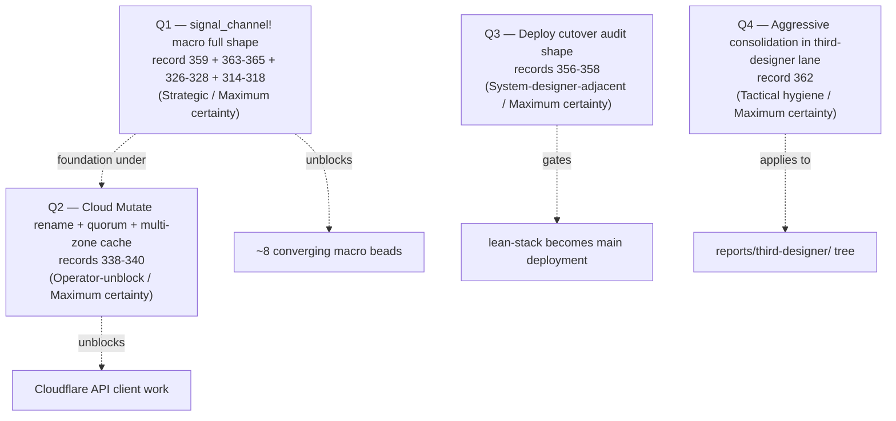
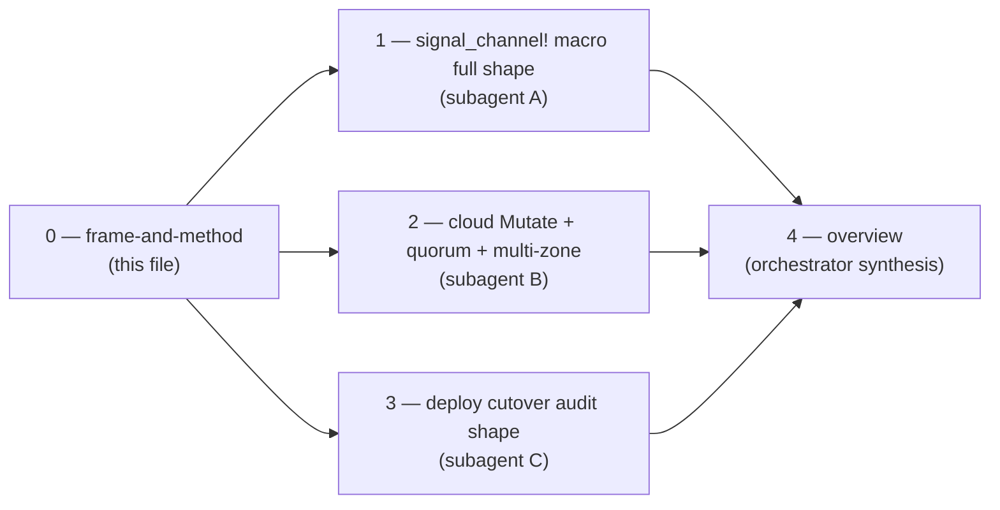

# 25 — Most Important Questions (post-refresh, 2026-05-24)

*Kind: Meta-report frame · Lane: third-designer (parallel-main
designer, Structural authority) · 2026-05-24*

## Why this meta-report exists

Psyche 2026-05-24: *"refresh skills and intent, then analyze the
most important questions, research solutions and create a visual
report."*

The refresh surfaced a substantial wave of new intent records since
the prior /24 synthesis (commit `85656e7d`). Records 342-365 land
four new substantive design fronts plus several constraints on
in-flight work. The wave's center of gravity is **spirit record
359**: *signal_channel! basic declaration EMBEDS the 64-bit Tier 1
micro header by default; STANDARDIZES the two-enum-namespace shape;
DERIVES the small object from the macro directly; EVERY enum gets
a Help variant.* This consolidates 9+ prior intent records into one
macro design lever and converges eight already-filed beads.

## The four most important questions, ranked

**Q1 is the highest-leverage strategic question.** The macro
consolidation determines what every subsequent contract-level
operator slice looks like. The eight beads listed in /312 §9
(`primary-l02o`, `primary-915w`, `primary-8r1j`, `primary-3cl1`,
`primary-v5n2`, `primary-avog`, `primary-li0p`, `primary-2cjv`)
all converge on the same `signal-frame-macros` extension surface
per record 359's "embed by default" direction. Until the unified
macro shape is clear, parallelizing these beads risks producing
incompatible pieces.

**Q2 is the highest-leverage concrete operator-unblock.** /306
already absorbed my /23 work into ARCH; system-specialist fixed
audit Problems 1+2 in code; but the cloud Mutate rename (record
338) and the quorum-of-agreement multi-zone cache (records
339-340) are NOT YET in code. These are the next concrete operator
slices before any Cloudflare API client work begins.

**Q3 is a system-designer-territory question** the third-designer
lane can frame but not own. Records 356-358 are Maximum-certainty
Decisions; the cutover discipline needs an audit-shape report
that system-designer or system-specialist can pick up.

**Q4 is tactical** — applies record 362's aggressive-consolidation
direction to the third-designer lane's older reports (/17-/22).
Resolved inside the synthesis (`3-overview.md`); no research
subagent needed.

## Method

**Designer protocol** (psyche 2026-05-21): the prime designer and
parallel-main designers run at full capacity with parallel
subagent workflows by default. Per intent 231, sub-agent sessions
land as a meta-report directory; this file is the orchestrator's
frame; each subagent writes a numbered file inside; the synthesis
is the highest-numbered file.

Three subagents dispatched in parallel. Each lane gets a
self-contained brief; each writes one file directly into this
meta-report directory. After all three return, the orchestrator
writes `4-overview.md` synthesising findings and surfacing the
psyche-decision questions that remain.

## Brief — Subagent A: signal_channel! macro full shape

**Goal**: produce the unified design for signal_channel! after
the consolidation directive in spirit record 359, integrating
records 314-318 (header + partition + SignalCore + Criome identity
+ Sub-ID), 326-328 (per-channel namespace + golden-ratio split +
Tier 1 prefix), and 363-365 (Help noun corrections to /312).

**Output**: `1-signal-channel-macro-deepens.md` with mermaid
diagrams of (a) what the macro emits today vs after record 359,
(b) the eight converging beads' shared surface, (c) the Help noun
walk semantics, (d) the golden-ratio compile-time enforcement
mechanism, (e) integration with SignalCore primitives. Include
intent-record citations.

## Brief — Subagent B: cloud Mutate + quorum + multi-zone cache

**Goal**: map records 338 (Plan → Mutate two-state), 339
(quorum-of-agreement Criome root pattern), and 340 (multi-zone
caching with NotAuthoritative fallback) onto the current cloud
+ domain-criome code shape. Produce the concrete operator slice
plan.

**Output**: `2-cloud-mutate-quorum-multi-zone.md` with mermaid
diagrams of (a) the Mutate two-state lifecycle, (b) the
quorum-of-agreement protocol shape, (c) the multi-zone cache
topology with content-addressing, (d) the bead-level slice plan.

## Brief — Subagent C: deploy cutover audit shape

**Goal**: frame the audit shape for the lean-stack-becomes-main-
deployment cutover per records 356 (decision) + 357 (sandbox
precondition) + 358 (prometheus nspawn pointer). Identify the
gates, the dependency graph, and what system-designer or
system-specialist needs to pick up.

**Output**: `3-deploy-cutover-audit-shape.md` with mermaid
diagrams of (a) the two-stack coexistence state today, (b) the
cutover dependency graph (sandbox-test → cutover gates), (c) the
audit checklist for cutover readiness.

## What this meta-report does NOT do

- Does not capture new psyche intent (no new psyche statements in
  this session beyond the refresh-and-analyze instruction).
- Does not file beads on behalf of psyche-decision questions —
  surfaces them in `4-overview.md` for triage.
- Does not edit upstream architecture files (ARCH, INTENT.md,
  skills/) — third-designer lane operates on report substrate;
  ARCH edits are prime designer's discipline.
- Does not dispatch operator slices — the synthesis surfaces
  candidate slices but psyche directs which the operator wave
  picks up.

## See also

- `reports/third-designer/24-refresh-after-audit-review-2026-05-23/0-orchestrator-synthesis.md`
  — the prior session's synthesis this report builds on.
- `reports/designer/305-v2-design-64bit-signal-per-component-namespacing.md`
  — per-component model the macro now embeds.
- `reports/designer/307-design-golden-ratio-namespace-split.md`
  — golden-ratio mechanism the macro now standardizes.
- `reports/designer/312-design-recursive-help-on-every-enum.md`
  — Help-on-every-enum design (with 363-365 corrections).
- `reports/designer/310-meta-overhaul-booking-roadmap.md` — bead
  booking roadmap including the eight converging macro beads.
- Spirit records 314-365 — the wave of intent records this report
  responds to.
