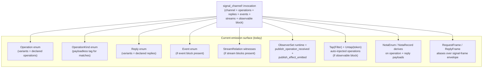
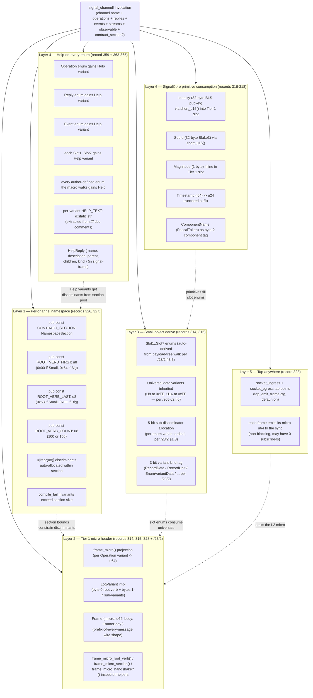
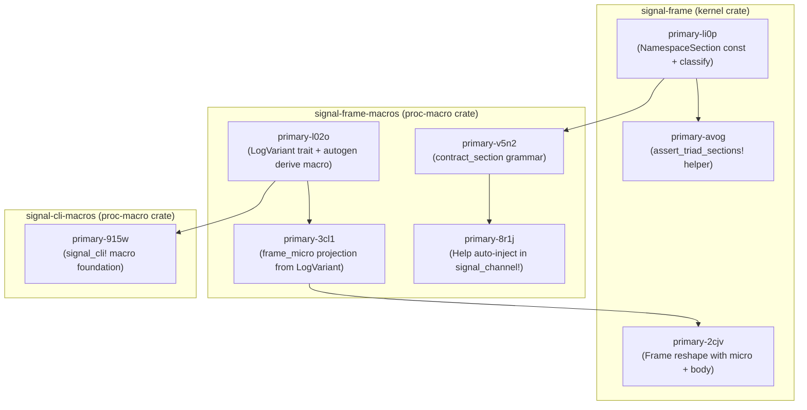
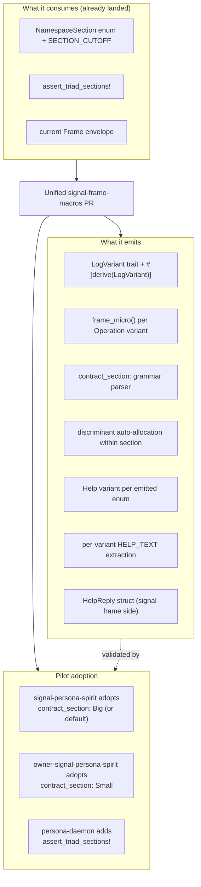
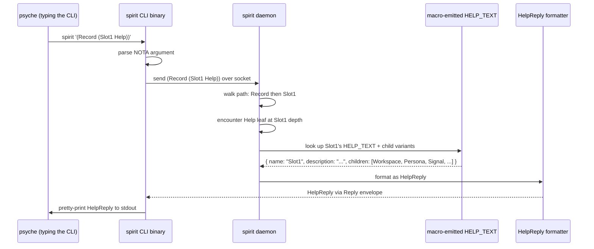
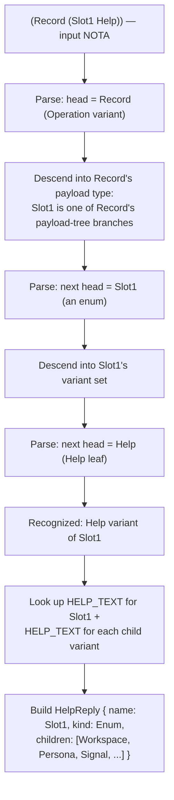
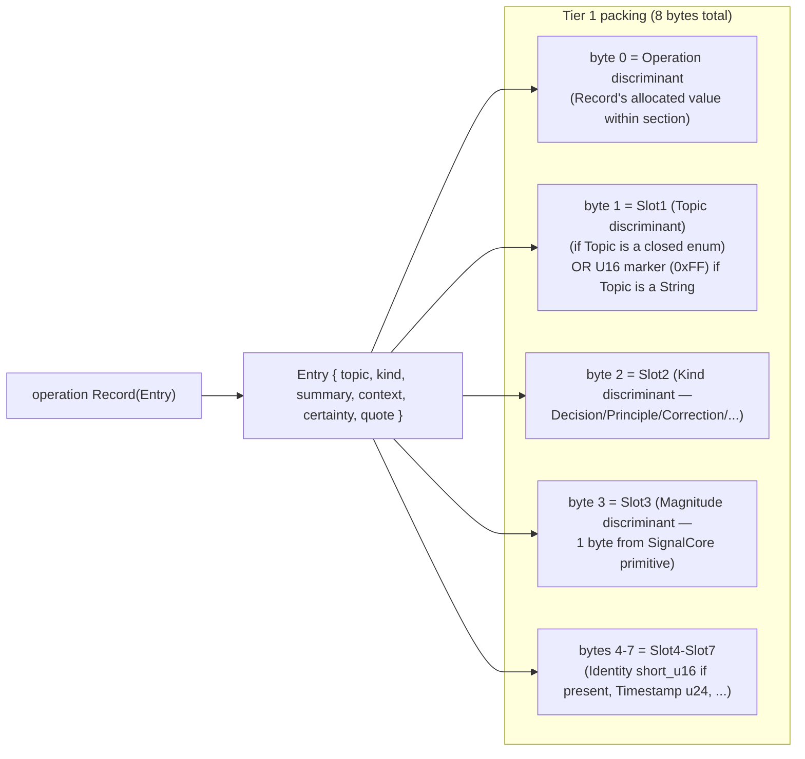

# 1 — `signal_channel!` after record 359: the full consolidated shape

*Kind: Design · Topic: signal-channel-macro-consolidation · 2026-05-24*

*Subagent A of meta-report 25
(`reports/third-designer/25-most-important-questions-2026-05-24/`).
Sibling slices: B (cloud Mutate + quorum), C (deploy cutover). This
fragment answers Question Q1 — the highest-leverage strategic question
in the meta-report's ranking: **what is the full shape of the
`signal_channel!` macro after the consolidation directive in spirit
record 359, integrating records 314-318 (header + partition +
SignalCore + Criome identity + Sub-ID), 326-328 (per-channel namespace
+ golden-ratio split + Tier 1 prefix), and 363-365 (Help noun
corrections to /312)?***

*Predecessor reports: /305-v2 (per-component namespacing), /307
(golden-ratio split), /308 (pre-typed envelope + tap-anywhere), /310
§3 (booking roadmap), /312 (recursive Help). Third-designer prior:
/23/2 (64-bit header proposal), /23/3 (SignalCore primitives table).*

## §1 The consolidation in one paragraph

Spirit record 359 (2026-05-23, Maximum certainty) folds nine prior
intent records and one design report's worth of separately filed macro
extensions into ONE macro-pivot: `signal_channel!` becomes the
self-contained contract compiler that **embeds** the 64-bit Tier 1
micro header by default (records 314, 315, 328); **standardizes** the
two-enum-namespace shape via the golden-ratio split (records 326-327,
report /307); **derives** the small Tier 1 object directly so contracts
no longer hand-write `LogVariant` (records 314, 315 + /23/2);
**injects** a `Help` variant into every emitted enum, not just
`Operation` (record 359 + corrections 363-365); and **hooks** CLI
command documentation directly into the Help operation infrastructure
(record 365). What used to be eight separate beads consolidating
through a single `signal-frame-macros` extension surface now lands as
one unified macro PR. The macro is no longer an enum-emitter — it is
the workspace's contract compiler, documentation surface, wire-layout
generator, and observability projection generator at once.

## §2 What today's `signal_channel!` emits

The current macro (in `/git/github.com/LiGoldragon/signal-frame/macros/src/`)
emits:



`signal-frame/src/namespace.rs` already exports
`NamespaceSection::{Small, Big}`, `SECTION_CUTOFF = 100`, and the
`assert_triad_sections!` helper (verified 2026-05-24). The MACRO does
not yet consume them — that integration is part of the consolidated
work in §3. Spirit's current declaration (verbatim from
`/git/github.com/LiGoldragon/signal-persona-spirit/src/lib.rs` lines
433-468):

```rust
signal_channel! {
    channel Spirit {
        operation State(Statement),
        operation Record(Entry),
        operation Observe(Observation),
        operation Watch(Subscription) opens DomainStream,
        operation Unwatch(SubscriptionToken),
    }
    reply Reply { /* 9 variants */ }
    event Event { /* 2 variants belongs DomainStream */ }
    stream DomainStream { /* token + opened + events + close */ }
    observable {
        filter default;
        operation_event OperationReceived;
        effect_event EffectEmitted;
    }
}
```

What it produces is **typed wire surfaces** (frames + NOTA codec
impls) and **observability machinery** (Tap/Untap + ObserverSet). It
does NOT produce: Tier 1 micro header, root-verb namespace assignment,
Help-on-any-enum, doc-comment-derived help text, golden-ratio range
allocation, or `frame_micro()` projection.

## §3 What `signal_channel!` emits AFTER record 359

Six layers fold into the single macro invocation. The diagram below
shows the post-consolidation emission. Each layer cites the intent
records that source it.



The macro reads its declaration once and emits all six layers
simultaneously. The contract author writes the same `signal_channel!`
shape they write today plus (optionally) a `contract_section` line;
the macro infers everything else.

### §3.1 What disappears from the wire as a separate concern

Three things stop being separate from the macro:

| Concern | Before record 359 | After record 359 |
|---|---|---|
| `LogVariant` impl | Hand-written per operation (bead `primary-l02o`) | Macro-derived from declaration |
| `frame_micro()` projection | Separate bead (`primary-3cl1`) consuming `LogVariant` | Direct emission alongside `LogVariant` |
| `CONTRACT_SECTION` constant | Hand-typed in each contract | Macro-emitted from `contract_section:` line (or crate-name default) |
| Help operations | Hand-written `Help { Main, Verb(VerbName) }` per /298 | Macro auto-injected on every enum |
| Help text | Lookup table in daemon | Compile-time-extracted from `///` doc comments |

### §3.2 The unified input grammar

```rust
signal_channel! {
    // OPTIONAL — defaults from crate name:
    //   crate starts with "owner-" or "owner_signal_" -> Small
    //   else                                          -> Big
    contract_section: NamespaceSection::Big,

    channel Spirit {
        /// Submit a free-form psyche statement; lowers to an Assert.
        operation State(Statement),
        /// Record a new intent entry. The daemon stamps timestamp +
        /// observation source.
        operation Record(Entry),
        /// Observe stored records; filter by topic and/or kind.
        operation Observe(Observation),
        /// Open a subscription stream over the channel's events.
        operation Watch(Subscription) opens DomainStream,
        /// Close a previously opened subscription.
        operation Unwatch(SubscriptionToken),
    }

    reply Reply {
        /// Successful record acceptance — returns the new record's identifier.
        RecordAccepted(RecordAccepted),
        /* ... */
    }

    event Event { /* doc-commented as before */ }
    stream DomainStream { /* unchanged */ }
    observable { /* unchanged + optional tier1_tap declaration */ }
}
```

The `///` doc-comment discipline is the new load-bearing change: every
variant of every enum the macro emits MUST have a doc comment (or the
macro warns/errors per /312 §6's "warn first, error later" timing).

## §4 The eight converging beads — what each covers

Per /312 §9 the macro-pivot work touches eight beads. Each was filed
before record 359 consolidated them; the consolidation does not
DELETE the beads (they remain useful as decomposable scope units) but
re-frames them as parts of one unified PR.



### §4.1 What each bead consolidates vs stays independent

Per /310's booking framing, the consolidation has three load-bearing
properties:

**Consolidated into ONE unified-macro PR** (one operator session, one
landing):
- `primary-l02o` — LogVariant autogen — the trait + the derive
- `primary-3cl1` — frame_micro projection — depends on l02o's derive
- `primary-v5n2` — contract_section grammar — depends on NamespaceSection
- `primary-8r1j` — Help auto-inject — extends to recursive Help

These four share the same `signal-frame-macros` extension surface.
Splitting them across PRs creates an integration headache: the
LogVariant derive's discriminant allocation must respect the
contract_section's range; the Help variant must get a discriminant
within the section; the frame_micro projection must reference the
LogVariant impl. Landing them together avoids the half-state where
discriminants change between PRs.

**Stay independent** (separate PRs, separate operator sessions):
- `primary-li0p` — NamespaceSection const — **already landed**
  (verified in `signal-frame/src/namespace.rs` 2026-05-24)
- `primary-avog` — assert_triad_sections! helper — **already landed**
  (verified in same file)
- `primary-2cjv` — Frame reshape (`{ micro: u64, body: FrameBody }`)
  — a wire-format change that can land before or after the macro PR.
  Recommend AFTER, so the macro's frame_micro projection has somewhere
  to project into.
- `primary-915w` — signal_cli! macro — consumes the Help infrastructure
  the unified-macro PR ships. Lands AFTER the unified macro PR.

### §4.2 The unified-macro PR shape



The PR lands the macro extension PLUS one pilot adoption (persona-
spirit triad). After the pilot proves the shape, the sweep across
remaining triads (per /307 §B5 + /310 §8) is mechanical per-triad
adoption (one bead per triad, parallel-friendly).

### §4.3 What the unified PR explicitly does NOT bundle

To keep the PR digestible:

- **Frame reshape (`primary-2cjv`)** lands SEPARATELY. The macro emits
  `frame_micro()` regardless; the reshape moves the micro from a
  function call to a wire-level field. Reshape can land before or
  after the macro PR; the macro PR doesn't depend on it.
- **signal_cli! (`primary-915w`)** lands SEPARATELY because it lives
  in a different crate (`signal-cli-macros`). It consumes the Help
  surface this PR ships but doesn't need to be in the same commit.
- **Sweep adoption across other triads** is one bead PER triad after
  the pilot lands. Parallelization happens at the sweep, not inside
  the unified PR.
- **Tap-anywhere subscriber side** (persona-introspect collector) is
  a separate consumer; it only needs the frame micro to be on the
  wire, which the reshape PR delivers.

## §5 Help noun semantics — the corrected design

Records 363-365 correct three issues in /312's first draft:

1. **Record 363** — Help is positioned at the END of the NOTA path,
   not the beginning. The path walks the enum tree to a position; the
   `Help` variant at that position asks that node to describe itself.
   Pattern: `(Command Help)` or `(Command (Subnamespace Help))` —
   Help is the leaf.
2. **Record 364** — Help is a NOUN, not a verb. "Help" is what gets
   retrieved (the documentation noun at a path position), not an
   action verb. The daemon returns the noun; the NOTA path names
   which noun.
3. **Record 365** — The CLI examples in /312 §5 and §8 violated the
   single-NOTA-arg rule (`spirit help` style). CLIs take exactly one
   NOTA argument: `spirit '(Help)'`, `spirit '(Slot1 Help)'`,
   `spirit '(Record (Slot1 (Workspace Help)))'`.

### §5.1 The Help noun walk — concrete example



The macro emits the HELP_TEXT lookup table at compile time. The
daemon's Help-noun handler walks the NOTA path against the enum
graph (the same walk the NOTA decoder does for typed records),
encounters the `Help` variant at some depth, and queries the
compile-time table for that node's `name` + `description` +
`children`. The walk is O(depth) and constant per node.

### §5.2 The NOTA walk semantics in detail



The corrected reading of `(Record (Slot1 Help))`: "into Record, into
Slot1, ask Slot1 (this node) to describe itself." Help is always the
deepest leaf; the path before Help locates which node Help is asking
about. This matches the corrected semantics in /312 §2 (rewritten
per records 363+364) and §5+§8 (rewritten per record 365).

### §5.3 The wire shape for Help replies

Records 363-365 imply a uniform `HelpReply` shape (per /312 §7):

```rust
// signal-frame/src/help.rs (new file shipped by the unified PR)
pub struct HelpReply {
    /// The entity's name (e.g. "Slot1" or "Workspace" or "Spirit").
    pub name: String,

    /// The /// doc comment extracted at macro time.
    pub description: String,

    /// Optional breadcrumb to the parent enum (None at channel root).
    pub parent: Option<HelpParentLocator>,

    /// Reachable children: nested enums or variants of this enum.
    /// Each child carries the NOTA fragment that walks one level deeper.
    pub children: Vec<HelpChild>,

    /// Channel | Enum | Variant — drives the CLI's print routine.
    pub kind: HelpReplyKind,
}

pub enum HelpReplyKind {
    /// Top-level contract help (the channel itself).
    Channel,
    /// An enum (Operation, Slot1, Magnitude, ...).
    Enum,
    /// A variant of an enum.
    Variant,
}
```

The Tier 1 packing for a Help reply: byte 0 is the Help variant's
discriminant within whichever enum is being asked. Spirit's Help on
the Operation enum gets the discriminant for `Operation::Help`;
Spirit's Help on Slot1 gets a different discriminant inside Slot1.
The byte-0 pattern is "this is a Help variant from enum X" — the
sub-variant slots encode which enum and which path led to it.

## §6 Compile-time enforcement layers

The macro enforces six invariants at compile time. Each invariant is
witness-testable per `skills/architectural-truth-tests.md`.

### §6.1 Golden-ratio range — the daemon crate is the witness site

Per /307 §2.2 the macro emits `CONTRACT_SECTION` as a const in each
contract crate; the daemon crate (which depends on both ordinary and
owner contracts) is where the assertion lives. The macro
`assert_triad_sections!` is **already shipped** in
`signal-frame/src/namespace.rs` (verified 2026-05-24). The unified
macro PR adds the per-contract `CONTRACT_SECTION` emission:

```rust
// In signal-persona-spirit/src/lib.rs (the public/ordinary contract)
signal_channel! {
    contract_section: NamespaceSection::Big,  // explicit OR default-from-crate-name
    channel Spirit { /* ... */ }
}
// Macro emits:
pub const CONTRACT_SECTION: NamespaceSection = NamespaceSection::Big;

// In owner-signal-persona-spirit/src/lib.rs
signal_channel! {
    // contract_section omitted -> macro reads CARGO_PKG_NAME,
    // sees "owner-signal-...", defaults to Small
    channel SpiritOwner { /* ... */ }
}
// Macro emits:
pub const CONTRACT_SECTION: NamespaceSection = NamespaceSection::Small;

// In persona-spirit/src/lib.rs (daemon crate)
signal_frame::assert_triad_sections!(
    signal_persona_spirit,
    owner_signal_persona_spirit,
);
// One line. If both contracts pick the same section,
// daemon does not compile.
```

### §6.2 Per-section variant allocation

The macro walks `operation`/`reply`/`event` variants in declaration
order and assigns `#[repr(u8)] discriminant = ROOT_VERB_FIRST + N`.
Help variants land at the TOP of the section (highest discriminator
values) so contract-defined variants get the low / human-readable
range — per /307 §4.2's reasoning. Manual `#[discriminator(N)]`
annotations are validated to fall within `[ROOT_VERB_FIRST,
ROOT_VERB_LAST]`.

A contract exceeding its section's variant count fails to compile
with a typed error: `signal-persona-spirit declares NamespaceSection::Big
(156 slots) but the Operation enum has 187 variants; reduce the
operation count, split the contract, or override to a different
section`.

### §6.3 Doc-comment discipline

Per /312 §6 the macro warns (initially) and errors (eventually) when
a variant lacks a `///` doc comment. The warn-then-error timing is an
open question for psyche (§8 Q3). Recommended: warn for the first
unified-macro PR landing; error one workspace milestone later, once
existing contracts are doc-commented.

### §6.4 NamespaceSection-vs-socket validation

This is /307 §B6's defense-in-depth bead. The macro doesn't emit this
directly — the DAEMON's listener actor asserts on every received
frame: `byte_zero >= NAMESPACE_CUTOFF` on the ordinary socket; `<
NAMESPACE_CUTOFF` on the owner socket. The macro can supply a
**helper function** the listener calls:

```rust
// signal-frame (or signal-frame-macros emission)
pub const fn validate_arrived_on_section(byte_zero: u8, expected: NamespaceSection)
    -> Result<(), SectionMismatch>
{ /* ... */ }
```

### §6.5 Universal data variant discriminant invariant

Per /305-v2 §6 + /23/2 §1.3: universal data variants (`U8`, `U16`,
future primitives) occupy FIXED top discriminants in every slot enum.
The macro reserves `0xFE`/`0xFF` (or analogous top values) in each
slot's discriminant pool; contract-defined slot variants land below.
A contract attempting to override `0xFE` for a non-universal variant
fails to compile.

### §6.6 Help discriminant invariant

Each enum's Help variant gets a deterministic discriminator (top of
the contract-defined range, just below universal data variants if the
enum is a slot enum). A daemon receiving a frame whose byte 0 maps to
"Help variant of Operation" knows to route to the Help-noun handler;
no per-operation Help dispatch needed.

## §7 Integration with SignalCore primitives

Per /23/3, SignalCore is the workspace's universal data-table of
primitives (`Identity`, `SubId`, `Magnitude`, `Timestamp`,
`ComponentName`, `ContractVersion`, `Slot<T>`, `Revision`). The
unified macro consumes SignalCore primitives in two ways.

### §7.1 As payload types (today's pattern)

A contract composes SignalCore primitives into its typed records:

```rust
pub struct Entry {
    pub topic: Topic,
    pub kind: Kind,
    pub summary: Summary,
    pub context: Context,
    pub certainty: Magnitude,    // <-- SignalCore primitive (signal-sema today)
    pub quote: Quote,
}
```

The macro doesn't need to know `Magnitude` came from SignalCore —
it's just a payload type with `NotaEnum` + `Archive` derives. The
contract crate depends on `signal-sema` (today; `signal-core` after
the /23/3 migration). Unchanged.

### §7.2 As Tier 1 packing targets (the new pattern)

Per /23/3 §2.5 the macro packs SignalCore primitives into Tier 1
slot positions via their short-form helpers:



For each payload-tree branch the macro encounters during emission,
it asks "is this a SignalCore primitive with a Tier 1 packing
strategy?" If yes, the slot is filled per the SignalCore primitive's
declared packing. If no, the slot is filled per the per-channel
slot enum the macro derives (current behaviour).

The packing strategy per primitive (from /23/3 §2.5):

| Primitive | Tier 1 packing |
|---|---|
| `Identity` (32 bytes) | `short_u16()` into a 2-byte slot pair, or skipped |
| `SubId` (32 bytes) | Same as Identity |
| `Magnitude` (1 byte) | Direct 1-byte slot |
| `Timestamp` (i64) | u24 seconds suffix in bytes 5-7 (truncated, full at Tier 2) |
| `ComponentName` | Direct 1-byte component-tag slot (byte 2 by convention per /23/2 §1) |
| `ContractVersion` (32 bytes) | `short_u16()` (Tier 2/3 carry full) |
| `Slot<T>` (8 bytes) | Truncated to 4-byte suffix at Tier 1 |
| `Revision` (8 bytes) | Same as Slot<T> |

### §7.3 SignalCore in the macro's compile-time graph

The macro needs to know which payload types are SignalCore
primitives so it knows to consult their Tier 1 packing rules rather
than deriving slot enums. The simplest mechanism: a
`SystemPrimitive` trait (per /23/3 §2.3) marks primitives at the
type level; the macro's payload-tree walk checks `where T:
SystemPrimitive` and routes to the primitive's known packing.

For non-SignalCore payload types (a per-channel newtype like
`Topic` or `StatementText`), the macro derives a per-channel slot
enum and packs per /23/2 §3.5.

### §7.4 Boundary handling for SignalCore in Help

Per /312 §10 (open question) the macro's Help emission either
includes SignalCore universals in every channel's Help list or
points to signal-frame / signal-core for the universal vocabulary.
Recommended (carried from /312): the macro emits a "see also:
universal data variants" pointer; the universal Help is owned by
signal-frame / signal-core; per-channel Help mentions universals as
a cross-reference without duplicating the text.

## §8 Open questions for psyche

The consolidated macro design carries several psyche-decidable
questions. Listing them here so the orchestrator can surface them in
the meta-report synthesis.

### §8.1 Held over from prior reports

These are already in /307 §9 and /308 §10 — restated here so the
unified PR scope is clear:

- **Q1 — Cutoff confirmation.** 100/156 split (`SECTION_CUTOFF =
  100`) — confirmed and already landed in `signal-frame/src/namespace.rs`.
  No open question.
- **Q2 — Default direction.** owner=Small, public=Big — recommended
  by /307 §3.1. Confirmation pending.
- **Q3 — Doc-comment timing.** Warn-then-error or hard-error from
  release one? /312 §10 recommends warn-then-error. Confirmation
  pending.
- **Q4 — Help discriminator placement.** Top of section vs bottom?
  /307 §4.2 recommends top (reserves low discriminants for
  human-readable verbs). Confirmation pending.

### §8.2 New questions surfaced by the consolidation

**Q5 — SignalCore primitive marker mechanism.** §7.3 named a
`SystemPrimitive` trait the macro checks at compile time. Alternative:
a workspace-shared NOTA registry the macro consults. The trait approach
is simpler (no extra file IO during proc-macro expansion); the
registry approach allows non-Rust consumers to discover primitives.
Recommend trait; flag for confirmation.

**Q6 — Tier 1 packing for non-trivial payloads.** §7.2 sketched the
packing strategy for SignalCore primitives + per-channel slot enums.
But what about payloads that compose multiple primitives plus
per-channel types in mixed positions (e.g. `Entry { topic: Topic,
certainty: Magnitude, ... }`)? The macro needs a deterministic walk
order. Recommended: declaration order in the source. Confirm.

**Q7 — Help variant naming.** Every emitted enum gets a `Help`
variant. Naming collision: a contract that already has an enum
variant called `Help` (e.g. a domain reply variant in a help-desk
contract) clashes. Recommend: macro renames the contract's domain
variant or rejects the contract with a typed error. Lean: reject —
forcing the rename is the simpler invariant. Confirm.

**Q8 — Help on universal data variants.** Per /312 §10. Recommend
signal-frame owns the universal Help text; per-channel Help mentions
universals as cross-reference. Confirm.

**Q9 — Multi-channel crate disambiguation.** A crate that hosts
multiple `signal_channel!` invocations (rare today but possible —
e.g. a crate exposing both a working signal and an internal
diagnostics signal) has each channel's `CONTRACT_SECTION` const at
module level. Path resolution in `assert_triad_sections!` must
disambiguate. Recommend: the macro emits per-channel constants under
a module named after the channel; `assert_triad_sections!` takes
`module_path::channel_name` style paths. Confirm.

**Q10 — When does signal-cli! consume Help?** The unified macro PR
ships the Help infrastructure. `primary-915w` (signal_cli! foundation)
is the FIRST consumer. Open: does signal-cli! land in the same PR or
a follow-up? Lean: follow-up; the unified PR is large enough already.
Confirm.

**Q11 — Frame reshape relative timing.** The unified macro PR emits
`frame_micro()` regardless. The `primary-2cjv` reshape moves the
micro from a function call to a wire field. Open: which lands first?
Lean: macro PR first (emits the function); reshape second (consumes
the function). This gives a working tap-anywhere slice mid-way
through the wave. Confirm.

**Q12 — Doc-comment derived help text vs explicit attribute.** /312
§3 has the macro extract `///` doc comments at compile time. A
sibling option: an explicit `#[help("text")]` attribute per variant.
The doc-comment approach is friendlier to the Rust ecosystem (cargo
doc already picks them up); the attribute approach is more explicit.
Recommend: doc comments. Confirm.

### §8.3 Open questions about the bead consolidation itself

**Q13 — Unified PR landing strategy.** §4 named the four-bead
consolidation (l02o + 3cl1 + v5n2 + 8r1j). Open: does psyche want one
operator to pick up all four in one session (one PR), or four
operators in parallel coordinating through the same branch? The risk
of the second: discriminant allocation gets shuffled mid-coordination.
Lean: one operator, one session, one PR. Confirm.

**Q14 — Pilot triad choice.** §4.2 named persona-spirit as the
pilot. Alternative: sema-engine (lower domain complexity), or
persona-mind (forward-looking). Lean: persona-spirit (the
existing test substrate, the spirit-spec contract under active
psyche-touch). Confirm.

## §9 What the operator wave needs to know

The order-of-landing for the consolidated work, with bead names and
inline descriptions per workspace discipline. **Critical-path** items
gate downstream work; **parallel** items run alongside.

### §9.1 Wave sequence

```mermaid
gantt
    title Unified macro pivot landing order
    dateFormat YYYY-MM-DD
    section Already landed
        primary-li0p (NamespaceSection const + classify helper)  :done, li0p, 2026-05-22, 1d
        primary-avog (assert_triad_sections! helper macro)       :done, avog, 2026-05-22, 1d
    section Unified macro PR
        primary-l02o + 3cl1 + v5n2 + 8r1j (LogVariant autogen + frame_micro + section grammar + recursive Help) :unified, 2026-05-25, 5d
        Pilot adoption signal-persona-spirit + owner-signal-persona-spirit + persona-spirit daemon :pilot, after unified, 2d
    section Frame reshape
        primary-2cjv (Frame { micro: u64, body: FrameBody } wire reshape) :reshape, after pilot, 2d
    section Tap-anywhere
        D2-c spirit socket_ingress tap point (frame layer)       :tapingress, after reshape, 2d
        D2-d persona-introspect Tier 1 subscriber attaches       :tapsub, after tapingress, 2d
    section CLI macro
        primary-915w (signal_cli! macro foundation consuming Help) :cli, after pilot, 3d
    section Sweep
        per-triad contract_section adoption (parallel-friendly)  :sweep, after pilot, 5d
        per-triad assert_triad_sections! in daemon crates        :sweepdaemon, after sweep, 3d
```

### §9.2 The bead list with inline descriptions

For chat-surface readability (per workspace discipline on opaque
identifiers carrying inline descriptions):

| Bead | Description | Phase |
|---|---|---|
| `primary-li0p` | NamespaceSection const + classify helper in signal-frame | **landed 2026-05-22** |
| `primary-avog` | assert_triad_sections! helper macro in signal-frame | **landed 2026-05-22** |
| `primary-l02o` | LogVariant trait + autogen derive macro | unified PR |
| `primary-3cl1` | frame_micro() projection emitted by macro | unified PR (consolidates with l02o) |
| `primary-v5n2` | contract_section grammar parsing + CONTRACT_SECTION emission | unified PR |
| `primary-8r1j` | Help variant auto-injection on every emitted enum | unified PR (extends per /312) |
| `primary-2cjv` | Frame { micro: u64, body: FrameBody } wire-format reshape | after unified pilot |
| `primary-915w` | signal_cli! macro foundation consuming Help infrastructure | after unified pilot |

The four-bead unified-PR consolidation is the strategic landing. The
pilot triad (persona-spirit) proves the shape end-to-end. The sweep
across other triads is mechanical post-pilot work; per /310 §11
estimated wall-clock 1-2 sessions for the unified PR + pilot + frame
reshape combined.

### §9.3 What the operator should verify when picking up the unified PR

The unified PR is large. Per /310 §9 and the operator-onboarding
checklist:

1. **Read /305-v2** for the per-component namespace model the macro
   honors.
2. **Read /307 §2** for the daemon-as-witness-site mechanism the macro
   relies on. Confirm `assert_triad_sections!` is shipped (verified
   2026-05-24).
3. **Read /308 §2-§3** for the Frame reshape that the macro's
   frame_micro projection feeds. Note: reshape lands SEPARATELY; the
   macro PR emits the projection function regardless.
4. **Read /312 §2-§7** for the Help noun walk semantics + reply shape.
   Note records 363-365 corrections to /312 §5+§8.
5. **Read /23/2 §3** for the macro-input grammar extension shape (the
   bit-layout part is provisional in /23/2 and superseded by /305-v2 +
   /307 + /23/3; treat /23/2 as the input-grammar reference).
6. **Read /23/3 §1-§2** for the SignalCore primitive table the macro
   consumes at Tier 1 packing time.

The operator picks up the four bead descriptions, lands one PR with
the macro extension, lands the pilot adoption in the same PR or a
sibling commit. Three commits total: macro extension, contract
declaration edits (spirit + owner-spirit + persona-spirit daemon),
witness tests.

### §9.4 Risks the operator should watch for

**Discriminator collisions.** The macro auto-allocates discriminants
within `[ROOT_VERB_FIRST, ROOT_VERB_LAST]`. If an existing contract
relies on stable discriminants for binary backward compatibility, the
auto-allocation may break the stability. /307 §4.3 names the manual
`#[discriminator(N)]` escape hatch — operator should audit existing
contracts for hard-coded discriminator dependencies before landing.

**Help variant name collisions.** Per §8 Q7. If a contract has a
domain enum variant named `Help`, the macro must either reject or
rename. Recommend reject; the rename is the contract author's choice.

**Doc-comment churn.** §6.3's discipline shift means every contract
in the workspace eventually grows `///` comments on every emitted-
enum variant. The sweep is mechanical (per /310's wave 5) but
operators should not be surprised when the warn-mode produces a
sea of compile warnings on first build.

**Pilot triad regression.** Adopting contract_section in
signal-persona-spirit changes Tier 1 discriminators. Existing recorded
streams (test fixtures, captured logs) decode under the OLD allocation.
Operator must either re-record fixtures or land a one-shot migration.
The pilot's existing recorded streams are likely few (the macro
hasn't been emitting Tier 1 micros yet); confirm at pickup.

## See also

### Background reports
- `reports/designer/305-v2-design-64bit-signal-per-component-namespacing.md`
  — per-channel root-verb namespace (record 326)
- `reports/designer/307-design-golden-ratio-namespace-split.md` —
  golden-ratio split, daemon-as-witness-site mechanism (record 327)
- `reports/designer/308-design-pretyped-envelope-and-tap-anywhere.md`
  — Tier 1 prefix of every message (record 328)
- `reports/designer/312-design-recursive-help-on-every-enum.md` —
  Help-on-every-enum + records 363-365 corrections
- `reports/designer/310-meta-overhaul-booking-roadmap.md` — eight
  converging bead booking framing
- `reports/designer/298-design-help-operations-in-components.md` —
  the flat predecessor /312 supersedes

### Third-designer prior work
- `reports/third-designer/23-architecture-update-2026-05-23/2-signal-64bit-header-and-partition.md`
  — 64-bit header bit-layout proposal (note: /305-v2 supersedes the
  workspace-wide ComponentRegistry framing in /23/2)
- `reports/third-designer/23-architecture-update-2026-05-23/3-signalcore-basic-types-table.md`
  — SignalCore primitives table (records 316-318)

### Code as of 2026-05-24
- `/git/github.com/LiGoldragon/signal-frame/src/namespace.rs` —
  NamespaceSection + SECTION_CUTOFF + assert_triad_sections! landed
- `/git/github.com/LiGoldragon/signal-frame/src/lib.rs` — re-exports
- `/git/github.com/LiGoldragon/signal-frame/macros/src/{lib,model,parse,validate,emit}.rs`
  — current macro state (no contract_section grammar, no LogVariant
  derive, no Help injection yet)
- `/git/github.com/LiGoldragon/signal-persona-spirit/src/lib.rs` lines
  433-468 — current signal_channel! invocation that the pilot
  adoption will extend

### Spirit records
- 244, 251, 271, 272, 273 — three-tier sizing + verb-namespace +
  universal data variants + extended tier
- 314, 315, 316 — 64-bit header + system/component zone partition +
  SignalCore data table
- 317, 318 — Criome identity + Sub-ID as SignalCore primitives
- 323 — focus on Tier 1 namespacing design
- 326 — per-channel root-verb namespace correction
- 327 — golden-ratio 100/156 split with compile-time enforcement
- 328 — Tier 1 prefix on every message + tap-anywhere default
- 359 — macro deepens (this report's central record)
- 363, 364, 365 — Help noun corrections (END of path, NOUN not verb,
  single-NOTA-arg rule)
