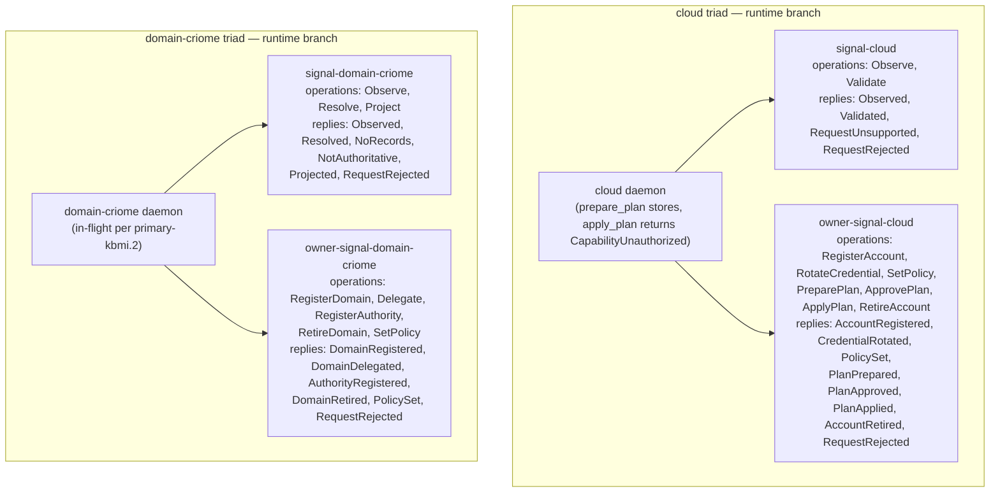
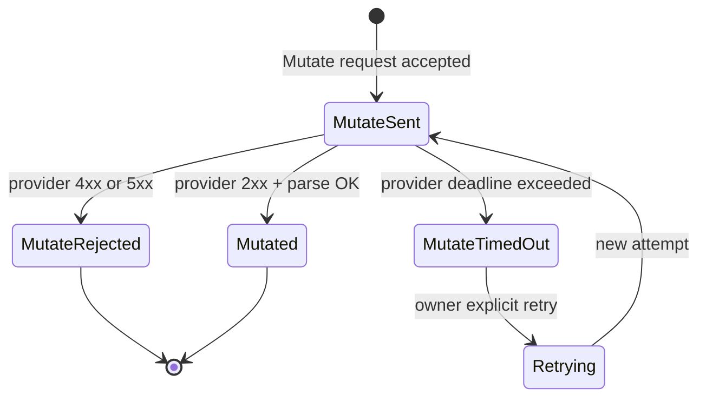
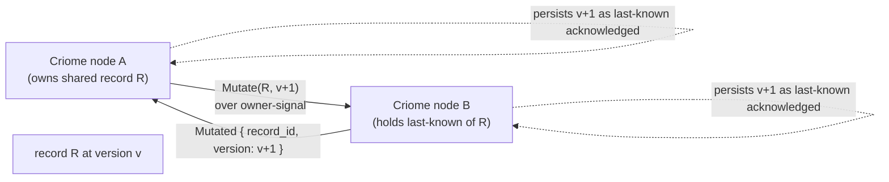
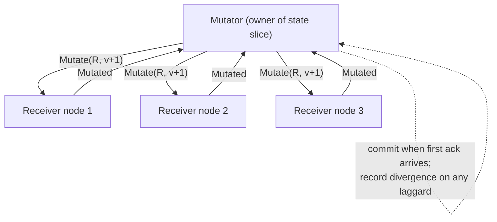
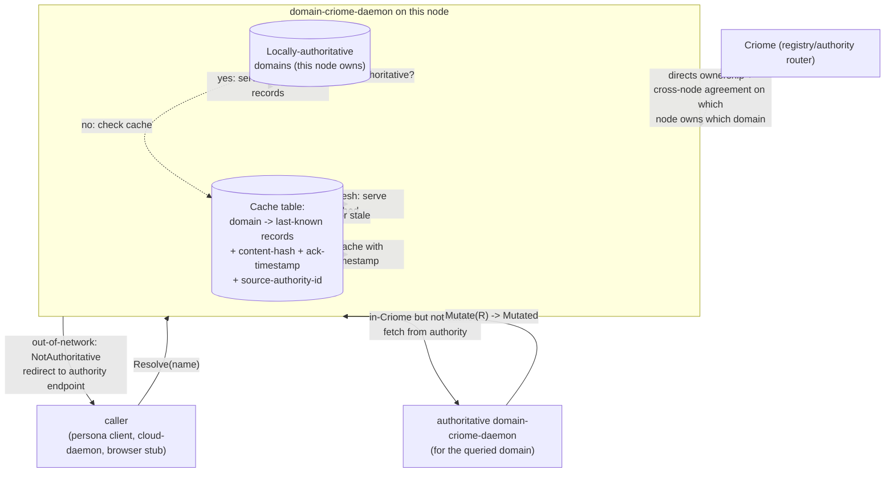
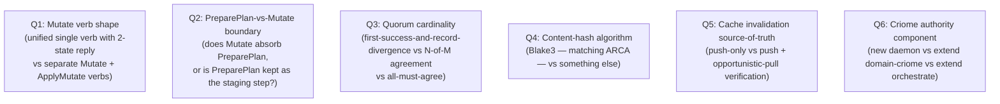
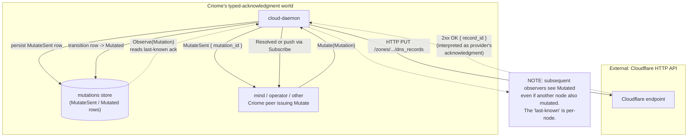
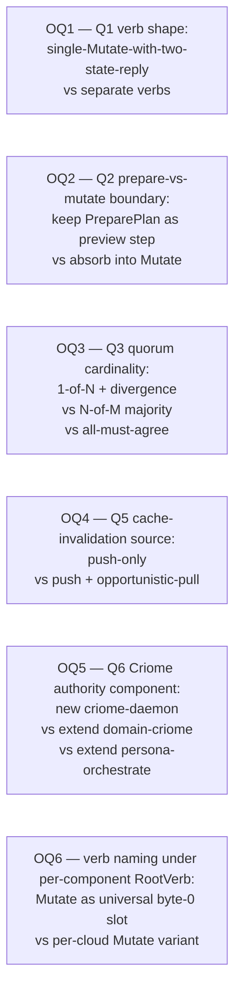

# 25/2 — Cloud Mutate rename + quorum-of-agreement + multi-zone caching

*Kind: Design · Topic: cloud-mutate-quorum-multi-zone · 2026-05-24*

*Slice 2 of `reports/third-designer/25-most-important-questions-
2026-05-24/`. Frame: `0-frame-and-method.md`. Companion slices:
`1-signal-channel-macro-deepens.md`, `3-deploy-cutover-audit-shape.md`,
`4-overview.md` (orchestrator synthesis). This slice answers
Question 2 — how spirit records 338, 339, 340 land in the cloud
+ domain-criome triads given the runtime that exists today on the
`cloud-domain-criome-runtime` branch.*

## §1 The three records in one paragraph

Spirit record 338 (Maximum certainty, 2026-05-23) renames cloud's
**Plan** operation to **Mutate**; the daemon enters a two-state
lifecycle — **Mutate-sent** (request issued to the provider, not yet
acknowledged) is pending, **Mutated** is provider-acknowledged. The
daemon's stored "state" is the last-known-acknowledgment, not a
live-queried truth. Record 339 (Maximum certainty) generalises this:
**component state across the Criome stack is last-known-
acknowledgment, never live-query**; Criome components form a
**quorum-of-agreement** by acknowledging every change as it happens.
External non-Criome providers (today's cloud APIs) break the pattern
— until they speak the protocol, our local copy of their state is
just the last reply we got from them. Record 340 (Maximum certainty)
applies the same lens to domain-criome: a daemon **may resolve
domains it does not own** by caching last-known records (content-
addressed, timestamped, agreed across Criome nodes); each daemon can
host multiple domains; a higher Criome authority decides which nodes
own which domain; and the existing `NotAuthoritative(Delegation)`
redirect remains the fallback for off-network domains where caching
has nothing. Read together: **acknowledgment is the substrate**, the
local cache is just where past acknowledgments live, and the
provider-API call is the (today, lossy) bridge between Criome's
acknowledgment world and the outside world.

## §2 Current code state on the runtime branch

The `cloud-domain-criome-runtime` branch (origin) is where the
deployed work lives; `main` on each repo is still at the birth
commit. Reading the runtime branch:



What this confirms against the bead trail (`primary-kbmi.4` closed,
`primary-kbmi.2.1` closed):

- **Plan moved to owner** (spirit 311 + 325): ordinary's `Plan(PlanRequest)`
  is gone; only `Observe(Observation::Plan(PlanQuery))` reads stored
  plans. Owner has `PreparePlan(PlanPreparation)` returning
  `PlanPrepared(Plan)`. Approval and Apply are owner-only.
- **NotAuthoritative redirect landed** (spirit 312 + 344): ordinary
  domain-criome has `Reply::NotAuthoritative(AuthorityDelegation)`
  where `AuthorityDelegation { domain, endpoint: AuthorityEndpoint }`.
  Owner has `RegisterAuthority(AuthorityRegistration)` to install
  off-daemon authority pointers.
- **Typed NoRecords landed** (spirit 345): `Reply::NoRecords(NoRecords)`
  distinguishes registered-but-empty from off-daemon-redirect.
- **Owner two-stage commit pattern**: `PreparePlan` builds the plan
  record and persists it; `ApprovePlan` marks it ready; `ApplyPlan`
  would hit the provider (today returns `CapabilityUnauthorized` as
  the unimplemented stub). The Plan store is `Mutex<Vec<Plan>>`;
  approved plans live in a parallel `Mutex<Vec<PlanIdentifier>>`.

The daemon does NOT yet model the two-state acknowledgment shape
record 338 describes. Today's state transitions are implicit:
`prepare_plan` writes to the plans vec and immediately returns
`PlanPrepared`; there is no "preparation-in-flight" intermediate.
The provider API call (when `apply_plan` actually contacts
Cloudflare) is the call that will need the two-state shape — and
nothing on the wire today exposes the intermediate state.

## §3 Record 338: Plan → Mutate with two-state acknowledgment

Record 338 reads: *Plan renames to Mutate; reply for the acknowledged
state is Mutated; the daemon transitions between Mutate-sent (request
issued, not yet acknowledged) and Mutated (provider-acknowledged).*

There is a naming subtlety. The current contract has **PreparePlan
(stage)** and **ApplyPlan (execute)** as two separate owner verbs.
Record 338 talks about "Plan → Mutate." Reading 338 literally:

- *"Cloud's Plan operation renames to Mutate"* — this names the
  STAGE-and-EXECUTE pair collectively, OR it names `PreparePlan` as
  the operation being renamed. The wording is ambiguous between
  these two readings.
- *"reply for the acknowledged state is Mutated"* — `Mutated` is the
  reply name when the change is provider-acknowledged. This argues
  for **the rename being a unification**: Mutate is the verb;
  `MutateSent` and `Mutated` are the two reply states of the same
  verb, not two separate verbs.

The interpretation that fits 339's "natural acknowledgment" framing
is **unification**. A single `Mutate(Mutation)` owner-verb whose
reply shape carries both acknowledgment states:

```mermaid
sequenceDiagram
    participant Client as owner-side client (mind, operator CLI)
    participant Daemon as cloud-daemon
    participant Store as cloud Store (plans, acknowledgments)
    participant Provider as Cloudflare HTTP API

    Client->>Daemon: Mutate(Mutation { desired_state })
    Daemon->>Store: persist MutateSent record (pending acknowledgment)
    Daemon-->>Client: MutateSent { mutation_id }
    Note over Daemon,Provider: async — provider call happens off the<br/>request thread; client already has MutateSent
    Daemon->>Provider: HTTP PUT /zones/.../dns_records
    Provider-->>Daemon: 200 OK { record_id, ... }
    Daemon->>Store: transition record MutateSent -> Mutated
    Note over Daemon: Mutated reply available via Observe<br/>(Observation::Mutation(MutationQuery))<br/>or push via Subscribe
```

Three load-bearing observations:

**Mutate-sent is a daemon-side durable record, not a wire-only
transient.** If the daemon crashes between `MutateSent` and the
provider's reply, the record survives. On restart the daemon reads
all `MutateSent` rows, asks the provider for current state on each
(an `Observe`-shaped reconciliation), and either transitions the
record to `Mutated` (if the provider applied) or marks it failed (if
the provider rejected). This is the **acknowledgment-not-belief**
discipline at storage layer.

**The reply that "comes back from the provider" doesn't come back on
the same exchange.** The exchange that issued `Mutate` returns
`MutateSent { mutation_id }` quickly — the daemon doesn't block on
Cloudflare's HTTP roundtrip. Subsequent observers (the issuing
client, or any other Criome peer subscribing to mutation events)
learn about `Mutated` via `Observe(Mutation(MutationQuery))` or
`Subscribe`. This is push-not-pull (per `skills/push-not-pull.md`)
applied to the mutation lifecycle: the original caller subscribes
to its own mutation if it wants the eventual acknowledgment.

**"What if acknowledgment never comes?"** Three sub-states matter:



The terminal states are `Mutated` (success), `MutateRejected`
(provider said no — the desired-state diff stays uncommitted),
`MutateTimedOut` (no response within the bound — the desired-state
diff is unknown). `Retrying` is a daemon-internal transition triggered
by an owner-issued `Retry(MutationIdentifier)` verb; on retry the
record goes back to `MutateSent`. Crucially, `MutateTimedOut` is NOT
the same as `MutateRejected` — the provider may have applied the
change but the network ate the reply. The two have different
reconciliation paths.

The today's `Plan` + `Approve` + `Apply` three-step shape can be
read as a **subset** of this. `PreparePlan` produces a plan record
without touching the provider; `ApprovePlan` ratifies the plan;
`ApplyPlan` becomes `Mutate` and enters `MutateSent`. The Prepare
+ Approve steps remain a useful preview-and-confirm pair — but
they're not the acknowledgment lifecycle, just preparation in front
of it.

## §4 Record 339: quorum-of-agreement as Criome root pattern

Record 339 reads: *Component state across the Criome stack is last-
known-acknowledgment, not live-query. Components with a relationship
of state constantly agree via natural acknowledgment, forming a
quorum-of-agreement.*

What is "natural acknowledgment" architecturally? Two pieces:



**The Mutate-reply pair IS the acknowledgment.** Every record-changing
operation across Criome is a `Mutate`-class verb. The receiver's
typed reply (`Mutated`) is the acknowledgment; the issuer's transition
to "now-mutated" is the local commit. Both sides now hold the same
last-known acknowledgment of record R. The mechanism is **identical
to the component-triad's authority-chain pattern** (per
`skills/component-triad.md` §"Authority chain — worked example"):
mutate down-tree, observe up-tree, ack confirms. Record 339 says
that this is not just an authority pattern — it is **the workspace's
universal state-replication protocol**.

The quorum is not Paxos or Raft. It's not N-of-M consensus. It's:



The Mutator commits on **first success** (per `skills/component-triad.md`
§"Partial-failure semantics — commit-first-success-and-record-
divergence"). Laggards or rejecters land in a divergence row that
later reconciliation heals. The "quorum" is the eventual state in
which every node holds the same last-known acknowledgment for every
record they share — the system **agrees by construction** because
every change carries an acknowledgment trail.

Three pieces of this are already shaped in the workspace:

- **Acknowledgment over the typed wire**: `signal-frame`'s
  `Reply<T>` shape; the per-operation `MutateSent / Mutated` pair
  here.
- **Last-known-state as the daemon's storage truth**: ARCA's
  content-addressed records (each is hash-identified); cloud's plan
  store and accounts store; persona's redb tables.
- **First-success commit + divergence**: documented in
  `skills/component-triad.md`; will be exercised by the cross-leg
  Mutate chain mind → orchestrate → router → harness.

What's NEW in record 339 is **naming the pattern as universal**: it's
not just the authority chain — every Criome-to-Criome state
relationship works this way. The implication is that the
`MutateSent / Mutated` lifecycle from §3 is not a cloud-specific
shape; it's the shape every component-pair uses to share state.

The **external-provider exception** is explicit in 339: *"External
non-Criome systems (current cloud providers) break this; until they
speak the protocol, the local state is the last acknowledgment we
received from them."* This is the key implementation lever for §3:
the cloud daemon's `MutateSent` is the daemon saying "I asked the
provider; until they reply, this is what I know." It's not pending
forever — it's pending until **the provider's HTTP 2xx is interpreted
as their acknowledgment** (or the timeout converts it to
`MutateTimedOut`). Future Criome-native providers would skip this
gap: they'd reply with a typed `Mutated` directly. Federation means
extending the same acknowledgment shape to non-Criome cooperating
systems.

## §5 Record 340: multi-zone caching with NotAuthoritative fallback

Record 340 reads: *A domain-criome daemon can resolve domains it does
not own by caching last-known records (content-addressed,
timestamped, agreed across Criome nodes). Each daemon may host more
than one domain. The Criome daemon decides which nodes own which
domain. NotAuthoritative(Delegation) redirect is the fallback for
genuinely-off-network domains where caching has nothing.*



Three load-bearing pieces:

**Three-tier resolution.** Every `Resolve(name)` walks three layers:

| Layer | What | Reply |
|---|---|---|
| Local authority | This daemon owns the domain | `Resolved(records)` or `NoRecords` |
| Cache | Last-known acknowledgment from authority | `Resolved(records)` annotated cached + timestamp |
| Off-network | Domain is genuinely outside Criome's reach | `NotAuthoritative(AuthorityDelegation)` |

The current code has only Local and the redirect. The **cache layer
is what 340 adds**. Population of the cache is the subtle question.

**How does the cache get populated?** Two mechanisms compose:

```mermaid
sequenceDiagram
    participant Caller
    participant ThisNode as this domain-criome daemon
    participant Authority as authoritative daemon
    participant Cache as local cache table

    Note over Caller,ThisNode: First resolution path — fetch-on-demand
    Caller->>ThisNode: Resolve(goldragon.criome)
    ThisNode->>ThisNode: not locally owned; cache empty
    ThisNode->>Authority: Resolve(goldragon.criome)
    Authority-->>ThisNode: Resolved(records, content_hash, timestamp)
    ThisNode->>Cache: write (domain, records, hash, timestamp, authority_id)
    ThisNode-->>Caller: Resolved(records) annotated cached

    Note over ThisNode,Authority: Ongoing push path — quorum maintenance
    Authority->>ThisNode: Mutate(records, new_version)
    ThisNode->>Cache: update entry; bump timestamp
    ThisNode-->>Authority: Mutated
    Note over ThisNode: Now every subscriber across nodes<br/>holds the same last-known ack
```

The **fetch-on-demand** path is straightforward — a client miss
triggers a daemon-to-daemon fetch. The interesting piece is the
**ongoing-push** path: the authoritative daemon **mutates the
cached copy on every record change**, propagated to every Criome
node that holds the cache. This IS the quorum-of-agreement from
§4 applied to domain records. Subscriptions across nodes are how
the cache stays fresh.

**Content-addressing on records.** Record 340 says "content-
addressed, timestamped, agreed across Criome nodes." The natural
content-address scheme is **Blake3 over the canonical rkyv-encoded
record bytes** — the same shape ARCA uses for its content-addressed
blob storage (per `arca/ARCHITECTURE.md`). Each cached record gets:

| Field | Source | Use |
|---|---|---|
| `domain` | The owning Criome domain name | Cache key |
| `records` | The actual DNS-level records | The data |
| `content_hash` | Blake3 over canonical rkyv-encoded `records` | Identity / dedup |
| `acknowledged_at` | Daemon wall-clock at the moment of receipt | Freshness |
| `source_authority` | The `AuthorityEndpoint` that supplied this version | Re-fetch / re-verify |
| `version_predecessor` | `Option<content_hash>` of the prior version | Mutation lineage |

The hash gives **identity** — two nodes that hold the same `(domain,
content_hash)` pair hold the same content. The timestamp is when THIS
node received the ack, not when the authority minted the change
(those could differ by network delay; only the receiving node's
timestamp drives freshness on this node). The predecessor hash makes
each mutation chain-shaped — auditable, replay-able, and resolvable
when divergent updates race.

**Cache invalidation.** The cache is push-invalidated (per
`skills/push-not-pull.md`). The authoritative daemon pushes
`Mutate(records, v+1)` to every subscribed node; nodes receive the
push, update the cache, ack back. **There is no TTL** — staleness
is bounded by "did we receive every Mutate?" not by "has T expired?"
A node that misses a push (network partition) sits with a stale
entry until the partition heals; on heal, the authority pushes a
catch-up Mutate. Subscribers who care about provable-freshness can
request an explicit `Observe` round-trip before committing to use
the cached value.

**The "Criome daemon decides which nodes own which domain"
mechanic.** Record 340 names a higher-level Criome authority that
**arbitrates ownership**: which physical node hosts which domain.
Today's design has NO such component. The `domain-criome` daemon
treats `.criome` as a TLD whose delegations it manages (per spirit
312); but it doesn't decide *which node hosts the goldragon.criome
authority daemon* — that's a higher layer the workspace hasn't
spec'd. This is a **load-bearing design tension** to surface for
psyche.

Candidates for what "Criome" means here:

| Candidate | Description |
|---|---|
| `criome-daemon` (new component) | A meta-orchestrator that tracks every Criome node and assigns domain authority slots; routes new domain registrations to the right node |
| `domain-criome` extended | The existing TLD daemon gains a node-registry + assignment surface; the TLD's authority IS the assignment authority |
| `persona-orchestrate` extended | The existing orchestration daemon handles cross-node domain placement as part of its lane-and-spawn discipline |
| Out-of-band | Manual config; Criome federation grows organically as nodes opt in |

The candidates differ on **who has authority to say "node N owns
domain D"**. Record 340 doesn't pick. This is the cleanest "open
question for psyche" in this slice.

## §6 Open contradictions to resolve before coding

Reading 338 + 339 + 340 together against the current code, six
specific things are underspecified or contradictory:



**Q1 — Mutate verb shape.** Three readings of record 338 produce
three different contract shapes:

- *Single verb, two-state reply.* `Mutate(Mutation)` →
  `MutateSent { mutation_id }` immediately, then `Mutated { ... }`
  later via Observe/Subscribe. Cleanest from a verb-economy
  perspective; pushes complexity into the reply shape.
- *Single verb, multiplex on the exchange.* `Mutate(Mutation)`
  returns `Mutated` only when provider-acknowledged; the daemon
  holds the exchange open until then. Painful (exchanges aren't
  long-lived in the current framing).
- *Two verbs, like today.* Keep `PreparePlan` + `ApplyPlan`;
  rename to `PrepareMutation` + `Mutate` (or similar). Closest to
  today's code; loses the "Mutate-sent / Mutated" symmetry.

Designer lean: **single verb, two-state reply**. It matches 339's
acknowledgment framing exactly. Owner sends `Mutate`; immediate
reply confirms *receipt* (`MutateSent`); eventual reply via
Subscribe confirms *acknowledgment* (`Mutated`).

**Q2 — PreparePlan vs Mutate.** Today's three-step shape
(`PreparePlan` → `ApprovePlan` → `ApplyPlan`) does useful work the
two-state lifecycle doesn't capture: it lets the owner **see a
plan before it executes**. Does record 338 retire that, or does
preparation stay as a preview-step in front of Mutate?

Designer lean: **keep preparation; rename the execute step**. The
operations evolve to `PreparePlan(PlanPreparation)` → `Mutate
(Mutation)` where `Mutation` references the prepared plan by
`PlanIdentifier`. `Mutate` enters the two-state lifecycle; `Prepare`
is a pure-read planning step that doesn't acknowledge anything to
the provider.

**Q3 — Quorum cardinality.** Record 339 says "quorum-of-agreement"
without specifying cardinality. Per `skills/component-triad.md`,
the workspace pattern is "commit-first-success-and-record-
divergence." If quorum follows that pattern: it's effectively
**1-of-N** with divergence reconciliation — the issuer commits as
soon as any node acks. If quorum means N-of-M (majority): the
issuer waits for `M/2 + 1` acks; this is Raft-shaped. If quorum
means all-must-agree: the issuer waits for every receiver; brittle.

Designer lean: **1-of-N with divergence**. It matches the existing
workspace pattern. Record 339's language ("constantly agree via
natural acknowledgment") fits this — the agreement happens **by
ongoing ack propagation**, not by counting acks at commit time.

**Q4 — Content-hash algorithm.** Record 340 says "content-addressed"
without picking an algorithm. ARCA uses Blake3 over canonical
rkyv-encoded bytes. The natural answer is **same as ARCA** for
consistency across the workspace. Designer lean: **Blake3, same as
ARCA**, with the canonical encoding being rkyv (the same encoding
the wire uses).

**Q5 — Cache invalidation source-of-truth.** Record 340 implies
push-driven invalidation ("agreed across Criome nodes"). But edge
cases: what if a node was offline when a Mutate happened? On
reconnect, does it actively poll the authority for the latest
known hash, or does the authority push catch-up Mutates after it
notices the laggard's subscription resume?

Designer lean: **subscriber-driven catch-up**. On subscription
resume after a gap, the subscriber sends `Resume(domain,
last_known_hash)`; the authority replies with every Mutate since.
This matches the "commit-deltas (push, not poll)" discipline (per
`skills/push-not-pull.md`) extended to gap-recovery.

**Q6 — Criome authority component.** This is the unique
non-derivable question. Record 340 names a "Criome daemon" that
decides ownership without saying what it is. Candidates in §5; no
designer lean — this is psyche's call. (My intuition is that
extending `domain-criome` is cheapest, but I'd want psyche to
confirm whether the .criome TLD authority IS the workspace's
node-assignment authority, or whether those are two different
roles.)

## §7 The operator slice plan

The work splits into eight beads spanning the cloud and domain-criome
triads, sequenced so the contract changes land before the runtime
adopts them. Beads use the workspace `primary-*` naming convention.

```mermaid
flowchart TB
    subgraph PhaseA [Phase A — contract shape]
        bA1["bA1: signal-cloud + owner-signal-cloud<br/>rename ApplyPlan -> Mutate;<br/>introduce MutateSent / Mutated reply pair;<br/>add MutationIdentifier type"]
        bA2["bA2: signal-cloud<br/>add Observation::Mutation(MutationQuery) variant<br/>for reading last-known acknowledgment state"]
        bA3["bA3: owner-signal-cloud<br/>add Retry(MutationIdentifier) operation<br/>for handling timeouts"]
    end

    subgraph PhaseB [Phase B — runtime + storage]
        bB1["bB1: cloud<br/>add mutations store: persistent Vec<MutationRecord><br/>with state field (MutateSent / Mutated /<br/>MutateRejected / MutateTimedOut)"]
        bB2["bB2: cloud<br/>route ApplyPlan through async provider call;<br/>transition records via store updates"]
        bB3["bB3: cloud<br/>add Subscribe path for Observation::Mutation<br/>so issuer can await acknowledgment via push"]
    end

    subgraph PhaseC [Phase C — domain-criome cache layer]
        bC1["bC1: signal-domain-criome<br/>add cached-record type:<br/>CachedRecord { domain, records, content_hash,<br/>acknowledged_at, source_authority, predecessor }"]
        bC2["bC2: domain-criome<br/>add Cache table with content-hash lookup;<br/>fetch-on-miss from AuthorityEndpoint;<br/>persist last-known acknowledgments"]
        bC3["bC3: signal-domain-criome + owner-signal-domain-criome<br/>add Subscribe(domain) for push-invalidation;<br/>add Resume(domain, last_hash) for catch-up after gap"]
    end

    subgraph PhaseD [Phase D — Criome authority]
        bD1["bD1: psyche decision on which component owns<br/>node-to-domain assignment authority<br/>(open Q6 above)"]
        bD2["bD2: implement the chosen component's surface<br/>(blocked on bD1)"]
    end

    PhaseA --> PhaseB
    PhaseB --> PhaseC
    PhaseC --> PhaseD
```



Bead sizing estimates:

| Bead | Size estimate | Blocker |
|---|---|---|
| bA1 — Mutate verb + reply pair | Medium (renames + new types; tests follow) | Q1 resolved |
| bA2 — Observation::Mutation | Small (one variant + reply branch) | bA1 |
| bA3 — Retry operation | Small (one operation + rejection enum entry) | bA1 |
| bB1 — mutations store | Medium (storage shape + persistence) | bA1 + bA2 |
| bB2 — async provider routing | Large (provider HTTP client; per-provider actor; timeout discipline) | bB1; arguably blocked on first Cloudflare-API-client work as a separate epic |
| bB3 — Subscribe for mutation acks | Medium (push surface; subscription token discipline) | bB1 + signal-frame's Subscribe primitive |
| bC1 — CachedRecord type | Small (one record + content-hash field) | Q4 resolved |
| bC2 — Cache table + fetch-on-miss | Medium (storage; fetch path; daemon-to-daemon client) | bC1 + Resolve already going through `NotAuthoritative` path |
| bC3 — Subscribe + Resume for cache | Medium (push surface; gap-recovery protocol) | bC1 + bC2 + signal-frame's Subscribe |
| bD1 — psyche-decision on Criome authority | — (decision, not implementation) | Q6 resolved |
| bD2 — implement chosen authority surface | Variable (depends on Q6 answer) | bD1 |

**Suggested sequencing**: Phase A first (contracts are cheap to
move and unblock everything else); Phase B can run in parallel
with the first Cloudflare-API-client epic; Phase C waits for the
domain-criome runtime to finish first-pass (the existing
`primary-kbmi.2` is the gate); Phase D waits on psyche's Q6
decision.

**What this doesn't touch**: today's `PreparePlan` and `ApprovePlan`
verbs survive Phase A. They become the "preview" step in front of
`Mutate`; the rename only affects the execute step.

## §8 Provider-acknowledgment semantics

Record 339's explicit external-provider exception: *"External
non-Criome systems (current cloud providers) break this; until they
speak the protocol, the local state is the last acknowledgment we
received from them."*

This determines how the cloud daemon models provider state today:



Three pieces of this matter:

**The provider's 2xx is interpreted as their acknowledgment.** The
HTTP semantics map onto Criome's acknowledgment shape: a 2xx
means "we accepted and applied"; the daemon treats this as the
`Mutated` transition. A 4xx means "we refused" → `MutateRejected`.
A 5xx or network timeout means "we don't know" → `MutateTimedOut`.
This is the **bridge layer** between Criome's typed-ack world and
the legacy provider world.

**"Last-known" means per-node, not global.** Record 338's
parenthetical — *"the 'state' the daemon holds is last-known-
acknowledgment, not necessarily what the provider would report if
queried right now (other nodes may have changed it)"* — applies
to any state the daemon caches. Two Criome nodes both managing the
same Cloudflare zone can race; both think they hold the last-known
state. The reconciliation lives in:

```mermaid
sequenceDiagram
    participant N1 as node 1 (cloud-daemon)
    participant N2 as node 2 (cloud-daemon)
    participant CF as Cloudflare
    participant Criome as Criome quorum

    N1->>CF: PUT record (set IP to 1.2.3.4)
    CF-->>N1: 200 OK
    N1->>Criome: Mutate broadcast (record now 1.2.3.4)
    N2->>CF: PUT record (set IP to 5.6.7.8)
    CF-->>N2: 200 OK
    N2->>Criome: Mutate broadcast (record now 5.6.7.8)
    Note over Criome: Two Mutates race; whichever<br/>commits-first becomes the new<br/>last-known across the quorum.<br/>The other becomes divergence.
```

The divergence row is a typed record of "node N tried to set X but
node M also set it; their values differ." Reconciliation is later
work — could be automatic (most-recent-wins by ack timestamp) or
manual (surface as alert; psyche-decide).

**Future federation**: record 339 says *"Future federation will
enable cross-stack last-known-state status with non-Criome
providers."* That's the long-horizon endpoint — a future Criome-
to-AWS or Criome-to-Cloudflare protocol bridge replaces the
HTTP-2xx-as-acknowledgment layer with native typed acks. The
contract shape (`MutateSent / Mutated / MutateRejected /
MutateTimedOut`) is **stable across that migration**: future
federation just replaces the bridge layer, not the wire shape.

## §9 Open questions for psyche

Six places this slice surfaces that genuinely need psyche-decision
before the operator slice can sequence:



Each is restated with the substance the psyche needs to decide:

**OQ1 — Mutate verb shape.** Record 338 reads as a rename of one
operation but talks about two reply states. Does the wire have:
(a) one `Mutate(Mutation)` verb whose typed reply is
`MutateSent | Mutated | MutateRejected | MutateTimedOut`? Or
(b) two verbs, `IssueMutation` + `AcknowledgeMutation`, where the
second is daemon-emitted? (a) is my lean. Designer needs psyche to
confirm before contract changes land.

**OQ2 — Prepare-vs-Mutate boundary.** Today's `PreparePlan` →
`ApprovePlan` → `ApplyPlan` does work record 338 doesn't capture
(preview, confirm). Does record 338's rename also retire the
preview-confirm steps, OR does Mutate just replace ApplyPlan?

**OQ3 — Quorum cardinality.** Record 339 says quorum-of-agreement
without specifying. 1-of-N + divergence reconciliation matches the
existing workspace pattern. N-of-M majority would be a new
protocol. All-must-agree would brittle the system under partition.
Designer lean: 1-of-N + divergence. Needs explicit confirmation.

**OQ4 — Cache invalidation source.** Record 340 says "agreed
across Criome nodes" without specifying whether nodes can also
opportunistically pull. Pure push is simpler; push + pull is more
robust under partition. Designer lean: push-only with explicit
Resume-after-gap for catch-up. Needs psyche affirmation.

**OQ5 — Criome authority component.** Record 340 names a "Criome
daemon" that arbitrates ownership without saying what it is. This
is the single biggest design open in this slice. Candidates:
(a) new `criome-daemon` component, (b) extend `domain-criome`'s
TLD authority to also handle node assignment, (c) extend
`persona-orchestrate` (since it already handles cross-node lane
assignment). No designer lean — psyche's call.

**OQ6 — Verb naming under per-component RootVerb.** Per spirit
326, the 64-bit signal root-verb namespace is per-component, not
workspace-wide. Does "Mutate" become a workspace-universal byte-0
slot (every component's owner contract gets a `Mutate` verb at the
same slot)? Or does each component pick its own slot for its
mutation verb (cloud's `Mutate` is at byte 0x0F, persona-mind's
`Mutate` is at byte 0x03, etc.)? Record 339 hints at the former
(quorum is universal pattern); record 326 hints at the latter
(verb namespace is per-component). Designer lean: **the SEMANTICS
are universal (Mutate-sent / Mutated lifecycle), but the byte-0
slot is per-component**. Macro-layer convergence (slice 1 of this
session) is the right place to express this.

## §10 See also

Within this meta-report directory:

- `0-frame-and-method.md` — the session frame; explains why
  this slice exists, the parallel slices, the synthesis schedule.
- `1-signal-channel-macro-deepens.md` — the macro design slice;
  resolves OQ6 above (per-component RootVerb).
- `4-overview.md` — orchestrator synthesis (highest-numbered file
  in this directory).

Upstream design substance carried forward into this slice:

- `reports/third-designer/23-architecture-update-2026-05-23/0-orchestrator-synthesis.md`
  — the audit that surfaced R1+R2 violations; this slice extends
  R1 (Mutate now lives on owner) into the two-state acknowledgment
  shape.
- `reports/third-designer/23-architecture-update-2026-05-23/5-audit-of-operator-runtime-slices.md`
  — the per-repo audit table; the §2 code-state diagram here is
  the updated picture after `primary-kbmi.4` and `primary-kbmi.2.1`
  closed.
- `reports/designer/306-manifestation-sweep-round-2-2026-05-23.md`
  — manifested intents 311+325 into cloud ARCH; this slice extends
  with 338+339+340.
- `reports/system-specialist/160-cloud-domain-criome-birth-design.md`
  — the system-specialist's first-runtime narrative the audit
  measured against; this slice is the design-side follow-up after
  primary-kbmi.4 + .2.1 closed.

Spirit records load-bearing for this slice:

- **311** — Cloud Mutate/Query channel split.
- **312** — Content-addressable per-domain authority.
- **325** — Cloud plan preparation belongs on the owner signal
  surface (already manifested).
- **326** — Per-component RootVerb namespace (informs OQ6).
- **338** — Cloud's Plan operation renames to Mutate; two-state
  acknowledgment lifecycle.
- **339** — Quorum-of-agreement as Criome root pattern.
- **340** — Domain-criome multi-zone caching with NotAuthoritative
  fallback.
- **341** — Cloud capability cfg-gating deferred (informs the
  unblock for the Cloudflare API client epic).
- **342** — Build-time opt-in for providers; capability observation
  distinguishes built-but-unconfigured.
- **343-352** — domain-criome runtime constraints from in-flight
  primary-kbmi.2.1 work.

Live code state (as of 2026-05-24):

- Branch `cloud-domain-criome-runtime` on `cloud`, `signal-cloud`,
  `owner-signal-cloud`, `domain-criome`, `signal-domain-criome`,
  `owner-signal-domain-criome` is where the runtime + contract
  fixes live. `main` on each repo is still at the birth commit;
  the working branch has not yet merged.
- Beads `primary-kbmi.4` (PreparePlan move to owner) and
  `primary-kbmi.2.1` (NotAuthoritative + RegisterAuthority +
  NoRecords) are CLOSED. Parent `primary-kbmi` is OPEN; sub-beads
  `primary-kbmi.1` (cloud daemon runtime) and `primary-kbmi.2`
  (domain-criome daemon runtime) are OPEN — these are the gates
  for the cache-layer Phase C above.

Workspace discipline cited:

- `skills/component-triad.md` §"Authority chain — worked example"
  and §"Partial-failure semantics" — the patterns this slice
  extends.
- `skills/push-not-pull.md` — applied to mutation acknowledgment
  and cache invalidation.
- `skills/nota-design.md` — positional records (the new
  `MutationRecord` / `CachedRecord` types will follow this).
- `arca/ARCHITECTURE.md` §"Content-addressed records" — the
  Blake3-over-rkyv content-hashing convention this slice
  borrows for the cache.
