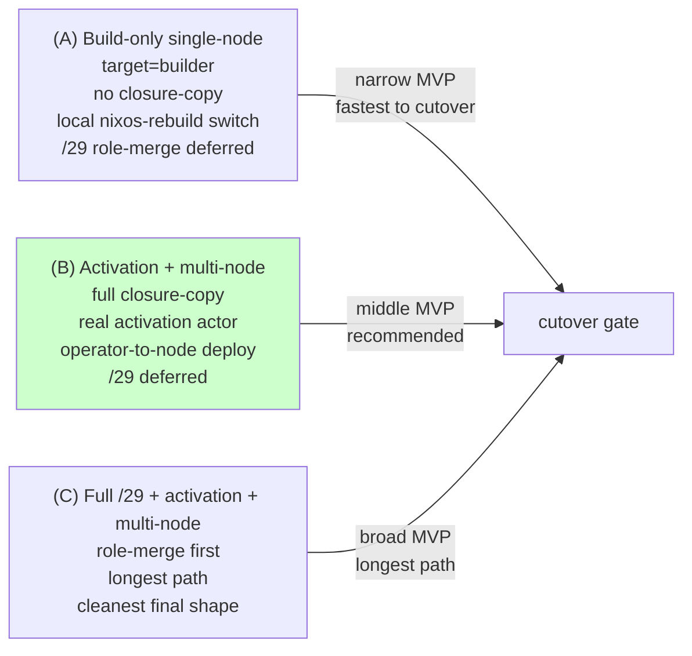
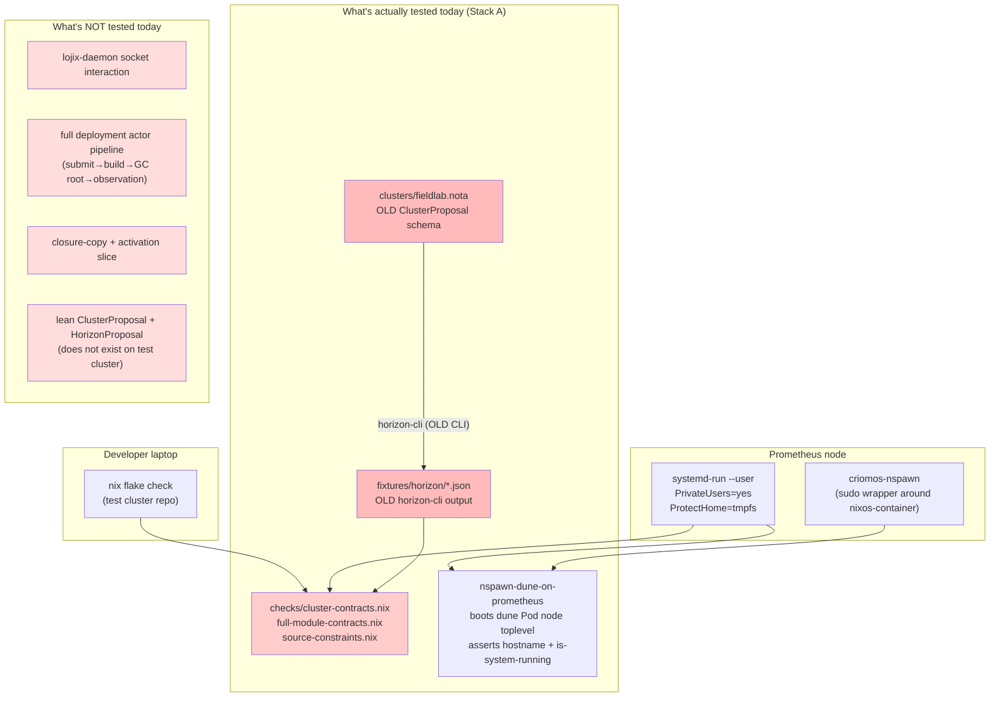
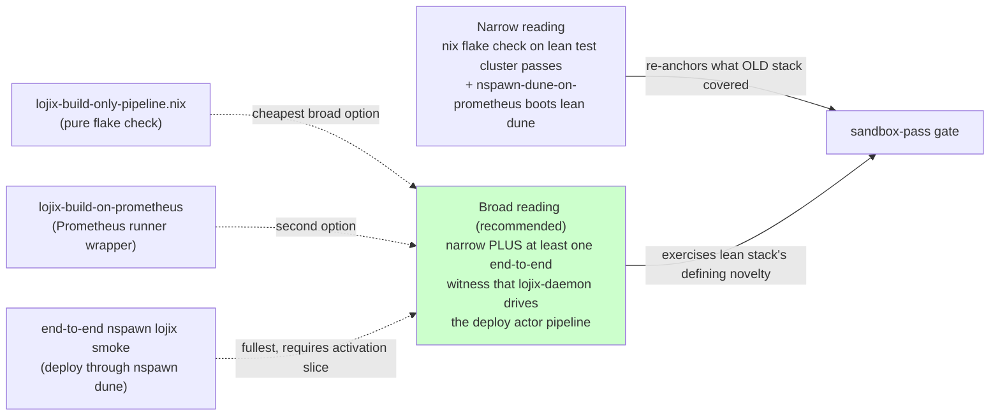
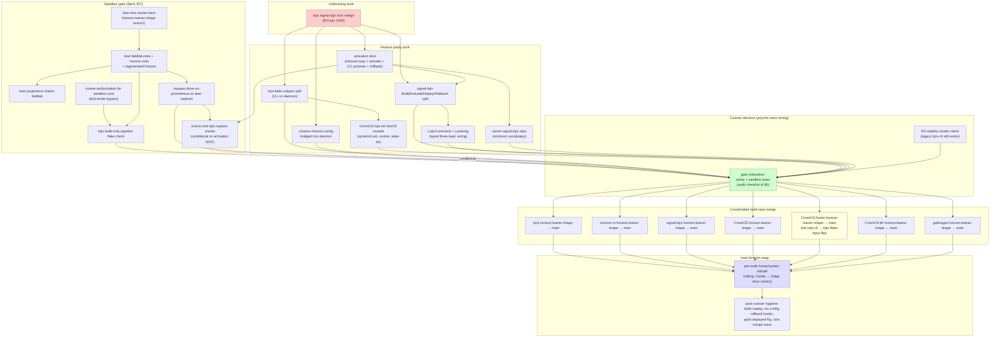
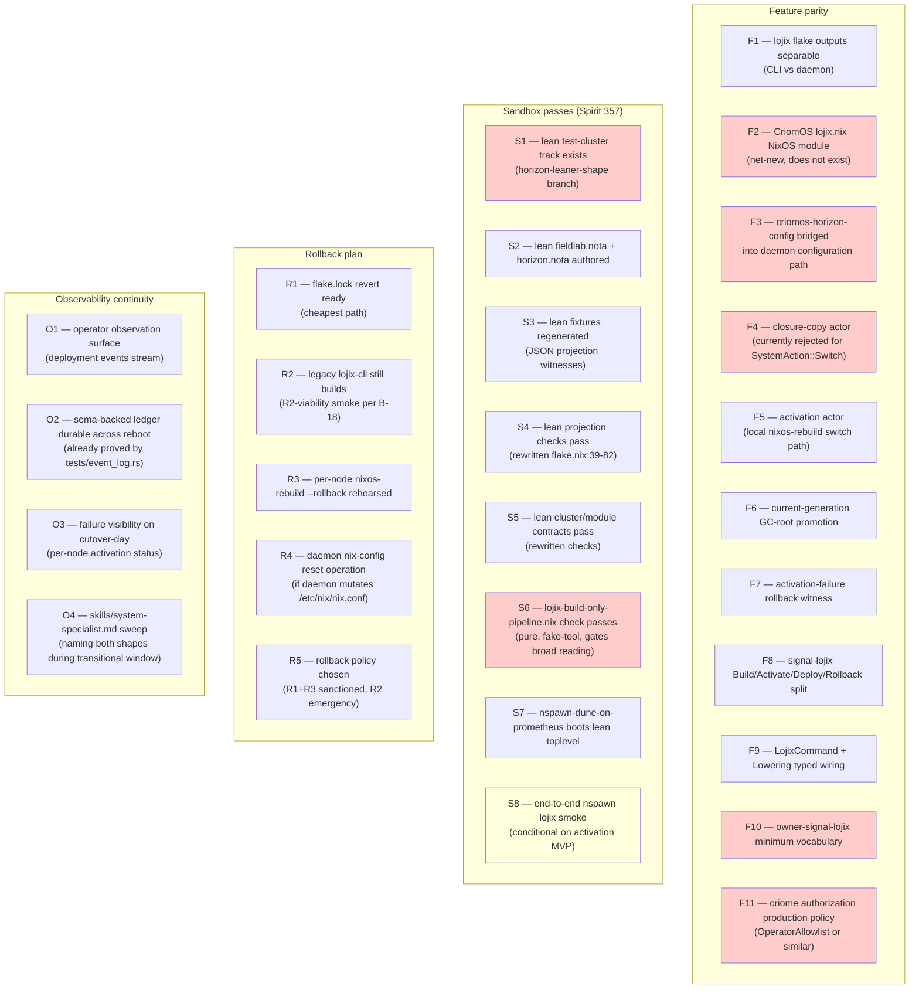
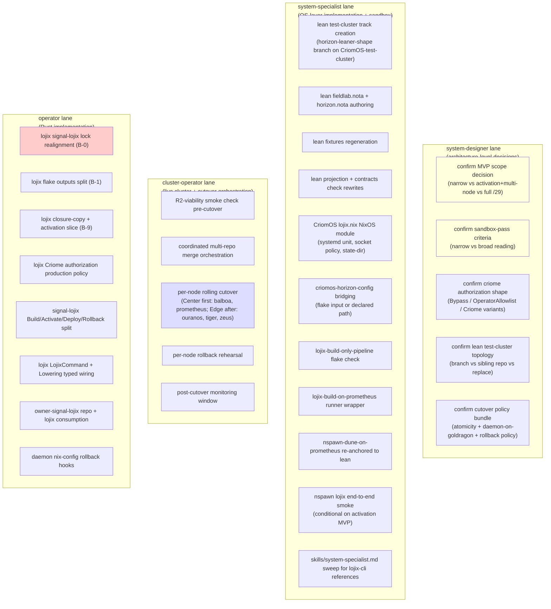
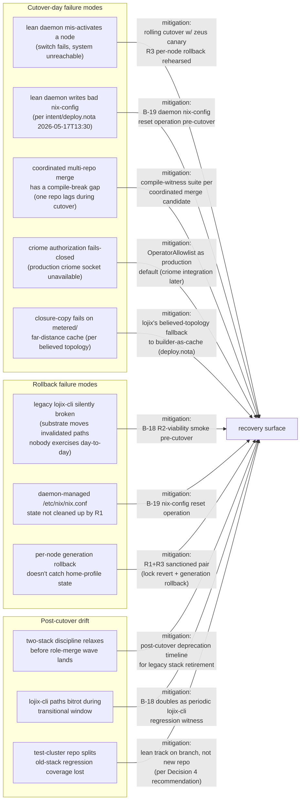

# 25/3 — Deploy cutover audit shape

*Kind: Designer research fragment · Lane: third-designer
(parallel-main designer, Structural authority) · 2026-05-24*

## §1 The three records in one paragraph

Spirit record 356 (Maximum certainty, 2026-05-23) commits the
workspace to a destination: *the lean lojix/horizon stack becomes
the main deployment after MVP*. The current two-stack coexistence
discipline (production today on legacy `lojix-cli`, lean rewrite
on `horizon-leaner-shape` worktrees) is not perpetual — it has a
forward-motion endpoint. Spirit record 357 (Maximum certainty)
constrains how the workspace reaches that endpoint: *passing
sandbox testing is a precondition for the lean-stack cutover to
main deployment*. The cutover is gated, not free. Spirit record
358 (Minimum certainty) names a starting pointer: *Prometheus
node has existing nspawn-based sandbox testing*. The audit
inherits a substrate; it does not invent one. Together the three
records draw a route — from the current parallel stacks, through
an MVP whose definition the audit must surface, through a
sandbox-pass gate whose criteria the audit must define, to a
coordinated multi-repo merge that flips main-branch authority
from the legacy stack to the lean stack.

## §2 The two-stack state today

The workspace currently runs two parallel deploy stacks in
controlled coexistence per `INTENT.md` §"Two deploy stacks
coexist" and `protocols/active-repositories.md` §"Two deploy
stacks coexist — production and the lean rewrite". Both are
alive; both are edited; neither has been merged into the other.

```mermaid
flowchart TB
    subgraph stackA["Stack A: production today<br/>(running on every cluster node)"]
        prodHorizon["horizon-rs main<br/>(commit ae8754d, monolithic NodeProposal)"]
        prodLojixCli["lojix-cli main<br/>(commit 42529ebd, ssh-based remote activation)"]
        prodCriomOS["CriomOS main<br/>(commit 39cca733, behavesAs gating)"]
        prodCriomOSHome["CriomOS-home main<br/>(pins lojix-cli at flake.nix:124)"]
        prodCriomOSLib["CriomOS-lib main<br/>(constants only, no predicates.nix)"]
        prodGoldragon["goldragon main<br/>(cluster proposal data)"]
    end
    subgraph stackB["Stack B: lean rewrite, smoke-built, not yet deployed<br/>(on horizon-leaner-shape worktrees)"]
        leanHorizon["horizon-rs horizon-leaner-shape<br/>(commit 7a3072c, proposal restructure,<br/>role-merge NOT started)"]
        leanLojix["lojix horizon-leaner-shape<br/>(commit 60b93000, daemon socket runtime,<br/>build-only pipeline, sema ledger)"]
        leanSignalLojix["signal-lojix horizon-leaner-shape<br/>(commit ef98dc0a uncommitted,<br/>contract-local verb migration)"]
        leanCriomOS["CriomOS horizon-leaner-shape<br/>(commit 325de8a7, service variant<br/>consumption; no lojix.nix module)"]
        leanCriomOSLib["CriomOS-lib horizon-leaner-shape<br/>(commit 3143a175, no predicates.nix)"]
        newConfig["criomos-horizon-config (new repo)<br/>(commit 08adcf1, no flake consumer)"]
        newLojixRepo["lojix (new repo, daemon + thin CLI)"]
    end
    operator["operator's workstation<br/>(goldragon node, psyche)"]
    prometheus["prometheus cluster node<br/>(nspawn host, sandbox runner)"]
    zeusEdge["zeus cluster node<br/>(edge / smoke-built target)"]
    fiveNodes["all 5 production nodes<br/>(balboa, ouranos, prometheus,<br/>tiger, zeus per goldragon/datom.nota)"]

    operator -- "fixes go here" --> prodLojixCli
    prodLojixCli -- "ssh root@target" --> fiveNodes
    prodCriomOSHome -- "home.packages" --> fiveNodes
    operator -- "rewrite edits go here" --> leanLojix
    leanLojix -. "smoke-built end-to-end" .-> prometheus
    prometheus -. "real-build-smoke (impure)" .-> zeusEdge

    style stackA fill:#dfd
    style stackB fill:#fdf
    style fiveNodes fill:#ddf
```

**What ships today.** Every cluster node runs Stack A.
`CriomOS-home/flake.nix:124-125` pins `lojix-cli`;
`modules/home/profiles/min/default.nix:181` installs the binary
via the min home profile every user inherits. Production
deploys go operator-initiated from `goldragon`: legacy
`lojix-cli` projects `horizon-rs/main` over `goldragon/datom.nota`,
ssh's into the target as root, runs `switch-to-configuration`.
No daemon. No `lojix` repo input. No `criomos-horizon-config`.

**What is smoke-built but not deployed.** Stack B lives in seven
`horizon-leaner-shape` worktrees plus the two new repos `lojix`
and `criomos-horizon-config`. The lean stack reached `zeus`
end-to-end through `prometheus` per
`reports/system-specialist/134` (cited by
`protocols/active-repositories.md:123`); no production node
consumes the lean stack.

**Test-cluster repo lags the cascade.** Per
`reports/cluster-operator/11`, `CriomOS-test-cluster` still
carries `horizon-re-engineering` (the predecessor branch
superseded 2026-05-17), not `horizon-leaner-shape`. The only
repo whose branch name does not match the cascade.

## §3 What "MVP" means in this context

"MVP" in records 356-358 is a deploy-stack MVP, not a
component-launch MVP. The audit reads it as the moment when the
lean stack can demonstrably perform a defined deploy slice
through its own actor pipeline under sandbox conditions — not
when every feature of the legacy stack is matched.

The system-designer/34 audit
(`reports/system-designer/34-mvp-and-sandbox-audit/5-overview.md`
Decision 1) surfaced three readings of MVP scope and recommended
the middle one. The third-designer fragment carries that
recommendation forward and frames it as a question for the
cutover audit shape:

**The operational definition the audit lands on (per
`/34/5` Decision 1 recommendation).** Lean-stack MVP is reached
when the lean daemon can drive the deploy actor pipeline through
**closure-copy + activation** against **at least one non-builder
target node**, with `/29` role-merge deferred to a post-cutover
cleanup arc. The lean daemon's defining novelty (per
`intent/deploy.nota` 2026-05-17T11:00 — "the node deploys
itself") gets exercised before cutover-day; legacy `behavesAs.*`
consumers continue to work because horizon-rs's lean branch
still emits view-side booleans.

**What MVP-ready does NOT mean.** Not feature parity with
`lojix-cli` (lean daemon's MVP likely lands FullOs/Switch first;
OsOnly/HomeOnly/BootOnce post-MVP); not the full `signal-lojix`
Build/Activate/Deploy/Rollback 4-way verb split (ranked as bead
B-14 in `/34/5`); not `LojixCommand` + `Lowering` typed wiring
(B-15); not the `owner-signal-lojix` repo (B-16). The audit's
MVP gate evaluates whether the lean stack is *operationally*
ready, not whether every prior design decision has landed in
code.

## §4 What "sandbox testing" means here (record 357)

Spirit record 358 names Prometheus's nspawn-based sandbox
testing as the audit's starting pointer. Reading the substrate
in code:

**Three sandbox surfaces exist today** (per
`reports/system-designer/34-mvp-and-sandbox-audit/2-sandbox-testing-infrastructure.md`,
verified against the repo at
`/git/github.com/LiGoldragon/CriomOS-test-cluster/`):

**Pure flake checks** at
`/git/github.com/LiGoldragon/CriomOS-test-cluster/flake.nix:39-82`:
`projections-match-fieldlab` (calls legacy `horizon-cli` over
`fieldlab.nota`, cmps fixture JSON), `multiple-tailnet-controllers-rejected`,
`pod-missing-super-node-rejected`, plus `cluster-contracts.nix` /
`full-module-contracts.nix` / `source-constraints.nix` in `checks/`.

**Prometheus runner scripts** at
`/git/github.com/LiGoldragon/CriomOS-test-cluster/scripts/`:
`run-on-prometheus` (push, ssh, `nix flake check` inside
`systemd-run --user PrivateUsers=yes ProtectHome=tmpfs`),
`build-dune-on-prometheus` (same envelope, builds
`.#dune-toplevel`), `nspawn-dune-on-prometheus` (builds
`.#dune-nspawn-toplevel`, invokes deployed `criomos-nspawn`
create/start/shell, asserts hostname + `systemctl
is-system-running --wait`, tears down).

**Nspawn infrastructure** lives in `CriomOS`:
`modules/nixos/nspawn.nix` plus
`checks/nspawn-role-policy/default.nix`. The `criomos-nspawn`
wrapper is itself produced and deployed by Stack A — the
sandbox host's nspawn capability is built and authorized by the
legacy stack.

**The gap between today's test surface and "passing sandbox
testing" as a cutover precondition.** Spirit 357 is the load-
bearing constraint; the audit must define what *passes* the
gate. Two readings, per `/34/5` Decision 2:

**The audit's recommendation (carrying `/34/5` Decision 2
forward).** The broad reading with the **pure flake check
witness** (`lojix-build-only-pipeline.nix`, cheapest of the three
broad paths). If MVP scope lands as "activation + multi-node"
per §3, the gate escalates to **end-to-end nspawn lojix smoke**
before cutover-day. Narrow re-anchors what the OLD test cluster
covered and leaves the lean daemon un-witnessed at sandbox
level — contradicting what Spirit 356 means when it says the
lean stack becomes the main deployment.

## §5 The cutover dependency graph

The cutover is a coordinated multi-repo merge per `INTENT.md`
§"Two deploy stacks coexist": *"Cutover happens as a coordinated
multi-repo merge after the rewrite reaches feature parity"*. The
critical path runs feature-parity-work → sandbox-passes →
cutover-decision → coordinated multi-repo merge → main-branch
swap on `CriomOS-home`.

**The critical path** runs through `merge5` — the
`CriomOS-home` flake-input flip from `lojix-cli` to `lojix`. Two
file edits ratify cutover: `CriomOS-home/flake.nix:124-125`
swaps the input declaration; `modules/home/profiles/min/default.nix:181`
swaps the `home.packages` binary reference. After this commit
propagates through home rebuilds, every cluster node runs the
lean stack.

**The deepest dependency chain** runs *unblock → activation
slice → end-to-end nspawn smoke → gate evaluation*; the broadest
fan-out is the cutover-prerequisites set (six parallel items per
§7). Psyche decisions 1-5 in `/34/5` compress or expand this
graph: narrowing MVP scope shrinks the activation arc;
broadening sandbox criteria adds witnesses.

**Why piecemeal folding is forbidden.** Schemas have diverged.
`horizon-rs` lean branch carries restructured `proposal/`
modules; `signal-lojix` lean branch carries contract-local verbs
that `lojix` consumes; `CriomOS` lean branch consumes service
variants (commit `325de8a7`). Picking up one repo's lean branch
without siblings produces a non-compiling intermediate. The
cutover MUST be coordinated.

## §6 The audit checklist for cutover readiness

Per `/34/5` and the dependency graph in §5, the cutover gate
evaluates four categories of readiness. Each carries concrete
items the audit (today) marks as not-yet-landed, partial, or
landed.

**Legend.** Red = does not yet exist in code. Yellow =
conditional (depends on MVP scope decision). All other items =
designed-but-not-landed or partially-landed.

**The fastest reading** (per `/34/5` recommendations):
F1+F2+F3+F4+F5+F6+F7+F11 are MVP-blocking under the recommended
"activation + multi-node, /29 deferred" scope; F8+F9+F10 are
cutover-prerequisites running in parallel; S1-S6 are the sandbox
track; S7 re-anchors the existing nspawn smoke; S8 escalates if
MVP includes activation; R1+R3+R5 are minimum rollback; R2 is
the emergency lever; R4 conditional on daemon nix-config
mutation choices; O1-O4 ensure operator visibility.

**Minimum cutover-readiness witness.** All red items turn green
(or are explicitly re-classified as deferred per psyche
decision), all yellow items are pursued or deferred, and the
sandbox gate passes under the chosen reading per §4.

## §7 What needs to land before the cutover

The work is owned across three lanes. Per `AGENTS.md` lane
mechanism and the work distribution surfaced in `/34/5`:

**Cross-lane sequencing.** system-designer confirms psyche
decisions 1-5 (sd1-sd5) first — every other item is gated on at
least one. After confirmation, operator unblocks (op1) opens the
lojix branch; once it compiles, ss1-ss4 starts on the test
cluster track and op2 + op3 + op4 advance lojix in parallel with
ss5 + ss6 + ss7. The synchronizing waypoint is ss5 (CriomOS
NixOS module) merging with op2 (lojix flake outputs split).
Cluster-operator orchestrates the actual cutover (co1-co5) per
its authority over live cluster maintenance. Documentation sweep
(ss11) ships cutover-day or shortly after — not lagging more
than a session.

**What this fragment does NOT specify.** The HOW of each item
belongs to the lanes owning them. The audit shape frames WHAT,
ranked by dependency-graph position. Concrete bead-shape for
each item exists in
`reports/system-designer/34-mvp-and-sandbox-audit/5-overview.md`
ranks 0-6 (beads B-0 through B-23).

## §8 Risks and mitigations

The cutover changes the binary every user of the workspace
inherits via the home profile, on every cluster node. Three
classes of risk land here.

**Cutover-failure modes + mitigations.** Mis-activation on a
node — rolling cutover per role with `zeus` as canary; if `zeus`
activates cleanly, Edge nodes are likely safe. Bad nix-config
state — lean daemon controls `/etc/nix/nix.conf` per
`intent/deploy.nota` 2026-05-17T13:30; B-19 (daemon-side
`ResetNixConfig` operation) lands pre-cutover-day and composes
with R1. Compile-break gap during coordinated merge — a
compile-witness suite builds every repo's lean branch against
every sibling's lean tip BEFORE the cutover commits land on
`main`; implicit in the discipline, worth making explicit.
Criome fails-closed — production cutover-day ships
`OperatorAllowlist` as the auth variant per `/34/5` Decision 3;
criome integration lands post-cutover without schema disruption.

**Rollback-failure modes.** Legacy `lojix-cli` silently broken —
B-18 (R2-viability smoke) builds + deploys a sandbox node via
`lojix-cli` within the week of cutover-day to confirm legacy
path operational. Nix-config state survives R1 — B-19 closes
this. Generation rollback misses home state — R3 (system
rollback) reverts the activated toplevel, R1 (lock revert)
reverts the home-profile binary; the pair catches both.

**Post-cutover drift risks** are softer — they don't block
cutover-day but erode the workspace over time. The /29
role-merge wave catches `rpd1`; B-20 (skills sweep) addresses
`rpd2`; Decision 4 (lean track as branch, not sibling repo)
addresses `rpd3`.

## §9 Open questions for psyche

These are decisions the third-designer fragment cannot make
alone — they require psyche input either because they are
policy-shaped (psyche owns the cluster) or because they involve
trade-offs without a single dominant answer.

**Q1 — MVP scope decision (gates everything).** The three
readings from §3: (A) build-only single-node; (B) activation +
multi-node, /29 deferred; (C) full /29 + activation +
multi-node. The audit recommends (B), but this is the load-
bearing psyche decision — every other rank shifts based on the
answer. Already surfaced in `/34/5` Decision 1 awaiting psyche.

**Q2 — Sandbox-pass criteria for Spirit 357.** Narrow (re-anchor
old coverage) vs broad (also exercise lojix-daemon pipeline).
The audit recommends broad-with-pure-check-witness for MVP
scope (B); broad-with-end-to-end-nspawn if MVP includes
activation. Already surfaced in `/34/5` Decision 2 awaiting
psyche.

**Q3 — Criome authorization shape for sandbox + production.**
`OperatorAllowlist` as cutover-day default with criome as
post-cutover variant? Or wait for full criome integration before
cutover? Already surfaced in `/34/5` Decision 3 awaiting psyche.

**Q4 — Lean test-cluster topology.** Branch
(`horizon-leaner-shape` on `CriomOS-test-cluster`) per
`/34/5` Decision 4 recommendation? Sibling new repo? Hard
replace? The branch path matches the cascade; the audit names
the recommendation but the call is psyche's. Note: today the
test cluster still has `horizon-re-engineering` (the predecessor
branch name), per `reports/cluster-operator/11`; the rename
itself is a small operator slice but needs psyche acknowledgment
on the policy.

**Q5 — Cutover-day policy bundle.** Three sub-questions in `/34/5`
Decision 5: atomicity (lockstep vs rolling), daemon-on-goldragon
(per `intent/deploy.nota` 2026-05-17T15:30 says no), rollback
policy (R1+R3 sanctioned, R2 emergency). The audit recommends
rolling-per-role + thin-CLI-on-goldragon + R1+R3 + R2 emergency.
Psyche confirmation needed.

**Q6 — Compile-witness suite for coordinated merge.** Should
the cutover gate include an explicit suite that builds every
repo's lean branch against every sibling's lean branch tips
BEFORE the cutover commits land on `main`? This is an
implicit-but-unstated mitigation in §8. The audit recommends
making it explicit; psyche owns whether it ranks as MVP-
blocking or "should-do".

**Q7 — Post-cutover legacy retirement timeline.** The two-stack
discipline forbids piecemeal folding TODAY. Post-cutover, when
does `lojix-cli` move from "current production stack" to
"retired"? The audit does not propose a date (per AGENTS.md
don't-propose-date rule), but the *policy* — does legacy stay
buildable for some defined window after cutover, or is it
retired immediately? — needs psyche call. Suggested shape: keep
buildable for one stable window (call it post-cutover N
sessions), retire after.

**Q8 — Auditor lane for cutover-gate evaluation?** Per
`AGENTS.md` §"Possible additional role — auditor (Medium
certainty)", an automated auditor is under consideration (intent
records 234-235). If the auditor lands before cutover, does the
auditor own the cutover checklist evaluation (per §6) as a
mechanical pattern-check? This is a meta-question — psyche may
defer it as "address when auditor role settles" rather than
gating cutover on auditor existence.

## See also

- `INTENT.md` §"Two deploy stacks coexist" — the two-stack
  discipline this report's cutover unwinds.
- `INTENT.md` §"Production work belongs in worktrees, not the
  canonical checkout" — worktree flow this report depends on.
- `protocols/active-repositories.md` §"Two deploy stacks
  coexist — production and the lean rewrite" — repo map.
- `reports/system-designer/34-mvp-and-sandbox-audit/0-frame-and-method.md`
  — the prior session's frame establishing the MVP + sandbox
  audit pattern this fragment carries forward.
- `reports/system-designer/34-mvp-and-sandbox-audit/1-mvp-code-state-fresh-audit.md`
  — Wave A code-state audit, deep on per-repo current state.
- `reports/system-designer/34-mvp-and-sandbox-audit/2-sandbox-testing-infrastructure.md`
  — Wave B sandbox audit, deep on the nspawn substrate per
  Spirit 358.
- `reports/system-designer/34-mvp-and-sandbox-audit/4-cutover-to-main-deployment-requirements.md`
  — Wave D cutover delta + rollback story.
- `reports/system-designer/34-mvp-and-sandbox-audit/5-overview.md`
  — the prior synthesis with bead queue + cutover gantt.
- `reports/cluster-operator/4-update-authority-and-lojix-daemon-current-state-2026-05-22.md`
  — current state of lojix-daemon as the cluster-operator lane
  reads it.
- `reports/cluster-operator/11-mvp-sandbox-repo-audit-and-small-fixes-2026-05-23.md`
  — implementation audit on the lean-stack repos.
- `intent/deploy.nota` (2026-05-17 through 2026-05-21) — full
  psyche intent chain on the daemon-mesh shape; carried as
  legacy substrate behind Spirit records 356-358.
- Spirit records 356 (lean stack becomes main deployment),
  357 (sandbox testing precondition), 358 (Prometheus nspawn
  pointer).
- `reports/third-designer/25-most-important-questions-2026-05-24/0-frame-and-method.md`
  — this session's frame establishing the brief for this
  fragment.
