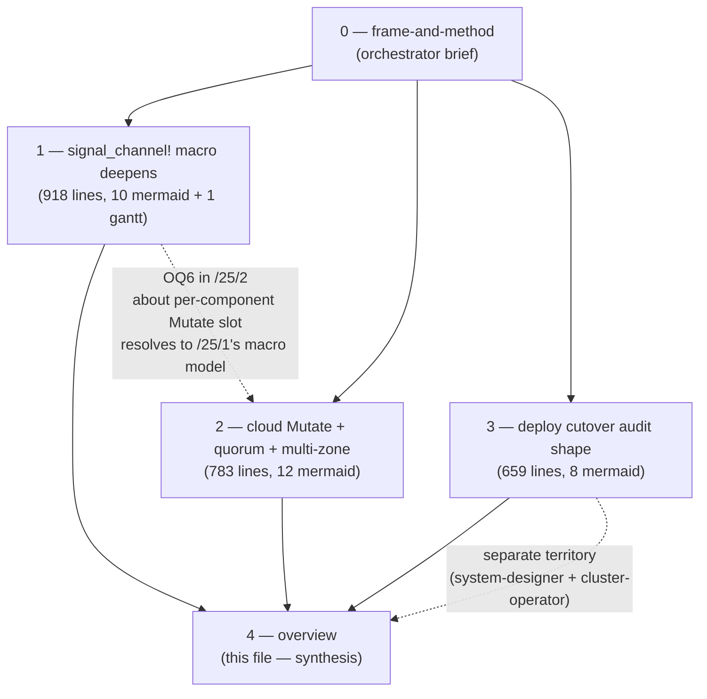
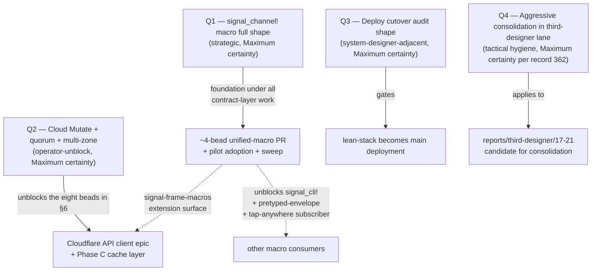
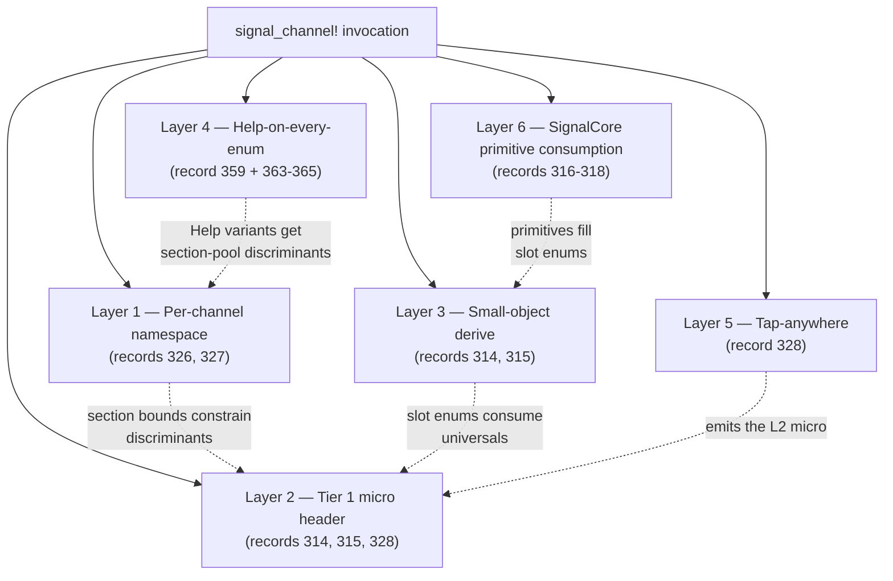
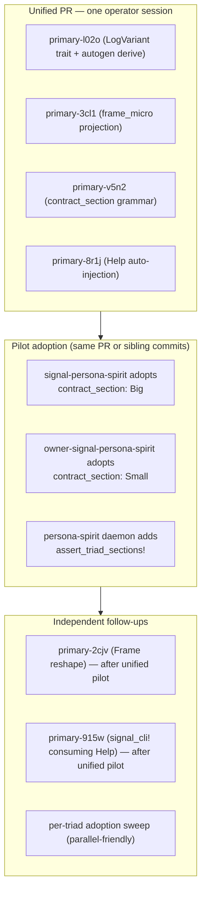
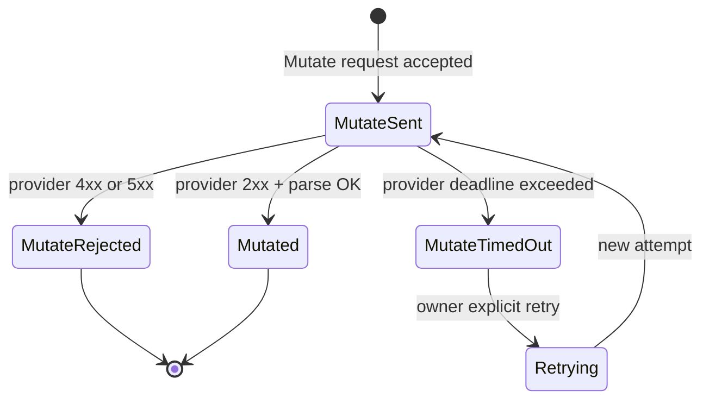
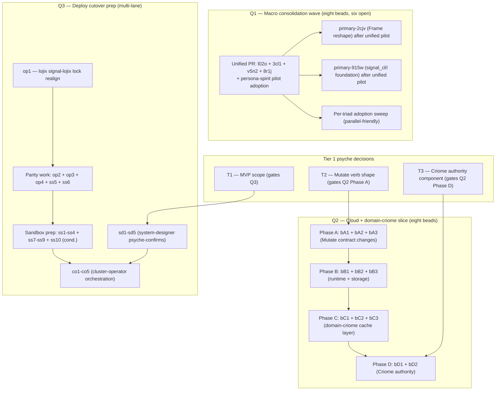

# 25/4 — Orchestrator synthesis: the most important questions

*Kind: Meta-report synthesis · Lane: third-designer (parallel-main
designer, Structural authority) · 2026-05-24*

*Highest-numbered file in this meta-report directory; the
orchestrator's synthesis per intent 231. Sibling fragments:
`0-frame-and-method.md` (the frame), `1-signal-channel-macro-deepens.md`
(Q1 — macro deepens), `2-cloud-mutate-quorum-multi-zone.md` (Q2 —
cloud Mutate + quorum + multi-zone), `3-deploy-cutover-audit-shape.md`
(Q3 — deploy cutover).*

## §1 What this session produced

The psyche directive (2026-05-24): *"refresh skills and intent, then
analyze the most important questions, research solutions and create
a visual report."*

The refresh surfaced 24 new intent records since the prior /24
synthesis (records 342-365). The wave's center of gravity is **spirit
record 359**, which folds nine prior intent records into one macro
design lever and converges eight previously-separate beads. Three
parallel research subagents produced the fragments. This file
synthesizes — what each found, where they intersect, what psyche
must decide, what the operator wave should pick up.

## §2 The four questions ranked by unblock-leverage

The session's ranking (per `0-frame-and-method.md` §"The four most
important questions"):

The leverage flows downward: **Q1's unified macro is the foundation
under every subsequent contract-level operator slice**, including
Q2's cloud Mutate work (which inherits the per-component RootVerb
model, the golden-ratio split, and the Help-on-every-enum
discipline). Q3 is system-designer territory; Q4 is local tactical
hygiene.

## §3 Q1 — signal_channel! macro full shape

**Source**: `/25/1` (subagent A).

The macro after record 359 is no longer an enum-emitter — it is the
workspace's contract compiler, documentation surface, wire-layout
generator, and observability projection generator at once. Six
layers fold into the single declaration:

### §3.1 The two findings that change the bead picture

Subagent A verified two important code-state facts (against
`signal-frame/src/namespace.rs` 2026-05-24):

| Fact | Source | Implication |
|---|---|---|
| `NamespaceSection` enum + `SECTION_CUTOFF = 100` already shipped | `signal-frame/src/namespace.rs` | Bead `primary-li0p` (NamespaceSection const) is **closed** |
| `assert_triad_sections!` helper already shipped | same file | Bead `primary-avog` (assert helper) is **closed** |

The eight converging beads from `/312` §9 reduce to **six open**:
`primary-l02o` (LogVariant autogen), `primary-3cl1` (frame_micro),
`primary-v5n2` (contract_section grammar), `primary-8r1j` (Help
auto-inject), `primary-2cjv` (Frame reshape), `primary-915w`
(signal_cli! foundation).

### §3.2 The four-bead consolidation strategy

Subagent A's biggest design insight: **four of the six open beads
SHOULD land as one unified PR** because they share the same
`signal-frame-macros` extension surface and have circular
discriminant dependencies. Splitting them across PRs creates a
half-state where discriminants shift between PRs.

### §3.3 Help noun semantics — corrected per records 363-365

The Help variant lives at the END of the NOTA path; Help is a NOUN
(the documentation entity), not a verb. CLI examples in /312 §5+§8
that violated the single-NOTA-arg rule were corrected per record
365. The walk: `spirit '(Record (Slot1 (Workspace Help)))'` reads as
"into Record, into Slot1, into Workspace, ask Workspace to describe
itself." The daemon emits a uniform `HelpReply { name, description,
parent, children, kind }` shape; the macro extracts text from `///`
doc comments at compile time.

### §3.4 The fourteen open questions

Subagent A surfaced 14 questions (Q1-Q14 in /25/1 §8). Four are
already in prior reports (cutoff confirmation, default direction,
doc-comment timing, Help discriminator placement). Ten are new.
The two most worth orchestrator escalation:

- **Q11 — Frame reshape timing relative to unified PR.** Subagent
  A's lean: macro PR emits `frame_micro()` first as a function;
  reshape (`primary-2cjv`) consumes it second as a wire-level field.
  This gives a working tap-anywhere slice mid-wave but the order is
  worth psyche's confirmation.
- **Q7 — Help variant naming collision policy.** A contract with an
  existing domain `Help` variant clashes with the macro's auto-
  injection. Lean: reject-with-error (force contract rename) rather
  than macro-renames-silently. Psyche call.

The other eight new questions (Q5, Q6, Q8, Q9, Q10, Q12, Q13, Q14)
have designer leans and can ship with the unified PR; they only
need a psyche-confirm if the lean is wrong.

## §4 Q2 — Cloud Mutate + quorum + multi-zone

**Source**: `/25/2` (subagent B).

The three records collectively say: **acknowledgment is the
substrate**, the local cache is just where past acknowledgments
live, and the provider-API call is the (today, lossy) bridge
between Criome's acknowledgment world and the outside world.

### §4.1 Current code state

Subagent B verified what landed on the `cloud-domain-criome-runtime`
branch (origin) — `main` on each repo is still at the birth commit.
Beads `primary-kbmi.4` (cloud Plan moved to owner as PreparePlan)
and `primary-kbmi.2.1` (NotAuthoritative + NoRecords +
RegisterAuthority) are **CLOSED**. The contract has:

| Surface | Verbs / replies as of 2026-05-24 |
|---|---|
| `signal-cloud` (ordinary) | `Observe`, `Validate` / `Observed`, `Validated`, `RequestUnsupported`, `RequestRejected` |
| `owner-signal-cloud` (owner) | `RegisterAccount`, `RotateCredential`, `SetPolicy`, `PreparePlan`, `ApprovePlan`, `ApplyPlan`, `RetireAccount` / `AccountRegistered`, `CredentialRotated`, `PolicySet`, `PlanPrepared`, `PlanApproved`, `PlanApplied`, `AccountRetired`, `RequestRejected` |
| `signal-domain-criome` (ordinary) | `Observe`, `Resolve`, `Project` / `Observed`, `Resolved`, `NoRecords`, `NotAuthoritative`, `Projected`, `RequestRejected` |

The two-state acknowledgment lifecycle from record 338 is NOT YET in
code. The multi-zone cache from record 340 is NOT YET in code beyond
the NotAuthoritative redirect.

### §4.2 The biggest insight — record 339 generalises into a universal protocol

Subagent B's biggest design insight: **record 339 generalises the
workspace's existing authority-chain pattern into a UNIVERSAL state-
replication protocol.** Every Criome-to-Criome state relationship
works via the same Mutate-ack lifecycle that the component-triad
already documents. The external-provider gap (HTTP-2xx-as-
acknowledgment) is a bridge layer, not a different protocol.

Record 338's two-state lifecycle is the **universal shape**, not a
cloud-specific shape. Every component-pair that shares state uses
this lifecycle.

### §4.3 The single load-bearing design tension — OQ5

Subagent B's most-important open question: **OQ5 — which component
arbitrates node-to-domain assignment?** Record 340 names a "Criome
daemon" that decides ownership without saying what it is. Today no
such component exists. Three candidates surfaced:

| Candidate | Description | Lean |
|---|---|---|
| `criome-daemon` (new) | A meta-orchestrator that tracks every Criome node and assigns domain authority slots | none |
| `domain-criome` extended | The existing TLD daemon gains a node-registry + assignment surface | subagent intuition (no designer lean) |
| `persona-orchestrate` extended | The existing orchestration daemon handles cross-node domain placement | none |
| Out-of-band | Manual config; Criome federation grows organically as nodes opt in | none |

**No designer lean — psyche's call.** This is the single non-
derivable question blocking Phase D of the operator slice plan.

### §4.4 Five secondary open questions with designer leans

OQ1 (verb shape — single-Mutate-with-two-state-reply lean), OQ2
(PreparePlan-vs-Mutate boundary — keep preparation as preview lean),
OQ3 (quorum cardinality — 1-of-N + divergence lean per existing
`skills/component-triad.md` pattern), OQ4 (cache invalidation —
push-only + Resume-after-gap lean), OQ6 (per-component RootVerb
slot — semantics universal, byte-0 slot per-component lean —
resolves via /25/1's macro model).

### §4.5 The eight-bead operator slice plan

Phase A (contracts) → Phase B (runtime) → Phase C (domain-criome
cache) → Phase D (Criome authority). Phase A unblocks everything;
Phase D blocked on OQ5. Phase B can run in parallel with the first
Cloudflare-API-client epic; Phase C waits for `primary-kbmi.2` to
finish.

## §5 Q3 — Deploy cutover audit shape

**Source**: `/25/3` (subagent C).

The three records (356-358) collectively draw a route — from the
current parallel stacks, through an MVP whose definition the audit
must surface, through a sandbox-pass gate whose criteria the audit
must define, to a coordinated multi-repo merge that flips main-
branch authority from the legacy stack to the lean stack.

### §5.1 The biggest gap — lean test-cluster track does not yet exist

Subagent C's biggest gap surfaced: **three of the four cutover-
readiness categories are blocked or partially blocked on items that
have NO IMPLEMENTATION anywhere in the workspace**:

- `CriomOS/modules/nixos/lojix.nix` (systemd unit module) — does not exist
- `CriomOS-test-cluster` `horizon-leaner-shape` branch — does not exist (still on `horizon-re-engineering`)
- `lojix-build-only-pipeline.nix` flake check — does not exist
- Lean fieldlab + horizon NOTA proposals — do not exist

Spirit 358's nspawn substrate exists and is structurally reusable
but is **entirely Stack-A-fixture-anchored** — every check would
need re-anchoring to lean fixtures.

### §5.2 The MVP scope recommendation

Subagent C recommends MVP = **activation + multi-node, /29 deferred**
(carrying `/34/5` Decision 1 forward). The lean daemon's defining
novelty — *"the node deploys itself"* per `intent/deploy.nota`
2026-05-17T11:00 — gets exercised before cutover-day. /29 role-merge
becomes a post-cutover cleanup arc.

### §5.3 Eight open questions, Q1 gates everything

The top open question: **Q1 — MVP scope decision**. Without it the
cutover audit cannot rank items by MVP-blocking vs cutover-
prerequisite. Subagent C's lean (carrying `/34/5` Decision 1
forward): MVP = activation + multi-node, /29 deferred. Other open
questions (Q2-Q8) are downstream of Q1.

### §5.4 Lane responsibility

This is system-designer territory at the architecture level (the
audit-shape framing), system-specialist territory at the
implementation level (the nspawn + lojix.nix + lean fixtures work),
and cluster-operator territory at the live-cutover level (the
coordinated merge + per-node rolling cutover). Third-designer's
contribution is the audit-shape framing; the lanes own the work
itself.

## §6 Q4 — Aggressive consolidation in third-designer lane (per record 362)

Spirit record 362 (Maximum certainty, 2026-05-23): *"Aggressive
consolidation: move old reports into re-contextualized new reports
leaving out stale context in the deleted old versions."* The
direction supersedes conservative defaults of context-maintenance
when psyche explicitly directs consolidation.

Applied to the third-designer lane (current state):

| Report | Date | Status under aggressive consolidation |
|---|---|---|
| `17-situation-and-questions-2026-05-22.md` | 2026-05-22 | Superseded by /19 → /22 → /23 → /24 → /25; consolidation candidate |
| `18-audit-synthesis-2026-05-22.md` | 2026-05-22 | Substance carried by /23 audit; consolidation candidate |
| `19-refresh-after-prime-session-2026-05-22.md` | 2026-05-22 | Snapshot superseded by /24 + /25; consolidation candidate |
| `20-pi-as-codex-replacement-design-2026-05-22.md` | 2026-05-22 | Pi work moved to `reports/pi-operator/`; consolidation candidate |
| `21-audit-cluster-operator-6-pi-harness-2026-05-22.md` | 2026-05-22 | Audit substance superseded by cluster-operator/7+; consolidation candidate |
| `22-cloud-criome-design-research/` | 2026-05-22 | Substance carried into /23 + /306 ARCH; consolidation candidate |
| `23-architecture-update-2026-05-23/` | 2026-05-23 | Audit Problems 1+2 closed in code; /306 absorbed into ARCH; partial-supersession candidate |
| `24-refresh-after-audit-review-2026-05-23/` | 2026-05-23 | Synthesis the picking-up agent (this session) builds on; **keep** |
| `25-most-important-questions-2026-05-24/` | 2026-05-24 | This session; **keep** |

**Not done in this synthesis** — the consolidation work itself is a
separate tactical pass (one operator-session shape, third-designer
territory). The synthesis names it as a follow-up; the agent picking
this up next can either execute the consolidation or carry it
forward.

**Suggested consolidation shape per record 362's
`skills/contract-repo.md` lens**: the four older reports (17-21) get
consolidated into one re-contextualized report keyed by
contract-repo lens: "what was the state of each component's wire
contract at 2026-05-22 vs now?" The /22-25 series stays as a
running design arc.

## §7 The ranked psyche-decision list

Pulling all four fragments together, the psyche-decision questions
ranked by what they unblock. **Decisions in this section ALL surface
the substance inline so the psyche can engage without opening
fragments.**

### §7.1 Tier 1 — block large downstream work

**T1 — MVP scope decision (gates the deploy cutover graph entirely).**
Three readings per /25/3 §3: (A) build-only single-node, (B)
activation + multi-node /29 deferred, (C) full /29 + activation +
multi-node. Subagent C's lean: (B). Surfaces in `/34/5` Decision 1.
Without this, every other rank in the cutover dependency graph
shifts.

**T2 — Cloud Mutate verb shape (gates Phase A of the cloud slice).**
Three readings per /25/2 §6: (a) single Mutate verb with two-state
reply (MutateSent | Mutated | MutateRejected | MutateTimedOut), (b)
single Mutate verb that multiplexes on the exchange (blocking),
(c) two verbs IssueMutation + AcknowledgeMutation. Subagent B's
lean: (a). Confirmation unblocks the contract rename bA1.

**T3 — Criome authority component (gates Phase D of the cloud slice).**
Record 340 names a "Criome daemon" that doesn't exist. Three
candidates per /25/2 §5: (a) new `criome-daemon`, (b) extend
`domain-criome`, (c) extend `persona-orchestrate`. **No designer
lean — psyche's call.** This is the single non-derivable question
in the cloud + domain-criome slice.

### §7.2 Tier 2 — block specific operator slices

**T4 — Unified-macro PR landing strategy.** §3.2: four beads
consolidate into one PR (one operator, one session, one PR).
Alternative: four operators in parallel coordinating through the
same branch. Subagent A's lean: one operator, one session, one PR.
Confirmation unblocks bead pickup.

**T5 — Help variant naming collision policy.** §3.4 Q7. A contract
with an existing domain `Help` variant clashes with macro auto-
injection. Lean: reject-with-error. Confirmation lets the macro PR
land its validation logic.

**T6 — Doc-comment discipline timing.** /312 §10 + /25/1 §8.1 Q3.
Warn-then-error timing for missing `///` doc comments on emitted
enum variants. Lean: warn at the unified-macro PR landing; error one
workspace milestone later. Confirmation sets the macro's emission
behavior.

**T7 — Sandbox-pass criteria for Spirit 357.** /25/3 §4. Narrow
(re-anchor old coverage) vs broad (also exercise lojix-daemon
pipeline). Lean: broad-with-pure-check-witness if MVP is (B); broad-
with-end-to-end-nspawn if MVP includes activation. Surfaces in
`/34/5` Decision 2.

### §7.3 Tier 3 — strategic carry-overs

**T8 — PreparePlan-vs-Mutate boundary (cloud).** /25/2 §6 Q2. Today's
three-step `PreparePlan` → `ApprovePlan` → `ApplyPlan` does work
record 338 doesn't capture. Lean: keep preparation as preview;
rename ApplyPlan to Mutate. Confirmation refines Phase A scope.

**T9 — Cache invalidation source-of-truth (domain-criome).** /25/2
§6 Q5. Push-only vs push + opportunistic-pull. Lean: push-only with
Resume-after-gap for catch-up. Confirmation refines Phase C scope.

**T10 — Quorum cardinality (Criome root pattern).** /25/2 §6 Q3.
1-of-N + divergence vs N-of-M majority vs all-must-agree. Lean:
1-of-N + divergence (matches existing pattern per
`skills/component-triad.md` §"Partial-failure semantics").

**T11 — Owner → meta rename (held Medium-certainty).** Per spirit
records 290+299+326 (Medium / Minimum certainty). Subagent A noted
the current shipped vocabulary is still `owner-` per record 293
(2026-05-23 Medium-certainty clarification). Lean: hold the rename
until Maximum-certainty psyche affirmation lands. Carrying through
this session without action.

**T12 — Frame reshape timing.** §3.4 Q11. Macro PR first, reshape
after. Lean held.

### §7.4 The "no escalation needed" leans (designer authority sufficient)

The remaining questions in subagent fragments (eight in /25/1 §8,
two in /25/2 §6 with strong designer leans, six in /25/3 §9 that are
system-designer territory) can ship with the designer leans absent
psyche objection. They are NOT in the ranked psyche-decision list
because the leans are clear and the cost of psyche-asking on each is
larger than the cost of psyche-correcting if the lean is wrong.

## §8 What the operator wave needs to know — the ranked landing

### §8.1 Smallest-leverage actions available right now

If the psyche-decision tier is not yet triaged, the following
designer-lane edits do NOT block on psyche and can ship today:

- **`signal-frame/ARCHITECTURE.md` §5.2 reconciliation** (carried
  from `/24/0` synthesis). My /23/2 ComponentRegistry framing is
  retired per /305-v2; the ARCH text needs a one-paragraph
  correction. Bead `bead-signal-frame-arch-reconciliation`. Designer
  lane edit; doesn't depend on Tier 1 questions.
- **Third-designer aggressive consolidation (Q4)**. /17-/21
  consolidated into one re-contextualized report under the
  `skills/contract-repo.md` lens. Tactical hygiene; no psyche
  dependency.

Neither is currently in progress; both are available to be picked up
in a follow-up session.

### §8.2 The actions that block on Tier 1 psyche decisions

These need T1, T2, or T3 to land first:

- Q1 unified-macro PR pickup blocks on T4 (landing strategy
  confirm). Acceptable risk to start with the lean; psyche can
  redirect if needed.
- Q2 Phase A (Mutate contract rename) blocks on T2.
- Q2 Phase D (Criome authority component) blocks on T3.
- Q3 entire dependency graph blocks on T1.

### §8.3 Verifications for the next session

The picking-up agent should verify:

1. **`signal-frame/src/namespace.rs` still exports `NamespaceSection`
   and `assert_triad_sections!`.** Subagent A verified 2026-05-24;
   re-verify in case operator wave moves between sessions.
2. **`primary-kbmi.4` and `primary-kbmi.2.1` are still closed.**
   Subagent B verified 2026-05-24.
3. **`CriomOS-test-cluster` is still on `horizon-re-engineering`,
   not `horizon-leaner-shape`.** Subagent C verified 2026-05-24.
4. **Spirit record set ends at 365.** Re-run `spirit '(Observe
   (Records (None None SummaryOnly)))' | tail -...` to catch any
   new records.

## §9 Cross-references — where the substance lives

This synthesis is a chat-friendly distillation of the three
fragments. The substance lives in the fragments. Operators should
read:

- `/25/1` for the unified macro design + ten new open questions +
  the eight-bead bead picture + gantt of landing order.
- `/25/2` for the eight-bead operator slice plan + the universal
  Mutate-ack lifecycle diagram + the multi-zone cache topology + the
  six contradictions to resolve before coding.
- `/25/3` for the cutover dependency graph + the audit checklist
  with green/yellow/red coloring + the lane-by-lane work
  distribution + the risk-and-mitigation matrix.

## §10 What this synthesis does NOT do

- **Does not capture new psyche intent.** No spirit CLI calls in
  this session — no new psyche statements beyond the
  refresh-and-analyze instruction.
- **Does not file beads.** The fragments name candidate beads with
  inline descriptions; psyche triage determines which land in the
  workspace bead store.
- **Does not edit upstream guidance files.** ARCH, AGENTS.md,
  skills/, INTENT.md are upstream-of-designer-lane and edited per
  their own discipline (prime designer + skill-editor + intent-
  manifestation).
- **Does not propose dates.** Per workspace discipline on don't-
  propose-dates for psyche-owned timing.
- **Does not execute the Q4 consolidation.** Names it as available
  follow-up.

## See also

### Sibling fragments
- `0-frame-and-method.md` — orchestrator frame.
- `1-signal-channel-macro-deepens.md` — Q1 deep design.
- `2-cloud-mutate-quorum-multi-zone.md` — Q2 concrete operator slice.
- `3-deploy-cutover-audit-shape.md` — Q3 audit shape.

### Prior third-designer sessions
- `reports/third-designer/24-refresh-after-audit-review-2026-05-23/0-orchestrator-synthesis.md`
  — the session this builds on.
- `reports/third-designer/23-architecture-update-2026-05-23/` —
  the session's prior wave (Problems 1+2 now closed in code per
  /25/2 §2).

### Upstream design substance load-bearing for this session
- `reports/designer/305-v2-design-64bit-signal-per-component-namespacing.md`
- `reports/designer/307-design-golden-ratio-namespace-split.md`
- `reports/designer/308-design-pretyped-envelope-and-tap-anywhere.md`
- `reports/designer/312-design-recursive-help-on-every-enum.md`
- `reports/designer/310-meta-overhaul-booking-roadmap.md`
- `reports/designer/306-manifestation-sweep-round-2-2026-05-23.md`
- `reports/system-designer/34-mvp-and-sandbox-audit/5-overview.md`

### Spirit records (refresh wave 342-365 in addition to those carried by fragments)
- 342 — Provider integrations build-time opt-ins (refinement of 341).
- 343-352 — domain-criome runtime constraints from in-flight
  primary-kbmi.2.1 work.
- 351 — Per-operation request replies should not repeat operation
  kind.
- 352 — Domain-criome contracts keep provider vocabulary out.
- 353-355 — CriomOS firmware gating constraints.
- 356-358 — Deploy cutover (foundation of /25/3).
- 359 — Signal/sema macro deepens (foundation of /25/1).
- 360 — Context-maintenance sweep dispatch.
- 361 — Operator instruction to work beads with subagents.
- 362 — Aggressive consolidation (Q4 of this session).
- 363-365 — Help noun corrections.
