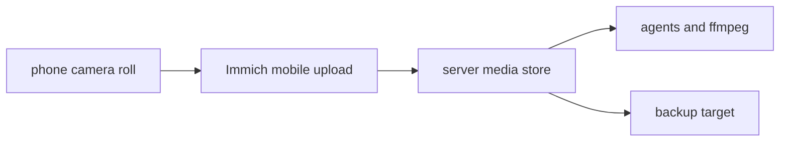

# 6 — Immich-backed agentic media mirror for video access

## Purpose

Give agents on this workstation and cluster reliable on-demand access to newly captured phone photos and videos, especially raw camera-roll videos that need proxy re-encoding before model analysis.

Google Photos is not the agentic substrate: the full-library Google Photos API read scopes are gone, the Picker API is user-mediated, and browser automation is privacy-heavy. The agent-facing substrate should be a local/self-hosted mirror with originals on disk.

## Proposed shape

Deploy Immich as the polished media library and mobile uploader, backed by a filesystem layout that agents can read directly.



The core implementation target is:

- Immich server reachable from the phone on LAN and over the private mesh/VPN path already used for home services.
- Immich mobile app configured for automatic background upload of camera photos and videos.
- Media originals stored in a stable path, for example `/srv/immich/library` or `/var/lib/immich`, with a documented agent read path or exported read-only bind mount.
- Database and media-store backup treated as one unit.
- A small agent inbox convention for model-ready video proxies.

## System-operator implementation tasks

1. Choose host and storage
   - Prefer the always-on home/server node with enough disk and backup reach.
   - Put Immich media on persistent storage, not an ephemeral container volume.
   - Record the final media path and free-space expectation.

2. Deploy Immich
   - Use the upstream stable release channel/container set or the workspace's Nix/container discipline if already available for this host class.
   - Include Immich server, PostgreSQL, Redis, and machine-learning service.
   - Enable hardware acceleration only if it is already straightforward and stable on the chosen host; semantic video proxying can be done separately by agents with `ffmpeg`.

3. Network and authentication
   - Expose Immich on a private address first.
   - If remote upload is needed, prefer the private mesh/VPN route over public exposure.
   - Create the psyche's account and a long-lived API key for agent read-only metadata access if Immich supports the needed access boundary cleanly.
   - Do not put tokens or account identifiers in public reports.

4. Phone setup
   - Install Immich mobile app.
   - Enable automatic backup for the camera roll/video album.
   - Confirm background upload works after taking a fresh short video.
   - Decide whether deletion/free-space behavior is disabled initially; default to no phone deletion until backups are proven.

5. Agent access convention
   - Document the agent-readable originals path.
   - Create a working directory such as `/home/li/Videos/agent-inbox/` or `/srv/media-agent-inbox/` for generated proxies and contact sheets.
   - Agents should read originals, write derived files only to the inbox or `/tmp`, and never mutate Immich originals.

6. Backup
   - Back up both the media directory and Immich database dumps.
   - Run a restore smoke test: recover one photo/video metadata record and one original file into a temporary location.
   - Keep Google Photos as a secondary cloud backup if desired, but do not depend on it for agent access.

## Agent video workflow after deployment

When the psyche asks an agent to inspect a new video:

1. Find the asset by recent upload time, album, or filename through the Immich UI/API or by filesystem mtime.
2. Read metadata with `ffprobe`.
3. For model use, create a proxy rather than uploading the raw original when the original is large.
4. Store proxy/contact-sheet/transcript artifacts in the agent inbox or `/tmp`.
5. Leave the Immich original untouched.

Recommended proxy defaults:

```sh
ffmpeg -i original.mp4 \
  -vf "scale='min(1280,iw)':-2" \
  -c:v libx264 -crf 23 -preset medium \
  -c:a aac -b:a 96k \
  agent-review-720p.mp4
```

Use 1080p/CRF 21 when facial expression, text, or small object detail matters. Keep the original for color, focus, noise, and camera-quality critique.

## Acceptance tests

A deployment is useful to videographer agents when these are true:

1. A fresh phone video appears in Immich without manual download.
2. The same video is visible to the system on disk at the documented originals path.
3. An agent can run `ffprobe` against the original without special browser access.
4. An agent can create a 720p proxy in the agent inbox without mutating Immich storage.
5. Immich remains reachable from the phone on the intended network path.
6. A backup job includes both database and media originals.
7. A restore smoke test proves at least one video can be recovered.

## Open implementation choices

- Whether to use Immich alone or pair it with Syncthing as a raw DCIM mirror. Immich alone is simpler for library UX; Syncthing plus Immich gives agents the plainest raw filesystem substrate.
- Whether Immich lives on the workstation, a home server, or the cluster. Prefer always-on storage over local convenience.
- Whether agents use Immich API keys for metadata queries or rely first on the filesystem plus `ffprobe`. Filesystem first is enough for the initial videographer workflow.

## Recommendation

Start with Immich as the phone uploader and gallery, store originals on a backed-up server path, and give agents read-only filesystem access to originals plus a separate writeable proxy inbox. Add Syncthing only if Immich's storage layout or mobile background behavior does not give agents a simple enough raw-file surface.
