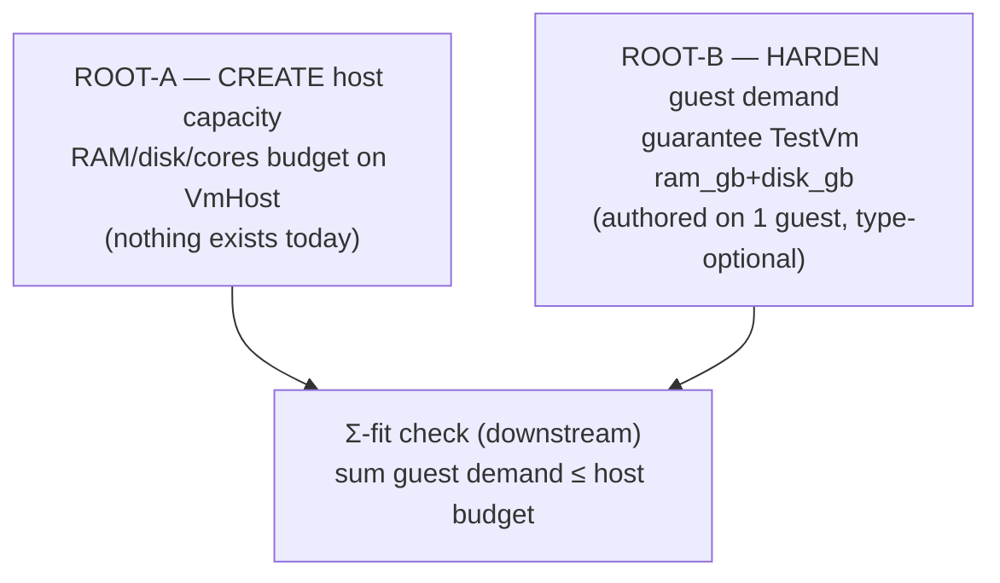

# 1 — VmHost capacity drive — data-foundation ground truth

The drive: a `VmHost` declares a host-total capacity (RAM GiB / disk GiB /
integer cores) and the system refuses any placement where the summed resource
demand of its guests exceeds that capacity. This report establishes what data
exists today and what must be created first.

The whole real cluster carries **exactly one** `TestVm` guest and **exactly
one** `VmHost` service. Every claim below is grounded in that single live
configuration, not in the type's optional slots.

- The one guest: `vm-testing`, hosted by `prometheus`
  (`repos/goldragon/datom.nota:156-159`).
- The one host: `prometheus` (`repos/goldragon/datom.nota:59-97`).

## Item 1 — per-guest resource-demand data

**The type.** `Machine` (`repos/horizon-rs/lib/src/machine.rs`) carries:

- `pub cores: u32` (machine.rs:17) — **required**, never optional. Every
  `Machine` datom authors a cores value.
- `pub ram_gb: Option<u32>` (machine.rs:49) — **optional**; doc says "None
  means the operator hasn't filled it in yet."
- `pub disk_gb: Option<u32>` (machine.rs:60) — **optional**; "None for a Metal
  node … or a Pod whose host pre-provisions the disk."

**The real values.** The one live `TestVm` guest authors all three demand
fields. Positional `Machine` record at `datom.nota:159`:

```
(Pod (Some X86_64) 4 None None (Some prometheus) None None (Some 8) (Some 40) (Some home-lab) [])
```

Decoded against the struct field order: species=`Pod`, arch=`X86_64`,
**cores=4**, model=None, motherBoard=None, superNode=`prometheus`,
superUser=None, chipGen=None, **ram_gb=8**, **disk_gb=40**, location=`home-lab`,
superNodes=[]. So `vm-testing` demands **4 cores / 8 GiB RAM / 40 GiB disk**.

**Verdict: real per-guest demand data IS authored on the real guest — this is
not merely an unset optional slot.** But two sharp caveats:

- The guarantee is by type only for `cores` (required). `ram_gb`/`disk_gb` are
  `Option`, so the data model does **not** force a future guest to author them.
  A new `TestVm` guest authored with `ram_gb`/`disk_gb` = `None` is fully legal
  and silently sized by Nix fallbacks (Item 3). The foundation is N=1, not a
  type-level invariant.
- Cluster-wide the optionals are mostly empty: of the ~6 `Machine` records in
  `datom.nota`, `disk_gb` is authored on **only** the one guest (every Metal
  node leaves it `None`), and `ram_gb` is set on only three
  (prometheus host=128, a T14Gen5=32, the guest=8). disk demand in particular
  exists nowhere except on `vm-testing`.

## Item 2 — per-host capacity

**Confirmed: no `HostCapacity` / resource-budget field exists on `VmHost`
today.** The `NodeService::VmHost` variant
(`repos/horizon-rs/lib/src/proposal.rs:153-167`) carries exactly three fields:

- `guest_subnet: TapSubnet`
- `kvm: KvmAvailability`
- `maximum_guests: Option<MaximumGuests>`

`MaximumGuests` (proposal.rs:199-215) is a transparent newtype over `u32` whose
doc is explicit: "Maximum concurrent test-VM guests a host advertises." It is a
**count** ceiling, not a RAM/disk/cores budget. There is no field naming a
resource quantity.

The real host confirms it. prometheus's services at `datom.nota:97`:

```
[(TailnetClient) (NixBuilder (Some 6)) (NixCache) (VmHost 169.254.100.0/22 Available (Some 4))]
```

The `VmHost` carries `guest_subnet=169.254.100.0/22`, `kvm=Available`,
`maximum_guests=4`. No resource budget. (prometheus's *own* hardware Machine
has ram_gb=128 and cores=8 at `datom.nota:62`, but disk_gb=None, and nothing
declares any of that as a guest-budget — it is the host's own hardware fact.)

The only "capacity check" that exists today is count-based, in the Nix layer:
`capacityOk = maximumGuests == null || hostedCount <= maximumGuests`
(`repos/CriomOS/modules/nixos/test-vm-host.nix:188`), which throws on
over-subscription at eval. This compares a guest **count** to a guest-count
ceiling — it is not a resource sum and cannot become one without new data.

## Item 3 — per-guest OS caps in `test-vm-host.nix`

The QEMU caps are **driven by the guest's real authored Machine facts when
present, with Nix `or` fallbacks of 2 / 2 / 20 that fire only on absence.**

The accessors (`repos/CriomOS/modules/nixos/test-vm-host.nix:206-208`):

```nix
guestCores  = entry: entry.guest.machine.cores  or 2;
guestRamGb  = entry: entry.guest.machine.ramGb  or 2;
guestDiskGb = entry: entry.guest.machine.diskGb or 20;
```

feed QEMU directly (same file):

- `vcpu = guestCores entry;` (line 221)
- `mem  = (guestRamGb entry) * 1024;` MiB (line 222)
- volume `size = (guestDiskGb entry) * 1024;` MiB (line 229)

For the one real guest, every field is authored, so the fallbacks never fire:
its operative caps are **vcpu=4, mem=8192 MiB (8 GiB), disk=40960 MiB (40 GiB)**
— pulled from `datom.nota:159`, not from 2/2/20. These are real microVM/QEMU
device limits: the launched guest genuinely cannot exceed them. **They
meaningfully constrain — they are not cosmetic for this guest.**

The caveat is what they constrain *against*: each guest is capped to **its own
self-declared size**, with **zero relation to host capacity**. There is no
"allocation" or "slice" concept — nothing sums these per-guest caps and checks
them against a host budget (there is no host budget; Item 2). The 2/2/20
fallbacks are the only values that are "hardcoded," and they are cosmetic
*only for a hypothetical unauthored guest* — the real guest never touches them.

## Item 4 — root of the dependency graph + recon over-claims

### Ordered root: what must be created before any "Σ guest demand ≤ host capacity" check



- **ROOT-A (genuinely missing — create from nothing).** A host-total resource
  capacity (RAM GiB / disk GiB / cores) on `NodeService::VmHost`, authored on
  prometheus in `datom.nota`. This is the single datom that does not exist in
  *any* form today (Item 2). Adding it is a **breaking NOTA-arity change**:
  `VmHost` goes 4→5 positional fields, and proposal.rs's own warning
  (proposal.rs:38-47, repeated on every field) says every datom plus every
  daemon's horizon pin must move in lockstep. No Σ-check is even *expressible*
  until this field exists.

- **ROOT-B (partially exists — harden, don't invent).** A per-guest demand
  guarantee. `cores` is already required; `ram_gb`/`disk_gb` are authored on
  the one guest but `Option` at the type level. A sound sum needs every
  `TestVm` guest's RAM and disk demand to be present — either make them
  required for `TestVm` guests, or define explicit demand semantics that
  replace the silent Nix `or 2` / `or 20` fallbacks (test-vm-host.nix:207-208).
  Otherwise the "sum" silently includes fabricated 2/20 values for any
  unauthored guest and is unsound.

- **Downstream (waits on A+B, not root).** The Σ-fit assertion itself —
  whether it lives as a projection static check, a lojix runtime ledger, or
  both — and the open psyche question of where enforcement bites. This report
  is independent of that question.

### Where the prior recon over-claimed

The prior recon is `reports/cloud-designer/83-vmhost-capacity-limits.md`. It is
correct on the central gap (it states plainly that `VmHost` carries a count
ceiling but no resource budget, report 83 lines 11-15). Its over-claims:

1. **"guests are already sized in `ram_gb`, `disk_gb`, `cores` … so the
   fit-check is a direct sum"** (report 83 line 37-38). Over-stated. True for
   `cores` (required) and true for the *one* live guest's authored 8/40, but
   the type leaves `ram_gb`/`disk_gb` optional and most cluster nodes leave
   them empty (disk_gb authored *only* on the guest). The fit-check is a direct
   sum **only after ROOT-B makes guest demand guaranteed** — it is not "already"
   sound. This is the "data already there" over-claim.

2. **"`test-vm-host.nix` caps each guest's QEMU/cgroup RAM/CPU/disk to its
   allocation"** (report 83 line 67-68). Two errors. (a) There is **no
   allocation** — caps come from the guest's *own* declared size
   (test-vm-host.nix:206-208,221-229), with no relation to any host budget. (b)
   They are **QEMU/microVM device sizing (vcpu count, mem MiB, disk-image MiB),
   not cgroup limits** — no cgroup cap is set anywhere in the module. This is
   the "caps already exist [as enforcement]" over-claim: caps exist as
   per-guest sizing, but they enforce nothing about host capacity.

3. **The reported "2/2/20" caps** (per the grounding brief; not in report 83's
   prose). 2/2/20 are the Nix `or` fallbacks (test-vm-host.nix:206-208) that
   fire **only when a field is unauthored**. The real guest authors all three,
   so its actual caps are **4/8/40**. Reporting 2/2/20 as the operative caps
   mistakes fallback constants for live values — the opposite of cosmetic: the
   live caps are real and guest-authored.

Net: the recon was right that *some* per-guest data and per-guest caps exist,
and right that the resource budget is the missing piece. It over-claimed by
(a) treating optional, N=1 per-guest demand as a guaranteed foundation, and
(b) describing self-sizing QEMU caps as host-capacity "allocation" enforcement.
The host-capacity budget (ROOT-A) is the true root and exists nowhere.
