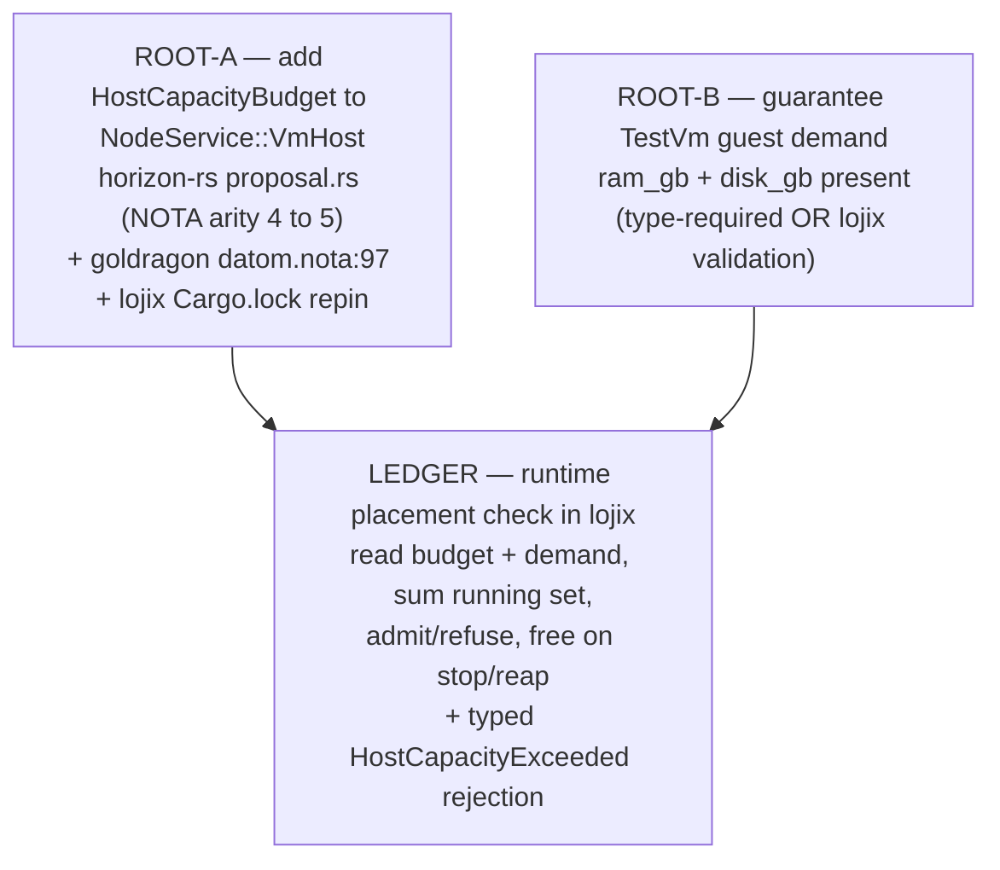

# 2 — VmHost capacity — runtime placement ledger

Report 1 (`reports/vmhostCapacityGrounding/1-Audit-...md`) established the data
foundation: the host-total capacity budget exists nowhere (ROOT-A, a breaking
`VmHost` NOTA arity 4→5), per-guest demand is authored only on the one real
guest with only `cores` type-guaranteed (ROOT-B), and the only "capacity check"
today is a count ceiling. This report grounds the RUNTIME enforcement path in
lojix and designs the ledger.

The confirmed model: enforcement is runtime, in lojix, at placement. Admit a
guest only if its declared demand fits the host's live free budget, where
`free = host capacity − Σ declared demand of guests currently running on that
host`. Budget frees when a guest is stopped/reaped. Static/eval-time
enforcement is OUT of scope (a stopped VM and ad-hoc test clusters make a
static authoring-time check the wrong model).

## Item 1 — lojix's current placement/deploy flow and the existing `at_capacity()`

The daemon lives at the full clone `/git/github.com/LiGoldragon/lojix` (only
`lojix-cli` is symlinked under primary `repos/`). Layout (`src/lib.rs:31-34`):
`client` (thin CLI), `daemon` (Kameo actor runtime + socket multiplexing),
`schema` (generated nexus.rs/sema.rs), `schema_runtime` (the hand-written
`SchemaRuntime` engine). Durable state is a `sema-engine` `*.sema` file.

### Deploy flow, end to end

- CLI `Deploy` → owner socket → `RequestWorker::serve_owner` (`daemon.rs:336`)
  → `submit_deploy` (`daemon.rs:375`) wraps the request in `AdmitDeploy` and
  sends it to the `DeployJobs` actor.
- `DeployJobs::handle(AdmitDeploy)` (`daemon.rs:652-672`) is the admission gate:
  it calls `at_capacity()` (`daemon.rs:657`), then on accept calls
  `SchemaRuntime::submit_deploy` (`schema_runtime.rs:1338`), increments
  `active_count`, and spawns the pipeline via `launch_pipeline`
  (`daemon.rs:579`).
- The pipeline (`drive_submitted_deploy`, `schema_runtime.rs:1381`) drives
  flake-auth → eval → build → copy → activate, writing the `live-set` table on
  activation.

There is **no explicit placement decision in the deploy path** today: a
`DeployRequest` names a target `cluster_name`/`node_name` and the deployment is
applied directly to that target. Host *selection* and host *admission* logic
exists only on the **test-VM path**, where a guest `node_name` is distinct from
the `host` it runs on. That is the real placement seam (Item 2).

### The existing `at_capacity()` cap — characterized

Two structurally identical admission caps, one per work class:

- `DeployJobs::at_capacity` (`daemon.rs:558`): `active_count >= cap`, where
  `cap = MAXIMUM_CONCURRENT_DEPLOYS = 8` (`daemon.rs:150`). `active_count` is
  incremented on admit, decremented on `DeployCompleted` (`daemon.rs:536-539`).
  Over cap → `DeployAdmission::Rejected` with
  `DeployRejectionReason::DeploymentInFlight` (`daemon.rs:562-565`, refused at
  `daemon.rs:657-658`).
- `TestJobs::at_capacity` (`daemon.rs:737`): identical shape; over cap →
  `TestRejectionReason::SubstrateUnavailable` (`daemon.rs:741-744`, refused at
  `daemon.rs:802`).

Both are **daemon-wide concurrency counts of in-flight pipelines** — a single
`usize` with no per-host breakdown and no resource summation. They are the
existing admission pattern the new ledger should sit beside, but they answer a
different question ("too many pipelines at once?") than the ledger ("does this
guest's RAM/disk/cores fit this host's free budget?").

## Item 2 — where the ledger attaches to Track A

system-designer holds active locks (`orchestrate/system-designer.lock`) on
`lojix`, `goldragon`, `signal-lojix`, `meta-signal-lojix`, `CriomOS`, and
`clavifaber` for the Track A "live lojix deploy-into-VM-host test chain
(host-untouched)". Track A is reframing the lojix verb surface from
`Test`/`TestMode::Live` toward a `DeployContained` root over a typed
`ContainedTarget` taxonomy (`HermeticVm` / `VmHostGuest` / `EphemeralDroplet`),
landing in waves: wave 0 (codegen) proven, wave 1 (hermetic face) in progress,
wave 2 (`VmHostGuest` live) queued, wave 3 (typed body + cloud) queued.

The real admission seam in current code is in `schema_runtime.rs`:

- `ClusterProjection` (`schema_runtime.rs:451`) wraps the parsed
  `ClusterProposal`, loaded from the proposal NOTA file via `from_source`
  (`schema_runtime.rs:460-468`: `fs::read_to_string` + `NotaSource::parse`).
- `ClusterProjection::validate_host_for_node` (`schema_runtime.rs:475-488`) is
  the existing per-placement admission check: it rejects `NodeUnknown` or
  `VmHostNotDeclaredForNode`. It is called from the test-run resolver
  (`resolve_test_runs`, ~`schema_runtime.rs:1657-1698`).

**The ledger attaches exactly here**: a sibling check
`validate_capacity_for_guest(host, guest)` invoked right after
`validate_host_for_node` confirms the host declares `VmHost`, and before the
guest is brought up. In Track A's forward shape, the same check rides the
`VmHostGuest` placement step (after host-capability resolution, before
`BringUpTestVm`). Refusal returns a new typed rejection (Item 4).

## Item 3 — the crux: lojix's live running-set source of truth

**Finding: lojix has NO live source of truth for "which guests are currently
running on a given host."** The daemon's six durable `sema-engine` tables
(`lib.rs:47-52`) and its in-memory actors each fail to provide it:

- `live-set` (keyed by `generation_identifier`): completed activation records,
  written on activation success (`schema_runtime.rs:2498`). Carries
  `cluster_name`/`node_name` but **no host dimension** and **no
  deactivation/stop record** — append-on-activate, never retracted on stop.
- `deploy-job` (keyed by `deployment_identifier`): in-flight pipeline rows only,
  retracted at terminal phase (`lib.rs:569-580`). Tracks mid-flight deploys,
  not running ones.
- `container-lifecycle` (keyed by `event_log_position`): state transitions
  (Starting/Started/Stopping/Stopped/Failed) for **test VMs only** (`vm-<node>`
  guests via `BringUpTestVm`/`TearDownTestVm`). It is a transition **log**, not
  a host-keyed "currently running" projection — but it is the only structure
  that records a guest's *Started* and *Stopped* lifecycle.
- `event-log`, `gc-roots`, `test-run`: not running-state.
- In memory: per-request `SchemaRuntime.active_deploy`/`active_test`
  (`schema_runtime.rs:44,51`) are single `Option`s scoped to one request, lost
  on restart; the `DeployJobs.active_count` is a global pipeline count, not
  keyed by host. None survive restart except the persisted `deploy-job` rows.

How the daemon learns a guest STOPPED/REAPED: **it does not.** There is no
reconcile loop, no host event stream, no deactivation record, and no live host
query (`ssh … systemctl list-units`) for the running set. `reconcile_persisted_jobs`
(`daemon.rs:598`) only re-drives in-flight *pipelines* on startup; it makes no
live "are you still running?" query. SSH is used for deploy/test effects, never
for periodic running-set polling.

**Consequence for the ledger:** the live running set cannot be read from
existing persisted state. It must be **constructed**. The cleanest available
truth is the `container-lifecycle` Started/Stopped transition stream, which is
exactly the guest lifecycle the psyche's model turns on — but it is keyed by
event-log position and lacks a host dimension. So the ledger is either a new
host-keyed running tally maintained on those same lifecycle transitions, or a
per-placement fold of the lifecycle log. That choice is the central design fork
(Item 6, fork A).

## Item 4 — the ledger design

### What it reads

- **Host capacity budget** — from the cluster datom's `VmHost` service via
  `ClusterProjection`. This field **does not exist yet** (ROOT-A): today
  `NodeService::VmHost` carries `guest_subnet`, `kvm`, `maximum_guests`
  (`proposal.rs:153-167`), and `VmHostCapability` (`proposal.rs:223`) is the
  borrowed read view. ROOT-A adds a fifth field — a typed
  `HostCapacityBudget { cores: u32, ram_gb: u32, disk_gb: u32 }` record
  (typed-records-over-flags: one named record, not three loose optionals) — and
  threads it through `to_nota` (`proposal.rs:401-406`), `from_nota` (arity
  `4`→`5` at `proposal.rs:448-454`), `VmHostCapability`, and the `vm_host()`
  accessor (`proposal.rs:343-355`). lojix reads it the same way it already reads
  `super_node` in `host_set_of` (`schema_runtime.rs:494-505`):
  `proposal.nodes.get(host).services` → match `VmHost` → read the budget.
- **Per-guest declared demand** — from each guest's `Machine` sizing:
  `proposal.nodes.get(guest).machine.{cores, ram_gb, disk_gb}`
  (`machine.rs:17,49,60`). `cores` is required; `ram_gb`/`disk_gb` are `Option`
  (ROOT-B). Same proposal access path lojix already uses.

### How it tracks the live running set

The ledger's running set on host `H` = guests whose latest lifecycle transition
is *Started* (not *Stopped*/*Failed*) and whose host is `H`. This rides the
existing `BringUpTestVm`/`TearDownTestVm` lifecycle that already writes
`container-lifecycle`. Two materializations are viable (fork A):

- **Persisted host-keyed tally** — a new `sema-engine` table (e.g.
  `host-occupancy`, keyed by `(host, guest)` carrying the guest's demand),
  credited on bring-up (Started), retracted on teardown (Stopped/reaped). Reads
  are O(guests-on-host); survives restart; reconciled on startup beside
  `reconcile_persisted_jobs`. This is the push-not-pull shape: the lifecycle
  effect pushes the occupancy update; placement never polls.
- **Recompute-per-placement** — fold the `container-lifecycle` event log into a
  per-host running set at each admission. No new table; the log is the single
  source. Costs a fold per placement, but removes a second structure that could
  drift from the lifecycle log.

Either way the *truth* is the same lifecycle stream; the fork is whether to
materialize a tally or derive it. Both are sound only for guests lojix itself
brought up/down — out-of-band start/stop drifts them (fork A sub-question).

### The admit/refuse decision

In `validate_capacity_for_guest(host, guest)` at the seam (Item 2):

```
budget   = host.vm_host().host_budget          // ROOT-A
running  = ledger.running_guests_on(host)       // Item 4 running set
used     = Σ running.map(|g| g.machine.demand)  // cores, ram_gb, disk_gb
free     = budget − used                          // per-resource
demand   = guest.machine.demand                   // ROOT-B guarantees present
admit if demand.cores ≤ free.cores
      && demand.ram_gb ≤ free.ram_gb
      && demand.disk_gb ≤ free.disk_gb
else refuse with HostCapacityExceeded
```

The refusal is a new typed rejection: `TestRejectionReason::HostCapacityExceeded`
(and the `DeployRejectionReason` equivalent for the deploy path), added to the
`signal-lojix`/`meta-signal-lojix` rejection enums — the same triad
system-designer is reframing. This keeps refusal in the existing typed-rejection
channel beside `VmHostNotDeclaredForNode` and `SubstrateUnavailable`.

### Freeing on stop/reap

Budget frees when the guest's teardown fires (`TearDownTestVm`, the path that
writes a `container-lifecycle` Stopped transition): the persisted-tally design
retracts the `(host, guest)` occupancy row; the recompute design needs nothing
extra (the Stopped transition already removes the guest from the fold). A reap
(host reboot, crash) that bypasses lojix's teardown leaves a stale credit —
handled only by a reconcile against live host state (fork A sub-question).

### Where it lives

In lojix, in `schema_runtime.rs` (the placement seam) plus, for the persisted
variant, one new `sema-engine` table in `lib.rs` beside the existing six. The
capacity arithmetic belongs on the data types as methods (abstractions /
rust-methods): `HostCapacityBudget::admits(demand, used)` and
`Machine::demand()` rather than free functions at the call site. Enforcement
stays entirely runtime, in the daemon — no eval-time / Nix-layer check (that
remains the `capacityOk` count assertion in `test-vm-host.nix:188`, which is the
old wrong-model static check the psyche has ruled out of scope for this drive).

## Item 5 — dependency graph, landing sequence, coordination constraints



### Lockstep coordination constraints (against system-designer's active locks)

1. **The on-main arity-4 goldragon datom.** `(VmHost 169.254.100.0/22 Available
   (Some 4))` and the `vm-testing` TestVm node are on goldragon `origin/main`
   (`datom.nota:97,156`, confirmed). `NotaDecode` for `NodeService` is
   count-strict (`expect_service_arity(... 4)` at `proposal.rs:449`), so an
   arity-5 datom against an arity-4 daemon — or vice versa — is a hard
   `ExpectedRootCount` decode error, not a silent default. ROOT-A's three edits
   (horizon-rs proposal.rs, goldragon datom.nota:97, lojix `Cargo.lock`
   horizon-lib repin) **must land as one lockstep**. lojix currently pins
   horizon-lib at rev `8d6cbc6` (Cargo.lock) — behind horizon-rs main HEAD
   `4a0e29f`; the repin is `cargo update -p horizon-lib` to the arity-5 rev.
2. **Lock overlap.** system-designer holds `goldragon` (bead primary-dw95,
   "finalize vm-host datom") and `lojix` (Track A). ROOT-A's datom edit and the
   ledger's daemon edit both fall inside those locks. horizon-rs is **not**
   locked — ROOT-A's proposal.rs edit is free — but the goldragon and lojix
   edits require coordinating with system-designer, not editing under its lock.
3. **Moving placement seam.** system-designer is mid-reframe of lojix's verb
   surface (`Test` → `DeployContained`/`VmHostGuest`, waves 1-3) and the
   `signal-lojix`/`meta-signal-lojix` rejection enums. The ledger's seam
   (`validate_host_for_node` sibling) and its `HostCapacityExceeded` rejection
   land cleanest **after wave 2** stabilizes `VmHostGuest` as the live placement
   target; landing earlier rebases the ledger onto a moving seam and a churning
   rejection enum.

### Landing sequence

0. **Coordination gate.** Decide ownership with system-designer (it holds every
   lock ROOT-A's datom edit and the ledger need). Either fold ROOT-A + ledger
   into the Track A arc, or hand off claims lane-by-lane against its waves.
1. **ROOT-A lockstep** (one coordinated push): (a) horizon-rs proposal.rs adds
   `HostCapacityBudget` (variant + to_nota + from_nota arity 4→5 +
   `VmHostCapability` + `vm_host()`); (b) goldragon datom.nota:97 appends the
   budget to prometheus's `VmHost`; (c) lojix Cargo.lock repins horizon-lib.
   Nothing decodes the live datom until all three move together.
2. **ROOT-B** (fork B): either fold a TestVm `ram_gb`/`disk_gb`-required change
   into the same horizon-rs lockstep (another breaking Machine arity move
   touching every Machine datom + pin), or add a lojix-side demand validation
   (non-breaking, daemon-local) folded into step 3.
3. **LEDGER** (after ROOT-A+B and after Track A wave 2): choose the running-set
   source (fork A); add the host-keyed running-set read + free-budget arithmetic
   as methods on the budget/demand types; add `validate_capacity_for_guest` at
   the seam; add `HostCapacityExceeded` to the rejection enums (triad, lockstep
   with signal-lojix/meta-signal-lojix); hook teardown/reap to free budget;
   reconcile the tally on startup beside `reconcile_persisted_jobs`.

## Item 6 — open design risks / psyche forks

- **Fork A — running-set source (the crux).** Persisted host-keyed occupancy
  tally vs recompute-per-placement from the `container-lifecycle` log vs a
  hybrid that periodically reconciles against a live host query. Sub-question:
  out-of-band start/stop (host reboot, manual kill, daemon-state loss) drifts
  any lojix-internal tally from reality — is a live host query (ssh enumerate
  running microVMs) required at placement or on a reconcile tick to keep the sum
  sound, or is "trust the lifecycle lojix itself drove" acceptable for the
  test-cluster use case? This determines whether the ledger is purely a
  push-driven internal projection or also a puller against the host.
- **Fork B — ROOT-B shape.** Make TestVm `ram_gb`/`disk_gb` type-required (the
  beauty-true fix: demand becomes a type-level invariant, but it is another
  breaking Machine arity change moving every Machine datom + pin) vs a lojix-side
  validation that refuses a guest with absent demand (`NoGuestDemand`,
  non-breaking, daemon-local, but the type stays optional and the silent Nix
  `or 2`/`or 20` fallbacks survive at `test-vm-host.nix:206-208`).
- **Fork C — budget vs count ceiling.** Does the resource budget **replace** the
  existing `maximum_guests` count ceiling (`proposal.rs:166`; a resource budget
  subsumes a count cap) or sit beside it (two admission gates with overlapping
  intent — the count cap and the per-host resource sum)? typed-records-over-flags
  and beauty argue for one authority; keeping both is redundant special-casing.
- **Fork D — ownership/sequencing.** Fold ROOT-A + ledger into system-designer's
  Track A arc (it holds all the locks and owns the moving placement seam) vs run
  a separate lockstep coordinated against its waves. The former avoids
  lock contention and seam churn; the latter parallelizes but risks rebasing the
  ledger onto a moving target.
- **Fork E — refusal channel for production deploys.** The placement seam today
  lives on the test-VM path (`validate_host_for_node`). The production `Deploy`
  path has no placement decision at all (Item 1). If host-capacity enforcement
  is meant to cover production deploys-into-VM-host (not only test runs), the
  deploy path needs the same admission seam grown into it — a larger change than
  extending the test path alone.
