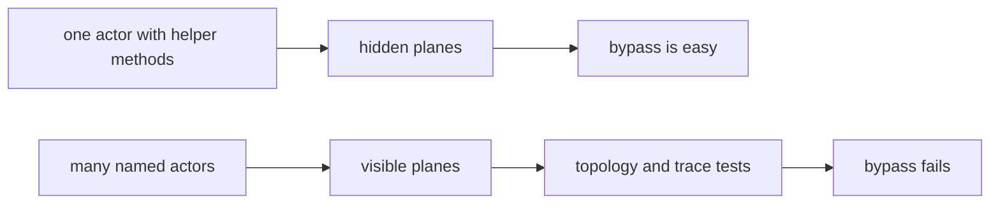
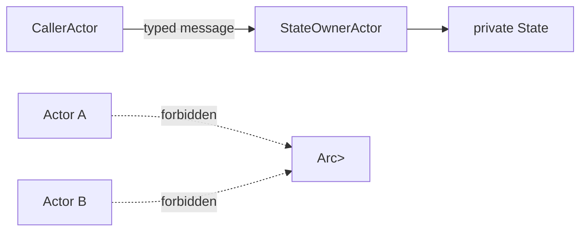
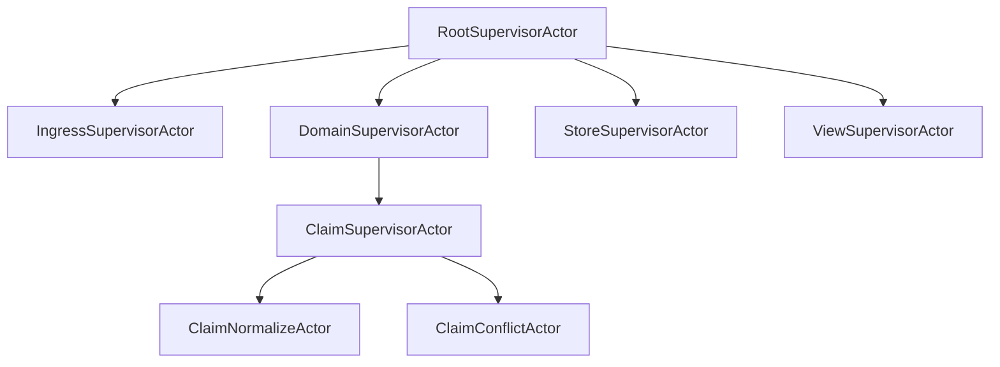
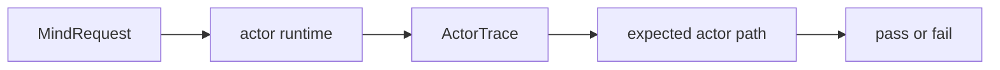

# Skill — actor systems

*Actors are a thinking discipline: every logical plane gets a
named owner, a typed mailbox, supervision, and tests that prove
the path was used.*

---

## What this skill is for

Use this skill whenever a component is a daemon, service, runtime,
router, state engine, watcher, delivery engine, database owner, or
other long-lived system with concurrent or ordered behavior.

The workspace uses actors not mainly because actors are fast, but
because actor boundaries force correctness in thinking. An actor
turns a vague step into a noun with state, a mailbox, failure
semantics, and an observable trace. That pressure matters in an
agent-written codebase: an agent can hide a missing phase inside a
helper method, but it is much harder to fake an actor topology,
typed messages, and trace witnesses.

For Rust implementation details, the runtime default is `ractor`,
but Persona-facing actors should be data-bearing actor nouns with
private adapter glue. Read lore's `rust/ractor.md` for the tool;
this skill is the architectural rule.

---

## Core rule

**Actors all the way down.**

Every non-trivial logical plane deserves an actor. Smallness is not
an objection; triviality is. A plane is actor-shaped when all three
are true:

- it has a typed domain name, not just a verb on existing data
- it has a failure mode callers act on
- it can be tested independently with typed synthetic input

Those tests catch the boundary. `ClaimConflict`, `IdMint`,
`SemaCommit`, `FocusObservation`, `PromptGuard`, and
`ReplyShape` are actors. "Strip trailing slash" is a method on the
actor that owns path normalization.

If the plane owns state, transforms a request, validates authority,
decides legality, mints identity or time, performs IO, commits
durable state, maintains a view, shapes replies, supervises
children, or records trace, it is probably actor-shaped. The
overhead is acceptable; the correctness in design is the point.

---

## Actor per plane

An actor-heavy system should look over-named to conventional Rust
eyes. That is expected.

| Plane | Actor shape |
|---|---|
| Parse one CLI record with diagnostics | `NotaDecodeActor` |
| Identify caller | `CallerIdentityActor` |
| Add actor identity to request | `EnvelopeActor` |
| Route request by type | `RequestDispatchActor` |
| Normalize a claim path | `ClaimNormalizeActor` |
| Check claim conflicts | `ClaimConflictActor` |
| Mint item identity | `IdMintActor` |
| Mint store time | `ClockActor` |
| Append event | `EventAppendActor` |
| Commit state | `SemaWriterActor` |
| Read state | `SemaReadActor` |
| Maintain ready-work view | `ReadyWorkViewActor` |
| Shape query result | `QueryResultShapeActor` |
| Encode reply | `NotaReplyEncodeActor` |

These actors may be small. Some may be short-lived per request.
Some may be long-lived singletons. Some may become pools. The
choice of residency is a runtime decision; the actor identity is an
architecture decision.

Do not create actors for pure value transformations that have no
domain failure and no independent runtime ownership. Those methods
belong on the data-bearing actor that owns the surrounding phase.

---

## Blocking is a design bug

An actor's mailbox is the push channel for that actor. If an actor
blocks inside message handling, it stops receiving pushes and the
system has recreated a hidden lock.

Forbidden inside a normal actor handler:

- sleeping to wait for state
- polling for state
- blocking on a mutex or read-write lock
- blocking process execution
- blocking filesystem or network calls
- synchronous waits for another actor that can call back upward
- long CPU work that starves the mailbox

Replace blocking with another actor:

| Blocking smell | Actor-shaped replacement |
|---|---|
| Handler runs a slow command | `CommandActor` or `CommandPoolActor` owns process execution. |
| Handler waits for file IO | `FileReadActor` / `FileWriteActor` owns that IO. |
| Handler waits for database commit | Send a typed intent to `SemaWriterActor`; receive a reply. |
| Handler sleeps before retry | Subscribe to the producer event; no sleep. |
| Handler locks shared state | Send a message to the actor that owns that state. |
| Handler does expensive CPU transform | `TransformWorkerActor` pool owns that work. |

The rule is not "nothing ever takes time." The rule is that time
belongs to a named actor whose mailbox and supervision make the wait
visible. A blocking operation is allowed only inside the actor whose
single job is that blocking plane, and that actor is supervised,
traceable, and replaceable.

---

## No shared locks

Do not use `Arc<Mutex<T>>` or `Arc<RwLock<T>>` as the ownership
model between actors. That turns the lock into the real actor and
makes the actor wrappers decorative.

State has one owner:

If two actors need the same state, the state has the wrong owner or
the state should be split into two actors. Use message passing,
snapshots, and read views; do not add shared locks.

---

## Supervision is part of the design

An actor without a supervised parent is not finished. Every actor
belongs in a tree.

Each supervisor needs a typed failure policy:

| Failure | Policy question |
|---|---|
| child rejects input | reply with typed rejection |
| child panics | restart, stop, or escalate |
| child loses IO resource | rebuild resource actor or escalate |
| view refresh fails | preserve committed state and schedule pushed retry |
| writer fails | abort transition and emit typed failure |

No detached tasks. If work must run independently, it is an actor
or a supervised worker pool.

---

## Rust shape

The workspace runtime default is still `ractor`, but Persona-facing
code should not model actors as public ZST behavior markers. The
actor type should carry the actor's data.

Target shape:

- `ClaimNormalize` is a struct with fields: config, in-flight
  requests, metrics, child handles, or whatever qualities the actor
  owns.
- `ClaimNormalize::open(arguments)` constructs `Self`.
- `ClaimNormalize` implements the workspace actor trait once that
  trait exists.
- `ClaimNormalize::handle(&mut self, message)` operates on the
  fields of `Self`.
- The public consumer surface is a typed handle, not ractor's raw
  `ActorRef`.

`ractor` compatibility belongs behind one adapter layer. If direct
`ractor` use is still necessary before the adapter crate lands, treat
the ractor behavior marker as private framework glue. Do not put
domain methods on it. Do not expose it as the actor noun. The actor
noun is the data-bearing type.

For actor-dense systems:

- one actor per file when the actor is durable enough to name
- named-field message variants
- one message variant per verb
- no "handle anything" frame inside a component
- no raw `spawn` outside the root
- no raw `spawn_linked` outside the parent or actor wrapper
- no `Arc<Mutex<T>>` between actors
- no long `await` inside a handler unless this actor owns that wait
- no blocking call inside a handler except in a dedicated blocking
  plane actor
- no public ZST actor nouns
- no separate `State` type as the only place where real actor
  methods live, except inside transitional framework glue

The actor's public consumer surface is its handle type. Consumers
start or call the handle; they do not construct actor internals.

---

## Traces are required

An actor-heavy system must expose an actor trace in tests. The
trace is how we prove that the named planes actually ran.

Trace events should include:

- actor started
- actor stopped
- message received
- message replied
- child spawned
- child failed
- write intent sent
- commit completed
- view refreshed

The trace is not a logging substitute. It is a test witness.

---

## Test actor density

Behavior tests are not enough. Tests must prove that the actor
planes exist and are used.

Required test families:

| Test | What it proves |
|---|---|
| topology manifest test | expected supervisors and actors exist |
| trace-pattern test | request ran through required actor sequence |
| forbidden-edge test | actor did not bypass required owner |
| no-writer-in-query test | query path did not mutate state |
| no-blocking-handler test | actor handler did not perform forbidden blocking work |
| failure-injection test | each actor phase has typed failure behavior |
| actor-count test | future agents cannot collapse actors by assuming overhead |
| no-zst-actor test | actor nouns carry fields and implement the actor trait |

Test name patterns:

- `claim_cannot_commit_without_conflict_actor`
- `query_cannot_touch_sema_writer`
- `item_open_cannot_mint_id_without_id_actor`
- `handler_cannot_block_mailbox`
- `topology_cannot_omit_claim_normalizer`
- `claim_normalizer_cannot_be_empty_marker`

The `#[test]` wrapper calls methods on a fixture. The fixture
drives the actor runtime, captures the trace, and asserts the
topology or path.

---

## When not to create an actor

Do not create an actor for:

- a pure value type
- a contract record
- a one-line display implementation
- a parser that is just a short-lived data-bearing object inside
  an already actor-owned phase
- a library crate with no runtime ownership

Even then, the behavior still belongs on a data-bearing type, not
a free function or a ZST method holder.

---

## See also

- this workspace's `skills/rust-discipline.md` — Rust ownership,
  typing, errors, redb/rkyv, and the ractor default.
- this workspace's `skills/architectural-truth-tests.md` —
  tests that prove the actor path was used.
- this workspace's `skills/push-not-pull.md` — actor mailboxes
  are push channels; polling is forbidden.
- this workspace's `skills/abstractions.md` — actor verbs belong
  on the data-bearing actor noun, not on framework marker glue.
- lore's `rust/ractor.md` — ractor implementation patterns.
- lore's `rust/testing.md` — actor runtime testing and fixture
  patterns.
