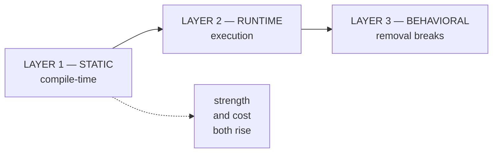
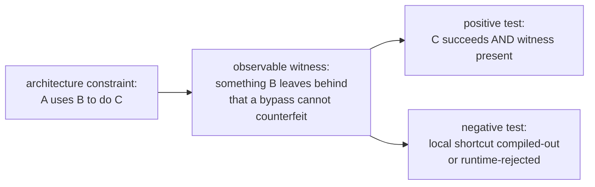
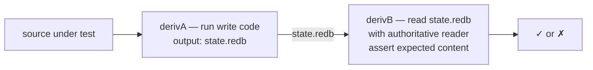
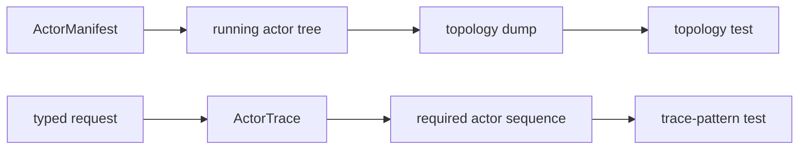

# Skill — architectural truth tests

*Tests that prove the architecture is followed, not just
that the behavior succeeds. The agent that writes the code
doesn't remember what they wrote yesterday — these tests are
what catches "looks aligned but secretly reimplemented the
component next door."*

## What this skill is for

Apply this skill when an architecture constraint says
*"component A uses component B to do C"* and you're writing
tests for C.

Behavior tests prove C succeeds. Architectural-truth tests
prove **B was the path** — not a local shortcut that
produces the same output. Without architectural-truth tests,
an agent (or a future agent without yesterday's memory) can
ship code that satisfies behavior while routing around the
intended component, and no test fires.

The discipline applies to every architectural assertion — wire
contracts, storage layers, actor protocols, deploy chains.

## The principle

> Write tests that prove the architecture, not only the
> behavior. If a rule says "component A uses component B to
> do C", the tests must make bypassing B fail even when C's
> visible output still succeeds.

> Treat architecture as a contract with **observable
> witnesses**: dependency graph, type identity, actor
> messages, storage table identity, wire format, state
> transitions, negative compile/runtime cases.

> Prefer weird tests over trusting implementation prose.
> Agents can write code that looks aligned while secretly
> reimplementing the component next door. A correct test
> forces the intended path to be the only passing path.

> Every architectural constraint gets at least one witness
> test: one **positive** test proving the intended
> component is used, and one **negative** test proving the
> tempting shortcut fails.

## No positive grep as deployment proof

A positive architectural witness must exercise the real path. A
source scan that says "this string exists" is not proof that a
daemon, schema chain, actor path, wire frame, or deployment path
uses that thing. It only proves text is present.

Forbidden as deployment or architecture proof:

- `grep -R "SemaWriteInput" src/schema/lib.rs`
- `grep -R "impl NexusEngine" src`
- `grep -R "SignalActor" src`

Those checks can stay only when they are **negative guards** for
retired or forbidden surfaces:

- `! grep -R "NexusMail" src tests`
- `! grep -R "git+file://" flake.nix Cargo.toml`

Positive proof must compile, execute, round-trip, or observe the
real boundary: cargo tests over generated types, compile-fail
tests, dependency-graph assertions, socket rejection tests,
rkyv/NOTA round-trips, process-boundary tests, Nix integration
runners, or chained artifact readers. Grep can prove absence; it
does not prove live use.

## Proof-of-usage ladder — choose cheapest sufficient

The §"No positive grep" rule above names what is forbidden. The
positive complement is the **three-layer proof-of-usage model**: every
architectural claim about USAGE picks the cheapest witness that is
strong enough. Don't over-witness; don't under-witness.



Five nodes; honors the §"Graphs are short" budget. Proof strength rises
left to right; cost rises with it. The discipline: pick the lowest
layer whose witness is strong enough for the claim.

### Layer 1 — STATIC (compile-time type-system reference)

Proves: the code exists AND the type system links it. Does NOT prove
the code executes at runtime.

| Witness | Proves | Cost |
|---|---|---|
| `use T` statement compiles | Module references the type | Free |
| `static_assertions::assert_impl_all!(T: Trait)` | T implements Trait at compile time | Free |
| `let _: T = expression;` in a test | Expression's type is T | Free |
| Compile-fail (`trybuild`) on a shortcut | Removing T breaks the failing branch's compile | Free |
| `cargo metadata` dependency assertion | Crate depends on another | Free |
| Type alias / re-export check | Public surface includes T | Free |

Strength: LOW-MEDIUM. A method can be `use`d and the binary linked
without the method ever being called at runtime — dead code that the
compiler keeps because something references it.

Critical: **grep is NOT a Layer 1 witness.** Grep traverses strings,
not the type system. The type-system witness uses `use`,
`assert_impl_all!`, or a constructor call that actually requires the
compiler to resolve the reference.

### Layer 2 — RUNTIME (execution path taken)

Proves: the code actually runs under test or production; the call path
is taken on specific inputs.

| Witness | Proves | Cost |
|---|---|---|
| Unit test calling the function | Function runs in test process | Cheap |
| Integration test through wire | Full call chain executes | Medium |
| Actor trace assertion (recorder actor) | Specific mailbox traversed | Medium |
| Process-boundary test (real binary spawn + round-trip) | Cross-process path runs | Expensive |
| Property test (proptest, quickcheck) | Many generated inputs flow through | Medium |
| Code coverage (`cargo-tarpaulin`, `llvm-cov`) | Line/branch was executed | Expensive |

Strength: STRONG. Proves execution at the witness's call site. Doesn't
prove production exercises the path — only the test that ran. The
honest discipline: a Layer 2 witness proves the path is EXECUTABLE,
not that production EXERCISES it. For most architectural claims this
is sufficient.

### Layer 3 — BEHAVIORAL (removal breaks observable behavior)

Proves: this code carries an observable effect — removing it changes
the system's externally visible behavior.

| Witness | Proves | Cost |
|---|---|---|
| Mutation testing (`cargo-mutants`, `mutagen`) | Removing code breaks tests | Very expensive |
| Manual removed-code test (deliberately break, assert failure) | Same as mutation, per-instance | Cheap (per-test) |
| Negative-presence test on output | Output existence depends on code path | Cheap |
| Backward-compat test against checked-in fixtures | Code processes archived inputs correctly | Medium |
| Differential testing (compare against known-good) | Two systems agree | Medium-expensive |

Strength: STRONGEST. If removing X breaks an observable behavior the
test asserts, then X is genuinely USED — not just present. Reserved
for high-stakes invariants where the cost of dead-code-passing-as-live
is large; most claims don't need Layer 3.

### The choose-cheapest-sufficient discipline

For each architectural claim, ask: structural reference, runtime
execution, or observable behavior? Pick the cheapest layer whose
witness shape matches the claim. The default is Layer 2 — most
architectural claims involve a path being EXECUTABLE through the
runtime; the cheapest sufficient witness is an integration test
through the wire. Layer 1 covers purely structural claims (the trait
surface exposes only these methods). Layer 3 is for invariants where
Layer 2's "executable" isn't enough and "removing this breaks
behavior" is the real claim.

The forbidden case (positive grep) sits BELOW Layer 1 — it claims
structural reference but doesn't prove it. The §"No positive grep"
rule above enforces "if you want a structural-reference proof, use a
real Layer 1 witness."

### Worked examples

**"Type T is emitted by the schema chain"** (Layer 1, cheapest):

```rust
#[test]
fn sema_write_input_type_emitted() {
    use my_crate::schema::lib::SemaWriteInput;
    let _: SemaWriteInput = SemaWriteInput::default();
}
```

This compiles ONLY if the emitter actually emitted the type with the
expected name and constructor. Grep can't disambiguate "the name
appears" from "the type is emitted with this exact shape."

**"Runtime X uses trait method Y"** (Layer 2 via recorder):

```rust
#[test]
fn nexus_calls_sema_engine_apply_via_trait() {
    let recorded = std::sync::Arc::new(std::sync::Mutex::new(Vec::new()));
    let fake_sema = FakeSemaEngine::new(recorded.clone());
    let mut nexus = Nexus::with_sema_engine(fake_sema);
    let _ = nexus.execute(test_nexus_input());
    assert!(recorded.lock().unwrap().iter()
        .any(|call| matches!(call, RecordedCall::SemaApply(_))));
}
```

The witness sinks call records. The test proves Nexus actually called
the trait method during execution.

**"Daemon round-trips through the wire"** (Layer 2 via process
boundary):

```rust
#[test]
fn daemon_round_trip_through_socket() {
    let fixture = DaemonFixture::start();
    let reply = fixture.invoke_cli("(Record ...)");
    assert!(reply.contains("RecordAccepted"));
}
```

The full real binary runs; the wire round-trips; the reply shape
proves the path was executed end-to-end. This is the strongest cheap
Layer 2 witness for "the daemon's runtime path is live."

## Constraints first

The `Constraints` section of a component `ARCHITECTURE.md`
is the seed list for these tests. Write each constraint as a
short direct sentence in plain language; then name at least
one test after that sentence.

| Constraint | Test name |
|---|---|
| `mind` CLI accepts exactly one NOTA record | `mind_cli_accepts_exactly_one_nota_record` |
| `mind` CLI sends Signal frames to the daemon | `mind_cli_cannot_reply_without_daemon_signal_frame` |
| queries never send write intents | `query_path_cannot_touch_sema_writer` |
| daemon owns `mind.redb` | `mind_redb_cannot_be_opened_by_cli` |
| contract crates contain no runtime actors | `contract_crate_cannot_spawn_actor_runtime` |

A constraint that does not suggest a witness is not precise
enough yet. Rewrite it until it names the component, the
operation, and the boundary that must not be bypassed.

## The shape



The hardest step is naming the **witness** — the artifact
that B necessarily produces and a bypass necessarily
doesn't. Witnesses are the load-bearing design move; the
tests are mechanical once the witness is named.

## Witness catalogue

Witnesses, by category:

| Witness | Catches |
|---|---|
| `cargo metadata` dependency assertions | wrong repo reached across a boundary (e.g. router pulls persona-terminal directly) |
| `compile-fail` tests (`trybuild` or similar) | local duplicate types, string shortcuts, missing trait contracts |
| Fake actor handles | direct method calls disguised as actor code |
| Typed event traces (recorder actor) | wrong ordering of effects (e.g. push-before-commit) |
| Actor topology manifest | missing actors, collapsed phases, unsupervised children |
| Actor trace pattern | request bypasses a required actor plane |
| Forbidden actor-edge trace | query writes, CLI opens database, domain actor bypasses store actor |
| redb fixture files (golden) | schema/version lies; missing table writes |
| rkyv byte fixtures (golden) | incompatible wire or disk encoding |
| Nix-chained derivations (next §) | runtime memory faking what should be filesystem |
| Process-tree witnesses (`/proc/<pid>/maps`, `lsof`) | claimed-open files that aren't open |
| Length-prefixed-frame parser on the wire | text/JSON snuck into a Signal channel |
| Schema-version golden | undocumented schema drift |
| Legacy-surface absence witness | lock-file / BEADS reinvestment sneaking into new components |
| Network namespace test | hidden cross-machine calls |

## Pair-rule sweeps — valid patterns and adjacent anti-patterns

When a discipline has a positive shape AND a negative shape (this pattern
is valid; this look-alike pattern is forbidden), audit sweeps must cover
**both shapes in the same scope**. A valid pattern can coexist with an
anti-pattern nearby; the audit that grepped only one shape misses the
other.

The recurring failure mode: an audit looks for the load-bearing valid
pattern (single-field wrappers around foreign types, real actors,
data-bearing nouns), confirms each instance pays its way, and writes
"no violations found." The adjacent anti-pattern hiding in the same
file — a zero-sized method holder, a fake actor, a free function dressed
as an associated function — never gets greppped because the audit
scope was "valid patterns" not "the whole rule."

Worked example. The single-field wrapper `Wrapper { inner: ForeignType }`
is valid when the orphan rule blocks inherent methods on the inner type
(see this workspace's `skills/rust/methods.md`). The zero-sized method
holder `struct Wrapper; impl Wrapper { fn helper(...) }` is forbidden as
a free function in disguise (per AGENTS.md hard override). Both shapes
look like "a small struct with methods" from a distance. An audit that
greps `^struct \w+ \{$` (multi-line braces) finds the single-field
wrappers but skips the unit structs entirely. The unit structs need a
separate grep: `^struct \w+;$`. Both sweeps land in the same audit pass.

The general rule: every rule with a positive-and-negative shape gets a
**pair-rule sweep** — two greps run in the same audit scope, both
results compared against the discipline. The audit conclusion names what
was found in BOTH sweeps, not just the load-bearing one.

| Positive shape | Negative shape (must sweep simultaneously) |
|---|---|
| `struct Wrapper { field: T }` with methods | `struct Wrapper;` with associated functions (ZST namespace) |
| Real data-bearing actor noun | Empty `pub struct ActorMarker;` ZST adapter masquerading as a noun |
| Method on `impl Type` block | Free function `fn helper(...)` outside any `impl` |
| Trait with multiple impls | One-impl trait (extension trait disguising a free function) |
| Closed enum match arm | String predicate or boolean flag soup branch |

When the audit lands as a report, the per-rule findings name both sweep
results: "Sweep A (valid pattern, N instances) — all legitimate. Sweep B
(anti-pattern, M instances) — N violations." A report that names only
Sweep A leaves Sweep B as a future cleanup the auditor invited by
omitting it.

## Actor trace first, artifacts later

For actor-system ordering constraints, start with the mailbox path.
An actor trace is the first witness: it proves the required actors saw
the message and records the happens-before relation that a direct call
or shortcut would skip.

Do not wait for durable storage to exist before testing an ordering
claim. If the current component has only in-memory state, write the
actor-trace witness now. For example, `router_cannot_emit_delivery_before_commit`
records the matching commit event before any delivery event in the
trace stream; the test fails if delivery appears first.

When the durable substrate lands, add the stronger stateful or
Nix-chained artifact witness on top. The later artifact test proves
the redb/table write happened before delivery across process or
derivation boundaries; it does not replace the actor trace, which
still proves the intended mailbox path was used.

## Schema-chain witnesses use schema objects

For schema-derived runtimes, architectural witnesses must be schema-emitted
objects flowing through schema-type traits. Do not invent a test-only enum to
stand in for the runtime language being proved. If the chain is
Signal -> Nexus -> SEMA, the test witness should be made from generated
objects such as:

- `MailLedgerEvent` for hookable Signal/Nexus lifecycle events.
- `NexusInput` and `NexusOutput` for execution-plane ingress and egress.
- `SemaInput` and `SemaOutput` for state-plane operations and replies.

The SEMA engine contract is especially strict: the operation method takes a
SEMA schema object and returns a SEMA schema object. A test that calls a store
or engine with a primitive, helper enum, or test-local command type is proving
the wrong surface even if the visible behavior succeeds.

When the schema emitter provides plane traits, use those traits explicitly in
the witness. For the Signal -> Nexus -> SEMA chain, the strongest in-process
test shape is:

- Signal admission produces a typed accepted object from generated `Input`.
- Nexus execution is invoked through generated `NexusEngine` or generated
  per-root Nexus dispatch traits, taking `NexusInput` and returning
  `NexusOutput`.
- SEMA execution is invoked through generated `SemaEngine`, taking `SemaInput`
  and returning `SemaOutput`.
- Rejections and lifecycle events are generated schema values such as
  `Output::Rejected(SignalRejection)` and `MailLedgerEvent`, not hand-written
  test enums or string logs.

Tests should be named after the chain invariant they prove, for example
`schema_emitted_traits_drive_the_full_plane_chain`.

## Live boundary witness for vocabulary widening

When a closed-vocabulary enum widens (Certainty's three variants
become Magnitude's seven, ItemPriority collapses onto Magnitude,
health/readiness scales unify), the load-bearing witness is **a
live test that round-trips a newly-admitted variant end-to-end
through the actual wire path** — Record it, Observe it back. Unit
tests on the type prove rkyv round-trips in isolation; they do
not prove the wider vocabulary actually persists through the
daemon and reads back through the client.

```rust
#[test]
fn client_accepts_high_magnitude_and_observes_it_back() {
    let fixture = StoreFixture::new("high-magnitude");
    fixture.reply_text(
        "(Record (workspace Decision [high magnitude witness] High))",
    ).expect("high-magnitude entry persisted");
    let reply = fixture.reply_text("(Observe (Records (None None DescriptionOnly)))")
        .expect("records observed");
    assert!(reply.contains("High"));
}
```

The witness fails if the daemon silently downgrades the variant,
if the codec round-trips locally but the daemon never sees it, or
if the observe reply re-renders an older form. Every vocabulary-
widening pilot ships one such test in `tests/boundary.rs`.

## Nix-chained tests — the strongest witness

When a rule says *"this writes to the database"*, the
strongest witness is to **separate the write from the read
across two Nix derivations**. The first derivation runs the
code-under-test and **emits the database file as its
output**. The second derivation **reads the file with the
authoritative reader** and asserts content. Nothing in-process
can fake the chain: if the database wasn't actually
written, the second derivation has nothing to read.



Why Nix specifically:

- **Pure environment.** No carry-over from the host's home
  directory, no `tmpfs` collusion between writer and reader.
  The writer's output is the *only* path between them.
- **Reproducible.** The chain runs the same way on every
  machine; the chain *is* the test, not a flaky integration
  script.
- **Witness output is content-addressed.** `state.redb`
  becomes a `/nix/store/<hash>-state.redb`; the hash
  changes if any byte of the database changes. Drift
  surfaces as a hash mismatch, not a flaky equality
  comparison in some test runner.
- **Reader can't be the writer's mock.** The reader
  derivation depends only on the file artifact — not on
  the writer's source — so the reader can't be tricked
  into accepting the writer's in-memory state.

Worked sketch in a flake:

```nix
{
  outputs = { self, nixpkgs, crane, fenix, flake-utils }:
    flake-utils.lib.eachDefaultSystem (system:
      let
        pkgs = import nixpkgs { inherit system; };
        # ... toolchain + craneLib ...
      in {
        checks = {
          # Step A: run the write code, output the redb file.
          message-stack-write = pkgs.runCommand "message-stack-write.redb" {
            buildInputs = [ self.packages.${system}.message-cli
                            self.packages.${system}.persona-router-daemon ];
          } ''
            export STATE_DIR=$out
            mkdir -p $STATE_DIR
            persona-router-daemon $STATE_DIR/router.sock &
            ROUTER_PID=$!
            sleep 1
            message designer "stack test message" \
              --socket $STATE_DIR/router.sock
            sleep 1
            kill $ROUTER_PID
            test -f $STATE_DIR/persona.redb
          '';

          # Step B: read the redb file with the authoritative
          # reader; assert the message landed.
          message-stack-read = pkgs.runCommand "message-stack-read" {
            buildInputs = [ self.packages.${system}.persona-router-reader ];
          } ''
            persona-router-reader \
              --db ${self.checks.${system}.message-stack-write}/persona.redb \
              --table messages \
              --expect "stack test message"
            touch $out
          '';
        };
      });
}
```

The chain forces:
- The writer **must actually create the file** (or step A
  fails).
- The reader **must actually find the message in the typed
  table** (or step B fails).
- The reader is a **separate binary** that depends only on
  the file artifact (so it can't share the writer's memory).

If the agent who wrote the router shortcuts the durable
router-owned store and keeps state in memory, step A produces an
empty file and step B fails. The test names the failure as
`message-stack-read` failing on the witness file from
`message-stack-write`.

## Examples (from the persona messaging stack)

| Constraint | Architectural-truth test |
|---|---|
| Component-owned Sema tables store Signal contract types | Insert and read a Signal contract record through the owning component's typed Sema table; no local duplicate type can satisfy the table's value type. |
| Router commits before delivery | Use a fake store actor + fake harness actor; assert the router emits `CommitMessage` *before* any `DeliverToHarness`. |
| Router does not own terminal bytes | `cargo metadata` test fails if `persona-router/Cargo.toml` depends on `persona-terminal`. |
| Signal is the component wire | Integration test sends a length-prefixed `signal_core::Frame`; NOTA strings on the component socket are rejected. |
| No private durable queue | Restart router after queued message; message survives only if committed through the router-owned Sema table, not if held in memory. (Nix-chained: writer derivation queues + crashes; reader derivation opens the redb and looks for the message.) |
| Sema schema guard is real | Existing redb file with no schema version hard-fails on `open_with_schema`; fresh file writes the version; mismatched version hard-fails. |
| Guard facts are pushed | Fake system actor sends focus/prompt facts; router retries only on pushed observation, never on a timer. (Witness: `tokio-test`'s clock-pause shows zero retries during paused time.) |
| Prompt guard blocks injection | Nonempty prompt fact → `DeliveryBlocked(PromptOccupied)` and **zero** terminal-input frames. |
| Focus guard blocks injection | Focused target → `DeliveryBlocked(HumanOwnsFocus)` and **zero** terminal-input frames. |
| Actor model is real | Router test communicates through actor handles/mailboxes only; direct method calls aren't part of the public API (compile-fail test against the bypass attempt). |
| Actor density is real | Runtime topology contains the named phase actors from the architecture manifest; a request trace must pass through each required actor in order. |
| Actor handler does not block | Failure-injection actor holds an IO/command/clock plane; domain actor mailbox remains responsive while that plane waits. |
| Actor nouns carry data | Static or compile-time witness rejects public empty actor marker types; adapter ZSTs are private framework glue only. |

## Rule of thumb — the test name pattern

If the rule is *"X must go through Y"*, write a test named:

```text
x_cannot_happen_without_y
```

Then ensure `Y` leaves a typed witness that a bypass cannot
counterfeit. The test asserts: do the action, then check
the witness exists.

Examples:

- `message_cannot_persist_without_component_owned_sema`
- `router_cannot_deliver_without_commit`
- `injection_cannot_happen_without_focus_observation`
- `claim_cannot_commit_without_conflict_actor`
- `query_cannot_touch_sema_writer`
- `cli_cannot_open_component_database`
- `handler_cannot_block_mailbox`
- `claim_normalizer_cannot_be_empty_marker`

When the body needs to teach structure, put the body on a
fixture method. The `#[test]` wrapper only calls the fixture.

## Actor-density tests

When an architecture says a component is actor-based, behavior
tests are not enough. The tests must prove that the expected actor
planes exist and were used.



Use these witnesses:

| Rule | Witness |
|---|---|
| Actor exists | topology dump contains the actor path |
| Actor is supervised | topology dump shows the expected parent |
| Request used actor | trace contains actor received/replied events |
| Query stayed read-only | trace contains read actors and excludes writer actors |
| Mutation used store actor | trace contains writer, event append, and commit actors |
| Handler did not block | while one plane actor waits, sibling request actor still replies |
| No hidden shared lock | static scan rejects `Arc<Mutex<...>>` ownership between actors |
| Actor noun carries qualities | compile-time or static witness rejects public empty actor structs |

The failure mode to catch is "one actor with helper methods." If
the architecture names `ClaimNormalizeActor` and
`ClaimConflictActor`, a single `ClaimActor` with private helper
methods is not equivalent. The topology and trace tests should fail
that implementation.

## When to use which witness

| Rule shape | Use |
|---|---|
| "Component A depends on B" | `cargo metadata` test |
| "Type X is the wire form" | rkyv byte fixture or compile-fail on alternative types |
| "Effects happen in order" | typed event trace via recorder actor |
| "State is durable across restarts" | nix-chained writer/reader derivations |
| "Inputs are pushed, not polled" | `tokio-test` clock pause + assert zero work |
| "Schema version is checked" | golden redb fixtures (one matching, one mismatched) |
| "Component A doesn't directly call C" | compile-fail test on the direct call + cargo metadata exclusion |
| "Actor X holds state Y" | snapshot the actor's `State` struct after stimulus |
| "Every logical plane is an actor" | topology manifest + runtime topology dump |
| "Request went through actor X" | ordered actor trace pattern |
| "Actor handler does not block" | responsiveness test with blocked plane actor and live sibling actor |

## What this skill is NOT

- **Not a replacement for behavior tests.** Architectural
  witnesses + behavior tests are complementary; you need
  both. A test that proves the architecture but never asserts
  the user-facing outcome misses obvious bugs.
- **Not over-engineering for one-off scripts.** A short
  shell script doesn't need a witness; the witness budget
  is for the parts of the system the architecture rules
  govern.
- **Not silver-bullet anti-fraud.** A determined adversary
  can defeat any test. The witnesses make it *substantially
  harder* to ship architecture-violating code without
  catching it in review.

## Companion skills

This pairs with:
- `skills/contract-repo.md` §"Examples-first round-trip
  discipline" — the architectural-truth pattern for wire
  contracts (text + typed + round-trip = three layers of
  witness).
- `skills/rust/crate-layout.md` §"Tests live in separate
  files" — where the tests go.
- `skills/push-not-pull.md` — the `tokio-test`-clock-pause
  pattern for proving no-polling.
- `skills/nix-discipline.md` §"`nix flake check` is the
  canonical pre-commit runner" — the chained-derivation
  pattern lives in nix.

## See also

- `~/primary/skills/rust-discipline.md` §"Actors: logical
  units with kameo" — Rust-side actor enforcement summary.
- `~/primary/skills/actor-systems.md` — actor-density,
  blocking-handler, topology, and trace rules.
- `~/primary/repos/lore/rust/testing.md` — `CARGO_BIN_EXE_*`
  for two-process integration tests.
- `~/primary/repos/lore/nix/integration-tests.md` — chained
  derivation patterns.
