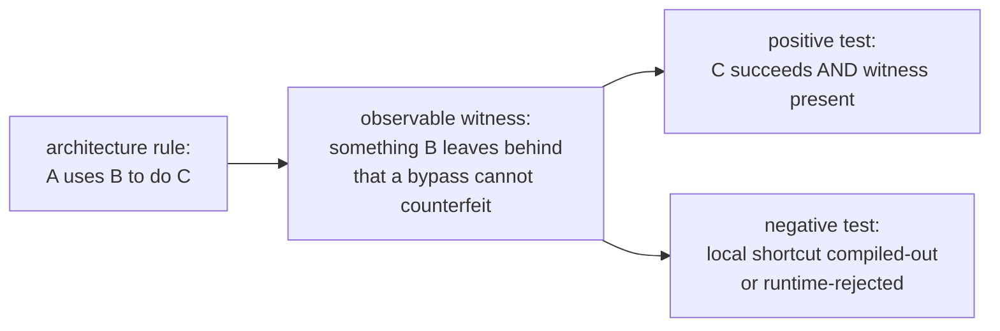
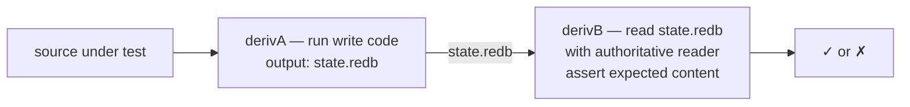

# Skill — architectural truth tests

*Tests that prove the architecture is followed, not just
that the behavior succeeds. The agent that writes the code
doesn't remember what they wrote yesterday — these tests are
what catches "looks aligned but secretly reimplemented the
component next door."*

---

## What this skill is for

Apply this skill when an architecture rule says *"component
A uses component B to do C"* and you're writing tests for C.

Behavior tests prove C succeeds. Architectural-truth tests
prove **B was the path** — not a local shortcut that
produces the same output. Without architectural-truth tests,
an agent (or a future agent without yesterday's memory) can
ship code that satisfies behavior while routing around the
intended component, and no test fires.

The discipline name comes from `reports/operator/69-architectural-truth-tests.md`,
which proposed the rule for the persona-messaging stack. This
skill lifts it to the workspace level because it applies to
every architectural assertion — wire contracts, storage
layers, actor protocols, deploy chains.

---

## The principle

> Write tests that prove the architecture, not only the
> behavior. If a rule says "component A uses component B to
> do C", the tests must make bypassing B fail even when C's
> visible output still succeeds.

> Treat architecture as a contract with **observable
> witnesses**: dependency graph, type identity, actor
> messages, storage table identity, wire format, state
> transitions, negative compile/runtime cases.

> Prefer weird tests over trusting implementation prose.
> Agents can write code that looks aligned while secretly
> reimplementing the component next door. A correct test
> forces the intended path to be the only passing path.

> Every architectural invariant gets at least one witness
> test: one **positive** test proving the intended
> component is used, and one **negative** test proving the
> tempting shortcut fails.

---

## The shape



The hardest step is naming the **witness** — the artifact
that B necessarily produces and a bypass necessarily
doesn't. Witnesses are the load-bearing design move; the
tests are mechanical once the witness is named.

---

## Witness catalogue

Witnesses, by category:

| Witness | Catches |
|---|---|
| `cargo metadata` dependency assertions | wrong repo reached across a boundary (e.g. router pulls persona-wezterm directly) |
| `compile-fail` tests (`trybuild` or similar) | local duplicate types, string shortcuts, missing trait contracts |
| Fake actor handles | direct method calls disguised as actor code |
| Typed event traces (recorder actor) | wrong ordering of effects (e.g. push-before-commit) |
| redb fixture files (golden) | schema/version lies; missing table writes |
| rkyv byte fixtures (golden) | incompatible wire or disk encoding |
| Nix-chained derivations (next §) | runtime memory faking what should be filesystem |
| Process-tree witnesses (`/proc/<pid>/maps`, `lsof`) | claimed-open files that aren't open |
| Length-prefixed-frame parser on the wire | text/JSON snuck into a Signal channel |
| Schema-version golden | undocumented schema drift |
| Lock-file format witness | concurrent-edit fakery |
| Network namespace test | hidden cross-machine calls |

---

## Nix-chained tests — the strongest witness

When a rule says *"this writes to the database"*, the
strongest witness is to **separate the write from the read
across two Nix derivations**. The first derivation runs the
code-under-test and **emits the database file as its
output**. The second derivation **reads the file with the
authoritative reader** and asserts content. Nothing in-process
can fake the chain: if the database wasn't actually
written, the second derivation has nothing to read.



Why Nix specifically:

- **Pure environment.** No carry-over from the host's home
  directory, no `tmpfs` collusion between writer and reader.
  The writer's output is the *only* path between them.
- **Reproducible.** The chain runs the same way on every
  machine; the chain *is* the test, not a flaky integration
  script.
- **Witness output is content-addressed.** `state.redb`
  becomes a `/nix/store/<hash>-state.redb`; the hash
  changes if any byte of the database changes. Drift
  surfaces as a hash mismatch, not a flaky equality
  comparison in some test runner.
- **Reader can't be the writer's mock.** The reader
  derivation depends only on the file artifact — not on
  the writer's source — so the reader can't be tricked
  into accepting the writer's in-memory state.

Worked sketch in a flake:

```nix
{
  outputs = { self, nixpkgs, crane, fenix, flake-utils }:
    flake-utils.lib.eachDefaultSystem (system:
      let
        pkgs = import nixpkgs { inherit system; };
        # ... toolchain + craneLib ...
      in {
        checks = {
          # Step A: run the write code, output the redb file.
          message-stack-write = pkgs.runCommand "message-stack-write.redb" {
            buildInputs = [ self.packages.${system}.message-cli
                            self.packages.${system}.persona-router-daemon ];
          } ''
            export STATE_DIR=$out
            mkdir -p $STATE_DIR
            persona-router-daemon $STATE_DIR/router.sock &
            ROUTER_PID=$!
            sleep 1
            message designer "stack test message" \
              --socket $STATE_DIR/router.sock
            sleep 1
            kill $ROUTER_PID
            test -f $STATE_DIR/persona.redb
          '';

          # Step B: read the redb file with the authoritative
          # reader; assert the message landed.
          message-stack-read = pkgs.runCommand "message-stack-read" {
            buildInputs = [ self.packages.${system}.persona-sema-reader ];
          } ''
            persona-sema-reader \
              --db ${self.checks.${system}.message-stack-write}/persona.redb \
              --table messages \
              --expect "stack test message"
            touch $out
          '';
        };
      });
}
```

The chain forces:
- The writer **must actually create the file** (or step A
  fails).
- The reader **must actually find the message in the typed
  table** (or step B fails).
- The reader is a **separate binary** that depends only on
  the file artifact (so it can't share the writer's memory).

If the agent who wrote the router shortcuts persona-sema and
keeps state in memory, step A produces an empty file and
step B fails. The test names the failure as
`message-stack-read` failing on the witness file from
`message-stack-write`.

---

## Examples (from the persona messaging stack)

| Constraint | Architectural-truth test |
|---|---|
| `persona-sema` stores Signal types | Insert and read a `signal_persona::Message` through `persona_sema::MESSAGES`; no local message type can satisfy the table's value type. |
| Router commits before delivery | Use a fake store actor + fake harness actor; assert the router emits `CommitMessage` *before* any `DeliverToHarness`. |
| Router does not own terminal bytes | `cargo metadata` test fails if `persona-router/Cargo.toml` depends on `persona-wezterm`. |
| Signal is the component wire | Integration test sends a length-prefixed `signal_core::Frame`; NOTA strings on the component socket are rejected. |
| No private durable queue | Restart router after queued message; message survives only if committed through `persona-sema`, not if held in memory. (Nix-chained: writer derivation queues + crashes; reader derivation opens the redb and looks for the message.) |
| Sema schema guard is real | Existing redb file with no schema version hard-fails on `open_with_schema`; fresh file writes the version; mismatched version hard-fails. |
| Guard facts are pushed | Fake system actor sends focus/prompt facts; router retries only on pushed observation, never on a timer. (Witness: `tokio-test`'s clock-pause shows zero retries during paused time.) |
| Prompt guard blocks injection | Nonempty prompt fact → `DeliveryBlocked(PromptOccupied)` and **zero** terminal-input frames. |
| Focus guard blocks injection | Focused target → `DeliveryBlocked(HumanOwnsFocus)` and **zero** terminal-input frames. |
| Actor model is real | Router test communicates through actor handles/mailboxes only; direct method calls aren't part of the public API (compile-fail test against the bypass attempt). |

---

## Rule of thumb — the test name pattern

If the rule is *"X must go through Y"*, write a test named:

```text
x_cannot_happen_without_y
```

Then ensure `Y` leaves a typed witness that a bypass cannot
counterfeit. The test asserts: do the action, then check
the witness exists.

Examples:

```rust
#[test]
fn message_cannot_persist_without_persona_sema() { … }

#[test]
fn router_cannot_deliver_without_commit() { … }

#[test]
fn injection_cannot_happen_without_focus_observation() { … }
```

---

## When to use which witness

| Rule shape | Use |
|---|---|
| "Component A depends on B" | `cargo metadata` test |
| "Type X is the wire form" | rkyv byte fixture or compile-fail on alternative types |
| "Effects happen in order" | typed event trace via recorder actor |
| "State is durable across restarts" | nix-chained writer/reader derivations |
| "Inputs are pushed, not polled" | `tokio-test` clock pause + assert zero work |
| "Schema version is checked" | golden redb fixtures (one matching, one mismatched) |
| "Component A doesn't directly call C" | compile-fail test on the direct call + cargo metadata exclusion |
| "Actor X holds state Y" | snapshot the actor's `State` struct after stimulus |

---

## What this skill is NOT

- **Not a replacement for behavior tests.** Architectural
  witnesses + behavior tests are complementary; you need
  both. A test that proves the architecture but never asserts
  the user-facing outcome misses obvious bugs.
- **Not over-engineering for one-off scripts.** A short
  shell script doesn't need a witness; the witness budget
  is for the parts of the system the architecture rules
  govern.
- **Not silver-bullet anti-fraud.** A determined adversary
  can defeat any test. The witnesses make it *substantially
  harder* to ship architecture-violating code without
  catching it in review.

---

## Companion skills

This pairs with:
- `skills/contract-repo.md` §"Examples-first round-trip
  discipline" — the architectural-truth pattern for wire
  contracts (text + typed + round-trip = three layers of
  witness).
- `skills/rust-discipline.md` §"Tests live in separate
  files" — where the tests go.
- `skills/push-not-pull.md` — the `tokio-test`-clock-pause
  pattern for proving no-polling.
- `skills/nix-discipline.md` §"`nix flake check` is the
  canonical pre-commit runner" — the chained-derivation
  pattern lives in nix.

---

## See also

- `~/primary/reports/operator/69-architectural-truth-tests.md`
  — the originating proposal; the examples table here is
  lifted from there.
- `~/primary/skills/rust-discipline.md` §"Actors" — fake
  actor handles + sync-façade-on-State pattern.
- `~/primary/repos/lore/rust/testing.md` — `CARGO_BIN_EXE_*`
  for two-process integration tests.
- `~/primary/repos/lore/nix/integration-tests.md` — chained
  derivation patterns.
